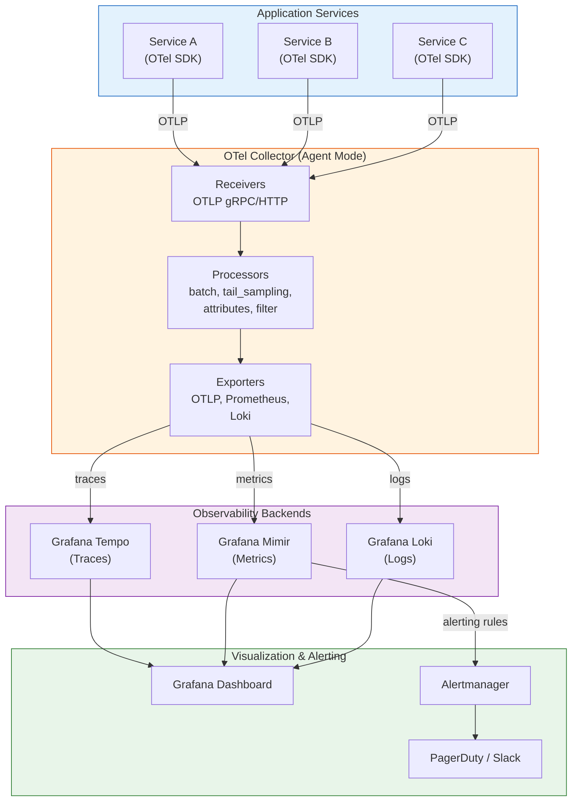
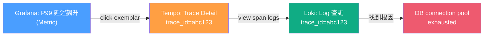
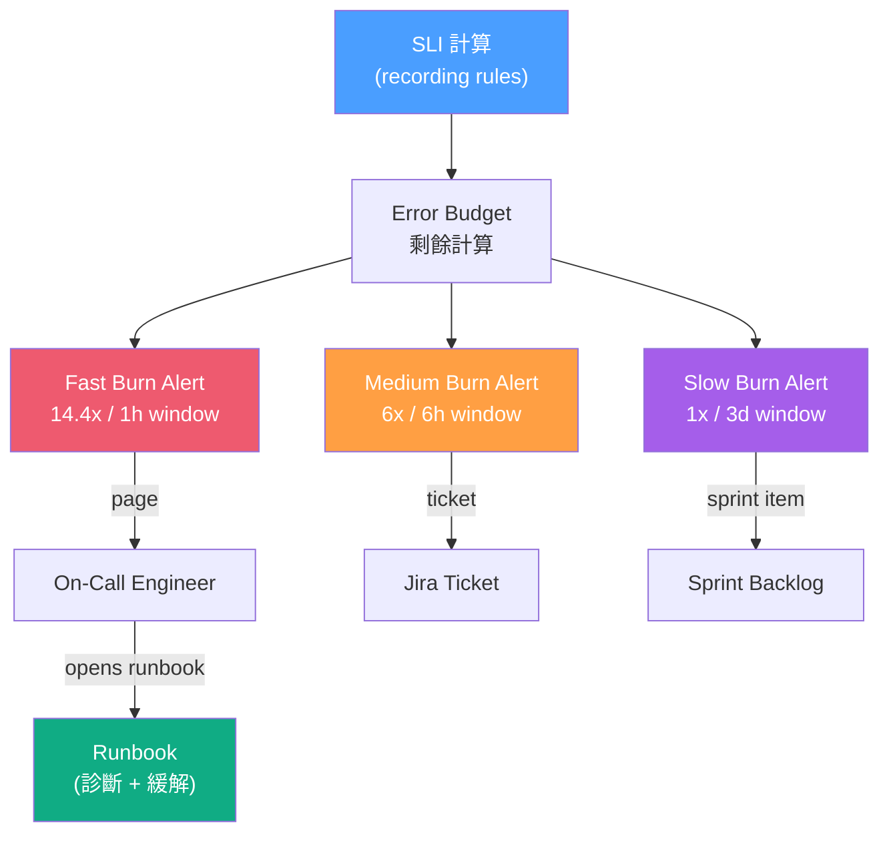

# Observability Strategy / 可觀測性統一策略

## Intent / 意圖

可觀測性（Observability）不是三套獨立工具的拼湊，而是一個**統一的策略**——透過 logs、traces、metrics 三大支柱的**關聯**（correlation），讓工程團隊能從任意一個信號出發，在數分鐘內完成問題的偵測、定位、診斷與修復。本篇建立在 Chapter 23（Structured Logging）、24（Distributed Tracing）、25（Metrics/SLO）的基礎之上，聚焦於如何用 OpenTelemetry 將三大支柱統一、設計 SLO-based alerting、控制可觀測性成本，以及建立有效的 on-call runbook 體系。

核心問題：**當生產事故發生時，團隊如何在 5 分鐘內從告警通知出發，透過 metric 定位異常時間窗口、透過 trace 找到慢 span、透過 log 讀取錯誤細節——而不是在三個不同的 UI 中手動拼湊 correlation ID？**

---

## Problem / 問題情境

**場景一：三個 Dashboard、三套 ID、三種查詢語言** — 電商平台使用 ELK 收 log、Jaeger 收 trace、Prometheus 收 metric。某日下午 P99 延遲飆升，SRE 在 Grafana 看到 metric 異常，切到 Jaeger 想找對應 trace 但沒有 correlation ID，只能用時間範圍模糊搜尋。找到可疑 trace 後想看詳細 log，但 ELK 的 trace_id 欄位從未被填入。最終花了 47 分鐘才定位到是下游 payment service 的資料庫連線池耗盡。若三大支柱共享 trace_id，SRE 從 metric → exemplar → trace → log 的鏈路只需 3 分鐘。

**場景二：Alert Fatigue 導致真正的事故被忽略** — 團隊設定了 200 條告警規則，大部分基於 cause（CPU > 80%、memory > 90%、goroutine 數 > 10000）。每天平均觸發 30 條告警，on-call 工程師逐漸麻木。某天凌晨 3 點觸發 "disk usage > 85%" 告警被靜音——但這次是真的在 2 小時內會填滿磁碟導致服務中斷。若改用 symptom-based alerting（SLO burn rate），告警數量降至每天 2-3 條，每條都代表使用者真正受影響。

**場景三：可觀測性成本失控** — 微服務架構有 50 個服務，每個都 100% 採樣 trace + DEBUG 級 log。月成本從 $5K 飆升到 $45K。CFO 要求砍半預算，但團隊不知道哪些數據可以安全丟棄。缺乏 tail-based sampling 策略和 log level 動態調整機制，只能在「全收」和「盲飛」之間二選一。

---

## Core Concepts / 核心概念

### Three Pillars Correlation / 三大支柱關聯

可觀測性的核心價值不在於個別支柱，而在於支柱之間的**關聯能力**：

- **Metric → Trace**：透過 exemplar（Prometheus 指標上附帶的 trace_id），從異常指標直接跳轉到代表性 trace。
- **Trace → Log**：trace_id 作為 structured log 的欄位，在 log 查詢介面中以 trace_id 過濾即可還原請求的完整日誌。
- **Log → Trace**：log 中嵌入 trace_id 的超連結，點擊即可跳轉到 tracing UI。
- **Trace → Metric**：從 trace 的 span attributes 聚合產生 RED metrics（span-based metrics），無需額外埋點。

### OpenTelemetry (OTel) / 開放遙測標準

CNCF 旗下的開放標準與 SDK 集合，統一 logs、traces、metrics 的 instrumentation API 和 data model。核心元件：

- **OTel SDK**：嵌入應用程式的 library，負責生成遙測資料。
- **OTel Collector**：獨立的 agent/gateway 程序，負責接收、處理（sampling、enrichment、filtering）、匯出遙測資料到各種 backend。
- **OTLP**（OpenTelemetry Protocol）：統一的傳輸協議，支援 gRPC 和 HTTP/protobuf。
- **Semantic Conventions**：標準化的 attribute 命名（如 `http.request.method`、`db.system`），確保跨語言、跨服務的一致性。

### SLO-Based Alerting / 基於 SLO 的告警

告警策略分為兩大類：

| 類型 | 觸發條件 | 範例 | 適用場景 |
|------|---------|------|---------|
| **Cause-based** | 基礎設施指標超標 | CPU > 80% | 容量規劃輔助，**不適合** paging |
| **Symptom-based** | 使用者體驗劣化 | Error budget burn rate > 14.4x | on-call paging |

Google SRE Workbook 推薦 **multi-window burn rate alerting**：
- **Fast burn**（14.4x, 1h window, 5m short window）：立即 page，2% 的 budget 已在 1 小時內消耗
- **Medium burn**（6x, 6h window, 30m short window）：當天處理
- **Slow burn**（1x, 3d window, 6h short window）：排入 sprint

### Exemplar / 指標範例

Prometheus 2.26+ 支援的功能——在 histogram/counter 的時間序列上附帶一個 trace_id 標籤。當 Grafana 顯示 P99 延遲峰值時，使用者可以點擊 exemplar 點直接跳轉到導致延遲的 trace。這是 metric → trace 關聯的關鍵機制。

### Tail-Based Sampling / 尾端採樣

與 head-based sampling（在 trace 開始時決定是否採樣）不同，tail-based sampling 在 trace **完成後**才決定是否保留。OTel Collector 的 `tail_sampling` processor 可根據以下條件決策：

- **錯誤 trace**：必定保留
- **高延遲 trace**（> P95）：必定保留
- **正常 trace**：按比例採樣（如 1%）

這確保「有趣的」trace 100% 保留，同時大幅降低正常流量的儲存成本。

### Dashboard Design Principles / 儀表板設計原則

遵循 USE（Utilization-Saturation-Errors）和 RED（Rate-Errors-Duration）方法論，分層設計：

- **L0 — Service Overview**：SLO 燃燒率、error budget 剩餘、核心 RED 指標。一眼判斷「系統是否健康」。
- **L1 — Service Detail**：按 endpoint 拆分的 RED、依賴服務健康度、資源 USE 指標。
- **L2 — Infrastructure**：CPU、memory、disk、network 等基礎設施指標。
- **L3 — Debug**：trace search、log search、profile 連結。

### On-Call Runbook / 值班手冊

每條告警規則都必須連結一份 runbook，包含：
- **Alert 語義**：這個告警代表什麼使用者影響？
- **診斷步驟**：按順序檢查的 dashboard/查詢
- **緩解措施**：立即可執行的降級操作
- **升級路徑**：何時應升級至下一層 on-call

### Observability Cost Management / 可觀測性成本管理

成本公式：`Cost = Volume x Retention x Tier`。降低成本的策略：

- **Sampling**：tail-based sampling 保留重要 trace，丟棄正常 trace
- **Log Level 動態調整**：正常時 INFO，事故時動態切 DEBUG（透過 config server 或 feature flag）
- **Metric Cardinality 控制**：限制 label 的 cardinality（避免 user_id 作為 label）
- **Tiered Storage**：熱資料（7 天）在 SSD，溫資料（30 天）在 HDD，冷資料（90 天）在 object storage
- **Aggregation**：將高精度 metric（10s interval）在 7 天後降採樣為 5m interval

---

## Architecture / 架構

### 三大支柱統一架構（OpenTelemetry Collector Pipeline）



### Metric → Trace → Log 關聯流程



### SLO Burn Rate Alerting Architecture



---

## How It Works / 運作原理

### 從請求進入到遙測資料落地的完整流程

1. **請求進入 Service A** — OTel SDK 的 HTTP middleware 自動建立 root span，生成 `trace_id`（128-bit random ID）和 `span_id`。trace_id 同時注入到 structured logger 的 context 中。

2. **Trace Context Propagation** — Service A 呼叫 Service B 時，OTel SDK 將 `traceparent` header（W3C Trace Context 標準）附加到 outgoing HTTP request。格式：`00-{trace_id}-{parent_span_id}-{flags}`。

3. **Service B 接收並延續 trace** — OTel SDK 解析 `traceparent`，建立 child span（繼承同一個 trace_id）。所有在此 span 內產生的 log 自動攜帶 trace_id。

4. **Span 產生 Metric（Span Metrics Connector）** — OTel Collector 的 `spanmetrics` connector 從 span 自動聚合出 RED metrics：`calls_total`（rate）、`duration_bucket`（duration histogram）、按 `status_code` 分的 error rate。這消除了手動埋 metric 的需求。

5. **Tail-Based Sampling 決策** — OTel Collector 等待 trace 的所有 span 到齊（configurable wait time），然後根據 policy 決定是否保留：
   - 含 error span → 保留
   - duration > 2s → 保留
   - 正常 trace → 1% sampling

6. **資料匯出到 Backend** — Traces 送到 Tempo、Metrics 送到 Mimir（或 Prometheus）、Logs 送到 Loki。三者都以 trace_id 作為共同的關聯鍵。

7. **Exemplar 記錄** — 當 histogram 記錄一個觀測值時，OTel SDK 將當前的 trace_id 作為 exemplar 附加到 metric sample。Grafana 在 metric panel 上顯示 exemplar 點，點擊即可跳轉到 Tempo。

8. **告警觸發** — Prometheus/Mimir 的 alerting rules 計算 SLO burn rate。當 fast burn > 14.4x 且持續 2 分鐘，觸發告警送到 Alertmanager → PagerDuty → on-call 工程師手機。

9. **On-Call 診斷流程** — 工程師收到告警，打開 runbook 中的 Grafana dashboard 連結。在 metric panel 上看到異常時段的 exemplar 點，點擊進入 trace detail。在 trace 的 waterfall view 中找到最慢的 span（DB query 3.2s），點擊 "View Logs" 看到 `connection pool exhausted` 的 log。

10. **緩解與後續** — 工程師執行 runbook 中的緩解步驟（增加 connection pool size），確認 burn rate 恢復正常。事後在 postmortem 中記錄根因和永久修復方案。

---

## Rust 實作

完整的 OpenTelemetry 設定：Axum 0.8 + tracing + metrics，三大支柱統一輸出到 OTLP。

```rust
// observability_unified.rs — Axum 0.8 + OpenTelemetry (traces + metrics + logs)
// Cargo.toml dependencies:
// axum = "0.8"
// tokio = { version = "1", features = ["full"] }
// serde = { version = "1", features = ["derive"] }
// serde_json = "1"
// tracing = "0.1"
// tracing-subscriber = { version = "0.3", features = ["env-filter", "json"] }
// tracing-opentelemetry = "0.29"
// opentelemetry = "0.28"
// opentelemetry_sdk = { version = "0.28", features = ["rt-tokio"] }
// opentelemetry-otlp = { version = "0.28", features = ["tonic"] }
// opentelemetry-semantic-conventions = "0.28"
// tower-http = { version = "0.6", features = ["trace"] }
// uuid = { version = "1", features = ["v4"] }
// prometheus = "0.13"

use axum::{
    body::Body,
    extract::State,
    http::{Request, StatusCode},
    middleware::{self, Next},
    response::{IntoResponse, Response},
    routing::get,
    Json, Router,
};
use opentelemetry::{global, trace::TracerProvider as _, KeyValue};
use opentelemetry_otlp::WithExportConfig;
use opentelemetry_sdk::{
    metrics::SdkMeterProvider,
    trace::{RandomIdGenerator, Sampler, SdkTracerProvider},
    Resource,
};
use prometheus::{Encoder, HistogramOpts, HistogramVec, IntCounterVec, Registry, TextEncoder};
use serde::Serialize;
use std::{sync::Arc, time::Instant};
use tracing::{info, info_span, instrument, warn, Instrument};
use tracing_subscriber::{layer::SubscriberExt, util::SubscriberInitExt, EnvFilter};

// ---------- Telemetry Initialization ----------

fn init_tracer_provider() -> SdkTracerProvider {
    let exporter = opentelemetry_otlp::SpanExporter::builder()
        .with_tonic()
        .with_endpoint("http://localhost:4317")
        .build()
        .expect("Failed to create OTLP span exporter");

    SdkTracerProvider::builder()
        .with_batch_exporter(exporter)
        .with_sampler(Sampler::TraceIdRatioBased(1.0)) // 生產環境用 tail-sampling 在 Collector
        .with_id_generator(RandomIdGenerator::default())
        .with_resource(Resource::builder().with_service_name("order-service").build())
        .build()
}

fn init_meter_provider() -> SdkMeterProvider {
    let exporter = opentelemetry_otlp::MetricExporter::builder()
        .with_tonic()
        .with_endpoint("http://localhost:4317")
        .build()
        .expect("Failed to create OTLP metric exporter");

    SdkMeterProvider::builder()
        .with_periodic_exporter(exporter)
        .with_resource(Resource::builder().with_service_name("order-service").build())
        .build()
}

fn init_telemetry() -> SdkTracerProvider {
    let tracer_provider = init_tracer_provider();
    let meter_provider = init_meter_provider();

    // 設定 global providers
    global::set_tracer_provider(tracer_provider.clone());
    global::set_meter_provider(meter_provider);

    // tracing-subscriber 整合：JSON log + OTel trace layer
    let otel_trace_layer = tracing_opentelemetry::layer()
        .with_tracer(tracer_provider.tracer("order-service"));

    tracing_subscriber::registry()
        .with(EnvFilter::try_from_default_env().unwrap_or_else(|_| EnvFilter::new("info")))
        .with(tracing_subscriber::fmt::layer().json().with_target(true))
        .with(otel_trace_layer)
        .init();

    tracer_provider
}

// ---------- Application Metrics (Prometheus) ----------

#[derive(Clone)]
struct AppMetrics {
    registry: Registry,
    http_requests_total: IntCounterVec,
    http_request_duration_seconds: HistogramVec,
}

impl AppMetrics {
    fn new() -> Self {
        let registry = Registry::new();
        let http_requests_total = IntCounterVec::new(
            prometheus::Opts::new("http_requests_total", "Total HTTP requests"),
            &["method", "path", "status_code"],
        )
        .unwrap();
        let http_request_duration_seconds = HistogramVec::new(
            HistogramOpts::new("http_request_duration_seconds", "HTTP request duration")
                .buckets(vec![
                    0.005, 0.01, 0.025, 0.05, 0.1, 0.25, 0.5, 1.0, 2.5, 5.0, 10.0,
                ]),
            &["method", "path"],
        )
        .unwrap();
        registry
            .register(Box::new(http_requests_total.clone()))
            .unwrap();
        registry
            .register(Box::new(http_request_duration_seconds.clone()))
            .unwrap();
        Self {
            registry,
            http_requests_total,
            http_request_duration_seconds,
        }
    }
}

// ---------- Middleware: Metrics + Trace Context ----------

async fn metrics_and_trace_middleware(
    State(metrics): State<AppMetrics>,
    req: Request<Body>,
    next: Next,
) -> Response {
    let method = req.method().to_string();
    let path = req
        .uri()
        .path()
        .to_string();
    let start = Instant::now();

    // 建立 span，自動關聯到 OTel trace
    let span = info_span!(
        "http_request",
        http.method = %method,
        http.route = %path,
        otel.kind = "server",
    );

    let response = next.run(req).instrument(span).await;

    let status = response.status().as_u16().to_string();
    let duration = start.elapsed().as_secs_f64();

    metrics
        .http_requests_total
        .with_label_values(&[&method, &path, &status])
        .inc();
    metrics
        .http_request_duration_seconds
        .with_label_values(&[&method, &path])
        .observe(duration);

    // Structured log 自動包含 trace_id（由 tracing-opentelemetry 注入）
    info!(
        http.method = %method,
        http.route = %path,
        http.status_code = %status,
        duration_ms = duration * 1000.0,
        "request completed"
    );

    response
}

// ---------- Handlers ----------

#[derive(Serialize)]
struct Order {
    order_id: String,
    status: String,
    amount: f64,
}

#[instrument(skip_all, fields(order_id = %order_id))]
async fn get_order(
    axum::extract::Path(order_id): axum::extract::Path<String>,
) -> Result<Json<Order>, StatusCode> {
    info!(order_id = %order_id, "fetching order from database");

    // 模擬資料庫查詢（建立子 span）
    let order = fetch_order_from_db(&order_id).await?;

    info!(order_id = %order_id, status = %order.status, "order fetched successfully");
    Ok(Json(order))
}

#[instrument(skip_all, fields(order_id = %order_id))]
async fn fetch_order_from_db(order_id: &str) -> Result<Order, StatusCode> {
    // 模擬資料庫延遲
    let delay = if order_id == "slow" { 800 } else { 30 };
    tokio::time::sleep(std::time::Duration::from_millis(delay)).await;

    if order_id == "error" {
        warn!(order_id = %order_id, "order not found in database");
        return Err(StatusCode::NOT_FOUND);
    }

    Ok(Order {
        order_id: order_id.to_string(),
        status: "confirmed".to_string(),
        amount: 99.99,
    })
}

async fn health() -> &'static str {
    "OK"
}

async fn metrics_handler(State(metrics): State<AppMetrics>) -> impl IntoResponse {
    let encoder = TextEncoder::new();
    let mut buffer = Vec::new();
    encoder
        .encode(&metrics.registry.gather(), &mut buffer)
        .unwrap();
    (
        StatusCode::OK,
        [("content-type", encoder.format_type())],
        buffer,
    )
}

// ---------- Main ----------

#[tokio::main]
async fn main() {
    let tracer_provider = init_telemetry();
    let app_metrics = AppMetrics::new();

    let app = Router::new()
        .route("/orders/{order_id}", get(get_order))
        .route("/health", get(health))
        .route("/metrics", get(metrics_handler))
        .layer(middleware::from_fn_with_state(
            app_metrics.clone(),
            metrics_and_trace_middleware,
        ))
        .with_state(app_metrics);

    info!("starting order-service on :3000");
    let listener = tokio::net::TcpListener::bind("0.0.0.0:3000").await.unwrap();
    axum::serve(listener, app).await.unwrap();

    // Graceful shutdown: flush pending traces and metrics
    tracer_provider.shutdown().expect("tracer shutdown failed");
}

// Output:
// $ curl localhost:3000/orders/abc123
// {"order_id":"abc123","status":"confirmed","amount":99.99}
//
// Structured log output (JSON):
// {"timestamp":"...","level":"INFO","fields":{"message":"request completed",
//   "http.method":"GET","http.route":"/orders/abc123","http.status_code":"200",
//   "duration_ms":31.2},"target":"observability_unified",
//   "span":{"order_id":"abc123"},"spans":[{"name":"http_request"}]}
//
// OTel traces sent to Collector (trace_id visible in log + trace backend)
// Prometheus metrics at /metrics:
// http_requests_total{method="GET",path="/orders/abc123",status_code="200"} 1
// http_request_duration_seconds_bucket{method="GET",path="/orders/abc123",le="0.05"} 1
```

---

## Go 實作

OpenTelemetry setup with slog + OTel SDK，三大支柱統一輸出。

```go
// observability_unified.go — Go 1.24+ / net/http + OpenTelemetry SDK + slog
package main

import (
	"context"
	"encoding/json"
	"fmt"
	"log/slog"
	"net/http"
	"os"
	"strconv"
	"time"

	"go.opentelemetry.io/otel"
	"go.opentelemetry.io/otel/attribute"
	"go.opentelemetry.io/otel/exporters/otlp/otlptrace/otlptracegrpc"
	otelmetric "go.opentelemetry.io/otel/exporters/otlp/otlpmetric/otlpmetricgrpc"
	"go.opentelemetry.io/otel/metric"
	"go.opentelemetry.io/otel/propagation"
	sdkmetric "go.opentelemetry.io/otel/sdk/metric"
	"go.opentelemetry.io/otel/sdk/resource"
	sdktrace "go.opentelemetry.io/otel/sdk/trace"
	semconv "go.opentelemetry.io/otel/semconv/v1.24.0"
	"go.opentelemetry.io/otel/trace"
)

// ---------- Telemetry Initialization ----------

func initTracerProvider(ctx context.Context) (*sdktrace.TracerProvider, error) {
	exporter, err := otlptracegrpc.New(ctx,
		otlptracegrpc.WithEndpoint("localhost:4317"),
		otlptracegrpc.WithInsecure(),
	)
	if err != nil {
		return nil, fmt.Errorf("creating trace exporter: %w", err)
	}

	res := resource.NewWithAttributes(
		semconv.SchemaURL,
		semconv.ServiceNameKey.String("order-service"),
		semconv.ServiceVersionKey.String("1.0.0"),
	)

	tp := sdktrace.NewTracerProvider(
		sdktrace.WithBatcher(exporter),
		sdktrace.WithResource(res),
		sdktrace.WithSampler(sdktrace.AlwaysSample()), // 生產環境用 Collector tail-sampling
	)
	otel.SetTracerProvider(tp)
	otel.SetTextMapPropagator(propagation.NewCompositeTextMapPropagator(
		propagation.TraceContext{},
		propagation.Baggage{},
	))
	return tp, nil
}

func initMeterProvider(ctx context.Context) (*sdkmetric.MeterProvider, error) {
	exporter, err := otelmetric.New(ctx,
		otelmetric.WithEndpoint("localhost:4317"),
		otelmetric.WithInsecure(),
	)
	if err != nil {
		return nil, fmt.Errorf("creating metric exporter: %w", err)
	}

	mp := sdkmetric.NewMeterProvider(
		sdkmetric.WithReader(sdkmetric.NewPeriodicReader(exporter)),
	)
	otel.SetMeterProvider(mp)
	return mp, nil
}

// ---------- Trace-Aware slog Handler ----------

// traceHandler 在每條 log 中自動注入 trace_id 和 span_id
type traceHandler struct {
	inner slog.Handler
}

func newTraceHandler(inner slog.Handler) *traceHandler {
	return &traceHandler{inner: inner}
}

func (h *traceHandler) Enabled(ctx context.Context, level slog.Level) bool {
	return h.inner.Enabled(ctx, level)
}

func (h *traceHandler) Handle(ctx context.Context, record slog.Record) error {
	spanCtx := trace.SpanContextFromContext(ctx)
	if spanCtx.IsValid() {
		record.AddAttrs(
			slog.String("trace_id", spanCtx.TraceID().String()),
			slog.String("span_id", spanCtx.SpanID().String()),
		)
	}
	return h.inner.Handle(ctx, record)
}

func (h *traceHandler) WithAttrs(attrs []slog.Attr) slog.Handler {
	return &traceHandler{inner: h.inner.WithAttrs(attrs)}
}

func (h *traceHandler) WithGroup(name string) slog.Handler {
	return &traceHandler{inner: h.inner.WithGroup(name)}
}

// ---------- Observability Middleware ----------

type observabilityMiddleware struct {
	tracer          trace.Tracer
	requestCounter  metric.Int64Counter
	requestDuration metric.Float64Histogram
	logger          *slog.Logger
}

func newObservabilityMiddleware(logger *slog.Logger) *observabilityMiddleware {
	tracer := otel.Tracer("http-server")
	meter := otel.Meter("http-server")

	requestCounter, _ := meter.Int64Counter("http.server.request_count",
		metric.WithDescription("Total HTTP requests"),
	)
	requestDuration, _ := meter.Float64Histogram("http.server.duration",
		metric.WithDescription("HTTP request duration in seconds"),
		metric.WithUnit("s"),
	)

	return &observabilityMiddleware{
		tracer:          tracer,
		requestCounter:  requestCounter,
		requestDuration: requestDuration,
		logger:          logger,
	}
}

type statusRecorder struct {
	http.ResponseWriter
	code int
}

func (sr *statusRecorder) WriteHeader(code int) {
	sr.code = code
	sr.ResponseWriter.WriteHeader(code)
}

func (om *observabilityMiddleware) wrap(next http.Handler) http.Handler {
	return http.HandlerFunc(func(w http.ResponseWriter, r *http.Request) {
		// 從 incoming headers 提取 trace context（W3C Trace Context propagation）
		ctx := otel.GetTextMapPropagator().Extract(r.Context(), propagation.HeaderCarrier(r.Header))

		// 建立 server span
		ctx, span := om.tracer.Start(ctx, r.Pattern,
			trace.WithSpanKind(trace.SpanKindServer),
			trace.WithAttributes(
				semconv.HTTPRequestMethodKey.String(r.Method),
				semconv.URLPath(r.URL.Path),
			),
		)
		defer span.End()

		start := time.Now()
		recorder := &statusRecorder{ResponseWriter: w, code: 200}
		next.ServeHTTP(recorder, r.WithContext(ctx))
		duration := time.Since(start)

		// 設定 span attributes
		span.SetAttributes(attribute.Int("http.status_code", recorder.code))

		// 記錄 OTel metrics
		attrs := metric.WithAttributes(
			attribute.String("method", r.Method),
			attribute.String("path", r.Pattern),
			attribute.String("status_code", strconv.Itoa(recorder.code)),
		)
		om.requestCounter.Add(ctx, 1, attrs)
		om.requestDuration.Record(ctx, duration.Seconds(), attrs)

		// Structured log（自動包含 trace_id + span_id）
		om.logger.InfoContext(ctx, "request completed",
			slog.String("method", r.Method),
			slog.String("path", r.URL.Path),
			slog.Int("status_code", recorder.code),
			slog.Float64("duration_ms", float64(duration.Milliseconds())),
		)
	})
}

// ---------- Handlers ----------

type Order struct {
	OrderID string  `json:"order_id"`
	Status  string  `json:"status"`
	Amount  float64 `json:"amount"`
}

func getOrder(logger *slog.Logger) http.HandlerFunc {
	return func(w http.ResponseWriter, r *http.Request) {
		ctx := r.Context()
		orderID := r.PathValue("id")

		// 建立子 span：database query
		tracer := otel.Tracer("order-handler")
		ctx, dbSpan := tracer.Start(ctx, "db.query.order",
			trace.WithAttributes(attribute.String("order_id", orderID)),
		)

		logger.InfoContext(ctx, "fetching order from database",
			slog.String("order_id", orderID),
		)

		// 模擬資料庫延遲
		delay := 30 * time.Millisecond
		if orderID == "slow" {
			delay = 800 * time.Millisecond
		}
		time.Sleep(delay)
		dbSpan.End()

		if orderID == "error" {
			logger.WarnContext(ctx, "order not found",
				slog.String("order_id", orderID),
			)
			http.Error(w, `{"error":"not found"}`, http.StatusNotFound)
			return
		}

		order := Order{OrderID: orderID, Status: "confirmed", Amount: 99.99}
		w.Header().Set("Content-Type", "application/json")
		json.NewEncoder(w).Encode(order)
	}
}

func main() {
	ctx := context.Background()

	// 初始化 OTel providers
	tp, err := initTracerProvider(ctx)
	if err != nil {
		fmt.Fprintf(os.Stderr, "init tracer: %v\n", err)
		os.Exit(1)
	}
	defer func() { _ = tp.Shutdown(ctx) }()

	mp, err := initMeterProvider(ctx)
	if err != nil {
		fmt.Fprintf(os.Stderr, "init meter: %v\n", err)
		os.Exit(1)
	}
	defer func() { _ = mp.Shutdown(ctx) }()

	// 初始化 trace-aware logger
	jsonHandler := slog.NewJSONHandler(os.Stdout, &slog.HandlerOptions{Level: slog.LevelInfo})
	logger := slog.New(newTraceHandler(jsonHandler))
	slog.SetDefault(logger)

	// 建立 observability middleware
	obs := newObservabilityMiddleware(logger)

	// 路由
	mux := http.NewServeMux()
	mux.HandleFunc("GET /orders/{id}", getOrder(logger))
	mux.HandleFunc("GET /health", func(w http.ResponseWriter, r *http.Request) {
		w.Write([]byte("OK"))
	})

	server := &http.Server{
		Addr:    ":3000",
		Handler: obs.wrap(mux),
	}

	logger.Info("starting order-service", slog.String("addr", ":3000"))
	if err := server.ListenAndServe(); err != nil {
		logger.Error("server error", slog.String("error", err.Error()))
	}
}

// Output:
// $ curl localhost:3000/orders/abc123
// {"order_id":"abc123","status":"confirmed","amount":99.99}
//
// Structured log output (JSON, 自動包含 trace_id):
// {"time":"...","level":"INFO","msg":"request completed",
//   "method":"GET","path":"/orders/abc123","status_code":200,
//   "duration_ms":31,"trace_id":"a1b2c3d4...","span_id":"e5f6a7b8..."}
//
// OTel traces and metrics sent to Collector via OTLP gRPC
```

---

## Rust vs Go 對照表

| 比較維度 | Rust | Go |
|---------|------|-----|
| **OTel SDK 整合** | `tracing` + `tracing-opentelemetry` 無縫橋接，零成本抽象 | `go.opentelemetry.io/otel` 官方 SDK，API 穩定但需手動 span management |
| **Log-Trace 關聯** | `tracing` 的 span context 自動傳遞到所有 log macro，開箱即用 | 需自訂 `slog.Handler` 包裝，從 `context.Context` 提取 trace_id 注入 log |
| **Metric 類型** | `prometheus` crate 提供 Counter/Gauge/Histogram；OTel metric SDK 也可用 | `prometheus/client_golang` 或 OTel metric SDK 二選一，API 類似 |
| **Context Propagation** | `tracing::Span` 透過 `Instrument` trait 自動傳播，無需顯式傳遞 | 依賴 `context.Context` 顯式參數傳遞，每個函數簽名都需要 `ctx` |
| **Graceful Shutdown** | 需手動呼叫 `tracer_provider.shutdown()`，搭配 tokio signal handling | 同樣需要 `tp.Shutdown(ctx)`，通常搭配 `signal.NotifyContext` |
| **效能開銷** | 靜態 dispatch + 零成本 tracing level 過濾，production overhead 極低 | 動態 dispatch + interface 調用，overhead 略高但在可接受範圍 |

---

## When to Use / 適用場景

- **微服務架構的統一可觀測性**：當系統超過 5 個服務，手動關聯 log/trace/metric 變得不切實際。OpenTelemetry 提供統一的 instrumentation 和 correlation，大幅縮短 MTTR（Mean Time to Recovery）。

- **SLO-Driven 組織轉型**：從「CPU 高了就告警」的 cause-based 思維轉向「使用者體驗劣化才告警」的 symptom-based 思維。透過 error budget 和 burn rate alerting，讓可靠性與迭代速度達到平衡。

- **可觀測性成本優化**：當月帳單超過預算，需要在不犧牲事故偵測能力的前提下降低數據量。tail-based sampling + dynamic log level + metric cardinality 控制是必要手段。

---

## When NOT to Use / 不適用場景

- **單體應用 + 單一服務**：只有一個服務時，structured logging + basic metrics 就足夠。full OTel pipeline 引入的複雜度（Collector 部署、OTLP 端點管理）不值得投資。

- **過早優化可觀測性基礎設施**：在服務數量 < 3、RPS < 100 的早期階段，直接用 Prometheus + Grafana + 簡單的 JSON log 就好。等團隊明確感受到 log-trace 關聯困難時再導入 OTel。

- **將 OTel 作為業務 analytics 工具**：OTel 設計目標是系統可觀測性而非業務 BI。使用者行為分析、漏斗轉換率等應使用專門的 analytics pipeline（Segment、Amplitude）。

---

## Real-World Examples / 真實世界案例

### Shopify — 從自建到 OpenTelemetry 的遷移

Shopify 的微服務架構有數千個服務。早期各團隊自行選擇 instrumentation library，導致：不同語言（Ruby、Go、Rust）的 trace format 不一致、log 與 trace 無法關聯、新人需要學習多套工具。2022 年 Shopify 全面遷移到 OpenTelemetry，統一所有語言的 instrumentation API。遷移策略是先在 OTel Collector 層做轉換（接收舊 format、匯出新 format），應用層逐步替換 SDK。遷移完成後，MTTR 從平均 45 分鐘降至 12 分鐘。

### Google SRE — Multi-Window Burn Rate Alerting

Google 在 SRE Workbook 中公開了其內部使用的 alerting 策略。核心觀念是「告警應該對應使用者影響，而非基礎設施指標」。Google 的 Monarch monitoring 系統使用多窗口 burn rate 來決定告警嚴重程度。這個方法被 Prometheus 社群採納，成為事實上的 SLO alerting 標準。

### eBay — Observability Cost Reduction

eBay 在 2023 年分享了將可觀測性成本降低 60% 的策略：(1) tail-based sampling 將 trace 儲存量降低 95%，但保留所有 error 和 high-latency trace；(2) log 聚合在 Collector 層進行 pattern matching，相同 pattern 的 log 只保留計數和一個代表性範例；(3) metric cardinality 控制，禁止使用 user_id 或 request_id 作為 label。

---

## Interview Questions / 面試常見問題

### Q1: 可觀測性的三大支柱各自的優缺點是什麼？什麼時候應該用哪一個？

**回答**：

**Logs（日誌）**：
- 優點：最詳細的上下文資訊，可包含任意結構化欄位；除錯時最有用。
- 缺點：量最大、成本最高；高 cardinality 搜尋效能差；無法直觀呈現跨服務請求路徑。
- 使用時機：需要了解單一事件的完整細節（錯誤堆疊、請求/回應內容）。

**Traces（追蹤）**：
- 優點：天然呈現跨服務的因果關係和延遲瀑布圖；定位慢 span 最直觀。
- 缺點：需要完整的 context propagation 才有意義；100% 採樣成本高；不適合聚合統計。
- 使用時機：定位分散式系統中的延遲瓶頸和錯誤傳播路徑。

**Metrics（指標）**：
- 優點：天生適合聚合和告警；儲存成本最低（時間序列壓縮）；查詢效能最佳。
- 缺點：只有統計資訊，無法看到個別請求細節；cardinality 限制。
- 使用時機：監控系統整體健康狀態、設定 SLO、觸發告警。

三者的關聯才是真正的價值：metric 發現異常 → exemplar 跳到 trace → trace 中找到問題 span → log 看到錯誤細節。

### Q2: 請解釋 SLO burn rate alerting 的原理。為什麼比傳統的 threshold alerting 好？

**回答**：

傳統 threshold alerting（如 error rate > 5%）的問題：(1) 閾值難以設定——5% 對於低流量服務可能是一個錯誤請求，對高流量服務可能是數萬個失敗；(2) 不考慮持續時間——短暫的 spike 和持續的劣化觸發相同的告警。

Burn rate alerting 基於 **error budget 消耗速度**：
- SLO 99.9% → 月 error budget 0.1%（43 分鐘）
- Burn rate = 實際錯誤率 / 允許錯誤率
- Burn rate 1x = 剛好在月底耗盡 budget
- Burn rate 14.4x = 在 2 天內耗盡 → 需要立即處理

多窗口策略（long window + short window）避免誤報：
- Long window 確認趨勢（如 1 小時）
- Short window 確認仍在發生（如 5 分鐘）
- 兩者都超標才觸發告警

優點：(1) 告警語義清晰——「使用者體驗正在劣化，且速度足以在 X 時間內耗盡 budget」；(2) 自動適應流量規模；(3) 告警數量大幅減少，每條都值得處理。

### Q3: Tail-based sampling 和 head-based sampling 的差異是什麼？各自的取捨？

**回答**：

**Head-based sampling**：在 trace 的第一個 span（root span）建立時就決定是否採樣。決策會透過 trace context 傳播到所有下游服務。

- 優點：簡單、不需要集中式決策、不增加延遲。
- 缺點：決策時缺乏資訊——不知道這個 trace 最終會不會出錯或延遲高。如果設 10% 採樣率，90% 的 error trace 也會被丟棄。

**Tail-based sampling**：在 OTel Collector 中等待 trace 的所有 span 到齊後，根據完整資訊決定是否保留。

- 優點：可以根據 error、latency、特定 attribute 等條件精確保留重要 trace。
- 缺點：需要集中式的 Collector（或 Collector cluster）；需要等待時間（通常 30-60 秒）；記憶體消耗較高（暫存 pending trace）。

生產環境的最佳實踐是 **tail-based sampling**：所有 error trace 和 high-latency trace 100% 保留，正常 trace 按比例採樣（如 1-5%）。這能在大幅降低儲存成本的同時，保證所有「有趣的」trace 不會遺失。

### Q4: 如何設計一個好的 on-call runbook？

**回答**：

好的 runbook 應該讓凌晨 3 點被叫醒、腦袋不清醒的 on-call 工程師也能在 5-10 分鐘內完成初步診斷和緩解。結構如下：

1. **Alert 語義**（一句話）：這個告警意味著什麼使用者影響？例如「結帳成功率低於 SLO，約 X% 的使用者無法完成付款」。

2. **嚴重程度判斷**：如何確認真的有問題（排除 false positive）？提供 Grafana dashboard 連結，標注關鍵面板。

3. **診斷步驟**（按順序）：
   - Step 1：檢查 Dashboard A 的 Panel B，若 metric 值 > N 代表 XX
   - Step 2：在 Tempo 搜尋 error trace，觀察哪個 span 失敗
   - Step 3：在 Loki 以 trace_id 查詢詳細 log

4. **緩解措施**（立即可執行）：
   - 重啟 Pod：`kubectl rollout restart deployment/xxx`
   - 增加 connection pool：修改 ConfigMap 並 apply
   - 開啟 circuit breaker：翻轉 feature flag

5. **升級路徑**：15 分鐘無法緩解 → 叫醒 secondary on-call；30 分鐘 → 啟動 incident commander。

關鍵原則：runbook 是「操作手冊」而非「知識文件」——每一步都是可執行的動作，而非解釋原理。

### Q5: 如何控制可觀測性的成本？

**回答**：

可觀測性成本公式：`Cost = Data Volume x Retention x Storage Tier`。控制策略：

1. **減少 Volume**：
   - Tail-based sampling（trace 儲存量降低 90-95%）
   - Log aggregation（相同 pattern 只保留計數 + 範例）
   - Metric cardinality 限制（禁止高 cardinality label 如 user_id）

2. **縮短 Retention**：
   - 熱資料（7 天）：全精度，SSD
   - 溫資料（30 天）：降採樣 metric（5m interval），object storage
   - 冷資料（90 天）：僅保留 aggregated metric，歸檔 log

3. **降低 Storage Tier 成本**：
   - 使用 object storage（S3/GCS）作為 long-term backend
   - Grafana Tempo 和 Loki 原生支援 object storage backend

4. **動態調整**：
   - 正常時 log level = INFO，事故時動態切 DEBUG
   - 正常時 trace sampling = 1%，事故時切 100%（透過 OTel Collector 的 remote config）

5. **治理**：
   - 定期 review metric cardinality（前 20 高 cardinality 的 metric）
   - 設定每個 team 的 ingestion quota
   - 自動化刪除超過 retention policy 的資料

---

## Pitfalls / 常見陷阱

### 1. Metric Cardinality Explosion（通用）

**錯誤**：將 user_id、request_id 或 URL path parameter 作為 metric label。

```
http_requests_total{user_id="u1"} 1
http_requests_total{user_id="u2"} 1
... (百萬個使用者 = 百萬條時間序列)
```

Prometheus 的記憶體和 CPU 會隨 cardinality 線性增長。超過 10 萬條 active time series 後效能急劇下降。

**解法**：label 只用有限的枚舉值（method、status_code、service_name）。需要 per-user 分析時用 trace 或 log，不用 metric。

### 2. Missing Trace Context Propagation（通用）

**錯誤**：呼叫下游服務時未傳遞 `traceparent` header。

結果：下游服務建立全新的 root span，trace 斷裂成多個獨立片段。在 tracing UI 中只能看到單一服務的 trace，無法看到完整的請求鏈路。

**解法**：使用 OTel SDK 的 HTTP client instrumentation（自動注入 header），而非手動呼叫 `http.Get()`。

### 3. Rust 特有：tracing Span 跨 `.await` 遺失

```rust
// 錯誤：span 在 await 之後不再 active
let span = info_span!("my_operation");
let _guard = span.enter(); // enter() 返回的 guard 不跨 await 點
some_async_fn().await; // <-- span 已經 exit！後續 log 不會關聯到此 span

// 正確：使用 .instrument() 包裝 async block
async fn correct_approach() {
    let span = info_span!("my_operation");
    async {
        some_async_fn().await; // span 仍然 active
        info!("this log is correctly associated with the span");
    }
    .instrument(span)
    .await;
}
```

Rust 的 `tracing::Span::enter()` 基於 thread-local storage，在 async runtime 中 task 可能在不同 thread 上恢復執行。必須使用 `Instrument` trait 讓 span 跟隨 Future。

### 4. Go 特有：忘記結束 span 導致 memory leak

```go
// 錯誤：span 永遠不會被 End()，記憶體持續累積
func processOrder(ctx context.Context, orderID string) {
    ctx, span := tracer.Start(ctx, "process_order")
    // 忘記 defer span.End()

    if err := validate(ctx, orderID); err != nil {
        return // span 永遠不會結束
    }
    // ...
}

// 正確：永遠在 Start 後立即 defer End
func processOrder(ctx context.Context, orderID string) {
    ctx, span := tracer.Start(ctx, "process_order")
    defer span.End() // 確保任何 return path 都會結束 span

    if err := validate(ctx, orderID); err != nil {
        span.RecordError(err)
        span.SetStatus(codes.Error, err.Error())
        return
    }
    // ...
}
```

### 5. Alert on Cause, Not Symptom

**錯誤**：告警規則全部基於基礎設施指標——CPU > 80%、memory > 90%、goroutine > 10000。

問題：(1) 高 CPU 不一定代表使用者受影響（可能是正常的 batch job）；(2) 產生大量 noise，on-call 工程師疲勞後忽略真正的事故。

**解法**：paging 類告警只用 SLO burn rate（symptom-based）。cause-based 指標保留在 dashboard 用於診斷，不用於 paging。

### 6. 100% Trace Sampling in Production

**錯誤**：生產環境所有 trace 都 100% 採樣。

問題：高流量服務（10K RPS）每秒產生 10K+ span。Collector 的 CPU 和記憶體爆增；backend 的儲存成本線性增長；查詢效能因資料量過大而劣化。

**解法**：應用層 100% 生成 span（確保 context propagation 完整），在 OTel Collector 層做 tail-based sampling。所有 error 和 high-latency trace 保留，正常 trace 按比例採樣。

### 7. Rust 特有：prometheus crate 的 label 順序錯誤

```rust
// 錯誤：建立 CounterVec 時 label 順序是 ["method", "path", "status"]
let counter = IntCounterVec::new(
    Opts::new("requests_total", "help"),
    &["method", "path", "status"],
).unwrap();

// 但使用時 label 順序不一致
counter.with_label_values(&["/api/orders", "GET", "200"]).inc();
// ^ path, method, status — 順序錯了！靜默地將 "/api/orders" 記為 method

// 正確：嚴格保持順序一致
counter.with_label_values(&["GET", "/api/orders", "200"]).inc();
```

Prometheus crate 的 `with_label_values` 是位置匹配，不是名稱匹配。順序錯誤不會報錯但資料完全錯亂。

---

## Cross-references / 交叉引用

- [[23_structured_logging]] — Structured Logging 的詳細實作，本篇的 log 支柱基礎
- [[24_distributed_tracing]] — Distributed Tracing 的詳細原理，本篇的 trace 支柱基礎
- [[25_metrics_sli_slo_sla]] — Metrics/SLI/SLO/SLA 詳細定義，本篇的 metric 支柱基礎
- [[47_incident_management_disaster_recovery]] — Incident Management 流程，runbook 的上層框架
- [[41_kubernetes_core_concepts]] — K8s 環境中的 OTel Collector DaemonSet 部署模式
- [[56_feature_flags]] — 動態 log level 和 sampling rate 調整可透過 feature flag 實現

---

## References / 參考資料

- [OpenTelemetry Documentation](https://opentelemetry.io/docs/) — 官方文件，涵蓋 SDK、Collector、Semantic Conventions
- [Google SRE Workbook — Alerting on SLOs](https://sre.google/workbook/alerting-on-slos/) — Multi-window burn rate alerting 的原始出處
- [Grafana — Correlate logs, traces, and metrics](https://grafana.com/docs/grafana/latest/datasources/tempo/configure-tempo-data-source/#trace-to-logs) — Grafana 中三大支柱關聯的設定指南
- [Charity Majors — Observability Engineering (O'Reilly)](https://www.oreilly.com/library/view/observability-engineering/9781492076438/) — 可觀測性工程的系統性著作
- [Prometheus Exemplars](https://prometheus.io/docs/prometheus/latest/feature_flags/#exemplars-storage) — Prometheus exemplar 功能的官方文件
