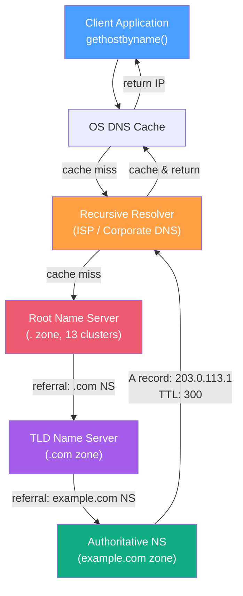
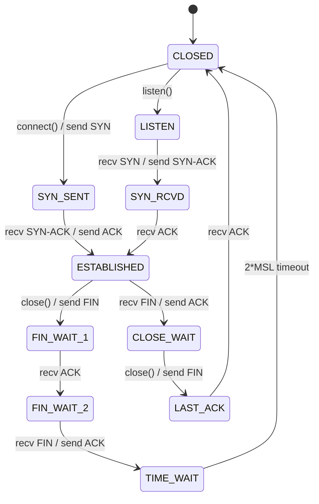
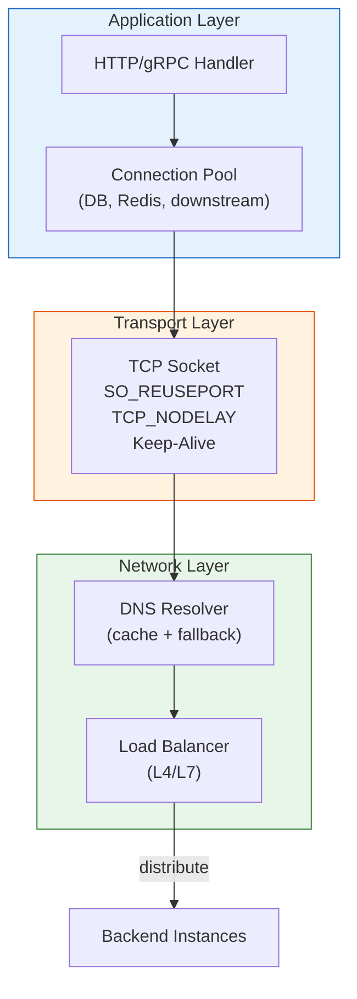

# DNS & Network Fundamentals / DNS 與網路基礎

## Intent / 意圖

後端工程師每天都在 TCP/IP 之上構建服務，但很少有人真正理解 DNS 解析、TCP 連線生命週期和底層 socket 選項如何影響服務的延遲、可靠性和可擴展性。本篇從第一性原理出發，涵蓋 DNS 解析流程（recursive/iterative）、常見 record types、TTL 快取策略、TCP 三次握手與四次揮手、keep-alive、`SO_REUSEPORT`、Nagle 演算法與 `TCP_NODELAY`，以及實務除錯工具（dig、tcpdump、ss）。

核心問題：**當服務間的 HTTP 請求偶爾出現 DNS 解析超時、TCP 連線建立延遲或莫名的 connection reset，工程師如何系統性地診斷是 DNS 層、TCP 層還是應用層的問題？**

---

## Problem / 問題情境

**場景一：DNS 快取失效風暴** — 微服務架構中 Service A 呼叫 Service B 的 FQDN `service-b.internal`。某天 DNS server 短暫不可用 30 秒，所有 Service A 的實例同時 DNS cache 失效並重新查詢，造成 DNS server 瞬間被 5000 QPS 打爆。Service A 的 HTTP client 因 DNS 解析失敗回傳 `ErrNoSuchHost`，觸發大量 5xx 錯誤。若 Service A 使用了 DNS 快取 library 且設定合理的 negative cache TTL 和 stale-while-revalidate 策略，就能在 DNS server 短暫不可用時繼續使用過期的快取記錄。

**場景二：TIME_WAIT 耗盡導致連線失敗** — 高頻率短連線的 API Gateway 每秒建立並關閉 3000 條 TCP 連線。由於 TCP 的 `TIME_WAIT` 狀態預設持續 60 秒（Linux），在任何時刻有 180,000 個 socket 處於 TIME_WAIT 狀態，加上 ephemeral port range 預設 28232 個（32768-60999），可用 port 被耗盡。新的 `connect()` 呼叫失敗回傳 `EADDRNOTAVAIL`。解法是啟用 `SO_REUSEPORT` + HTTP keep-alive 減少 connection churn。

**場景三：gRPC 串流延遲毛刺** — gRPC 服務的 unary call P50 延遲 2ms，但 P99 偶爾飆到 42ms。抓包發現小封包（< 200 bytes）被 Nagle 演算法延遲了 40ms 才發送。gRPC 框架預設啟用 `TCP_NODELAY`，但自訂的 TCP listener 沒有設定此選項。

---

## Core Concepts / 核心概念

### DNS Resolution Flow / DNS 解析流程

DNS 解析分為兩種模式：

- **Recursive Query（遞迴查詢）**：client 向 recursive resolver（通常是 ISP 或企業的 DNS server）發送查詢，resolver 負責遍歷整個 DNS 層級直到找到答案。client 只需一次查詢。
- **Iterative Query（迭代查詢）**：resolver 向 root → TLD → authoritative DNS server 依序查詢，每一層回傳「我不知道，但你可以問 X」的 referral。

完整的解析鏈路：`Client → Recursive Resolver → Root NS → .com TLD NS → example.com Authoritative NS → IP Address`

### DNS Record Types / DNS 記錄類型

| 類型 | 用途 | 範例 |
|------|------|------|
| **A** | 域名 → IPv4 地址 | `api.example.com → 203.0.113.1` |
| **AAAA** | 域名 → IPv6 地址 | `api.example.com → 2001:db8::1` |
| **CNAME** | 域名別名（指向另一個域名） | `www.example.com → cdn.provider.com` |
| **SRV** | 服務發現（含 port + priority + weight） | `_http._tcp.example.com → 10 5 8080 server1.example.com` |
| **TXT** | 任意文字（SPF、DKIM、domain verification） | `example.com → "v=spf1 include:_spf.google.com"` |
| **MX** | 郵件交換伺服器 | `example.com → 10 mail.example.com` |
| **NS** | 域名的 authoritative name server | `example.com → ns1.example.com` |
| **PTR** | 反向 DNS（IP → 域名） | `1.113.0.203.in-addr.arpa → api.example.com` |

### TTL and Caching / TTL 與快取

**TTL**（Time To Live）控制 DNS record 被快取的秒數。快取層級：

1. **Browser DNS Cache**（Chrome: 60s）
2. **OS DNS Cache**（macOS: variable, Linux systemd-resolved: 遵循 TTL）
3. **Recursive Resolver Cache**（遵循 authoritative 回應的 TTL）

**最佳實踐**：
- 正常 TTL：300s（5 分鐘）—— 平衡快取命中率和變更傳播速度
- 遷移前調低：60s → 變更 → 確認 → 調回 300s
- Negative Cache TTL：DNS 查詢失敗的快取時間，RFC 2308 建議 ≤ 5 分鐘

### TCP Three-Way Handshake / TCP 三次握手

建立 TCP 連線的過程（1 RTT）：

```
Client                    Server
  |--- SYN (seq=x) ------->|     (1) Client 發起連線
  |<-- SYN-ACK (seq=y,     |     (2) Server 確認並回覆
  |    ack=x+1) ------------|
  |--- ACK (ack=y+1) ----->|     (3) Client 確認，連線建立
```

- **SYN Flood Attack**：攻擊者發送大量 SYN 但不回 ACK，填滿 server 的 SYN queue（`tcp_max_syn_backlog`）。防禦：SYN cookies。
- **TCP Fast Open (TFO)**：在 SYN 封包中攜帶資料，節省一次 RTT。適合重複連線的場景。

### TCP Four-Way Teardown / TCP 四次揮手

關閉 TCP 連線的過程（2 RTT）：

```
Client                    Server
  |--- FIN (seq=u) ------->|     (1) Client 發起關閉
  |<-- ACK (ack=u+1) ------|     (2) Server 確認
  |<-- FIN (seq=v) --------|     (3) Server 也發起關閉
  |--- ACK (ack=v+1) ----->|     (4) Client 確認
  |                         |
  [TIME_WAIT 2*MSL]         |     Client 進入 TIME_WAIT
```

**TIME_WAIT**：主動關閉方進入 `TIME_WAIT` 狀態，持續 2 * MSL（Maximum Segment Lifetime，Linux 預設 60s）。目的是確保最後的 ACK 被對方收到、避免舊封包干擾新連線。

### Connection Keep-Alive / 連線保活

**HTTP Keep-Alive**（Application Layer）：HTTP/1.1 預設啟用，同一個 TCP 連線處理多個 HTTP request。減少握手開銷。

**TCP Keep-Alive**（Transport Layer）：在連線閒置一段時間後發送探測封包，檢測對端是否仍然存活。Linux 預設：
- `tcp_keepalive_time`：7200s（2 小時後開始探測）
- `tcp_keepalive_intvl`：75s（探測間隔）
- `tcp_keepalive_probes`：9（連續失敗次數）

生產環境建議縮短 keepalive 時間（如 60s），避免在 load balancer 或 NAT 設備的 idle timeout 前就被靜默斷開。

### SO_REUSEPORT / 埠重用

允許多個 socket 綁定到同一個 `IP:Port`。核心在將 incoming connections 在 kernel 層面分配到多個 listener thread/process，避免 accept queue 成為瓶頸。

- **Linux 3.9+**：Kernel 使用 hash(source IP + source port) 分配連線到不同的 socket
- **使用場景**：Nginx worker processes、高效能 proxy、graceful restart（新舊 process 同時 listen）

### Nagle's Algorithm & TCP_NODELAY / Nagle 演算法

**Nagle 演算法**（RFC 896）：如果有未被 ACK 的小封包在途中，delay 新的小封包直到 ACK 回來或累積到 MSS。目的是減少 "small packet problem"（大量 tiny segment 浪費頻寬）。

**問題**：對於需要低延遲的場景（gRPC、即時遊戲、interactive terminal），Nagle 演算法會引入 40ms 的延遲（delayed ACK timer）。

**TCP_NODELAY**：停用 Nagle 演算法，每次 `write()` 立即發送封包。幾乎所有 modern 後端框架（Axum、gRPC、WebSocket）預設啟用 `TCP_NODELAY`。

### TCP vs UDP / 傳輸協議比較

| 特性 | TCP | UDP |
|------|-----|-----|
| 連線建立 | 三次握手（1 RTT） | 無連線 |
| 可靠性 | 保證順序、重傳遺失封包 | 不保證，應用層處理 |
| 流量控制 | 滑動視窗 | 無 |
| 壅塞控制 | Slow Start、Congestion Avoidance | 無 |
| Header 大小 | 20 bytes | 8 bytes |
| 使用場景 | HTTP、gRPC、資料庫連線 | DNS、QUIC/HTTP3、即時遊戲、影音串流 |

### Network Debugging Tools / 網路除錯工具

- **dig**：DNS 查詢工具，顯示完整的 DNS 回應（含 TTL、authority section）
- **nslookup**：簡單的 DNS 查詢（dig 的簡化版）
- **tcpdump**：封包擷取工具，觀察 TCP handshake、payload、retransmission
- **ss**（替代 netstat）：顯示 socket 統計資訊（連線狀態、timer、buffer）
- **curl --resolve**：繞過 DNS 直接指定 IP，用於測試特定 backend

---

## Architecture / 架構

### DNS Resolution Flow（完整鏈路）



### TCP Connection Lifecycle



### Backend Service Network Stack



---

## How It Works / 運作原理

### 從 HTTP Request 到收到回應的完整網路路徑

1. **DNS 解析**：應用程式呼叫 `connect("api.example.com:443")`。OS 首先檢查 `/etc/hosts`，然後查詢 DNS cache。Cache miss 時向 recursive resolver 發送 UDP query（port 53）。Resolver 遍歷 Root → TLD → Authoritative NS 取得 IP，快取結果（遵循 TTL）並回傳。

2. **TCP 三次握手**：OS 以解析到的 IP 發起 TCP 連線。SYN → SYN-ACK → ACK，耗時 1 RTT。若目標在不同大洲（RTT 150ms），這一步就增加 150ms 延遲。

3. **TLS 握手**（HTTPS）：TCP 連線建立後進行 TLS handshake。TLS 1.3 只需 1 RTT（TLS 1.2 需 2 RTT）。Session resumption 可降至 0-RTT。

4. **HTTP Request 發送**：應用層將 HTTP request 寫入 TCP socket。若啟用 Nagle 演算法且封包小於 MSS，可能被延遲發送。`TCP_NODELAY` 確保立即發送。

5. **TCP Flow Control**：接收方的 receive window 控制發送速率。若接收方處理緩慢（window shrink），發送方自動減速。

6. **HTTP Response 接收**：response data 透過 TCP 可靠傳輸到達。TCP 保證順序和完整性（out-of-order segment 會在 TCP buffer 中重組）。

7. **Connection Reuse（Keep-Alive）**：HTTP/1.1 預設不關閉 TCP 連線。下一個 request 直接複用，省去步驟 1-3。HTTP/2 透過 multiplexing 在單一連線上並行多個 request。

8. **Connection 關閉**：idle timeout 到達或 server 發送 `Connection: close`。主動關閉方進入 TIME_WAIT。

### DNS 在 Kubernetes 中的特殊行為

K8s Pod 的 DNS 解析有額外的複雜度：

1. Pod 的 `/etc/resolv.conf` 設定 `search` domain：`default.svc.cluster.local svc.cluster.local cluster.local`
2. 查詢 `service-b` 時，DNS client 會依序嘗試：
   - `service-b.default.svc.cluster.local`
   - `service-b.svc.cluster.local`
   - `service-b.cluster.local`
   - `service-b`（absolute query）
3. 每次嘗試是一個 DNS query，最壞情況 4 次查詢。使用 FQDN（結尾加 `.`）可避免 search domain expansion。
4. `ndots:5`（K8s 預設）意味著少於 5 個 dot 的名稱都會經過 search domain expansion。設定 `ndots:2` 可大幅減少 DNS query 數量。

---

## Rust 實作

使用 `hickory-resolver`（前身 trust-dns）實作自訂 DNS resolver，展示 DNS 查詢流程、record type 解析和 TCP socket 設定。

```rust
// dns_network.rs — tokio 1.x + hickory-resolver + custom TCP listener
// Cargo.toml dependencies:
// tokio = { version = "1", features = ["full"] }
// hickory-resolver = "0.25"
// socket2 = "0.5"
// serde = { version = "1", features = ["derive"] }
// serde_json = "1"

use hickory_resolver::{
    config::{ResolverConfig, ResolverOpts},
    TokioAsyncResolver,
};
use serde::Serialize;
use socket2::{Domain, Protocol, SockAddr, Socket, Type};
use std::{
    io,
    net::{Ipv4Addr, SocketAddr, SocketAddrV4},
    time::Duration,
};
use tokio::{
    io::{AsyncReadExt, AsyncWriteExt},
    net::TcpListener,
};

// ---------- DNS Resolver ----------

#[derive(Debug, Serialize)]
struct DnsResult {
    query: String,
    record_type: String,
    answers: Vec<String>,
    ttl_seconds: u32,
}

async fn resolve_dns(hostname: &str) -> Result<Vec<DnsResult>, Box<dyn std::error::Error>> {
    // 建立自訂 resolver（使用 Google 和 Cloudflare DNS）
    let mut opts = ResolverOpts::default();
    opts.timeout = Duration::from_secs(5);
    opts.attempts = 3;
    opts.cache_size = 256; // 本地 DNS 快取大小
    opts.use_hosts_file = true;

    let resolver = TokioAsyncResolver::tokio(ResolverConfig::cloudflare(), opts);

    let mut results = Vec::new();

    // A Record 查詢
    println!("[DNS] Resolving A records for: {hostname}");
    match resolver.lookup_ip(hostname).await {
        Ok(response) => {
            let answers: Vec<String> = response.iter().map(|ip| ip.to_string()).collect();
            let ttl = response
                .as_lookup()
                .record_iter()
                .next()
                .map(|r| r.ttl())
                .unwrap_or(0);
            println!("[DNS] A records: {answers:?} (TTL: {ttl}s)");
            results.push(DnsResult {
                query: hostname.to_string(),
                record_type: "A/AAAA".to_string(),
                answers,
                ttl_seconds: ttl,
            });
        }
        Err(e) => println!("[DNS] A record lookup failed: {e}"),
    }

    // TXT Record 查詢
    println!("[DNS] Resolving TXT records for: {hostname}");
    match resolver.txt_lookup(hostname).await {
        Ok(response) => {
            let answers: Vec<String> = response.iter().map(|txt| txt.to_string()).collect();
            println!("[DNS] TXT records: {answers:?}");
            results.push(DnsResult {
                query: hostname.to_string(),
                record_type: "TXT".to_string(),
                answers,
                ttl_seconds: 0,
            });
        }
        Err(e) => println!("[DNS] TXT record lookup failed: {e}"),
    }

    // MX Record 查詢
    println!("[DNS] Resolving MX records for: {hostname}");
    match resolver.mx_lookup(hostname).await {
        Ok(response) => {
            let answers: Vec<String> = response
                .iter()
                .map(|mx| {
                    format!(
                        "priority={} exchange={}",
                        mx.preference(),
                        mx.exchange()
                    )
                })
                .collect();
            println!("[DNS] MX records: {answers:?}");
            results.push(DnsResult {
                query: hostname.to_string(),
                record_type: "MX".to_string(),
                answers,
                ttl_seconds: 0,
            });
        }
        Err(e) => println!("[DNS] MX record lookup failed: {e}"),
    }

    Ok(results)
}

// ---------- TCP Server with Socket Options ----------

fn create_optimized_listener(addr: SocketAddr) -> io::Result<std::net::TcpListener> {
    let socket = Socket::new(Domain::IPV4, Type::STREAM, Some(Protocol::TCP))?;

    // SO_REUSEADDR：允許 TIME_WAIT 狀態的 address 被重新使用
    socket.set_reuse_address(true)?;
    println!("[TCP] SO_REUSEADDR: enabled");

    // SO_REUSEPORT：允許多個 socket 綁定相同的 IP:Port（Linux 3.9+）
    #[cfg(target_os = "linux")]
    {
        socket.set_reuse_port(true)?;
        println!("[TCP] SO_REUSEPORT: enabled");
    }

    // TCP_NODELAY：停用 Nagle 演算法，小封包立即發送
    socket.set_nodelay(true)?;
    println!("[TCP] TCP_NODELAY: enabled (Nagle disabled)");

    // TCP Keep-Alive：設定探測參數
    let keepalive = socket2::TcpKeepalive::new()
        .with_time(Duration::from_secs(60))    // 60s 後開始探測（預設 7200s 太長）
        .with_interval(Duration::from_secs(10)); // 每 10s 探測一次

    socket.set_tcp_keepalive(&keepalive)?;
    println!("[TCP] TCP Keep-Alive: time=60s, interval=10s");

    // Receive/Send buffer size
    socket.set_recv_buffer_size(256 * 1024)?; // 256KB
    socket.set_send_buffer_size(256 * 1024)?;
    println!("[TCP] Buffer size: recv=256KB, send=256KB");

    socket.bind(&SockAddr::from(addr))?;
    socket.listen(1024)?; // backlog size
    println!("[TCP] Listening on {addr} (backlog=1024)");

    Ok(std::net::TcpListener::from(socket))
}

async fn handle_connection(mut stream: tokio::net::TcpStream, peer_addr: SocketAddr) {
    println!("[CONN] New connection from: {peer_addr}");

    let mut buffer = [0u8; 4096];
    loop {
        match stream.read(&mut buffer).await {
            Ok(0) => {
                println!("[CONN] Connection closed by peer: {peer_addr}");
                break;
            }
            Ok(n) => {
                let request = String::from_utf8_lossy(&buffer[..n]);
                println!("[CONN] Received {n} bytes from {peer_addr}: {request}");

                // Echo response with connection info
                let response = format!(
                    "HTTP/1.1 200 OK\r\nContent-Type: application/json\r\nConnection: keep-alive\r\n\r\n\
                    {{\"peer\":\"{peer_addr}\",\"bytes_received\":{n}}}\n"
                );
                if stream.write_all(response.as_bytes()).await.is_err() {
                    break;
                }
            }
            Err(e) => {
                println!("[CONN] Error reading from {peer_addr}: {e}");
                break;
            }
        }
    }
}

#[tokio::main]
async fn main() -> Result<(), Box<dyn std::error::Error>> {
    println!("=== DNS Resolution Demo ===\n");

    // DNS 查詢範例
    let dns_results = resolve_dns("example.com").await?;
    println!("\n--- DNS Results ---");
    println!(
        "{}",
        serde_json::to_string_pretty(&dns_results)?
    );

    println!("\n=== TCP Server Demo ===\n");

    // 建立帶有最佳化 socket 選項的 TCP listener
    let addr = SocketAddr::V4(SocketAddrV4::new(Ipv4Addr::LOCALHOST, 3000));
    let std_listener = create_optimized_listener(addr)?;
    std_listener.set_nonblocking(true)?;

    let listener = TcpListener::from_std(std_listener)?;

    println!("\nServer ready. Accepting connections...\n");

    loop {
        let (stream, peer_addr) = listener.accept().await?;

        // 每個連線的 socket 選項
        let socket_ref = socket2::SockRef::from(&stream);
        socket_ref.set_nodelay(true)?;

        tokio::spawn(handle_connection(stream, peer_addr));
    }
}

// Output:
// === DNS Resolution Demo ===
//
// [DNS] Resolving A records for: example.com
// [DNS] A records: ["93.184.216.34", "2606:2800:220:1:248:1893:25c8:1946"] (TTL: 3462s)
// [DNS] Resolving TXT records for: example.com
// [DNS] TXT records: ["v=spf1 -all", "wgyf8z8..."]
// [DNS] Resolving MX records for: example.com
// [DNS] MX record lookup failed: no records found
//
// --- DNS Results ---
// [
//   { "query": "example.com", "record_type": "A/AAAA",
//     "answers": ["93.184.216.34"], "ttl_seconds": 3462 }
// ]
//
// === TCP Server Demo ===
//
// [TCP] SO_REUSEADDR: enabled
// [TCP] TCP_NODELAY: enabled (Nagle disabled)
// [TCP] TCP Keep-Alive: time=60s, interval=10s
// [TCP] Buffer size: recv=256KB, send=256KB
// [TCP] Listening on 127.0.0.1:3000 (backlog=1024)
```

---

## Go 實作

使用 `net.Resolver` 實作自訂 DNS 查詢，展示 DNS record 解析和 TCP socket 設定。

```go
// dns_network.go — Go 1.24+ / net + net.Resolver
package main

import (
	"context"
	"encoding/json"
	"fmt"
	"net"
	"os"
	"syscall"
	"time"
)

// ---------- DNS Resolver ----------

type DNSResult struct {
	Query      string   `json:"query"`
	RecordType string   `json:"record_type"`
	Answers    []string `json:"answers"`
}

func resolveDNS(ctx context.Context, hostname string) ([]DNSResult, error) {
	// 自訂 resolver：指定 DNS server、超時、協議
	resolver := &net.Resolver{
		PreferGo: true, // 使用 Go 內建的 DNS resolver（而非 cgo）
		Dial: func(ctx context.Context, network, address string) (net.Conn, error) {
			// 使用 Cloudflare DNS (1.1.1.1) 或自訂 DNS server
			dialer := net.Dialer{Timeout: 5 * time.Second}
			return dialer.DialContext(ctx, "udp", "1.1.1.1:53")
		},
	}

	var results []DNSResult

	// A / AAAA Record 查詢
	fmt.Printf("[DNS] Resolving IP addresses for: %s\n", hostname)
	ips, err := resolver.LookupIPAddr(ctx, hostname)
	if err != nil {
		fmt.Printf("[DNS] IP lookup failed: %v\n", err)
	} else {
		answers := make([]string, 0, len(ips))
		for _, ip := range ips {
			answers = append(answers, ip.String())
			recordType := "A"
			if ip.IP.To4() == nil {
				recordType = "AAAA"
			}
			fmt.Printf("[DNS] %s record: %s\n", recordType, ip.String())
		}
		results = append(results, DNSResult{
			Query: hostname, RecordType: "A/AAAA", Answers: answers,
		})
	}

	// CNAME Record 查詢
	fmt.Printf("[DNS] Resolving CNAME for: %s\n", hostname)
	cname, err := resolver.LookupCNAME(ctx, hostname)
	if err != nil {
		fmt.Printf("[DNS] CNAME lookup failed: %v\n", err)
	} else {
		fmt.Printf("[DNS] CNAME: %s\n", cname)
		results = append(results, DNSResult{
			Query: hostname, RecordType: "CNAME", Answers: []string{cname},
		})
	}

	// MX Record 查詢
	fmt.Printf("[DNS] Resolving MX records for: %s\n", hostname)
	mxRecords, err := resolver.LookupMX(ctx, hostname)
	if err != nil {
		fmt.Printf("[DNS] MX lookup failed: %v\n", err)
	} else {
		answers := make([]string, 0, len(mxRecords))
		for _, mx := range mxRecords {
			entry := fmt.Sprintf("priority=%d host=%s", mx.Pref, mx.Host)
			answers = append(answers, entry)
			fmt.Printf("[DNS] MX: %s\n", entry)
		}
		results = append(results, DNSResult{
			Query: hostname, RecordType: "MX", Answers: answers,
		})
	}

	// TXT Record 查詢
	fmt.Printf("[DNS] Resolving TXT records for: %s\n", hostname)
	txtRecords, err := resolver.LookupTXT(ctx, hostname)
	if err != nil {
		fmt.Printf("[DNS] TXT lookup failed: %v\n", err)
	} else {
		fmt.Printf("[DNS] TXT records: %v\n", txtRecords)
		results = append(results, DNSResult{
			Query: hostname, RecordType: "TXT", Answers: txtRecords,
		})
	}

	// SRV Record 查詢
	fmt.Printf("[DNS] Resolving SRV records for: _http._tcp.%s\n", hostname)
	_, srvRecords, err := resolver.LookupSRV(ctx, "http", "tcp", hostname)
	if err != nil {
		fmt.Printf("[DNS] SRV lookup failed: %v\n", err)
	} else {
		answers := make([]string, 0, len(srvRecords))
		for _, srv := range srvRecords {
			entry := fmt.Sprintf("priority=%d weight=%d port=%d target=%s",
				srv.Priority, srv.Weight, srv.Port, srv.Target)
			answers = append(answers, entry)
		}
		results = append(results, DNSResult{
			Query: hostname, RecordType: "SRV", Answers: answers,
		})
	}

	return results, nil
}

// ---------- TCP Server with Socket Options ----------

func createOptimizedListener(address string) (net.Listener, error) {
	// 使用 net.ListenConfig 設定 socket 選項
	lc := net.ListenConfig{
		Control: func(network, address string, conn syscall.RawConn) error {
			var sockErr error
			err := conn.Control(func(fd uintptr) {
				// SO_REUSEADDR：允許重新使用 TIME_WAIT 的 address
				sockErr = syscall.SetsockoptInt(int(fd), syscall.SOL_SOCKET, syscall.SO_REUSEADDR, 1)
				if sockErr != nil {
					return
				}
				fmt.Println("[TCP] SO_REUSEADDR: enabled")

				// SO_REUSEPORT：允許多個 socket 綁定相同 IP:Port
				sockErr = syscall.SetsockoptInt(int(fd), syscall.SOL_SOCKET, syscall.SO_REUSEPORT, 1)
				if sockErr != nil {
					return
				}
				fmt.Println("[TCP] SO_REUSEPORT: enabled")

				// TCP_NODELAY：停用 Nagle 演算法
				sockErr = syscall.SetsockoptInt(int(fd), syscall.IPPROTO_TCP, syscall.TCP_NODELAY, 1)
				if sockErr != nil {
					return
				}
				fmt.Println("[TCP] TCP_NODELAY: enabled")

				// Receive/Send buffer size
				sockErr = syscall.SetsockoptInt(int(fd), syscall.SOL_SOCKET, syscall.SO_RCVBUF, 256*1024)
				if sockErr != nil {
					return
				}
				sockErr = syscall.SetsockoptInt(int(fd), syscall.SOL_SOCKET, syscall.SO_SNDBUF, 256*1024)
				if sockErr != nil {
					return
				}
				fmt.Println("[TCP] Buffer size: recv=256KB, send=256KB")
			})
			if err != nil {
				return err
			}
			return sockErr
		},
		KeepAlive: 60 * time.Second, // TCP Keep-Alive interval
	}

	fmt.Printf("[TCP] KeepAlive: 60s\n")
	listener, err := lc.Listen(context.Background(), "tcp", address)
	if err != nil {
		return nil, fmt.Errorf("listen: %w", err)
	}
	fmt.Printf("[TCP] Listening on %s\n", address)
	return listener, nil
}

func handleConnection(conn net.Conn) {
	defer conn.Close()
	peer := conn.RemoteAddr().String()
	fmt.Printf("[CONN] New connection from: %s\n", peer)

	// 設定 per-connection TCP keep-alive
	if tcpConn, ok := conn.(*net.TCPConn); ok {
		tcpConn.SetKeepAlive(true)
		tcpConn.SetKeepAlivePeriod(60 * time.Second)
		tcpConn.SetNoDelay(true) // TCP_NODELAY per connection
	}

	buffer := make([]byte, 4096)
	for {
		conn.SetReadDeadline(time.Now().Add(30 * time.Second))
		n, err := conn.Read(buffer)
		if err != nil {
			fmt.Printf("[CONN] Connection closed: %s (%v)\n", peer, err)
			return
		}

		fmt.Printf("[CONN] Received %d bytes from %s\n", n, peer)

		response := fmt.Sprintf(
			"HTTP/1.1 200 OK\r\nContent-Type: application/json\r\nConnection: keep-alive\r\n\r\n"+
				`{"peer":"%s","bytes_received":%d}`+"\n",
			peer, n,
		)
		if _, err := conn.Write([]byte(response)); err != nil {
			fmt.Printf("[CONN] Write error: %s (%v)\n", peer, err)
			return
		}
	}
}

func main() {
	ctx, cancel := context.WithTimeout(context.Background(), 30*time.Second)
	defer cancel()

	fmt.Println("=== DNS Resolution Demo ===\n")

	results, err := resolveDNS(ctx, "example.com")
	if err != nil {
		fmt.Fprintf(os.Stderr, "DNS resolution error: %v\n", err)
	}

	fmt.Println("\n--- DNS Results ---")
	encoded, _ := json.MarshalIndent(results, "", "  ")
	fmt.Println(string(encoded))

	fmt.Println("\n=== TCP Server Demo ===\n")

	listener, err := createOptimizedListener("127.0.0.1:3000")
	if err != nil {
		fmt.Fprintf(os.Stderr, "Failed to create listener: %v\n", err)
		os.Exit(1)
	}
	defer listener.Close()

	fmt.Println("\nServer ready. Accepting connections...\n")

	for {
		conn, err := listener.Accept()
		if err != nil {
			fmt.Fprintf(os.Stderr, "Accept error: %v\n", err)
			continue
		}
		go handleConnection(conn)
	}
}

// Output:
// === DNS Resolution Demo ===
//
// [DNS] Resolving IP addresses for: example.com
// [DNS] A record: 93.184.216.34
// [DNS] AAAA record: 2606:2800:220:1:248:1893:25c8:1946
// [DNS] Resolving CNAME for: example.com
// [DNS] CNAME: example.com.
// [DNS] Resolving MX records for: example.com
// [DNS] MX lookup failed: no such host
// [DNS] Resolving TXT records for: example.com
// [DNS] TXT records: [v=spf1 -all ...]
//
// --- DNS Results ---
// [
//   { "query": "example.com", "record_type": "A/AAAA",
//     "answers": ["93.184.216.34", "2606:2800:..."] }
// ]
//
// === TCP Server Demo ===
//
// [TCP] SO_REUSEADDR: enabled
// [TCP] SO_REUSEPORT: enabled
// [TCP] TCP_NODELAY: enabled
// [TCP] Listening on 127.0.0.1:3000
```

---

## Rust vs Go 對照表

| 比較維度 | Rust | Go |
|---------|------|-----|
| **DNS Resolver** | `hickory-resolver`（async, 支援 DoH/DoT）；需額外 crate | `net.Resolver` 內建；`PreferGo: true` 使用純 Go 實作避免 cgo |
| **Socket 選項設定** | `socket2` crate 提供跨平台的 typed API，編譯期類型安全 | `syscall.SetsockoptInt` + `RawConn.Control` 低階 API，需自行處理 fd |
| **TCP_NODELAY** | `socket2::Socket::set_nodelay(true)`，tokio `TcpStream` 也有 `set_nodelay` | `net.TCPConn.SetNoDelay(true)`，需 type assertion 從 `net.Conn` 轉換 |
| **SO_REUSEPORT** | `socket2::Socket::set_reuse_port(true)`，跨平台條件編譯 `#[cfg]` | `net.ListenConfig.Control` 中設定 `syscall.SO_REUSEPORT` |
| **Keep-Alive 設定** | `socket2::TcpKeepalive` 結構體，支援 time/interval/retries | `net.TCPConn.SetKeepAlivePeriod()`，Go 1.24+ 支援更細粒度設定 |
| **非同步 DNS** | `hickory-resolver` 原生 async，與 tokio runtime 整合 | `net.Resolver` 的方法天然 goroutine-safe，內部自動並發 |

---

## When to Use / 適用場景

- **微服務間通訊效能調優**：當服務間的 P99 延遲出現不可解釋的毛刺（spikes），需要從 DNS 解析、TCP 握手、Nagle 演算法等底層排查。理解網路基礎能快速定位問題是在哪一層。

- **高併發 TCP 服務設計**：建構 proxy、API gateway 或 WebSocket server 時，需要正確設定 `SO_REUSEPORT`、`TCP_NODELAY`、keep-alive 參數和 backlog size。這些參數直接影響服務的吞吐量和延遲。

- **Kubernetes DNS 問題排查**：K8s 環境中 DNS 是常見的故障點（CoreDNS OOM、ndots 導致過多查詢、DNS cache 失效）。理解 DNS 解析流程和 K8s 的 DNS 行為是快速排查的前提。

---

## When NOT to Use / 不適用場景

- **過度調優底層 socket 參數**：在 RPS < 1000 的典型 CRUD 服務中，預設的 TCP 參數已經足夠。過早的底層調優增加程式碼複雜度但不帶來可衡量的改善。先用 profiling 確認瓶頸在網路層再調整。

- **自行實作 DNS 快取替代系統 DNS**：大部分場景下，OS 的 DNS 快取 + framework 的 connection pool（持有已解析的 TCP 連線）已經足夠。只有在極端場景（如 DNS server 高頻故障）才值得自行實作 DNS 快取層。

- **在 HTTP/2+ 環境中糾結 keep-alive 設定**：HTTP/2 和 HTTP/3 已經在協議層面解決了 connection multiplexing 和 head-of-line blocking 的問題。除非你直接操作 raw TCP socket，否則 HTTP/2 的連線管理已經足夠高效。

---

## Real-World Examples / 真實世界案例

### Cloudflare — DNS Resolver Performance (1.1.1.1)

Cloudflare 的公共 DNS resolver 1.1.1.1 是全球最快的 public DNS resolver 之一（平均回應時間 < 15ms）。其架構要點：(1) Anycast routing 將使用者導向最近的 PoP（Points of Presence）；(2) 積極的快取策略搭配 stale-while-revalidate（TTL 過期後仍回傳舊記錄，同時背景更新）；(3) QNAME minimization 減少向 authoritative server 暴露完整查詢域名，提升隱私。Cloudflare 公開分享了其 DNS resolver 遇到的各種 edge case（空 CNAME 迴圈、TTL=0 的記錄等）以及對應的防禦策略。

### Netflix — TCP Tuning for Streaming

Netflix 的 Open Connect CDN 需要在全球傳輸大量影音資料。其 TCP 調優策略包括：(1) 大幅增加初始 congestion window（initcwnd=40）以加速 TCP slow start；(2) 啟用 BBR congestion control 替代 CUBIC，在高延遲長距離連線上獲得更高吞吐量；(3) 自訂 TCP_NODELAY 策略——小封包（control messages）立即發送，大封包（video chunks）批量發送。Netflix 分享了其在不同網路條件下的 TCP 參數最佳化結果。

### Kubernetes — CoreDNS ndots:5 問題

Kubernetes 預設 `ndots:5` 導致大量不必要的 DNS 查詢。例如查詢 `api.example.com`（2 個 dot，< 5）會先嘗試 `api.example.com.default.svc.cluster.local` 等 4 個 search domain，全部失敗後才查詢原始域名。這導致 CoreDNS 承受 4-5 倍的查詢量。Shopify 在 2019 年分享了將 ndots 從 5 降到 2 後，DNS 查詢量降低 60%、P99 延遲降低 30% 的經驗。另一個解法是使用 FQDN（結尾加 `.`）跳過 search domain expansion。

---

## Interview Questions / 面試常見問題

### Q1: 請完整描述瀏覽器輸入 URL 到看到頁面的過程中，DNS 解析經歷了哪些步驟？

**回答**：

完整的 DNS 解析流程：

1. **瀏覽器 DNS 快取**：瀏覽器檢查自身的 DNS 快取（Chrome 預設 60s TTL）。若命中則直接使用。

2. **OS DNS 快取**：瀏覽器呼叫 `getaddrinfo()` 系統調用。OS 檢查 `/etc/hosts` 和本地 DNS 快取（macOS 的 `mDNSResponder`、Linux 的 `systemd-resolved`）。

3. **Recursive Resolver 查詢**：OS 向 `/etc/resolv.conf` 中設定的 DNS server（通常是 ISP 或企業 DNS）發送 **recursive query**（UDP port 53）。

4. **Resolver 快取檢查**：Recursive resolver 檢查自身快取。若命中且 TTL 未過期，直接回傳。

5. **Root Name Server 查詢**：Cache miss 時，resolver 向 root name server（全球 13 個邏輯節點，透過 anycast 有數百個物理節點）發送 **iterative query**。Root server 回傳 `.com` TLD name server 的 NS 記錄。

6. **TLD Name Server 查詢**：Resolver 向 `.com` TLD server 查詢。TLD server 回傳 `example.com` 的 authoritative name server 的 NS 記錄。

7. **Authoritative Name Server 查詢**：Resolver 向 authoritative NS 查詢，取得最終的 A record（IP 地址）和 TTL。

8. **快取與回傳**：Resolver 將結果快取（遵循 TTL），回傳 IP 給 OS，OS 快取後回傳給瀏覽器。

整個過程在 cache miss 時通常耗時 20-120ms，取決於 resolver 與各級 NS 的網路距離。

### Q2: 為什麼 TCP 需要三次握手？兩次行不行？

**回答**：

兩次握手不行，因為無法確認雙方的**初始序列號**（ISN, Initial Sequence Number）都被對方收到。

三次握手的核心目的是**同步雙方的序列號**：

1. Client → Server：`SYN, seq=x`。Client 告知 Server 自己的 ISN 是 x。
2. Server → Client：`SYN-ACK, seq=y, ack=x+1`。Server 告知 Client 自己的 ISN 是 y，並確認收到 Client 的 ISN。
3. Client → Server：`ACK, ack=y+1`。Client 確認收到 Server 的 ISN。

如果只有兩次握手（省略第三步），Server 無法確認 Client 是否收到了自己的 ISN。這會導致：

- **歷史連線問題**：假設 Client 之前發過一個 SYN（seq=x_old），因網路延遲在新連線建立後才到達 Server。Server 用兩次握手直接建立連線，但 Client 不知道——形成 half-open 連線浪費 Server 資源。
- **序列號不同步**：Server 以為連線已建立開始發送資料，但 Client 的序列號不對，收到的資料無法正確處理。

第三次握手讓 Server 確認「Client 已知道我的 ISN」，雙方達成共識後才開始傳輸資料。

### Q3: TIME_WAIT 狀態的作用是什麼？為什麼是 2*MSL？高併發場景下如何處理？

**回答**：

**TIME_WAIT 的作用**：

1. **確保最後的 ACK 被對方收到**：如果主動關閉方的最後一個 ACK 遺失，被動方會重傳 FIN。TIME_WAIT 讓主動方有機會重新發送 ACK。

2. **防止舊封包干擾新連線**：如果同一個四元組（src_ip, src_port, dst_ip, dst_port）立即被新連線使用，網路中殘留的舊封包可能被新連線誤收。TIME_WAIT 確保舊封包在網路中消亡後才允許重用。

**為什麼是 2*MSL**：MSL（Maximum Segment Lifetime）是封包在網路中存活的最大時間。2*MSL 確保雙向的殘留封包都已超時消亡。Linux 的 MSL 是 30 秒，所以 TIME_WAIT = 60 秒。

**高併發場景的處理策略**：

1. **HTTP Keep-Alive**：最根本的解法——減少 connection churn，同一個 TCP 連線處理多個請求。
2. **`SO_REUSEADDR`**：允許新 socket 綁定到 TIME_WAIT 狀態的 address（server 端重啟時有用）。
3. **`tcp_tw_reuse`**（Linux）：允許在 TIME_WAIT 狀態的 socket 上建立新的 outgoing 連線（client 端有用）。
4. **Connection Pool**：複用連線池中的長連線，避免頻繁建立和關閉。
5. **增大 ephemeral port range**：`sysctl net.ipv4.ip_local_port_range = "10000 65535"` 提供更多可用 port。

### Q4: Nagle 演算法和 TCP_NODELAY 的取捨是什麼？什麼時候應該開啟 TCP_NODELAY？

**回答**：

**Nagle 演算法的原理**：當有未被 ACK 的小封包在途中時，delay 新的小封包，直到 (1) 收到 ACK 或 (2) 累積資料達到 MSS（Maximum Segment Size, 通常 1460 bytes）。目的是將多個小寫入合併成一個封包，減少 header overhead。

**問題場景——Nagle + Delayed ACK 的互相等待**：
- 發送方寫入 100 bytes → Nagle 演算法延遲（等 ACK 或 MSS）
- 接收方的 TCP stack 啟用 Delayed ACK（等 40ms 或第二個封包才回 ACK）
- 結果：每個小封包被延遲 40ms

**應該開啟 TCP_NODELAY 的場景**：
- **即時通訊 / WebSocket**：訊息需要立即送達
- **gRPC / RPC**：request-response 模式，每個 RPC message 需要立即發送
- **遊戲伺服器**：操作指令需要低延遲
- **Interactive terminal（SSH）**：按鍵需要立即回顯

**不需要 TCP_NODELAY 的場景**：
- **大批量資料傳輸**（檔案下載、影音串流）：資料量大，Nagle 不會延遲（每次寫入都接近 MSS）
- **低頻率的大封包**：每次寫入已經是完整的 message

現代後端框架（Axum、Actix、Go net/http、gRPC）幾乎都預設啟用 TCP_NODELAY。除非你有明確的頻寬效率需求，否則不需要關閉它。

### Q5: 在 Kubernetes 環境中，DNS 解析有哪些常見的效能問題和解法？

**回答**：

K8s DNS（CoreDNS）的常見效能問題：

1. **ndots:5 導致過多查詢**：K8s Pod 的 `/etc/resolv.conf` 預設 `ndots:5`。外部域名（如 `api.stripe.com`，只有 2 個 dot）會先嘗試 4 個 search domain suffix，全部失敗後才查詢原始域名。每次外部 DNS 查詢實際產生 5 次（4 失敗 + 1 成功）。

   **解法**：在 Pod spec 中設定 `dnsConfig.options: [{name: ndots, value: "2"}]`，或使用 FQDN（如 `api.stripe.com.`，結尾加 `.`）。

2. **CoreDNS OOM/CPU 飽和**：大規模集群中 CoreDNS 承受過多查詢（因 ndots 放大 + 短 TTL）。

   **解法**：啟用 NodeLocal DNSCache（DaemonSet 形式在每個 node 運行 DNS cache），減少 CoreDNS 負載。

3. **DNS cache 的 race condition**：container 啟動後立即查詢 Service DNS，但 CoreDNS 的 watch 可能尚未同步到最新的 Endpoints。

   **解法**：在應用啟動時加入 DNS retry logic，或使用 readiness probe 確保 DNS 可解析後才接受流量。

4. **conntrack table 耗盡**：DNS 使用 UDP，每次查詢在 conntrack table 中佔一個 entry。高頻 DNS 查詢可能耗盡 conntrack table。

   **解法**：增大 `nf_conntrack_max`，或使用 NodeLocal DNSCache（DNS 查詢不經過 iptables/conntrack）。

---

## Pitfalls / 常見陷阱

### 1. DNS TTL 被 Client Library 忽略（通用）

**問題**：許多 HTTP client library 在建立 connection pool 後，會持續使用已解析的 IP，即使 DNS record 的 TTL 已過期。當 backend IP 變更（如 blue-green deployment）時，client 仍然連向舊 IP。

**解法**：設定 connection pool 的 `max_idle_time` 不超過 DNS TTL。或使用支援 DNS re-resolution 的 client（如 gRPC 的 `dns:///` scheme）。

### 2. 未設定 DNS 查詢超時（通用）

**問題**：預設的 DNS 查詢超時可能是 5-30 秒。如果 DNS server 不回應，應用的 HTTP 請求會被 DNS 解析阻塞數十秒。

**解法**：明確設定 DNS 查詢超時（通常 2-3 秒），搭配 retry（換一個 DNS server 重試）。

### 3. Rust 特有：tokio TcpStream 預設不設定 TCP_NODELAY

```rust
// 錯誤：直接使用 TcpListener::accept() 的 stream，未設定 TCP_NODELAY
let listener = TcpListener::bind("0.0.0.0:8080").await?;
let (stream, _) = listener.accept().await?;
// stream 的 TCP_NODELAY 預設是 false！小封包可能被 Nagle 延遲

// 正確：在 accept 後立即設定 TCP_NODELAY
let (stream, _) = listener.accept().await?;
stream.set_nodelay(true)?; // 或在 socket2 層面設定

// 注意：Axum 的 axum::serve 自動設定 TCP_NODELAY，但自訂 TCP listener 需要手動設定
```

### 4. Go 特有：net.Resolver 的 cgo vs pure Go 行為差異

```go
// 問題：Go 預設使用 cgo resolver（依賴系統的 getaddrinfo）
// 在某些 Linux 環境（如 Alpine/musl）中行為與 glibc 不同
// 且 cgo resolver 會消耗 OS thread（不是 goroutine）

// 解法一：強制使用 pure Go resolver
resolver := &net.Resolver{
    PreferGo: true, // 使用 Go 內建的 DNS client
}

// 解法二：編譯時使用 CGO_ENABLED=0
// CGO_ENABLED=0 go build -o server .

// 解法三：使用 GODEBUG 環境變數
// GODEBUG=netdns=go ./server
```

cgo resolver 在高並發下會因 OS thread 數量限制成為瓶頸（`GOMAXPROCS` 不影響 OS thread）。pure Go resolver 完全在 goroutine 中執行，不受此限制。

### 5. Ephemeral Port 耗盡（通用）

**問題**：Client 端頻繁建立短連線到同一個 server，每次 `connect()` 消耗一個 ephemeral port。TIME_WAIT 持續 60s 時，port 耗盡導致 `EADDRNOTAVAIL`。

**解法**：
- 使用 connection pool（HTTP client 的 keep-alive）
- 增大 ephemeral port range：`sysctl net.ipv4.ip_local_port_range = "10000 65535"`
- 啟用 `tcp_tw_reuse`：`sysctl net.ipv4.tcp_tw_reuse = 1`

### 6. Rust 特有：hickory-resolver 的 runtime 不匹配

```rust
// 錯誤：在 tokio runtime 中使用 hickory-resolver 的 async-std 版本
// 或在 async-std runtime 中使用 tokio 版本
// Cargo.toml:
// hickory-resolver = { version = "0.25", features = ["tokio-runtime"] }

// 正確：確保 hickory-resolver 的 runtime feature 與應用的 async runtime 一致
// 使用 tokio：features = ["tokio-runtime"]
// 使用 async-std：features = ["async-std-runtime"]

// 混用 runtime 會導致 panic 或 DNS 查詢永遠不回應（future 在錯誤的 runtime 上 poll）
```

### 7. Go 特有：http.Client 的 DNS 快取行為

```go
// 問題：Go 的 http.Client 透過 net.Dialer 解析 DNS
// 但 connection pool 中的連線不會在 DNS TTL 過期後重新解析
client := &http.Client{
    Transport: &http.Transport{
        MaxIdleConns:    100,
        IdleConnTimeout: 90 * time.Second, // 90s 閒置後關閉
    },
}
// 如果 DNS record 在 60s 後變更，idle connection 仍指向舊 IP

// 解法：設定 IdleConnTimeout ≤ DNS TTL
client := &http.Client{
    Transport: &http.Transport{
        MaxIdleConns:    100,
        IdleConnTimeout: 60 * time.Second, // ≤ DNS TTL (通常 300s 但越短越快切換)
    },
}
```

---

## Cross-references / 交叉引用

- [[30_http2_http3_grpc_transport]] — HTTP/2 的 multiplexing 和 HTTP/3 的 QUIC（基於 UDP）如何改變連線模型
- [[31_websocket_tls_mtls]] — WebSocket 的 TCP 連線升級和 TLS 握手流程
- [[32_load_balancing_service_discovery]] — L4/L7 Load Balancing 和 DNS-based 服務發現
- [[38_connection_pooling]] — Connection Pool 如何復用 TCP 連線，避免 TIME_WAIT 問題
- [[41_kubernetes_core_concepts]] — K8s 的 CoreDNS、Service DNS 和 ndots 設定

---

## References / 參考資料

- [Stevens, W. Richard — TCP/IP Illustrated, Volume 1](https://www.amazon.com/TCP-Illustrated-Vol-Addison-Wesley-Professional/dp/0201633469) — TCP/IP 協議的經典教科書
- [Cloudflare Learning — What is DNS?](https://www.cloudflare.com/learning/dns/what-is-dns/) — DNS 解析流程的視覺化解說
- [Linux man page — tcp(7)](https://man7.org/linux/man-pages/man7/tcp.7.html) — TCP socket 選項的完整文件
- [Kubernetes — DNS for Services and Pods](https://kubernetes.io/docs/concepts/services-networking/dns-pod-service/) — K8s DNS 的官方文件
- [Julia Evans — How DNS Works](https://jvns.ca/blog/how-updating-dns-works/) — DNS 更新如何運作的深入解析
