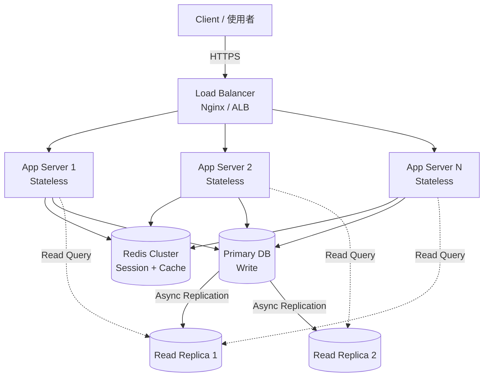
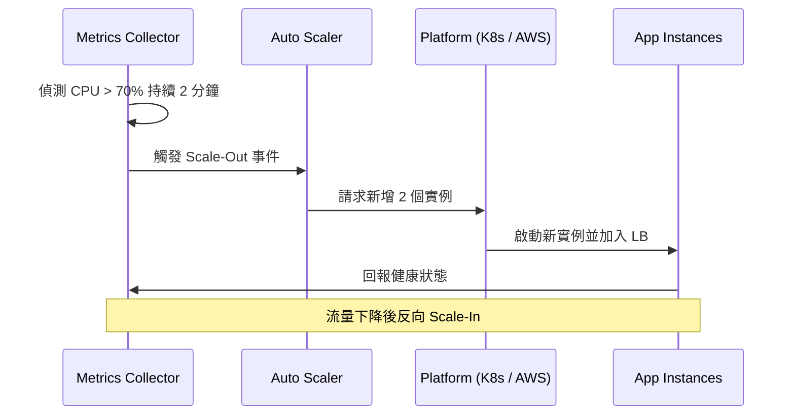

# Scalability Fundamentals / 可擴展性基礎

## Intent / 意圖

可擴展性（Scalability）是系統在負載增長時，仍能維持可接受效能與可用性的能力。
本篇筆記建立水平擴展、無狀態設計、分片與複製等核心概念的基礎，並以 Rust（Axum）與 Go 實作示範如何打造可水平擴展的服務。

## Problem / 問題情境

**情境：電商限時搶購（Flash Sale）**

某電商平台日常流量約 5,000 RPS，但在限時搶購活動期間，流量會在數秒內暴增至 200,000 RPS。
單台伺服器無法承受此負載，資料庫連線池耗盡，使用者看到 502 錯誤，訂單資料遺失。

問題核心：
- 單機運算資源（CPU / 記憶體）無法垂直擴展到足夠大
- Session 綁定在單機記憶體，無法分散流量
- 資料庫成為單點瓶頸（Single Point of Bottleneck）
- 沒有自動擴縮機制，無法應對瞬間流量

## Core Concepts / 核心概念

### Horizontal Scaling / 水平擴展

增加更多機器來分散負載，而非升級單機硬體。每個實例（instance）處理一部分請求。

### Vertical Scaling / 垂直擴展

升級單台機器的 CPU、記憶體、磁碟等硬體資源。簡單但有物理上限，且存在單點故障風險。

### Stateless Design / 無狀態設計

每個請求都攜帶完整的處理所需資訊，伺服器不在本地記憶體中保存 session。
狀態外部化至 Redis、資料庫等共享儲存，使任意實例都能處理任意請求。

### Sharding / 分片

將資料依特定鍵（如 user_id % N）分散到不同的資料庫節點。
降低單一節點的資料量與查詢壓力，但增加跨分片查詢的複雜度。

### Partitioning / 分區

將大型資料表依時間、範圍或雜湊拆分為較小的分區（partition），
資料仍在同一資料庫內，但查詢可只掃描相關分區。

### Replication / 複製

將資料同步複製到多個節點（read replica），讀取請求可分散至副本，
寫入集中在主節點（primary），提升讀取吞吐量與容錯能力。

### Load Distribution / 負載分配

透過 Load Balancer（如 Nginx、HAProxy、AWS ALB）將流量均勻分配到多台應用伺服器，
常見策略有 Round Robin、Least Connections、IP Hash 等。

### Auto-Scaling / 自動擴縮

根據 CPU 使用率、請求佇列深度、回應延遲等指標，自動增減實例數量。
常見於雲端平台的 Auto Scaling Group（AWS）、Horizontal Pod Autoscaler（Kubernetes）。

## Architecture / 架構

### 水平擴展整體架構



### 自動擴縮流程



## How It Works / 運作原理

水平擴展搭配無狀態設計的運作步驟：

1. **狀態外部化**：將 session、快取、暫存資料移至 Redis 或共享儲存，應用伺服器本地不保留任何使用者狀態。

2. **負載均衡器分配**：使用者請求先到達 Load Balancer，LB 依據策略（Round Robin 或 Least Connections）將請求轉發到任一可用的應用伺服器。

3. **任意實例可處理任意請求**：因為狀態已外部化，使用者 A 的第一個請求可由 Server 1 處理，第二個請求由 Server 3 處理，結果完全一致。

4. **讀寫分離**：寫入操作送至 Primary DB，讀取操作由 Read Replica 處理，降低主資料庫壓力。

5. **快取層加速**：熱門資料（如商品資訊、使用者 session）先查 Redis，命中則不需存取資料庫。

6. **自動擴縮**：監控系統偵測到 CPU 或延遲超過閾值時，自動啟動新實例；負載下降時自動回收，節省成本。

7. **健康檢查與故障移除**：LB 定期對每個實例發送 health check，不健康的實例自動從路由中移除，確保使用者請求只到達正常運作的伺服器。

## Rust 實作

以 Axum 0.8 實作無狀態 HTTP 服務，session 儲存於 Redis，支援水平擴展。

```rust
// Cargo.toml dependencies:
// axum = "0.8"
// tokio = { version = "1", features = ["full"] }
// redis = { version = "0.27", features = ["aio", "tokio-comp"] }
// serde = { version = "1", features = ["derive"] }
// serde_json = "1"
// uuid = { version = "1", features = ["v4"] }
// tower-http = { version = "0.6", features = ["cors"] }

use axum::{
    extract::State,
    http::StatusCode,
    response::Json,
    routing::{get, post},
    Router,
};
use redis::AsyncCommands;
use serde::{Deserialize, Serialize};
use std::sync::Arc;
use uuid::Uuid;

#[derive(Clone)]
struct AppState {
    redis_pool: redis::aio::ConnectionManager,
    instance_id: String,
}

#[derive(Serialize, Deserialize)]
struct UserSession {
    user_id: String,
    username: String,
    login_at: String,
}

#[derive(Deserialize)]
struct LoginRequest {
    username: String,
    password: String,
}

#[derive(Serialize)]
struct LoginResponse {
    session_token: String,
    instance_id: String,
}

#[derive(Serialize)]
struct SessionResponse {
    session: UserSession,
    served_by: String,
}

#[derive(Serialize)]
struct HealthResponse {
    status: String,
    instance_id: String,
}

async fn login_handler(
    State(state): State<Arc<AppState>>,
    Json(request): Json<LoginRequest>,
) -> Result<Json<LoginResponse>, StatusCode> {
    // 模擬驗證邏輯（實際應查詢資料庫並驗證密碼雜湊）
    if request.password.len() < 8 {
        return Err(StatusCode::UNAUTHORIZED);
    }

    let session_token = Uuid::new_v4().to_string();
    let session = UserSession {
        user_id: Uuid::new_v4().to_string(),
        username: request.username,
        login_at: chrono::Utc::now().to_rfc3339(),
    };

    let session_json = serde_json::to_string(&session)
        .map_err(|_| StatusCode::INTERNAL_SERVER_ERROR)?;

    // 將 session 儲存至 Redis，設定 30 分鐘過期
    let mut conn = state.redis_pool.clone();
    let cache_key = format!("session:{}", session_token);
    let _: () = conn
        .set_ex(&cache_key, &session_json, 1800)
        .await
        .map_err(|_| StatusCode::INTERNAL_SERVER_ERROR)?;

    Ok(Json(LoginResponse {
        session_token,
        instance_id: state.instance_id.clone(),
    }))
}
// Output: POST /login -> { "session_token": "uuid-v4", "instance_id": "instance-xxxx" }

async fn get_session_handler(
    State(state): State<Arc<AppState>>,
    axum::extract::Path(token): axum::extract::Path<String>,
) -> Result<Json<SessionResponse>, StatusCode> {
    let mut conn = state.redis_pool.clone();
    let cache_key = format!("session:{}", token);

    let session_json: String = conn
        .get(&cache_key)
        .await
        .map_err(|_| StatusCode::INTERNAL_SERVER_ERROR)?;

    let session: UserSession = serde_json::from_str(&session_json)
        .map_err(|_| StatusCode::NOT_FOUND)?;

    // 任一實例都能讀取同一份 session — 這就是無狀態設計的關鍵
    Ok(Json(SessionResponse {
        session,
        served_by: state.instance_id.clone(),
    }))
}
// Output: GET /session/:token -> { "session": {...}, "served_by": "instance-xxxx" }

async fn health_handler(
    State(state): State<Arc<AppState>>,
) -> Json<HealthResponse> {
    Json(HealthResponse {
        status: "healthy".to_string(),
        instance_id: state.instance_id.clone(),
    })
}
// Output: GET /health -> { "status": "healthy", "instance_id": "instance-xxxx" }

#[tokio::main]
async fn main() {
    let redis_url = std::env::var("REDIS_URL")
        .unwrap_or_else(|_| "redis://127.0.0.1:6379".to_string());

    let redis_client = redis::Client::open(redis_url)
        .expect("failed to create Redis client");
    let redis_conn = redis::aio::ConnectionManager::new(redis_client)
        .await
        .expect("failed to connect to Redis");

    let instance_id = format!("instance-{}", &Uuid::new_v4().to_string()[..8]);

    let shared_state = Arc::new(AppState {
        redis_pool: redis_conn,
        instance_id: instance_id.clone(),
    });

    let app = Router::new()
        .route("/login", post(login_handler))
        .route("/session/{token}", get(get_session_handler))
        .route("/health", get(health_handler))
        .with_state(shared_state);

    let bind_addr = std::env::var("BIND_ADDR")
        .unwrap_or_else(|_| "0.0.0.0:3000".to_string());
    let listener = tokio::net::TcpListener::bind(&bind_addr)
        .await
        .expect("failed to bind address");

    println!("Server {instance_id} listening on {bind_addr}");
    axum::serve(listener, app).await.expect("server error");
}
// Output: Server instance-a1b2c3d4 listening on 0.0.0.0:3000
```

**重點說明：**
- `AppState` 中不包含任何使用者 session，所有狀態存 Redis
- `instance_id` 用於追蹤請求被哪台實例處理，驗證負載均衡效果
- `/health` 端點供 Load Balancer 做健康檢查
- 使用 `ConnectionManager` 自動管理 Redis 連線重連

## Go 實作

以 Go 標準函式庫 `net/http` 實作相同的無狀態服務。

```go
package main

import (
	"context"
	"encoding/json"
	"fmt"
	"log"
	"net/http"
	"os"
	"time"

	"github.com/google/uuid"
	"github.com/redis/go-redis/v9"
)

type AppState struct {
	RedisClient *redis.Client
	InstanceID  string
}

type UserSession struct {
	UserID   string `json:"user_id"`
	Username string `json:"username"`
	LoginAt  string `json:"login_at"`
}

type LoginRequest struct {
	Username string `json:"username"`
	Password string `json:"password"`
}

type LoginResponse struct {
	SessionToken string `json:"session_token"`
	InstanceID   string `json:"instance_id"`
}

type SessionResponse struct {
	Session  UserSession `json:"session"`
	ServedBy string      `json:"served_by"`
}

type HealthResponse struct {
	Status     string `json:"status"`
	InstanceID string `json:"instance_id"`
}

func (s *AppState) loginHandler(w http.ResponseWriter, r *http.Request) {
	if r.Method != http.MethodPost {
		http.Error(w, "method not allowed", http.StatusMethodNotAllowed)
		return
	}

	var request LoginRequest
	if err := json.NewDecoder(r.Body).Decode(&request); err != nil {
		http.Error(w, "invalid request body", http.StatusBadRequest)
		return
	}

	// 模擬驗證邏輯
	if len(request.Password) < 8 {
		http.Error(w, "unauthorized", http.StatusUnauthorized)
		return
	}

	sessionToken := uuid.New().String()
	session := UserSession{
		UserID:   uuid.New().String(),
		Username: request.Username,
		LoginAt:  time.Now().UTC().Format(time.RFC3339),
	}

	sessionJSON, err := json.Marshal(session)
	if err != nil {
		http.Error(w, "internal error", http.StatusInternalServerError)
		return
	}

	// 將 session 儲存至 Redis，設定 30 分鐘過期
	ctx := context.Background()
	cacheKey := fmt.Sprintf("session:%s", sessionToken)
	if err := s.RedisClient.Set(ctx, cacheKey, sessionJSON, 30*time.Minute).Err(); err != nil {
		http.Error(w, "failed to store session", http.StatusInternalServerError)
		return
	}

	w.Header().Set("Content-Type", "application/json")
	json.NewEncoder(w).Encode(LoginResponse{
		SessionToken: sessionToken,
		InstanceID:   s.InstanceID,
	})
}
// Output: POST /login -> { "session_token": "uuid-v4", "instance_id": "instance-xxxx" }

func (s *AppState) getSessionHandler(w http.ResponseWriter, r *http.Request) {
	token := r.PathValue("token")
	if token == "" {
		http.Error(w, "missing token", http.StatusBadRequest)
		return
	}

	ctx := context.Background()
	cacheKey := fmt.Sprintf("session:%s", token)

	sessionJSON, err := s.RedisClient.Get(ctx, cacheKey).Result()
	if err == redis.Nil {
		http.Error(w, "session not found", http.StatusNotFound)
		return
	} else if err != nil {
		http.Error(w, "internal error", http.StatusInternalServerError)
		return
	}

	var session UserSession
	if err := json.Unmarshal([]byte(sessionJSON), &session); err != nil {
		http.Error(w, "corrupted session data", http.StatusInternalServerError)
		return
	}

	// 任一實例都能讀取同一份 session — 無狀態設計的關鍵
	w.Header().Set("Content-Type", "application/json")
	json.NewEncoder(w).Encode(SessionResponse{
		Session:  session,
		ServedBy: s.InstanceID,
	})
}
// Output: GET /session/{token} -> { "session": {...}, "served_by": "instance-xxxx" }

func (s *AppState) healthHandler(w http.ResponseWriter, r *http.Request) {
	w.Header().Set("Content-Type", "application/json")
	json.NewEncoder(w).Encode(HealthResponse{
		Status:     "healthy",
		InstanceID: s.InstanceID,
	})
}
// Output: GET /health -> { "status": "healthy", "instance_id": "instance-xxxx" }

func main() {
	redisAddr := os.Getenv("REDIS_URL")
	if redisAddr == "" {
		redisAddr = "127.0.0.1:6379"
	}

	redisClient := redis.NewClient(&redis.Options{
		Addr:     redisAddr,
		PoolSize: 20,
	})

	instanceID := fmt.Sprintf("instance-%s", uuid.New().String()[:8])

	state := &AppState{
		RedisClient: redisClient,
		InstanceID:  instanceID,
	}

	mux := http.NewServeMux()
	mux.HandleFunc("POST /login", state.loginHandler)
	mux.HandleFunc("GET /session/{token}", state.getSessionHandler)
	mux.HandleFunc("GET /health", state.healthHandler)

	bindAddr := os.Getenv("BIND_ADDR")
	if bindAddr == "" {
		bindAddr = "0.0.0.0:3000"
	}

	log.Printf("Server %s listening on %s", instanceID, bindAddr)
	if err := http.ListenAndServe(bindAddr, mux); err != nil {
		log.Fatalf("server error: %v", err)
	}
}
// Output: Server instance-a1b2c3d4 listening on 0.0.0.0:3000
```

**重點說明：**
- 使用 Go 1.22+ 的 `r.PathValue()` 與路由模式 `GET /session/{token}`
- `AppState` 以指標傳遞，不含任何使用者狀態
- Redis 連線池大小設為 20，可依據實例數量與負載調整
- `/health` 端點供 Load Balancer 做健康檢查

## Rust vs Go 對照表

| 面向 | Rust (Axum) | Go (net/http) |
|------|-------------|---------------|
| **並行模型** | tokio async runtime，零成本抽象的 Future。單執行緒可處理數萬連線，記憶體用量極低 | goroutine + M:N scheduler。每個連線一個 goroutine，輕量但數量過多時 GC 壓力增加 |
| **型別安全** | 編譯期保證型別安全，extractor 模式讓路由參數解析在編譯期驗證 | 執行期 JSON 解碼，需手動檢查錯誤。`PathValue` 回傳 string 需自行轉型 |
| **錯誤處理** | `Result<T, E>` 搭配 `?` 運算子，強制處理所有錯誤路徑 | 慣例回傳 `error`，但編譯器不強制檢查，容易遺漏 |
| **部署體積** | 靜態編譯，單一二進制檔，約 5-15 MB（strip 後） | 靜態編譯，約 10-20 MB，`CGO_ENABLED=0` 可去除 C 依賴 |
| **啟動速度** | 極快（< 10ms），適合 serverless 與快速擴縮 | 快（< 50ms），同樣適合容器化部署 |
| **生態成熟度** | 生態持續成長，tower middleware 體系完整但學習曲線較陡 | 標準函式庫即涵蓋 HTTP server，第三方套件豐富，上手快 |

## When to Use / 適用場景

### 1. 流量高峰不可預測的服務

電商搶購、社群媒體病毒式傳播、新聞即時推播等場景，流量可能在數秒內增長 10-100 倍。
水平擴展搭配自動擴縮是唯一能應對此類爆發流量的架構。

### 2. 讀多寫少的應用

內容平台、商品目錄、新聞網站等以讀取為主的服務，透過 Read Replica + 快取層即可大幅提升吞吐量，
而不需要複雜的分散式寫入協調。

### 3. 多地區部署（Multi-Region）

全球化服務需要在不同地理區域部署實例以降低延遲，水平擴展的無狀態架構天然適合此需求，
搭配 CDN 與 GeoDNS 可將使用者導向最近的節點。

## When NOT to Use / 不適用場景

### 1. 強一致性即時交易系統

銀行核心帳務、證券交易撮合等需要嚴格線性一致性（Linearizability）的場景，
水平擴展會引入分散式一致性的複雜度（CAP theorem），單機或主從架構可能更合適。

### 2. 小規模內部工具

使用者僅數十人的後台管理系統，單機即可滿足需求。
引入 Load Balancer、Redis、多實例只會增加維運成本與架構複雜度，得不償失。

### 3. 重狀態的長連線服務

WebSocket 遊戲伺服器、即時協作編輯器等需要在記憶體中維持大量連線狀態的服務，
簡單的無狀態水平擴展不適用，需要 sticky session 或專門的狀態同步機制。

## Real-World Examples / 真實世界案例

### Netflix

- 微服務架構，超過 1,000 個獨立服務，部署在 AWS 上
- 使用 Zuul 作為 API Gateway / Load Balancer
- EVCache（基於 Memcached）處理每秒數百萬次快取查詢
- 每個微服務獨立擴縮，依據 CPU / RPS 自動調整實例數量
- 全球多 Region 部署，使用者連接最近的 CDN 節點

### Twitter (X)

- 發推（Write）與讀取 Timeline（Read）完全分離
- 發推時透過 Fan-out 機制將推文寫入每個 follower 的 Timeline 快取（Redis）
- 讀取 Timeline 純粹是快取查詢，可輕鬆水平擴展
- 對於擁有數百萬 follower 的大 V 帳號，改用 Pull 模式避免 Fan-out 爆炸

### Shopify

- 採用 Pod 架構，每個 Pod 是獨立的 Rails 應用 + 資料庫組
- 租戶（商店）依據 shop_id 路由到對應的 Pod
- 單一 Pod 出問題不影響其他商店，實現故障隔離
- 透過增加 Pod 數量來水平擴展，每個 Pod 內部可獨立做讀寫分離

## Interview Questions / 面試常見問題

### Q1: 水平擴展與垂直擴展的差異？何時選擇哪一種？

水平擴展（Scale Out）增加機器數量分散負載，垂直擴展（Scale Up）升級單機硬體。水平擴展理論上無上限、可容錯，但架構複雜度高（需要無狀態設計、負載均衡）。垂直擴展簡單直接但有物理上限且存在單點故障。一般做法是先垂直擴展至合理規模，再轉向水平擴展。

### Q2: 如何設計無狀態服務？

將所有 session、快取、暫存資料移至外部共享儲存（Redis、資料庫）。服務本身不在記憶體中保存使用者狀態。請求中透過 token（如 JWT 或 session ID）攜帶身份資訊，伺服器每次都從外部儲存還原上下文。

### Q3: 資料庫如何做水平擴展？

常見策略包括：(1) 讀寫分離，寫入走 Primary，讀取走 Replica；(2) 分片（Sharding），依 shard key 將資料分散到不同節點；(3) 使用分散式資料庫如 CockroachDB、TiDB 原生支援水平擴展。選擇 shard key 時需考慮資料分佈均勻性與查詢模式。

### Q4: 什麼是 CAP theorem？它如何影響可擴展性設計？

CAP 定理指出分散式系統在網路分區（Partition）發生時，只能在一致性（Consistency）和可用性（Availability）之間二選一。設計可擴展系統時需明確選擇：CP 系統（如 ZooKeeper）犧牲可用性換一致性；AP 系統（如 Cassandra）犧牲一致性換可用性。多數 Web 應用選擇最終一致性（Eventual Consistency）以獲得更好的可用性與擴展性。

### Q5: 自動擴縮要注意哪些問題？

(1) 冷啟動延遲：新實例從啟動到可服務需要時間，要預留 buffer；(2) 指標選擇：CPU 不一定是最佳指標，RPS 或 P99 延遲可能更準確；(3) 抖動防護（Cooldown）：避免指標短暫波動造成頻繁擴縮；(4) 最小實例數：確保始終有足夠實例處理基礎流量。

## Pitfalls / 常見陷阱

### 1. Session Affinity 依賴（通用）

將 session 存在本地記憶體，依賴 Load Balancer 的 sticky session 將同一使用者導向同一實例。
當該實例故障或重啟時，使用者 session 遺失。正確做法是完全無狀態化，session 存 Redis。

### 2. 分散式快取不一致（通用）

多實例各自維護本地快取（如 HashMap），資料更新後各實例快取不同步。
應使用集中式快取（Redis）或搭配快取失效機制（Cache Invalidation via Pub/Sub）。

### 3. 資料庫連線池爆炸（通用）

水平擴展 N 個實例，每個實例有 20 個連線，資料庫需承受 N * 20 個連線。
當 N 從 5 增加到 50 時，連線數從 100 暴增到 1000，超出資料庫上限。
解法：使用連線池代理如 PgBouncer，或減少每個實例的連線數。

### 4. Rust: `Send + Sync` bound 問題

在 Axum 中，handler 的 Future 必須是 `Send`。若在 async 函式中持有非 `Send` 的型別（如 `Rc` 或 `RefCell`）跨越 `.await`，會產生編譯錯誤。解法是使用 `Arc` + `Mutex`（或 `tokio::sync::Mutex`），或確保非 `Send` 值在 `.await` 之前 drop。

```rust
// 錯誤示範：Rc 不是 Send
async fn bad_handler() {
    let data = std::rc::Rc::new(42);
    tokio::time::sleep(std::time::Duration::from_secs(1)).await;
    println!("{}", data); // 編譯錯誤：Rc 不能跨 .await
}

// 正確做法：使用 Arc
async fn good_handler() {
    let data = std::sync::Arc::new(42);
    tokio::time::sleep(std::time::Duration::from_secs(1)).await;
    println!("{}", data); // 正常運作
}
// Output: 42
```

### 5. Go: goroutine 洩漏

在 HTTP handler 中啟動 goroutine 做非同步處理，但忘記設定超時或取消機制，
導致 goroutine 永遠阻塞不釋放，記憶體持續增長。

```go
// 錯誤示範：goroutine 可能永久阻塞
func badHandler(w http.ResponseWriter, r *http.Request) {
    resultCh := make(chan string)
    go func() {
        // 若外部服務無回應，此 goroutine 永遠阻塞
        result := callExternalService()
        resultCh <- result
    }()
    result := <-resultCh
    fmt.Fprint(w, result)
}

// 正確做法：使用 context 設定超時
func goodHandler(w http.ResponseWriter, r *http.Request) {
    ctx, cancel := context.WithTimeout(r.Context(), 5*time.Second)
    defer cancel()

    resultCh := make(chan string, 1)
    go func() {
        result := callExternalService()
        resultCh <- result
    }()

    select {
    case result := <-resultCh:
        fmt.Fprint(w, result)
    case <-ctx.Done():
        http.Error(w, "request timeout", http.StatusGatewayTimeout)
    }
}
// Output: 正常回應或 504 Gateway Timeout
```

### 6. Go: Race Condition 在共享狀態

多個 goroutine 同時讀寫共享的 map 會導致 `fatal error: concurrent map writes`。
即使是讀取 metrics 的場景也必須加鎖或使用 `sync.Map`。

```go
// 錯誤示範：concurrent map writes
var requestCount = make(map[string]int)

func unsafeMiddleware(next http.Handler) http.Handler {
    return http.HandlerFunc(func(w http.ResponseWriter, r *http.Request) {
        requestCount[r.URL.Path]++ // 併發寫入會 panic
        next.ServeHTTP(w, r)
    })
}

// 正確做法：使用 sync.Mutex
var (
    mu           sync.Mutex
    requestCount = make(map[string]int)
)

func safeMiddleware(next http.Handler) http.Handler {
    return http.HandlerFunc(func(w http.ResponseWriter, r *http.Request) {
        mu.Lock()
        requestCount[r.URL.Path]++
        mu.Unlock()
        next.ServeHTTP(w, r)
    })
}
// Output: 安全地遞增計數器，不會 panic
```

## References / 參考資料

- Kleppmann, M. (2017). *Designing Data-Intensive Applications* (DDIA). O'Reilly. 特別是 Chapter 1 (Reliability, Scalability, Maintainability) 與 Chapter 6 (Partitioning)
- Axum 官方文件: https://docs.rs/axum/latest/axum/
- Go 標準函式庫 net/http: https://pkg.go.dev/net/http
- Redis 官方文件: https://redis.io/docs/
- AWS Well-Architected Framework - Performance Efficiency Pillar: https://docs.aws.amazon.com/wellarchitected/latest/performance-efficiency-pillar/
- Google SRE Book, Chapter 22 - Addressing Cascading Failures: https://sre.google/sre-book/addressing-cascading-failures/
- Netflix Tech Blog - Scaling: https://netflixtechblog.com/
- Martin Fowler - Patterns of Enterprise Application Architecture (Session State Patterns): https://martinfowler.com/

## Cross-references / 交叉引用

- 索引設計與資料庫查詢優化: [../../database/indexing.md](../../database/indexing.md)
- 交易隔離等級與一致性保證: [../../database/isolation_levels.md](../../database/isolation_levels.md)
- 資料庫交易基礎: [../../database/transactions.md](../../database/transactions.md)
- 分散式系統設計（系列後續篇章）: [../distributed_systems/](../distributed_systems/)
- 基礎建設與部署: [../infrastructure/](../infrastructure/)
