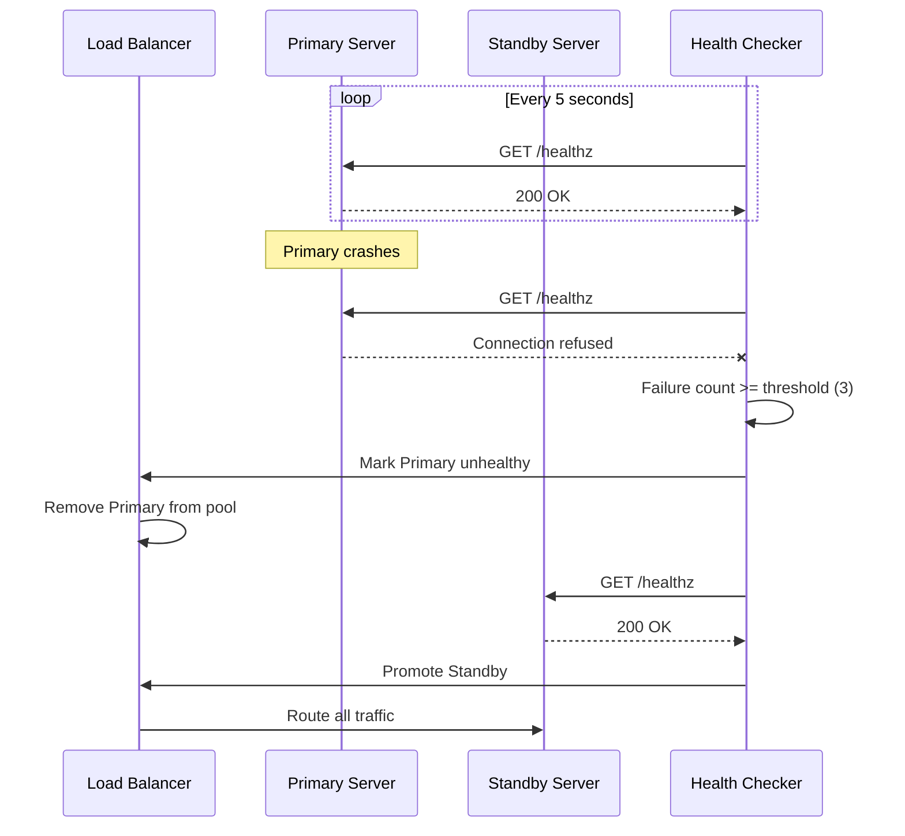
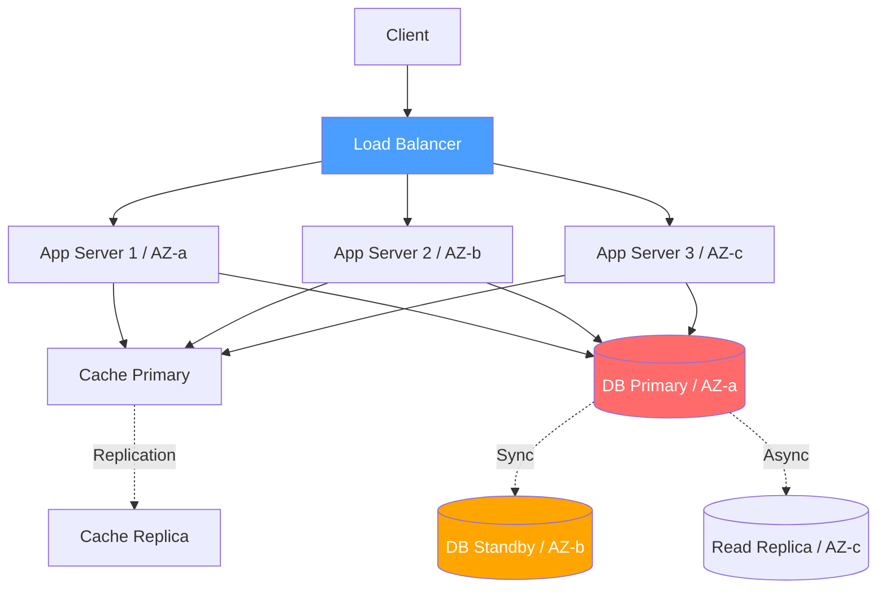

# Availability & Fault Tolerance / 可用性與容錯

## Intent / 意圖

可用性（Availability）確保系統在任何時間點都能正常回應使用者請求；容錯（Fault Tolerance）則讓系統在部分元件故障時仍能持續運作。兩者的共同目標是：**即使硬體損壞、網路中斷或軟體異常，服務依然對外可用，使用者感受不到中斷。**

- 減少停機時間（downtime），保護商業營收與用戶信任
- 讓故障成為「預期中的事件」而非「災難」
- 透過自動化偵測與復原，降低人為介入的需求

---

## Problem / 問題情境

**單點故障（SPOF）**：電商平台僅一台應用伺服器，SSD 故障後整站下線 4 小時，無備援導致 MTTR 極長。

**串聯式故障（Cascading Failure）**：訂單服務呼叫庫存服務，庫存服務依賴資料庫。資料庫變慢時，庫存服務的執行緒池耗盡，連帶拖垮訂單服務，形成骨牌效應。

**部署中斷**：沒有 graceful shutdown，部署新版時現有連線被強制斷開，正在處理的交易遺失。

---

## Core Concepts / 核心概念

### Availability Nines / 可用性等級

| 等級 | 可用率 | 年停機時間 | 典型場景 |
|------|--------|-----------|---------|
| Two Nines | 99% | 3.65 天 | 內部工具 |
| Three Nines | 99.9% | 8.76 小時 | 一般 SaaS |
| Four Nines | 99.99% | 52.6 分鐘 | 金融交易平台 |
| Five Nines | 99.999% | 5.26 分鐘 | 電信核心網路 |

### MTTR / MTTF / MTBF

- **MTTF**（Mean Time To Failure / 平均故障前時間）：系統從啟動到首次故障的平均時間
- **MTTR**（Mean Time To Recovery / 平均復原時間）：從故障發生到恢復服務的平均時間
- **MTBF**（Mean Time Between Failures / 平均故障間隔）：MTBF = MTTF + MTTR
- **可用性公式**：`Availability = MTTF / (MTTF + MTTR)`

### Redundancy / 冗餘

在關鍵路徑上部署多個相同元件，使任何單一元件故障都不會導致服務中斷。

### Failover / 故障轉移

- **Active-Passive（主備模式）**：主節點處理流量，備援節點待命。簡單但資源閒置。
- **Active-Active（雙活模式）**：所有節點同時處理流量。利用率高，但狀態同步較複雜。

### Health Check / 健康檢查

- **Liveness Probe**（存活探測）：確認程序是否還在跑
- **Readiness Probe**（就緒探測）：確認服務是否準備好接收流量

### Graceful Degradation / 優雅降級

部分功能不可用時，主動關閉非核心功能，保留核心服務。例如推薦系統故障時改顯示熱門商品。

### Chaos Engineering / 混沌工程

主動注入故障（隨機終止容器、模擬延遲）驗證容錯能力。**不主動測試故障，故障會在最糟糕的時候找上你。**

---

## Architecture / 架構

### Failover Flow with Health Check



### Redundant Architecture



---

## How It Works / 運作原理

### 健康檢查與故障轉移

1. **註冊端點**：每個實例暴露 `/healthz`（liveness）與 `/readyz`（readiness）
2. **定期探測**：Health Checker 每 5 秒對所有實例發送 HTTP GET
3. **故障判定**：連續 3 次探測失敗，標記為不健康
4. **流量摘除**：Load Balancer 將不健康實例從路由池移除
5. **故障轉移**：流量導向剩餘健康實例或觸發備援晉升
6. **自我修復**：實例恢復探測通過後，經觀察期重新加入
7. **告警通知**：發送告警至 on-call 工程師

### Graceful Shutdown

1. 收到 SIGTERM → 2. 停止接受新連線 → 3. 等待現有請求完成（設超時上限） → 4. 關閉連線池、釋放資源 → 5. 安全退出

---

## Rust 實作

Axum 0.8+ 健康檢查端點 + graceful shutdown：

```rust
// availability_server.rs
use axum::{Router, Json, extract::State, routing::get};
use serde::Serialize;
use std::sync::Arc;
use std::sync::atomic::{AtomicBool, Ordering};
use std::time::Instant;
use tokio::net::TcpListener;
use tokio::signal;

#[derive(Clone)]
struct AppState {
    start_time: Instant,
    is_ready: Arc<AtomicBool>,
}

#[derive(Serialize)]
struct HealthResponse {
    status: &'static str,
    uptime_seconds: u64,
}

#[derive(Serialize)]
struct ReadinessResponse {
    status: &'static str,
    database: &'static str,
    cache: &'static str,
}

async fn liveness(State(state): State<AppState>) -> Json<HealthResponse> {
    let uptime = state.start_time.elapsed().as_secs();
    Json(HealthResponse { status: "alive", uptime_seconds: uptime })
    // Output: {"status":"alive","uptime_seconds":42}
}

async fn readiness(
    State(state): State<AppState>,
) -> (axum::http::StatusCode, Json<ReadinessResponse>) {
    if state.is_ready.load(Ordering::Relaxed) {
        (axum::http::StatusCode::OK, Json(ReadinessResponse {
            status: "ready", database: "connected", cache: "connected",
        }))
    } else {
        (axum::http::StatusCode::SERVICE_UNAVAILABLE, Json(ReadinessResponse {
            status: "not_ready", database: "disconnected", cache: "disconnected",
        }))
    }
    // Output (ready):     200 {"status":"ready","database":"connected","cache":"connected"}
    // Output (not ready): 503 {"status":"not_ready",...}
}

async fn shutdown_signal() {
    let ctrl_c = async { signal::ctrl_c().await.expect("Ctrl+C handler failed") };
    let terminate = async {
        signal::unix::signal(signal::unix::SignalKind::terminate())
            .expect("SIGTERM handler failed")
            .recv().await;
    };
    tokio::select! {
        _ = ctrl_c => println!("Received Ctrl+C, shutting down..."),
        _ = terminate => println!("Received SIGTERM, shutting down..."),
    }
}

#[tokio::main]
async fn main() {
    let state = AppState {
        start_time: Instant::now(),
        is_ready: Arc::new(AtomicBool::new(true)),
    };
    let app = Router::new()
        .route("/healthz", get(liveness))
        .route("/readyz", get(readiness))
        .with_state(state);

    let listener = TcpListener::bind("0.0.0.0:8080").await.expect("bind failed");
    println!("Server listening on 0.0.0.0:8080");

    axum::serve(listener, app)
        .with_graceful_shutdown(shutdown_signal())
        .await
        .expect("server error");
    println!("Server shut down gracefully.");
    // Output: Server listening on 0.0.0.0:8080
    // Output (on SIGTERM): Received SIGTERM, shutting down...
    // Output: Server shut down gracefully.
}
```

```toml
# Cargo.toml
[dependencies]
axum = "0.8"
tokio = { version = "1", features = ["full"] }
serde = { version = "1", features = ["derive"] }
serde_json = "1"
```

---

## Go 實作

Go 1.24+ 標準庫健康檢查 + graceful shutdown：

```go
// availability_server.go
package main

import (
	"context"
	"encoding/json"
	"fmt"
	"net/http"
	"os"
	"os/signal"
	"sync/atomic"
	"syscall"
	"time"
)

type HealthResponse struct {
	Status        string `json:"status"`
	UptimeSeconds int64  `json:"uptime_seconds"`
}

type ReadinessResponse struct {
	Status   string `json:"status"`
	Database string `json:"database"`
	Cache    string `json:"cache"`
}

type AppState struct {
	startTime time.Time
	isReady   atomic.Bool
}

func main() {
	state := &AppState{startTime: time.Now()}
	state.isReady.Store(true)

	mux := http.NewServeMux()

	mux.HandleFunc("GET /healthz", func(w http.ResponseWriter, r *http.Request) {
		w.Header().Set("Content-Type", "application/json")
		json.NewEncoder(w).Encode(HealthResponse{
			Status:        "alive",
			UptimeSeconds: int64(time.Since(state.startTime).Seconds()),
		})
		// Output: {"status":"alive","uptime_seconds":42}
	})

	mux.HandleFunc("GET /readyz", func(w http.ResponseWriter, r *http.Request) {
		w.Header().Set("Content-Type", "application/json")
		if state.isReady.Load() {
			json.NewEncoder(w).Encode(ReadinessResponse{
				Status: "ready", Database: "connected", Cache: "connected",
			})
			// Output: 200 {"status":"ready","database":"connected","cache":"connected"}
		} else {
			w.WriteHeader(http.StatusServiceUnavailable)
			json.NewEncoder(w).Encode(ReadinessResponse{
				Status: "not_ready", Database: "disconnected", Cache: "disconnected",
			})
			// Output: 503 {"status":"not_ready",...}
		}
	})

	server := &http.Server{
		Addr:         ":8080",
		Handler:      mux,
		ReadTimeout:  10 * time.Second,
		WriteTimeout: 10 * time.Second,
		IdleTimeout:  60 * time.Second,
	}

	go func() {
		fmt.Println("Server listening on 0.0.0.0:8080")
		if err := server.ListenAndServe(); err != nil && err != http.ErrServerClosed {
			fmt.Fprintf(os.Stderr, "server error: %v\n", err)
			os.Exit(1)
		}
	}()

	quit := make(chan os.Signal, 1)
	signal.Notify(quit, syscall.SIGINT, syscall.SIGTERM)
	sig := <-quit
	fmt.Printf("Received %s, shutting down...\n", sig)

	ctx, cancel := context.WithTimeout(context.Background(), 30*time.Second)
	defer cancel()
	if err := server.Shutdown(ctx); err != nil {
		fmt.Fprintf(os.Stderr, "shutdown failed: %v\n", err)
		os.Exit(1)
	}
	fmt.Println("Server shut down gracefully.")
	// Output: Server listening on 0.0.0.0:8080
	// Output (on SIGTERM): Received interrupt, shutting down...
	// Output: Server shut down gracefully.
}
```

---

## Rust vs Go 對照表

| 面向 | Rust (Axum / tokio) | Go (net/http / stdlib) |
|------|---------------------|------------------------|
| **Graceful Shutdown** | `axum::serve().with_graceful_shutdown()` 搭配 `tokio::signal`，runtime 自動等待 in-flight 連線 | `server.Shutdown(ctx)` 搭配 `context.WithTimeout`，需自行管理 goroutine |
| **狀態管理** | `Arc<AtomicBool>` + `State` extractor，編譯期保證執行緒安全 | `atomic.Bool`，需開發者自行避免 race condition |
| **錯誤處理** | `Result` + `?` 運算子，編譯器強制覆蓋所有錯誤路徑 | `if err != nil` 慣例，靠紀律保證 |
| **Timeout** | 需 `tower::timeout::TimeoutLayer` middleware | 原生 `ReadTimeout` / `WriteTimeout` / `IdleTimeout` |
| **並行模型** | async/await + tokio，零成本抽象，高吞吐低延遲 | goroutine + channel，啟動成本極低，大量 I/O 並發 |

---

## When to Use / 適用場景

**面向消費者的線上服務**：電商、銀行 App、社群媒體等 24/7 服務。停機直接影響營收與品牌。應採 Active-Active 多 AZ 部署 + 自動 failover + health check。

**支付與金融交易系統**：交易遺失後果嚴重，需 Four Nines 以上，搭配同步複寫、冪等設計、多層降級策略。

**關鍵路徑微服務**：被多個下游依賴的服務（認證、設定），故障會放大影響範圍，應優先投資容錯。

---

## When NOT to Use / 不適用場景

**一次性批次處理**：離線 ETL、資料遷移等「跑完即結束」的任務。重跑成本遠低於 Active-Active failover。應著重冪等性與 checkpoint。

**早期原型與 MVP**：使用者極少，過度設計高可用會拖慢開發。待 PMF 確認後再提升。

**低流量內部工具**：月活數十人的後台，多 AZ 的基礎設施成本可能超過停機損失。單實例 + 定期備份即可。

---

## Real-World Examples / 真實世界案例

### AWS Multi-AZ

RDS Multi-AZ 在不同可用區維護同步複寫的備援實例。主實例故障時，DNS 自動切換至備援，failover 60-120 秒完成，應用無需改連線字串。關鍵：同步複寫確保 RPO = 0、DNS-based failover 對應用層透明。

### Netflix Chaos Monkey

在生產環境隨機終止 EC2 實例，強迫團隊建構能承受節點故障的系統。演化為 Simian Army：Chaos Monkey（終止實例）、Latency Monkey（注入延遲）、Chaos Gorilla（模擬 AZ 失效）。核心哲學：可控條件下主動觸發故障，勝過凌晨三點被動面對。

### Google Spanner

透過 TrueTime API 與 Paxos 在全球資料中心間同步資料，達到 Five Nines 以上可用性，即使整個洲的資料中心下線也能持續服務。

---

## Interview Questions / 面試常見問題

**Q1: 如何計算多元件系統的整體可用性？**
串聯：各元件可用性相乘（兩個 99.9% 串聯 = 99.8%）。並聯：不可用率相乘再取補數（兩個 99.9% 並聯 = 99.9999%）。冗餘能大幅提升可用性。

**Q2: Active-Passive vs Active-Active 各適合什麼場景？**
Active-Passive 適合有狀態服務（DB 主從），寫入在單節點避免衝突。Active-Active 適合無狀態服務（API Server），資源利用率最高，但需處理一致性。

**Q3: Liveness 和 Readiness Probe 的差異？**
Liveness 回答「程序還活著嗎？」，失敗則重啟 Pod。Readiness 回答「能處理流量嗎？」，失敗則暫時摘除但不重啟。常見錯誤：將 DB 連線放入 liveness probe，DB 短暫不可用時全部 Pod 被重啟造成雪崩。

**Q4: 設計 99.99% 可用性系統需考量什麼？**
年停機 <= 52.6 分鐘。需：多 AZ 部署（>=3）、自動 failover、無狀態應用層、DB 同步複寫、滾動/金絲雀部署、全鏈路監控將 MTTR 壓至分鐘級。

**Q5: Graceful Shutdown 為何重要？**
避免 in-flight 交易遺失、確保 DB 連線正確歸還、讓 LB 有時間導向其他節點。沒有它，每次部署都會產生錯誤回應。

---

## Pitfalls / 常見陷阱

### 陷阱一：Liveness Probe 檢查外部依賴（Go & Rust 共通）

將 DB/Redis 連線狀態納入 liveness probe，外部依賴短暫不可用時所有 Pod 同時失敗，Kubernetes 全部重啟造成雪崩。外部依賴健康狀態應僅影響 readiness probe。

### 陷阱二：Go 中忽略 `server.Shutdown` 回傳錯誤

```go
// 錯誤：忽略 Shutdown 的錯誤
server.Shutdown(ctx)

// 正確：處理 context 超時等錯誤
if err := server.Shutdown(ctx); err != nil {
    log.Printf("shutdown failed: %v, forcing exit", err)
    os.Exit(1)
}
// Output: (on timeout) shutdown failed: context deadline exceeded, forcing exit
```

### 陷阱三：Rust `tokio::select!` 的 cancellation safety

```rust
// 若 process_request 不是 cancellation safe，
// select! 取消時可能遺失已讀取但未處理的資料
tokio::select! {
    result = process_request(&mut stream) => { /* handle */ }
    _ = shutdown_signal() => { /* cancels process_request */ }
}
// Output: (potential data loss if future is not cancellation safe)
```

未被選中的 future 會被 drop，若持有部分讀取狀態則資料遺失。應搭配 `CancellationToken` 在安全點檢查取消。

### 陷阱四：Health Check 間隔過於激進

間隔 1 秒 + 失敗閾值 1 次，會因網路抖動產生大量 false positive，節點頻繁被摘除又加回，反而降低可用性。建議間隔 5-10 秒、閾值 3 次。

### 陷阱五：Go 中 `time.After` 造成記憶體洩漏

```go
// 錯誤：每次迴圈建立新 timer，舊 timer 不會被 GC 直到觸發
for {
    select {
    case msg := <-messageChan:
        handleMessage(msg)
    case <-time.After(healthCheckInterval):
        performHealthCheck()
    }
}

// 正確：使用 Ticker，結束時 Stop
ticker := time.NewTicker(healthCheckInterval)
defer ticker.Stop()
for {
    select {
    case msg := <-messageChan:
        handleMessage(msg)
    case <-ticker.C:
        performHealthCheck()
    }
}
// Output: (no memory leak with Ticker approach)
```

---

## References / 參考資料

- Kleppmann, M. (2017). *Designing Data-Intensive Applications*. O'Reilly. Ch.8-9
- AWS: [RDS Multi-AZ Deployments](https://docs.aws.amazon.com/AmazonRDS/latest/UserGuide/Concepts.MultiAZ.html)
- Netflix Tech Blog: [The Netflix Simian Army](https://netflixtechblog.com/the-netflix-simian-army-16e57fbab116)
- Google SRE Book: [Implementing SLOs](https://sre.google/sre-book/implementing-slos/)
- Nygard, M. (2018). *Release It!* (2nd Ed). Pragmatic Bookshelf
- Kubernetes: [Configure Liveness, Readiness and Startup Probes](https://kubernetes.io/docs/tasks/configure-pod-container/configure-liveness-readiness-startup-probes/)
- Axum: [graceful shutdown example](https://github.com/tokio-rs/axum/tree/main/examples/graceful-shutdown)

---

## Cross-references / 交叉引用

- [[01_scalability_fundamentals]] - 可擴展性基礎：可用性常與水平擴展搭配使用
- [[03_circuit_breaker_pattern]] - 斷路器模式：防止串聯式故障的關鍵容錯模式
- [[04_load_balancing]] - 負載均衡：failover 機制的基礎設施層實作
- [[05_distributed_consensus]] - 分散式共識：Active-Active 架構中資料一致性的核心
- [[06_observability]] - 可觀測性：監控與告警是降低 MTTR 的關鍵
- [[07_deployment_strategies]] - 部署策略：滾動部署、藍綠部署與可用性的關係
