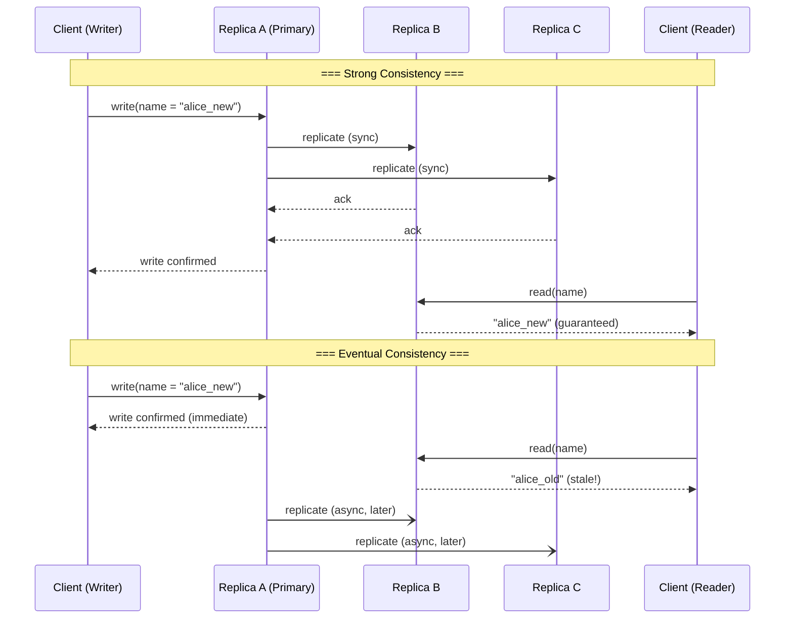
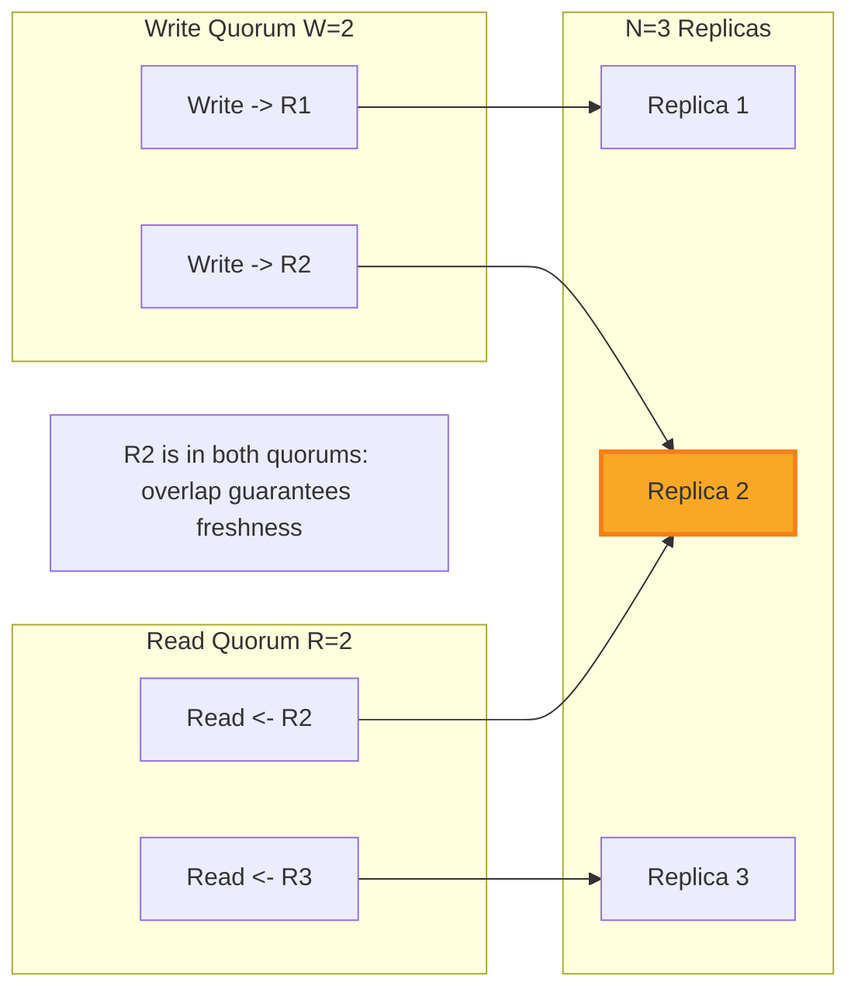

# Consistency Trade-offs / 一致性權衡

## Intent / 意圖

在分散式系統中，一致性模型（consistency model）決定了客戶端讀取資料時能獲得多「新鮮」的保證。不同的一致性等級在延遲（latency）、可用性（availability）與正確性（correctness）之間做出權衡。本篇目標是深入理解各種一致性模型的語意差異，並掌握在實務場景中如何選擇合適的一致性等級。

核心問題：**我們願意犧牲多少延遲與可用性，來換取更強的一致性保證？**

---

## Problem / 問題情境

**場景：使用者在手機上更新個人資料，隨即在筆電上查看卻看到舊資料。**

1. Alice 在手機 App 上將暱稱從 `alice_old` 改為 `alice_new`，寫入 Replica A。
2. 寫入成功後，Alice 切換到筆電打開網頁版，請求被路由到 Replica B。
3. Replica B 尚未收到來自 Replica A 的複製更新，回傳舊暱稱 `alice_old`。
4. Alice 困惑：「我明明改好了，怎麼還是舊的？」

這個場景看似簡單，卻揭示了分散式系統中最根本的挑戰之一——副本之間的資料同步延遲。解決方案取決於我們選擇的一致性模型。

---

## Core Concepts / 核心概念

### Strong Consistency / 強一致性

每次讀取都保證回傳最近一次寫入的結果。所有節點看到的資料順序完全一致。代價是較高的延遲，因為每次寫入都必須等待多數節點確認。

### Eventual Consistency / 最終一致性

如果沒有新的寫入，所有副本最終會收斂到相同的值。不保證讀取何時能看到最新資料，但保證「最終」會一致。適合對即時性要求不高的場景。

### Causal Consistency / 因果一致性

保證有因果關係的操作會按照正確順序被觀察到。如果操作 A 導致了操作 B，則所有節點都會先看到 A 再看到 B。沒有因果關係的操作則可以任意排序。

### Linearizability / 線性化

最強的一致性保證。所有操作看起來像是在某個全域時間線上原子地執行。一旦寫入完成，所有後續讀取都必須看到該寫入的結果。等同於系統表現得像只有一個副本。

### Read-Your-Writes / 讀己之寫

保證使用者一定能讀到自己先前寫入的資料。其他使用者的讀取不受此保證約束。這是解決上述 Alice 問題最直接的一致性等級。

### Monotonic Reads / 單調讀取

保證使用者不會在讀到較新的資料後，又讀到較舊的版本。時間不會「倒流」。通常透過將同一使用者的讀取固定路由到同一副本（sticky session）來實現。

### Quorum / 法定人數

在 N 個副本中，寫入需要 W 個節點確認，讀取需要從 R 個節點取得回應。當 `W + R > N` 時，讀取與寫入的節點集合必然有交集，從而保證至少能讀到最新的寫入值。

---

## Architecture / 架構

### 不同一致性模型的時間軸對比



### Quorum 讀寫交集示意



---

## How It Works / 運作原理

### Eventual Consistency + Read Repair 的運作流程

1. **寫入階段**：Client 將資料寫入 Primary Replica，Primary 立即回傳成功確認。
2. **非同步複製**：Primary 在背景將更新推送給其他副本（Replica B、C）。
3. **讀取階段**：Client 從任一副本讀取資料。如果讀到的副本尚未收到更新，會回傳舊值。
4. **Read Repair**：Coordinator 同時向多個副本發送讀取請求，比較回傳的版本號。發現不一致時，將最新值回寫給落後的副本。
5. **Anti-Entropy**：背景程序定期比對副本之間的 Merkle Tree，修復任何不一致。

### Quorum 讀寫（W + R > N）的保證

假設 `N=3, W=2, R=2`：

- **寫入時**：資料必須寫入至少 2 個副本才算成功。
- **讀取時**：從至少 2 個副本讀取，取版本號最大的值。
- **交集保證**：因為 `W + R = 4 > 3 = N`，讀取的 2 個節點中至少有 1 個包含最新寫入。
- **Sloppy Quorum 的陷阱**：當節點故障時，若允許將寫入導向替代節點（hinted handoff），W + R > N 的保證可能失效。

---

## Rust 實作

以下範例示範 Read-Your-Writes 模式，透過版本追蹤確保使用者能讀到自己的寫入。

```rust
// consistency_ryw.rs
// Read-Your-Writes pattern with version tracking

use std::collections::HashMap;
use std::sync::Arc;
use tokio::sync::RwLock;

/// 每筆資料附帶的版本資訊
#[derive(Debug, Clone)]
struct VersionedValue {
    data: String,
    version: u64,
    updated_at_ms: u64,
}

/// 模擬單一副本的儲存
#[derive(Debug, Clone)]
struct ReplicaStore {
    name: String,
    storage: Arc<RwLock<HashMap<String, VersionedValue>>>,
}

impl ReplicaStore {
    fn new(name: &str) -> Self {
        Self {
            name: name.to_string(),
            storage: Arc::new(RwLock::new(HashMap::new())),
        }
    }

    async fn write(&self, key: &str, value: &str, version: u64) {
        let entry = VersionedValue {
            data: value.to_string(),
            version,
            updated_at_ms: current_time_ms(),
        };
        self.storage.write().await.insert(key.to_string(), entry);
    }

    async fn read(&self, key: &str) -> Option<VersionedValue> {
        self.storage.read().await.get(key).cloned()
    }
}

/// 追蹤每位使用者最後寫入的版本號
struct SessionVersionTracker {
    last_write_versions: Arc<RwLock<HashMap<String, u64>>>,
}

impl SessionVersionTracker {
    fn new() -> Self {
        Self {
            last_write_versions: Arc::new(RwLock::new(HashMap::new())),
        }
    }

    async fn record_write(&self, user_id: &str, version: u64) {
        self.last_write_versions
            .write()
            .await
            .insert(user_id.to_string(), version);
    }

    async fn get_min_version(&self, user_id: &str) -> u64 {
        self.last_write_versions
            .read()
            .await
            .get(user_id)
            .copied()
            .unwrap_or(0)
    }
}

/// 協調者：實作 Read-Your-Writes 語意
struct ConsistencyCoordinator {
    replicas: Vec<ReplicaStore>,
    tracker: SessionVersionTracker,
    current_version: Arc<RwLock<u64>>,
}

impl ConsistencyCoordinator {
    fn new(replicas: Vec<ReplicaStore>) -> Self {
        Self {
            replicas,
            tracker: SessionVersionTracker::new(),
            current_version: Arc::new(RwLock::new(0)),
        }
    }

    /// 寫入：至少寫入一個副本，並記錄使用者的寫入版本
    async fn write(&self, user_id: &str, key: &str, value: &str) -> u64 {
        let version = {
            let mut ver = self.current_version.write().await;
            *ver += 1;
            *ver
        };

        // 寫入 primary（index 0），模擬非同步複製延遲
        self.replicas[0].write(key, value, version).await;
        self.tracker.record_write(user_id, version).await;

        println!(
            "[WRITE] user={}, key={}, value={}, version={}",
            user_id, key, value, version
        );
        version
    }

    /// 讀取：確保回傳的版本 >= 使用者最後寫入的版本
    async fn read_with_ryw(&self, user_id: &str, key: &str) -> Option<String> {
        let min_version = self.tracker.get_min_version(user_id).await;

        for replica in &self.replicas {
            if let Some(entry) = replica.read(key).await {
                if entry.version >= min_version {
                    println!(
                        "[READ] user={}, key={}, value={}, version={} from {}",
                        user_id, key, entry.data, entry.version, replica.name
                    );
                    return Some(entry.data);
                }
                println!(
                    "[READ] {} has stale version {} (need >= {}), trying next replica",
                    replica.name, entry.version, min_version
                );
            }
        }

        println!("[READ] user={}, key={}: no replica met version requirement", user_id, key);
        None
    }
}

fn current_time_ms() -> u64 {
    std::time::SystemTime::now()
        .duration_since(std::time::UNIX_EPOCH)
        .unwrap()
        .as_millis() as u64
}

#[tokio::main]
async fn main() {
    let replica_a = ReplicaStore::new("replica-A");
    let replica_b = ReplicaStore::new("replica-B");
    let replica_c = ReplicaStore::new("replica-C");

    let coordinator = ConsistencyCoordinator::new(vec![replica_a, replica_b, replica_c]);

    // Alice 更新暱稱
    let write_ver = coordinator.write("alice", "profile:alice", "alice_new").await;
    println!("Write completed with version: {}", write_ver);

    // Alice 立即讀取：Read-Your-Writes 保證她讀到最新值
    let result = coordinator.read_with_ryw("alice", "profile:alice").await;
    println!("Alice sees: {:?}", result);

    // Bob 讀取 Alice 的資料：可能讀到舊值（無 RYW 保證給 Bob）
    let bob_result = coordinator.read_with_ryw("bob", "profile:alice").await;
    println!("Bob sees: {:?}", bob_result);
}

// Output:
// [WRITE] user=alice, key=profile:alice, value=alice_new, version=1
// Write completed with version: 1
// [READ] user=alice, key=profile:alice, value=alice_new, version=1 from replica-A
// Alice sees: Some("alice_new")
// [READ] user=bob, key=profile:alice, value=alice_new, version=1 from replica-A
// Bob sees: Some("alice_new")
```

---

## Go 實作

以 Go 1.24+ 實作相同的 Read-Your-Writes 模式。

```go
// consistency_ryw.go
// Read-Your-Writes pattern with version tracking

package main

import (
	"fmt"
	"sync"
	"time"
)

// VersionedValue 每筆資料附帶的版本資訊
type VersionedValue struct {
	Data        string
	Version     uint64
	UpdatedAtMs int64
}

// ReplicaStore 模擬單一副本的儲存
type ReplicaStore struct {
	Name    string
	mu      sync.RWMutex
	storage map[string]VersionedValue
}

func NewReplicaStore(name string) *ReplicaStore {
	return &ReplicaStore{
		Name:    name,
		storage: make(map[string]VersionedValue),
	}
}

func (r *ReplicaStore) Write(key, value string, version uint64) {
	r.mu.Lock()
	defer r.mu.Unlock()
	r.storage[key] = VersionedValue{
		Data:        value,
		Version:     version,
		UpdatedAtMs: time.Now().UnixMilli(),
	}
}

func (r *ReplicaStore) Read(key string) (VersionedValue, bool) {
	r.mu.RLock()
	defer r.mu.RUnlock()
	entry, exists := r.storage[key]
	return entry, exists
}

// SessionVersionTracker 追蹤每位使用者最後寫入的版本號
type SessionVersionTracker struct {
	mu               sync.RWMutex
	lastWriteVersion map[string]uint64
}

func NewSessionVersionTracker() *SessionVersionTracker {
	return &SessionVersionTracker{
		lastWriteVersion: make(map[string]uint64),
	}
}

func (t *SessionVersionTracker) RecordWrite(userID string, version uint64) {
	t.mu.Lock()
	defer t.mu.Unlock()
	t.lastWriteVersion[userID] = version
}

func (t *SessionVersionTracker) GetMinVersion(userID string) uint64 {
	t.mu.RLock()
	defer t.mu.RUnlock()
	return t.lastWriteVersion[userID] // returns 0 if not found
}

// ConsistencyCoordinator 實作 Read-Your-Writes 語意
type ConsistencyCoordinator struct {
	replicas       []*ReplicaStore
	tracker        *SessionVersionTracker
	mu             sync.Mutex
	currentVersion uint64
}

func NewConsistencyCoordinator(replicas []*ReplicaStore) *ConsistencyCoordinator {
	return &ConsistencyCoordinator{
		replicas: replicas,
		tracker:  NewSessionVersionTracker(),
	}
}

// Write 寫入 primary 副本並記錄使用者寫入版本
func (c *ConsistencyCoordinator) Write(userID, key, value string) uint64 {
	c.mu.Lock()
	c.currentVersion++
	version := c.currentVersion
	c.mu.Unlock()

	// 寫入 primary（index 0），模擬非同步複製延遲
	c.replicas[0].Write(key, value, version)
	c.tracker.RecordWrite(userID, version)

	fmt.Printf("[WRITE] user=%s, key=%s, value=%s, version=%d\n",
		userID, key, value, version)
	return version
}

// ReadWithRYW 確保回傳版本 >= 使用者最後寫入版本
func (c *ConsistencyCoordinator) ReadWithRYW(userID, key string) (string, bool) {
	minVersion := c.tracker.GetMinVersion(userID)

	for _, replica := range c.replicas {
		entry, exists := replica.Read(key)
		if !exists {
			continue
		}
		if entry.Version >= minVersion {
			fmt.Printf("[READ] user=%s, key=%s, value=%s, version=%d from %s\n",
				userID, key, entry.Data, entry.Version, replica.Name)
			return entry.Data, true
		}
		fmt.Printf("[READ] %s has stale version %d (need >= %d), trying next replica\n",
			replica.Name, entry.Version, minVersion)
	}

	fmt.Printf("[READ] user=%s, key=%s: no replica met version requirement\n", userID, key)
	return "", false
}

func main() {
	replicaA := NewReplicaStore("replica-A")
	replicaB := NewReplicaStore("replica-B")
	replicaC := NewReplicaStore("replica-C")

	coordinator := NewConsistencyCoordinator([]*ReplicaStore{replicaA, replicaB, replicaC})

	// Alice 更新暱稱
	writeVer := coordinator.Write("alice", "profile:alice", "alice_new")
	fmt.Printf("Write completed with version: %d\n", writeVer)

	// Alice 立即讀取：Read-Your-Writes 保證她讀到最新值
	if result, ok := coordinator.ReadWithRYW("alice", "profile:alice"); ok {
		fmt.Printf("Alice sees: %s\n", result)
	}

	// Bob 讀取 Alice 的資料：可能讀到舊值（無 RYW 保證給 Bob）
	if result, ok := coordinator.ReadWithRYW("bob", "profile:alice"); ok {
		fmt.Printf("Bob sees: %s\n", result)
	}
}

// Output:
// [WRITE] user=alice, key=profile:alice, value=alice_new, version=1
// Write completed with version: 1
// [READ] user=alice, key=profile:alice, value=alice_new, version=1 from replica-A
// Alice sees: alice_new
// [READ] user=bob, key=profile:alice, value=alice_new, version=1 from replica-A
// Bob sees: alice_new
```

---

## Rust vs Go 對照表

| 面向 | Rust (tokio) | Go 1.24+ |
|---|---|---|
| **並行原語** | `tokio::sync::RwLock` + `Arc`，編譯期保證資料競爭安全 | `sync.RWMutex`，需開發者自行確保 lock/unlock 配對正確 |
| **錯誤處理** | `Option<T>` / `Result<T, E>` 強制處理所有路徑，適合需要高可靠性的一致性邏輯 | 多值回傳 `(value, bool)`，慣例簡潔但可能被忽略 |
| **非同步模型** | `async/await` 基於 Future，零成本抽象，適合高吞吐量 coordinator | goroutine + channel，啟動成本極低，適合大量並行副本通訊 |
| **記憶體安全** | 所有權系統在編譯期杜絕 data race，特別適合版本追蹤等需精確控制生命週期的場景 | GC 管理記憶體，開發速度快但可能產生 GC pause 影響延遲敏感的讀取路徑 |
| **部署考量** | 單一靜態二進位，無 runtime 依賴，冷啟動快 | 單一二進位但包含 Go runtime，跨平台編譯方便 |

---

## When to Use / 適用場景

### 選擇 Strong Consistency 的場景

1. **金融交易系統**：帳戶餘額必須精確，不允許超額提款。任何讀取都必須反映最新的交易結果。代價是較高的寫入延遲（需等待多數節點確認）。
2. **分散式鎖與 Leader Election**：使用如 etcd 或 ZooKeeper 實作的分散式鎖，必須保證所有節點對「誰持有鎖」有一致的認知，否則會產生腦裂（split-brain）。

### 選擇 Eventual Consistency 的場景

1. **社群媒體按讚數**：按讚數短暫不一致不會造成業務損失。最終會收斂到正確值，而強一致性的延遲成本在此場景不值得。
2. **DNS 系統**：DNS 記錄的更新本質上就是最終一致的。TTL 機制讓快取在過期後自然更新，全球數百萬 resolver 不可能同步更新。

---

## When NOT to Use / 不適用場景

1. **不要對庫存系統使用 Eventual Consistency**：電商庫存在高併發搶購時若採用最終一致性，可能導致超賣（overselling）。多個節點同時認為庫存充足而接受訂單，最終實際庫存不足。應至少使用 quorum 或 conditional write。

2. **不要對低延遲場景強制 Strong Consistency**：即時遊戲中玩家位置的同步若使用強一致性，等待全域確認的延遲會嚴重影響遊戲體驗。應使用樂觀更新（optimistic update）搭配衝突解決機制。

3. **不要忽略 Read-Your-Writes 的需求**：如果使用者剛發表一篇文章後立即刷新頁面卻看不到自己的文章，即使系統「最終」會一致，使用者體驗也已經受損。至少應保證 read-your-writes 語意。

---

## Real-World Examples / 真實世界案例

### Amazon DynamoDB — Eventual Consistency（預設）

DynamoDB 預設使用 eventually consistent reads，延遲更低、吞吐量更高。也提供 strongly consistent reads 選項，但消耗兩倍的讀取容量單位（RCU）。Global Tables 跨區域複製採用最終一致性，衝突以 last-writer-wins 解決。

### Google Cloud Spanner — External Consistency（強一致性）

Spanner 使用 TrueTime API（原子鐘 + GPS）實現全球強一致性。每次寫入都獲得全域唯一的時間戳記，讀取保證線性化。代價是較高的寫入延遲（通常 10-15ms）以及需要專用硬體支援 TrueTime。

### CockroachDB — Serializable Isolation

CockroachDB 在分散式 SQL 資料庫中預設提供 serializable isolation。使用混合邏輯時鐘（HLC）取代 Spanner 的原子鐘方案，不需要特殊硬體。在跨區域部署時，透過 leaseholder 機制減少讀取延遲，寫入仍需 Raft 共識。

---

## Interview Questions / 面試常見問題

### Q1: CAP 定理中的 C 和 ACID 中的 C 有什麼不同？

**A:** CAP 的 Consistency 指的是線性化（linearizability），即所有節點在同一時間看到相同的資料。ACID 的 Consistency 指的是資料庫從一個合法狀態轉移到另一個合法狀態，是應用層面的約束條件（如外鍵、唯一性）。兩者雖然都叫 consistency，但語意完全不同。

### Q2: 如何在不使用強一致性的情況下解決 "read-after-write" 問題？

**A:** 幾種策略：(1) 將使用者的讀取請求路由到寫入的同一副本（sticky session）。(2) 在 client 端記錄最後寫入的版本號/時間戳記，讀取時帶上此資訊，server 確保回傳的版本不低於該值。(3) 寫入成功後直接從 primary 讀取，一段時間後再切回 secondary。

### Q3: 為什麼 W + R > N 不一定保證強一致性？

**A:** 因為 quorum 只保證讀寫節點有交集，但不保證讀取到的是「最新完成的寫入」。如果使用 sloppy quorum（允許寫到非 home node），交集保證會失效。此外，並行的寫入之間也可能產生衝突，quorum 本身不解決衝突排序。

### Q4: 什麼是 "causal consistency"？它比 eventual consistency 強在哪裡？

**A:** Causal consistency 保證如果操作 B 因果地依賴於操作 A（例如 B 是對 A 結果的回覆），則所有節點都會先看到 A 再看到 B。它比 eventual consistency 強，因為 eventual 不保證任何順序。但它比 strong consistency 弱，因為沒有因果關係的並行操作可以任意排序。實作上常用向量時鐘（vector clock）追蹤因果關係。

### Q5: 在微服務架構中，如何跨服務維持一致性？

**A:** 跨服務通常無法使用分散式交易（代價太高），改採以下模式：(1) Saga pattern：每個步驟都有對應的補償操作，失敗時逐步回滾。(2) Outbox pattern：將事件寫入本地 outbox 表，確保與業務操作在同一交易中完成，再由獨立程序發送事件。(3) 接受最終一致性，搭配冪等性（idempotency）設計。

---

## Pitfalls / 常見陷阱

### 1. Rust：`Arc<RwLock<T>>` 的 deadlock 風險

在 Rust 中使用 `tokio::sync::RwLock` 時，如果在持有讀鎖期間嘗試獲取寫鎖（即使在不同的 `await` 點），會造成 deadlock。版本追蹤邏輯中若先讀取版本號再更新，必須確保讀鎖在寫鎖請求前釋放。

```rust
// 錯誤：持有讀鎖期間嘗試寫入
let read_guard = storage.read().await;
let current = read_guard.get("key"); // 讀鎖仍持有
storage.write().await; // deadlock!

// 正確：先釋放讀鎖
let current = {
    let read_guard = storage.read().await;
    read_guard.get("key").cloned()
}; // read_guard 在此 drop
storage.write().await; // 安全取得寫鎖
```

### 2. Go：map 並行讀寫的 fatal error

Go 的 `map` 不是 goroutine-safe 的。在一致性協調器中，如果多個 goroutine 同時讀寫版本追蹤的 map 而未加鎖，會觸發 `fatal error: concurrent map read and map write`，而不是 data race——程式直接 crash。

```go
// 錯誤：未加鎖的並行 map 操作
go func() { tracker["alice"] = 5 }()
go func() { _ = tracker["alice"] }() // fatal error!

// 正確：使用 sync.RWMutex 或 sync.Map
```

### 3. 忽略時鐘偏移（Clock Skew）

在使用時間戳記作為版本號時，不同機器的系統時鐘可能存在偏差。NTP 同步的精度通常在數十毫秒，如果兩次寫入的間隔小於時鐘偏移量，可能產生錯誤的順序判斷。解決方案：使用邏輯時鐘（Lamport timestamp）或混合邏輯時鐘（HLC）。

### 4. Rust async：跨 await 持有 `MutexGuard` 導致 `!Send`

`std::sync::MutexGuard` 不是 `Send` 的。在 tokio 多執行緒 runtime 中，如果在持有 `std::sync::Mutex` 的 guard 時跨越 `.await` 點，編譯器會報錯。應改用 `tokio::sync::Mutex`，或在 `.await` 前 drop guard。

---

## Cross-references / 交叉引用

- [[../database/isolation_levels|Isolation Levels / 隔離等級]] — 一致性模型與資料庫隔離等級密切相關。Serializable isolation 提供的保證接近 strong consistency，而 Read Committed 則類似 eventual consistency 在單節點上的對應。
- [[../database/transactions|Transactions / 交易]] — 分散式交易（2PC, 3PC）是實現強一致性的機制之一，但代價是可用性降低。理解交易的 ACID 屬性有助於區分不同層次的一致性保證。

---

## References / 參考資料

1. **Designing Data-Intensive Applications (DDIA)** — Martin Kleppmann
   - Chapter 5: Replication — 涵蓋 single-leader、multi-leader、leaderless 複製模式及各自的一致性保證
   - Chapter 9: Consistency and Consensus — 線性化、因果一致性、全序廣播與共識演算法的深入探討
2. **Jepsen** (https://jepsen.io) — Kyle Kingsbury 的分散式系統正確性測試專案，提供各種資料庫在故障場景下的一致性行為分析
3. **Spanner: Google's Globally-Distributed Database** — OSDI 2012 論文，描述如何用 TrueTime 實現全球強一致性
4. **Amazon DynamoDB: A Scalable, Predictably Performant, and Fully Managed NoSQL Database Service** — USENIX ATC 2022
5. **CockroachDB: The Resilient Geo-Distributed SQL Database** — SIGMOD 2020，描述不依賴原子鐘的強一致性實作方式
