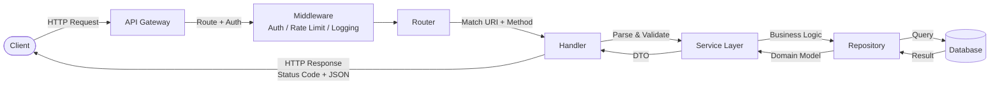
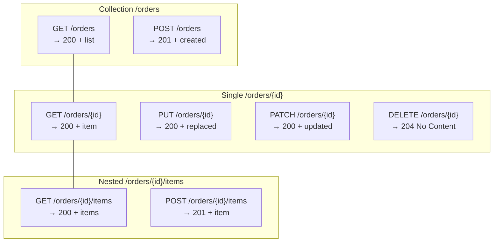

# REST API Design / REST API 設計

## Intent / 意圖

設計一致、可預測且易於維護的 RESTful API，使前後端團隊能依循統一的慣例協作。本篇涵蓋資源導向設計（resource-oriented design）、HTTP 語意的正確運用、分頁策略、錯誤處理格式、以及冪等性保證，目標是讓 API 成為系統中最穩定的契約層。

核心問題：**如何設計出讓消費端（client）無需閱讀大量文件就能直覺使用的 API？**

---

## Problem / 問題情境

**場景：不同團隊各自設計 API，導致風格不一致，整合成本高昂。**

1. 訂單團隊使用 `POST /getOrders` 回傳訂單列表，購物車團隊用 `GET /cart/list`。
2. 一個端點用 `{ "error": "not found" }` 回傳錯誤，另一個用 `{ "code": 404, "msg": "missing" }`。
3. 分頁方式混亂：有的用 `page=2&size=10`，有的用 `offset=10&limit=10`，有的完全不支援分頁。
4. `PUT` 和 `PATCH` 語意混用，部分更新行為不可預測——有時未傳的欄位被設為 null，有時被保留。
5. 前端工程師每整合一個新服務就必須重新理解一套命名規則，開發效率大幅降低。

這些問題的根源在於缺乏統一的 API 設計規範。REST 本身是一組架構約束（architectural constraints），而非嚴格的規格，因此需要團隊共同建立設計準則。

---

## Core Concepts / 核心概念

### Richardson Maturity Model / Richardson 成熟度模型

REST API 的成熟度分為四個等級：

- **Level 0 — The Swamp of POX**：所有請求都送到同一個端點，用 XML/JSON body 區分操作。實質上是 RPC over HTTP。
- **Level 1 — Resources**：引入資源概念，不同 URL 對應不同資源（如 `/orders`、`/products`），但仍只使用 `POST`。
- **Level 2 — HTTP Verbs**：正確使用 HTTP 方法（`GET`、`POST`、`PUT`、`DELETE`）與狀態碼。大多數實務中的 REST API 落在此等級。
- **Level 3 — Hypermedia Controls (HATEOAS)**：回應中包含超連結，告知 client 下一步可執行的操作。完整 REST 的理想狀態，但實務中較少完整實作。

### Resource Naming / 資源命名

- 使用**名詞複數**表示集合：`/orders`、`/products`、`/users`
- 使用 ID 定位單一資源：`/orders/{order_id}`
- 巢狀資源表示從屬關係：`/users/{user_id}/orders`
- 避免動詞：`/createOrder` 是錯誤的；用 `POST /orders` 取代
- 使用 kebab-case：`/order-items`（非 `orderItems` 或 `order_items`）

### HTTP Methods / HTTP 方法語意

| 方法 | 語意 | 冪等 | 安全 | 典型用途 |
|---|---|---|---|---|
| `GET` | 讀取資源 | 是 | 是 | 查詢列表或單筆資源 |
| `POST` | 建立資源 | 否 | 否 | 新增一筆訂單 |
| `PUT` | 完整取代資源 | 是 | 否 | 用完整物件覆蓋現有資源 |
| `PATCH` | 部分更新資源 | 否* | 否 | 只更新指定欄位 |
| `DELETE` | 刪除資源 | 是 | 否 | 移除一筆資源 |

*`PATCH` 可設計為冪等，但 HTTP 規範未強制要求。

### Status Codes / 狀態碼

- **200 OK**：請求成功，回傳資源內容（GET、PUT、PATCH）
- **201 Created**：資源建立成功（POST），應搭配 `Location` header
- **204 No Content**：操作成功但無回傳內容（DELETE）
- **400 Bad Request**：請求格式錯誤或驗證失敗
- **401 Unauthorized**：未驗證身分
- **403 Forbidden**：已驗證但無權限
- **404 Not Found**：資源不存在
- **409 Conflict**：資源狀態衝突（如重複建立）
- **422 Unprocessable Entity**：語意錯誤（格式正確但內容不合理）
- **429 Too Many Requests**：超過速率限制
- **500 Internal Server Error**：伺服器內部錯誤

### Content Negotiation / 內容協商

Client 透過 `Accept` header 指定期望的回應格式（如 `application/json`），Server 透過 `Content-Type` header 標示實際回傳的格式。API 版本控制可透過 header（`Accept: application/vnd.api.v2+json`）或 URL 前綴（`/v2/orders`）實現。

### Pagination / 分頁

**Offset-based**：`GET /orders?offset=20&limit=10`。簡單直觀，但在資料頻繁異動時可能跳過或重複項目。

**Cursor-based**：`GET /orders?cursor=eyJpZCI6MTAwfQ&limit=10`。Cursor 編碼了最後一筆的排序鍵，即使中間有插入或刪除也不會跳過項目。適合無限捲動（infinite scroll）場景。回應中應包含 `next_cursor` 供 client 取得下一頁。

### Filtering & Sorting / 篩選與排序

- 篩選：`GET /orders?status=shipped&created_after=2026-01-01`
- 排序：`GET /orders?sort=-created_at,+total_amount`（`-` 降序、`+` 升序）
- 欄位選擇：`GET /orders?fields=id,status,total_amount`

### HATEOAS

回應中嵌入可用操作的超連結，降低 client 與 URL 結構的耦合：

```json
{
  "id": "ord_123",
  "status": "pending",
  "_links": {
    "self": { "href": "/orders/ord_123" },
    "cancel": { "href": "/orders/ord_123/cancel", "method": "POST" },
    "items": { "href": "/orders/ord_123/items" }
  }
}
```

### Idempotency / 冪等性

`GET`、`PUT`、`DELETE` 天然冪等。`POST` 可透過 `Idempotency-Key` header 實現冪等——server 端記錄已處理的 key，若收到相同 key 的重複請求，直接回傳先前的結果而不重複執行。

---

## Architecture / 架構

### REST 請求流程



### RESTful 資源操作對應



---

## How It Works / 運作原理

### 設計 Resource-Oriented API 的步驟

1. **識別資源（Resources）**：從業務領域找出核心實體。以電商為例：`Product`、`Order`、`Customer`、`CartItem`。每個資源對應一個 URL 路徑。

2. **定義 URL 結構**：集合用複數名詞（`/products`），個體用 ID 路徑（`/products/{product_id}`）。巢狀資源只在語意上真正「從屬」時使用，避免超過兩層嵌套。

3. **對應 HTTP 方法**：根據操作語意選擇正確的方法。「查詢」用 `GET`，「建立」用 `POST`，「完整更新」用 `PUT`，「部分更新」用 `PATCH`，「刪除」用 `DELETE`。

4. **設計回應格式**：統一使用 envelope 或裸回應格式。列表回應應包含分頁資訊（`total_count`、`next_cursor`）。單筆回應直接回傳資源物件。錯誤回應統一結構（`type`、`title`、`status`、`detail`，參考 RFC 9457 Problem Details）。

5. **規劃狀態碼**：每個端點明確定義成功與失敗的狀態碼。`POST` 成功應回 `201` 而非 `200`。`DELETE` 成功回 `204`。輸入驗證失敗回 `422`。

6. **加入分頁、篩選、排序**：集合端點預設分頁（避免一次回傳全部資料）。Cursor-based 分頁適合持續增長的資料集。篩選與排序使用 query parameter。

7. **版本策略**：URL 前綴（`/v1/orders`）最直觀且最廣泛使用。Header-based 版本控制更符合 REST 精神，但工具支援較弱。

---

## Rust 實作

以 Axum 0.8+ 實作完整的 RESTful CRUD API，包含分頁、錯誤處理與正確的狀態碼。

```rust
// rest_api.rs
// RESTful CRUD API with Axum 0.8+

use axum::{
    extract::{Json, Path, Query, State},
    http::StatusCode,
    response::IntoResponse,
    routing::{delete, get, patch, post, put},
    Router,
};
use serde::{Deserialize, Serialize};
use std::collections::HashMap;
use std::sync::Arc;
use tokio::sync::RwLock;
use uuid::Uuid;

// === Domain Models ===

#[derive(Debug, Clone, Serialize, Deserialize)]
struct Product {
    id: String,
    name: String,
    description: String,
    price_cents: u64,
    stock_quantity: u32,
    category: String,
    created_at: String,
}

#[derive(Debug, Deserialize)]
struct CreateProductRequest {
    name: String,
    description: String,
    price_cents: u64,
    stock_quantity: u32,
    category: String,
}

#[derive(Debug, Deserialize)]
struct UpdateProductRequest {
    name: String,
    description: String,
    price_cents: u64,
    stock_quantity: u32,
    category: String,
}

#[derive(Debug, Deserialize)]
struct PatchProductRequest {
    name: Option<String>,
    description: Option<String>,
    price_cents: Option<u64>,
    stock_quantity: Option<u32>,
    category: Option<String>,
}

// === Pagination ===

#[derive(Debug, Deserialize)]
struct PaginationParams {
    cursor: Option<String>,
    limit: Option<usize>,
    category: Option<String>,
    sort: Option<String>,
}

#[derive(Debug, Serialize)]
struct PaginatedResponse<T: Serialize> {
    data: Vec<T>,
    pagination: PaginationMeta,
}

#[derive(Debug, Serialize)]
struct PaginationMeta {
    total_count: usize,
    limit: usize,
    next_cursor: Option<String>,
    has_more: bool,
}

// === Error Response (RFC 9457 Problem Details) ===

#[derive(Debug, Serialize)]
struct ProblemDetail {
    #[serde(rename = "type")]
    error_type: String,
    title: String,
    status: u16,
    detail: String,
}

impl ProblemDetail {
    fn not_found(resource: &str, id: &str) -> (StatusCode, Json<Self>) {
        (
            StatusCode::NOT_FOUND,
            Json(Self {
                error_type: "https://api.example.com/errors/not-found".to_string(),
                title: "Resource Not Found".to_string(),
                status: 404,
                detail: format!("{resource} with id '{id}' does not exist"),
            }),
        )
    }

    fn conflict(detail: &str) -> (StatusCode, Json<Self>) {
        (
            StatusCode::CONFLICT,
            Json(Self {
                error_type: "https://api.example.com/errors/conflict".to_string(),
                title: "Resource Conflict".to_string(),
                status: 409,
                detail: detail.to_string(),
            }),
        )
    }

    fn unprocessable(detail: &str) -> (StatusCode, Json<Self>) {
        (
            StatusCode::UNPROCESSABLE_ENTITY,
            Json(Self {
                error_type: "https://api.example.com/errors/validation".to_string(),
                title: "Validation Error".to_string(),
                status: 422,
                detail: detail.to_string(),
            }),
        )
    }
}

// === Application State ===

type ProductStore = Arc<RwLock<HashMap<String, Product>>>;

// === Handlers ===

/// GET /products — 列表查詢，支援 cursor 分頁與篩選
async fn list_products(
    State(store): State<ProductStore>,
    Query(params): Query<PaginationParams>,
) -> impl IntoResponse {
    let store = store.read().await;
    let limit = params.limit.unwrap_or(20).min(100);

    let mut products: Vec<&Product> = store.values().collect();

    // 篩選：依 category
    if let Some(ref category) = params.category {
        products.retain(|product| &product.category == category);
    }

    // 排序：預設按 created_at 降序
    let descending = params
        .sort
        .as_deref()
        .map(|s| s.starts_with('-'))
        .unwrap_or(true);
    products.sort_by(|a, b| {
        let cmp = a.created_at.cmp(&b.created_at);
        if descending { cmp.reverse() } else { cmp }
    });

    let total_count = products.len();

    // Cursor 分頁：cursor 為最後一筆的 id
    let start_index = if let Some(ref cursor) = params.cursor {
        products
            .iter()
            .position(|p| p.id == *cursor)
            .map(|pos| pos + 1)
            .unwrap_or(0)
    } else {
        0
    };

    let page: Vec<Product> = products
        .into_iter()
        .skip(start_index)
        .take(limit)
        .cloned()
        .collect();

    let next_cursor = if start_index + limit < total_count {
        page.last().map(|p| p.id.clone())
    } else {
        None
    };

    let response = PaginatedResponse {
        data: page,
        pagination: PaginationMeta {
            total_count,
            limit,
            next_cursor: next_cursor.clone(),
            has_more: next_cursor.is_some(),
        },
    };

    (StatusCode::OK, Json(response))
}

/// GET /products/:product_id — 取得單筆資源
async fn get_product(
    State(store): State<ProductStore>,
    Path(product_id): Path<String>,
) -> Result<(StatusCode, Json<Product>), (StatusCode, Json<ProblemDetail>)> {
    let store = store.read().await;
    match store.get(&product_id) {
        Some(product) => Ok((StatusCode::OK, Json(product.clone()))),
        None => Err(ProblemDetail::not_found("Product", &product_id)),
    }
}

/// POST /products — 建立資源，回傳 201 Created
async fn create_product(
    State(store): State<ProductStore>,
    Json(request): Json<CreateProductRequest>,
) -> Result<(StatusCode, Json<Product>), (StatusCode, Json<ProblemDetail>)> {
    if request.name.is_empty() {
        return Err(ProblemDetail::unprocessable("Product name must not be empty"));
    }
    if request.price_cents == 0 {
        return Err(ProblemDetail::unprocessable("Price must be greater than zero"));
    }

    let product = Product {
        id: format!("prod_{}", Uuid::new_v4()),
        name: request.name,
        description: request.description,
        price_cents: request.price_cents,
        stock_quantity: request.stock_quantity,
        category: request.category,
        created_at: chrono::Utc::now().to_rfc3339(),
    };

    let mut store = store.write().await;
    store.insert(product.id.clone(), product.clone());

    // 201 Created — 資源已成功建立
    Ok((StatusCode::CREATED, Json(product)))
}

/// PUT /products/:product_id — 完整取代資源
async fn replace_product(
    State(store): State<ProductStore>,
    Path(product_id): Path<String>,
    Json(request): Json<UpdateProductRequest>,
) -> Result<(StatusCode, Json<Product>), (StatusCode, Json<ProblemDetail>)> {
    let mut store = store.write().await;
    match store.get(&product_id) {
        Some(existing) => {
            let updated = Product {
                id: product_id.clone(),
                name: request.name,
                description: request.description,
                price_cents: request.price_cents,
                stock_quantity: request.stock_quantity,
                category: request.category,
                created_at: existing.created_at.clone(), // 保留原始建立時間
            };
            store.insert(product_id, updated.clone());
            Ok((StatusCode::OK, Json(updated)))
        }
        None => Err(ProblemDetail::not_found("Product", &product_id)),
    }
}

/// PATCH /products/:product_id — 部分更新資源
async fn update_product(
    State(store): State<ProductStore>,
    Path(product_id): Path<String>,
    Json(request): Json<PatchProductRequest>,
) -> Result<(StatusCode, Json<Product>), (StatusCode, Json<ProblemDetail>)> {
    let mut store = store.write().await;
    match store.get_mut(&product_id) {
        Some(product) => {
            if let Some(name) = request.name {
                product.name = name;
            }
            if let Some(description) = request.description {
                product.description = description;
            }
            if let Some(price_cents) = request.price_cents {
                product.price_cents = price_cents;
            }
            if let Some(stock_quantity) = request.stock_quantity {
                product.stock_quantity = stock_quantity;
            }
            if let Some(category) = request.category {
                product.category = category;
            }
            Ok((StatusCode::OK, Json(product.clone())))
        }
        None => Err(ProblemDetail::not_found("Product", &product_id)),
    }
}

/// DELETE /products/:product_id — 刪除資源，回傳 204 No Content
async fn delete_product(
    State(store): State<ProductStore>,
    Path(product_id): Path<String>,
) -> Result<StatusCode, (StatusCode, Json<ProblemDetail>)> {
    let mut store = store.write().await;
    match store.remove(&product_id) {
        Some(_) => Ok(StatusCode::NO_CONTENT), // 204 — 成功但無回傳內容
        None => Err(ProblemDetail::not_found("Product", &product_id)),
    }
}

/// 建立 Router 並啟動伺服器
#[tokio::main]
async fn main() {
    let store: ProductStore = Arc::new(RwLock::new(HashMap::new()));

    let app = Router::new()
        .route("/products", get(list_products).post(create_product))
        .route(
            "/products/{product_id}",
            get(get_product)
                .put(replace_product)
                .patch(update_product)
                .delete(delete_product),
        )
        .with_state(store);

    let listener = tokio::net::TcpListener::bind("0.0.0.0:3000").await.unwrap();
    println!("Server listening on :3000");
    axum::serve(listener, app).await.unwrap();
}

// Output:
// Server listening on :3000
//
// curl -X POST http://localhost:3000/products \
//   -H "Content-Type: application/json" \
//   -d '{"name":"Ergonomic Keyboard","description":"Mechanical","price_cents":12900,"stock_quantity":50,"category":"peripherals"}'
// → 201 {"id":"prod_...","name":"Ergonomic Keyboard",...}
//
// curl http://localhost:3000/products?limit=10&category=peripherals
// → 200 {"data":[...],"pagination":{"total_count":1,"limit":10,"next_cursor":null,"has_more":false}}
//
// curl -X PATCH http://localhost:3000/products/prod_xxx \
//   -H "Content-Type: application/json" -d '{"price_cents":9900}'
// → 200 {"id":"prod_xxx","price_cents":9900,...}
//
// curl -X DELETE http://localhost:3000/products/prod_xxx
// → 204 (No Content)
```

---

## Go 實作

以 Go 1.24+ 標準函式庫 `net/http` 實作對等的 RESTful CRUD API。

```go
// rest_api.go
// RESTful CRUD API with net/http (Go 1.24+)

package main

import (
	"encoding/json"
	"fmt"
	"log"
	"net/http"
	"slices"
	"strconv"
	"strings"
	"sync"
	"time"

	"github.com/google/uuid"
)

// === Domain Models ===

type Product struct {
	ID            string `json:"id"`
	Name          string `json:"name"`
	Description   string `json:"description"`
	PriceCents    uint64 `json:"price_cents"`
	StockQuantity uint32 `json:"stock_quantity"`
	Category      string `json:"category"`
	CreatedAt     string `json:"created_at"`
}

type CreateProductRequest struct {
	Name          string `json:"name"`
	Description   string `json:"description"`
	PriceCents    uint64 `json:"price_cents"`
	StockQuantity uint32 `json:"stock_quantity"`
	Category      string `json:"category"`
}

type PatchProductRequest struct {
	Name          *string `json:"name,omitempty"`
	Description   *string `json:"description,omitempty"`
	PriceCents    *uint64 `json:"price_cents,omitempty"`
	StockQuantity *uint32 `json:"stock_quantity,omitempty"`
	Category      *string `json:"category,omitempty"`
}

// === Pagination ===

type PaginatedResponse struct {
	Data       []Product      `json:"data"`
	Pagination PaginationMeta `json:"pagination"`
}

type PaginationMeta struct {
	TotalCount int     `json:"total_count"`
	Limit      int     `json:"limit"`
	NextCursor *string `json:"next_cursor"`
	HasMore    bool    `json:"has_more"`
}

// === Error Response (RFC 9457 Problem Details) ===

type ProblemDetail struct {
	Type   string `json:"type"`
	Title  string `json:"title"`
	Status int    `json:"status"`
	Detail string `json:"detail"`
}

func writeJSON(w http.ResponseWriter, status int, data any) {
	w.Header().Set("Content-Type", "application/json")
	w.WriteHeader(status)
	json.NewEncoder(w).Encode(data)
}

func writeProblem(w http.ResponseWriter, status int, title, detail string) {
	writeJSON(w, status, ProblemDetail{
		Type:   fmt.Sprintf("https://api.example.com/errors/%s", strings.ReplaceAll(strings.ToLower(title), " ", "-")),
		Title:  title,
		Status: status,
		Detail: detail,
	})
}

// === Application State ===

type ProductStore struct {
	mu       sync.RWMutex
	products map[string]Product
}

func NewProductStore() *ProductStore {
	return &ProductStore{products: make(map[string]Product)}
}

// === Handlers ===

// GET /products — 列表查詢，支援 cursor 分頁與篩選
func (s *ProductStore) ListProducts(w http.ResponseWriter, r *http.Request) {
	s.mu.RLock()
	defer s.mu.RUnlock()

	limitStr := r.URL.Query().Get("limit")
	limit := 20
	if limitStr != "" {
		if parsed, err := strconv.Atoi(limitStr); err == nil && parsed > 0 {
			limit = min(parsed, 100)
		}
	}

	cursor := r.URL.Query().Get("cursor")
	categoryFilter := r.URL.Query().Get("category")
	sortParam := r.URL.Query().Get("sort")

	products := make([]Product, 0, len(s.products))
	for _, product := range s.products {
		if categoryFilter != "" && product.Category != categoryFilter {
			continue
		}
		products = append(products, product)
	}

	// 排序：預設按 created_at 降序
	descending := true
	if strings.HasPrefix(sortParam, "+") {
		descending = false
	}
	slices.SortFunc(products, func(a, b Product) int {
		cmp := strings.Compare(a.CreatedAt, b.CreatedAt)
		if descending {
			return -cmp
		}
		return cmp
	})

	totalCount := len(products)

	// Cursor 分頁
	startIndex := 0
	if cursor != "" {
		for i, p := range products {
			if p.ID == cursor {
				startIndex = i + 1
				break
			}
		}
	}

	end := min(startIndex+limit, len(products))
	page := products[startIndex:end]

	var nextCursor *string
	if end < totalCount {
		last := page[len(page)-1].ID
		nextCursor = &last
	}

	writeJSON(w, http.StatusOK, PaginatedResponse{
		Data: page,
		Pagination: PaginationMeta{
			TotalCount: totalCount,
			Limit:      limit,
			NextCursor: nextCursor,
			HasMore:    nextCursor != nil,
		},
	})
}

// GET /products/{product_id} — 取得單筆資源
func (s *ProductStore) GetProduct(w http.ResponseWriter, r *http.Request) {
	productID := r.PathValue("product_id")

	s.mu.RLock()
	product, exists := s.products[productID]
	s.mu.RUnlock()

	if !exists {
		writeProblem(w, http.StatusNotFound, "Resource Not Found",
			fmt.Sprintf("Product with id '%s' does not exist", productID))
		return
	}

	writeJSON(w, http.StatusOK, product)
}

// POST /products — 建立資源，回傳 201 Created
func (s *ProductStore) CreateProduct(w http.ResponseWriter, r *http.Request) {
	var req CreateProductRequest
	if err := json.NewDecoder(r.Body).Decode(&req); err != nil {
		writeProblem(w, http.StatusBadRequest, "Bad Request", "Invalid JSON body")
		return
	}

	if req.Name == "" {
		writeProblem(w, http.StatusUnprocessableEntity, "Validation Error",
			"Product name must not be empty")
		return
	}
	if req.PriceCents == 0 {
		writeProblem(w, http.StatusUnprocessableEntity, "Validation Error",
			"Price must be greater than zero")
		return
	}

	product := Product{
		ID:            fmt.Sprintf("prod_%s", uuid.NewString()),
		Name:          req.Name,
		Description:   req.Description,
		PriceCents:    req.PriceCents,
		StockQuantity: req.StockQuantity,
		Category:      req.Category,
		CreatedAt:     time.Now().UTC().Format(time.RFC3339),
	}

	s.mu.Lock()
	s.products[product.ID] = product
	s.mu.Unlock()

	w.Header().Set("Location", fmt.Sprintf("/products/%s", product.ID))
	writeJSON(w, http.StatusCreated, product)
}

// PUT /products/{product_id} — 完整取代資源
func (s *ProductStore) ReplaceProduct(w http.ResponseWriter, r *http.Request) {
	productID := r.PathValue("product_id")

	var req CreateProductRequest
	if err := json.NewDecoder(r.Body).Decode(&req); err != nil {
		writeProblem(w, http.StatusBadRequest, "Bad Request", "Invalid JSON body")
		return
	}

	s.mu.Lock()
	defer s.mu.Unlock()

	existing, exists := s.products[productID]
	if !exists {
		writeProblem(w, http.StatusNotFound, "Resource Not Found",
			fmt.Sprintf("Product with id '%s' does not exist", productID))
		return
	}

	updated := Product{
		ID:            productID,
		Name:          req.Name,
		Description:   req.Description,
		PriceCents:    req.PriceCents,
		StockQuantity: req.StockQuantity,
		Category:      req.Category,
		CreatedAt:     existing.CreatedAt, // 保留原始建立時間
	}
	s.products[productID] = updated
	writeJSON(w, http.StatusOK, updated)
}

// PATCH /products/{product_id} — 部分更新資源
func (s *ProductStore) UpdateProduct(w http.ResponseWriter, r *http.Request) {
	productID := r.PathValue("product_id")

	var req PatchProductRequest
	if err := json.NewDecoder(r.Body).Decode(&req); err != nil {
		writeProblem(w, http.StatusBadRequest, "Bad Request", "Invalid JSON body")
		return
	}

	s.mu.Lock()
	defer s.mu.Unlock()

	product, exists := s.products[productID]
	if !exists {
		writeProblem(w, http.StatusNotFound, "Resource Not Found",
			fmt.Sprintf("Product with id '%s' does not exist", productID))
		return
	}

	if req.Name != nil {
		product.Name = *req.Name
	}
	if req.Description != nil {
		product.Description = *req.Description
	}
	if req.PriceCents != nil {
		product.PriceCents = *req.PriceCents
	}
	if req.StockQuantity != nil {
		product.StockQuantity = *req.StockQuantity
	}
	if req.Category != nil {
		product.Category = *req.Category
	}

	s.products[productID] = product
	writeJSON(w, http.StatusOK, product)
}

// DELETE /products/{product_id} — 刪除資源，回傳 204 No Content
func (s *ProductStore) DeleteProduct(w http.ResponseWriter, r *http.Request) {
	productID := r.PathValue("product_id")

	s.mu.Lock()
	defer s.mu.Unlock()

	if _, exists := s.products[productID]; !exists {
		writeProblem(w, http.StatusNotFound, "Resource Not Found",
			fmt.Sprintf("Product with id '%s' does not exist", productID))
		return
	}

	delete(s.products, productID)
	w.WriteHeader(http.StatusNoContent) // 204 — 成功但無回傳內容
}

func main() {
	store := NewProductStore()
	mux := http.NewServeMux()

	// Go 1.22+ 增強的路由模式：支援 method + path parameter
	mux.HandleFunc("GET /products", store.ListProducts)
	mux.HandleFunc("POST /products", store.CreateProduct)
	mux.HandleFunc("GET /products/{product_id}", store.GetProduct)
	mux.HandleFunc("PUT /products/{product_id}", store.ReplaceProduct)
	mux.HandleFunc("PATCH /products/{product_id}", store.UpdateProduct)
	mux.HandleFunc("DELETE /products/{product_id}", store.DeleteProduct)

	fmt.Println("Server listening on :3000")
	log.Fatal(http.ListenAndServe(":3000", mux))
}

// Output:
// Server listening on :3000
//
// curl -X POST http://localhost:3000/products \
//   -H "Content-Type: application/json" \
//   -d '{"name":"Ergonomic Keyboard","description":"Mechanical","price_cents":12900,"stock_quantity":50,"category":"peripherals"}'
// → 201 {"id":"prod_...","name":"Ergonomic Keyboard",...}
// → Location: /products/prod_...
//
// curl http://localhost:3000/products?limit=10&category=peripherals
// → 200 {"data":[...],"pagination":{"total_count":1,"limit":10,"next_cursor":null,"has_more":false}}
//
// curl -X PATCH http://localhost:3000/products/prod_xxx \
//   -H "Content-Type: application/json" -d '{"price_cents":9900}'
// → 200 {"id":"prod_xxx","price_cents":9900,...}
//
// curl -X DELETE http://localhost:3000/products/prod_xxx
// → 204 (No Content)
```

---

## Rust vs Go 對照表

| 面向 | Rust (Axum 0.8+) | Go 1.24+ (net/http) |
|---|---|---|
| **路由定義** | `Router::new().route("/path", get(handler))` 型別安全，handler 簽名錯誤在編譯期報錯 | `mux.HandleFunc("GET /path", handler)` 字串模式，路由錯誤只在 runtime 發現 |
| **部分更新 (PATCH)** | 使用 `Option<T>` 欄位，`None` 表示不更新，語意清晰且編譯器強制處理 | 使用 `*T` 指標欄位，`nil` 表示不更新，但需手動檢查每個欄位是否為 nil |
| **錯誤回應** | `Result<(StatusCode, Json<T>), (StatusCode, Json<E>)>` 強制處理成功與失敗路徑 | 在 handler 內自行呼叫 `writeProblem()` 後 `return`，容易忘記 return 導致繼續執行 |
| **JSON 序列化** | serde 在編譯期產生序列化程式碼，零反射，效能極高 | `encoding/json` 依賴 runtime 反射與 struct tag，效能稍低但足夠應付大部分場景 |
| **並行狀態管理** | `Arc<RwLock<T>>` + 所有權系統，編譯期保證不會忘記加鎖 | `sync.RWMutex` 需手動 Lock/Unlock，容易因忘記 `defer Unlock()` 而 deadlock |

---

## When to Use / 適用場景

### 1. CRUD 為主的業務 API

REST 最擅長的場景是以資源為中心的 CRUD 操作。電商的商品管理、訂單管理、使用者管理等，資源邊界清晰，操作語意與 HTTP 方法天然對應。團隊能快速理解 `GET /products` 是查詢、`POST /orders` 是下單，不需額外文件解釋 RPC 方法名稱。

### 2. 公開 API / Third-party 整合

面向外部開發者的 API（如 Stripe、GitHub）幾乎都採用 REST。原因：(1) HTTP 是最通用的協定，所有語言和平台都有完善的 HTTP client。(2) URL + HTTP method 的組合自帶語意，降低學習曲線。(3) 容易用 curl 測試。(4) 豐富的工具鏈支援（Swagger/OpenAPI、Postman）。

### 3. 微服務間的同步通訊

當服務之間需要即時請求-回應模式，且資料模型以資源為主體時，REST 是務實的選擇。搭配 API Gateway 統一認證、速率限制與路由，能有效管理服務間的通訊。

---

## When NOT to Use / 不適用場景

### 1. 即時雙向通訊

聊天室、即時協作編輯、線上遊戲等需要伺服器主動推送的場景，REST 的請求-回應模型不適合。應使用 WebSocket、Server-Sent Events（SSE）或 gRPC streaming。雖然可用 long polling 模擬，但效率低且實作複雜。

### 2. 複雜查詢與欄位選擇需求

當 client 需要一次請求取得跨多個資源的關聯資料，且不同頁面需要不同的欄位組合時，REST 會產生 over-fetching（回傳不需要的欄位）或 under-fetching（需多次請求組合資料）的問題。此時 GraphQL 是更好的選擇，讓 client 精確指定需要的資料結構。

### 3. 高效能的服務間 RPC

微服務間大量的內部呼叫若使用 REST + JSON，序列化/反序列化的開銷可能成為瓶頸。gRPC + Protocol Buffers 提供二進位序列化、HTTP/2 多工、強型別契約與自動程式碼生成，在高吞吐量的內部通訊場景更有效率。

---

## Real-World Examples / 真實世界案例

### Stripe API — REST 設計的業界標竿

Stripe 的 API 被廣泛視為 REST API 設計的黃金標準。關鍵設計決策包括：

- **一致的資源命名**：所有資源使用小寫複數名詞（`/v1/customers`、`/v1/payment_intents`）。
- **Idempotency Key**：所有 `POST` 請求支援 `Idempotency-Key` header，確保網路重試不會產生重複交易。這對金融支付場景至關重要。
- **Expandable 物件**：預設回傳巢狀資源的 ID，client 可用 `expand[]` 參數要求展開完整物件，避免 over-fetching：`GET /v1/charges/ch_xxx?expand[]=customer`。
- **Cursor 分頁**：使用 `starting_after` 和 `ending_before` 參數搭配物件 ID 作為 cursor，避免 offset 分頁在大量資料下的效能問題。
- **版本控制**：每個 API 帳號綁定註冊時的 API 版本。可透過 `Stripe-Version` header 指定版本，或在 dashboard 升級。保證向後相容。

### GitHub REST API — 成熟的公開 API

GitHub API 展示了大規模公開 API 的實務考量：

- **Rate Limiting**：透過 `X-RateLimit-Limit`、`X-RateLimit-Remaining`、`X-RateLimit-Reset` header 告知 client 速率限制狀態。超限回傳 `429 Too Many Requests`。
- **Conditional Requests**：支援 `ETag` 和 `If-None-Match` header，未變更的資源回傳 `304 Not Modified`，不消耗 rate limit 額度。
- **Link Header 分頁**：分頁資訊放在 `Link` response header 中（`<url>; rel="next"`），而非 response body，符合 HTTP 標準。
- **Media Types**：透過 `Accept` header 指定回應格式，如 `application/vnd.github.v3+json`，同時實現內容協商與版本控制。

---

## Interview Questions / 面試常見問題

### Q1: PUT 和 PATCH 的差異是什麼？何時該用哪一個？

**A:** `PUT` 是完整取代（full replacement）——client 送出資源的完整表示，server 用它覆蓋現有資源。未包含的欄位會被設為預設值或 null。`PATCH` 是部分更新——只送出要修改的欄位。實務上，如果 client 只想改一個欄位卻必須送出整個物件，用 `PUT` 既浪費頻寬又容易因版本不一致覆蓋他人修改。大部分場景建議使用 `PATCH`，除非業務語意確實是「用新版本取代舊版本」。

### Q2: 如何設計 API 的錯誤回應格式？

**A:** 建議遵循 RFC 9457（Problem Details for HTTP APIs）。統一結構包含 `type`（錯誤類型 URI）、`title`（人類可讀標題）、`status`（HTTP 狀態碼）、`detail`（具體描述）。可選加入 `instance`（發生錯誤的 URI）和自訂欄位（如 `validation_errors` 陣列）。關鍵是全系統統一格式，讓 client 能用同一套程式碼處理所有錯誤。

### Q3: Cursor-based 分頁相比 Offset-based 有什麼優勢？

**A:** Offset-based 的問題：(1) 在資料頻繁新增/刪除時，offset 位移會導致跳過或重複項目。(2) `OFFSET N` 在資料庫層面仍需掃描前 N 筆，大 offset 效能差。Cursor-based 使用最後一筆的排序鍵（如 ID 或時間戳記）作為錨點，查詢 `WHERE id > cursor LIMIT N`，不受中間資料異動影響且效能穩定。缺點是無法直接跳到「第 N 頁」，但這在無限捲動的現代 UI 中通常不是問題。

### Q4: REST API 如何處理冪等性？為什麼重要？

**A:** 冪等性確保同一請求執行多次的結果與執行一次相同。在網路不穩定時，client 不確定請求是否成功可能會重試，如果 `POST` 不冪等就會產生重複資料。解法：client 在 header 中帶上唯一的 `Idempotency-Key`，server 以此 key 為鍵存入快取。收到重複 key 的請求時直接回傳先前的回應。key 通常有過期時間（如 Stripe 為 24 小時）。

### Q5: API 版本控制有哪些策略？各有什麼權衡？

**A:** 三種主流方式：(1) **URL 前綴**（`/v1/orders`）——最直觀，容易理解與路由，但可能被批評「URL 不應包含版本」。(2) **Header**（`Accept: application/vnd.api.v2+json`）——更符合 REST 精神，但除錯與測試不方便（curl 需額外指定 header）。(3) **Query parameter**（`?version=2`）——折衷方案但不常見。實務上 URL 前綴最廣泛使用（Stripe、GitHub 均採用）。重要原則：新版本應盡量向後相容，只在有 breaking change 時才升版號。

---

## Pitfalls / 常見陷阱

### 1. 用動詞而非名詞設計端點

`POST /createOrder`、`GET /getUsers` 是常見的反模式。HTTP 方法本身就是動詞，資源路徑應使用名詞。正確做法：`POST /orders`（建立訂單）、`GET /users`（查詢使用者）。例外：某些非 CRUD 操作可使用動詞子路徑，如 `POST /orders/{id}/cancel`，但應盡量將其建模為狀態轉移（`PATCH /orders/{id}` with `{ "status": "cancelled" }`）。

### 2. 不區分 401 和 403

`401 Unauthorized` 實際上是 "Unauthenticated"——client 未提供有效的身分驗證憑證。`403 Forbidden` 是已驗證身分但無權限存取該資源。混用這兩個狀態碼會讓 client 無法正確處理：收到 401 應重新登入取得新 token，收到 403 則不應重試（權限不足不會因重新登入而改變，除非角色變更）。

### 3. 集合端點不加預設分頁

`GET /orders` 若不限制回傳數量，當資料量增長到數百萬筆時，單一請求會消耗大量記憶體與頻寬，甚至導致服務 OOM。應永遠設定預設 limit（如 20）和最大 limit（如 100），並在回應中提供分頁資訊讓 client 逐頁取得。

### 4. PATCH 時將未傳欄位設為 null

`PATCH` 的語意是「只更新有傳的欄位」。如果 client 只傳 `{ "name": "new" }`，其他欄位應保持不變。常見錯誤是將未出現在 body 中的欄位設為 null 或零值——這變成了 `PUT` 的行為。在 Go 中需使用指標欄位（`*string`）區分「未傳」（`nil`）和「明確設為空字串」（`""`）。在 Rust 中使用 `Option<T>`，`None` 表示未傳。

### 5. 忽略 Content-Type 驗證

不檢查請求的 `Content-Type` header 就直接解析 body，可能導致非預期的行為。如果 client 不小心送出 `text/plain` 而非 `application/json`，server 應回傳 `415 Unsupported Media Type` 而非嘗試解析後回傳含糊的 `400 Bad Request`。

---

## Cross-references / 交叉引用

- [[01_scalability_fundamentals|Scalability Fundamentals / 可擴展性基礎]] — API 設計直接影響系統可擴展性。分頁、欄位選擇等機制能有效降低單一請求的資源消耗，是水平擴展的前提。
- [[02_availability_and_fault_tolerance|Availability and Fault Tolerance / 可用性與容錯]] — API 的冪等性設計是容錯的基礎。當 client 因網路超時而重試時，冪等的端點不會產生重複副作用。
- [[03_consistency_trade_offs|Consistency Trade-offs / 一致性權衡]] — API 回應中的快取控制（ETag、Cache-Control）與一致性模型密切相關。Conditional request 利用 ETag 實現樂觀並發控制，是一致性策略在 API 層的具體體現。

---

## References / 參考資料

1. **RESTful Web APIs** — Leonard Richardson, Mike Amundsen, Sam Ruby. O'Reilly. 涵蓋 REST 架構風格的完整論述，包含 Richardson Maturity Model 與 HATEOAS 的實務應用。
2. **RFC 9457: Problem Details for HTTP APIs** — IETF. 定義統一的 HTTP API 錯誤回應格式，是本篇錯誤處理設計的基礎。https://www.rfc-editor.org/rfc/rfc9457
3. **Stripe API Reference** — https://docs.stripe.com/api — 業界公認的 REST API 設計標竿，展示冪等性、分頁、版本控制等最佳實踐。
4. **GitHub REST API Documentation** — https://docs.github.com/en/rest — 大規模公開 API 的實務參考，涵蓋 rate limiting、conditional requests、media types。
5. **Google API Design Guide** — https://cloud.google.com/apis/design — Google 內部的 API 設計規範，雖以 gRPC 為主，但資源導向設計的原則同樣適用於 REST。
