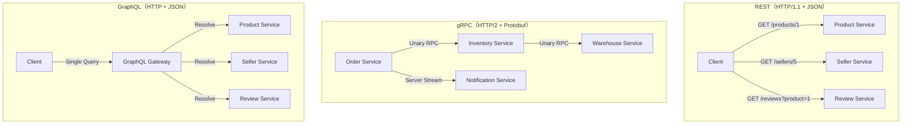
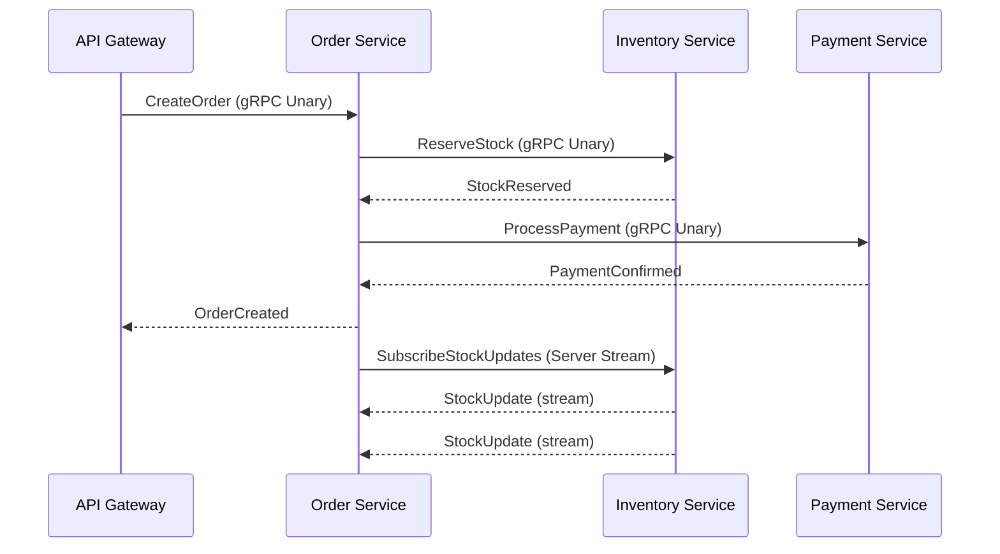
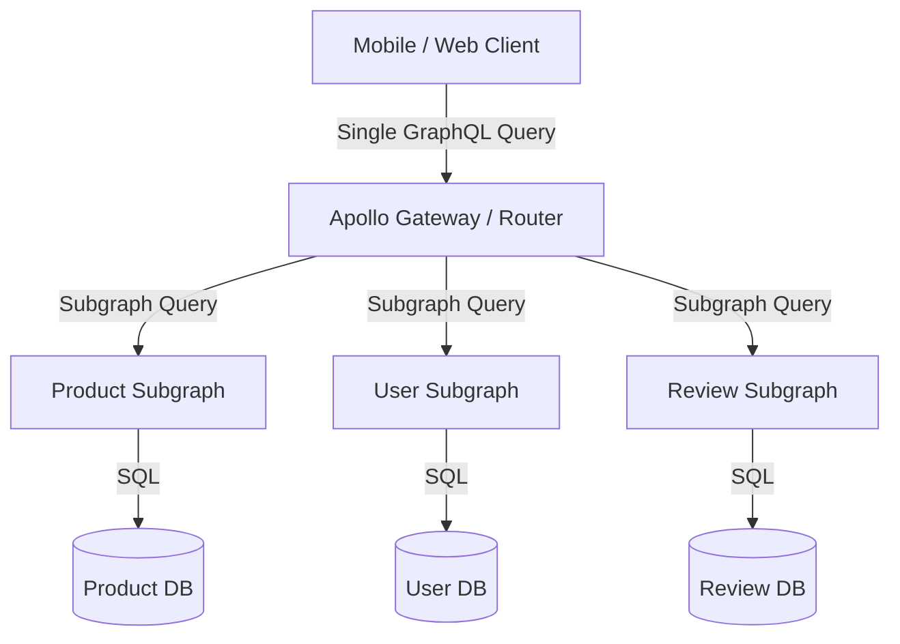

# gRPC & GraphQL Comparison / gRPC 與 GraphQL 比較

## Intent / 意圖

理解 gRPC 與 GraphQL 這兩種現代 API 設計範式，掌握它們各自解決 REST 哪些痛點，
以及在微服務內部通訊與客戶端聚合查詢這兩個典型場景中如何做出正確的技術選型。

## Problem / 問題情境

**情境：電商平台的 API 演進困境**

某電商平台以 REST API 作為唯一通訊協定，隨業務擴展遭遇兩大瓶頸：

1. **Over-fetching / Under-fetching（過度擷取 / 不足擷取）**
   - 行動端商品列表頁只需名稱與價格，但 `GET /products/:id` 回傳完整 30 個欄位，浪費頻寬
   - 商品詳情頁需要商品 + 賣家 + 評論，必須連打三個 REST 端點，增加往返延遲

2. **微服務間通訊效率低落**
   - 訂單服務呼叫庫存服務使用 JSON over HTTP/1.1，序列化成本高、延遲大
   - 缺乏型別合約，上下游服務介面變更時容易在執行期才發現破壞性改動
   - 沒有原生串流支援，即時庫存變動需靠輪詢（polling），效率低且延遲高

## Core Concepts / 核心概念

### Protocol Buffers (Protobuf)

gRPC 的預設序列化格式，以 `.proto` 檔定義服務介面與訊息結構。
二進位編碼比 JSON 小 3-10 倍，序列化 / 反序列化速度快 5-20 倍。
同時作為型別合約（contract），可自動產生多語言的客戶端與伺服端程式碼。

### HTTP/2 Multiplexing / HTTP/2 多工

gRPC 建立於 HTTP/2 之上，單一 TCP 連線可同時傳輸多個請求與回應（stream）。
不再像 HTTP/1.1 受到隊頭阻塞（Head-of-line blocking）限制，
大幅提升微服務間高頻率呼叫的吞吐量。

### Streaming / 串流模式

gRPC 支援四種通訊模式：

- **Unary（一元）**：一個請求，一個回應。最常見，等同 REST 請求。
- **Server Streaming（伺服器串流）**：客戶端發一個請求，伺服器回傳一連串回應。適合即時推播。
- **Client Streaming（客戶端串流）**：客戶端發送一連串訊息，伺服器最後回傳一個總結回應。適合批次上傳。
- **Bidirectional Streaming（雙向串流）**：雙方同時收發訊息。適合聊天室、即時協作。

### GraphQL Schema / GraphQL 結構描述

GraphQL 以強型別的 Schema 定義 API 的資料模型與操作。
Schema 就是 API 的文件，客戶端可透過 introspection 自動探索可用欄位。

### Resolvers / 解析器

GraphQL 的每個欄位對應一個 resolver 函式，負責從資料來源取得該欄位的值。
resolver 可組合巢狀，形成樹狀的資料解析流程。

### Queries / Mutations

- **Query**：讀取操作，對應 REST 的 GET
- **Mutation**：寫入操作，對應 REST 的 POST / PUT / DELETE

### N+1 Problem / N+1 問題

查詢一個列表（1 次）後，對每筆結果各發一次子查詢（N 次），共 N+1 次資料庫存取。
GraphQL 的巢狀 resolver 架構極易觸發此問題。

### DataLoader

Facebook 提出的批次化 + 快取機制，將同一事件迴圈中的多個單筆查詢合併為一次批次查詢，
從 N+1 降為 2 次（1 次列表 + 1 次批次），是 GraphQL 效能優化的核心模式。

### Schema Stitching & Federation / 結構拼接與聯邦

- **Schema Stitching**：將多個 GraphQL 服務的 Schema 合併為單一進入點，早期做法，維護複雜
- **Federation**（Apollo 提出）：各微服務擁有自己的子圖（subgraph），由 Gateway 組合為超級圖（supergraph），解耦且可獨立部署

## Architecture / 架構

### REST vs gRPC vs GraphQL 通訊模式比較



### gRPC 微服務通訊架構



### GraphQL Federation 架構



## How It Works / 運作原理

### gRPC 呼叫流程

1. **定義合約**：撰寫 `.proto` 檔，定義服務方法與訊息結構
2. **程式碼生成**：用 `protoc` 編譯器產生目標語言的 stub 程式碼（客戶端與伺服端）
3. **實作服務**：伺服端實作 proto 定義的 trait / interface
4. **建立通道**：客戶端建立 gRPC channel（底層為 HTTP/2 連線），支援連線池與負載均衡
5. **序列化與傳輸**：請求資料以 Protobuf 二進位編碼，透過 HTTP/2 frame 傳輸
6. **反序列化與處理**：伺服端接收 frame，反序列化為強型別結構，執行商業邏輯
7. **回應**：結果以 Protobuf 編碼回傳，客戶端反序列化為本地型別

### GraphQL 查詢解析流程

1. **客戶端組合查詢**：依畫面需求選取精確欄位，避免 over-fetching
2. **發送至 Gateway**：單一 HTTP POST 請求，body 為 GraphQL 查詢字串
3. **解析與驗證**：Gateway 解析查詢語法，對照 Schema 驗證欄位與型別
4. **建立執行計畫**：分析查詢樹，決定需要呼叫哪些 resolver 以及呼叫順序
5. **執行 Resolver 樹**：從根欄位開始，遞迴執行每層 resolver，DataLoader 在此階段批次化查詢
6. **組合回應**：將所有 resolver 的結果組合為與查詢結構對應的 JSON
7. **回傳客戶端**：單一回應包含所有請求的資料，形狀完全匹配查詢結構

## Rust 實作

以 tonic 實作 gRPC 庫存服務，包含 Unary RPC 與 Server Streaming。

### Proto 定義

```protobuf
// proto/inventory.proto
syntax = "proto3";
package inventory;

service InventoryService {
    // Unary: 查詢單一商品庫存
    rpc GetStock(GetStockRequest) returns (StockResponse);
    // Unary: 預留庫存
    rpc ReserveStock(ReserveStockRequest) returns (ReserveStockResponse);
    // Server Streaming: 訂閱庫存變動通知
    rpc WatchStockUpdates(WatchStockRequest) returns (stream StockUpdate);
}

message GetStockRequest {
    string product_id = 1;
}

message StockResponse {
    string product_id = 1;
    int32 available_quantity = 2;
    string warehouse_location = 3;
}

message ReserveStockRequest {
    string product_id = 1;
    int32 quantity = 2;
    string order_id = 3;
}

message ReserveStockResponse {
    bool success = 1;
    string reservation_id = 2;
    string message = 3;
}

message WatchStockRequest {
    repeated string product_ids = 1;
}

message StockUpdate {
    string product_id = 1;
    int32 new_quantity = 2;
    string updated_at = 3;
}
```

### Rust Server 實作

```rust
// Cargo.toml dependencies:
// tonic = "0.12"
// prost = "0.13"
// tokio = { version = "1", features = ["full"] }
// tokio-stream = "0.1"
// tonic-build = "0.12"  (build-dependencies)

use tonic::{transport::Server, Request, Response, Status};
use tokio_stream::wrappers::ReceiverStream;
use std::collections::HashMap;
use std::sync::Arc;
use tokio::sync::{Mutex, mpsc};

pub mod inventory {
    tonic::include_proto!("inventory");
}

use inventory::inventory_service_server::{InventoryService, InventoryServiceServer};
use inventory::{
    GetStockRequest, StockResponse,
    ReserveStockRequest, ReserveStockResponse,
    WatchStockRequest, StockUpdate,
};

struct StockRecord {
    available_quantity: i32,
    warehouse_location: String,
}

struct InventoryServiceImpl {
    stock_data: Arc<Mutex<HashMap<String, StockRecord>>>,
    update_subscribers: Arc<Mutex<Vec<mpsc::Sender<Result<StockUpdate, Status>>>>>,
}

impl InventoryServiceImpl {
    fn new() -> Self {
        let mut initial_stock = HashMap::new();
        initial_stock.insert("prod_laptop_001".to_string(), StockRecord {
            available_quantity: 150,
            warehouse_location: "warehouse_taipei_a1".to_string(),
        });
        initial_stock.insert("prod_phone_002".to_string(), StockRecord {
            available_quantity: 300,
            warehouse_location: "warehouse_kaohsiung_b2".to_string(),
        });

        Self {
            stock_data: Arc::new(Mutex::new(initial_stock)),
            update_subscribers: Arc::new(Mutex::new(Vec::new())),
        }
    }

    async fn notify_subscribers(&self, product_id: &str, new_quantity: i32) {
        let update = StockUpdate {
            product_id: product_id.to_string(),
            new_quantity,
            updated_at: chrono::Utc::now().to_rfc3339(),
        };
        let mut subscribers = self.update_subscribers.lock().await;
        subscribers.retain(|sender| {
            sender.try_send(Ok(update.clone())).is_ok()
        });
    }
}

#[tonic::async_trait]
impl InventoryService for InventoryServiceImpl {
    async fn get_stock(
        &self,
        request: Request<GetStockRequest>,
    ) -> Result<Response<StockResponse>, Status> {
        let product_id = request.into_inner().product_id;
        let stock_data = self.stock_data.lock().await;

        match stock_data.get(&product_id) {
            Some(record) => Ok(Response::new(StockResponse {
                product_id,
                available_quantity: record.available_quantity,
                warehouse_location: record.warehouse_location.clone(),
            })),
            None => Err(Status::not_found(
                format!("product {} not found", product_id)
            )),
        }
    }
    // Output: GetStock("prod_laptop_001") -> { available_quantity: 150, warehouse: "warehouse_taipei_a1" }

    async fn reserve_stock(
        &self,
        request: Request<ReserveStockRequest>,
    ) -> Result<Response<ReserveStockResponse>, Status> {
        let inner = request.into_inner();
        let mut stock_data = self.stock_data.lock().await;

        match stock_data.get_mut(&inner.product_id) {
            Some(record) if record.available_quantity >= inner.quantity => {
                record.available_quantity -= inner.quantity;
                let new_quantity = record.available_quantity;
                let reservation_id = format!("rsv_{}_{}", inner.order_id, inner.product_id);

                drop(stock_data); // 釋放鎖再通知訂閱者
                self.notify_subscribers(&inner.product_id, new_quantity).await;

                Ok(Response::new(ReserveStockResponse {
                    success: true,
                    reservation_id,
                    message: format!("reserved {} units", inner.quantity),
                }))
            }
            Some(_) => Ok(Response::new(ReserveStockResponse {
                success: false,
                reservation_id: String::new(),
                message: "insufficient stock".to_string(),
            })),
            None => Err(Status::not_found(
                format!("product {} not found", inner.product_id)
            )),
        }
    }
    // Output: ReserveStock { product: "prod_laptop_001", qty: 2, order: "ord_100" }
    //         -> { success: true, reservation_id: "rsv_ord_100_prod_laptop_001" }

    type WatchStockUpdatesStream = ReceiverStream<Result<StockUpdate, Status>>;

    async fn watch_stock_updates(
        &self,
        request: Request<WatchStockRequest>,
    ) -> Result<Response<Self::WatchStockUpdatesStream>, Status> {
        let _watched_ids = request.into_inner().product_ids;
        let (sender, receiver) = mpsc::channel(32);

        self.update_subscribers.lock().await.push(sender);

        Ok(Response::new(ReceiverStream::new(receiver)))
    }
    // Output: WatchStockUpdates(["prod_laptop_001"]) -> stream of StockUpdate messages
}

#[tokio::main]
async fn main() -> Result<(), Box<dyn std::error::Error>> {
    let bind_addr = "0.0.0.0:50051".parse()?;
    let inventory_service = InventoryServiceImpl::new();

    println!("InventoryService gRPC server listening on {}", bind_addr);

    Server::builder()
        .add_service(InventoryServiceServer::new(inventory_service))
        .serve(bind_addr)
        .await?;

    Ok(())
}
// Output: InventoryService gRPC server listening on 0.0.0.0:50051
```

### build.rs

```rust
// build.rs
fn main() -> Result<(), Box<dyn std::error::Error>> {
    tonic_build::compile_protos("proto/inventory.proto")?;
    Ok(())
}
```

## Go 實作

以 `google.golang.org/grpc` 實作相同的庫存服務。

### Go Server 實作

```go
// 需安裝：
// go install google.golang.org/protobuf/cmd/protoc-gen-go@latest
// go install google.golang.org/grpc/cmd/protoc-gen-go-grpc@latest
// protoc --go_out=. --go-grpc_out=. proto/inventory.proto

package main

import (
	"context"
	"fmt"
	"log"
	"net"
	"sync"
	"time"

	pb "inventory-service/proto/inventory"

	"google.golang.org/grpc"
	"google.golang.org/grpc/codes"
	"google.golang.org/grpc/status"
)

type StockRecord struct {
	AvailableQuantity int32
	WarehouseLocation string
}

type InventoryServer struct {
	pb.UnimplementedInventoryServiceServer
	mu                sync.Mutex
	stockData         map[string]*StockRecord
	updateSubscribers []chan *pb.StockUpdate
}

func NewInventoryServer() *InventoryServer {
	return &InventoryServer{
		stockData: map[string]*StockRecord{
			"prod_laptop_001": {
				AvailableQuantity: 150,
				WarehouseLocation: "warehouse_taipei_a1",
			},
			"prod_phone_002": {
				AvailableQuantity: 300,
				WarehouseLocation: "warehouse_kaohsiung_b2",
			},
		},
		updateSubscribers: make([]chan *pb.StockUpdate, 0),
	}
}

func (s *InventoryServer) notifySubscribers(productID string, newQuantity int32) {
	update := &pb.StockUpdate{
		ProductId:   productID,
		NewQuantity: newQuantity,
		UpdatedAt:   time.Now().UTC().Format(time.RFC3339),
	}

	// 移除已關閉的訂閱者，通知活躍的訂閱者
	activeSubscribers := make([]chan *pb.StockUpdate, 0, len(s.updateSubscribers))
	for _, subscriber := range s.updateSubscribers {
		select {
		case subscriber <- update:
			activeSubscribers = append(activeSubscribers, subscriber)
		default:
			close(subscriber)
		}
	}
	s.updateSubscribers = activeSubscribers
}

func (s *InventoryServer) GetStock(
	ctx context.Context,
	req *pb.GetStockRequest,
) (*pb.StockResponse, error) {
	s.mu.Lock()
	defer s.mu.Unlock()

	record, exists := s.stockData[req.ProductId]
	if !exists {
		return nil, status.Errorf(codes.NotFound,
			"product %s not found", req.ProductId)
	}

	return &pb.StockResponse{
		ProductId:         req.ProductId,
		AvailableQuantity: record.AvailableQuantity,
		WarehouseLocation: record.WarehouseLocation,
	}, nil
}
// Output: GetStock("prod_laptop_001") -> { available_quantity: 150, warehouse: "warehouse_taipei_a1" }

func (s *InventoryServer) ReserveStock(
	ctx context.Context,
	req *pb.ReserveStockRequest,
) (*pb.ReserveStockResponse, error) {
	s.mu.Lock()
	defer s.mu.Unlock()

	record, exists := s.stockData[req.ProductId]
	if !exists {
		return nil, status.Errorf(codes.NotFound,
			"product %s not found", req.ProductId)
	}

	if record.AvailableQuantity < req.Quantity {
		return &pb.ReserveStockResponse{
			Success: false,
			Message: "insufficient stock",
		}, nil
	}

	record.AvailableQuantity -= req.Quantity
	reservationID := fmt.Sprintf("rsv_%s_%s", req.OrderId, req.ProductId)

	s.notifySubscribers(req.ProductId, record.AvailableQuantity)

	return &pb.ReserveStockResponse{
		Success:       true,
		ReservationId: reservationID,
		Message:       fmt.Sprintf("reserved %d units", req.Quantity),
	}, nil
}
// Output: ReserveStock { product: "prod_laptop_001", qty: 2, order: "ord_100" }
//         -> { success: true, reservation_id: "rsv_ord_100_prod_laptop_001" }

func (s *InventoryServer) WatchStockUpdates(
	req *pb.WatchStockRequest,
	stream pb.InventoryService_WatchStockUpdatesServer,
) error {
	updateChan := make(chan *pb.StockUpdate, 32)

	s.mu.Lock()
	s.updateSubscribers = append(s.updateSubscribers, updateChan)
	s.mu.Unlock()

	watchedIDs := make(map[string]bool)
	for _, productID := range req.ProductIds {
		watchedIDs[productID] = true
	}

	for {
		select {
		case update, ok := <-updateChan:
			if !ok {
				return nil
			}
			if len(watchedIDs) == 0 || watchedIDs[update.ProductId] {
				if err := stream.Send(update); err != nil {
					return err
				}
			}
		case <-stream.Context().Done():
			return stream.Context().Err()
		}
	}
}
// Output: WatchStockUpdates(["prod_laptop_001"]) -> stream of StockUpdate messages

func main() {
	listener, err := net.Listen("tcp", "0.0.0.0:50051")
	if err != nil {
		log.Fatalf("failed to listen: %v", err)
	}

	grpcServer := grpc.NewServer()
	inventoryServer := NewInventoryServer()
	pb.RegisterInventoryServiceServer(grpcServer, inventoryServer)

	log.Printf("InventoryService gRPC server listening on %s", listener.Addr())

	if err := grpcServer.Serve(listener); err != nil {
		log.Fatalf("failed to serve: %v", err)
	}
}
// Output: InventoryService gRPC server listening on 0.0.0.0:50051
```

## Rust vs Go 對照表

| 面向 | Rust (tonic) | Go (google.golang.org/grpc) |
|------|-------------|---------------------------|
| **程式碼生成** | `tonic-build` 在 `build.rs` 中執行，產生 trait 與 struct。編譯期保證實作完整性，遺漏方法無法通過編譯 | `protoc-gen-go-grpc` 產生 interface 與嵌入式 `Unimplemented` struct。未實作的方法會在執行期回傳 `Unimplemented` 錯誤，不會編譯失敗 |
| **並行安全** | 共享狀態需以 `Arc<Mutex<T>>` 明確標記，編譯器強制檢查 `Send + Sync`，資料競爭在編譯期消除 | 共享狀態需手動加 `sync.Mutex`，忘記加鎖可能在執行期觸發 `concurrent map writes` panic，需靠 `go vet` 或 `-race` flag 偵測 |
| **串流處理** | 使用 `tokio::sync::mpsc` + `ReceiverStream` 包裝，型別安全的 async stream。背壓（backpressure）透過 channel 容量自然控制 | 使用 `stream.Send()` 方法，goroutine 中透過 channel 傳遞。需手動處理 context 取消與 channel 關閉 |
| **錯誤處理** | `Result<Response<T>, Status>` 搭配 `?` 運算子，所有錯誤路徑皆明確處理 | 回傳 `(T, error)`，慣例檢查但非強制。`status.Errorf` 建立 gRPC 錯誤碼 |
| **效能特性** | 零成本抽象，無 GC，記憶體占用低。適合高吞吐低延遲的內部通訊 | goroutine 切換成本低但有 GC 暫停。生態成熟，開發速度快，適合快速迭代 |

## When to Use / 適用場景

### gRPC 適用場景

**1. 微服務間內部通訊**

服務之間需要高效率、強型別的同步呼叫。Protobuf 合約確保介面一致性，
HTTP/2 multiplexing 降低連線開銷，二進位編碼最小化序列化成本。

**2. 即時串流推播**

庫存變動通知、價格更新、監控指標串流等場景，Server Streaming 比 WebSocket 更結構化，
雙向串流適合聊天或即時協作。

**3. 多語言微服務生態**

團隊使用不同語言（Go、Rust、Java、Python），`.proto` 作為唯一合約來源（single source of truth），
自動產生各語言的客戶端，避免手動維護 SDK。

### GraphQL 適用場景

**1. 客戶端驅動的資料聚合**

行動端、Web 前端、智慧手錶等不同裝置各需不同欄位組合，
GraphQL 讓客戶端精確指定所需資料，單一請求取得跨服務的聚合結果。

**2. BFF（Backend for Frontend）閘道**

作為多個後端微服務的統一入口，前端只對接 GraphQL Gateway，
不需要知道後端的服務拆分方式，降低前後端耦合。

**3. 快速迭代的產品**

前端需求頻繁變動，新增欄位不需後端部署新版本，
只需在 Schema 加欄位並實作 resolver，前端即可立即使用。

## When NOT to Use / 不適用場景

### gRPC 不適用

**1. 瀏覽器直接呼叫**

原生 gRPC 使用 HTTP/2 trailers，瀏覽器不完整支援。
雖有 gRPC-Web 作為橋接方案，但需額外的 proxy 層（如 Envoy），增加架構複雜度。
若客戶端主要是瀏覽器，REST 或 GraphQL 更直接。

**2. 簡單的 CRUD 公開 API**

對外公開的 API 需要廣泛的客戶端相容性（curl、Postman、各語言 HTTP client）。
gRPC 的二進位格式與工具鏈門檻較高，REST + OpenAPI 更易於第三方整合。

### GraphQL 不適用

**1. 高效能微服務間通訊**

GraphQL 在伺服端解析查詢字串、執行 resolver 樹的開銷，
對於微服務間每秒數萬次的內部呼叫來說是不必要的成本。gRPC 的二進位直接 RPC 更合適。

**2. 檔案上傳 / 二進位串流**

GraphQL 以 JSON 為傳輸格式，處理二進位資料（圖片、影片上傳）需額外的 multipart 規範。
直接使用 REST multipart 或 gRPC client streaming 更自然。

## Real-World Examples / 真實世界案例

### Netflix（gRPC）

- 微服務間通訊從 REST 遷移至 gRPC，降低延遲約 30%
- 使用 Protobuf 作為服務合約的唯一事實來源
- 搭配 Envoy 做服務網格（service mesh）的流量管理
- Server Streaming 用於即時推薦引擎的模型更新推播

### GitHub（GraphQL）

- 2016 年推出 GraphQL API v4，作為 REST v3 的替代
- 解決 REST API 的 over-fetching 問題：單一查詢即可取得 repository + issues + pull requests
- 客戶端工具（GitHub CLI、IDE plugin）透過 introspection 自動完成查詢
- 公開 Schema 作為 API 文件，取代大量的 REST 端點說明

### Uber（gRPC）

- 超過 4,000 個微服務使用 gRPC 通訊
- 自建 IDL（Interface Definition Language）管理平台，自動偵測破壞性 Schema 變更
- 使用雙向串流實作即時司機位置追蹤與乘客配對
- 在 Protobuf Schema 上建立向後相容性檢查的 CI pipeline

## Interview Questions / 面試常見問題

### Q1: gRPC 與 REST 的根本差異是什麼？

gRPC 基於 HTTP/2 + Protobuf，是 RPC 框架而非架構風格。它提供強型別合約、二進位序列化、多工串流與雙向通訊。REST 是架構風格，通常基於 HTTP/1.1 + JSON，以資源（URI）為中心，依賴 HTTP 動詞表達語意。gRPC 適合內部高效通訊，REST 適合公開 API 與廣泛相容性。

### Q2: GraphQL 如何解決 N+1 問題？

主要透過 DataLoader 模式。DataLoader 在單一事件迴圈（event loop tick）中收集所有同層 resolver 的 ID 請求，合併為一次批次查詢。例如查詢 10 個商品的賣家資訊，不是呼叫 10 次 `getSeller(id)`，而是一次 `getSellersByIds([id1, ..., id10])`。DataLoader 還提供請求級快取，同一請求中重複的 ID 只查一次。

### Q3: gRPC 的四種串流模式各適合什麼場景？

Unary 適合一般的請求-回應（查詢庫存）。Server Streaming 適合伺服器主動推播（即時股價、日誌串流）。Client Streaming 適合客戶端批次傳送（上傳大量感測器資料後取得彙總結果）。Bidirectional Streaming 適合雙方即時交互（聊天室、即時協作編輯）。

### Q4: 什麼是 GraphQL Federation？它解決什麼問題？

Federation 讓各微服務各自擁有並管理自己的 GraphQL 子圖（subgraph），由 Apollo Router 等 Gateway 自動將子圖合併為統一的超級圖（supergraph）。解決的問題是：單體式 GraphQL 伺服器成為瓶頸與團隊協作障礙。Federation 讓各團隊獨立開發、測試、部署自己負責的子圖，同時前端仍看到統一的 Schema。

### Q5: 同時使用 gRPC 和 GraphQL 是否合理？各自負責什麼？

非常合理，這是常見的混合架構。GraphQL 面向外部客戶端（Web / Mobile），作為 BFF 層提供靈活的資料查詢與聚合；gRPC 用於後端微服務間的內部通訊，提供高效率與強型別保證。GraphQL Gateway 的 resolver 內部透過 gRPC 呼叫各微服務取得資料，兩者互補。

## Pitfalls / 常見陷阱

### 1. gRPC: Protobuf 欄位編號變更導致資料損壞

Protobuf 以欄位編號（field number）而非欄位名稱做序列化。若已部署的 `.proto` 中修改或重用已刪除欄位的編號，新舊版本的服務會將資料反序列化到錯誤的欄位。正確做法是使用 `reserved` 關鍵字標記已廢棄的編號，永不重用。

```protobuf
// 正確做法：保留已廢棄的欄位編號
message Product {
    reserved 3, 7;             // 舊欄位 description 與 legacy_price 的編號
    reserved "description";    // 同時保留欄位名稱，防止未來誤用
    string product_id = 1;
    string name = 2;
    int32 price_cents = 4;
}
```

### 2. GraphQL: 無限深度巢狀查詢導致 DoS

惡意客戶端可建構極深的巢狀查詢（如 user -> friends -> friends -> friends ...），
每層 resolver 呼叫資料庫，輕易造成伺服器資源耗盡。
必須實作查詢深度限制（depth limiting）與查詢複雜度分析（cost analysis）。

### 3. GraphQL: 過度使用導致後端複雜度爆炸

將所有微服務的完整資料模型暴露在 GraphQL Schema 中，
resolver 之間的依賴與權限檢查變得極其複雜。
應遵循 "Schema 是產品 API 而非資料庫鏡像" 的設計原則，只暴露客戶端真正需要的欄位。

### 4. gRPC: 忽略 deadline / timeout 設定

gRPC 呼叫預設無超時限制。若下游服務無回應，呼叫端會無限等待，占用 goroutine 或 async task，最終導致資源耗盡。每個 RPC 呼叫都應設定合理的 deadline。

```go
// 正確做法：每個 RPC 呼叫都設定 deadline
ctx, cancel := context.WithTimeout(context.Background(), 3*time.Second)
defer cancel()

response, err := inventoryClient.GetStock(ctx, &pb.GetStockRequest{
    ProductId: "prod_laptop_001",
})
if err != nil {
    statusErr, ok := status.FromError(err)
    if ok && statusErr.Code() == codes.DeadlineExceeded {
        log.Println("inventory service timeout, falling back to cache")
    }
}
// Output: 正常回應或 DeadlineExceeded 逾時錯誤

```

### 5. gRPC: 大型 Protobuf 訊息超出預設限制

gRPC 預設最大接收訊息為 4 MB。若回傳大型商品列表或批次查詢結果超出限制，
客戶端會收到 `ResourceExhausted` 錯誤。應使用分頁（pagination）或 Server Streaming 取代大型單次回應，
而非單純調高上限。

## References / 參考資料

- gRPC 官方文件: https://grpc.io/docs/
- tonic (Rust gRPC framework): https://docs.rs/tonic/latest/tonic/
- google.golang.org/grpc (Go gRPC): https://pkg.go.dev/google.golang.org/grpc
- GraphQL 官方規範: https://spec.graphql.org/
- Apollo Federation 文件: https://www.apollographql.com/docs/federation/
- Kleppmann, M. (2017). *Designing Data-Intensive Applications* (DDIA). O'Reilly. Chapter 4 (Encoding and Evolution)
- Netflix Tech Blog - gRPC 遷移: https://netflixtechblog.com/
- GitHub GraphQL API 文件: https://docs.github.com/en/graphql

## Cross-references / 交叉引用

- 可擴展性基礎（水平擴展與負載均衡）: [01_scalability_fundamentals.md](01_scalability_fundamentals.md)
- 可用性與容錯設計: [02_availability_and_fault_tolerance.md](02_availability_and_fault_tolerance.md)
- 一致性取捨（CAP theorem）: [03_consistency_trade_offs.md](03_consistency_trade_offs.md)
- 資料庫索引設計: [../../database/indexing.md](../../database/indexing.md)
- 分散式系統設計: [../distributed_systems/](../distributed_systems/)
