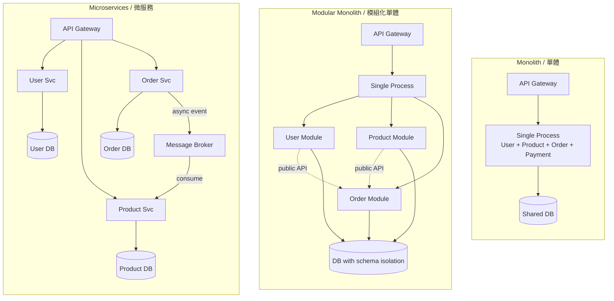
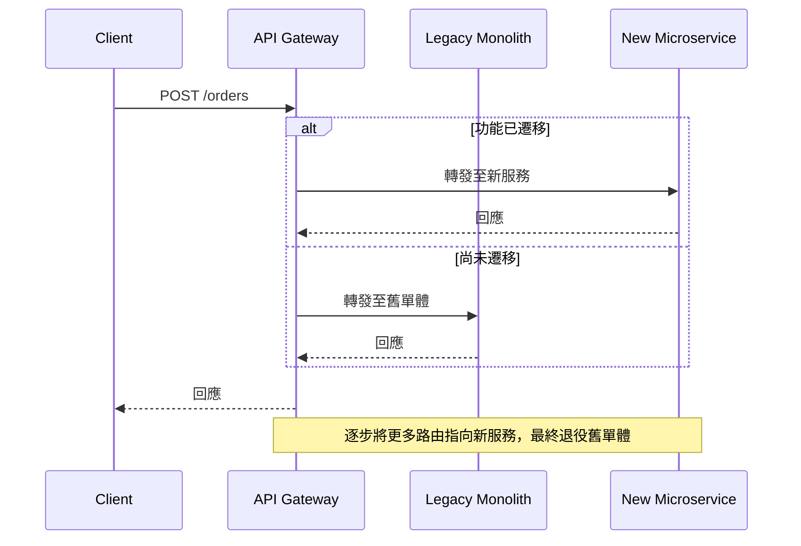

# Microservices vs Monolith / 微服務與單體

## Intent / 意圖

選擇架構風格（monolith、modular monolith、microservices）是系統設計中影響最深遠的決策之一。它不只是技術選擇——更與團隊規模、產品成熟度、組織結構（Conway's Law）直接相關。本篇建立系統化的決策框架，讓你在面對「何時該拆、怎麼拆、拆到什麼程度」時做出有依據的判斷。

核心問題：**我們是否已充分理解領域邊界，足以承擔分散式系統帶來的額外複雜度？**

## Problem / 問題情境

**情境一：單體的規模瓶頸** — 某電商以單一 Rails 應用起步，成長至 50 位工程師、200 萬行程式碼。每次部署需 45 分鐘 CI pipeline，一個訂單模組 bug fix 必須整個重新部署。修改商品目錄 schema 意外破壞結帳流程，部署恐懼蔓延，每週只敢部署一次。

**情境二：過早微服務化** — 3 人新創團隊第一天就拆出 User / Product / Order / Payment / Notification 五個獨立服務。70% 時間花在服務間通訊、分散式追蹤、K8s yaml。每個功能需跨 3-4 服務修改，上線速度比單體慢 5 倍。

核心權衡：**單體的問題是耦合與部署瓶頸，微服務的問題是分散式系統的營運複雜度。** Modular Monolith 試圖取得平衡。

## Core Concepts / 核心概念

- **Monolith / 單體架構**：所有模組編譯部署為單一程序，共用資料庫與記憶體。部署簡單、跨模組呼叫零延遲，但隨程式碼量成長模組邊界模糊、耦合加劇。
- **Modular Monolith / 模組化單體**：單一部署單元，但內部嚴格劃分邊界。每個模組擁有自己的 domain model、repository、router，僅透過 public API 互動。模組各有獨立 schema namespace，禁止跨模組直接存取資料表。邁向微服務前的最佳中繼站。
- **Microservices / 微服務**：每個服務是獨立部署單元，擁有自己的程序、資料庫、CI/CD pipeline。服務間透過網路通訊（HTTP、gRPC、message queue）。代價是網路不可靠、分散式交易、服務發現、可觀測性。
- **Service Boundaries / 服務邊界**：好的邊界具備高內聚低耦合，封裝完整業務能力（如「訂單管理」而非「建立訂單」）。
- **Data Ownership / 資料所有權**：每個服務擁有並管理自己的資料，其他服務不得直接查詢其資料庫。跨服務資料透過 API 呼叫或事件訂閱取得，是避免「分散式單體」的關鍵。
- **Sync vs Async Communication**：同步（HTTP/gRPC）簡單直觀但建立時間耦合；非同步（Kafka、NATS）解耦時間依賴但增加最終一致性複雜度。
- **Service Mesh / 服務網格**：透過 sidecar proxy（Envoy）統一處理 mTLS、可觀測性、重試熔斷。常見：Istio、Linkerd。
- **Sidecar Pattern / 邊車模式**：每個服務旁部署輔助容器處理日誌、流量代理等 cross-cutting concerns，共享 localhost 網路。
- **Strangler Fig Pattern / 絞殺者模式**：Martin Fowler 提出的漸進式遷移策略。在單體前方放置路由層，逐步將流量導向新微服務，舊功能慢慢被替換直到退役。

## Architecture / 架構

### 三種架構風格拓撲比較



### Strangler Fig 遷移模式



## How It Works / 運作原理

**Step 1 — 確認痛點**：部署頻率因耦合降低？團隊頻繁 merge conflict？單一模組流量尖峰導致整體擴縮？若答案多為「否」，不要為了拆而拆。

**Step 2 — 識別 Bounded Context**（DDD）：(1) Event Storming 列出所有領域事件；(2) 將相關事件聚合為群組；(3) 同一詞彙在不同群組有不同語意時即為天然邊界；(4) 兩群組間大量同步呼叫則應合併。

**Step 3 — 先做 Modular Monolith**：每個模組有 public interface（trait / interface）、禁止跨模組存取資料表、用編譯期或 lint 強制邊界。等邊界穩定再提取為獨立服務。

**Step 4 — Strangler Fig 漸進提取**：選耦合最低模組優先 → Gateway 路由規則 → 灰度 5% → 監控 error rate / latency → 逐步放量 → 從單體移除。

## Rust 實作

以 Axum 0.8 實作 Modular Monolith：`catalog` 與 `order` 模組各有獨立 Router、domain types，僅透過 `CatalogQuery` trait 互動。

```rust
// Cargo.toml: axum = "0.8", tokio = { version = "1", features = ["full"] },
//   serde = { version = "1", features = ["derive"] }, uuid = { version = "1", features = ["v4"] }

mod catalog {
    use axum::{extract::State, http::StatusCode, response::Json, routing::get, Router};
    use serde::Serialize;
    use std::sync::Arc;

    pub trait CatalogQuery: Send + Sync {
        fn find_product_by_id(&self, product_id: &str) -> Option<ProductSummary>;
    }
    #[derive(Clone, Serialize)]
    pub struct ProductSummary { pub product_id: String, pub name: String, pub price_cents: u64 }

    #[derive(Clone)]
    struct Product { id: String, name: String, description: String, price_cents: u64, stock: u32 }

    #[derive(Clone)]
    pub struct CatalogService { products: Vec<Product> }
    impl CatalogService {
        pub fn new() -> Self {
            Self { products: vec![
                Product { id: "prod_001".into(), name: "Mechanical Keyboard".into(),
                    description: "Cherry MX Brown".into(), price_cents: 12_999, stock: 50 },
                Product { id: "prod_002".into(), name: "USB-C Hub".into(),
                    description: "7-port with PD".into(), price_cents: 4_999, stock: 120 },
            ]}
        }
    }
    impl CatalogQuery for CatalogService {
        fn find_product_by_id(&self, product_id: &str) -> Option<ProductSummary> {
            self.products.iter().find(|p| p.id == product_id).map(|p| ProductSummary {
                product_id: p.id.clone(), name: p.name.clone(), price_cents: p.price_cents,
            })
        }
    }
    async fn list_products(State(svc): State<Arc<CatalogService>>) -> Json<Vec<ProductSummary>> {
        Json(svc.products.iter().map(|p| ProductSummary {
            product_id: p.id.clone(), name: p.name.clone(), price_cents: p.price_cents,
        }).collect())
    }
    // Output: GET /catalog/products -> [{"product_id":"prod_001","name":"Mechanical Keyboard","price_cents":12999}]
    async fn get_product(State(svc): State<Arc<CatalogService>>,
        axum::extract::Path(id): axum::extract::Path<String>,
    ) -> Result<Json<ProductSummary>, StatusCode> {
        svc.find_product_by_id(&id).map(Json).ok_or(StatusCode::NOT_FOUND)
    }
    // Output: GET /catalog/products/prod_001 -> {"product_id":"prod_001",...}
    pub fn router(svc: Arc<CatalogService>) -> Router {
        Router::new()
            .route("/products", get(list_products))
            .route("/products/{product_id}", get(get_product))
            .with_state(svc)
    }
}

mod order {
    use axum::{extract::State, http::StatusCode, response::Json, routing::{get, post}, Router};
    use serde::{Deserialize, Serialize};
    use std::sync::{Arc, Mutex};
    use super::catalog::{CatalogQuery, ProductSummary};

    #[derive(Clone, Serialize)]
    struct Order { order_id: String, product: ProductSummary, quantity: u32, total_cents: u64, status: String }
    #[derive(Deserialize)]
    struct CreateOrderReq { product_id: String, quantity: u32 }
    struct OrderState { catalog: Arc<dyn CatalogQuery>, orders: Mutex<Vec<Order>> }

    async fn create_order(State(st): State<Arc<OrderState>>, Json(req): Json<CreateOrderReq>,
    ) -> Result<Json<Order>, StatusCode> {
        let product = st.catalog.find_product_by_id(&req.product_id).ok_or(StatusCode::NOT_FOUND)?;
        let order = Order {
            order_id: format!("ord_{}", &uuid::Uuid::new_v4().to_string()[..8]),
            total_cents: product.price_cents * req.quantity as u64,
            product, quantity: req.quantity, status: "confirmed".into(),
        };
        st.orders.lock().unwrap().push(order.clone());
        Ok(Json(order))
    }
    // Output: POST /orders -> {"order_id":"ord_a1b2c3d4","product":{...},"quantity":2,"total_cents":25998,"status":"confirmed"}
    async fn list_orders(State(st): State<Arc<OrderState>>) -> Json<Vec<Order>> {
        Json(st.orders.lock().unwrap().clone())
    }
    // Output: GET /orders -> [{"order_id":"ord_a1b2c3d4",...}]
    pub fn router(catalog: Arc<dyn CatalogQuery>) -> Router {
        let state = Arc::new(OrderState { catalog, orders: Mutex::new(Vec::new()) });
        Router::new().route("/", post(create_order)).route("/", get(list_orders)).with_state(state)
    }
}

use std::sync::Arc;
#[tokio::main]
async fn main() {
    let catalog_svc = Arc::new(catalog::CatalogService::new());
    let catalog_query: Arc<dyn catalog::CatalogQuery> = catalog_svc.clone();
    let app = axum::Router::new()
        .nest("/catalog", catalog::router(catalog_svc))
        .nest("/orders", order::router(catalog_query));
    let listener = tokio::net::TcpListener::bind("0.0.0.0:3000").await.unwrap();
    println!("Modular monolith listening on 0.0.0.0:3000");
    axum::serve(listener, app).await.unwrap();
}
// Output: Modular monolith listening on 0.0.0.0:3000
```

**重點**：`CatalogQuery` trait 是唯一跨模組 contract（DIP）。`Product` 內部欄位 `stock` 不對外暴露。Rust `mod` 可見性在編譯期強制邊界。未來拆服務只需將 `mod` 改為獨立 crate + 網路通訊層。

## Go 實作

```go
package main

import (
	"encoding/json"
	"fmt"
	"log"
	"net/http"
	"sync"
	"github.com/google/uuid"
)

// ─── catalog module ───
type CatalogQuery interface {
	FindProductByID(productID string) (ProductSummary, bool)
}
type ProductSummary struct {
	ProductID string `json:"product_id"`; Name string `json:"name"`; PriceCents uint64 `json:"price_cents"`
}
type product struct { ID, Name, Desc string; PriceCents uint64; Stock uint32 }

type CatalogService struct { products []product }
func NewCatalogService() *CatalogService {
	return &CatalogService{products: []product{
		{ID: "prod_001", Name: "Mechanical Keyboard", Desc: "Cherry MX Brown", PriceCents: 12_999, Stock: 50},
		{ID: "prod_002", Name: "USB-C Hub", Desc: "7-port with PD", PriceCents: 4_999, Stock: 120},
	}}
}
func (s *CatalogService) FindProductByID(id string) (ProductSummary, bool) {
	for _, p := range s.products {
		if p.ID == id { return ProductSummary{p.ID, p.Name, p.PriceCents}, true }
	}
	return ProductSummary{}, false
}
func (s *CatalogService) handleList(w http.ResponseWriter, _ *http.Request) {
	out := make([]ProductSummary, 0, len(s.products))
	for _, p := range s.products { out = append(out, ProductSummary{p.ID, p.Name, p.PriceCents}) }
	w.Header().Set("Content-Type", "application/json"); json.NewEncoder(w).Encode(out)
}
// Output: GET /catalog/products -> [{"product_id":"prod_001","name":"Mechanical Keyboard","price_cents":12999}]
func (s *CatalogService) handleGet(w http.ResponseWriter, r *http.Request) {
	summary, ok := s.FindProductByID(r.PathValue("product_id"))
	if !ok { http.Error(w, "not found", http.StatusNotFound); return }
	w.Header().Set("Content-Type", "application/json"); json.NewEncoder(w).Encode(summary)
}
// Output: GET /catalog/products/prod_001 -> {"product_id":"prod_001",...}
func (s *CatalogService) RegisterRoutes(mux *http.ServeMux) {
	mux.HandleFunc("GET /catalog/products", s.handleList)
	mux.HandleFunc("GET /catalog/products/{product_id}", s.handleGet)
}

// ─── order module ───
type Order struct {
	OrderID string `json:"order_id"`; Product ProductSummary `json:"product"`
	Quantity uint32 `json:"quantity"`; TotalCents uint64 `json:"total_cents"`; Status string `json:"status"`
}
type CreateOrderReq struct { ProductID string `json:"product_id"`; Quantity uint32 `json:"quantity"` }

type OrderService struct { catalog CatalogQuery; mu sync.Mutex; orders []Order }
func NewOrderService(c CatalogQuery) *OrderService { return &OrderService{catalog: c, orders: []Order{}} }
func (s *OrderService) handleCreate(w http.ResponseWriter, r *http.Request) {
	var req CreateOrderReq
	if err := json.NewDecoder(r.Body).Decode(&req); err != nil {
		http.Error(w, "bad request", http.StatusBadRequest); return
	}
	product, ok := s.catalog.FindProductByID(req.ProductID)
	if !ok { http.Error(w, "product not found", http.StatusNotFound); return }
	order := Order{
		OrderID: fmt.Sprintf("ord_%s", uuid.New().String()[:8]), Product: product,
		Quantity: req.Quantity, TotalCents: product.PriceCents * uint64(req.Quantity), Status: "confirmed",
	}
	s.mu.Lock(); s.orders = append(s.orders, order); s.mu.Unlock()
	w.Header().Set("Content-Type", "application/json"); w.WriteHeader(http.StatusCreated)
	json.NewEncoder(w).Encode(order)
}
// Output: POST /orders -> {"order_id":"ord_a1b2c3d4","product":{...},"quantity":2,"total_cents":25998,"status":"confirmed"}
func (s *OrderService) handleList(w http.ResponseWriter, _ *http.Request) {
	s.mu.Lock(); cp := make([]Order, len(s.orders)); copy(cp, s.orders); s.mu.Unlock()
	w.Header().Set("Content-Type", "application/json"); json.NewEncoder(w).Encode(cp)
}
// Output: GET /orders -> [{"order_id":"ord_a1b2c3d4",...}]
func (s *OrderService) RegisterRoutes(mux *http.ServeMux) {
	mux.HandleFunc("POST /orders", s.handleCreate)
	mux.HandleFunc("GET /orders", s.handleList)
}

func main() {
	catalog := NewCatalogService()
	orders := NewOrderService(catalog)
	mux := http.NewServeMux()
	catalog.RegisterRoutes(mux); orders.RegisterRoutes(mux)
	log.Println("Modular monolith listening on 0.0.0.0:3000")
	log.Fatal(http.ListenAndServe("0.0.0.0:3000", mux))
}
// Output: Modular monolith listening on 0.0.0.0:3000
```

**重點**：`CatalogQuery` interface 為 public contract，`product` 小寫不匯出。Go implicit interface 讓重構靈活。`sync.Mutex` 保護共享 `orders`。`RegisterRoutes(mux)` 模式未來拆分只需改為獨立 server。

## Rust vs Go 對照表

| 面向 | Rust (Axum) | Go (net/http) |
|------|-------------|---------------|
| **模組邊界強制** | `pub` / private 由編譯器強制，`mod` 劃分天然嚴格 | 大小寫控制 package 可見性；同 package 內需 linter 或拆獨立 package |
| **依賴注入** | `Arc<dyn Trait>` 動態分派，或泛型 `impl Trait` 靜態分派消除開銷 | Interface implicit implementation，天然支援 DI，但無靜態分派選項 |
| **併發安全** | `Send + Sync` 編譯期排除 data race；`Mutex` guard 綁 lifetime | `sync.Mutex` 忘記 `Unlock()` 不會編譯錯誤，需 `-race` flag 執行期偵測 |
| **拆分路徑** | `mod` → 獨立 crate，trait 不變，Cargo workspace 支援 multi-crate | struct → 獨立 module/repo，interface 不變，Go modules 支援 multi-module |

## When to Use / 適用場景

- **Monolith-First**（多數情況的正確起點）：新創 / 新產品、團隊 < 15 人、領域邊界不明確。只要模組化做得好，單體可服務數百萬用戶。
- **Modular Monolith**（成長期最佳選擇）：團隊 15-50 人、出現跨團隊衝突但未需獨立部署、Event Storming 已識別 3-5 個 Bounded Context。
- **Microservices**（真正需要時才採用）：團隊 > 50 人且有多獨立產品線、不同模組有極端不同擴縮需求、組織已有平台工程能力（CI/CD、monitoring、service mesh）。

## When NOT to Use / 不適用場景

**不該用微服務**：團隊 < 10 人（基礎設施成本吞噬開發時間）、領域邊界不明確（切錯比單體更難修正）、低複雜度 CRUD 應用、缺乏自動化基礎設施（手動部署 + 微服務 = 維運災難）。

**不該堅持單體**：部署耦合已嚴重影響效率（小改動需重測全系統）、跨團隊程式碼衝突頻繁到無法忍受、單一功能資源消耗拖垮全系統（如影片轉碼佔滿 CPU 導致 API 回應變慢）。

## Real-World Examples / 真實世界案例

### Shopify — Modular Monolith

300 萬行 Rails 應用，2019 年啟動 componentization 計畫拆為約 300 個 component，每個有明確邊界與 public API。開發 `packwerk` 工具在 CI 強制模組邊界。結果：保留單體部署簡單性，解決模組耦合。

### Amazon — 從單體到微服務

2001 年前為龐大 C++ 單體。Bezos 發出「API Mandate」：所有團隊必須透過 service interface 暴露功能，禁止直接存取他人資料庫。逐步演進為微服務，最終催生 AWS。關鍵：拆分由**組織規模與獨立性需求**驅動。

### Segment — 微服務回歸單體

每個 destination（GA、Mixpanel 等）為獨立服務，超過 120 個後維運成本爆炸。整合回單體（Centrifuge），維運成本降 10 倍，新 destination 開發從數天縮至數小時。教訓：**邏輯高度相似的服務，合併比拆分更有效率。**

## Interview Questions / 面試常見問題

**Q1: Monolith vs Modular Monolith vs Microservices 的優劣與選擇時機？**
Monolith 最簡單但耦合難控。Modular Monolith 強制內部邊界（schema 隔離、public API only）保留部署簡單性。Microservices 最大獨立性但承擔分散式系統全部複雜度。依團隊規模、邊界清晰度、平台能力選擇。

**Q2: 什麼是 Distributed Monolith？如何避免？**
服務間高度耦合的微服務反模式——共享 DB、長同步呼叫鏈、共享 protobuf。避免：嚴格資料所有權、非同步事件為主、每服務維護自己的資料模型。

**Q3: 如何漸進式遷移（Strangler Fig）？**
Gateway 路由規則 → 選耦合最低模組優先 → 新服務含獨立 DB → 灰度 5% → 監控 → 放量 100% → 從單體移除。每次只遷移一個模組。

**Q4: 同步 vs 非同步通訊的判斷標準？**
(1) 時效性：用戶等待中用同步；(2) 耦合度：容忍對方暫時離線用非同步；(3) 一致性：強一致用同步 + Saga，最終一致用事件。實務混合：讀同步（gRPC），寫副作用非同步（Kafka）。

**Q5: 跨服務資料查詢怎麼處理？**
(1) API Composition：Gateway 呼叫多 API 合併；(2) CQRS：寫發事件，讀服務建 read model；(3) Event Replication：訂閱事件維護本地快照。(2)(3) 犧牲即時一致換取查詢獨立與效能。

## Pitfalls / 常見陷阱

### 1. Distributed Monolith / 分散式單體
表面微服務實際高度耦合：共享 DB、同步鏈 > 3 層、改一個 API 需同時部署 5 服務。兼得兩邊缺點。**辨識**：無法獨立部署任一服務。**解法**：資料所有權 + 非同步事件 + 容忍最終一致。

### 2. Premature Decomposition / 過早拆分
不理解領域就拆 15 個微服務，邊界必然切錯。一個操作跨 4 服務，比單體更難修正（需跨服務 data migration）。**解法**：Monolith-first，邊界穩定後再拆。

### 3. 忽略 Data Gravity / 資料重力
只拆程式碼不拆資料庫，所有服務仍讀寫同一 DB。Schema 變更影響全部服務，部署耦合不減反增。**解法**：資料跟服務走，至少 schema-level 隔離，目標 database-per-service。

### 4. 缺乏可觀測性基礎設施
沒有 distributed tracing / 集中 logging / metrics 就上微服務。請求失敗不知經過哪些服務、哪步出錯，除錯從分鐘變天級。**解法**：可觀測性是微服務前提，拆第一個服務前先建好。

### 5. Saga 補償不完整
跨服務操作缺少 compensating transaction。訂單扣了庫存但支付失敗，補償邏輯未回補導致資料永久不一致。**解法**：每步 Saga 設計對應補償 + dead letter queue + orchestrator pattern 易追蹤除錯。

## References / 參考資料

- Newman, S. (2021). *Building Microservices*, 2nd Ed. O'Reilly
- Richardson, C. (2018). *Microservices Patterns*. Manning
- Kleppmann, M. (2017). *Designing Data-Intensive Applications*. O'Reilly, Ch.12
- Fowler, M. "MonolithFirst": https://martinfowler.com/bliki/MonolithFirst.html
- Fowler, M. "StranglerFigApplication": https://martinfowler.com/bliki/StranglerFigApplication.html
- Shopify: "Deconstructing the Monolith": https://shopify.engineering/deconstructing-monolith-designing-software-maximizes-developer-productivity
- Segment: "Goodbye Microservices": https://segment.com/blog/goodbye-microservices/
- Axum docs: https://docs.rs/axum/latest/axum/
- Go net/http: https://pkg.go.dev/net/http

## Cross-references / 交叉引用

- [[01_scalability_fundamentals|Scalability Fundamentals]] — 水平擴展是微服務核心動機；單體擴縮限制推動服務拆分
- [[02_availability_and_fault_tolerance|Availability & Fault Tolerance]] — 微服務故障隔離（bulkhead pattern）與可用性直接相關
- [[03_consistency_trade_offs|Consistency Trade-offs]] — 微服務間的 eventual consistency 與 Saga pattern 是最大挑戰
- [[04_api_design_rest|API Design (REST)]] — 服務間同步通訊介面設計
- [[05_api_design_grpc_graphql|API Design (gRPC/GraphQL)]] — gRPC 適合微服務高效通訊；GraphQL 適合 BFF 聚合
- [[06_api_versioning|API Versioning]] — 微服務獨立部署時 API 版本控制策略尤為重要
