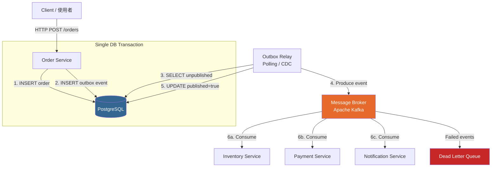
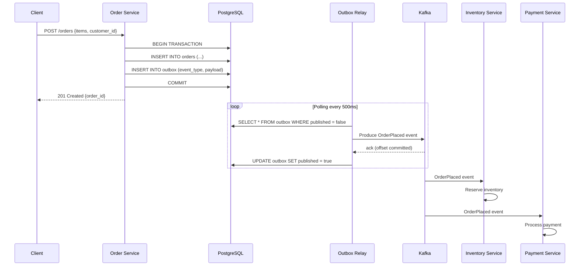

# Event-Driven Architecture / 事件驅動架構

## Intent / 意圖

事件驅動架構（Event-Driven Architecture, EDA）透過非同步事件（event）來解耦服務之間的直接依賴。
生產者（producer）只負責發佈「發生了什麼事」，消費者（consumer）各自訂閱並決定如何反應，
兩者在時間與邏輯上完全解耦。本篇聚焦於 Transactional Outbox Pattern——
在保證本地資料庫交易原子性的前提下，可靠地將事件發佈至 Message Broker。

---

## Problem / 問題情境

**情境：訂單服務同步呼叫庫存、支付、通知服務**

電商平台的訂單建立流程採用同步 REST 呼叫鏈：

1. `OrderService` 建立訂單，同步呼叫 `InventoryService` 扣減庫存。
2. 庫存扣減成功後，同步呼叫 `PaymentService` 扣款。
3. 扣款成功後，同步呼叫 `NotificationService` 寄送確認信。

問題核心：

- **級聯故障（Cascading Failure）**：`PaymentService` 回應超時，導致 `OrderService` 也跟著超時，上游所有請求排隊阻塞。
- **強耦合**：新增「紅利點數」服務需要修改 `OrderService` 程式碼，違反開放封閉原則。
- **分散式交易困難**：庫存已扣但支付失敗時，補償邏輯散落在呼叫鏈各處，難以維護。
- **延遲累加**：每個同步呼叫的延遲加總，使用者等待時間 = 所有下游延遲之和。

---

## Core Concepts / 核心概念

### Event Notification / 事件通知

最輕量的事件模式。事件只攜帶「發生了什麼」與最少的識別資訊（如 `order_id`），
消費者收到通知後需自行回查來源服務取得完整資料。優點是事件小、耦合低；缺點是增加回查流量。

### Event-Carried State Transfer / 事件攜帶狀態轉移

事件本體夾帶足夠的狀態資料（如完整的訂單內容），消費者無需回查即可處理。
減少跨服務呼叫，但事件體積較大，且生產者與消費者之間存在隱性的 schema 耦合。

### Event Sourcing（簡介）

將狀態變更記錄為一連串不可變的事件序列，而非只存最終狀態。
透過重播（replay）事件即可重建任意時間點的系統狀態。
適合需要完整稽核軌跡（audit trail）的場景，但增加讀取複雜度（通常搭配 CQRS）。

### Pub/Sub vs Point-to-Point

- **Pub/Sub（發佈/訂閱）**：一個事件可被多個消費者群組獨立處理。Kafka 的 Consumer Group 即為此模式。
- **Point-to-Point（點對點）**：一個事件只被一個消費者處理。傳統 Message Queue（如 RabbitMQ work queue）的預設行為。

### Domain Events / 領域事件

由領域模型（Domain Model）產生的事件，描述業務上有意義的狀態變更。
例如 `OrderPlaced`、`PaymentCompleted`。命名慣例為過去式動詞，表達「已發生的事實」。

### Integration Events / 整合事件

跨 Bounded Context 的事件，用於服務間通訊。
與 Domain Event 不同之處在於 Integration Event 需要考慮序列化格式、版本相容性與跨團隊契約。

### Transactional Outbox Pattern / 交易發件匣模式

將事件寫入與業務資料寫入放在同一筆資料庫交易中，確保兩者的原子性。
獨立的 Relay（或 CDC 程序）負責從 outbox 表讀取未發佈的事件並推送至 Message Broker。
這是解決「本地交易 + 事件發佈」一致性問題的核心模式。

### Eventual Consistency / 最終一致性

EDA 天然接受最終一致性——事件發佈、傳遞、消費之間存在延遲，
但保證在沒有新事件的情況下，所有服務最終會收斂到一致的狀態。

### Dead Letter Queue (DLQ) / 死信佇列

消費者多次處理失敗的事件會被轉移至 DLQ，避免阻塞正常事件的處理。
運維團隊可定期檢視 DLQ 中的事件，修復問題後重新投遞。

---

## Architecture / 架構

### 事件驅動拓撲（含 Transactional Outbox）



### 事件流序列圖



---

## How It Works / 運作原理

Transactional Outbox Pattern 的運作步驟：

1. **業務操作與事件寫入同一交易**：`Order Service` 在一筆 PostgreSQL 交易中同時寫入 `orders` 表與 `outbox` 表。若任一步驟失敗，整筆交易回滾，確保不會出現「訂單已建立但事件未記錄」的不一致狀態。

2. **Outbox 表結構設計**：`outbox` 表包含 `id`（UUID）、`aggregate_type`（如 `Order`）、`aggregate_id`（如 `order_id`）、`event_type`（如 `OrderPlaced`）、`payload`（JSON）、`published`（布林值）、`created_at` 等欄位。

3. **Relay 輪詢發佈**：獨立的 Relay 程序（或使用 Debezium 等 CDC 工具）定期查詢 `outbox` 表中 `published = false` 的記錄，將其發佈至 Kafka。

4. **標記已發佈**：Relay 收到 Kafka 的 ack（確認寫入成功）後，將 `outbox` 記錄標記為 `published = true`。若 Relay 在標記前崩潰，重啟後會重新發佈同一事件——因此消費者必須具備冪等性（idempotency）。

5. **消費者獨立處理**：每個下游服務（Inventory、Payment、Notification）以獨立的 Kafka Consumer Group 消費事件，各自決定處理邏輯。任一消費者的故障不影響其他消費者。

6. **失敗處理與 DLQ**：消費者處理失敗（如格式錯誤、業務規則違反）超過重試次數後，事件被轉入 Dead Letter Queue，供人工排查與重新投遞。

7. **清理策略**：已發佈的 outbox 記錄可定期刪除或歸檔，避免 outbox 表無限增長。通常保留 7-30 天供除錯追溯。

---

## Rust 實作

以 `sqlx`（PostgreSQL）+ `rdkafka` 實作 Transactional Outbox Pattern。
包含 outbox 表寫入、Relay 輪詢、Kafka 事件發佈的完整流程。

```rust
// Cargo.toml dependencies:
// sqlx = { version = "0.8", features = ["runtime-tokio", "postgres", "uuid", "chrono", "json"] }
// rdkafka = { version = "0.36", features = ["cmake-build"] }
// tokio = { version = "1", features = ["full"] }
// serde = { version = "1", features = ["derive"] }
// serde_json = "1"
// uuid = { version = "1", features = ["v4"] }
// chrono = { version = "0.4", features = ["serde"] }

use chrono::Utc;
use rdkafka::config::ClientConfig;
use rdkafka::producer::{FutureProducer, FutureRecord};
use serde::{Deserialize, Serialize};
use sqlx::postgres::PgPoolOptions;
use sqlx::PgPool;
use std::time::Duration;
use uuid::Uuid;

// ─── Domain Models ───

#[derive(Debug, Serialize, Deserialize)]
struct Order {
    id: Uuid,
    customer_id: Uuid,
    total_amount: i64, // 以最小貨幣單位儲存（如：新台幣「分」）
    status: String,
    created_at: chrono::DateTime<Utc>,
}

#[derive(Debug, Serialize, Deserialize)]
struct OrderPlacedEvent {
    order_id: Uuid,
    customer_id: Uuid,
    total_amount: i64,
    items: Vec<OrderItem>,
    occurred_at: chrono::DateTime<Utc>,
}

#[derive(Debug, Serialize, Deserialize)]
struct OrderItem {
    product_id: Uuid,
    quantity: i32,
    unit_price: i64,
}

// ─── Outbox Record ───

#[derive(Debug, sqlx::FromRow)]
struct OutboxRecord {
    id: Uuid,
    aggregate_type: String,
    aggregate_id: Uuid,
    event_type: String,
    payload: serde_json::Value,
    published: bool,
    created_at: chrono::DateTime<Utc>,
}

// ─── Order Repository with Outbox ───

struct OrderRepository {
    pool: PgPool,
}

impl OrderRepository {
    fn new(pool: PgPool) -> Self {
        Self { pool }
    }

    /// 在同一筆交易中建立訂單並寫入 outbox 事件
    async fn create_order_with_event(
        &self,
        customer_id: Uuid,
        items: Vec<OrderItem>,
    ) -> Result<Order, sqlx::Error> {
        let mut tx = self.pool.begin().await?;

        let order_id = Uuid::new_v4();
        let total_amount: i64 = items
            .iter()
            .map(|item| item.unit_price * item.quantity as i64)
            .sum();
        let now = Utc::now();

        // Step 1: 寫入訂單
        sqlx::query(
            r#"INSERT INTO orders (id, customer_id, total_amount, status, created_at)
               VALUES ($1, $2, $3, $4, $5)"#,
        )
        .bind(order_id)
        .bind(customer_id)
        .bind(total_amount)
        .bind("placed")
        .bind(now)
        .execute(&mut *tx)
        .await?;

        // Step 2: 寫入 outbox 事件（同一筆交易）
        let event = OrderPlacedEvent {
            order_id,
            customer_id,
            total_amount,
            items,
            occurred_at: now,
        };
        let event_payload = serde_json::to_value(&event)
            .expect("failed to serialize event");

        sqlx::query(
            r#"INSERT INTO outbox (id, aggregate_type, aggregate_id, event_type, payload, published, created_at)
               VALUES ($1, $2, $3, $4, $5, false, $6)"#,
        )
        .bind(Uuid::new_v4())
        .bind("Order")
        .bind(order_id)
        .bind("OrderPlaced")
        .bind(&event_payload)
        .bind(now)
        .execute(&mut *tx)
        .await?;

        // 兩步驟在同一交易中 commit
        tx.commit().await?;

        Ok(Order {
            id: order_id,
            customer_id,
            total_amount,
            status: "placed".to_string(),
            created_at: now,
        })
    }
}

// ─── Outbox Relay ───

struct OutboxRelay {
    pool: PgPool,
    producer: FutureProducer,
    topic: String,
}

impl OutboxRelay {
    fn new(pool: PgPool, producer: FutureProducer, topic: &str) -> Self {
        Self {
            pool,
            producer,
            topic: topic.to_string(),
        }
    }

    /// 輪詢 outbox 表，發佈未發送的事件至 Kafka
    async fn poll_and_publish(&self) -> Result<u64, Box<dyn std::error::Error>> {
        let records: Vec<OutboxRecord> = sqlx::query_as(
            r#"SELECT id, aggregate_type, aggregate_id, event_type, payload, published, created_at
               FROM outbox
               WHERE published = false
               ORDER BY created_at ASC
               LIMIT 100
               FOR UPDATE SKIP LOCKED"#,
        )
        .fetch_all(&self.pool)
        .await?;

        let mut published_count: u64 = 0;

        for record in &records {
            let key = record.aggregate_id.to_string();
            let payload = serde_json::to_string(&record.payload)?;

            // 發佈至 Kafka，使用 aggregate_id 作為 partition key 確保同一聚合的事件有序
            let delivery = self
                .producer
                .send(
                    FutureRecord::to(&self.topic)
                        .key(&key)
                        .payload(&payload)
                        .headers(
                            rdkafka::message::OwnedHeaders::new()
                                .insert(rdkafka::message::Header {
                                    key: "event_type",
                                    value: Some(record.event_type.as_bytes()),
                                }),
                        ),
                    Duration::from_secs(5),
                )
                .await;

            match delivery {
                Ok(_) => {
                    // Kafka ack 後標記為已發佈
                    sqlx::query("UPDATE outbox SET published = true WHERE id = $1")
                        .bind(record.id)
                        .execute(&self.pool)
                        .await?;
                    published_count += 1;
                }
                Err((err, _)) => {
                    eprintln!("Failed to publish event {}: {}", record.id, err);
                    // 不標記為 published，下次輪詢會重試
                }
            }
        }

        Ok(published_count)
    }

    /// 啟動持續輪詢迴圈
    async fn run(&self, poll_interval: Duration) {
        println!("Outbox relay started, polling every {:?}", poll_interval);
        loop {
            match self.poll_and_publish().await {
                Ok(count) if count > 0 => {
                    println!("Published {} events", count);
                }
                Ok(_) => {} // 無新事件，靜默
                Err(err) => {
                    eprintln!("Relay error: {}", err);
                }
            }
            tokio::time::sleep(poll_interval).await;
        }
    }
}

#[tokio::main]
async fn main() -> Result<(), Box<dyn std::error::Error>> {
    let database_url = std::env::var("DATABASE_URL")
        .unwrap_or_else(|_| "postgres://localhost:5432/orders".to_string());
    let pool = PgPoolOptions::new()
        .max_connections(10)
        .connect(&database_url)
        .await?;

    let producer: FutureProducer = ClientConfig::new()
        .set("bootstrap.servers", "localhost:9092")
        .set("message.timeout.ms", "5000")
        .set("acks", "all") // 確保所有 ISR 副本確認
        .create()?;

    // 建立訂單（業務操作 + outbox 寫入在同一交易）
    let repo = OrderRepository::new(pool.clone());
    let order = repo
        .create_order_with_event(
            Uuid::new_v4(),
            vec![OrderItem {
                product_id: Uuid::new_v4(),
                quantity: 2,
                unit_price: 15000, // NT$150.00
            }],
        )
        .await?;
    println!("Order created: {:?}", order.id);

    // 啟動 Relay（實務中為獨立程序）
    let relay = OutboxRelay::new(pool, producer, "order-events");
    relay.run(Duration::from_millis(500)).await;

    Ok(())
}
// Output:
// Order created: 550e8400-e29b-41d4-a716-446655440000
// Outbox relay started, polling every 500ms
// Published 1 events
```

**重點說明：**
- `FOR UPDATE SKIP LOCKED` 確保多個 Relay 實例不會重複處理同一筆 outbox 記錄
- `aggregate_id` 作為 Kafka partition key，保證同一訂單的事件在同一 partition 內有序
- `acks = "all"` 確保事件寫入所有 ISR 副本後才回傳 ack，避免資料遺失
- Relay 發佈失敗時不標記 `published`，下次輪詢會自動重試——消費者必須設計為冪等

---

## Go 實作

以 `database/sql`（PostgreSQL）+ `segmentio/kafka-go` 實作相同的 Transactional Outbox Pattern。

```go
// go.mod requires:
// github.com/google/uuid v1.6.0
// github.com/jackc/pgx/v5 v5.7.0
// github.com/segmentio/kafka-go v0.4.47

package main

import (
	"context"
	"database/sql"
	"encoding/json"
	"fmt"
	"log"
	"os"
	"time"

	"github.com/google/uuid"
	_ "github.com/jackc/pgx/v5/stdlib"
	"github.com/segmentio/kafka-go"
)

// ─── Domain Models ───

type Order struct {
	ID          uuid.UUID `json:"id"`
	CustomerID  uuid.UUID `json:"customer_id"`
	TotalAmount int64     `json:"total_amount"`
	Status      string    `json:"status"`
	CreatedAt   time.Time `json:"created_at"`
}

type OrderPlacedEvent struct {
	OrderID     uuid.UUID   `json:"order_id"`
	CustomerID  uuid.UUID   `json:"customer_id"`
	TotalAmount int64       `json:"total_amount"`
	Items       []OrderItem `json:"items"`
	OccurredAt  time.Time   `json:"occurred_at"`
}

type OrderItem struct {
	ProductID uuid.UUID `json:"product_id"`
	Quantity  int32     `json:"quantity"`
	UnitPrice int64     `json:"unit_price"`
}

// ─── Outbox Record ───

type OutboxRecord struct {
	ID            uuid.UUID       `json:"id"`
	AggregateType string          `json:"aggregate_type"`
	AggregateID   uuid.UUID       `json:"aggregate_id"`
	EventType     string          `json:"event_type"`
	Payload       json.RawMessage `json:"payload"`
	Published     bool            `json:"published"`
	CreatedAt     time.Time       `json:"created_at"`
}

// ─── Order Repository with Outbox ───

type OrderRepository struct {
	db *sql.DB
}

func NewOrderRepository(db *sql.DB) *OrderRepository {
	return &OrderRepository{db: db}
}

// CreateOrderWithEvent 在同一筆交易中建立訂單並寫入 outbox 事件
func (r *OrderRepository) CreateOrderWithEvent(
	ctx context.Context,
	customerID uuid.UUID,
	items []OrderItem,
) (*Order, error) {
	tx, err := r.db.BeginTx(ctx, nil)
	if err != nil {
		return nil, fmt.Errorf("begin transaction: %w", err)
	}
	defer tx.Rollback() // commit 成功後 rollback 為 no-op

	orderID := uuid.New()
	var totalAmount int64
	for _, item := range items {
		totalAmount += item.UnitPrice * int64(item.Quantity)
	}
	now := time.Now().UTC()

	// Step 1: 寫入訂單
	_, err = tx.ExecContext(ctx,
		`INSERT INTO orders (id, customer_id, total_amount, status, created_at)
		 VALUES ($1, $2, $3, $4, $5)`,
		orderID, customerID, totalAmount, "placed", now,
	)
	if err != nil {
		return nil, fmt.Errorf("insert order: %w", err)
	}

	// Step 2: 寫入 outbox 事件（同一筆交易）
	event := OrderPlacedEvent{
		OrderID:     orderID,
		CustomerID:  customerID,
		TotalAmount: totalAmount,
		Items:       items,
		OccurredAt:  now,
	}
	eventPayload, err := json.Marshal(event)
	if err != nil {
		return nil, fmt.Errorf("marshal event: %w", err)
	}

	_, err = tx.ExecContext(ctx,
		`INSERT INTO outbox (id, aggregate_type, aggregate_id, event_type, payload, published, created_at)
		 VALUES ($1, $2, $3, $4, $5, false, $6)`,
		uuid.New(), "Order", orderID, "OrderPlaced", eventPayload, now,
	)
	if err != nil {
		return nil, fmt.Errorf("insert outbox: %w", err)
	}

	if err := tx.Commit(); err != nil {
		return nil, fmt.Errorf("commit transaction: %w", err)
	}

	return &Order{
		ID:          orderID,
		CustomerID:  customerID,
		TotalAmount: totalAmount,
		Status:      "placed",
		CreatedAt:   now,
	}, nil
}

// ─── Outbox Relay ───

type OutboxRelay struct {
	db     *sql.DB
	writer *kafka.Writer
}

func NewOutboxRelay(db *sql.DB, writer *kafka.Writer) *OutboxRelay {
	return &OutboxRelay{db: db, writer: writer}
}

// PollAndPublish 查詢未發佈的 outbox 記錄並發送至 Kafka
func (r *OutboxRelay) PollAndPublish(ctx context.Context) (int, error) {
	rows, err := r.db.QueryContext(ctx,
		`SELECT id, aggregate_type, aggregate_id, event_type, payload, published, created_at
		 FROM outbox
		 WHERE published = false
		 ORDER BY created_at ASC
		 LIMIT 100
		 FOR UPDATE SKIP LOCKED`,
	)
	if err != nil {
		return 0, fmt.Errorf("query outbox: %w", err)
	}
	defer rows.Close()

	var records []OutboxRecord
	for rows.Next() {
		var rec OutboxRecord
		if err := rows.Scan(
			&rec.ID, &rec.AggregateType, &rec.AggregateID,
			&rec.EventType, &rec.Payload, &rec.Published, &rec.CreatedAt,
		); err != nil {
			return 0, fmt.Errorf("scan outbox row: %w", err)
		}
		records = append(records, rec)
	}

	publishedCount := 0
	for _, rec := range records {
		msg := kafka.Message{
			Key:   []byte(rec.AggregateID.String()),
			Value: rec.Payload,
			Headers: []kafka.Header{
				{Key: "event_type", Value: []byte(rec.EventType)},
			},
		}

		if err := r.writer.WriteMessages(ctx, msg); err != nil {
			log.Printf("Failed to publish event %s: %v", rec.ID, err)
			continue // 不標記，下次輪詢重試
		}

		// Kafka ack 後標記為已發佈
		_, err := r.db.ExecContext(ctx,
			`UPDATE outbox SET published = true WHERE id = $1`, rec.ID,
		)
		if err != nil {
			log.Printf("Failed to mark event %s as published: %v", rec.ID, err)
			continue
		}
		publishedCount++
	}

	return publishedCount, nil
}

// Run 啟動持續輪詢迴圈
func (r *OutboxRelay) Run(ctx context.Context, pollInterval time.Duration) {
	log.Printf("Outbox relay started, polling every %v", pollInterval)
	ticker := time.NewTicker(pollInterval)
	defer ticker.Stop()

	for {
		select {
		case <-ctx.Done():
			log.Println("Outbox relay shutting down")
			return
		case <-ticker.C:
			count, err := r.PollAndPublish(ctx)
			if err != nil {
				log.Printf("Relay error: %v", err)
				continue
			}
			if count > 0 {
				log.Printf("Published %d events", count)
			}
		}
	}
}

func main() {
	databaseURL := os.Getenv("DATABASE_URL")
	if databaseURL == "" {
		databaseURL = "postgres://localhost:5432/orders?sslmode=disable"
	}

	db, err := sql.Open("pgx", databaseURL)
	if err != nil {
		log.Fatalf("Failed to connect to database: %v", err)
	}
	defer db.Close()
	db.SetMaxOpenConns(10)

	kafkaWriter := &kafka.Writer{
		Addr:         kafka.TCP("localhost:9092"),
		Topic:        "order-events",
		Balancer:     &kafka.Hash{}, // 依 key hash 分配 partition
		RequiredAcks: kafka.RequireAll,
		BatchTimeout: 10 * time.Millisecond,
	}
	defer kafkaWriter.Close()

	ctx := context.Background()

	// 建立訂單（業務操作 + outbox 寫入在同一交易）
	repo := NewOrderRepository(db)
	order, err := repo.CreateOrderWithEvent(ctx, uuid.New(), []OrderItem{
		{
			ProductID: uuid.New(),
			Quantity:  2,
			UnitPrice: 15000, // NT$150.00
		},
	})
	if err != nil {
		log.Fatalf("Failed to create order: %v", err)
	}
	fmt.Printf("Order created: %s\n", order.ID)

	// 啟動 Relay（實務中為獨立程序）
	relay := NewOutboxRelay(db, kafkaWriter)
	relay.Run(ctx, 500*time.Millisecond)
}
// Output:
// Order created: 550e8400-e29b-41d4-a716-446655440000
// Outbox relay started, polling every 500ms
// Published 1 events
```

**重點說明：**
- `defer tx.Rollback()` 在 `Commit()` 成功後為 no-op，確保交易不會懸掛
- `kafka.Hash{}` balancer 以 message key（`aggregate_id`）做 hash 分配 partition，保證同一訂單的事件有序
- `RequireAll` 等同 Kafka `acks=all`，確保所有 ISR 副本確認
- `context.Context` 貫穿全程，支援 graceful shutdown

---

## Rust vs Go 對照表

| 面向 | Rust (sqlx + rdkafka) | Go (database/sql + kafka-go) |
|------|----------------------|------------------------------|
| **交易安全** | `sqlx::Transaction` 在 drop 時自動 rollback，編譯器強制處理 `Result`，遺漏錯誤處理會導致編譯失敗 | `defer tx.Rollback()` 慣例需開發者自行遵守，`Commit` 後 rollback 為 no-op，但忘記 defer 會導致交易懸掛 |
| **非同步模型** | `rdkafka` 底層使用 librdkafka（C 函式庫），`FutureProducer` 回傳 `Future` 可直接 `.await`。效能極佳但編譯需要 CMake | `kafka-go` 純 Go 實作，無 CGO 依賴。`WriteMessages` 為同步阻塞呼叫，但可在 goroutine 中並行。部署簡單 |
| **錯誤傳播** | `?` 運算子搭配 `Result<T, E>` 強制逐層處理或傳播錯誤，outbox 寫入失敗保證交易回滾 | `if err != nil` 慣例清晰但冗長，且編譯器不強制檢查回傳的 error，可能被忽略 |
| **序列化** | `serde` 在編譯期生成零成本的序列化/反序列化程式碼，型別安全且效能優異 | `encoding/json` 使用 reflect 在執行期處理，彈性高但效能較低且型別錯誤延遲到執行期 |

---

## When to Use / 適用場景

### 1. 微服務間需要鬆耦合的通訊

當多個服務需要對同一業務事件做出不同反應（如訂單建立後：扣庫存、扣款、寄信、累積點數），
EDA 讓生產者不需知道有多少消費者，新增下游服務只需訂閱事件即可，無需修改上游程式碼。

### 2. 需要可靠的跨服務資料同步

業務資料變更需要同步至搜尋索引（Elasticsearch）、資料倉儲（Data Warehouse）、快取等多個下游系統。
Transactional Outbox 保證事件不會遺失，搭配 Kafka 的持久化特性可重播歷史事件。

### 3. 流量尖峰的削峰填谷

突發流量可先寫入 Message Broker 排隊，消費者依自身處理能力消費。
避免下游服務被瞬間流量擊潰，實現流量整形（traffic shaping）。

---

## When NOT to Use / 不適用場景

### 1. 需要即時同步回應的場景

使用者操作需要立即看到所有服務的處理結果（如即時餘額查詢），EDA 的最終一致性無法滿足此需求。
應使用同步呼叫或搭配 read-your-writes 機制。

### 2. 簡單的兩服務點對點通訊

只有 Service A 呼叫 Service B 的單純場景，引入 Message Broker 會增加不必要的基礎設施複雜度、
監控負擔與除錯難度。直接的 HTTP/gRPC 呼叫搭配重試與斷路器更為合適。

### 3. 對事件順序有全域嚴格要求的場景

Kafka 只保證同一 partition 內的順序。若業務要求跨所有聚合根的全域事件順序
（如全域帳務流水號遞增），EDA 的 partition 模型無法直接滿足，需要額外的排序層。

---

## Real-World Examples / 真實世界案例

### Uber — 事件驅動的行程生命週期

- Uber 的行程（trip）從請求、配對、上車、行駛到結算，每個狀態轉換都是一個 domain event。
- 下游數十個服務（計費、ETA 預估、安全監控、資料分析）訂閱行程事件，各自獨立處理。
- 使用自研的 Cherami（後遷移至 Kafka）作為 Message Broker，日處理數兆筆事件。
- Transactional Outbox 確保行程狀態與事件的一致性，即使 Kafka 暫時不可用也不會遺失事件。

### LinkedIn — Apache Kafka 的誕生地

- Kafka 最初由 LinkedIn 開發，用於解決活動流（activity stream）資料管線的可靠性與規模問題。
- LinkedIn 的 Profile 更新、連線邀請、訊息等全部透過 Kafka 事件驅動。
- 每日處理超過 7 兆筆訊息，峰值吞吐量超過 30 GB/s。
- 開源後成為事件驅動架構的事實標準，催生了 Kafka Streams、ksqlDB、Kafka Connect 等生態系。

---

## Interview Questions / 面試常見問題

### Q1: 什麼是 Transactional Outbox Pattern？它解決什麼問題？

Transactional Outbox 將事件寫入（outbox 表）與業務資料寫入放在同一筆資料庫交易中，確保兩者的原子性。獨立的 Relay 程序負責將 outbox 中的事件發佈至 Message Broker。它解決了「業務操作成功但事件發佈失敗」或「事件已發佈但業務操作回滾」的雙寫不一致問題（dual-write problem）。

### Q2: 如何保證消費者的冪等性（idempotency）？

常見做法：(1) 在消費者端維護已處理事件 ID 的記錄表，收到重複事件時跳過。(2) 業務操作本身設計為冪等——如使用 `INSERT ... ON CONFLICT DO NOTHING` 或條件更新 `UPDATE ... WHERE status = 'pending'`。(3) 在事件中攜帶冪等鍵（idempotency key），消費者用此鍵做去重。

### Q3: Event Notification 與 Event-Carried State Transfer 如何選擇？

Event Notification 事件體積小、耦合低，但消費者需要回查生產者取得完整資料，增加跨服務流量。Event-Carried State Transfer 事件攜帶完整狀態，消費者可自主處理，但事件體積大且存在 schema 耦合。選擇依據：若下游服務頻繁需要完整資料且對延遲敏感，選 state transfer；若事件頻率極高但多數消費者只需部分資訊，選 notification。

### Q4: Kafka 如何保證訊息順序？Consumer Group 是什麼？

Kafka 保證同一 partition 內的訊息嚴格有序。Producer 透過 message key 的 hash 決定寫入哪個 partition。Consumer Group 是一組消費者的邏輯分組，Kafka 將 topic 的各 partition 分配給 group 內的消費者，每個 partition 只被一個消費者處理。不同 Consumer Group 各自獨立消費同一 topic 的全部訊息。

### Q5: 如何處理 Schema Evolution（事件格式變更）？

常見策略：(1) 使用 Schema Registry（如 Confluent Schema Registry）管理 Avro/Protobuf schema，搭配相容性檢查（backward/forward compatible）。(2) 事件中攜帶版本號，消費者依版本號選擇反序列化邏輯。(3) 遵循只新增欄位、不刪除不重新命名的 schema 演進規則。(4) 使用 JSON Schema 搭配可選欄位（optional fields）做漸進式遷移。

---

## Pitfalls / 常見陷阱

### 1. 訊息順序假設（Message Ordering）

Kafka 只保證同一 partition 內有序。若不同聚合根的事件寫入同一 partition（如隨機 partition key），
或消費者從多個 partition 並行消費，事件處理順序可能與發生順序不一致。

**解法：** 以 `aggregate_id` 作為 partition key，確保同一聚合根的事件落在同一 partition。
若需要跨聚合根的順序保證，考慮使用單一 partition（犧牲吞吐量）或在消費端實作排序緩衝。

### 2. 重複事件（Duplicate Events）

Outbox Relay 在發佈事件至 Kafka 後、標記 `published = true` 前崩潰，
重啟後會重新發佈同一事件。Kafka 的 at-least-once 語意也可能因 producer 重試產生重複。

**解法：** 消費者必須設計為冪等。使用事件 ID 做去重，或讓業務操作本身可安全重複執行。
Kafka 的 Exactly-Once Semantics（EOS）可在生產者端避免重複，但增加延遲與複雜度。

### 3. Schema Evolution 不相容

事件格式變更（如欄位重新命名、刪除必填欄位）可能導致舊版消費者反序列化失敗，
大量事件湧入 DLQ，甚至消費者整體停擺。

**解法：** 採用 backward compatible 演進策略——只新增可選欄位，不刪除或重新命名既有欄位。
搭配 Schema Registry 在發佈前自動檢查相容性，阻止不相容的 schema 變更上線。

### 4. Outbox 表膨脹

高吞吐量系統中，outbox 表若未定期清理已發佈的記錄，會持續增長，
影響 Relay 的查詢效能與資料庫整體健康度。

**解法：** 設定排程任務定期刪除已發佈超過保留期限（如 7 天）的記錄。
或使用 PostgreSQL 的 table partitioning 依日期分區，直接 drop 過期分區。

### 5. Relay 成為單點故障

若只部署一個 Relay 實例，其故障會導致所有事件延遲發佈。

**解法：** 部署多個 Relay 實例，搭配 `FOR UPDATE SKIP LOCKED` 讓多實例安全地並行處理 outbox。
或採用 CDC 方案（如 Debezium 讀取 PostgreSQL WAL），完全不需輪詢。

---

## Cross-references / 交叉引用

- [[./01_scalability_fundamentals|Scalability Fundamentals / 可擴展性基礎]] — EDA 的消費者可水平擴展，搭配自動擴縮實現彈性吞吐。
- [[./03_consistency_trade_offs|Consistency Trade-offs / 一致性權衡]] — EDA 天然接受最終一致性，理解一致性模型有助於設計正確的消費者行為。
- [[./04_api_design_rest|API Design: REST]] — 事件驅動架構中的 HTTP 入口端點仍需遵循 REST 設計原則。
- [[../../database/transactions|Transactions / 交易]] — Transactional Outbox 的核心是利用資料庫交易的原子性保證。
- [[../../database/isolation_levels|Isolation Levels / 隔離等級]] — `FOR UPDATE SKIP LOCKED` 的行為受資料庫隔離等級影響。

---

## References / 參考資料

1. **Designing Data-Intensive Applications (DDIA)** — Martin Kleppmann. Chapter 11: Stream Processing，涵蓋事件流、Kafka 架構與 exactly-once 語意
2. **Microservices Patterns** — Chris Richardson. Chapter 3: Interprocess Communication，詳細介紹 Transactional Outbox、Saga 與事件驅動通訊
3. **Enterprise Integration Patterns** — Hohpe & Woolf. 訊息通道、事件路由與 Dead Letter Channel 等經典模式
4. Apache Kafka 官方文件: https://kafka.apache.org/documentation/
5. Debezium CDC 文件: https://debezium.io/documentation/
6. rdkafka (Rust): https://docs.rs/rdkafka/latest/rdkafka/
7. segmentio/kafka-go (Go): https://github.com/segmentio/kafka-go
8. Chris Richardson - Transactional Outbox Pattern: https://microservices.io/patterns/data/transactional-outbox.html
9. Martin Fowler - Event-Driven Architecture: https://martinfowler.com/articles/201701-event-driven.html