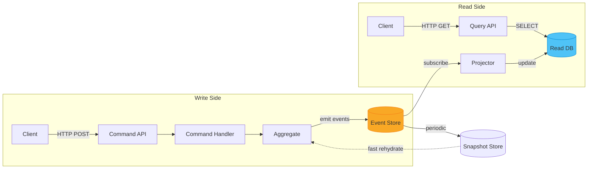
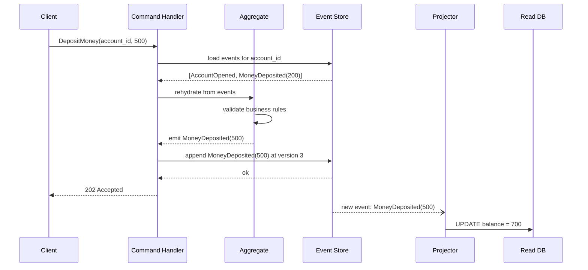

# CQRS & Event Sourcing / CQRS 與事件溯源

## Intent / 意圖

將讀取模型（Query）與寫入模型（Command）拆分為獨立路徑，使兩側可各自最佳化與獨立擴展。搭配事件溯源（Event Sourcing），將所有狀態變更記錄為不可變事件序列，提供完整稽核軌跡（audit trail）與時間旅行（time-travel）能力。

## Problem / 問題情境

以電商訂單生命週期為例：一筆訂單從建立、付款、出貨、退貨到完成，涉及多種狀態轉移與業務規則。若使用單一模型同時服務讀寫：

- **寫入端**需要強一致性、商業規則驗證、樂觀鎖——模型偏向正規化。
- **讀取端**需要跨聚合的非正規化視圖（訂單 + 商品 + 物流）——模型偏向反正規化。
- 單一模型造成**讀寫競爭鎖**，高流量下效能瓶頸顯著。
- 一旦資料被覆寫，**歷史軌跡消失**，無法回答「這筆訂單曾經被改過幾次價格？」。
- 領域複雜度升高後，單一模型的 repository 膨脹成 God Object。

## Core Concepts / 核心概念

- **CQRS（Command Query Responsibility Segregation）**：命令與查詢走不同模型與資料儲存，各自最佳化。
- **Event Store**：以 append-only 方式記錄所有領域事件，作為 single source of truth。
- **Domain Event**：描述已發生的事實，不可變。命名用過去式：`AccountOpened`、`MoneyDeposited`。
- **Aggregate**：一致性邊界，處理命令並產生事件。重播事件可重建當前狀態。
- **Rehydration**：從事件儲存讀取事件序列，依序 apply 回聚合以還原狀態。
- **Snapshot**：定期儲存聚合完整狀態以加速重建，避免每次從第一筆事件 replay。
- **Projection / Read Model**：訂閱事件流，將事件轉換為查詢最佳化的非正規化視圖。
- **Command Handler**：接收命令、載入聚合、驗證業務規則、產生並持久化事件。
- **Eventual Consistency**：寫入端產生事件後，讀取端非同步更新，短暫不一致但最終收斂。

## Architecture / 架構



Projector 訂閱事件流，投影為查詢友善的讀取資料庫（PostgreSQL 反正規化表、Redis、Elasticsearch 皆可）。

## How It Works / 運作原理



1. 從 Event Store 載入聚合的所有事件（或從最近 snapshot 開始）。
2. 依序 apply 事件重建聚合當前狀態（rehydration）。
3. 聚合驗證命令是否合法（如餘額不足則拒絕提款）。
4. 產生新的領域事件，附帶預期版本號（optimistic concurrency）。
5. 事件 append 到 Event Store，版本衝突則拒絕。
6. Projector 非同步訂閱新事件，更新 Read DB。

**Snapshot 策略**：每 N 筆事件（如 100 筆）存一次 snapshot。重建時先載入 snapshot 再 replay 後續事件。Snapshot 是可重建的衍生資料——遺失時可從事件重新產生。

## Rust 實作

銀行帳戶（BankAccount）事件溯源聚合 + Axum 命令端點。共用 Event Store 表結構見下方 SQL。

```rust
use axum::{extract::State, routing::post, Json, Router};
use serde::{Deserialize, Serialize};
use sqlx::PgPool;
use std::sync::Arc;
use uuid::Uuid;

// --- Domain Events ---
#[derive(Debug, Clone, Serialize, Deserialize)]
#[serde(tag = "type")]
enum AccountEvent {
    AccountOpened { owner: String, initial_balance: i64 },
    MoneyDeposited { amount: i64 },
    MoneyWithdrawn { amount: i64 },
}

// --- Aggregate ---
#[derive(Debug, Default)]
struct BankAccount { id: Uuid, balance: i64, version: i64, is_opened: bool }

impl BankAccount {
    fn apply(&mut self, event: &AccountEvent) {
        match event {
            AccountEvent::AccountOpened { initial_balance, .. } => {
                self.balance = *initial_balance;
                self.is_opened = true;
            }
            AccountEvent::MoneyDeposited { amount } => self.balance += amount,
            AccountEvent::MoneyWithdrawn { amount } => self.balance -= amount,
        }
        self.version += 1;
    }
    fn handle_deposit(&self, amount: i64) -> Result<AccountEvent, String> {
        if !self.is_opened { return Err("Account not opened".into()); }
        if amount <= 0 { return Err("Amount must be positive".into()); }
        Ok(AccountEvent::MoneyDeposited { amount })
    }
    fn handle_withdraw(&self, amount: i64) -> Result<AccountEvent, String> {
        if !self.is_opened { return Err("Account not opened".into()); }
        if self.balance < amount {
            return Err(format!("Insufficient funds: balance={}, requested={}", self.balance, amount));
        }
        Ok(AccountEvent::MoneyWithdrawn { amount })
    }
}

// --- Event Store ---
async fn load_events(pool: &PgPool, id: Uuid) -> Result<Vec<AccountEvent>, sqlx::Error> {
    let rows: Vec<(serde_json::Value,)> = sqlx::query_as(
        "SELECT payload FROM events WHERE aggregate_id = $1 ORDER BY version ASC",
    ).bind(id).fetch_all(pool).await?;
    Ok(rows.into_iter().map(|(p,)| serde_json::from_value(p).unwrap()).collect())
}

async fn append_event(pool: &PgPool, id: Uuid, expected_ver: i64, event: &AccountEvent) -> Result<(), String> {
    let payload = serde_json::to_value(event).unwrap();
    let res = sqlx::query(
        "INSERT INTO events (aggregate_id, version, event_type, payload, created_at)
         VALUES ($1, $2, $3, $4, NOW()) ON CONFLICT (aggregate_id, version) DO NOTHING",
    ).bind(id).bind(expected_ver + 1).bind(format!("{:?}", event)).bind(payload)
     .execute(pool).await.map_err(|e| e.to_string())?;
    if res.rows_affected() == 0 { return Err("Optimistic concurrency conflict".into()); }
    Ok(())
}

fn rehydrate(id: Uuid, events: &[AccountEvent]) -> BankAccount {
    let mut acct = BankAccount { id, ..Default::default() };
    for e in events { acct.apply(e); }
    acct
}

// --- HTTP Handler ---
#[derive(Deserialize)]
struct DepositCmd { account_id: Uuid, amount: i64 }

async fn deposit_handler(
    State(pool): State<Arc<PgPool>>, Json(cmd): Json<DepositCmd>,
) -> Result<Json<serde_json::Value>, String> {
    let events = load_events(&pool, cmd.account_id).await.map_err(|e| e.to_string())?;
    let acct = rehydrate(cmd.account_id, &events);
    let new_event = acct.handle_deposit(cmd.amount)?;
    append_event(&pool, cmd.account_id, acct.version, &new_event).await?;
    Ok(Json(serde_json::json!({"status":"accepted","new_version":acct.version+1})))
}
// Output:
// POST /commands/deposit {"account_id":"...","amount":500}
// -> {"status":"accepted","new_version":3}

#[tokio::main]
async fn main() {
    let pool = Arc::new(PgPool::connect("postgres://localhost/bank").await.unwrap());
    let app = Router::new().route("/commands/deposit", post(deposit_handler)).with_state(pool);
    let listener = tokio::net::TcpListener::bind("0.0.0.0:3000").await.unwrap();
    axum::serve(listener, app).await.unwrap();
}
```

```sql
CREATE TABLE events (
    aggregate_id UUID NOT NULL,
    version      BIGINT NOT NULL,
    event_type   TEXT NOT NULL,
    payload      JSONB NOT NULL,
    created_at   TIMESTAMPTZ NOT NULL DEFAULT NOW(),
    PRIMARY KEY (aggregate_id, version)
);
CREATE TABLE snapshots (
    aggregate_id UUID PRIMARY KEY,
    version      BIGINT NOT NULL,
    state        JSONB NOT NULL,
    created_at   TIMESTAMPTZ NOT NULL DEFAULT NOW()
);
```

## Go 實作

同等的銀行帳戶事件溯源聚合，Go 1.24+ 標準庫路由 + `database/sql`。

```go
package main

import (
	"database/sql"
	"encoding/json"
	"errors"
	"fmt"
	"log"
	"net/http"

	"github.com/google/uuid"
	_ "github.com/jackc/pgx/v5/stdlib"
)

// --- Domain Events ---
type EventType string
const (
	EvtAccountOpened  EventType = "AccountOpened"
	EvtMoneyDeposited EventType = "MoneyDeposited"
	EvtMoneyWithdrawn EventType = "MoneyWithdrawn"
)
type AccountEvent struct {
	Type           EventType `json:"type"`
	Owner          string    `json:"owner,omitempty"`
	InitialBalance int64     `json:"initial_balance,omitempty"`
	Amount         int64     `json:"amount,omitempty"`
}

// --- Aggregate ---
type BankAccount struct {
	ID       uuid.UUID
	Balance  int64
	Version  int64
	IsOpened bool
}
func (a *BankAccount) Apply(e AccountEvent) {
	switch e.Type {
	case EvtAccountOpened:
		a.Balance = e.InitialBalance; a.IsOpened = true
	case EvtMoneyDeposited:
		a.Balance += e.Amount
	case EvtMoneyWithdrawn:
		a.Balance -= e.Amount
	}
	a.Version++
}
func (a *BankAccount) HandleDeposit(amount int64) (AccountEvent, error) {
	if !a.IsOpened { return AccountEvent{}, errors.New("account not opened") }
	if amount <= 0 { return AccountEvent{}, errors.New("amount must be positive") }
	return AccountEvent{Type: EvtMoneyDeposited, Amount: amount}, nil
}
func (a *BankAccount) HandleWithdraw(amount int64) (AccountEvent, error) {
	if !a.IsOpened { return AccountEvent{}, errors.New("account not opened") }
	if a.Balance < amount {
		return AccountEvent{}, fmt.Errorf("insufficient funds: balance=%d, requested=%d", a.Balance, amount)
	}
	return AccountEvent{Type: EvtMoneyWithdrawn, Amount: amount}, nil
}

// --- Event Store ---
func loadEvents(db *sql.DB, id uuid.UUID) ([]AccountEvent, error) {
	rows, err := db.Query(
		`SELECT payload FROM events WHERE aggregate_id = $1 ORDER BY version ASC`, id)
	if err != nil { return nil, err }
	defer rows.Close()
	var events []AccountEvent
	for rows.Next() {
		var raw []byte
		if err := rows.Scan(&raw); err != nil { return nil, err }
		var e AccountEvent
		if err := json.Unmarshal(raw, &e); err != nil { return nil, err }
		events = append(events, e)
	}
	return events, rows.Err()
}
func appendEvent(db *sql.DB, id uuid.UUID, expectedVer int64, e AccountEvent) error {
	payload, _ := json.Marshal(e)
	res, err := db.Exec(
		`INSERT INTO events (aggregate_id, version, event_type, payload, created_at)
		 VALUES ($1, $2, $3, $4, NOW()) ON CONFLICT (aggregate_id, version) DO NOTHING`,
		id, expectedVer+1, e.Type, payload)
	if err != nil { return err }
	n, _ := res.RowsAffected()
	if n == 0 { return errors.New("optimistic concurrency conflict") }
	return nil
}
func rehydrate(id uuid.UUID, events []AccountEvent) BankAccount {
	acct := BankAccount{ID: id}
	for _, e := range events { acct.Apply(e) }
	return acct
}

// --- HTTP Handler ---
type DepositCmd struct {
	AccountID uuid.UUID `json:"account_id"`
	Amount    int64     `json:"amount"`
}
func depositHandler(db *sql.DB) http.HandlerFunc {
	return func(w http.ResponseWriter, r *http.Request) {
		var cmd DepositCmd
		if err := json.NewDecoder(r.Body).Decode(&cmd); err != nil {
			http.Error(w, err.Error(), http.StatusBadRequest); return
		}
		events, err := loadEvents(db, cmd.AccountID)
		if err != nil { http.Error(w, err.Error(), 500); return }
		acct := rehydrate(cmd.AccountID, events)
		newEvt, err := acct.HandleDeposit(cmd.Amount)
		if err != nil { http.Error(w, err.Error(), 422); return }
		if err := appendEvent(db, cmd.AccountID, acct.Version, newEvt); err != nil {
			http.Error(w, err.Error(), 409); return
		}
		w.Header().Set("Content-Type", "application/json")
		w.WriteHeader(http.StatusAccepted)
		json.NewEncoder(w).Encode(map[string]any{
			"status": "accepted", "new_version": acct.Version + 1,
		})
	}
}
// Output:
// POST /commands/deposit {"account_id":"...","amount":500}
// -> {"new_version":3,"status":"accepted"}

func main() {
	db, err := sql.Open("pgx", "postgres://localhost/bank")
	if err != nil { log.Fatal(err) }
	defer db.Close()
	mux := http.NewServeMux()
	mux.HandleFunc("POST /commands/deposit", depositHandler(db))
	log.Println("listening on :3000")
	log.Fatal(http.ListenAndServe(":3000", mux))
}
```

## Rust vs Go 對照表

| 面向 | Rust (Axum + sqlx) | Go (net/http + database/sql) |
|------|-------------------|------------------------------|
| **型別安全** | `enum` + `serde(tag)` 在編譯期保障事件反序列化，遺漏 variant 觸發 exhaustive match 警告 | 需手動 switch-case，遺漏 event type 不會編譯錯誤，靠 linter 補強 |
| **並行模型** | `tokio` async + `Arc<PgPool>` 透過 `State` extractor 注入，零成本抽象 | goroutine + `database/sql` 內建連線池，語法直覺但缺少所有權保證 |
| **錯誤處理** | `Result<T, E>` 強制處理，`?` 鏈式傳播，遺漏會編譯失敗 | `if err != nil` 慣用但冗長，易遺漏，需 `errcheck` linter |
| **事件序列化** | `serde` tagged enum 直接對應 `{"type":"MoneyDeposited","amount":500}` | `encoding/json` struct tag，多型事件需手動判斷 type 再 unmarshal |
| **部署特性** | 靜態二進位，無 GC 停頓，適合延遲敏感的寫入端 | 單一二進位，GC 友善但有微小停頓，快速開發與維運 |

## When to Use / 適用場景

- **稽核與合規**：金融、醫療、政府系統需要完整變更歷史，Event Sourcing 天然滿足。
- **複雜領域邏輯**：訂單、保險理賠、供應鏈等多狀態轉移場景，聚合 + 事件比 CRUD 更能表達意圖。
- **讀寫負載不對稱**：讀取遠多於寫入（或反之），CQRS 讓兩側獨立擴展。
- **時間旅行與除錯**：可重播到任意時間點觀察聚合狀態，對除錯與資料修復極有價值。
- **事件驅動整合**：事件儲存同時作為其他微服務的事件來源，避免雙重寫入問題。

## When NOT to Use / 不適用場景

- **簡單 CRUD**：沒有複雜業務規則的後台管理，Event Sourcing 帶來不必要的複雜度。
- **小型團隊或原型期**：維護事件 schema 版本、投影、快照需要額外心力，初期投入產出比低。
- **強一致性讀取**：業務不能容忍最終一致性延遲，需要額外機制（read-your-own-writes）。
- **事件極少的聚合**：聚合一生只有 2-3 筆事件，直接儲存狀態更簡單。
- **缺乏 DDD 經驗**：錯誤的聚合邊界劃分會讓事件模型更難修改。

## Real-World Examples / 真實世界案例

| 系統 / 工具 | 說明 |
|-------------|------|
| **EventStoreDB** | Greg Young 主導的專用事件儲存資料庫，原生支援 projection、subscription、$all stream。 |
| **Axon Framework** | Java CQRS + ES 框架，含 Aggregate、Saga、Event Processor，歐洲銀行廣泛採用。 |
| **銀行核心帳務** | 現代銀行核心以事件溯源記錄每筆交易，帳戶餘額是事件投影的衍生值。 |
| **Miro** | 使用 Event Sourcing 記錄白板每個操作，支援 undo/redo 與即時協作。 |
| **LMAX Exchange** | 高頻交易平台，Event Sourcing + single-writer 達到微秒級延遲。 |

## Interview Questions / 面試常見問題

**Q1: CQRS 和 Event Sourcing 的關係？可以只用其中一個嗎？**

可以。CQRS 是讀寫模型分離的架構模式，不一定需要 ES。ES 也可獨立使用，但實務上因 replay 效能問題通常搭配 CQRS 讀取投影。兩者互補性強：ES 產生的事件流天然適合驅動 CQRS 的投影。

**Q2: 如何處理事件 schema 演進（event versioning）？**

(1) Upcasting——讀取時將舊版事件轉換為新版格式；(2) Weak schema——payload 用 JSON 且消費端容忍未知欄位；(3) 新增 event type 而非修改舊事件。已儲存的事件代表已發生的事實，不應修改。

**Q3: 最終一致性會導致什麼問題？如何緩解？**

使用者可能剛下單卻在查詢頁看不到。緩解：(1) 命令回傳足夠資訊讓前端樂觀更新 UI；(2) read-your-own-writes——回傳版本號，查詢端輪詢至版本一致；(3) 同步更新輕量讀取快取作為 fallback。

**Q4: Event Store 如何實現 optimistic concurrency？**

每個聚合事件帶遞增 version。寫入時指定 expected version，若不符合預期則寫入失敗。SQL：`INSERT ... ON CONFLICT (aggregate_id, version) DO NOTHING` 並檢查 `rows_affected`。

**Q5: Snapshot 應多久做一次？過時怎麼辦？**

取決於事件產生速率與重建成本，常見每 50-100 筆事件一次。Snapshot 是可重建的衍生資料，過時或損壞只要事件完整就能重新產生。應監控 rehydration 延遲，超過閾值自動觸發新 snapshot。

## Pitfalls / 常見陷阱

### 1. Event Schema Versioning 失控

事件一旦儲存就不應修改，但業務會演進。若沒有版本策略（upcasting、weak schema），多版本事件格式散落在 store 中，投影相容性維護成本急遽上升。建議從第一天就為事件加上 schema version 欄位。

### 2. Read Model Lag 被低估

開發環境投影幾乎即時。上線後高峰流量下，投影延遲可能達秒級甚至分鐘級。若前端未設計樂觀更新或 loading 狀態，使用者體驗很差。務必建立投影延遲監控並設定告警。

### 3. Snapshot Strategy 缺失

忽略 snapshot 直到上線數月，某些聚合已累積數萬筆事件，每次命令處理需 replay 全部，延遲從毫秒惡化到秒級。應在設計初期規劃 snapshot 策略並在事件超過閾值時自動建立。

### 4. 聚合邊界劃分錯誤

過多實體塞進同一聚合導致高並發衝突（version 碰撞），事件數量快速膨脹。聚合太小則跨聚合一致性需 saga 或 process manager。應根據不變量（invariant）劃分邊界。

### 5. 把 Event Store 當 Message Queue 使用

Event Store 儲存事實（facts），不是傳遞訊息。直接讓消費者 poll Event Store 造成讀取壓力。正確做法是 Event Store 發布事件到 message broker（Kafka、NATS），消費者訂閱 broker。

## References / 參考資料

- Martin Kleppmann, *Designing Data-Intensive Applications*, Ch.11 — 事件溯源與變更資料擷取的權威論述
- Martin Fowler, "CQRS": https://martinfowler.com/bliki/CQRS.html
- Greg Young, "CQRS Documents": https://cqrs.files.wordpress.com/2010/11/cqrs_documents.pdf
- EventStoreDB Docs: https://www.eventstore.com/docs/
- Vaughn Vernon, *Implementing Domain-Driven Design*, Ch.8: Domain Events

## Cross-references / 交叉引用

- [[08_event_driven_architecture|Event-Driven Architecture]] — CQRS + ES 的事件流天然與 EDA 整合，Projector 本身就是事件消費者
- [[../../database/transactions|Transactions]] — Event Store 寫入需要交易保證（aggregate_id + version 唯一性約束），快照更新也涉及交易一致性
