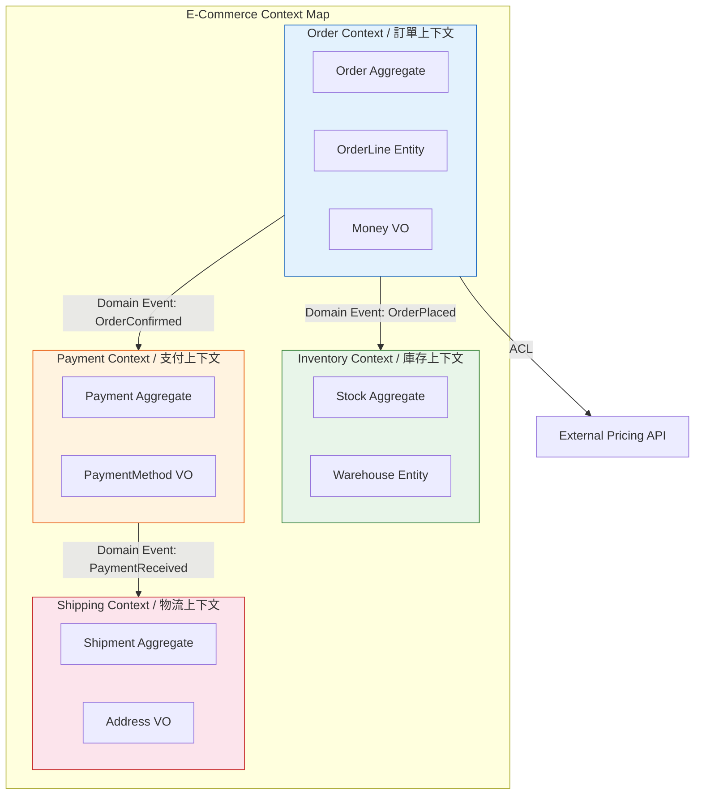
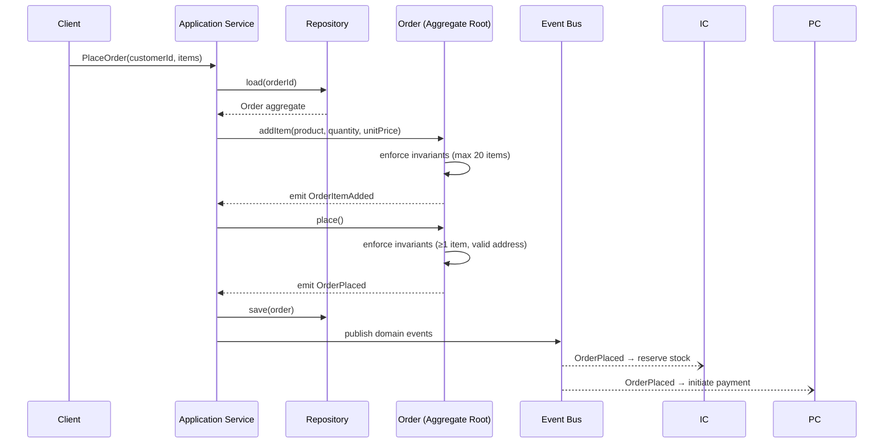

# DDD Basics / 領域驅動設計基礎

## Intent / 意圖

領域驅動設計（Domain-Driven Design, DDD）的核心意圖是讓軟體模型與業務領域保持高度一致。透過與領域專家密切協作，建立一套共通的語言（Ubiquitous Language），使程式碼本身成為業務知識的精確表達。當業務邏輯分散在 controller、service、ORM mapping 各層時，軟體模型與業務現實漸行漸遠；DDD 將業務規則集中於領域模型，讓模型成為 single source of truth。

## Problem / 問題情境

以電商訂單系統為例，常見的反模式：

- **貧血領域模型（Anemic Domain Model）**：`Order` 只是一組 getter/setter 的資料容器，所有業務邏輯散落在 `OrderService`、`OrderController`、`OrderValidator` 中。修改一條業務規則需要橫跨三個檔案。
- **業務規則散落**：「訂單金額超過 10,000 元需主管審核」這條規則可能出現在 API middleware、service layer、甚至前端——三處不一致時造成線上 bug。
- **語言斷裂**：業務人員說「核准訂單」，工程師寫 `updateOrderStatus(id, 3)`。數字 3 代表什麼？六個月後沒人記得。
- **模組邊界模糊**：訂單、庫存、支付邏輯交織在同一個 service 中，改動庫存邏輯意外破壞訂單流程。

## Core Concepts / 核心概念

| 英文術語 | 中文翻譯 | 說明 |
|----------|----------|------|
| **Ubiquitous Language** | 通用語言 | 開發團隊與領域專家共用的術語，直接反映在程式碼命名中 |
| **Bounded Context** | 限界上下文 | 一個模型有效的邊界。同一個詞在不同 context 中有不同意義 |
| **Aggregate** | 聚合 | 一組被視為資料變更單位的相關物件，對外透過 Aggregate Root 操作 |
| **Aggregate Root** | 聚合根 | 聚合的入口實體，外部只能透過它存取聚合內的物件，負責維護不變量 |
| **Entity** | 實體 | 具有唯一識別（identity）的物件，不同 ID 即為不同實體 |
| **Value Object** | 值物件 | 無唯一識別、以屬性值定義相等性的不可變物件（如 Money、Address） |
| **Domain Event** | 領域事件 | 描述領域中已發生的事實，命名用過去式：`OrderPlaced`、`PaymentReceived` |
| **Domain Service** | 領域服務 | 不歸屬於任何 Entity/VO 的領域邏輯（如跨聚合的價格計算） |
| **Application Service** | 應用服務 | 協調領域物件完成用例，不含業務邏輯，負責交易邊界 |
| **Anti-Corruption Layer** | 防腐層 | 在自身 Context 與外部系統之間建立翻譯層，避免外部模型污染內部 |
| **Context Mapping** | 上下文映射 | 描述多個 Bounded Context 之間關係與整合策略的全域視圖 |

## Architecture / 架構



每個 Bounded Context 擁有獨立的領域模型與資料儲存。Context 之間透過 Domain Events 或 ACL 整合，避免直接耦合。

## How It Works / 運作原理



1. **Event Storming**：與領域專家列出所有領域事件，從事件回推命令與聚合。
2. **語言邊界辨識**：同一個詞在不同團隊有不同含義時，就是 Context 的邊界。
3. **定義聚合**：找出必須在同一筆交易中保持一致的物件群組。聚合越小越好。
4. **強制不變量**：聚合根在每次狀態變更前驗證業務規則，拒絕違規操作。

## Rust 實作

訂單聚合（Order Aggregate），含 Money/Address 值物件、領域事件、不變量強制。

```rust
use chrono::{DateTime, Utc};
use std::fmt;
use uuid::Uuid;

// --- Value Objects ---
#[derive(Debug, Clone, PartialEq, Eq)]
struct Money { amount_cents: i64, currency: Currency }
#[derive(Debug, Clone, Copy, PartialEq, Eq)]
enum Currency { TWD, USD }

impl Money {
    fn new(amount_cents: i64, currency: Currency) -> Result<Self, DomainError> {
        if amount_cents < 0 { return Err(DomainError::InvalidMoney("negative".into())); }
        Ok(Self { amount_cents, currency })
    }
    fn zero(currency: Currency) -> Self { Self { amount_cents: 0, currency } }
    fn add(&self, other: &Money) -> Result<Self, DomainError> {
        if self.currency != other.currency { return Err(DomainError::CurrencyMismatch); }
        Ok(Self { amount_cents: self.amount_cents + other.amount_cents, currency: self.currency })
    }
    fn multiply(&self, qty: u32) -> Self {
        Self { amount_cents: self.amount_cents * qty as i64, currency: self.currency }
    }
}
impl fmt::Display for Money {
    fn fmt(&self, f: &mut fmt::Formatter<'_>) -> fmt::Result {
        write!(f, "{:.2} {:?}", self.amount_cents as f64 / 100.0, self.currency)
    }
}

#[derive(Debug, Clone, PartialEq, Eq)]
struct Address { city: String, district: String, street: String, postal_code: String }
impl Address {
    fn new(city: &str, district: &str, street: &str, postal_code: &str) -> Result<Self, DomainError> {
        if city.is_empty() || street.is_empty() || postal_code.is_empty() {
            return Err(DomainError::InvalidAddress("city/street/postal_code required".into()));
        }
        Ok(Self { city: city.into(), district: district.into(), street: street.into(), postal_code: postal_code.into() })
    }
}

// --- Domain Errors & Events ---
#[derive(Debug, Clone)]
enum DomainError {
    InvalidMoney(String), InvalidAddress(String),
    CurrencyMismatch, OrderInvariantViolation(String),
}
impl fmt::Display for DomainError {
    fn fmt(&self, f: &mut fmt::Formatter<'_>) -> fmt::Result { write!(f, "{self:?}") }
}
impl std::error::Error for DomainError {}

#[derive(Debug, Clone)]
enum OrderEvent {
    OrderCreated { order_id: Uuid, customer_id: Uuid, created_at: DateTime<Utc> },
    OrderItemAdded { order_id: Uuid, product_name: String, quantity: u32, line_total: Money },
    ShippingAddressSet { order_id: Uuid, address: Address },
    OrderPlaced { order_id: Uuid, total: Money, placed_at: DateTime<Utc> },
}

// --- Entity: OrderLine ---
#[derive(Debug, Clone)]
struct OrderLine { id: Uuid, product_name: String, unit_price: Money, quantity: u32 }
impl OrderLine {
    fn line_total(&self) -> Money { self.unit_price.multiply(self.quantity) }
}

// --- Aggregate Root: Order ---
#[derive(Debug, Clone, Copy, PartialEq, Eq)]
enum OrderStatus { Draft, Placed, Confirmed, Cancelled }
const MAX_ORDER_ITEMS: usize = 20;
const MIN_ORDER_CENTS: i64 = 100;

#[derive(Debug)]
struct Order {
    id: Uuid, customer_id: Uuid, status: OrderStatus,
    lines: Vec<OrderLine>, shipping_address: Option<Address>,
    currency: Currency, created_at: DateTime<Utc>, domain_events: Vec<OrderEvent>,
}

impl Order {
    fn create(customer_id: Uuid, currency: Currency) -> Self {
        let id = Uuid::new_v4();
        let now = Utc::now();
        let mut order = Self {
            id, customer_id, status: OrderStatus::Draft, lines: Vec::new(),
            shipping_address: None, currency, created_at: now, domain_events: Vec::new(),
        };
        order.domain_events.push(OrderEvent::OrderCreated { order_id: id, customer_id, created_at: now });
        order
    }
    fn add_item(&mut self, product_name: &str, unit_price: Money, quantity: u32) -> Result<(), DomainError> {
        if self.status != OrderStatus::Draft {
            return Err(DomainError::OrderInvariantViolation("only draft orders".into()));
        }
        if self.lines.len() >= MAX_ORDER_ITEMS {
            return Err(DomainError::OrderInvariantViolation(format!("max {MAX_ORDER_ITEMS} items")));
        }
        if unit_price.currency != self.currency { return Err(DomainError::CurrencyMismatch); }
        let line = OrderLine { id: Uuid::new_v4(), product_name: product_name.into(), unit_price: unit_price.clone(), quantity };
        self.domain_events.push(OrderEvent::OrderItemAdded {
            order_id: self.id, product_name: product_name.into(), quantity, line_total: line.line_total(),
        });
        self.lines.push(line);
        Ok(())
    }
    fn set_shipping_address(&mut self, address: Address) -> Result<(), DomainError> {
        if self.status != OrderStatus::Draft {
            return Err(DomainError::OrderInvariantViolation("only draft orders".into()));
        }
        self.domain_events.push(OrderEvent::ShippingAddressSet { order_id: self.id, address: address.clone() });
        self.shipping_address = Some(address);
        Ok(())
    }
    fn total(&self) -> Result<Money, DomainError> {
        self.lines.iter().try_fold(Money::zero(self.currency), |sum, l| sum.add(&l.line_total()))
    }
    fn place(&mut self) -> Result<(), DomainError> {
        if self.status != OrderStatus::Draft {
            return Err(DomainError::OrderInvariantViolation("only draft orders".into()));
        }
        if self.lines.is_empty() {
            return Err(DomainError::OrderInvariantViolation("at least one item".into()));
        }
        if self.shipping_address.is_none() {
            return Err(DomainError::OrderInvariantViolation("shipping address required".into()));
        }
        let total = self.total()?;
        if total.amount_cents < MIN_ORDER_CENTS {
            return Err(DomainError::OrderInvariantViolation(format!("min {MIN_ORDER_CENTS} cents")));
        }
        self.status = OrderStatus::Placed;
        self.domain_events.push(OrderEvent::OrderPlaced { order_id: self.id, total, placed_at: Utc::now() });
        Ok(())
    }
    fn drain_events(&mut self) -> Vec<OrderEvent> { std::mem::take(&mut self.domain_events) }
}

fn main() {
    let mut order = Order::create(Uuid::new_v4(), Currency::TWD);
    order.add_item("Mechanical Keyboard", Money::new(35000, Currency::TWD).unwrap(), 1).unwrap();
    order.set_shipping_address(Address::new("Taipei", "Da-an", "Dunhua S. Rd.", "106").unwrap()).unwrap();
    order.place().unwrap();
    for event in order.drain_events() { println!("{event:?}"); }
}
// Output:
// OrderCreated { order_id: ..., customer_id: ..., created_at: ... }
// OrderItemAdded { order_id: ..., product_name: "Mechanical Keyboard", quantity: 1, line_total: Money { amount_cents: 35000, currency: TWD } }
// ShippingAddressSet { order_id: ..., address: Address { city: "Taipei", ... } }
// OrderPlaced { order_id: ..., total: Money { amount_cents: 35000, currency: TWD }, placed_at: ... }
```

## Go 實作

同等的訂單聚合，Go 1.24+ 風格，不匯出欄位保護不變量。

```go
package main

import (
	"errors"
	"fmt"
	"time"
	"github.com/google/uuid"
)

// --- Value Objects ---
type Currency string
const (CurrencyTWD Currency = "TWD"; CurrencyUSD Currency = "USD")

type Money struct{ amountCents int64; currency Currency }
func NewMoney(cents int64, c Currency) (Money, error) {
	if cents < 0 { return Money{}, errors.New("negative amount") }
	return Money{amountCents: cents, currency: c}, nil
}
func ZeroMoney(c Currency) Money { return Money{currency: c} }
func (m Money) Add(o Money) (Money, error) {
	if m.currency != o.currency { return Money{}, errors.New("currency mismatch") }
	return Money{amountCents: m.amountCents + o.amountCents, currency: m.currency}, nil
}
func (m Money) Multiply(qty uint32) Money {
	return Money{amountCents: m.amountCents * int64(qty), currency: m.currency}
}
func (m Money) String() string { return fmt.Sprintf("%.2f %s", float64(m.amountCents)/100, m.currency) }

type Address struct{ city, district, street, postalCode string }
func NewAddress(city, district, street, postalCode string) (Address, error) {
	if city == "" || street == "" || postalCode == "" {
		return Address{}, errors.New("city/street/postalCode required")
	}
	return Address{city, district, street, postalCode}, nil
}

// --- Domain Events ---
type OrderEvent interface{ EventName() string }
type OrderCreatedEvent struct{ OrderID, CustomerID uuid.UUID; CreatedAt time.Time }
func (e OrderCreatedEvent) EventName() string { return "OrderCreated" }
type OrderItemAddedEvent struct{ OrderID uuid.UUID; ProductName string; Quantity uint32; LineTotal Money }
func (e OrderItemAddedEvent) EventName() string { return "OrderItemAdded" }
type ShippingAddressSetEvent struct{ OrderID uuid.UUID; Address Address }
func (e ShippingAddressSetEvent) EventName() string { return "ShippingAddressSet" }
type OrderPlacedEvent struct{ OrderID uuid.UUID; Total Money; PlacedAt time.Time }
func (e OrderPlacedEvent) EventName() string { return "OrderPlaced" }

// --- Entity: OrderLine ---
type OrderLine struct{ id uuid.UUID; productName string; unitPrice Money; quantity uint32 }
func (l OrderLine) LineTotal() Money { return l.unitPrice.Multiply(l.quantity) }

// --- Aggregate Root: Order ---
type OrderStatus int
const (OrderStatusDraft OrderStatus = iota; OrderStatusPlaced; OrderStatusConfirmed; OrderStatusCancelled)
const (maxOrderItems = 20; minOrderAmountCents int64 = 100)

type Order struct {
	id uuid.UUID; customerID uuid.UUID; status OrderStatus
	lines []OrderLine; shippingAddress *Address
	currency Currency; createdAt time.Time; domainEvents []OrderEvent
}

func CreateOrder(customerID uuid.UUID, currency Currency) *Order {
	id := uuid.New(); now := time.Now().UTC()
	o := &Order{id: id, customerID: customerID, status: OrderStatusDraft, currency: currency, createdAt: now}
	o.domainEvents = append(o.domainEvents, OrderCreatedEvent{OrderID: id, CustomerID: customerID, CreatedAt: now})
	return o
}
func (o *Order) AddItem(productName string, unitPrice Money, qty uint32) error {
	if o.status != OrderStatusDraft { return errors.New("only draft orders") }
	if len(o.lines) >= maxOrderItems { return fmt.Errorf("max %d items", maxOrderItems) }
	if unitPrice.currency != o.currency { return errors.New("currency mismatch") }
	line := OrderLine{id: uuid.New(), productName: productName, unitPrice: unitPrice, quantity: qty}
	o.domainEvents = append(o.domainEvents, OrderItemAddedEvent{
		OrderID: o.id, ProductName: productName, Quantity: qty, LineTotal: line.LineTotal(),
	})
	o.lines = append(o.lines, line)
	return nil
}
func (o *Order) SetShippingAddress(addr Address) error {
	if o.status != OrderStatusDraft { return errors.New("only draft orders") }
	o.domainEvents = append(o.domainEvents, ShippingAddressSetEvent{OrderID: o.id, Address: addr})
	o.shippingAddress = &addr
	return nil
}
func (o *Order) Total() (Money, error) {
	sum := ZeroMoney(o.currency)
	for _, l := range o.lines {
		var err error
		if sum, err = sum.Add(l.LineTotal()); err != nil { return Money{}, err }
	}
	return sum, nil
}
func (o *Order) Place() error {
	if o.status != OrderStatusDraft { return errors.New("only draft orders") }
	if len(o.lines) == 0 { return errors.New("at least one item") }
	if o.shippingAddress == nil { return errors.New("shipping address required") }
	total, err := o.Total()
	if err != nil { return err }
	if total.amountCents < minOrderAmountCents { return fmt.Errorf("min %d cents", minOrderAmountCents) }
	o.status = OrderStatusPlaced
	o.domainEvents = append(o.domainEvents, OrderPlacedEvent{OrderID: o.id, Total: total, PlacedAt: time.Now().UTC()})
	return nil
}
func (o *Order) DrainEvents() []OrderEvent {
	events := o.domainEvents; o.domainEvents = nil; return events
}

func main() {
	order := CreateOrder(uuid.New(), CurrencyTWD)
	price, _ := NewMoney(35000, CurrencyTWD)
	_ = order.AddItem("Mechanical Keyboard", price, 1)
	addr, _ := NewAddress("Taipei", "Da-an", "Dunhua S. Rd.", "106")
	_ = order.SetShippingAddress(addr)
	_ = order.Place()
	for _, evt := range order.DrainEvents() { fmt.Printf("%s: %+v\n", evt.EventName(), evt) }
}
// Output:
// OrderCreated: {OrderID:... CustomerID:... CreatedAt:...}
// OrderItemAdded: {OrderID:... ProductName:Mechanical Keyboard Quantity:1 LineTotal:{amountCents:35000 currency:TWD}}
// ShippingAddressSet: {OrderID:... Address:{city:Taipei district:Da-an street:Dunhua S. Rd. postalCode:106}}
// OrderPlaced: {OrderID:... Total:{amountCents:35000 currency:TWD} PlacedAt:...}
```

## Rust vs Go 對照表

| 面向 | Rust | Go |
|------|------|-----|
| **Value Object 不可變性** | 欄位預設不可變，`Clone` 產生新實例，編譯器保證建立後無法修改 | 需不匯出欄位 + getter，同 package 內仍可繞過 |
| **Domain Error 型別安全** | `enum DomainError` + `Result<T,E>` 強制處理，exhaustive match 保證不遺漏 | `error` interface 單一型別，需 `errors.Is/As` 判斷，易遺漏 |
| **Domain Event 多型** | `enum OrderEvent` 封閉多型，新增 variant 未處理的 match 編譯失敗 | `interface` 開放多型，新增 event struct 不強制消費端更新 |
| **聚合封裝** | `pub/pub(crate)` 精細可見性，外部 crate 無法修改聚合欄位 | 不匯出欄位 + 匯出方法慣例，同 package 內可繞過 |
| **序列化** | `serde` derive macro，tagged enum 天然對應 `{"type":"..."}` | struct tag + 手動 marshal/unmarshal 多型事件 |

## When to Use / 適用場景

- **複雜業務邏輯**：保險理賠、銀行帳務、供應鏈管理——業務規則繁多且頻繁變動，集中管理比散落各處更可維護。
- **多團隊協作**：不同團隊負責不同 Bounded Context，Context Map 提供清晰的團隊邊界與整合契約。
- **業務語言需被保留**：金融合規、醫療系統等法規要求程式碼能被非技術人員審閱，Ubiquitous Language 確保程式碼即文件。
- **長期演化系統**：預期存活 5 年以上的系統，DDD 的模組化設計讓個別 Context 可獨立重寫或替換。

## When NOT to Use / 不適用場景

- **簡單 CRUD 應用**：後台管理系統、設定面板——業務規則極少，DDD 的抽象層反而增加不必要的間接性。
- **原型驗證階段**：產品方向尚未確定，花大量時間建模可能全部推翻。先簡單架構驗證市場。
- **資料密集型管道**：ETL、報表系統的核心是資料轉換而非業務不變量，DDD 沒有對應優勢。
- **團隊缺乏領域知識**：沒有領域專家參與的 DDD 只會產出工程師想像的模型，比 anemic model 更危險。

## Real-World Examples / 真實世界案例

### Vaughn Vernon 的 SaaSOvation 範例

*Implementing Domain-Driven Design* 以 SaaS 平台為貫穿範例，包含三個 Bounded Context：

1. **Identity & Access**：`Tenant` 是聚合根，`User` 不能脫離 Tenant 存在。管理角色與權限。
2. **Collaboration**：透過 ACL 將 Identity Context 的 User 翻譯為本地的 `Collaborator` 值物件。
3. **Agile PM**：`BacklogItem` 是聚合根，包含 `Estimation` 值物件，透過事件與 Identity Context 整合。

### 電商系統 Bounded Context 劃分

| Bounded Context | Aggregate Root | 關鍵 Value Object | 整合方式 |
|-----------------|---------------|-------------------|---------|
| **Catalog** | Product | ProductDescription, Price | Upstream: 提供商品資訊 |
| **Order** | Order | Money, Address | 發布 OrderPlaced 給 Inventory/Payment |
| **Inventory** | Stock | WarehouseLocation | 訂閱 OrderPlaced 扣減庫存 |
| **Payment** | Payment | PaymentMethod | 訂閱 OrderConfirmed 進行扣款 |
| **Shipping** | Shipment | Address, TrackingNumber | 訂閱 PaymentReceived 安排出貨 |

`Address` 在 Order Context 和 Shipping Context 中有不同屬性（訂單只需城市+街道，物流需倉庫座標），這正是 Bounded Context 存在的理由。

## Interview Questions / 面試常見問題

**Q1: Entity 和 Value Object 的差異？如何決定用哪一個？**

Entity 有唯一識別，即使屬性完全相同，不同 ID 代表不同實體。Value Object 無 identity，以屬性值定義相等性。判斷：業務上需追蹤「哪一個」是 Entity；只關心「值是什麼」是 Value Object。VO 應不可變。

**Q2: Aggregate 的邊界應該怎麼劃？太大或太小會怎樣？**

聚合邊界包含必須在同一筆交易中維護一致性的物件。太大：高並發 optimistic lock 碰撞、載入資料量過大。太小：跨聚合一致性需 saga，增加複雜度。經驗法則：先設計小聚合，需要時才擴大。Vernon 建議 "Design Small Aggregates"。

**Q3: Bounded Context 之間如何通訊？**

三種模式：(1) Domain Events + Message Broker——最解耦；(2) ACL + REST/gRPC——同步但翻譯外部模型；(3) Shared Kernel——共用小部分模型，僅適用緊密協作團隊。Context Map 定義上下游關係（Customer-Supplier、Conformist 等）。

**Q4: Domain Service 和 Application Service 有什麼不同？**

Domain Service 封裝不歸屬 Entity/VO 的**領域邏輯**（如跨聚合定價），使用 Ubiquitous Language 命名。Application Service 是**用例協調者**——載入聚合、呼叫領域方法、管理交易——但不含業務規則。如果這段邏輯消失了業務專家會在意，那是 Domain Service。

**Q5: 如何在遺留系統中逐步導入 DDD？**

(1) **Strangler Fig Pattern** 逐步建構新功能，舊系統透過 ACL 整合；(2) 優先在最複雜的模組引入 DDD；(3) 先 Event Storming 釐清語言和邊界再寫程式碼；(4) 不要一次重寫，每個 Sprint 遷移一個子領域。

## Pitfalls / 常見陷阱

### 1. 過度工程（Over-Engineering）

所有模組都套用完整 DDD 戰術模式。正確做法：**Core Domain** 套用完整 DDD，**Supporting/Generic Subdomain** 用簡單模式即可。

### 2. 聚合邊界劃分錯誤

把 `Order` 和所有 `Product` 放進同一個聚合，修改 Product 觸發 Order version 碰撞。正確做法：Order 只持有 `ProductSnapshot` 值物件（下單時快照），與 Product 聚合解耦。

### 3. 忽略 Ubiquitous Language

工程師使用 `UserDTO`、`processEntity()` 而非業務語言。應堅持領域專家認可的術語：`placeOrder()`、`approveRefund()`。

### 4. 把 Repository 當 DAO 使用

Repository 應回傳完整 Aggregate Root，隱藏持久化細節。若提供 `findByNameAndStatusAndDateRange()` 本質是 DAO。讀取需求應透過 CQRS 查詢側處理。

### 5. 跨聚合交易

一筆 DB 交易同時修改多個聚合違反交易邊界原則。正確做法：一筆交易只修改一個聚合，跨聚合一致性透過 Domain Events + Saga 達成最終一致。

## References / 參考資料

- Eric Evans, *Domain-Driven Design: Tackling Complexity in the Heart of Software* (2003) — 藍皮書，DDD 奠基之作
- Vaughn Vernon, *Implementing Domain-Driven Design* (2013) — 紅皮書，以 SaaSOvation 為例的實作指南
- Vaughn Vernon, *Domain-Driven Design Distilled* (2016) — DDD 精華濃縮版
- Martin Fowler, "AnemicDomainModel": https://martinfowler.com/bliki/AnemicDomainModel.html
- Alberto Brandolini, *Introducing EventStorming* — Event Storming 工作坊方法論

## Cross-references / 交叉引用

- [[09_cqrs_event_sourcing|CQRS & Event Sourcing]] — DDD Aggregate 天然適合作為 CQRS 寫入端的一致性邊界；Domain Events 是 Event Sourcing 的事件來源
- [[../../design_pattern/modern/27_repository|Repository Pattern]] — Repository 是 DDD 中 Aggregate 的持久化抽象，負責載入與儲存完整的聚合根
