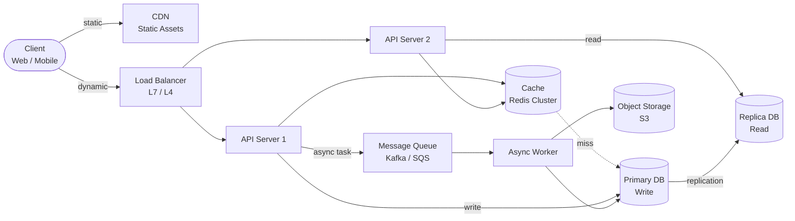
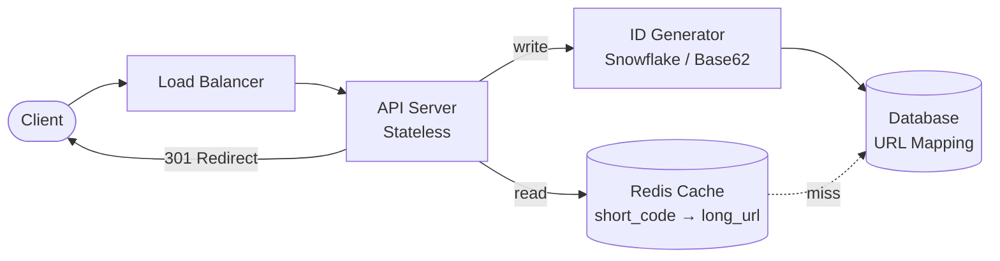
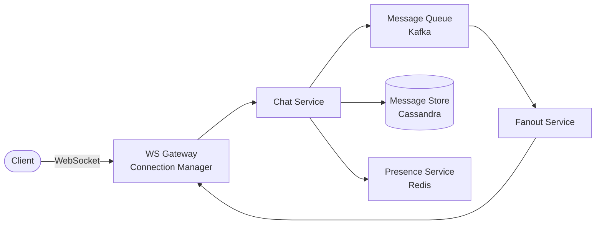
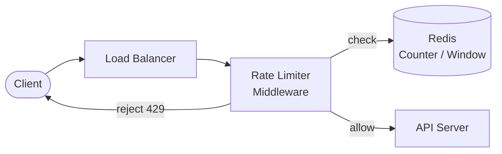

# System Design Interview Framework / 系統設計面試框架

## Intent / 意圖

建立一套結構化、可重複使用的系統設計面試框架，讓候選人在 40 分鐘內以清晰的步驟完成需求釐清、高階設計、深入探討與權衡取捨。本篇提供適用於所有系統設計題目的通用方法論，搭配信封背面估算（back-of-envelope estimation）工具實作。

## Problem / 問題情境

系統設計面試中最常見的失敗模式：

- **缺乏結構**：直接開始畫架構圖，沒有先釐清需求，設計方向偏離面試官期待
- **忽略非功能需求**：只聚焦 API 與資料模型，忽略延遲、吞吐量、可用性
- **沒有量化估算**：宣稱「用 Redis」卻無法說明需要多少記憶體、QPS 是否能承受
- **缺乏權衡討論**：只提一種方案，面試官在意的是思考過程而非「正確答案」
- **時間分配失當**：細節花太多時間，來不及討論擴展性與容錯

## Core Concepts / 核心概念

### The 4-Step Framework / 四步驟框架

系統設計面試的核心方法論，每一步都有明確目標與產出：

| Step | 名稱 | 時間 | 目標 | 產出 |
|------|------|------|------|------|
| 1 | Requirements / 需求釐清 | 5 min | 定義範圍與約束 | 功能需求清單 + 非功能需求 |
| 2 | High-Level Design / 高階設計 | 15 min | 建立元件架構 | 架構圖 + API 設計 + 資料模型 |
| 3 | Deep Dive / 深入探討 | 15 min | 解決核心難題 | 細部設計 + 估算數據 |
| 4 | Trade-offs & Wrap-up / 權衡總結 | 5 min | 展現工程判斷力 | 替代方案比較 + 瓶頸分析 |

### Functional vs Non-Functional Requirements / 功能需求 vs 非功能需求

**功能需求（Functional Requirements）**：系統必須做什麼。

- 使用者可以發送訊息
- 系統產生短網址並重導至原始 URL
- 使用者可以上傳並分享檔案

**非功能需求（Non-Functional Requirements）**：系統必須達到什麼品質。

- **Availability（可用性）**：99.99% uptime = 每年停機 < 52.6 分鐘
- **Latency（延遲）**：p99 < 200ms
- **Throughput（吞吐量）**：峰值 50,000 QPS
- **Consistency（一致性）**：Strong vs Eventual，取決於業務場景
- **Durability（持久性）**：資料絕對不能丟失（金融場景）

### Back-of-Envelope Estimation / 信封背面估算

在面試中快速估算系統容量的關鍵技能。常用基準數據：

| 指標 | 數值 | 備註 |
|------|------|------|
| DAU → QPS | DAU x 操作次數 / 86,400 | 平均每秒請求數 |
| Peak QPS | Avg QPS x 2~5 | 依業務特性調整倍率 |
| 單筆資料大小 | 依結構估算 | JSON ~500B, 圖片 ~200KB |
| 儲存量/年 | QPS x 86,400 x 365 x 單筆大小 | 年度總儲存需求 |
| 頻寬 | QPS x 單筆大小 | 每秒傳輸量 |
| 快取大小 | 依 80/20 法則估算 | 快取 20% 熱資料 |

### Capacity Planning / 容量規劃

核心公式鏈：

```text
DAU → actions/user/day → total daily → avg QPS (÷86400) → peak QPS (×factor)
  → storage/day (writes × payload) → annual (×365) → bandwidth (peak read × payload)
  → cache (daily read × hot_ratio, 通常 20%)
```

### Bottleneck Identification / 瓶頸識別

系統設計中常見的瓶頸點：

1. **Database I/O**：讀寫比例失衡、缺乏索引、大量 join
2. **Network Bandwidth**：大檔案傳輸、未壓縮的回應
3. **Single Point of Failure**：單一 DB master、單一 LB
4. **Hot Partition**：名人效應導致特定分片過載
5. **Thundering Herd**：快取失效後大量請求同時湧入資料庫

## Architecture / 架構

通用模板 — 所有面試題從此出發，依需求增減元件：



**元件職責**：

| 元件 | 職責 | 關鍵字 |
|------|------|--------|
| CDN | 靜態資源分發 | Latency, Edge |
| Load Balancer | 流量分配、健康檢查 | Availability |
| API Server | 業務邏輯（無狀態） | Horizontal Scaling |
| Cache | 熱資料快取 | Read-heavy |
| Primary DB | 寫入路徑 | Consistency |
| Replica DB | 讀取擴展 | Eventual Consistency |
| Message Queue | 非同步、削峰填谷 | Decoupling |
| Object Storage | 大檔案儲存 | Durability |

## How It Works / 運作原理

### Step 1: Requirements Clarification（5 分鐘）

**目標**：定義系統邊界，避免設計偏差。

**必問問題清單**：

1. **使用者規模？** — DAU / MAU → 推導 QPS
2. **核心功能？** — 列出 3-5 個，排優先順序
3. **讀寫比例？** — 決定快取策略與 DB 架構
4. **延遲要求？** — p50 / p99 → 是否需要快取層
5. **一致性要求？** — Strong / Eventual → DB 選型
6. **可用性目標？** — 幾個 9 → 冗餘設計
7. **資料規模與保留期限？** — 儲存估算與歸檔

**產出範例**（URL Shortener）：

```text
Functional: 長 URL → 短 URL / 短 URL → 301 重導 / 可選：自訂短碼、過期、統計
Non-Functional: DAU 10M, 讀寫比 100:1, Write ~1,160 QPS, Read ~116K QPS
               p99 < 100ms, Availability 99.99%, 保留 5 年
```

### Step 2: High-Level Design（15 分鐘）

**目標**：畫出核心元件與資料流。

**步驟**：(1) 定義 API 端點（REST / gRPC）→ (2) 設計資料模型（table、欄位、索引）→ (3) 畫架構圖（Client → DB）→ (4) 標示讀寫資料流方向

```text
POST /api/v1/urls  { "long_url": "https://...", "ttl_days": 30 }
                 → { "short_url": "https://sho.rt/abc123" }
GET /:short_code → 301 Redirect to long_url
```

### Step 3: Deep Dive（15 分鐘）

**目標**：針對 1-2 個核心挑戰深入設計。

面試官通常會指定深入方向。常見主題：資料分片策略（Hash vs Range）、快取策略（Cache-aside / Write-through / Write-behind）、唯一 ID 生成（Snowflake / Base62）、訊息順序保證（Partition key）、容錯機制（Circuit breaker / Retry）。

**此階段必須包含數字**：QPS、儲存量、快取大小、需要幾台機器、頻寬需求。

### Step 4: Trade-offs & Wrap-up（5 分鐘）

**目標**：展現工程判斷力與全局觀。

**討論項目**：替代方案比較（SQL vs NoSQL、Push vs Pull）、瓶頸分析（什麼先出問題？）、擴展路徑（1x → 10x → 100x）、監控告警（QPS / Latency / Error Rate）、未來改進優先順序。

## Rust 實作

信封背面估算工具 — 輸入 DAU 與業務參數，自動計算 QPS、儲存量、頻寬與快取需求。

```rust
use std::fmt;

struct CapacityInput {
    dau: u64,                      // 日活躍用戶
    actions_per_user_per_day: u64, // 每用戶每日操作次數
    read_write_ratio: f64,         // 讀寫比（讀:寫，如 100.0 = 100:1）
    avg_payload_bytes: u64,        // 平均每筆請求大小（bytes）
    peak_factor: f64,              // 峰值倍率（通常 2.0~5.0）
    hot_data_ratio: f64,           // 熱資料比例（通常 0.2）
    retention_years: u64,          // 資料保留年數
}

struct CapacityEstimate {
    total_daily_requests: u64, avg_write_qps: f64, avg_read_qps: f64,
    peak_write_qps: f64, peak_read_qps: f64, daily_storage_gb: f64,
    annual_storage_tb: f64, total_storage_tb: f64,
    peak_bandwidth_mbps: f64, cache_size_gb: f64,
}

impl CapacityInput {
    fn estimate(&self) -> CapacityEstimate {
        let total_daily = self.dau * self.actions_per_user_per_day;
        let avg_qps = total_daily as f64 / 86_400.0;
        let wf = 1.0 / (1.0 + self.read_write_ratio); // write fraction
        let rf = self.read_write_ratio / (1.0 + self.read_write_ratio); // read fraction

        let (avg_w, avg_r) = (avg_qps * wf, avg_qps * rf);
        let (peak_w, peak_r) = (avg_w * self.peak_factor, avg_r * self.peak_factor);

        let daily_bytes = total_daily as f64 * self.avg_payload_bytes as f64 * wf;
        let daily_gb = daily_bytes / 1e9;
        let annual_tb = daily_gb * 365.0 / 1_000.0;

        CapacityEstimate {
            total_daily_requests: total_daily,
            avg_write_qps: avg_w, avg_read_qps: avg_r,
            peak_write_qps: peak_w, peak_read_qps: peak_r,
            daily_storage_gb: daily_gb,
            annual_storage_tb: annual_tb,
            total_storage_tb: annual_tb * self.retention_years as f64,
            peak_bandwidth_mbps: peak_r * self.avg_payload_bytes as f64 * 8.0 / 1e6,
            cache_size_gb: total_daily as f64 * self.avg_payload_bytes as f64
                * rf * self.hot_data_ratio / 1e9,
        }
    }
}

impl fmt::Display for CapacityEstimate {
    fn fmt(&self, f: &mut fmt::Formatter<'_>) -> fmt::Result {
        writeln!(f, "=== Capacity Estimation ===")?;
        writeln!(f, "Daily requests:  {}", self.total_daily_requests)?;
        writeln!(f, "Write QPS:       {:.1} avg / {:.1} peak", self.avg_write_qps, self.peak_write_qps)?;
        writeln!(f, "Read QPS:        {:.1} avg / {:.1} peak", self.avg_read_qps, self.peak_read_qps)?;
        writeln!(f, "Storage:         {:.2} GB/day, {:.2} TB/yr, {:.2} TB total",
                 self.daily_storage_gb, self.annual_storage_tb, self.total_storage_tb)?;
        writeln!(f, "Bandwidth:       {:.2} Mbps peak", self.peak_bandwidth_mbps)?;
        writeln!(f, "Cache (hot):     {:.2} GB", self.cache_size_gb)
    }
}

fn main() {
    let url_shortener = CapacityInput {
        dau: 10_000_000, actions_per_user_per_day: 10,
        read_write_ratio: 100.0, avg_payload_bytes: 500,
        peak_factor: 3.0, hot_data_ratio: 0.2, retention_years: 5,
    };
    println!("{}", url_shortener.estimate());

    let chat_system = CapacityInput {
        dau: 50_000_000, actions_per_user_per_day: 40,
        read_write_ratio: 5.0, avg_payload_bytes: 200,
        peak_factor: 5.0, hot_data_ratio: 0.15, retention_years: 3,
    };
    println!("{}", chat_system.estimate());
}
```

## Go 實作

同一個信封背面估算工具的 Go 版本。

```go
package main

import "fmt"

type CapacityInput struct {
	DAU                  uint64  // 日活躍用戶
	ActionsPerUserPerDay uint64  // 每用戶每日操作次數
	ReadWriteRatio       float64 // 讀寫比（讀:寫，如 100.0 = 100:1）
	AvgPayloadBytes      uint64  // 平均每筆請求大小（bytes）
	PeakFactor           float64 // 峰值倍率（通常 2.0~5.0）
	HotDataRatio         float64 // 熱資料比例（通常 0.2）
	RetentionYears       uint64  // 資料保留年數
}

type CapacityEstimate struct {
	TotalDailyRequests                          uint64
	AvgWriteQPS, AvgReadQPS                     float64
	PeakWriteQPS, PeakReadQPS                   float64
	DailyStorageGB, AnnualStorageTB, TotalStorageTB float64
	PeakBandwidthMbps, CacheSizeGB              float64
}

func (in *CapacityInput) Estimate() CapacityEstimate {
	total := in.DAU * in.ActionsPerUserPerDay
	avgQPS := float64(total) / 86400.0
	wf := 1.0 / (1.0 + in.ReadWriteRatio)                // write fraction
	rf := in.ReadWriteRatio / (1.0 + in.ReadWriteRatio)   // read fraction

	avgW, avgR := avgQPS*wf, avgQPS*rf
	peakW, peakR := avgW*in.PeakFactor, avgR*in.PeakFactor

	dailyBytes := float64(total) * float64(in.AvgPayloadBytes) * wf
	dailyGB := dailyBytes / 1e9
	annualTB := dailyGB * 365.0 / 1000.0

	return CapacityEstimate{
		TotalDailyRequests: total,
		AvgWriteQPS: avgW, AvgReadQPS: avgR,
		PeakWriteQPS: peakW, PeakReadQPS: peakR,
		DailyStorageGB: dailyGB, AnnualStorageTB: annualTB,
		TotalStorageTB:    annualTB * float64(in.RetentionYears),
		PeakBandwidthMbps: peakR * float64(in.AvgPayloadBytes) * 8.0 / 1e6,
		CacheSizeGB: float64(total) * float64(in.AvgPayloadBytes) * rf * in.HotDataRatio / 1e9,
	}
}

func (e CapacityEstimate) String() string {
	return fmt.Sprintf(
		"=== Capacity Estimation ===\n"+
			"Daily requests:  %d\n"+
			"Write QPS:       %.1f avg / %.1f peak\n"+
			"Read QPS:        %.1f avg / %.1f peak\n"+
			"Storage:         %.2f GB/day, %.2f TB/yr, %.2f TB total\n"+
			"Bandwidth:       %.2f Mbps peak\n"+
			"Cache (hot):     %.2f GB",
		e.TotalDailyRequests,
		e.AvgWriteQPS, e.PeakWriteQPS, e.AvgReadQPS, e.PeakReadQPS,
		e.DailyStorageGB, e.AnnualStorageTB, e.TotalStorageTB,
		e.PeakBandwidthMbps, e.CacheSizeGB)
}

func main() {
	url := CapacityInput{
		DAU: 10_000_000, ActionsPerUserPerDay: 10,
		ReadWriteRatio: 100.0, AvgPayloadBytes: 500,
		PeakFactor: 3.0, HotDataRatio: 0.2, RetentionYears: 5,
	}
	fmt.Println(url.Estimate())

	chat := CapacityInput{
		DAU: 50_000_000, ActionsPerUserPerDay: 40,
		ReadWriteRatio: 5.0, AvgPayloadBytes: 200,
		PeakFactor: 5.0, HotDataRatio: 0.15, RetentionYears: 3,
	}
	fmt.Println(chat.Estimate())
}
```

## Rust vs Go 對照表

| 面向 | Rust | Go |
|------|------|-----|
| **適合展示** | 記憶體安全、零成本抽象、型別系統精確度 | 並發模型、簡潔語法、快速原型 |
| **面試白板速度** | 較慢 — 借用檢查器與生命週期增加程式碼量 | 較快 — 語法簡潔，goroutine 一行搞定 |
| **Capacity 工具實作** | `struct` + `impl fmt::Display` | `struct` + `Stringer` interface |
| **並發表達** | `tokio::spawn` + `Arc<Mutex<T>>` | `go func()` + `chan` |
| **錯誤處理** | `Result<T, E>` + `?` 運算子 | `(value, error)` 多回傳值 |
| **適合的系統設計場景** | 高效能基礎設施（DB engine、proxy） | 微服務、API gateway、DevOps 工具 |
| **面試官印象** | 展現底層理解與效能意識 | 展現工程實用性與生產力 |
| **建議面試策略** | 適合應徵基礎設施 / 效能敏感職位 | 適合應徵後端 / 分散式系統職位 |

## When to Use / 適用場景

- **Senior / Staff 面試**（L5+）：幾乎都有系統設計環節
- **架構審查 / RFC / Design Doc**：四步驟框架可直接複用
- **容量規劃會議**：估算工具產生基準數據
- **跨團隊溝通**：結構化方式解釋架構決策

## When NOT to Use / 不適用場景

- **純演算法面試**：LeetCode 風格不需要架構圖
- **極小型系統**：單機內部工具、CLI 不需要分散式思維
- **已有明確規格**：需求與設計已定義，直接實作
- **過度設計陷阱**：日流量 100 人不需要 Kafka + Redis + Sharding

## Real-World Examples / 真實世界案例

### Case 1: URL Shortener / 短網址服務



**關鍵決策**：Base62 encoding 7 字元 = 62^7 = 3.5 兆組合 / 讀寫分離（100:1）讀走 Redis、寫走 DB / TTL + 定期清理 / 301 永久重導 vs 302 暫時重導（可追蹤點擊）

### Case 2: Chat System / 即時聊天系統



**關鍵設計決策**：

- **協議**：WebSocket 雙向長連線（非 HTTP long polling）
- **儲存**：Cassandra — 寫入密集 + 時間序列查詢（partition key = chat_id）
- **扇出**：小群組 push（fanout-on-write），大頻道 pull（fanout-on-read）
- **在線狀態**：Redis heartbeat + TTL 過期自動標記離線
- **訊息順序**：同一 chat room → 同一 Kafka partition

### Case 3: Rate Limiter / 限流器



**關鍵設計決策**：

- **演算法**：Token Bucket（平滑突發）vs Sliding Window（精確）vs Leaky Bucket（固定速率）
- **分散式限流**：所有實例共享 Redis 計數器，Redis Lua script 保證原子性
- **粒度**：per-user / per-IP / per-API-key 依業務組合
- **降級**：Redis 不可用時 fallback 到本地限流（非完全放行）

## Interview Questions / 面試常見問題

以下是關於系統設計方法論本身的 meta 問題（非特定系統設計題）：

**Q1: 你如何決定需要多少台機器？**
先算 peak QPS，再除以單台承載能力。例如：peak QPS = 100,000，單台約處理 10,000 QPS，需 10 台。加上冗餘（N+2 或 50% buffer）部署 15 台。需同時考慮 CPU、記憶體、網路三個維度，取瓶頸維度計算。

**Q2: 如何在 SQL 和 NoSQL 之間做選擇？**
四個維度：(1) 複雜關聯 → SQL。(2) 寫入量極大 → NoSQL。(3) 需要 ACID → SQL。(4) Schema 頻繁變動 → Document DB。實務上兩者常共存：操作日誌用 NoSQL，核心實體用 SQL。

**Q3: Cache-aside 和 Write-through 該怎麼選？**
Cache-aside 適合讀多寫少（應用程式負責快取邏輯）。Write-through 適合需要強一致快取（寫入時同步更新）。Write-behind 適合寫入密集但有資料遺失風險。建議先用 Cache-aside 說明，再主動提替代方案。

**Q4: 你設計系統時如何考慮失敗場景？**
(1) 辨識單點故障加入冗餘。(2) 外部依賴加 circuit breaker + timeout。(3) 非同步操作確保冪等性。(4) Dead letter queue 處理持續失敗。(5) 預先定義 SLA 與 graceful degradation。

## Pitfalls / 常見陷阱

### 1. Jumping to Solution / 直接跳到解答

拿到「設計 Twitter」後立刻畫 DB schema。沒有釐清範圍，設計了完整社群平台，而面試官只想考 fanout。**解法**：前 5 分鐘只問問題、不畫圖。開場白：「在我開始設計之前，我想先確認幾個假設...」

### 2. Ignoring Non-Functional Requirements / 忽略非功能需求

整場面試只討論 API 和資料模型，從未提及延遲、可用性或擴展性。面試官會認為候選人缺乏生產環境經驗。**解法**：Step 1 結束時明確列出至少 3 個非功能需求，後續設計中持續回應。

### 3. No Trade-off Discussion / 沒有權衡討論

只提出一種方案，被問「為什麼選 X？」時無法說出替代方案。系統設計面試的核心就是權衡取捨。**解法**：每個重要決策至少準備兩個選項，使用「我選 A 而非 B，因為在此場景下...」句型。

### 4. Overcomplicating the Design / 過度設計

一開始就畫 20 個微服務、3 層快取、多區域部署。面試官質疑你無法分辨必要性，且複雜設計留下更多攻擊面。**解法**：從最簡可行架構出發，先用 monolith + 單 DB 解決問題，再說明如何演進。

### 5. Forgetting About Data / 忽略資料面

畫了漂亮的微服務架構卻沒提及資料如何儲存、分片、備份。計算層無狀態易擴展，但資料層擴展才是真正挑戰。**解法**：為每個資料儲存元件標註：(1) 引擎選型，(2) 分片策略，(3) 備份機制。

## References / 參考資料

- **Alex Xu, *System Design Interview* (Vol. 1 & 2)** — 最廣泛使用的面試準備書，15+ 經典題目完整解法
- **Martin Kleppmann, *Designing Data-Intensive Applications (DDIA)*** — 分散式系統理論根基
- **Educative, *Grokking the System Design Interview*** — 線上互動課程，快速建立框架
- **Google SRE Book** — 生產環境可用性、延遲與容量規劃實務
- **Cloudflare Blog** — 真實世界系統設計案例（CDN、DNS、DDoS）
- **InfoQ / High Scalability** — 科技公司架構演進（Twitter、Netflix、Uber）

## Cross-references / 交叉引用

本篇整合本系列前幾章的核心概念：

| 章節 | 與本篇的關聯 |
|------|-------------|
| [[01_scalability_fundamentals]] | Step 3 — 水平擴展、分片、無狀態設計 |
| [[02_availability_and_fault_tolerance]] | Step 1 — 非功能需求中的可用性目標 |
| [[03_consistency_trade_offs]] | Step 4 — CAP/PACELC 權衡分析 |
| [[04_api_design_rest]] | Step 2 — API 定義與端點設計 |
| [[05_api_design_grpc_graphql]] | API 選型替代方案討論 |
| [[06_api_versioning]] | API 演進策略與版本控制 |
| [[07_microservices_vs_monolith]] | Step 4 — 架構風格權衡 |
| [[08_event_driven_architecture]] | 非同步處理與訊息佇列設計 |
| [[09_cqrs_event_sourcing]] | 讀寫分離與事件溯源深入討論 |
