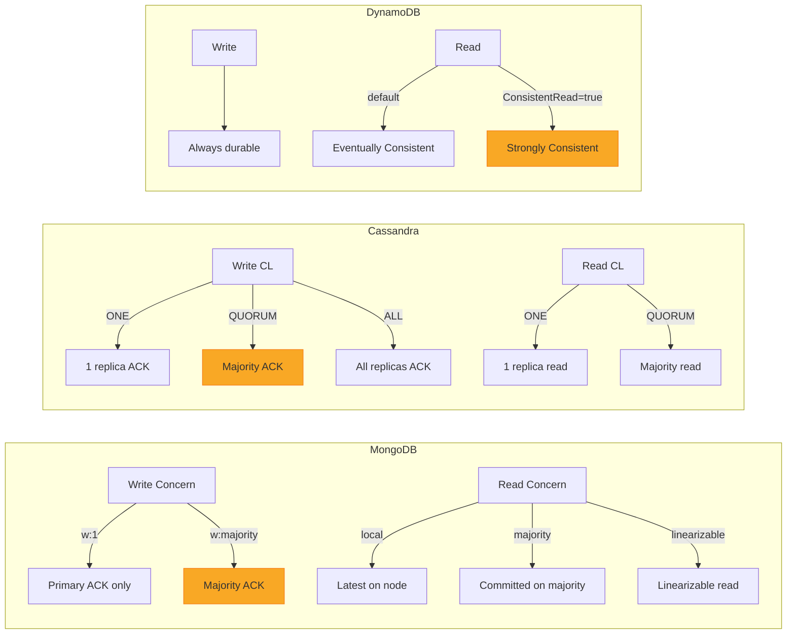

# NoSQL Selection Guide / NoSQL 選型指南

## Intent / 意圖

在資料儲存技術多元化的時代，選擇正確的 NoSQL 資料庫是架構決策中影響最深遠的環節之一。本篇系統性地比較四大 NoSQL 類別——文件儲存（Document Store）、寬列儲存（Wide-Column Store）、鍵值儲存（Key-Value Store）與圖資料庫（Graph Database）——的資料模型、一致性模型、分區策略與適用場景，並提供 SQL vs NoSQL vs NewSQL 的決策框架，幫助工程師在真實業務場景中做出理性的選型判斷。

核心問題：**面對特定的存取模式（access pattern）與規模需求，應該選擇哪種資料庫類型，以及如何設計資料模型才能發揮其最大優勢？**

---

## Problem / 問題情境

**場景：電商平台從單體 PostgreSQL 遷移到微服務架構，面臨多種資料存取模式的選型難題。**

1. **商品目錄服務**：每個商品有數十個屬性，不同品類的屬性結構完全不同（手機有「螢幕尺寸」，衣服有「材質」），用關聯式模型需要大量 JOIN 與 EAV（Entity-Attribute-Value）反模式，查詢效能低落。
2. **使用者行為追蹤服務**：每天產生上億筆點擊、瀏覽、加入購物車等事件。PostgreSQL 的 B-Tree 索引無法有效處理高寫入時序資料，單表膨脹到數十 TB 後查詢超時。
3. **Session 與購物車服務**：需要毫秒級回應、高併發讀寫。關聯式模型的 ACID 交易在此場景是不必要的負擔。
4. **社交推薦服務**：「買了這個商品的人也買了...」需要多跳關聯查詢（multi-hop traversal），SQL 的遞迴 CTE 在三層以上關聯時效能急劇下降。

團隊一度嘗試全部用 MongoDB 解決，結果在行為追蹤場景因 WiredTiger 引擎的文件級鎖（document-level lock）造成寫入瓶頸，在推薦場景因缺乏原生圖遍歷能力而被迫在應用層做多次查詢。

**教訓：沒有萬能的資料庫，每種 NoSQL 都有其甜蜜點（sweet spot），錯誤的選型會導致架構重寫。**

---

## Core Concepts / 核心概念

### Document Store / 文件儲存

以 JSON/BSON 格式的文件（document）為基本儲存單元。每個文件可以有不同的結構（schema-flexible），支援巢狀物件與陣列。典型代表：**MongoDB**、CouchDB。

核心特性：
- 半結構化資料，同一 collection 中文件可以有不同欄位
- 支援二級索引（secondary index），查詢彈性高
- 內建 Aggregation Pipeline 做複雜資料轉換
- 適合讀寫模式多樣且資料結構會演變的場景

### Wide-Column Store / 寬列儲存

資料以列族（column family）組織，同一 row key 下可動態新增任意數量的欄位。底層是按 row key 排序的 SSTable。典型代表：**Apache Cassandra**、**ScyllaDB**、HBase。

核心特性：
- 分散式、去中心化（Cassandra 無 master 節點）
- 寫入極快（append-only LSM-Tree）
- 查詢必須沿著 partition key 走，不支援任意欄位查詢
- 適合高寫入、時序資料、寬表場景

### Key-Value Store / 鍵值儲存

最簡單的資料模型：一個 key 對應一個 value（通常是不透明的 blob）。查詢只支援 key lookup。典型代表：**Redis**（記憶體）、**Amazon DynamoDB**（持久化）、etcd。

核心特性：
- 極低延遲（Redis 常在 sub-millisecond）
- 資料結構受限，不支援複雜查詢（DynamoDB 例外，支援 sort key 範圍查詢）
- 適合快取、Session、計數器、設定儲存

### Graph Database / 圖資料庫

以節點（node）、邊（edge）、屬性（property）為基本元素。原生支援圖遍歷（graph traversal），在多跳關聯查詢上效能遠優於 SQL JOIN。典型代表：**Neo4j**、Amazon Neptune、JanusGraph。

核心特性：
- 關係（relationship）是一等公民，與節點同等重要
- Cypher 或 Gremlin 查詢語言，語意直觀
- 適合社交網路、推薦引擎、知識圖譜、詐欺偵測
- 水平擴展能力相對較弱（Neo4j 社群版為單機）

### Denormalization / 反正規化

RDBMS 追求第三正規化（3NF）消除冗餘；NoSQL 則擁抱冗餘以換取讀取效能。在 NoSQL 中，資料模型應由**存取模式（access pattern）驅動**，而非由實體關係驅動。常見策略包括：

- **Embedding（嵌入）**：將相關資料內嵌在同一文件中，一次讀取即完整
- **Referencing（引用）**：保留 ID 引用，需要額外查詢但避免資料膨脹
- **Duplication（複製）**：在多個地方存放相同資料，犧牲寫入一致性換取讀取效率

### Tunable Consistency / 可調一致性

Cassandra 的核心特色。每次讀寫操作都可以指定一致性等級（consistency level），在 ONE、QUORUM、ALL 等選項間取捨延遲與一致性強度。公式：若 `W + R > N`（N = replication factor），則保證強一致性讀取。

### Single-Table Design / 單表設計

DynamoDB 的資料建模哲學。將多種實體（entity）放在同一張表中，透過精心設計的 partition key + sort key 組合，用單次查詢滿足所有存取模式。減少跨表查詢（DynamoDB 不支援 JOIN），是 DynamoDB 最佳效能的關鍵。

---

## Architecture / 架構

### NoSQL 四大類型資料模型比較

```mermaid
graph TB
    subgraph "Document Store (MongoDB)"
        D1["Collection: orders"]
        D2["{ _id: 'ord-1',<br/>  user: 'alice',<br/>  items: [<br/>    { sku: 'A1', qty: 2 },<br/>    { sku: 'B3', qty: 1 }<br/>  ],<br/>  total: 150.00<br/>}"]
        D1 --> D2
    end

    subgraph "Wide-Column Store (Cassandra)"
        W1["Table: user_events"]
        W2["PK: user_id=alice | date=2026-02-17"]
        W3["CK: ts=09:01 → {event: click, page: /home}<br/>CK: ts=09:05 → {event: view, page: /item/42}<br/>CK: ts=09:12 → {event: cart, sku: A1}"]
        W1 --> W2 --> W3
    end

    subgraph "Key-Value Store (Redis / DynamoDB)"
        K1["Key: session:tok-abc"]
        K2["Value: {user_id: alice, cart: [...]}"]
        K1 --> K2
    end

    subgraph "Graph Database (Neo4j)"
        G1((Alice)) -->|PURCHASED| G2((Item A))
        G1 -->|FRIENDS_WITH| G3((Bob))
        G3 -->|PURCHASED| G2
        G3 -->|PURCHASED| G4((Item B))
    end

    style D1 fill:#4caf50,stroke:#2e7d32,color:#fff
    style W1 fill:#ff9800,stroke:#e65100,color:#fff
    style K1 fill:#2196f3,stroke:#0d47a1,color:#fff
    style G1 fill:#9c27b0,stroke:#6a1b9a,color:#fff
```



### Consistency Model 比較架構



---

## How It Works / 運作原理

### Document Store (MongoDB) 的讀寫路徑

**寫入流程：**

1. Client 發送寫入請求至 MongoDB Router（`mongos`，在分片叢集中）或直接連接 Replica Set Primary。
2. Primary 將操作寫入 **oplog**（operation log），一個 capped collection。
3. WiredTiger 引擎在記憶體中更新 B-Tree 索引與文件資料，定期 checkpoint 刷入磁碟。
4. 根據 `writeConcern` 設定，等待指定數量的 Secondary 確認複製後才回傳成功。
5. Secondary 持續拉取（tail）Primary 的 oplog 並重放操作。

**讀取流程：**

1. 根據 `readPreference` 決定從 Primary 或 Secondary 讀取。
2. 根據 `readConcern` 決定讀取保證等級（`local` 可能讀到未被多數確認的資料；`majority` 保證已持久化）。
3. Query Planner 根據已建立的索引選擇最佳執行計畫。

**Aggregation Pipeline：**

MongoDB 的聚合管道是一系列轉換階段的序列，每個階段將前一階段的輸出作為輸入。常用階段：

- `$match`：過濾文件（等同 WHERE）
- `$group`：分組聚合（等同 GROUP BY）
- `$lookup`：左外連接（等同 LEFT JOIN）
- `$unwind`：展開陣列為多個文件
- `$project`：選擇/轉換欄位（等同 SELECT）
- `$sort`、`$limit`、`$skip`：排序與分頁

### Wide-Column Store (Cassandra) 的讀寫路徑

**寫入流程：**

1. Client 發送請求至任一節點（coordinator）。
2. Coordinator 根據 partition key 的 hash 決定資料歸屬的節點（由 consistent hashing 的 token ring 決定）。
3. 資料先寫入 **CommitLog**（WAL），再寫入 **Memtable**（記憶體排序結構）。
4. Memtable 滿後 flush 為磁碟上的 **SSTable**（Sorted String Table），不可變。
5. 根據 consistency level，coordinator 等待指定數量的 replica 確認後回傳。

**讀取流程：**

1. Coordinator 向足夠數量的 replica 發送讀取請求。
2. 每個 replica 依序檢查 Memtable → Bloom Filter → SSTable 以定位資料。
3. 若 Bloom Filter 指示 SSTable 可能包含目標 key，則讀取 SSTable 並合併多個版本。
4. Coordinator 比較多個 replica 的回覆，選擇時間戳記最新的版本回傳給 Client。
5. 若發現不一致，觸發 **Read Repair** 修復落後的 replica。

**Partition Key 設計原則：**

- **均勻分佈**：避免 hot partition。例如用 `user_id` 而非 `country` 作為 partition key。
- **查詢友善**：所有查詢都必須包含完整的 partition key。
- **適當的分區大小**：每個 partition 建議不超過 100MB / 100,000 rows。
- **Clustering Key 排序**：partition 內的資料依 clustering key 排序，適合範圍查詢（如時間區間）。

### Key-Value Store (DynamoDB) 的單表設計

**DynamoDB 的核心概念：**

1. **Partition Key (PK)**：決定資料在哪個實體分區。
2. **Sort Key (SK)**：在同一 partition 內排序，支援範圍查詢。
3. **GSI (Global Secondary Index)**：投影（project）不同的 PK/SK 組合，支援替代存取模式。
4. **LSI (Local Secondary Index)**：相同 PK，不同 SK，必須在建表時建立。

**單表設計步驟：**

1. 列出所有實體（Entity）：User、Order、OrderItem、Product。
2. 列出所有存取模式（Access Pattern）：
   - 依 user_id 查使用者
   - 依 user_id 查所有訂單
   - 依 order_id 查訂單詳情（含所有品項）
   - 依 product_id 查商品
3. 設計 PK / SK 模式：

| Entity | PK | SK | Attributes |
|--------|----|----|------------|
| User | `USER#alice` | `PROFILE` | name, email, ... |
| Order | `USER#alice` | `ORDER#2026-02-17#ord-1` | status, total, ... |
| OrderItem | `ORDER#ord-1` | `ITEM#sku-A1` | qty, price, ... |
| Product | `PROD#sku-A1` | `DETAIL` | name, category, ... |

4. 這樣 `PK = USER#alice` + `SK begins_with ORDER#` 一次查詢即可拿到 Alice 所有訂單。
5. `PK = ORDER#ord-1` + `SK begins_with ITEM#` 一次查詢即可拿到訂單所有品項。

**DynamoDB 一致性模型：**

- **Eventually Consistent Read（預設）**：從任一副本讀取，延遲最低，RCU 消耗 0.5（每 4KB）。
- **Strongly Consistent Read**：從 leader 副本讀取，保證最新，RCU 消耗 1.0（每 4KB）。
- **Transactional Read/Write**：支援跨 item 的 ACID 交易，RCU/WCU 消耗加倍。

### Cassandra vs ScyllaDB

ScyllaDB 是 Cassandra 的 C++ 重寫版本，使用 Seastar 框架的 share-nothing 架構：

- **每核心一個分片（shard-per-core）**：避免 JVM 的 GC pause 與執行緒競爭
- **相容 CQL 協議**：可直接替換 Cassandra，不需改應用程式碼
- **P99 延遲**：通常比 Cassandra 低 5-10 倍（JVM GC 停頓 vs 無 GC）
- **自動調優**：不需手動調 JVM heap、GC 參數

---

## Rust 實作

以下範例分兩部分：(1) 使用 `mongodb` crate 進行 CRUD 與聚合操作，(2) 使用 `aws-sdk-dynamodb` 進行 DynamoDB 單表設計的讀寫操作。

```rust
// nosql_demo.rs
// MongoDB CRUD + Aggregation & DynamoDB Single-Table Design
// Cargo.toml:
//   mongodb = "3"
//   aws-sdk-dynamodb = "1"
//   aws-config = "1"
//   tokio = { version = "1", features = ["full"] }
//   serde = { version = "1", features = ["derive"] }
//   serde_json = "1"
//   futures = "0.3"

use futures::TryStreamExt;
use mongodb::{
    bson::{doc, Document},
    options::ClientOptions,
    Client as MongoClient, Collection,
};
use serde::{Deserialize, Serialize};

// ===== MongoDB 部分 =====

#[derive(Debug, Serialize, Deserialize)]
struct Product {
    #[serde(rename = "_id", skip_serializing_if = "Option::is_none")]
    id: Option<mongodb::bson::oid::ObjectId>,
    sku: String,
    name: String,
    category: String,
    price: f64,
    tags: Vec<String>,
    specs: ProductSpecs,
}

#[derive(Debug, Serialize, Deserialize)]
struct ProductSpecs {
    weight_kg: f64,
    #[serde(skip_serializing_if = "Option::is_none")]
    screen_size: Option<String>,
    #[serde(skip_serializing_if = "Option::is_none")]
    material: Option<String>,
}

/// 統計結果：每個品類的平均價格
#[derive(Debug, Deserialize)]
struct CategoryStats {
    #[serde(rename = "_id")]
    category: String,
    avg_price: f64,
    count: i64,
    top_tags: Vec<String>,
}

/// MongoDB CRUD + Aggregation 範例
async fn mongodb_demo() -> Result<(), Box<dyn std::error::Error>> {
    // 連線設定
    let mut opts = ClientOptions::parse("mongodb://localhost:27017").await?;
    opts.app_name = Some("nosql-demo".to_string());

    let client = MongoClient::with_options(opts)?;
    let db = client.database("demo");
    let products: Collection<Product> = db.collection("products");

    // 清除舊資料
    products.drop().await?;

    // ---- CREATE：插入多筆商品 ----
    let items = vec![
        Product {
            id: None,
            sku: "PHONE-001".into(),
            name: "Galaxy S26".into(),
            category: "electronics".into(),
            price: 999.99,
            tags: vec!["5g".into(), "flagship".into()],
            specs: ProductSpecs {
                weight_kg: 0.187,
                screen_size: Some("6.2 inch".into()),
                material: None,
            },
        },
        Product {
            id: None,
            sku: "PHONE-002".into(),
            name: "Pixel 11".into(),
            category: "electronics".into(),
            price: 799.00,
            tags: vec!["5g".into(), "ai-camera".into()],
            specs: ProductSpecs {
                weight_kg: 0.197,
                screen_size: Some("6.4 inch".into()),
                material: None,
            },
        },
        Product {
            id: None,
            sku: "SHIRT-001".into(),
            name: "Organic Cotton Tee".into(),
            category: "clothing".into(),
            price: 35.00,
            tags: vec!["organic".into(), "casual".into()],
            specs: ProductSpecs {
                weight_kg: 0.25,
                screen_size: None,
                material: Some("100% organic cotton".into()),
            },
        },
        Product {
            id: None,
            sku: "SHIRT-002".into(),
            name: "Merino Wool Sweater".into(),
            category: "clothing".into(),
            price: 120.00,
            tags: vec!["wool".into(), "winter".into()],
            specs: ProductSpecs {
                weight_kg: 0.4,
                screen_size: None,
                material: Some("merino wool blend".into()),
            },
        },
    ];

    let insert_result = products.insert_many(items).await?;
    println!(
        "[MongoDB] Inserted {} products",
        insert_result.inserted_ids.len()
    );

    // ---- READ：依品類查詢 ----
    let filter = doc! { "category": "electronics" };
    let mut cursor = products.find(filter).await?;

    println!("\n[MongoDB] Electronics products:");
    while let Some(product) = cursor.try_next().await? {
        println!(
            "  {} - {} (${:.2})",
            product.sku, product.name, product.price
        );
    }

    // ---- UPDATE：更新價格 ----
    let update_result = products
        .update_one(
            doc! { "sku": "PHONE-001" },
            doc! { "$set": { "price": 899.99 }, "$push": { "tags": "sale" } },
        )
        .await?;
    println!(
        "\n[MongoDB] Updated {} product(s) (Galaxy S26 price -> $899.99)",
        update_result.modified_count
    );

    // ---- AGGREGATION PIPELINE：每品類統計 ----
    // 等同 SQL:
    //   SELECT category, AVG(price), COUNT(*), ARRAY_AGG(DISTINCT tag)
    //   FROM products, UNNEST(tags) AS tag
    //   GROUP BY category
    let pipeline = vec![
        doc! { "$unwind": "$tags" },
        doc! {
            "$group": {
                "_id": "$category",
                "avg_price": { "$avg": "$price" },
                "count": { "$sum": 1 },
                "top_tags": { "$addToSet": "$tags" }
            }
        },
        doc! { "$sort": { "avg_price": -1 } },
    ];

    let agg_collection: Collection<Document> = db.collection("products");
    let mut agg_cursor = agg_collection.aggregate(pipeline).await?;

    println!("\n[MongoDB] Category statistics (via Aggregation Pipeline):");
    while let Some(result) = agg_cursor.try_next().await? {
        let stats: CategoryStats = mongodb::bson::from_document(result)?;
        println!(
            "  Category: {} | Avg Price: ${:.2} | Count: {} | Tags: {:?}",
            stats.category, stats.avg_price, stats.count, stats.top_tags
        );
    }

    // ---- DELETE：刪除指定商品 ----
    let del_result = products
        .delete_one(doc! { "sku": "SHIRT-002" })
        .await?;
    println!(
        "\n[MongoDB] Deleted {} product(s) (SHIRT-002)",
        del_result.deleted_count
    );

    Ok(())
}

// ===== DynamoDB 部分 =====

use aws_sdk_dynamodb::{
    types::{AttributeValue, KeyType, ScalarAttributeType},
    Client as DynamoClient,
};

/// DynamoDB 單表設計範例
async fn dynamodb_demo() -> Result<(), Box<dyn std::error::Error>> {
    // 使用本地 DynamoDB Local 或設定 AWS credentials
    let config = aws_config::defaults(aws_config::BehaviorVersion::latest())
        .endpoint_url("http://localhost:8000") // DynamoDB Local
        .load()
        .await;
    let client = DynamoClient::new(&config);
    let table_name = "SingleTableDemo";

    // ---- 建立表（若不存在）----
    let tables = client.list_tables().send().await?;
    if !tables
        .table_names()
        .iter()
        .any(|t| t == table_name)
    {
        client
            .create_table()
            .table_name(table_name)
            .key_schema(
                aws_sdk_dynamodb::types::KeySchemaElement::builder()
                    .attribute_name("PK")
                    .key_type(KeyType::Hash)
                    .build()?,
            )
            .key_schema(
                aws_sdk_dynamodb::types::KeySchemaElement::builder()
                    .attribute_name("SK")
                    .key_type(KeyType::Range)
                    .build()?,
            )
            .attribute_definitions(
                aws_sdk_dynamodb::types::AttributeDefinition::builder()
                    .attribute_name("PK")
                    .attribute_type(ScalarAttributeType::S)
                    .build()?,
            )
            .attribute_definitions(
                aws_sdk_dynamodb::types::AttributeDefinition::builder()
                    .attribute_name("SK")
                    .attribute_type(ScalarAttributeType::S)
                    .build()?,
            )
            .billing_mode(aws_sdk_dynamodb::types::BillingMode::PayPerRequest)
            .send()
            .await?;
        println!("[DynamoDB] Created table: {}", table_name);
    }

    // ---- PUT：寫入 User + Order (Single-Table Design) ----
    // User entity
    client
        .put_item()
        .table_name(table_name)
        .item("PK", AttributeValue::S("USER#alice".into()))
        .item("SK", AttributeValue::S("PROFILE".into()))
        .item("name", AttributeValue::S("Alice Chen".into()))
        .item("email", AttributeValue::S("alice@example.com".into()))
        .item("entity_type", AttributeValue::S("User".into()))
        .send()
        .await?;

    // Order entity（放在 User 的 partition 下，方便查詢）
    client
        .put_item()
        .table_name(table_name)
        .item("PK", AttributeValue::S("USER#alice".into()))
        .item(
            "SK",
            AttributeValue::S("ORDER#2026-02-17#ord-001".into()),
        )
        .item("status", AttributeValue::S("shipped".into()))
        .item("total", AttributeValue::N("249.99".into()))
        .item("entity_type", AttributeValue::S("Order".into()))
        .send()
        .await?;

    client
        .put_item()
        .table_name(table_name)
        .item("PK", AttributeValue::S("USER#alice".into()))
        .item(
            "SK",
            AttributeValue::S("ORDER#2026-02-15#ord-002".into()),
        )
        .item("status", AttributeValue::S("delivered".into()))
        .item("total", AttributeValue::N("89.50".into()))
        .item("entity_type", AttributeValue::S("Order".into()))
        .send()
        .await?;

    println!("[DynamoDB] Wrote User + 2 Orders for alice");

    // ---- QUERY：查詢 Alice 的所有訂單 ----
    // PK = USER#alice, SK begins_with ORDER#
    let query_result = client
        .query()
        .table_name(table_name)
        .key_condition_expression("PK = :pk AND begins_with(SK, :sk_prefix)")
        .expression_attribute_values(":pk", AttributeValue::S("USER#alice".into()))
        .expression_attribute_values(":sk_prefix", AttributeValue::S("ORDER#".into()))
        .consistent_read(true) // 強一致性讀取
        .send()
        .await?;

    println!("\n[DynamoDB] Alice's orders (strongly consistent read):");
    if let Some(items) = query_result.items {
        for item in &items {
            let sk = item.get("SK").and_then(|v| v.as_s().ok()).unwrap_or(&"?".to_string());
            let status = item
                .get("status")
                .and_then(|v| v.as_s().ok())
                .unwrap_or(&"?".to_string());
            let total = item
                .get("total")
                .and_then(|v| v.as_n().ok())
                .unwrap_or(&"0".to_string());
            println!("  {} | status={} | total=${}", sk, status, total);
        }
        println!("  Total orders: {}", items.len());
    }

    // ---- GET ITEM：取得 Alice 的 profile（強一致性）----
    let get_result = client
        .get_item()
        .table_name(table_name)
        .key("PK", AttributeValue::S("USER#alice".into()))
        .key("SK", AttributeValue::S("PROFILE".into()))
        .consistent_read(true)
        .send()
        .await?;

    if let Some(item) = get_result.item {
        let name = item
            .get("name")
            .and_then(|v| v.as_s().ok())
            .unwrap_or(&"?".to_string());
        let email = item
            .get("email")
            .and_then(|v| v.as_s().ok())
            .unwrap_or(&"?".to_string());
        println!(
            "\n[DynamoDB] Alice's profile: name={}, email={}",
            name, email
        );
    }

    Ok(())
}

#[tokio::main]
async fn main() {
    println!("========== MongoDB Demo ==========\n");
    if let Err(e) = mongodb_demo().await {
        eprintln!("MongoDB demo error: {}", e);
    }

    println!("\n========== DynamoDB Demo ==========\n");
    if let Err(e) = dynamodb_demo().await {
        eprintln!("DynamoDB demo error: {}", e);
    }
}

// Output:
// ========== MongoDB Demo ==========
//
// [MongoDB] Inserted 4 products
//
// [MongoDB] Electronics products:
//   PHONE-001 - Galaxy S26 ($999.99)
//   PHONE-002 - Pixel 11 ($799.00)
//
// [MongoDB] Updated 1 product(s) (Galaxy S26 price -> $899.99)
//
// [MongoDB] Category statistics (via Aggregation Pipeline):
//   Category: electronics | Avg Price: $849.50 | Count: 4 | Tags: ["5g", "flagship", "ai-camera", "sale"]
//   Category: clothing | Avg Price: $77.50 | Count: 4 | Tags: ["organic", "casual", "wool", "winter"]
//
// [MongoDB] Deleted 1 product(s) (SHIRT-002)
//
// ========== DynamoDB Demo ==========
//
// [DynamoDB] Created table: SingleTableDemo
// [DynamoDB] Wrote User + 2 Orders for alice
//
// [DynamoDB] Alice's orders (strongly consistent read):
//   ORDER#2026-02-15#ord-002 | status=delivered | total=$89.50
//   ORDER#2026-02-17#ord-001 | status=shipped | total=$249.99
//   Total orders: 2
//
// [DynamoDB] Alice's profile: name=Alice Chen, email=alice@example.com
```

---

## Go 實作

以 Go 1.24+ 實作相同的 MongoDB CRUD + Aggregation 與 DynamoDB 單表設計操作。

```go
// nosql_demo.go
// MongoDB CRUD + Aggregation & DynamoDB Single-Table Design
// go.mod requires:
//   go.mongodb.org/mongo-driver/v2 v2.1.0
//   github.com/aws/aws-sdk-go-v2 v1.34.0
//   github.com/aws/aws-sdk-go-v2/config v1.29.0
//   github.com/aws/aws-sdk-go-v2/service/dynamodb v1.39.0

package main

import (
	"context"
	"fmt"
	"log"
	"time"

	// MongoDB
	"go.mongodb.org/mongo-driver/v2/bson"
	"go.mongodb.org/mongo-driver/v2/mongo"
	"go.mongodb.org/mongo-driver/v2/mongo/options"

	// DynamoDB
	awsconfig "github.com/aws/aws-sdk-go-v2/config"
	"github.com/aws/aws-sdk-go-v2/service/dynamodb"
	"github.com/aws/aws-sdk-go-v2/service/dynamodb/types"

	"github.com/aws/aws-sdk-go-v2/aws"
)

// ===== MongoDB 部分 =====

type ProductSpecs struct {
	WeightKg   float64 `bson:"weight_kg"   json:"weight_kg"`
	ScreenSize *string `bson:"screen_size,omitempty" json:"screen_size,omitempty"`
	Material   *string `bson:"material,omitempty"    json:"material,omitempty"`
}

type Product struct {
	ID       bson.ObjectID `bson:"_id,omitempty" json:"id"`
	SKU      string        `bson:"sku"      json:"sku"`
	Name     string        `bson:"name"     json:"name"`
	Category string        `bson:"category" json:"category"`
	Price    float64       `bson:"price"    json:"price"`
	Tags     []string      `bson:"tags"     json:"tags"`
	Specs    ProductSpecs  `bson:"specs"    json:"specs"`
}

type CategoryStats struct {
	Category string   `bson:"_id"`
	AvgPrice float64  `bson:"avg_price"`
	Count    int64    `bson:"count"`
	TopTags  []string `bson:"top_tags"`
}

func mongoDBDemo(ctx context.Context) error {
	// 連線設定
	client, err := mongo.Connect(options.Client().
		ApplyURI("mongodb://localhost:27017").
		SetAppName("nosql-demo"))
	if err != nil {
		return fmt.Errorf("mongo connect: %w", err)
	}
	defer client.Disconnect(ctx)

	db := client.Database("demo")
	products := db.Collection("products")

	// 清除舊資料
	_ = products.Drop(ctx)

	// ---- CREATE：插入多筆商品 ----
	screenSize62 := "6.2 inch"
	screenSize64 := "6.4 inch"
	materialCotton := "100% organic cotton"
	materialWool := "merino wool blend"

	items := []interface{}{
		Product{
			SKU: "PHONE-001", Name: "Galaxy S26", Category: "electronics",
			Price: 999.99, Tags: []string{"5g", "flagship"},
			Specs: ProductSpecs{WeightKg: 0.187, ScreenSize: &screenSize62},
		},
		Product{
			SKU: "PHONE-002", Name: "Pixel 11", Category: "electronics",
			Price: 799.00, Tags: []string{"5g", "ai-camera"},
			Specs: ProductSpecs{WeightKg: 0.197, ScreenSize: &screenSize64},
		},
		Product{
			SKU: "SHIRT-001", Name: "Organic Cotton Tee", Category: "clothing",
			Price: 35.00, Tags: []string{"organic", "casual"},
			Specs: ProductSpecs{WeightKg: 0.25, Material: &materialCotton},
		},
		Product{
			SKU: "SHIRT-002", Name: "Merino Wool Sweater", Category: "clothing",
			Price: 120.00, Tags: []string{"wool", "winter"},
			Specs: ProductSpecs{WeightKg: 0.4, Material: &materialWool},
		},
	}

	insertResult, err := products.InsertMany(ctx, items)
	if err != nil {
		return fmt.Errorf("insert many: %w", err)
	}
	fmt.Printf("[MongoDB] Inserted %d products\n", len(insertResult.InsertedIDs))

	// ---- READ：依品類查詢 ----
	cursor, err := products.Find(ctx, bson.M{"category": "electronics"})
	if err != nil {
		return fmt.Errorf("find: %w", err)
	}
	defer cursor.Close(ctx)

	fmt.Println("\n[MongoDB] Electronics products:")
	for cursor.Next(ctx) {
		var p Product
		if err := cursor.Decode(&p); err != nil {
			return fmt.Errorf("decode: %w", err)
		}
		fmt.Printf("  %s - %s ($%.2f)\n", p.SKU, p.Name, p.Price)
	}

	// ---- UPDATE：更新價格 ----
	updateResult, err := products.UpdateOne(
		ctx,
		bson.M{"sku": "PHONE-001"},
		bson.M{
			"$set":  bson.M{"price": 899.99},
			"$push": bson.M{"tags": "sale"},
		},
	)
	if err != nil {
		return fmt.Errorf("update: %w", err)
	}
	fmt.Printf("\n[MongoDB] Updated %d product(s) (Galaxy S26 price -> $899.99)\n",
		updateResult.ModifiedCount)

	// ---- AGGREGATION PIPELINE：每品類統計 ----
	pipeline := bson.A{
		bson.M{"$unwind": "$tags"},
		bson.M{"$group": bson.M{
			"_id":       "$category",
			"avg_price": bson.M{"$avg": "$price"},
			"count":     bson.M{"$sum": 1},
			"top_tags":  bson.M{"$addToSet": "$tags"},
		}},
		bson.M{"$sort": bson.M{"avg_price": -1}},
	}

	aggCursor, err := products.Aggregate(ctx, pipeline)
	if err != nil {
		return fmt.Errorf("aggregate: %w", err)
	}
	defer aggCursor.Close(ctx)

	fmt.Println("\n[MongoDB] Category statistics (via Aggregation Pipeline):")
	for aggCursor.Next(ctx) {
		var stats CategoryStats
		if err := aggCursor.Decode(&stats); err != nil {
			return fmt.Errorf("decode agg: %w", err)
		}
		fmt.Printf("  Category: %s | Avg Price: $%.2f | Count: %d | Tags: %v\n",
			stats.Category, stats.AvgPrice, stats.Count, stats.TopTags)
	}

	// ---- DELETE：刪除指定商品 ----
	delResult, err := products.DeleteOne(ctx, bson.M{"sku": "SHIRT-002"})
	if err != nil {
		return fmt.Errorf("delete: %w", err)
	}
	fmt.Printf("\n[MongoDB] Deleted %d product(s) (SHIRT-002)\n", delResult.DeletedCount)

	return nil
}

// ===== DynamoDB 部分 =====

func dynamoDBDemo(ctx context.Context) error {
	// 使用 DynamoDB Local
	cfg, err := awsconfig.LoadDefaultConfig(ctx,
		awsconfig.WithRegion("us-east-1"),
	)
	if err != nil {
		return fmt.Errorf("load config: %w", err)
	}

	client := dynamodb.NewFromConfig(cfg, func(o *dynamodb.Options) {
		o.BaseEndpoint = aws.String("http://localhost:8000") // DynamoDB Local
	})

	tableName := "SingleTableDemo"

	// ---- 建立表（若不存在）----
	tables, err := client.ListTables(ctx, &dynamodb.ListTablesInput{})
	if err != nil {
		return fmt.Errorf("list tables: %w", err)
	}

	tableExists := false
	for _, t := range tables.TableNames {
		if t == tableName {
			tableExists = true
			break
		}
	}

	if !tableExists {
		_, err := client.CreateTable(ctx, &dynamodb.CreateTableInput{
			TableName: &tableName,
			KeySchema: []types.KeySchemaElement{
				{AttributeName: aws.String("PK"), KeyType: types.KeyTypeHash},
				{AttributeName: aws.String("SK"), KeyType: types.KeyTypeRange},
			},
			AttributeDefinitions: []types.AttributeDefinition{
				{AttributeName: aws.String("PK"), AttributeType: types.ScalarAttributeTypeS},
				{AttributeName: aws.String("SK"), AttributeType: types.ScalarAttributeTypeS},
			},
			BillingMode: types.BillingModePayPerRequest,
		})
		if err != nil {
			return fmt.Errorf("create table: %w", err)
		}
		fmt.Printf("[DynamoDB] Created table: %s\n", tableName)
		time.Sleep(2 * time.Second) // 等待表建立完成
	}

	// ---- PUT：寫入 User + Orders (Single-Table Design) ----
	putItems := []map[string]types.AttributeValue{
		{
			"PK":          &types.AttributeValueMemberS{Value: "USER#alice"},
			"SK":          &types.AttributeValueMemberS{Value: "PROFILE"},
			"name":        &types.AttributeValueMemberS{Value: "Alice Chen"},
			"email":       &types.AttributeValueMemberS{Value: "alice@example.com"},
			"entity_type": &types.AttributeValueMemberS{Value: "User"},
		},
		{
			"PK":          &types.AttributeValueMemberS{Value: "USER#alice"},
			"SK":          &types.AttributeValueMemberS{Value: "ORDER#2026-02-17#ord-001"},
			"status":      &types.AttributeValueMemberS{Value: "shipped"},
			"total":       &types.AttributeValueMemberN{Value: "249.99"},
			"entity_type": &types.AttributeValueMemberS{Value: "Order"},
		},
		{
			"PK":          &types.AttributeValueMemberS{Value: "USER#alice"},
			"SK":          &types.AttributeValueMemberS{Value: "ORDER#2026-02-15#ord-002"},
			"status":      &types.AttributeValueMemberS{Value: "delivered"},
			"total":       &types.AttributeValueMemberN{Value: "89.50"},
			"entity_type": &types.AttributeValueMemberS{Value: "Order"},
		},
	}

	for _, item := range putItems {
		_, err := client.PutItem(ctx, &dynamodb.PutItemInput{
			TableName: &tableName,
			Item:      item,
		})
		if err != nil {
			return fmt.Errorf("put item: %w", err)
		}
	}
	fmt.Println("[DynamoDB] Wrote User + 2 Orders for alice")

	// ---- QUERY：查詢 Alice 的所有訂單 ----
	queryResult, err := client.Query(ctx, &dynamodb.QueryInput{
		TableName:              &tableName,
		KeyConditionExpression: aws.String("PK = :pk AND begins_with(SK, :sk_prefix)"),
		ExpressionAttributeValues: map[string]types.AttributeValue{
			":pk":        &types.AttributeValueMemberS{Value: "USER#alice"},
			":sk_prefix": &types.AttributeValueMemberS{Value: "ORDER#"},
		},
		ConsistentRead: aws.Bool(true), // 強一致性讀取
	})
	if err != nil {
		return fmt.Errorf("query: %w", err)
	}

	fmt.Println("\n[DynamoDB] Alice's orders (strongly consistent read):")
	for _, item := range queryResult.Items {
		sk := getStringAttr(item, "SK")
		status := getStringAttr(item, "status")
		total := getNumberAttr(item, "total")
		fmt.Printf("  %s | status=%s | total=$%s\n", sk, status, total)
	}
	fmt.Printf("  Total orders: %d\n", queryResult.Count)

	// ---- GET ITEM：取得 Alice 的 profile ----
	getResult, err := client.GetItem(ctx, &dynamodb.GetItemInput{
		TableName: &tableName,
		Key: map[string]types.AttributeValue{
			"PK": &types.AttributeValueMemberS{Value: "USER#alice"},
			"SK": &types.AttributeValueMemberS{Value: "PROFILE"},
		},
		ConsistentRead: aws.Bool(true),
	})
	if err != nil {
		return fmt.Errorf("get item: %w", err)
	}

	if getResult.Item != nil {
		name := getStringAttr(getResult.Item, "name")
		email := getStringAttr(getResult.Item, "email")
		fmt.Printf("\n[DynamoDB] Alice's profile: name=%s, email=%s\n", name, email)
	}

	return nil
}

// helper：從 DynamoDB item 取得 string 屬性
func getStringAttr(item map[string]types.AttributeValue, key string) string {
	if v, ok := item[key]; ok {
		if sv, ok := v.(*types.AttributeValueMemberS); ok {
			return sv.Value
		}
	}
	return "?"
}

// helper：從 DynamoDB item 取得 number 屬性
func getNumberAttr(item map[string]types.AttributeValue, key string) string {
	if v, ok := item[key]; ok {
		if nv, ok := v.(*types.AttributeValueMemberN); ok {
			return nv.Value
		}
	}
	return "0"
}

func main() {
	ctx := context.Background()

	fmt.Println("========== MongoDB Demo ==========")
	fmt.Println()
	if err := mongoDBDemo(ctx); err != nil {
		log.Printf("MongoDB demo error: %v", err)
	}

	fmt.Println()
	fmt.Println("========== DynamoDB Demo ==========")
	fmt.Println()
	if err := dynamoDBDemo(ctx); err != nil {
		log.Printf("DynamoDB demo error: %v", err)
	}
}

// Output:
// ========== MongoDB Demo ==========
//
// [MongoDB] Inserted 4 products
//
// [MongoDB] Electronics products:
//   PHONE-001 - Galaxy S26 ($999.99)
//   PHONE-002 - Pixel 11 ($799.00)
//
// [MongoDB] Updated 1 product(s) (Galaxy S26 price -> $899.99)
//
// [MongoDB] Category statistics (via Aggregation Pipeline):
//   Category: electronics | Avg Price: $849.50 | Count: 4 | Tags: [5g flagship ai-camera sale]
//   Category: clothing | Avg Price: $77.50 | Count: 4 | Tags: [organic casual wool winter]
//
// [MongoDB] Deleted 1 product(s) (SHIRT-002)
//
// ========== DynamoDB Demo ==========
//
// [DynamoDB] Created table: SingleTableDemo
// [DynamoDB] Wrote User + 2 Orders for alice
//
// [DynamoDB] Alice's orders (strongly consistent read):
//   ORDER#2026-02-15#ord-002 | status=delivered | total=$89.50
//   ORDER#2026-02-17#ord-001 | status=shipped | total=$249.99
//   Total orders: 2
//
// [DynamoDB] Alice's profile: name=Alice Chen, email=alice@example.com
```

---

## Rust vs Go 對照表

| 面向 | Rust | Go |
|------|------|-----|
| **MongoDB Driver 型別安全** | `Collection<Product>` 泛型，serde 自動序列化/反序列化，編譯期驗證結構對應。若 BSON 欄位與 struct 不符會在反序列化時得到明確的 `Error` | `bson.M` 是 `map[string]interface{}`，缺乏型別約束。雖然可用 struct tag 映射，但 `Decode` 錯誤只在執行期發現 |
| **DynamoDB SDK 人體工學** | `aws-sdk-dynamodb` 使用 builder pattern，每個操作回傳 `Result`，型別嚴謹但程式碼較冗長。`AttributeValue` 是 enum，match 時編譯器確保覆蓋所有 variant | `aws-sdk-go-v2` 使用 struct 初始化 + 指標欄位。`types.AttributeValue` 是 interface，需要 type assertion 取值，遺漏會在執行期 panic |
| **錯誤處理鏈** | `?` 運算子 + `Box<dyn Error>` 或 `thiserror`，錯誤傳播鏈清晰。MongoDB 的 `Result` 與 DynamoDB 的 `Result` 型別不同，需統一錯誤型別 | 每次操作後 `if err != nil` 檢查，語法重複但直觀。多層巢狀時容易忘記 `return`，造成後續邏輯在錯誤時仍執行 |
| **非同步生態** | tokio async/await，MongoDB driver 原生 async。`TryStreamExt` 提供 stream combinator（`try_next`、`try_collect`），函數式風格處理 cursor | MongoDB driver 使用 `cursor.Next(ctx)` + `cursor.Decode()`，命令式風格。DynamoDB SDK 同步式 API，不需 goroutine 管理 |
| **記憶體效率** | 零 GC，文件反序列化直接映射到 stack/heap 上的精確型別。處理大量文件時記憶體使用可預測 | GC 管理，interface{} 裝箱帶來額外分配。大量 BSON decode 時可能觸發 GC pause，影響 P99 延遲 |

---

## When to Use / 適用場景

### Document Store (MongoDB) 適用場景

1. **產品目錄與內容管理**：每個商品/文章的屬性欄位不固定、經常變動。文件模型天然支援 schema 演進，不需要 ALTER TABLE。嵌入式文件（embedding）讓一次讀取即可取得完整的商品資訊（含規格、圖片連結、評論摘要）。
2. **快速原型與 MVP**：早期產品需求快速迭代，資料結構尚未穩定。MongoDB 的 schema-flexible 特性讓團隊可以先跑起來再逐步收斂 schema，搭配 JSON Schema Validation 在穩定後加入約束。

### Wide-Column Store (Cassandra / ScyllaDB) 適用場景

1. **時序資料與事件日誌**：IoT 感測器數據、使用者行為事件、應用程式日誌等高寫入場景。Partition key = device_id，clustering key = timestamp，自然形成時間排序的分區，寫入走 LSM-Tree 極快。
2. **跨資料中心的全球部署**：Cassandra 的去中心化架構與可調一致性（tunable consistency），讓全球多 DC 部署成為原生支援功能。NetworkTopologyStrategy 可指定每個 DC 的副本數。

### Key-Value Store (Redis / DynamoDB) 適用場景

1. **Session 與快取層（Redis）**：毫秒級延遲、豐富資料結構（String、Hash、List、Set、Sorted Set）。TTL 自動過期非常適合 session 管理。Pub/Sub 可做快取失效通知。
2. **Serverless 微服務的持久化層（DynamoDB）**：與 AWS Lambda 天然整合，按需付費（on-demand capacity），自動水平擴展。單表設計搭配 GSI 可覆蓋大多數 CRUD + 查詢場景，無需管理基礎設施。

### Graph Database (Neo4j) 適用場景

1. **社交網路與推薦**：「朋友的朋友也買了什麼」這類多跳查詢（2-4 hop traversal）是圖資料庫的核心優勢。在關聯式資料庫中每增加一跳就多一次 JOIN，效能指數級下降；圖資料庫則近乎常數時間。
2. **詐欺偵測與合規**：金融交易中偵測循環轉帳（cycle detection）、關聯帳號網路（connected components）。Cypher 查詢如 `MATCH path = (a)-[:TRANSFER*2..5]->(a) RETURN path` 一行即可表達。

---

## When NOT to Use / 不適用場景

1. **不要用 MongoDB 替代關聯式資料庫處理強交易需求**：雖然 MongoDB 4.0+ 支援多文件交易（multi-document transaction），但其效能與成熟度遠不及 PostgreSQL。若業務核心是帳務、庫存等需要跨 collection 強一致性的場景，RDBMS 仍是更穩妥的選擇。MongoDB 的交易在分片叢集中限制更多（需要 mongos 作為 coordinator，延遲更高）。

2. **不要用 Cassandra 做即時分析查詢（ad-hoc query）**：Cassandra 的查詢能力嚴格受限於 partition key 設計。無法對非 partition key 欄位做 WHERE 過濾（除非建立 secondary index，但效能極差因為需要掃描所有節點）。若業務需要靈活的分析查詢，應使用 OLAP 系統如 ClickHouse、BigQuery，或將 Cassandra 資料 ETL 至分析系統。

3. **不要用 DynamoDB 處理複雜的多對多關聯**：DynamoDB 不支援 JOIN，多對多關聯需要在應用層維護雙向引用。當關聯圖譜複雜（如社交網路的 follower/following）且需要深度遍歷時，維護成本與查詢複雜度會快速膨脹。此場景應選用圖資料庫。

4. **不要用 Redis 作為唯一的持久化資料儲存**：儘管 Redis 支援 RDB/AOF 持久化，其記憶體成本遠高於磁碟儲存，且恢復時間（recovery time）在大資料集下可能很長。Redis 應作為快取或加速層（acceleration tier），搭配一個持久化的 source of truth（如 PostgreSQL、DynamoDB）。

---

## Real-World Examples / 真實世界案例

### MongoDB at eBay — 商品目錄搜尋平台

eBay 使用 MongoDB 作為其商品搜尋與列表的後端資料儲存。由於 eBay 上的商品品類從電子產品到古董收藏，每個品類的屬性結構完全不同，傳統 RDBMS 的 EAV 模型查詢效能低落。遷移至 MongoDB 後：

- 使用文件模型儲存異質商品屬性，搜尋引擎可直接索引文件中的巢狀欄位
- 寫入效能提升約 50%（避免了多表 INSERT + JOIN 回查的開銷）
- Schema 演進更靈活——新增品類屬性不需要 DDL 變更

### Cassandra at Discord — 訊息儲存

Discord 最初使用 MongoDB 儲存聊天訊息，但在擴展至數百萬並行使用者後遷移至 Cassandra。關鍵設計：

- Partition key = `channel_id`，clustering key = `message_id`（Snowflake ID，自然排序）
- 每個 channel 的訊息存在同一 partition，讀取最新 50 條訊息只需一次查詢
- 使用 `LOCAL_QUORUM` 確保每個 DC 內的一致性
- 後來因 Cassandra 的 GC pause 與 compaction 導致 P99 延遲抖動，遷移至 ScyllaDB，P99 從 40-125ms 降至 15ms

### DynamoDB at Amazon — 購物車與 Session

Amazon.com 的購物車服務是 DynamoDB 的前身 Dynamo 的原始設計驅動力（參見 2007 年的 Dynamo 論文）。核心設計：

- 購物車必須「永遠可寫入」（always writable），寧可暫時不一致也不能拒絕寫入
- 使用 eventually consistent reads 降低延遲，搶購高峰期 P99 < 10ms
- 單表設計：PK = `USER#{userId}`，SK = `CART_ITEM#{productId}`
- 搭配 DynamoDB Streams 觸發 Lambda 做庫存校驗與價格更新

### Neo4j at Panama Papers — 全球離岸金融網路分析

國際調查記者聯盟（ICIJ）使用 Neo4j 分析 11.5 百萬份巴拿馬文件中的公司、個人、地址之間的關係網路。在關聯式資料庫中，追蹤「A 公司的股東 B 同時是 C 公司的董事，而 C 公司又與 D 信託有資金往來」需要多層 JOIN 且幾乎不可能在合理時間內完成。Neo4j 的圖遍歷讓調查記者可以互動式地探索最深 6 層的關聯路徑，每次查詢在秒級完成。

---

## Interview Questions / 面試常見問題

### Q1: 如何在 MongoDB、Cassandra、DynamoDB 之間做選擇？

**A:** 核心決策因素是**存取模式（access pattern）**與**一致性需求**。

- **MongoDB**：當資料結構多變、需要二級索引與彈性查詢、且有中等規模寫入時選擇。它的聚合管道可以滿足一定程度的分析需求。適合「先定義數據，再定義查詢」的場景。
- **Cassandra / ScyllaDB**：當寫入量極大（數十萬 TPS）、存取模式固定（依 partition key 查詢）、需要跨 DC 部署時選擇。你必須在建表前就精確知道所有查詢模式。適合「先定義查詢，再定義數據」的場景。
- **DynamoDB**：當團隊希望完全免運維（fully managed）、需要毫秒級延遲、且願意接受單表設計的複雜度時選擇。與 AWS 生態深度整合是其核心優勢。

### Q2: MongoDB 的 embedding 與 referencing 應如何取捨？

**A:** 遵循以下原則：

**Embedding 適合的情況：**
- 一對一或一對少（one-to-few）的關係，如使用者與地址
- 被嵌入資料總是與父文件一起讀取（co-access pattern）
- 被嵌入資料不會獨立更新
- 文件大小不會超過 16MB 限制

**Referencing 適合的情況：**
- 一對多或多對多的關係，如文章與評論（評論可能數千條）
- 被引用資料需要獨立查詢
- 資料會頻繁獨立更新
- 需要避免文件過大導致的 working set 膨脹

經驗法則：嵌入讓讀取快但更新難，引用讓更新易但讀取需多次查詢。依據存取模式的讀寫比決定。

### Q3: 解釋 Cassandra 的 partition key 設計不當會造成什麼問題？

**A:** Partition key 決定資料分佈在叢集中的哪個節點。設計不當會造成：

1. **Hot Partition（熱點分區）**：若選擇基數（cardinality）太低的欄位（如 `country`），大量資料集中在少數 partition，導致少數節點過載而其他節點閒置。解法是使用組合鍵或加入時間 bucket（如 `country:date`）。
2. **Tombstone 過多**：刪除操作產生 tombstone 標記。若 partition 內刪除頻繁，讀取時需要掃描大量 tombstone，嚴重影響效能。Cassandra 預設 10 天後才清除 tombstone（gc_grace_seconds）。
3. **Partition 過大**：單一 partition 超過 100MB 會導致 compaction 緩慢、讀取延遲增加。時序資料常見此問題——若以 `device_id` 為 partition key 且設備持續回報數年，partition 會無限增長。解法是加入 time bucket（如 `device_id:YYYY-MM`）。

### Q4: DynamoDB 的 Single-Table Design 有什麼優缺點？

**A:**

**優點：**
- 減少跨表查詢：一次 Query 操作可以取得多種實體（如使用者資料 + 所有訂單）
- 降低 DynamoDB 的 table 管理成本（每張表有獨立的容量設定與監控）
- 符合 DynamoDB 的最佳實踐——利用 PK/SK 的層級結構實現 adjacency list pattern

**缺點：**
- 學習曲線陡峭：需要預先列出所有存取模式，反直覺的命名（PK = `USER#alice`）
- 難以即席查詢（ad-hoc query）：無法像 SQL 那樣自由 JOIN，除錯時痛苦
- GSI 成本：每個新的存取模式可能需要新的 GSI，GSI 有數量限制（預設 20 個/表）
- 遷移困難：一旦確定 PK/SK 結構，後續改動代價極大

對於小型服務或存取模式簡單的場景，multi-table design 反而更簡單明瞭。Single-table design 的 ROI 在存取模式多且需要高效能時最明顯。

### Q5: 什麼時候應該選擇 NewSQL 而非 NoSQL？

**A:** NewSQL（如 CockroachDB、TiDB、Google Spanner）試圖同時提供 SQL 的 ACID 交易與 NoSQL 的水平擴展能力。適合以下場景：

- 業務需要**跨行、跨表交易**且資料量需要水平分片（如全球支付系統）
- 團隊熟悉 SQL 且不想重寫為 NoSQL 資料模型
- 需要 **strong consistency** 且不願接受 eventual consistency 的代價
- PostgreSQL 或 MySQL 的單機/主從架構已無法滿足容量需求

但 NewSQL 通常寫入延遲高於 NoSQL（因為分散式交易的協調開銷），且成本更高。若業務不需要跨行交易或可以接受最終一致性，NoSQL 通常是更輕量、更高效的選擇。

---

## Pitfalls / 常見陷阱

### 1. Rust：MongoDB BSON 序列化的 ObjectId 處理

在 Rust 中使用 `mongodb` crate 時，若 struct 的 `_id` 欄位定義為 `Option<ObjectId>` 並標記 `skip_serializing_if = "Option::is_none"`，插入時可自動由 MongoDB 生成。但若錯誤地將其定義為 `String` 型別，反序列化時會因型別不匹配而失敗，且錯誤訊息較隱晦。

```rust
// 錯誤：_id 定義為 String，但 MongoDB 生成的是 ObjectId
#[derive(Serialize, Deserialize)]
struct BadProduct {
    #[serde(rename = "_id")]
    id: String, // MongoDB 插入的是 ObjectId，反序列化會失敗！
    name: String,
}

// 正確：使用 Option<ObjectId>，插入時跳過，讀取時自動反序列化
#[derive(Serialize, Deserialize)]
struct GoodProduct {
    #[serde(rename = "_id", skip_serializing_if = "Option::is_none")]
    id: Option<mongodb::bson::oid::ObjectId>,
    name: String,
}

// 或者：使用 serde_with 做型別轉換
// #[serde(rename = "_id", serialize_with = "...", deserialize_with = "...")]
```

### 2. Go：MongoDB cursor 忘記 Close 導致連線洩漏

在 Go 的 MongoDB driver 中，`Find()` 回傳的 `cursor` 會佔用一個連線，若忘記呼叫 `cursor.Close(ctx)`，連線池會逐漸耗盡。在高併發場景下，數分鐘內即可達到連線上限，後續請求全部 timeout。

```go
// 錯誤：cursor 未關閉
func badQuery(ctx context.Context, coll *mongo.Collection) error {
    cursor, err := coll.Find(ctx, bson.M{"status": "active"})
    if err != nil {
        return err
    }
    // 如果下方邏輯 panic 或提前 return，cursor 永遠不會關閉
    for cursor.Next(ctx) {
        var doc bson.M
        cursor.Decode(&doc)
        if someCondition(doc) {
            return nil // cursor 洩漏！
        }
    }
    return nil
}

// 正確：defer cursor.Close(ctx)
func goodQuery(ctx context.Context, coll *mongo.Collection) error {
    cursor, err := coll.Find(ctx, bson.M{"status": "active"})
    if err != nil {
        return err
    }
    defer cursor.Close(ctx) // 確保任何路徑都會關閉

    for cursor.Next(ctx) {
        var doc bson.M
        if err := cursor.Decode(&doc); err != nil {
            return fmt.Errorf("decode: %w", err)
        }
        if someCondition(doc) {
            return nil // defer 保證 cursor 關閉
        }
    }
    return cursor.Err()
}
```

### 3. Cassandra Partition Key 選擇不當導致 Hot Partition

這是 Cassandra 最常見也最致命的設計錯誤。以 IoT 感測器資料為例：

```
-- 錯誤：以 sensor_type 為 partition key
-- 假設 90% 的感測器是溫度感測器，所有溫度資料擠在同一 partition
CREATE TABLE sensor_data (
    sensor_type text,
    timestamp   timestamp,
    value       double,
    PRIMARY KEY (sensor_type, timestamp)
);

-- 正確：以 sensor_id 為 partition key，加入 date bucket 避免 partition 無限增長
CREATE TABLE sensor_data (
    sensor_id  text,
    date       text,        -- 'YYYY-MM-DD' 作為 time bucket
    timestamp  timestamp,
    value      double,
    PRIMARY KEY ((sensor_id, date), timestamp)
) WITH CLUSTERING ORDER BY (timestamp DESC);

-- 這樣每個 partition 最多存一天的資料，且查詢最新資料不需要跳過舊資料
```

### 4. DynamoDB 忽略 Item Size 限制（400KB）

DynamoDB 單一 item 最大 400KB。在單表設計中，若將大量子項目嵌入同一 item（如將所有訂單品項塞進訂單 item 的一個 List 屬性），很容易超出限制。應將子項目拆為獨立 item，使用 begins_with 查詢。

### 5. Rust：async runtime 混用導致 panic

MongoDB 的 Rust driver 與 DynamoDB SDK 都基於 tokio，但若專案中同時使用了其他 async runtime（如 async-std），可能在初始化 MongoDB client 時觸發 panic：`there is no reactor running`。確保整個應用只使用一個 async runtime。

```rust
// 錯誤：在非 tokio runtime 中使用 mongodb
fn main() {
    // 如果使用 async-std::task::block_on，mongodb 會 panic
    async_std::task::block_on(async {
        let client = MongoClient::with_uri_str("mongodb://localhost:27017")
            .await
            .unwrap(); // panic: there is no reactor running
    });
}

// 正確：統一使用 tokio
#[tokio::main]
async fn main() {
    let client = MongoClient::with_uri_str("mongodb://localhost:27017")
        .await
        .unwrap(); // 正常運作
}
```

---

## Cross-references / 交叉引用

- [[03_consistency_trade_offs|Consistency Trade-offs]] — NoSQL 資料庫提供不同程度的一致性保證。MongoDB 的 write/read concern、Cassandra 的 tunable consistency、DynamoDB 的 strong/eventual read 都是在一致性與延遲之間的權衡。
- [[12_cap_consistency_models|CAP & Consistency Models]] — CAP 定理的取捨直接驅動 NoSQL 選型。Cassandra 偏向 AP（高可用、最終一致），MongoDB 預設偏向 CP（Primary 掛掉時短暫不可寫入），DynamoDB 依操作可選 CP 或 AP。
- [[43_sharding_partitioning|Sharding & Partitioning]] — NoSQL 資料庫內建分片機制。MongoDB 的 shard key、Cassandra 的 partition key（token ring + consistent hashing）、DynamoDB 的 partition key hash 都是自動分片的實現。理解分片原理才能設計出高效的 NoSQL schema。
- [[44_database_replication|Database Replication]] — 複製策略直接影響一致性與可用性。MongoDB 使用 Replica Set（primary-secondary），Cassandra 使用 peer-to-peer replication（每個節點地位對等），DynamoDB 在背後透明地管理三副本複製。

---

## References / 參考資料

1. **Designing Data-Intensive Applications (DDIA)** — Martin Kleppmann, O'Reilly 2017
   - Chapter 2: Data Models and Query Languages — 文件模型 vs 關聯模型 vs 圖模型的深入比較
   - Chapter 3: Storage and Retrieval — LSM-Tree（Cassandra 底層）vs B-Tree（MongoDB 底層）的儲存引擎原理
   - Chapter 5: Replication — 各種複製策略與一致性保證
   - Chapter 6: Partitioning — 分區策略（hash vs range）與 hot spot 問題

2. **Amazon DynamoDB: A Scalable, Predictably Performant, and Fully Managed NoSQL Database Service** — Elhemali et al., USENIX ATC 2022
   - DynamoDB 的架構演進、auto-scaling 機制與一致性實作的官方論文

3. **Dynamo: Amazon's Highly Available Key-value Store** — DeCandia et al., SOSP 2007
   - DynamoDB 前身的經典論文，描述 consistent hashing、vector clock、quorum 讀寫的原始設計

4. **The DynamoDB Book** — Alex DeBrie (https://www.dynamodbbook.com/)
   - Single-table design 的最佳實務指南，包含大量真實案例

5. **Discord 從 Cassandra 遷移至 ScyllaDB 的技術文章**
   - https://discord.com/blog/how-discord-stores-trillions-of-messages — 描述 hot partition、GC pause 問題與 ScyllaDB 遷移過程

6. **MongoDB 官方文件 — Aggregation Pipeline**
   - https://www.mongodb.com/docs/manual/core/aggregation-pipeline/ — 管道階段參考與最佳化指引

7. **Apache Cassandra 官方文件 — Data Modeling**
   - https://cassandra.apache.org/doc/latest/cassandra/data_modeling/ — Partition key 設計原則與反模式
