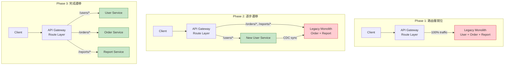
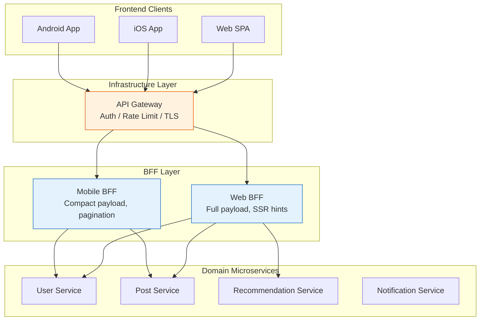
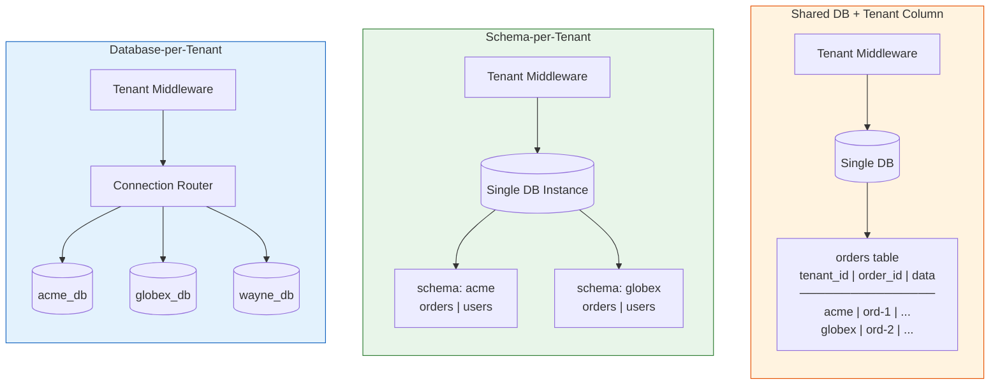
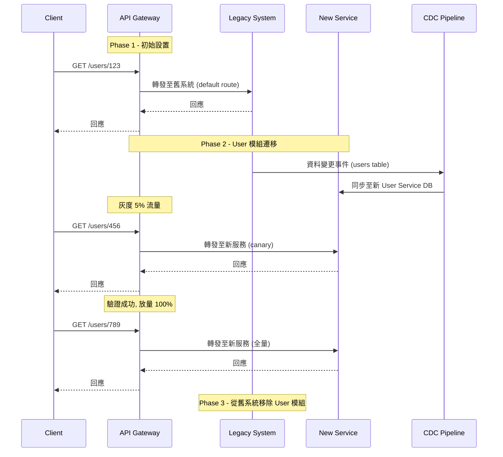

# Architecture Supplement Patterns / 架構補充模式

## Intent / 意圖

本篇整合三個在現代後端架構中經常出現、卻不屬於單一分類的補充模式：

1. **Strangler Fig Pattern / 絞殺者模式**：漸進式遷移策略，讓新舊系統共存，逐步以新實作取代舊系統，而非冒險一次性重寫。名稱源自熱帶絞殺榕——種子落在宿主樹上，根系逐漸包圍宿主，最終取而代之。
2. **Backend for Frontend (BFF)**：針對不同前端類型（mobile / web / desktop）各自建立專屬的後端聚合層，避免單一通用 API 在不同裝置需求間妥協。
3. **Multi-tenancy / 多租戶架構**：一套系統同時服務多個租戶（tenant），在共享基礎設施的同時保證資料隔離、效能公平與客製化能力。

核心問題：**如何在不中斷服務的前提下遷移遺留系統、如何為多種前端提供最佳化的 API 體驗、如何在共享架構中安全地隔離多租戶資料？**

---

## Problem / 問題情境

### Strangler Fig Pattern — 遺留系統遷移的困境

某保險公司擁有運行 15 年的 COBOL + Java EE 核心系統，200 萬行程式碼，每月處理 30 萬張保單。管理層要求遷移至雲原生微服務架構。CTO 提出兩個方案：

**方案一：Big Bang 重寫** — 18 個月後一次切換。但業務不能停擺、新舊功能差異難以追平、測試覆蓋率無法在期限內達標。歷史案例顯示大規模重寫失敗率超過 70%。

**方案二：Strangler Fig 漸進遷移** — 在舊系統前方放置路由層（API Gateway），新功能直接在微服務上開發，舊功能按優先順序逐一遷移。新舊系統共存期間以路由規則控制流量，每次遷移一個功能模組，灰度驗證後全量切換，最終退役舊系統。

### Backend for Frontend — 通用 API 的痛苦

社交媒體平台的 API 團隊維護一套通用 REST API，同時服務 iOS、Android、Web SPA 和桌面應用。問題浮現：

- **Over-fetching**：Web 需要完整的使用者 profile（含頭像 URL、簡介、關注數），Mobile 只需要名字和頭像，但 `/api/users/{id}` 回傳所有欄位——行動端在 3G 網路下多下載 60% 無用資料。
- **Under-fetching**：Web 首頁需要「最新動態 + 推薦好友 + 熱門話題」三份資料，必須發三個 API 呼叫——增加延遲且加重前端聚合邏輯。Mobile 首頁只需精簡版動態流，一個 API 呼叫即可。
- **版本地獄**：Mobile 升級週期長（Apple 審核 + 使用者不更新），API 必須支援 v2 和 v3 並存數年。Web 部署即更新，可快速跟進最新版。但通用 API 被最慢的客戶端拖住，無法大膽演進。

BFF 的解法：為 Mobile 和 Web 各建立專屬的 BFF 服務，各自聚合下游微服務、量身裁剪回應格式、獨立演進 API 版本。

### Multi-tenancy — 資料隔離與公平性

某 SaaS 專案管理平台服務 500 家企業客戶。最初採用「共享資料庫 + tenant_id 欄位」的簡單多租戶模型。隨著客戶量成長，問題逐一浮現：

- **Noisy Neighbor / 噪音鄰居**：某大型客戶觸發一個複雜報表查詢，全表掃描 2 億行資料，導致共享資料庫的 CPU 飆至 100%，其他 499 家客戶全部超時。
- **資料外洩風險**：工程師忘記在某個新 API endpoint 加上 `WHERE tenant_id = ?` 過濾條件，導致租戶 A 的請求回傳了租戶 B 的敏感資料。上線 3 小時後被客戶發現，觸發資安事件。
- **合規需求衝突**：金融客戶要求資料必須存放在獨立資料庫（regulatory isolation），但大量小型客戶希望低成本共享方案。

---

## Core Concepts / 核心概念

### Strangler Fig Pattern / 絞殺者模式

- **Routing Layer / 路由層**：在舊系統前方放置路由器（通常是 API Gateway 或 Reverse Proxy），根據 URL path、header、或功能 feature flag 決定將請求導向舊系統或新服務。路由層是 Strangler Fig 的核心——它讓新舊系統對外呈現為單一系統。
- **Feature-by-Feature Replacement / 逐功能替換**：每次只遷移一個完整的業務功能（如「保單查詢」），而非試圖一次遷移整個子系統。遷移順序的選擇依據：耦合度最低的功能優先（最容易隔離）、業務價值最高的功能優先（最快產生回報）。
- **Coexistence Strategy / 共存策略**：新舊系統共存期間，資料一致性是最大挑戰。常見策略包括：(1) 新系統透過 API 呼叫舊系統取得資料——最簡單但增加延遲；(2) 資料同步管道（CDC / Change Data Capture）——舊系統的資料變更即時同步至新系統；(3) 雙寫（Dual Write）——同時寫入新舊系統，但需處理寫入失敗的不一致問題。
- **Asset Capture / 資產接管**：遷移完成後，逐步退役舊系統的步驟——關閉路由、保留唯讀存取供歷史查詢、最終完全下線。

### Backend for Frontend (BFF)

- **Dedicated Backend / 專屬後端**：每種前端類型（iOS、Android、Web SPA、Third-party API）對應一個專屬的 BFF 服務。BFF 的職責是：(1) 聚合多個下游微服務的資料；(2) 根據前端需求裁剪（tailor）回應格式；(3) 處理前端特有的認證/授權邏輯（如 Mobile 的 device token）。
- **API Gateway vs BFF**：API Gateway 是基礎設施層元件，處理橫切關注（rate limiting、auth、routing）。BFF 是應用層元件，包含特定前端的業務聚合邏輯。兩者可以並存——Gateway 在前做統一認證，BFF 在後做資料聚合。BFF 不應承擔 Gateway 的職責。
- **Data Aggregation & Transformation / 資料聚合與轉換**：BFF 從多個下游服務取得原始資料後，根據前端需求進行欄位篩選（field selection）、格式轉換（如將 timestamp 轉為 relative time "3 mins ago"）、資料合併（如將 user profile + recent posts + follower count 合為一個回應）。

### Multi-tenancy / 多租戶

- **Shared DB with Tenant Column / 共享 DB + 租戶欄位**：所有租戶資料存放在同一組資料表中，以 `tenant_id` 欄位區分。成本最低、運維最簡單，但隔離性最弱——一個忘記加 WHERE 的查詢就可能洩漏跨租戶資料。
- **Schema-per-Tenant / 租戶獨立 Schema**：每個租戶擁有自己的 database schema（PostgreSQL 的 `search_path`），但共享同一個資料庫實例。中等隔離——schema 名稱在連線層自動切換，SQL 注入無法跨 schema 存取。但遷移（migration）需要對所有 schema 執行。
- **Database-per-Tenant / 租戶獨立資料庫**：每個租戶擁有獨立的資料庫實例。最強隔離——效能完全獨立、合規需求天然滿足、可以為 VIP 租戶提供不同等級的硬體。但管理成本最高——1000 個租戶 = 1000 個資料庫連線池、1000 次 migration。
- **Tenant Routing Middleware / 租戶路由中介層**：從請求中提取租戶識別（JWT claim、HTTP header、subdomain、URL path），注入至 context 中，後續所有資料庫查詢自動帶上租戶篩選。這一層是多租戶安全的第一道防線。
- **Noisy Neighbor Problem / 噪音鄰居問題**：一個租戶的異常行為（大量查詢、過量資料寫入）影響其他租戶的效能。解法包含：per-tenant rate limiting、per-tenant connection pool、query timeout、資源配額（resource quota）。

---

## Architecture / 架構

### Strangler Fig Pattern — 漸進遷移架構



### Backend for Frontend — BFF 拓撲



### Multi-tenancy — 三種隔離模型比較



---

## How It Works / 運作原理

### Strangler Fig Pattern — 遷移流程



**Step 1 — 建立路由層**：在遺留系統前方部署 API Gateway（如 Kong、Envoy、Nginx）。初始配置將 100% 流量轉發至舊系統，確保零影響上線。

**Step 2 — 選擇遷移目標**：依據「低耦合、高價值、可獨立」三原則選出第一個遷移模組。用 dependency graph 分析模組間的呼叫關係，選擇最少外部依賴的模組優先。

**Step 3 — 資料同步**：建立 CDC pipeline（如 Debezium）從舊系統資料庫捕獲變更，同步至新服務的資料庫。確認新舊資料一致後才開始路由切換。

**Step 4 — 灰度切換**：路由規則將 5% 流量導向新服務，監控 error rate、latency、業務指標。發現問題立即回滾至 0%。

**Step 5 — 全量切換與退役**：逐步放量至 100%，在舊系統中移除已遷移的模組程式碼。保留舊系統的資料庫唯讀存取一段時間供查驗，確認無需回溯後完全退役。

### Backend for Frontend — 請求聚合流程

**Step 1 — 前端發送單一請求**：Mobile App 呼叫 `GET /mobile/feed`，由 Mobile BFF 接收。

**Step 2 — BFF 平行呼叫下游**：BFF 同時向 User Service（取得 profile）、Post Service（取得動態流）發送請求。使用 `tokio::join!` (Rust) 或 `sync.WaitGroup` (Go) 平行等待。

**Step 3 — 資料裁剪與合併**：BFF 從 User Service 回應中只取 `name` 和 `avatar_url`（捨棄 `bio`、`follower_count`），從 Post Service 回應中限制前 20 筆並壓縮圖片 URL 為 thumbnail 格式，合併為一個精簡的 JSON 回應。

**Step 4 — 回傳裝置最佳化回應**：回應經過 gzip 壓縮，body 大小從通用 API 的 12KB 降至 3.5KB。

### Multi-tenancy — 租戶路由機制

**Step 1 — 租戶識別**：中介層從 HTTP 請求中提取租戶識別符。來源可以是：JWT claim 中的 `tenant_id`、subdomain（`acme.app.com`）、或自訂 header `X-Tenant-ID`。

**Step 2 — Context 注入**：將 `tenant_id` 注入至請求 context。後續所有中介層和 handler 都可從 context 取得 tenant，無需從 header 重新解析。

**Step 3 — 資料存取層過濾**：Repository / ORM 層的 middleware 自動在所有 SQL 查詢加上 `WHERE tenant_id = ?`，或在 schema-per-tenant 模式下自動切換 `search_path`，或在 database-per-tenant 模式下選擇對應的資料庫連線池。

**Step 4 — 回應驗證**：在回應離開前驗證回傳資料的 `tenant_id` 是否匹配請求的 tenant，作為最後一道防線。

---

## Rust 實作

以 Axum 0.8+ 實作：(1) BFF gateway 從多個下游服務平行聚合資料；(2) tenant-aware middleware 從 header 提取 tenant 並注入 context，所有 handler 自動取得 tenant 隔離。

```rust
// Cargo.toml:
//   axum = "0.8"
//   tokio = { version = "1", features = ["full"] }
//   serde = { version = "1", features = ["derive"] }
//   serde_json = "1"
//   tower = "0.5"
//   uuid = { version = "1", features = ["v4"] }

use axum::{
    extract::{Request, State},
    http::{HeaderMap, StatusCode},
    middleware::{self, Next},
    response::{IntoResponse, Json},
    routing::get,
    Router,
};
use serde::{Deserialize, Serialize};
use std::{
    collections::HashMap,
    sync::{Arc, Mutex},
};

// ─── Tenant Context ───────────────────────────────────────────

/// 租戶資訊，由 middleware 從 header 提取後注入至 request extensions
#[derive(Debug, Clone)]
struct TenantContext {
    tenant_id: String,
    plan: TenantPlan,
}

#[derive(Debug, Clone, PartialEq)]
enum TenantPlan {
    Free,
    Pro,
    Enterprise,
}

/// Tenant routing middleware:
/// 從 X-Tenant-ID header 提取租戶，驗證是否存在，注入至 request extensions
async fn tenant_middleware(
    State(registry): State<Arc<TenantRegistry>>,
    mut request: Request,
    next: Next,
) -> Result<impl IntoResponse, StatusCode> {
    let tenant_id = request
        .headers()
        .get("X-Tenant-ID")
        .and_then(|v| v.to_str().ok())
        .map(|s| s.to_string())
        .ok_or(StatusCode::BAD_REQUEST)?;

    let tenant_ctx = registry
        .resolve(&tenant_id)
        .ok_or(StatusCode::UNAUTHORIZED)?;

    // 注入 tenant context 至 request extensions
    request.extensions_mut().insert(tenant_ctx);
    Ok(next.run(request).await)
}

/// 租戶註冊表 — 實務中對接資料庫或快取
struct TenantRegistry {
    tenants: HashMap<String, TenantPlan>,
}

impl TenantRegistry {
    fn new() -> Self {
        let mut tenants = HashMap::new();
        tenants.insert("acme".into(), TenantPlan::Enterprise);
        tenants.insert("globex".into(), TenantPlan::Pro);
        tenants.insert("initech".into(), TenantPlan::Free);
        Self { tenants }
    }
    fn resolve(&self, tenant_id: &str) -> Option<TenantContext> {
        self.tenants.get(tenant_id).map(|plan| TenantContext {
            tenant_id: tenant_id.to_string(),
            plan: plan.clone(),
        })
    }
}

// ─── Simulated Downstream Services (in-process) ───────────────

/// 模擬 User Service 回傳的完整資料
#[derive(Debug, Clone, Serialize, Deserialize)]
struct UserProfile {
    user_id: String,
    name: String,
    avatar_url: String,
    bio: String,
    follower_count: u64,
    tenant_id: String,
}

/// 模擬 Post Service 回傳的完整資料
#[derive(Debug, Clone, Serialize, Deserialize)]
struct Post {
    post_id: String,
    author: String,
    content: String,
    image_url: Option<String>,
    likes: u64,
    tenant_id: String,
}

/// 多租戶資料儲存 — 按 tenant_id 隔離
#[derive(Clone)]
struct MultiTenantStore {
    users: Arc<Mutex<Vec<UserProfile>>>,
    posts: Arc<Mutex<Vec<Post>>>,
}

impl MultiTenantStore {
    fn new() -> Self {
        let users = vec![
            UserProfile {
                user_id: "u1".into(), name: "Alice".into(),
                avatar_url: "https://cdn.example.com/alice.jpg".into(),
                bio: "Software engineer who loves Rust".into(),
                follower_count: 1_200, tenant_id: "acme".into(),
            },
            UserProfile {
                user_id: "u2".into(), name: "Bob".into(),
                avatar_url: "https://cdn.example.com/bob.jpg".into(),
                bio: "Go enthusiast and cloud native advocate".into(),
                follower_count: 850, tenant_id: "acme".into(),
            },
            UserProfile {
                user_id: "u3".into(), name: "Carol".into(),
                avatar_url: "https://cdn.example.com/carol.jpg".into(),
                bio: "Product manager at Globex Corp".into(),
                follower_count: 2_300, tenant_id: "globex".into(),
            },
        ];
        let posts = vec![
            Post {
                post_id: "p1".into(), author: "u1".into(),
                content: "Just deployed our new Axum service!".into(),
                image_url: Some("https://cdn.example.com/img/deploy.png".into()),
                likes: 42, tenant_id: "acme".into(),
            },
            Post {
                post_id: "p2".into(), author: "u2".into(),
                content: "Go 1.24 generics are amazing".into(),
                image_url: None, likes: 38, tenant_id: "acme".into(),
            },
            Post {
                post_id: "p3".into(), author: "u3".into(),
                content: "Q1 roadmap planning session today".into(),
                image_url: Some("https://cdn.example.com/img/roadmap.png".into()),
                likes: 15, tenant_id: "globex".into(),
            },
        ];
        Self {
            users: Arc::new(Mutex::new(users)),
            posts: Arc::new(Mutex::new(posts)),
        }
    }

    /// 租戶隔離查詢：只回傳屬於指定 tenant 的使用者
    fn get_users_for_tenant(&self, tenant_id: &str) -> Vec<UserProfile> {
        self.users.lock().unwrap()
            .iter()
            .filter(|u| u.tenant_id == tenant_id)
            .cloned()
            .collect()
    }

    /// 租戶隔離查詢：只回傳屬於指定 tenant 的貼文
    fn get_posts_for_tenant(&self, tenant_id: &str) -> Vec<Post> {
        self.posts.lock().unwrap()
            .iter()
            .filter(|p| p.tenant_id == tenant_id)
            .cloned()
            .collect()
    }
}

// ─── BFF: Mobile Feed Response (compact) ──────────────────────

/// Mobile BFF 回傳的精簡格式 — 只包含 mobile 需要的欄位
#[derive(Serialize)]
struct MobileFeedResponse {
    tenant: String,
    users: Vec<MobileUserSummary>,
    feed: Vec<MobileFeedItem>,
}

#[derive(Serialize)]
struct MobileUserSummary {
    user_id: String,
    name: String,
    avatar_url: String,
    // 故意省略 bio 和 follower_count — mobile 不需要
}

#[derive(Serialize)]
struct MobileFeedItem {
    post_id: String,
    author_name: String,
    content: String,
    thumbnail_url: Option<String>, // 轉換為 thumbnail 格式
    likes: u64,
}

// ─── BFF: Web Feed Response (full) ────────────────────────────

/// Web BFF 回傳的完整格式 — 包含所有欄位供 SPA 渲染
#[derive(Serialize)]
struct WebFeedResponse {
    tenant: String,
    plan: String,
    users: Vec<UserProfile>,
    feed: Vec<WebFeedItem>,
    total_posts: usize,
}

#[derive(Serialize)]
struct WebFeedItem {
    post_id: String,
    author: WebAuthorInfo,
    content: String,
    image_url: Option<String>,
    likes: u64,
}

#[derive(Serialize)]
struct WebAuthorInfo {
    user_id: String,
    name: String,
    avatar_url: String,
    follower_count: u64,
}

// ─── Handlers ─────────────────────────────────────────────────

/// Mobile BFF endpoint: 聚合 user + post，裁剪為精簡格式
async fn mobile_feed(
    request: Request,
    State(store): State<MultiTenantStore>,
) -> Result<Json<MobileFeedResponse>, StatusCode> {
    let tenant = request.extensions().get::<TenantContext>()
        .ok_or(StatusCode::INTERNAL_SERVER_ERROR)?;

    // 平行取得 users 和 posts（此處為同步模擬，實務中用 tokio::join! 呼叫下游 HTTP）
    let users = store.get_users_for_tenant(&tenant.tenant_id);
    let posts = store.get_posts_for_tenant(&tenant.tenant_id);

    // 建立 user lookup 供 post 作者名稱解析
    let user_map: HashMap<&str, &UserProfile> =
        users.iter().map(|u| (u.user_id.as_str(), u)).collect();

    let mobile_users: Vec<MobileUserSummary> = users.iter().map(|u| MobileUserSummary {
        user_id: u.user_id.clone(),
        name: u.name.clone(),
        avatar_url: u.avatar_url.clone(),
    }).collect();

    let feed: Vec<MobileFeedItem> = posts.iter().map(|p| {
        let author_name = user_map.get(p.author.as_str())
            .map(|u| u.name.clone())
            .unwrap_or_else(|| "Unknown".into());
        MobileFeedItem {
            post_id: p.post_id.clone(),
            author_name,
            content: p.content.clone(),
            thumbnail_url: p.image_url.as_ref().map(|url| url.replace("/img/", "/thumb/")),
            likes: p.likes,
        }
    }).collect();

    Ok(Json(MobileFeedResponse {
        tenant: tenant.tenant_id.clone(),
        users: mobile_users,
        feed,
    }))
}
// Output: GET /mobile/feed (X-Tenant-ID: acme) ->
//   {"tenant":"acme","users":[{"user_id":"u1","name":"Alice","avatar_url":"..."},...],
//    "feed":[{"post_id":"p1","author_name":"Alice","content":"...","thumbnail_url":"...","likes":42},...]}

/// Web BFF endpoint: 聚合 user + post，回傳完整格式
async fn web_feed(
    request: Request,
    State(store): State<MultiTenantStore>,
) -> Result<Json<WebFeedResponse>, StatusCode> {
    let tenant = request.extensions().get::<TenantContext>()
        .ok_or(StatusCode::INTERNAL_SERVER_ERROR)?;

    let users = store.get_users_for_tenant(&tenant.tenant_id);
    let posts = store.get_posts_for_tenant(&tenant.tenant_id);

    let user_map: HashMap<&str, &UserProfile> =
        users.iter().map(|u| (u.user_id.as_str(), u)).collect();

    let total_posts = posts.len();
    let feed: Vec<WebFeedItem> = posts.iter().map(|p| {
        let author = user_map.get(p.author.as_str()).map(|u| WebAuthorInfo {
            user_id: u.user_id.clone(),
            name: u.name.clone(),
            avatar_url: u.avatar_url.clone(),
            follower_count: u.follower_count,
        }).unwrap_or(WebAuthorInfo {
            user_id: "?".into(), name: "Unknown".into(),
            avatar_url: "".into(), follower_count: 0,
        });
        WebFeedItem {
            post_id: p.post_id.clone(), author,
            content: p.content.clone(),
            image_url: p.image_url.clone(), likes: p.likes,
        }
    }).collect();

    let plan_str = match tenant.plan {
        TenantPlan::Free => "free",
        TenantPlan::Pro => "pro",
        TenantPlan::Enterprise => "enterprise",
    };

    Ok(Json(WebFeedResponse {
        tenant: tenant.tenant_id.clone(),
        plan: plan_str.into(),
        users: users.clone(),
        feed, total_posts,
    }))
}
// Output: GET /web/feed (X-Tenant-ID: acme) ->
//   {"tenant":"acme","plan":"enterprise",
//    "users":[{"user_id":"u1","name":"Alice","bio":"Software engineer...","follower_count":1200,...},...],
//    "feed":[{"post_id":"p1","author":{"user_id":"u1","name":"Alice","follower_count":1200},...},...],
//    "total_posts":2}

/// 租戶管理 endpoint: 列出當前租戶資訊（僅限 Enterprise）
async fn tenant_info(request: Request) -> Result<Json<serde_json::Value>, StatusCode> {
    let tenant = request.extensions().get::<TenantContext>()
        .ok_or(StatusCode::INTERNAL_SERVER_ERROR)?;

    if tenant.plan != TenantPlan::Enterprise {
        return Err(StatusCode::FORBIDDEN);
    }

    Ok(Json(serde_json::json!({
        "tenant_id": tenant.tenant_id,
        "plan": format!("{:?}", tenant.plan),
        "features": ["sso", "audit_log", "custom_domain", "dedicated_support"],
    })))
}
// Output: GET /admin/tenant (X-Tenant-ID: acme) ->
//   {"tenant_id":"acme","plan":"Enterprise","features":["sso","audit_log",...]}
// Output: GET /admin/tenant (X-Tenant-ID: initech) -> 403 Forbidden

#[tokio::main]
async fn main() {
    let registry = Arc::new(TenantRegistry::new());
    let store = MultiTenantStore::new();

    // Mobile BFF routes
    let mobile_routes = Router::new()
        .route("/feed", get(mobile_feed))
        .with_state(store.clone());

    // Web BFF routes
    let web_routes = Router::new()
        .route("/feed", get(web_feed))
        .with_state(store.clone());

    // Admin routes
    let admin_routes = Router::new()
        .route("/tenant", get(tenant_info));

    // 組合所有路由，套用 tenant middleware
    let app = Router::new()
        .nest("/mobile", mobile_routes)
        .nest("/web", web_routes)
        .nest("/admin", admin_routes)
        .layer(middleware::from_fn_with_state(registry, tenant_middleware));

    let listener = tokio::net::TcpListener::bind("0.0.0.0:3000").await.unwrap();
    println!("BFF + Multi-tenant server on http://0.0.0.0:3000");
    println!("  Mobile BFF:  GET /mobile/feed  (X-Tenant-ID: acme)");
    println!("  Web BFF:     GET /web/feed     (X-Tenant-ID: acme)");
    println!("  Admin:       GET /admin/tenant (X-Tenant-ID: acme)");
    axum::serve(listener, app).await.unwrap();
}
// Output:
// BFF + Multi-tenant server on http://0.0.0.0:3000
//   Mobile BFF:  GET /mobile/feed  (X-Tenant-ID: acme)
//   Web BFF:     GET /web/feed     (X-Tenant-ID: acme)
//   Admin:       GET /admin/tenant (X-Tenant-ID: acme)
```

**重點**：

- **Tenant middleware** 使用 Axum `middleware::from_fn_with_state` 將 `TenantContext` 注入 `request.extensions()`，所有 handler 透過 `request.extensions().get::<TenantContext>()` 取得——型別安全、零字串查找。
- **BFF 差異化**：`MobileFeedResponse` 故意省略 `bio`、`follower_count`，圖片 URL 轉為 thumbnail。`WebFeedResponse` 包含完整 `UserProfile` 與 author follower count。
- **資料隔離**：`get_users_for_tenant` / `get_posts_for_tenant` 在資料層強制 `tenant_id` 過濾。實務中這一層應在 ORM/Repository 中統一實作，避免每個 handler 手動過濾。

---

## Go 實作

```go
// main.go — BFF gateway + tenant-aware middleware
// go 1.24+, 標準庫 net/http + encoding/json

package main

import (
	"context"
	"encoding/json"
	"fmt"
	"log"
	"net/http"
	"sync"
)

// ─── Tenant Context ───────────────────────────────────────────

type TenantPlan string

const (
	PlanFree       TenantPlan = "free"
	PlanPro        TenantPlan = "pro"
	PlanEnterprise TenantPlan = "enterprise"
)

type TenantContext struct {
	TenantID string
	Plan     TenantPlan
}

// context key 型別，避免與其他 package 的 key 碰撞
type contextKey string

const tenantKey contextKey = "tenant"

// TenantRegistry 管理所有已註冊租戶
type TenantRegistry struct {
	tenants map[string]TenantPlan
}

func NewTenantRegistry() *TenantRegistry {
	return &TenantRegistry{tenants: map[string]TenantPlan{
		"acme":    PlanEnterprise,
		"globex":  PlanPro,
		"initech": PlanFree,
	}}
}

func (r *TenantRegistry) Resolve(tenantID string) (TenantContext, bool) {
	plan, ok := r.tenants[tenantID]
	if !ok {
		return TenantContext{}, false
	}
	return TenantContext{TenantID: tenantID, Plan: plan}, true
}

// TenantMiddleware 從 X-Tenant-ID header 提取租戶，注入至 context
func TenantMiddleware(registry *TenantRegistry, next http.Handler) http.Handler {
	return http.HandlerFunc(func(w http.ResponseWriter, r *http.Request) {
		tenantID := r.Header.Get("X-Tenant-ID")
		if tenantID == "" {
			http.Error(w, `{"error":"X-Tenant-ID header required"}`, http.StatusBadRequest)
			return
		}
		tenant, ok := registry.Resolve(tenantID)
		if !ok {
			http.Error(w, `{"error":"unknown tenant"}`, http.StatusUnauthorized)
			return
		}
		ctx := context.WithValue(r.Context(), tenantKey, tenant)
		next.ServeHTTP(w, r.WithContext(ctx))
	})
}

// GetTenant 從 context 取得 TenantContext
func GetTenant(ctx context.Context) (TenantContext, bool) {
	t, ok := ctx.Value(tenantKey).(TenantContext)
	return t, ok
}

// ─── Domain Models ────────────────────────────────────────────

type UserProfile struct {
	UserID        string `json:"user_id"`
	Name          string `json:"name"`
	AvatarURL     string `json:"avatar_url"`
	Bio           string `json:"bio"`
	FollowerCount uint64 `json:"follower_count"`
	TenantID      string `json:"tenant_id"`
}

type Post struct {
	PostID   string  `json:"post_id"`
	Author   string  `json:"author"`
	Content  string  `json:"content"`
	ImageURL *string `json:"image_url,omitempty"`
	Likes    uint64  `json:"likes"`
	TenantID string  `json:"tenant_id"`
}

// ─── Multi-Tenant Store ───────────────────────────────────────

type MultiTenantStore struct {
	mu    sync.RWMutex
	users []UserProfile
	posts []Post
}

func NewMultiTenantStore() *MultiTenantStore {
	img1 := "https://cdn.example.com/img/deploy.png"
	img3 := "https://cdn.example.com/img/roadmap.png"
	return &MultiTenantStore{
		users: []UserProfile{
			{UserID: "u1", Name: "Alice", AvatarURL: "https://cdn.example.com/alice.jpg",
				Bio: "Software engineer who loves Rust", FollowerCount: 1200, TenantID: "acme"},
			{UserID: "u2", Name: "Bob", AvatarURL: "https://cdn.example.com/bob.jpg",
				Bio: "Go enthusiast and cloud native advocate", FollowerCount: 850, TenantID: "acme"},
			{UserID: "u3", Name: "Carol", AvatarURL: "https://cdn.example.com/carol.jpg",
				Bio: "Product manager at Globex Corp", FollowerCount: 2300, TenantID: "globex"},
		},
		posts: []Post{
			{PostID: "p1", Author: "u1", Content: "Just deployed our new Axum service!",
				ImageURL: &img1, Likes: 42, TenantID: "acme"},
			{PostID: "p2", Author: "u2", Content: "Go 1.24 generics are amazing",
				ImageURL: nil, Likes: 38, TenantID: "acme"},
			{PostID: "p3", Author: "u3", Content: "Q1 roadmap planning session today",
				ImageURL: &img3, Likes: 15, TenantID: "globex"},
		},
	}
}

// GetUsersForTenant 租戶隔離查詢
func (s *MultiTenantStore) GetUsersForTenant(tenantID string) []UserProfile {
	s.mu.RLock()
	defer s.mu.RUnlock()
	var result []UserProfile
	for _, u := range s.users {
		if u.TenantID == tenantID {
			result = append(result, u)
		}
	}
	return result
}

// GetPostsForTenant 租戶隔離查詢
func (s *MultiTenantStore) GetPostsForTenant(tenantID string) []Post {
	s.mu.RLock()
	defer s.mu.RUnlock()
	var result []Post
	for _, p := range s.posts {
		if p.TenantID == tenantID {
			result = append(result, p)
		}
	}
	return result
}

// ─── Mobile BFF ───────────────────────────────────────────────

type MobileFeedResponse struct {
	Tenant string              `json:"tenant"`
	Users  []MobileUserSummary `json:"users"`
	Feed   []MobileFeedItem    `json:"feed"`
}
type MobileUserSummary struct {
	UserID    string `json:"user_id"`
	Name      string `json:"name"`
	AvatarURL string `json:"avatar_url"`
}
type MobileFeedItem struct {
	PostID       string  `json:"post_id"`
	AuthorName   string  `json:"author_name"`
	Content      string  `json:"content"`
	ThumbnailURL *string `json:"thumbnail_url,omitempty"`
	Likes        uint64  `json:"likes"`
}

func (s *MultiTenantStore) HandleMobileFeed(w http.ResponseWriter, r *http.Request) {
	tenant, ok := GetTenant(r.Context())
	if !ok {
		http.Error(w, "tenant not found", http.StatusInternalServerError)
		return
	}

	users := s.GetUsersForTenant(tenant.TenantID)
	posts := s.GetPostsForTenant(tenant.TenantID)

	// 建立 user lookup map
	userMap := make(map[string]UserProfile, len(users))
	for _, u := range users {
		userMap[u.UserID] = u
	}

	// 裁剪 users -> MobileUserSummary（省略 bio, follower_count）
	mobileUsers := make([]MobileUserSummary, 0, len(users))
	for _, u := range users {
		mobileUsers = append(mobileUsers, MobileUserSummary{
			UserID: u.UserID, Name: u.Name, AvatarURL: u.AvatarURL,
		})
	}

	// 裁剪 posts -> MobileFeedItem（thumbnail 轉換）
	feed := make([]MobileFeedItem, 0, len(posts))
	for _, p := range posts {
		authorName := "Unknown"
		if u, found := userMap[p.Author]; found {
			authorName = u.Name
		}
		var thumbURL *string
		if p.ImageURL != nil {
			converted := replaceImgToThumb(*p.ImageURL)
			thumbURL = &converted
		}
		feed = append(feed, MobileFeedItem{
			PostID: p.PostID, AuthorName: authorName,
			Content: p.Content, ThumbnailURL: thumbURL, Likes: p.Likes,
		})
	}

	writeJSON(w, http.StatusOK, MobileFeedResponse{
		Tenant: tenant.TenantID, Users: mobileUsers, Feed: feed,
	})
}

// Output: GET /mobile/feed (X-Tenant-ID: acme) ->
//   {"tenant":"acme","users":[{"user_id":"u1","name":"Alice","avatar_url":"..."}],
//    "feed":[{"post_id":"p1","author_name":"Alice","content":"...","thumbnail_url":"...","likes":42}]}

// ─── Web BFF ──────────────────────────────────────────────────

type WebFeedResponse struct {
	Tenant     string        `json:"tenant"`
	Plan       string        `json:"plan"`
	Users      []UserProfile `json:"users"`
	Feed       []WebFeedItem `json:"feed"`
	TotalPosts int           `json:"total_posts"`
}
type WebFeedItem struct {
	PostID   string        `json:"post_id"`
	Author   WebAuthorInfo `json:"author"`
	Content  string        `json:"content"`
	ImageURL *string       `json:"image_url,omitempty"`
	Likes    uint64        `json:"likes"`
}
type WebAuthorInfo struct {
	UserID        string `json:"user_id"`
	Name          string `json:"name"`
	AvatarURL     string `json:"avatar_url"`
	FollowerCount uint64 `json:"follower_count"`
}

func (s *MultiTenantStore) HandleWebFeed(w http.ResponseWriter, r *http.Request) {
	tenant, ok := GetTenant(r.Context())
	if !ok {
		http.Error(w, "tenant not found", http.StatusInternalServerError)
		return
	}

	users := s.GetUsersForTenant(tenant.TenantID)
	posts := s.GetPostsForTenant(tenant.TenantID)

	userMap := make(map[string]UserProfile, len(users))
	for _, u := range users {
		userMap[u.UserID] = u
	}

	feed := make([]WebFeedItem, 0, len(posts))
	for _, p := range posts {
		author := WebAuthorInfo{UserID: "?", Name: "Unknown"}
		if u, found := userMap[p.Author]; found {
			author = WebAuthorInfo{
				UserID: u.UserID, Name: u.Name,
				AvatarURL: u.AvatarURL, FollowerCount: u.FollowerCount,
			}
		}
		feed = append(feed, WebFeedItem{
			PostID: p.PostID, Author: author, Content: p.Content,
			ImageURL: p.ImageURL, Likes: p.Likes,
		})
	}

	writeJSON(w, http.StatusOK, WebFeedResponse{
		Tenant: tenant.TenantID, Plan: string(tenant.Plan),
		Users: users, Feed: feed, TotalPosts: len(posts),
	})
}

// Output: GET /web/feed (X-Tenant-ID: acme) ->
//   {"tenant":"acme","plan":"enterprise","users":[...],"feed":[...],"total_posts":2}

// ─── Admin ────────────────────────────────────────────────────

func HandleTenantInfo(w http.ResponseWriter, r *http.Request) {
	tenant, ok := GetTenant(r.Context())
	if !ok {
		http.Error(w, "tenant not found", http.StatusInternalServerError)
		return
	}
	if tenant.Plan != PlanEnterprise {
		http.Error(w, `{"error":"enterprise plan required"}`, http.StatusForbidden)
		return
	}
	writeJSON(w, http.StatusOK, map[string]any{
		"tenant_id": tenant.TenantID,
		"plan":      tenant.Plan,
		"features":  []string{"sso", "audit_log", "custom_domain", "dedicated_support"},
	})
}

// Output: GET /admin/tenant (X-Tenant-ID: acme) ->
//   {"tenant_id":"acme","plan":"enterprise","features":["sso","audit_log",...]}

// ─── Helpers ──────────────────────────────────────────────────

func writeJSON(w http.ResponseWriter, status int, v any) {
	w.Header().Set("Content-Type", "application/json")
	w.WriteHeader(status)
	json.NewEncoder(w).Encode(v)
}

func replaceImgToThumb(url string) string {
	// 簡化：將 /img/ 替換為 /thumb/ 來產生 thumbnail URL
	result := ""
	for i := 0; i < len(url); i++ {
		if i+5 <= len(url) && url[i:i+5] == "/img/" {
			result += "/thumb/"
			i += 4
		} else {
			result += string(url[i])
		}
	}
	return result
}

func main() {
	registry := NewTenantRegistry()
	store := NewMultiTenantStore()

	mux := http.NewServeMux()
	mux.HandleFunc("GET /mobile/feed", store.HandleMobileFeed)
	mux.HandleFunc("GET /web/feed", store.HandleWebFeed)
	mux.HandleFunc("GET /admin/tenant", HandleTenantInfo)

	handler := TenantMiddleware(registry, mux)

	fmt.Println("BFF + Multi-tenant server on http://0.0.0.0:3000")
	fmt.Println("  Mobile BFF:  GET /mobile/feed  (X-Tenant-ID: acme)")
	fmt.Println("  Web BFF:     GET /web/feed     (X-Tenant-ID: acme)")
	fmt.Println("  Admin:       GET /admin/tenant (X-Tenant-ID: acme)")
	log.Fatal(http.ListenAndServe("0.0.0.0:3000", handler))
}

// Output:
// BFF + Multi-tenant server on http://0.0.0.0:3000
//   Mobile BFF:  GET /mobile/feed  (X-Tenant-ID: acme)
//   Web BFF:     GET /web/feed     (X-Tenant-ID: acme)
//   Admin:       GET /admin/tenant (X-Tenant-ID: acme)
```

**重點**：

- **Tenant middleware** 使用 `context.WithValue` 注入 `TenantContext`，配合自定義 `contextKey` 型別避免 key 碰撞。Go 的 middleware 模式是 `func(http.Handler) http.Handler`——標準、無框架依賴。
- **資料隔離**：`GetUsersForTenant` / `GetPostsForTenant` 使用 `sync.RWMutex` 保護共享資料，讀取用 `RLock` 不互斥。
- **BFF 差異化**：與 Rust 版完全一致——Mobile 回傳精簡版，Web 回傳完整版。Go 使用不同 struct 定義不同的 JSON schema。

---

## Rust vs Go 對照表

| 面向 | Rust (Axum 0.8) | Go (net/http) |
|------|-----------------|---------------|
| **Tenant context 注入** | `request.extensions_mut().insert(TenantContext)` — 編譯期型別安全，`get::<TenantContext>()` 不需 type assertion | `context.WithValue(ctx, key, tenant)` — 執行期 type assertion，key 碰撞風險需靠自定義型別規避 |
| **Middleware 組合** | `middleware::from_fn_with_state` + `tower::Layer` 組合，型別系統保證 middleware 順序正確 | `func(http.Handler) http.Handler` 手動嵌套，順序錯誤只在執行期暴露 |
| **BFF 回應型別** | 不同 BFF 端點回傳不同 struct，`serde` derive 自動產生 JSON schema，欄位重命名/省略在編譯期驗證 | struct tag (`json:"..."`) 控制 JSON 格式，但 `omitempty` 不區分「欄位不存在」與「零值」，需 pointer field 模擬 |
| **併發資料存取** | `Mutex<Vec<T>>` 強制 lock scope，`MutexGuard` 離開作用域自動解鎖，無法忘記 `unlock` | `sync.RWMutex` 需手動 `defer s.mu.RUnlock()`，忘記呼叫或 `Lock/RUnlock` 配對錯誤會導致死鎖，需 `-race` flag 偵測 |
| **Request extensions** | 強型別 `TypeMap`（`extensions`），同一型別只存一份，檢索零成本 | `context.Value` 以 `any` 回傳，需 type assertion，多層 middleware 重複包裝 context 有分配開銷 |

---

## When to Use / 適用場景

### Strangler Fig Pattern

- **遺留系統現代化**：系統運行超過 5 年、累積大量技術債，但承載重要業務流量不允許停機遷移。Strangler Fig 讓團隊在不停止服務的前提下，花 12-24 個月逐步替換。
- **單體拆分為微服務**：已識別 Bounded Context，但不敢一次性拆分。每次遷移一個 Context 至獨立服務，路由層控制流量，失敗可立即回滾。
- **技術棧升級**：從 Java 8 升級至 Kotlin、從 Python 2 遷移至 Go——新功能用新技術開發，舊功能在原有棧上維護，透過 API Gateway 統一對外。

### Backend for Frontend (BFF)

- **多種前端裝置有顯著不同的資料需求**：Mobile 需要精簡 payload + 圖片壓縮、Web 需要完整資料 + SEO metadata、Smart TV 需要特殊格式。單一通用 API 無法同時最佳化所有裝置體驗。
- **前端團隊需要獨立演進 API**：Mobile 團隊希望每兩週迭代 API，Web 團隊隨時部署。BFF 讓各前端團隊擁有自己的 API 層，不被其他團隊的需求阻擋。
- **需要聚合多個下游微服務**：前端呈現一個畫面需要 3-5 個微服務的資料，將聚合邏輯放在 BFF 比放在前端更高效（減少 round trip、集中錯誤處理）。

### Multi-tenancy

- **SaaS 平台服務多家企業客戶**：Slack、Notion、Jira 這類 B2B SaaS，每家客戶是一個 tenant。共享基礎設施降低營運成本，同時提供隔離的資料與客製化設定。
- **白標產品（White-label）**：同一套系統以不同品牌面貌服務不同客戶。每個 tenant 有自己的 domain、logo、功能開關。
- **按用量計費的平台服務**：雲服務（如 AWS、GCP 內部）本身就是極致的多租戶架構——所有客戶共享物理資源，透過虛擬化和 quota 實現隔離。

---

## When NOT to Use / 不適用場景

### Strangler Fig Pattern

- **系統規模小到可以直接重寫**：如果舊系統只有數千行程式碼、3 個 endpoint，直接重寫比維護路由層 + 共存邏輯更經濟。Strangler Fig 的價值在於降低大型系統遷移的風險，小系統的風險本身就低。
- **舊系統沒有清晰的模組邊界**：如果舊系統是高度耦合的「大泥球」（Big Ball of Mud），無法識別可獨立遷移的功能模組。此時需先做內部重構（Extract Module）建立邊界，才能使用 Strangler Fig。

### Backend for Frontend (BFF)

- **只有單一前端**：如果產品只有 Web SPA 且短期內不會增加其他前端類型，BFF 層只是增加了一個無必要的中間層。直接讓前端呼叫 API Gateway 後面的微服務即可。
- **團隊人力不足以維護多個 BFF**：每個 BFF 是一個獨立服務，需要部署、監控、維護。3 人小團隊維護 3 個 BFF + N 個微服務 = 維運負擔過重。

### Multi-tenancy

- **只服務單一客戶的私有化部署**：為政府或大型企業部署的私有化系統，只有一個 tenant，不需要多租戶架構的複雜度。
- **租戶之間有根本性的功能差異**：如果每個「租戶」需要大量客製化邏輯（不同的業務規則、不同的資料模型），多租戶架構的「共享程式碼 + 配置差異」模式會被無窮的 if-else 淹沒。此時應考慮獨立部署。

---

## Real-World Examples / 真實世界案例

### Strangler Fig — Amazon 從單體到微服務

Amazon 在 2001 年前是一個龐大的 C++ 單體應用。Jeff Bezos 發出著名的「API Mandate」——所有團隊必須透過 service interface 暴露功能，禁止直接存取他人資料庫。團隊在單體前方放置路由層，逐步將 Product Catalog、Order Processing、Recommendation Engine 等模組提取為獨立服務。遷移歷時數年，沒有一次性重寫。這個過程最終催生了 AWS——Amazon 發現將這些內部服務能力對外銷售也是可行的商業模式。

### Backend for Frontend — Netflix

Netflix 為 iOS、Android、Smart TV、Web 各自維護專屬 BFF（早期稱為 API Gateway per device）。Smart TV 的 CPU 和記憶體極為有限，BFF 必須回傳預先計算好的 UI 佈局（server-driven UI）；Mobile App 需要考慮頻寬限制，BFF 會壓縮圖片 URL 並精簡 metadata；Web 則可接受較大的 payload 以支援豐富的互動體驗。各 BFF 由對應的前端團隊擁有（ownership），可以獨立部署與演進，不受其他平台拖累。

### Multi-tenancy — Salesforce

Salesforce 是多租戶架構的經典案例。超過 15 萬家企業客戶共享相同的資料庫叢集。核心設計：

- **Shared DB + OrgID column**：所有資料表以 `OrgID` 作為 partition key，每個查詢自動加上 `WHERE OrgID = ?`。
- **Governor Limits**：每個 tenant 有嚴格的 API 呼叫次數、SOQL 查詢行數、CPU 時間限制——這是 noisy neighbor 問題的系統性解法。
- **Metadata-Driven Customization**：客戶的自訂欄位、工作流程、驗證規則全部以 metadata 形式存放在共享表中，而非硬編碼。這讓單一程式碼庫能服務截然不同需求的客戶。

---

## Interview Questions / 面試常見問題

**Q1: 什麼是 Strangler Fig Pattern？為什麼比 Big Bang 重寫更安全？**

Strangler Fig 是 Martin Fowler 提出的漸進式遷移策略：在舊系統前方放置路由層，逐功能將流量導向新服務，新舊系統共存至舊系統完全退役。比 Big Bang 更安全的原因：(1) 每次只遷移一個功能，風險有限——失敗只影響一個功能而非全部；(2) 路由層可隨時回滾至舊系統；(3) 團隊持續交付業務價值而非等待 18 個月後一次切換；(4) 歷史資料證明大規模重寫的失敗率遠高於漸進遷移。

**Q2: API Gateway 和 BFF 的差異是什麼？可以合併嗎？**

API Gateway 是基礎設施層元件，處理橫切關注點——認證、rate limiting、TLS termination、routing、logging。BFF 是應用層元件，包含特定前端的業務聚合邏輯——呼叫多個下游服務、裁剪回應格式、處理前端特有的轉換。兩者職責不同，不應合併。合併的後果是 Gateway 膨脹為包含業務邏輯的「God Gateway」——難以維護、無法獨立擴縮。正確的拓撲：Gateway 在最前方統一處理基礎設施關注，BFF 在其後針對各前端做聚合。

**Q3: 多租戶架構的三種隔離模型如何選擇？**

(1) **Shared DB + tenant column**：適合大量小型租戶（數千家）、成本敏感、資料量不大的場景。風險在於 SQL 遺漏 WHERE 造成資料洩漏，需靠 middleware 和 ORM 層強制。(2) **Schema-per-tenant**：適合中型規模（數百家租戶），提供較好的隔離但 migration 需要對所有 schema 執行。(3) **Database-per-tenant**：適合高合規需求（金融、醫療）或 VIP 租戶，隔離最強但管理成本最高。實務中常混合使用——小客戶共享 DB，Enterprise 客戶獨立 DB。

**Q4: 如何防止多租戶系統的 noisy neighbor 問題？**

多管齊下：(1) **Per-tenant rate limiting**——每個 tenant 有獨立的 API 配額；(2) **Per-tenant connection pool**——一個 tenant 耗盡連線不影響其他 tenant；(3) **Query timeout**——超過 N 秒的查詢強制終止；(4) **Resource quota**——限制每個 tenant 的儲存量、計算時間；(5) **Priority queue**——VIP tenant 的請求優先處理。Salesforce 的 Governor Limits 是最成功的系統性方案。

**Q5: Strangler Fig 遷移中，新舊系統的資料一致性如何保證？**

三種常見策略：(1) **API 呼叫**——新服務透過 API 呼叫舊系統取得資料，最簡單但增加延遲與耦合；(2) **CDC (Change Data Capture)**——用 Debezium 監聽舊系統 DB 的 binlog/WAL，即時同步資料至新服務 DB，延遲低且對舊系統零侵入；(3) **雙寫**——同時寫入新舊 DB，但需處理寫入失敗的不一致（需 outbox pattern 或分散式交易）。推薦 CDC 作為主流方案——它不需要修改舊系統程式碼，且提供準即時同步。

---

## Pitfalls / 常見陷阱

### 1. Strangler Fig — 路由層成為瓶頸

所有流量經過路由層（API Gateway），若未妥善配置水平擴展與 health check，Gateway 本身成為單點故障。遷移中期的 Gateway 路由規則可能達到數百條，規則衝突或 miss-routing 導致請求到達錯誤的系統。**解法**：使用成熟的 Gateway 產品（Kong、Envoy）、路由規則版本化、自動化測試所有路由組合。

### 2. BFF 退化為「另一個單體」

多個 BFF 共用邏輯逐漸增加，工程師為了 DRY 將共用邏輯提取至 shared library。隨著 shared library 膨脹，BFF 之間的耦合加深——修改 shared library 影響所有 BFF，回到了當初通用 API 的困境。**解法**：允許 BFF 之間有適度的程式碼重複（prefer duplication over wrong abstraction），只在穩定的 domain model 層共用。

### 3. Multi-tenancy — WHERE 條件遺漏導致跨租戶資料洩漏

這是多租戶系統最危險的陷阱。每個新 API endpoint、每個新 SQL 查詢、每個新的 background job 都必須記得加上 `tenant_id` 過濾。一次遺漏就是資安事件。**解法**：在 ORM / Repository 層統一注入 tenant 過濾（如 PostgreSQL 的 Row Level Security、Rails 的 default_scope、Axum middleware 中自動注入 tenant 至 query builder）。禁止任何繞過 Repository 的直接 SQL 查詢。

### 4. Rust-specific — Axum middleware 中 `Request` 的所有權移轉

Axum 0.8 的 middleware 使用 `async fn(request: Request, next: Next) -> Response` 簽名。`Request` 是 move 語義——一旦呼叫 `next.run(request)` 後，就無法再存取 `request`。若需要在呼叫 next 之前和之後都存取 request 的資訊，必須在呼叫 next 之前先 clone 或提取所需的資料。

```rust
// 錯誤：request 已 move 至 next.run()，無法再存取
async fn bad_middleware(request: Request, next: Next) -> impl IntoResponse {
    let response = next.run(request).await;
    let tenant = request.extensions().get::<TenantContext>(); // 編譯錯誤：request 已 move
    response
}

// 正確：先提取需要的資料，再 move request
async fn good_middleware(request: Request, next: Next) -> impl IntoResponse {
    let tenant_id = request.extensions().get::<TenantContext>()
        .map(|t| t.tenant_id.clone());
    let response = next.run(request).await;
    if let Some(id) = tenant_id {
        println!("Request from tenant: {}", id);
    }
    response
}
```

### 5. Go-specific — context.Value 的 key 碰撞與型別不安全

Go 的 `context.WithValue` 以 `any` 型別存取值。若兩個 package 都用 `"tenant"` 字串作為 key，會產生碰撞——後寫入的覆蓋先寫入的。更危險的是 type assertion 失敗不會 panic（使用逗號 ok 模式時），可能靜默回傳零值導致 tenant 過濾消失——所有資料全部回傳。

```go
// 錯誤：使用原始字串作為 context key，容易碰撞
ctx := context.WithValue(r.Context(), "tenant", tenantCtx) // 另一個 package 也可能用 "tenant"

// 正確：使用不匯出的自定義型別作為 key，保證唯一性
type contextKey string
const tenantKey contextKey = "tenant"
ctx := context.WithValue(r.Context(), tenantKey, tenantCtx) // 其他 package 無法產生相同型別的 key

// 但仍需注意 type assertion 的安全性
tenant, ok := ctx.Value(tenantKey).(TenantContext)
if !ok {
    // 必須處理此路徑！若忽略，tenant 為零值，可能繞過所有隔離
    http.Error(w, "tenant context missing", http.StatusInternalServerError)
    return
}
```

### 6. BFF — 下游服務故障時的降級策略缺失

BFF 同時呼叫 3 個下游服務時，若 Recommendation Service timeout，是否應該整個回傳 500？正確做法是 partial degradation（部分降級）——回傳 User 和 Post 的資料，Recommendation 區塊回傳空陣列或快取的舊資料，並在 response header 中標記 `X-Degraded: recommendation`。不做降級的 BFF 會因為最不重要的服務故障拖垮整個 feed 頁面。

---

## Cross-references / 交叉引用

- [[07_microservices_vs_monolith|Microservices vs Monolith]] — Strangler Fig 是從單體遷移至微服務最安全的路徑；模組化單體是 Strangler Fig 的前置步驟
- [[04_api_design_rest|REST API Design]] — BFF 聚合多個下游 REST API，REST 的 HATEOAS 與版本策略直接影響 BFF 的實作複雜度
- [[10_ddd_basics|DDD Basics]] — Bounded Context 的邊界天然對齊 BFF 的聚合範圍；Strangler Fig 每次遷移的單位應是一個 Bounded Context
- [[42_service_mesh|Service Mesh]] — Service mesh 的路由能力（VirtualService、DestinationRule）可作為 Strangler Fig 的路由層，灰度切換由 mesh 流量規則驅動

---

## References / 參考資料

- Fowler, M. "StranglerFigApplication": https://martinfowler.com/bliki/StranglerFigApplication.html — Strangler Fig 模式的原始定義
- Newman, S. (2021). *Building Microservices*, 2nd Ed. O'Reilly — Chapter 3: Splitting the Monolith 詳細描述 Strangler Fig 實務與 CDC 策略
- Richardson, C. (2018). *Microservices Patterns*. Manning — Chapter 13: Refactoring to Microservices 包含 Strangler Fig 的 step-by-step 指南
- Nadareishvili, I. et al. (2016). *Microservice Architecture*. O'Reilly — BFF pattern 的設計原則與反模式
- Microsoft Azure Architecture Center: "Backends for Frontends pattern": https://learn.microsoft.com/en-us/azure/architecture/patterns/backends-for-frontends — BFF 的架構決策樹與適用性分析
- Salesforce Multi-tenancy Architecture: https://developer.salesforce.com/wiki/multi_tenant_architecture — 大規模多租戶的 metadata-driven 設計
- Krebs, R., Momm, C., Kounev, S. (2012). "Architectural Concerns in Multi-Tenant SaaS Applications". CLOSER — 多租戶架構的學術分析，含三種隔離模型的性能比較
- PostgreSQL Row Level Security: https://www.postgresql.org/docs/current/ddl-rowsecurity.html — 資料庫層級的租戶隔離機制
- Axum docs: https://docs.rs/axum/latest/axum/ — Axum 0.8 middleware 與 request extensions API
- Go net/http: https://pkg.go.dev/net/http — Go 標準庫的 middleware 與 context pattern
