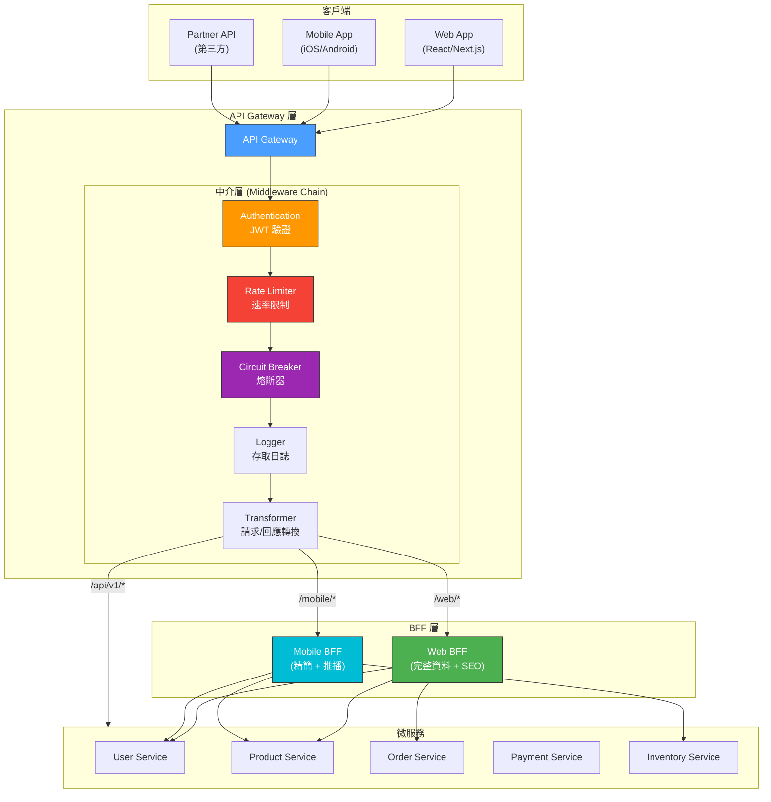
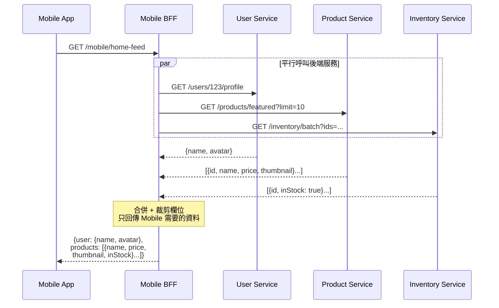
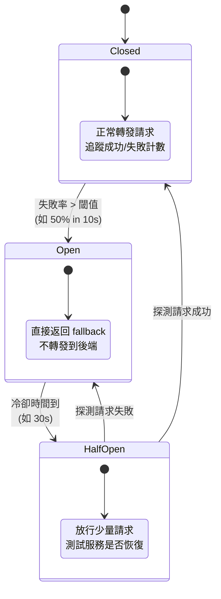
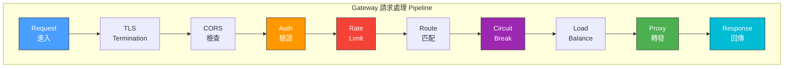

# API Gateway & BFF Pattern / API 閘道與 BFF 模式

## Intent / 意圖

API Gateway 是微服務架構中的單一入口點（single entry point），負責將客戶端請求路由到對應的後端服務，同時在邊界層統一處理橫切關注點（cross-cutting concerns）——身份驗證、速率限制、請求/回應轉換、熔斷、日誌和監控。BFF（Backend-for-Frontend）模式進一步為每種前端裝置（Web、Mobile、IoT）提供專屬的 API 聚合層，避免「一個 API 適配所有前端」的設計困境。

核心問題：**在數十個微服務的架構中，如何讓客戶端不需要知道每個服務的地址和協定，同時在邊界層統一處理認證、限流、熔斷等橫切關注點？當不同前端裝置（Web 需要完整資料、Mobile 需要精簡回應、IoT 只需要特定欄位）的 API 需求差異巨大時，如何避免後端 API 變成各前端需求的妥協產物？**

---

## Problem / 問題情境

**場景一：客戶端直接呼叫微服務的混亂** — 電商平台有 15 個微服務（User、Product、Order、Payment、Inventory、Shipping 等）。Web 前端為了顯示一個商品詳情頁面，需要呼叫 Product Service（取商品資訊）、Inventory Service（取庫存狀態）、Review Service（取評價）、Recommendation Service（取推薦商品）——四次 HTTP 呼叫，每次都需要附帶 JWT token，每次都需要處理不同的錯誤格式。Mobile 端因為頻寬限制，這四次往返延遲嚴重影響體驗。更糟糕的是，每個服務的認證邏輯各自實作，有的檢查 JWT signature，有的還驗證 token 是否在黑名單中，有的忘了驗。當需要全局限流時，沒有統一的入口可以攔截。

**場景二：Mobile 與 Web 的 API 衝突** — Product Service 為 Web 設計的 `/api/products/{id}` 回傳 50 個欄位（含完整描述、HTML 格式的富文本、高解析度圖片 URL 清單、SEO metadata）。Mobile 只需要 8 個欄位（名稱、價格、縮圖、庫存狀態）。但 Mobile 每次都被迫下載完整的 50 欄位回應，浪費頻寬且增加解析時間。PM 要求「Mobile 版本只回傳需要的欄位」，後端開始在 Product Service 中加入 `?fields=name,price,thumbnail` 的 sparse fieldset 邏輯——每個服務都要實作這套欄位過濾，且越來越多前端特定的邏輯滲透到領域服務中。

**場景三：限流和熔斷的缺失** — 某個合作夥伴的爬蟲程式每秒向 Product Service 發送 5000 個請求。因為沒有統一的入口限流，請求直接打到 Product Service，導致資料庫連線池耗盡。Product Service 當掉連帶影響了 Order Service（因為下單時需要查詢商品資訊），形成級聯故障。團隊花了 45 分鐘才定位到是 Product Service 過載，又花了 15 分鐘在每個服務前面加上臨時的限流。如果有 API Gateway 統一限流，在邊界層就能擋下異常流量，保護所有後端服務。

---

## Core Concepts / 核心概念

### API Gateway / API 閘道

API Gateway 是位於客戶端與後端服務之間的反向代理（reverse proxy）層，作為系統的單一入口點（single point of entry）。它的核心職責：

1. **請求路由（Request Routing）**：根據 URL path、HTTP method、header 等將請求轉發到對應的後端服務
2. **認證與授權（Authentication & Authorization）**：統一驗證 JWT/OAuth2 token，無需每個服務各自實作
3. **速率限制（Rate Limiting）**：在邊界層限制每個 client/IP/API key 的請求速率
4. **請求/回應轉換（Request/Response Transformation）**：協定轉換（REST ↔ gRPC）、Header 操作、Body 重寫
5. **熔斷（Circuit Breaking）**：偵測後端服務故障，自動停止向故障服務轉發請求
6. **負載均衡（Load Balancing）**：在同一服務的多個實例間分配請求
7. **快取（Caching）**：在 gateway 層快取回應，減少後端負載
8. **日誌與監控（Logging & Monitoring）**：統一收集存取日誌、延遲指標、錯誤率

### BFF（Backend-for-Frontend）/ 前端專屬後端

BFF 模式為每種前端裝置或前端應用建立一個專屬的 API 聚合層。每個 BFF 了解其對應前端的特定需求，負責：

- **API 聚合（API Composition）**：將多個微服務的回應合併為一個最佳化的回應
- **資料裁剪（Data Trimming）**：只回傳前端需要的欄位，減少 payload 大小
- **協定適配（Protocol Adaptation）**：Web BFF 提供 REST/GraphQL，Mobile BFF 提供 gRPC 或精簡的 JSON
- **前端特定邏輯（Frontend-Specific Logic）**：Mobile 需要推播通知整合、Web 需要 SEO metadata——這些邏輯放在 BFF 中，不污染領域服務

BFF 的關鍵原則是 **「由前端團隊擁有對應的 BFF」**——Web 前端團隊維護 Web BFF，Mobile 團隊維護 Mobile BFF，確保 BFF 能快速回應前端需求的變更，不需要跨團隊協調。

### Gateway vs Service Mesh / 閘道 vs 服務網格

| 維度 | API Gateway | Service Mesh |
|------|-------------|-------------|
| **位置** | 系統邊界（edge，面向外部客戶端） | 服務間（east-west，面向內部通訊） |
| **關注點** | 外部 API 管理、認證、限流、API 版本控制 | 服務間 mTLS、重試、熔斷、可觀測性 |
| **架構** | 集中式代理（centralized proxy） | 分散式 sidecar（每個服務旁一個代理） |
| **典型工具** | Kong、Envoy（as gateway）、AWS API Gateway | Istio、Linkerd、Consul Connect |
| **流量方向** | North-South（外部 → 內部） | East-West（內部 ↔ 內部） |

兩者不互斥——API Gateway 處理外部流量的邊界關注點，Service Mesh 處理內部服務間的通訊關注點。

### Request Aggregation / 請求聚合

Gateway 或 BFF 將客戶端的單一請求拆解為多個後端服務呼叫，平行發送，然後將多個回應合併為一個統一回應返回客戶端。

核心考量：
- **平行呼叫**：獨立的後端呼叫應平行發送（Rust 用 `tokio::join!`、Go 用 `errgroup`）
- **超時控制**：整體超時必須短於個別呼叫超時的總和
- **部分失敗**：某個後端服務失敗時，gateway 應回傳部分結果而非完全失敗（graceful degradation）
- **快取**：對變動頻率低的資料（如商品分類）在 gateway 層快取，減少後端呼叫

### Gateway Patterns / 閘道模式

| 模式 | 說明 | 適用場景 |
|------|------|---------|
| **Router（路由器）** | 純粹根據 path/header 轉發請求，不修改 payload | 簡單微服務路由 |
| **Aggregator（聚合器）** | 呼叫多個後端服務並合併回應 | 前端需要來自多個服務的資料 |
| **Offloader（卸載器）** | 將橫切關注點（auth、logging、TLS termination）從服務卸載到 gateway | 統一認證、TLS 終止 |
| **Facade（外觀）** | 為遺留系統提供現代化的 API 介面，隱藏內部複雜性 | 遺留系統現代化 |

### Kong / Envoy / 自建閘道比較

| 維度 | Kong | Envoy | 自建 Gateway |
|------|------|-------|-------------|
| **架構** | Nginx + Lua 插件系統 | C++ L7 代理，xDS API 動態配置 | 完全自訂 |
| **效能** | 高（基於 Nginx） | 極高（C++，專為大規模設計） | 取決於實作 |
| **擴展方式** | Lua / Go 插件 | WASM filter、C++ filter | 原生語言 |
| **學習曲線** | 低-中 | 中-高 | 取決於團隊能力 |
| **適用場景** | API 管理（認證、限流、API 文件） | Service Mesh data plane、高效能代理 | 特殊業務邏輯深度整合 |
| **管理介面** | Admin API + Kong Manager UI | 無（需要 control plane 如 Istio） | 自建 |

### Circuit Breaking at Gateway / 閘道層熔斷

Gateway 層的熔斷器監控每個後端服務的健康狀態。當某個服務的錯誤率超過閾值（如 50% 的請求在 5 秒內失敗），熔斷器「斷開」——後續請求直接返回 fallback 回應（如快取的舊資料、預設值、503 Service Unavailable），不再轉發到故障服務。

熔斷器三狀態：
1. **Closed（關閉）**：正常轉發請求，監控失敗率
2. **Open（斷開）**：直接返回 fallback，不轉發
3. **Half-Open（半開）**：定期放行少量請求測試服務是否恢復

---

## Architecture / 架構

### API Gateway 整體架構



### BFF 資料聚合流程



### 熔斷器狀態機



### Gateway 請求處理 Pipeline



---

## How It Works / 運作原理

API Gateway 的請求處理是一條精心設計的 middleware pipeline，每個階段處理特定的關注點：

1. **TLS Termination（TLS 終止）**：Gateway 負責解密 HTTPS 流量。內部服務間可以使用 HTTP（若在可信網路中）或 mTLS（Service Mesh 場景）。TLS 終止在 gateway 完成，後端服務不需要各自管理 TLS 憑證。

2. **CORS 處理**：Gateway 統一處理跨域請求（Cross-Origin Resource Sharing），根據配置的允許來源、方法、標頭回應 preflight 請求（OPTIONS）。避免每個服務各自實作 CORS 邏輯。

3. **身份驗證（Authentication）**：Gateway 提取請求中的 JWT token（通常在 `Authorization: Bearer <token>` header），驗證 token 的 signature 和 expiry。驗證通過後，將 token 中的 claims（user_id、roles、permissions）以內部 header 的形式（如 `X-User-Id`、`X-User-Roles`）傳遞給後端服務。後端服務信任這些 header（因為只有 gateway 能設定它們，外部請求的同名 header 在 gateway 層被清除）。

4. **速率限制（Rate Limiting）**：根據 client IP、API key、user ID 或自訂維度，使用滑動視窗（sliding window）或令牌桶（token bucket）演算法限制請求速率。超過限制的請求直接回傳 `429 Too Many Requests`。限流計數器通常存在 Redis 中（跨多個 gateway instance 共享）。

5. **路由匹配（Route Matching）**：根據 URL path、HTTP method、header、query parameter 等規則，將請求匹配到對應的後端服務。路由規則可以是靜態配置（config file）或動態載入（xDS API、Consul service catalog）。

6. **熔斷檢查（Circuit Breaking）**：在轉發前檢查目標服務的熔斷器狀態。若熔斷器為 Open 狀態，直接回傳 fallback 回應（503 + 快取的舊資料），不向後端發送請求。

7. **負載均衡（Load Balancing）**：從服務的多個健康實例中選擇一個轉發。常見演算法：Round Robin（輪詢）、Least Connections（最少連線）、Consistent Hashing（一致性雜湊，用於有狀態路由）。

8. **請求轉發（Proxying）**：將修改後的請求（添加了內部 header、可能轉換了協定）轉發到選定的後端實例。記錄請求開始時間以計算延遲。

9. **回應處理（Response Processing）**：收到後端回應後，gateway 可以執行回應轉換（如將內部錯誤格式統一為標準格式）、添加安全 header（如 `X-Content-Type-Options: nosniff`）、記錄存取日誌和指標。

10. **BFF 聚合流程**：當請求路由到 BFF 層時，BFF 解析客戶端請求，決定需要呼叫哪些後端服務。使用 `tokio::join!`（Rust）或 `errgroup`（Go）平行呼叫多個服務，設定每個呼叫的獨立超時和整體超時。收集所有回應後，BFF 進行資料裁剪（移除前端不需要的欄位）、資料轉換（格式化日期、計算衍生欄位）、合併回應，最後以前端最佳化的格式回傳。

---

## Rust 實作

以下展示一個簡易 API Gateway，包含請求路由、JWT 驗證中介層和速率限制。

```rust
// src/main.rs
// 簡易 API Gateway — Axum 0.8+, 含路由、認證、速率限制

use axum::{
    body::Body,
    extract::{Request, State},
    http::{header, HeaderValue, StatusCode, Uri},
    middleware::{self, Next},
    response::{IntoResponse, Json, Response},
    routing::{any, get},
    Router,
};
use hyper_util::{client::legacy::Client, rt::TokioExecutor};
use serde::{Deserialize, Serialize};
use std::collections::HashMap;
use std::sync::Arc;
use std::time::{Duration, Instant};
use tokio::net::TcpListener;
use tokio::sync::RwLock;

// ============================================================
// 速率限制器 — 滑動視窗計數器
// ============================================================

/// 每個 client 的速率限制狀態
struct RateLimitEntry {
    tokens: f64,
    last_refill: Instant,
}

/// Token Bucket 速率限制器
struct RateLimiter {
    entries: RwLock<HashMap<String, RateLimitEntry>>,
    max_tokens: f64,
    refill_rate: f64, // tokens per second
}

impl RateLimiter {
    fn new(max_tokens: f64, refill_rate: f64) -> Self {
        Self {
            entries: RwLock::new(HashMap::new()),
            max_tokens,
            refill_rate,
        }
    }

    /// 嘗試消耗一個 token，回傳是否允許請求
    async fn try_acquire(&self, client_id: &str) -> bool {
        let mut entries = self.entries.write().await;
        let now = Instant::now();

        let entry = entries.entry(client_id.to_string()).or_insert(RateLimitEntry {
            tokens: self.max_tokens,
            last_refill: now,
        });

        // 根據經過的時間補充 token
        let elapsed = now.duration_since(entry.last_refill).as_secs_f64();
        entry.tokens = (entry.tokens + elapsed * self.refill_rate).min(self.max_tokens);
        entry.last_refill = now;

        if entry.tokens >= 1.0 {
            entry.tokens -= 1.0;
            true
        } else {
            false
        }
    }
}

// ============================================================
// 路由配置
// ============================================================

/// 後端服務的路由映射
#[derive(Clone)]
struct RouteConfig {
    /// path prefix → 後端服務 URL
    routes: HashMap<String, String>,
}

impl RouteConfig {
    fn new() -> Self {
        let mut routes = HashMap::new();
        routes.insert("/api/users".to_string(), "http://user-service:3001".to_string());
        routes.insert("/api/products".to_string(), "http://product-service:3002".to_string());
        routes.insert("/api/orders".to_string(), "http://order-service:3003".to_string());
        Self { routes }
    }

    /// 根據請求 path 找到對應的後端服務 URL
    fn resolve_backend(&self, path: &str) -> Option<&str> {
        self.routes
            .iter()
            .find(|(prefix, _)| path.starts_with(prefix.as_str()))
            .map(|(_, url)| url.as_str())
    }
}

// ============================================================
// Gateway 狀態
// ============================================================

#[derive(Clone)]
struct GatewayState {
    rate_limiter: Arc<RateLimiter>,
    route_config: RouteConfig,
    http_client: Client<hyper_util::client::legacy::connect::HttpConnector, Body>,
}

// ============================================================
// JWT 驗證中介層（簡化版）
// ============================================================

/// JWT Claims（簡化版，生產環境應使用 jsonwebtoken crate 完整驗證）
#[derive(Debug, Serialize, Deserialize)]
struct Claims {
    sub: String,       // user_id
    roles: Vec<String>,
    exp: u64,
}

/// 模擬 JWT 驗證 — 生產環境應驗證 signature、expiry、issuer
fn validate_jwt(token: &str) -> Result<Claims, &'static str> {
    // 簡化：實際應使用 jsonwebtoken::decode 驗證
    // 這裡僅示範中介層的結構
    if token.is_empty() {
        return Err("empty token");
    }

    // 模擬解碼結果
    Ok(Claims {
        sub: "user-123".to_string(),
        roles: vec!["user".to_string()],
        exp: 9999999999,
    })
}

/// 認證中介層 — 驗證 JWT 並注入使用者資訊到 header
async fn auth_middleware(mut request: Request, next: Next) -> Result<Response, StatusCode> {
    // 健康檢查端點跳過認證
    if request.uri().path() == "/health" {
        return Ok(next.run(request).await);
    }

    let auth_header = request
        .headers()
        .get(header::AUTHORIZATION)
        .and_then(|v| v.to_str().ok())
        .and_then(|v| v.strip_prefix("Bearer "));

    match auth_header {
        Some(token) => match validate_jwt(token) {
            Ok(claims) => {
                // 將驗證結果注入內部 header，後端服務信任這些 header
                request.headers_mut().insert(
                    "X-User-Id",
                    HeaderValue::from_str(&claims.sub).unwrap(),
                );
                request.headers_mut().insert(
                    "X-User-Roles",
                    HeaderValue::from_str(&claims.roles.join(",")).unwrap(),
                );
                // 清除原始 Authorization header（可選，防止後端服務重複驗證）
                request.headers_mut().remove(header::AUTHORIZATION);

                Ok(next.run(request).await)
            }
            Err(err) => {
                tracing::warn!("JWT 驗證失敗: {}", err);
                Err(StatusCode::UNAUTHORIZED)
            }
        },
        None => {
            tracing::warn!("缺少 Authorization header");
            Err(StatusCode::UNAUTHORIZED)
        }
    }
}

/// 速率限制中介層
async fn rate_limit_middleware(
    State(state): State<GatewayState>,
    request: Request,
    next: Next,
) -> Result<Response, StatusCode> {
    // 使用 client IP 作為限流 key（生產環境應考慮 X-Forwarded-For）
    let client_ip = request
        .headers()
        .get("X-Forwarded-For")
        .and_then(|v| v.to_str().ok())
        .unwrap_or("unknown")
        .to_string();

    if !state.rate_limiter.try_acquire(&client_ip).await {
        tracing::warn!("速率限制觸發: client={}", client_ip);
        return Err(StatusCode::TOO_MANY_REQUESTS);
    }

    Ok(next.run(request).await)
}

// ============================================================
// 反向代理處理
// ============================================================

/// 將請求轉發到對應的後端服務
async fn proxy_handler(
    State(state): State<GatewayState>,
    request: Request,
) -> Result<Response, StatusCode> {
    let path = request.uri().path().to_string();

    let backend_url = state
        .route_config
        .resolve_backend(&path)
        .ok_or_else(|| {
            tracing::warn!("無匹配的後端路由: {}", path);
            StatusCode::NOT_FOUND
        })?;

    // 建構轉發 URL
    let query = request.uri().query().map(|q| format!("?{}", q)).unwrap_or_default();
    let forward_url = format!("{}{}{}", backend_url, path, query);
    let forward_uri: Uri = forward_url.parse().map_err(|_| StatusCode::BAD_GATEWAY)?;

    // 建構轉發請求
    let (mut parts, body) = request.into_parts();
    parts.uri = forward_uri;

    let forward_request = Request::from_parts(parts, body);

    // 發送請求到後端服務
    let start = Instant::now();
    let response = state
        .http_client
        .request(forward_request)
        .await
        .map_err(|err| {
            tracing::error!("後端服務呼叫失敗: {}", err);
            StatusCode::BAD_GATEWAY
        })?;

    let elapsed = start.elapsed();
    tracing::info!(
        "Proxy: {} → {} ({}ms)",
        path,
        backend_url,
        elapsed.as_millis()
    );

    Ok(response.into_response())
}

// ============================================================
// 健康檢查
// ============================================================

async fn health_check() -> Json<serde_json::Value> {
    Json(serde_json::json!({
        "status": "healthy",
        "service": "api-gateway",
    }))
}

// ============================================================
// 啟動
// ============================================================

#[tokio::main]
async fn main() {
    tracing_subscriber::fmt::init();

    let state = GatewayState {
        rate_limiter: Arc::new(RateLimiter::new(100.0, 10.0)), // 100 burst, 10/s refill
        route_config: RouteConfig::new(),
        http_client: Client::builder(TokioExecutor::new()).build_http(),
    };

    let app = Router::new()
        .route("/health", get(health_check))
        // 所有 /api/* 路徑交由 proxy handler 處理
        .route("/api/{*path}", any(proxy_handler))
        // 中介層執行順序：rate_limit → auth → handler
        .layer(middleware::from_fn(auth_middleware))
        .layer(middleware::from_fn_with_state(
            state.clone(),
            rate_limit_middleware,
        ))
        .with_state(state);

    let addr = "0.0.0.0:8080";
    println!("API Gateway 啟動於 {}", addr);

    let listener = TcpListener::bind(addr).await.unwrap();
    axum::serve(listener, app).await.unwrap();
}

// Output:
// API Gateway 啟動於 0.0.0.0:8080
// (curl -H "Authorization: Bearer test-token" http://localhost:8080/api/users/123)
// Proxy: /api/users/123 → http://user-service:3001 (15ms)
// (curl http://localhost:8080/api/unknown)
// 404 Not Found — 無匹配的後端路由
// (發送超過 100 次請求)
// 429 Too Many Requests — 速率限制觸發
```

### Cargo.toml

```toml
[package]
name = "api-gateway"
version = "0.1.0"
edition = "2024"

[dependencies]
axum = "0.8"
tokio = { version = "1", features = ["full"] }
serde = { version = "1", features = ["derive"] }
serde_json = "1"
hyper-util = { version = "0.1", features = ["client-legacy", "http1", "tokio"] }
tracing = "0.1"
tracing-subscriber = "0.3"
```

---

## Go 實作

以下展示使用 Go 標準庫 `net/http/httputil` 實作的反向代理閘道。

```go
// main.go
// API Gateway — Go 1.24+ 標準庫，含反向代理、JWT 驗證、速率限制

package main

import (
	"context"
	"encoding/json"
	"fmt"
	"log"
	"net/http"
	"net/http/httputil"
	"net/url"
	"os"
	"os/signal"
	"strings"
	"sync"
	"syscall"
	"time"
)

// ============================================================
// 速率限制器 — Token Bucket
// ============================================================

// RateLimiter 實作 token bucket 速率限制
type RateLimiter struct {
	mu         sync.Mutex
	entries    map[string]*rateLimitEntry
	maxTokens  float64
	refillRate float64 // tokens per second
}

type rateLimitEntry struct {
	tokens     float64
	lastRefill time.Time
}

// NewRateLimiter 建立新的速率限制器
func NewRateLimiter(maxTokens, refillRate float64) *RateLimiter {
	return &RateLimiter{
		entries:    make(map[string]*rateLimitEntry),
		maxTokens:  maxTokens,
		refillRate: refillRate,
	}
}

// TryAcquire 嘗試消耗一個 token，回傳是否允許
func (rl *RateLimiter) TryAcquire(clientID string) bool {
	rl.mu.Lock()
	defer rl.mu.Unlock()

	now := time.Now()
	entry, exists := rl.entries[clientID]
	if !exists {
		entry = &rateLimitEntry{
			tokens:     rl.maxTokens,
			lastRefill: now,
		}
		rl.entries[clientID] = entry
	}

	// 根據經過的時間補充 token
	elapsed := now.Sub(entry.lastRefill).Seconds()
	entry.tokens += elapsed * rl.refillRate
	if entry.tokens > rl.maxTokens {
		entry.tokens = rl.maxTokens
	}
	entry.lastRefill = now

	if entry.tokens >= 1.0 {
		entry.tokens -= 1.0
		return true
	}
	return false
}

// ============================================================
// 路由配置
// ============================================================

// RouteConfig 定義 path prefix 到後端服務的映射
type RouteConfig struct {
	routes map[string]*url.URL
}

// NewRouteConfig 建立路由配置
func NewRouteConfig() *RouteConfig {
	rc := &RouteConfig{
		routes: make(map[string]*url.URL),
	}

	backends := map[string]string{
		"/api/users":    "http://user-service:3001",
		"/api/products": "http://product-service:3002",
		"/api/orders":   "http://order-service:3003",
	}

	for prefix, rawURL := range backends {
		parsed, err := url.Parse(rawURL)
		if err != nil {
			log.Fatalf("無效的後端 URL %s: %v", rawURL, err)
		}
		rc.routes[prefix] = parsed
	}

	return rc
}

// ResolveBackend 根據 path 找到對應的後端服務
func (rc *RouteConfig) ResolveBackend(path string) (*url.URL, bool) {
	for prefix, backend := range rc.routes {
		if strings.HasPrefix(path, prefix) {
			return backend, true
		}
	}
	return nil, false
}

// ============================================================
// 中介層
// ============================================================

// Middleware 定義中介層函式簽章
type Middleware func(http.Handler) http.Handler

// Chain 將多個中介層串連成 pipeline
func Chain(handler http.Handler, middlewares ...Middleware) http.Handler {
	// 反向套用，讓第一個 middleware 最先執行
	for i := len(middlewares) - 1; i >= 0; i-- {
		handler = middlewares[i](handler)
	}
	return handler
}

// LoggingMiddleware 記錄每個請求的存取日誌
func LoggingMiddleware(next http.Handler) http.Handler {
	return http.HandlerFunc(func(w http.ResponseWriter, r *http.Request) {
		start := time.Now()
		next.ServeHTTP(w, r)
		log.Printf("[%s] %s %s (%v)",
			r.Method, r.URL.Path, r.RemoteAddr, time.Since(start))
	})
}

// AuthMiddleware 驗證 JWT token 並注入使用者資訊
func AuthMiddleware(next http.Handler) http.Handler {
	return http.HandlerFunc(func(w http.ResponseWriter, r *http.Request) {
		// 健康檢查跳過認證
		if r.URL.Path == "/health" {
			next.ServeHTTP(w, r)
			return
		}

		authHeader := r.Header.Get("Authorization")
		if !strings.HasPrefix(authHeader, "Bearer ") {
			http.Error(w, `{"error":"missing authorization token"}`, http.StatusUnauthorized)
			return
		}

		token := strings.TrimPrefix(authHeader, "Bearer ")

		// 簡化：生產環境應使用 jwt-go 完整驗證 signature 和 expiry
		userID, roles, err := validateJWT(token)
		if err != nil {
			http.Error(w, `{"error":"invalid token"}`, http.StatusUnauthorized)
			return
		}

		// 注入內部 header — 後端服務信任這些 header
		r.Header.Set("X-User-Id", userID)
		r.Header.Set("X-User-Roles", strings.Join(roles, ","))
		// 清除原始 Authorization header
		r.Header.Del("Authorization")

		next.ServeHTTP(w, r)
	})
}

// validateJWT 模擬 JWT 驗證（生產環境應使用完整的 JWT 庫）
func validateJWT(token string) (userID string, roles []string, err error) {
	if token == "" {
		return "", nil, fmt.Errorf("empty token")
	}
	// 模擬解碼
	return "user-123", []string{"user"}, nil
}

// RateLimitMiddleware 建立速率限制中介層
func RateLimitMiddleware(limiter *RateLimiter) Middleware {
	return func(next http.Handler) http.Handler {
		return http.HandlerFunc(func(w http.ResponseWriter, r *http.Request) {
			clientIP := r.Header.Get("X-Forwarded-For")
			if clientIP == "" {
				clientIP = r.RemoteAddr
			}

			if !limiter.TryAcquire(clientIP) {
				w.Header().Set("Retry-After", "10")
				http.Error(w, `{"error":"rate limit exceeded"}`, http.StatusTooManyRequests)
				return
			}

			next.ServeHTTP(w, r)
		})
	}
}

// ============================================================
// 反向代理閘道
// ============================================================

// Gateway 是 API Gateway 的核心結構
type Gateway struct {
	routeConfig *RouteConfig
	proxies     map[string]*httputil.ReverseProxy
}

// NewGateway 建立 Gateway 並為每個後端服務建立 reverse proxy
func NewGateway(config *RouteConfig) *Gateway {
	gw := &Gateway{
		routeConfig: config,
		proxies:     make(map[string]*httputil.ReverseProxy),
	}

	for prefix, backend := range config.routes {
		proxy := httputil.NewSingleHostReverseProxy(backend)

		// 自訂錯誤處理 — 後端不可用時回傳 502
		proxy.ErrorHandler = func(w http.ResponseWriter, r *http.Request, err error) {
			log.Printf("Proxy 錯誤 [%s]: %v", prefix, err)
			http.Error(w, `{"error":"backend service unavailable"}`, http.StatusBadGateway)
		}

		// 自訂 transport — 設定連線池和超時
		proxy.Transport = &http.Transport{
			MaxIdleConns:        100,
			MaxIdleConnsPerHost: 20,
			IdleConnTimeout:     90 * time.Second,
			ResponseHeaderTimeout: 10 * time.Second,
		}

		gw.proxies[prefix] = proxy
	}

	return gw
}

// ServeHTTP 實作 http.Handler 介面
func (gw *Gateway) ServeHTTP(w http.ResponseWriter, r *http.Request) {
	path := r.URL.Path

	// 健康檢查端點
	if path == "/health" {
		w.Header().Set("Content-Type", "application/json")
		json.NewEncoder(w).Encode(map[string]string{
			"status":  "healthy",
			"service": "api-gateway",
		})
		return
	}

	// 路由匹配
	for prefix, proxy := range gw.proxies {
		if strings.HasPrefix(path, prefix) {
			log.Printf("Proxy: %s → %s", path, gw.routeConfig.routes[prefix])
			proxy.ServeHTTP(w, r)
			return
		}
	}

	// 無匹配路由
	http.Error(w, `{"error":"no matching route"}`, http.StatusNotFound)
}

// ============================================================
// 主程式
// ============================================================

func main() {
	port := os.Getenv("PORT")
	if port == "" {
		port = "8080"
	}

	routeConfig := NewRouteConfig()
	gateway := NewGateway(routeConfig)
	rateLimiter := NewRateLimiter(100, 10) // 100 burst, 10/s refill

	// 組裝中介層 pipeline
	handler := Chain(
		gateway,
		LoggingMiddleware,
		AuthMiddleware,
		RateLimitMiddleware(rateLimiter),
	)

	server := &http.Server{
		Addr:         ":" + port,
		Handler:      handler,
		ReadTimeout:  15 * time.Second,
		WriteTimeout: 15 * time.Second,
		IdleTimeout:  60 * time.Second,
	}

	// 優雅關閉
	shutdownCh := make(chan os.Signal, 1)
	signal.Notify(shutdownCh, syscall.SIGINT, syscall.SIGTERM)

	go func() {
		log.Printf("API Gateway 啟動於 :%s\n", port)
		if err := server.ListenAndServe(); err != nil && err != http.ErrServerClosed {
			log.Fatalf("啟動失敗: %v\n", err)
		}
	}()

	sig := <-shutdownCh
	log.Printf("收到信號 %s，開始優雅關閉...\n", sig)

	ctx, cancel := context.WithTimeout(context.Background(), 30*time.Second)
	defer cancel()

	if err := server.Shutdown(ctx); err != nil {
		log.Fatalf("強制關閉: %v\n", err)
	}
	log.Println("API Gateway 已關閉")
}

// Output:
// 2026/02/18 10:00:00 API Gateway 啟動於 :8080
// (curl -H "Authorization: Bearer test" http://localhost:8080/api/users/123)
// 2026/02/18 10:00:01 Proxy: /api/users/123 → http://user-service:3001
// [GET] /api/users/123 127.0.0.1:54321 (12ms)
// (curl http://localhost:8080/api/unknown-service)
// {"error":"no matching route"} (404)
// (超過限制)
// {"error":"rate limit exceeded"} (429)
```

---

## Rust vs Go 對照表

| 比較維度 | Rust | Go |
|---------|------|-----|
| **反向代理實作** | 需要 `hyper-util` client 手動建構轉發請求，對 HTTP 協定的控制更細膩 | `httputil.ReverseProxy` 一行建立，標準庫原生支援，非常便利 |
| **中介層模式** | Axum 的 `middleware::from_fn` + Tower `Layer` trait，型別安全但學習曲線陡峭 | `func(http.Handler) http.Handler` 閉包模式，簡單直覺 |
| **並發請求聚合** | `tokio::join!` 或 `futures::join_all`，編譯期保證無 data race | `errgroup.Go` + goroutine，runtime 檢測 data race（`-race` flag） |
| **型別安全性** | 路由匹配、header 操作在編譯期檢查型別，錯誤在編譯時發現 | 路由匹配和 header 操作基於字串，錯誤在運行時發現 |
| **效能** | 極高吞吐量（接近 Envoy 等級），適合超高流量場景 | 高吞吐量，goroutine 調度高效，適合大多數場景 |
| **生態系統** | Gateway 相關 crate 較少，多數需自建 | 豐富的 reverse proxy 生態（Traefik 以 Go 編寫） |
| **錯誤處理** | `Result<T, E>` 強制處理每個錯誤路徑 | `error` interface，容易遺漏錯誤檢查（雖然 `errcheck` linter 可補救） |

---

## When to Use / 適用場景

**場景一：微服務架構的統一入口** — 當系統從 monolith 拆分為多個微服務時，API Gateway 提供穩定的外部 API 端點。客戶端只需要知道 gateway 的地址，不需要知道每個微服務的位置。Gateway 統一處理認證、限流、日誌，避免每個服務重複實作。

**場景二：多平台前端需要不同的 API 格式** — Web 需要完整的 HTML/JSON 回應含 SEO metadata，Mobile 需要精簡的 JSON + 推播整合，第三方合作夥伴需要穩定的 API v1。BFF 模式為每種前端提供最佳化的 API，同時保持後端領域服務的純淨。

**場景三：遺留系統現代化** — 在 monolith 前面放置 API Gateway，逐步將流量從 monolith 路由到新的微服務（Strangler Fig Pattern）。Gateway 作為流量切換的控制點，新舊系統可以並行運行。

---

## When NOT to Use / 不適用場景

**反模式一：在 Gateway 中放置業務邏輯** — Gateway 應只包含橫切關注點（認證、限流、路由），不應包含業務邏輯（如計算折扣、驗證訂單規則）。一旦業務邏輯進入 gateway，它就變成另一個 monolith——所有服務的變更都需要同時修改 gateway，gateway 團隊成為瓶頸。

**反模式二：單一服務架構使用 API Gateway** — 如果系統只有一個後端服務，加一個 API Gateway 只是增加了一個網路跳轉和運維負擔。此時直接在服務中處理認證和限流更合理。等服務拆分為多個微服務時再引入 gateway。

**反模式三：每個 BFF 重複實作相同的業務邏輯** — BFF 應只做聚合和裁剪，不應在每個 BFF 中重複實作相同的業務規則。如果發現多個 BFF 都在做相同的資料驗證或計算，這些邏輯應該下沉到共享的領域服務中。

---

## Real-World Examples / 真實世界案例

### Netflix — Zuul API Gateway

Netflix 的 Zuul 是最知名的 API Gateway 之一，處理每秒數十萬的請求：

- **動態路由**：Zuul 的路由規則可以在不重新部署的情況下動態更新，支援金絲雀部署（canary）——將 5% 的流量路由到新版本服務
- **Filter 架構**：請求經過 pre-filter（認證、限流）→ routing filter（選擇後端）→ post-filter（添加 header、記錄指標）
- **Origin 彈性**：當某個後端服務出現問題，Zuul 可以自動切換到 fallback origin（如快取服務）
- **insight**：Netflix 後來從 Zuul 1（基於 Servlet）遷移到 Zuul 2（基於 Netty 非同步），吞吐量提升 10 倍

### Shopify — BFF for Mobile

Shopify 為其 Mobile App 建立了專屬的 BFF：

- **GraphQL BFF**：Mobile BFF 提供 GraphQL API，讓 Mobile 端精確查詢需要的欄位，減少 over-fetching
- **資料聚合**：一次 GraphQL query 內部聚合了 Product Service、Inventory Service、Pricing Service 的資料
- **效能最佳化**：BFF 預先將多個後端回應拼接為 Mobile 最佳化的 payload，單次網路往返取代多次呼叫

### Stripe — API Gateway 層的版本管理

Stripe 的 API Gateway 處理 API 版本兼容性：

- **版本路由**：客戶端指定 `Stripe-Version: 2024-01-01` header，Gateway 將請求路由到對應版本的處理邏輯
- **向後相容轉換**：Gateway 在回應階段將新版本的內部格式轉換為客戶端指定版本的格式
- **每個版本的行為差異**都記錄在 Gateway 的 version changelog 中

---

## Interview Questions / 面試常見問題

### Q1: API Gateway 和 Reverse Proxy 有什麼區別？

**答**：Reverse Proxy（反向代理）是一個通用的網路概念——它代替後端伺服器接收客戶端請求並轉發。Nginx、HAProxy 都是反向代理。API Gateway 是反向代理的**特化版本**，專為 API 管理設計，在反向代理的基礎上增加了 API 層級的功能：

1. **API 感知**：API Gateway 理解 API 的語義（REST 的 path/method 匹配、gRPC 的 service/method 匹配），而普通反向代理只基於 L4/L7 規則轉發
2. **認證整合**：內建 JWT 驗證、OAuth2 flow、API key 管理
3. **速率限制**：按 API key、使用者、API endpoint 維度限流
4. **請求/回應轉換**：協定轉換（REST → gRPC）、payload 修改
5. **API 版本管理**：根據 header 或 path 路由到不同版本
6. **開發者入口**：API 文件、API key 發放、使用量追蹤

簡單說：反向代理是 L4/L7 的流量轉發，API Gateway 是 L7 的 API 管理平台。

### Q2: BFF 模式和 API Gateway 的聚合功能有什麼區別？何時選擇 BFF？

**答**：API Gateway 的聚合是**通用的請求聚合**——將多個後端呼叫合併為一個回應。它通常是配置驅動的（如 Apollo Federation、KrakenD 的 JSON 配置），不含業務邏輯。

BFF 是**前端專屬的 API 層**，它的核心差異在於：

1. **擁有權不同**：BFF 由前端團隊擁有和維護，可以快速回應前端需求變更；API Gateway 聚合由平台團隊維護
2. **邏輯密度不同**：BFF 可以包含前端特定的邏輯（如 Mobile 的推播通知整合、Web 的 SEO metadata 注入），API Gateway 只做通用轉發
3. **生命週期不同**：BFF 隨前端版本演進，可以為不同版本的 App 提供不同的 BFF 端點；API Gateway 的聚合規則是全域的

選擇 BFF 的時機：(1) 不同前端的 API 需求差異大到無法用 sparse fieldset 解決；(2) 前端團隊需要獨立控制 API 演進速度；(3) 需要在 API 層做前端特定的轉換（如為 Mobile 壓縮圖片 URL、為 Web 注入 SSR 資料）。

### Q3: API Gateway 如何避免成為單點故障（Single Point of Failure）？

**答**：API Gateway 作為所有流量的唯一入口，確實是潛在的單點故障。緩解策略：

1. **水平擴展**：Gateway 應設計為無狀態（stateless），速率限制的計數器存在 Redis，路由配置存在 etcd/Consul。多個 Gateway 實例平行運行，前面用 L4 負載均衡器（如 AWS NLB）分配流量。
2. **多區域部署**：在每個可用區（AZ）部署 Gateway 實例，搭配 DNS failover 或 Global Load Balancer。
3. **短路機制**：Gateway 自身的健康檢查——如果 Gateway 無法連接到 Redis（限流計數器），應該降級為「放行所有請求」而非「拒絕所有請求」（fail-open vs fail-close，視安全需求決定）。
4. **減少 Gateway 的處理邏輯**：Gateway 越輕量，故障的機率越低。複雜的業務邏輯不應放在 Gateway 中。
5. **灰度部署 Gateway**：Gateway 的配置變更或版本更新應使用 canary 部署，先將 5% 的流量路由到新版 Gateway 觀察。

### Q4: 如何在 API Gateway 實現速率限制？有哪些演算法？

**答**：常見的速率限制演算法：

1. **Fixed Window（固定視窗）**：將時間分為固定區間（如每分鐘），每個區間獨立計數。簡單但有邊界問題——在視窗交界處可能出現 2x 的突發流量（前一視窗的最後 1 秒 + 後一視窗的第 1 秒）。
2. **Sliding Window Log（滑動視窗日誌）**：記錄每個請求的時間戳，計算「過去 N 秒內的請求數」。精確但記憶體消耗大。
3. **Sliding Window Counter（滑動視窗計數器）**：結合固定視窗和滑動視窗——用前一視窗的計數乘以時間比例加上當前視窗的計數，近似滑動視窗。精確度和效能的良好平衡。
4. **Token Bucket（令牌桶）**：桶中以固定速率產生 token（如每秒 10 個），每個請求消耗一個 token。桶有最大容量（burst size）。允許短期突發但長期平均不超過速率。
5. **Leaky Bucket（漏桶）**：請求進入固定容量的佇列，以固定速率處理。超出佇列的請求被丟棄。產生穩定的輸出速率，但不允許突發。

生產環境通常使用 **Token Bucket**（Redis + Lua script 實現原子操作），因為它允許合理的突發流量同時保持長期平均速率。多個 Gateway 實例共享 Redis 中的計數器，確保全域一致的限流。

### Q5: 請解釋 Strangler Fig Pattern 如何搭配 API Gateway 實現系統遷移。

**答**：Strangler Fig Pattern（絞殺者模式）借鑑了自然界中榕樹（strangler fig）逐漸包圍宿主樹的過程——新系統逐步取代舊系統，直到舊系統完全被「絞殺」。

API Gateway 在這個過程中扮演**流量路由器**的角色：

1. **初始狀態**：所有流量通過 Gateway 路由到 monolith
2. **提取第一個服務**：將 User 相關的功能從 monolith 拆出為獨立的 User Service。在 Gateway 中設定 `/api/users/*` → User Service，其餘路由仍指向 monolith
3. **逐步遷移**：每次拆出一個服務，在 Gateway 中更新路由規則。monolith 處理的路由越來越少
4. **金絲雀驗證**：每個新服務上線時，先將 5% 的流量路由到新服務，95% 仍走 monolith。比較回應的正確性和延遲。確認無誤後逐步提升到 100%
5. **完成遷移**：所有路由都指向新的微服務，monolith 被移除

Gateway 的價值在於：客戶端完全無感知遷移過程——它始終只和 Gateway 通訊，不知道後端是 monolith 還是微服務。

---

## Pitfalls / 常見陷阱

### 陷阱 1：Gateway 變成另一個 Monolith

```yaml
# 錯誤：將業務邏輯塞進 Gateway 的路由配置中
routes:
  - path: /api/orders
    backend: order-service
    pre_filters:
      - validate_order_items    # ← 業務邏輯！
      - calculate_discount      # ← 業務邏輯！
      - check_inventory         # ← 業務邏輯！

# 正確：Gateway 只處理橫切關注點
routes:
  - path: /api/orders
    backend: order-service
    pre_filters:
      - authenticate            # ✓ 橫切關注點
      - rate_limit              # ✓ 橫切關注點
      - request_logging         # ✓ 橫切關注點
```

**說明**：一旦業務邏輯進入 Gateway，它就成為所有服務變更的瓶頸。每次 Order Service 的折扣規則改變，都需要同時修改 Gateway 配置。Gateway 團隊變成全公司的阻塞點。

### 陷阱 2：忽略 Gateway 層的超時配置

```go
// 錯誤：使用 http.DefaultClient，無超時限制
// 後端服務 hang 住時，Gateway 的 goroutine/thread 耗盡
proxy := httputil.NewSingleHostReverseProxy(backendURL)
// DefaultTransport 的 ResponseHeaderTimeout 為 0（無限等待）

// 正確：為每個後端設定明確的超時
proxy := httputil.NewSingleHostReverseProxy(backendURL)
proxy.Transport = &http.Transport{
    ResponseHeaderTimeout: 10 * time.Second, // 後端必須在 10 秒內回應 header
    MaxIdleConnsPerHost:   20,
    IdleConnTimeout:       90 * time.Second,
}
```

**說明**：如果後端服務 hang 住（如 deadlock、full GC），沒有超時的 Gateway 會持續等待，佔用 goroutine/thread。在高流量下，Gateway 的所有 goroutine 都被 hang 住的後端服務佔滿，導致 Gateway 本身無法處理任何新請求——一個慢服務拖垮了整個 Gateway。

### 陷阱 3（Rust 特定）：Axum middleware 中的生命週期問題

```rust
// 錯誤：在 middleware 中使用 &str 引用會有生命週期問題
async fn auth_middleware(request: Request, next: Next) -> Response {
    let token: &str = request
        .headers()
        .get("Authorization")
        .unwrap()
        .to_str()
        .unwrap(); // 這個 &str 的生命週期綁定到 request

    // 若需要在後續使用 token（如傳遞給另一個 async fn），可能遇到生命週期錯誤
    let result = validate_token_async(token).await; // ← 可能 compile error
    next.run(request).await
}

// 正確：提前 clone 為 String，避免生命週期問題
async fn auth_middleware(request: Request, next: Next) -> Response {
    let token: String = request
        .headers()
        .get("Authorization")
        .and_then(|v| v.to_str().ok())
        .unwrap_or_default()
        .to_string(); // clone 為 owned String

    let result = validate_token_async(&token).await; // ✓ 安全
    next.run(request).await
}
```

### 陷阱 4（Go 特定）：ReverseProxy 未修改 Host header

```go
// 錯誤：httputil.ReverseProxy 預設保留原始 Host header
// 後端服務收到的 Host 是 gateway 的地址而非自己的地址
proxy := httputil.NewSingleHostReverseProxy(backendURL)
// 客戶端發送 Host: api-gateway.example.com
// 後端收到 Host: api-gateway.example.com ← 可能導致路由問題

// 正確：修改 Director 函式，設定正確的 Host
proxy := httputil.NewSingleHostReverseProxy(backendURL)
originalDirector := proxy.Director
proxy.Director = func(req *http.Request) {
    originalDirector(req)
    req.Host = backendURL.Host // 設定為後端服務的 Host
}
```

**說明**：`httputil.ReverseProxy` 的 `Director` 函式預設只修改 `URL`，不修改 `Host` header。許多後端服務（特別是使用 virtual hosting 的服務）依賴 `Host` header 來路由請求。不修改 Host 可能導致後端的 routing 或 TLS certificate validation 失敗。

### 陷阱 5：Gateway 層的 Rate Limit 計數器不共享

```go
// 錯誤：每個 Gateway 實例使用本地記憶體計數器
// 3 個 Gateway 實例，每個允許 100 req/s → 實際允許 300 req/s
limiter := NewInMemoryRateLimiter(100) // 本地計數器

// 正確：使用 Redis 共享計數器
limiter := NewRedisRateLimiter(redisClient, 100) // Redis Lua script 原子操作
```

**說明**：在多實例部署的 Gateway 中，如果速率限制計數器存在每個實例的記憶體中，實際的限流上限是「單實例限制 x 實例數」。必須使用共享的存儲（Redis）確保全域一致的限流。

### 陷阱 6（Rust 特定）：Tower middleware 的 Service trait 複雜性

```rust
// 錯誤：直接實作 Tower Service trait 非常冗長
// （需要 poll_ready、call、Future type 等），初學者容易出錯
impl<S> Service<Request> for MyMiddleware<S>
where
    S: Service<Request, Response = Response>,
    S::Future: Send + 'static,
{
    // 20+ 行 boilerplate...
}

// 正確：使用 Axum 的 from_fn 或 from_fn_with_state 簡化
async fn my_middleware(request: Request, next: Next) -> Response {
    // 簡潔的函式簽名，Axum 自動處理 Service trait 實作
    next.run(request).await
}
let app = Router::new()
    .layer(middleware::from_fn(my_middleware));
```

---

## Cross-references / 交叉引用

- [[04_api_design_rest]] — Gateway 路由 RESTful API 的最佳實踐
- [[05_api_design_grpc_graphql]] — Gateway 的協定轉換（REST ↔ gRPC）
- [[07_microservices_vs_monolith]] — Gateway 是微服務架構的核心元件
- [[20_rate_limiting]] — 速率限制演算法的深入討論
- [[32_load_balancing_service_discovery]] — Gateway 的負載均衡和服務發現整合

---

## References / 參考資料

- Sam Newman, "Building Microservices" — Chapter on API Gateway and BFF patterns
- Chris Richardson, "Microservices Patterns" — API Gateway pattern, API Composition pattern
- Netflix Zuul Wiki: https://github.com/Netflix/zuul/wiki
- Kong API Gateway 文件: https://docs.konghq.com/
- Envoy Proxy 文件: https://www.envoyproxy.io/docs
- Martin Fowler — BFF Pattern: https://samnewman.io/patterns/architectural/bff/
