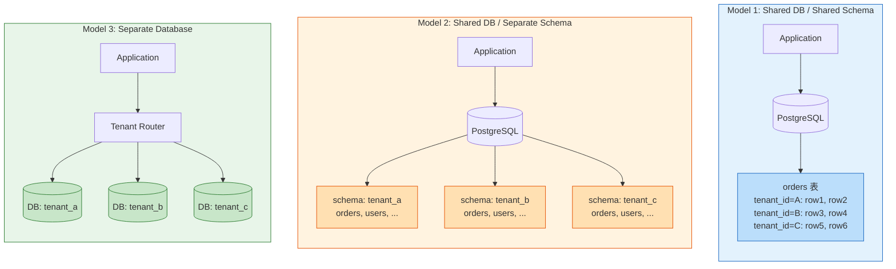
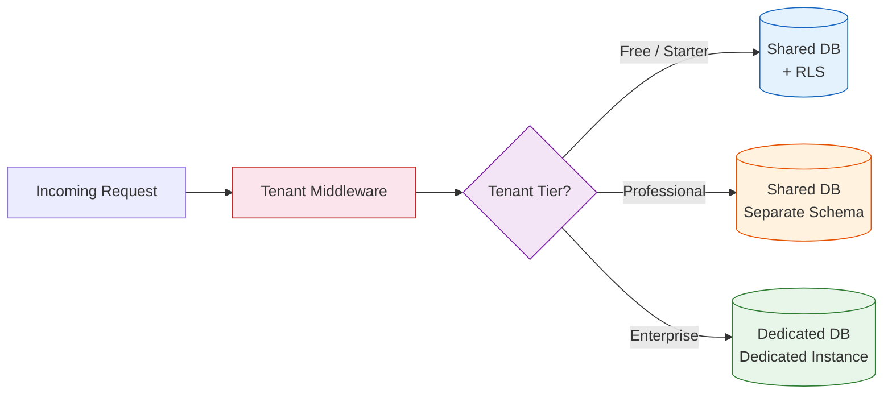

# Multi-Tenancy Patterns / 多租戶架構模式

## Intent / 意圖

多租戶架構的核心問題是**如何讓一套應用程式同時安全地服務多個互不信任的租戶（tenant），在共享基礎設施的同時保證資料隔離、效能公平與客製化彈性**。SaaS 產品的商業模式仰賴多租戶——若每個客戶都需要獨立部署一套完整的系統，營運成本將隨客戶數線性甚至超線性成長，使低價客戶變得不可經營。

---

## Problem / 問題情境

**場景一：忘記 WHERE 條件導致跨租戶資料洩漏** — 某 SaaS 專案管理平台有 800 家企業客戶，採用「共享資料庫 + tenant_id 欄位」模型。一位新進工程師在實作匯出功能時撰寫了 `SELECT * FROM tasks WHERE status = 'done'`，忘記加上 `AND tenant_id = ?`。上線後租戶 A 的管理者發現匯出報表中出現了其他公司的任務資料。事件觸發資安通報，客戶信任嚴重受損，需要 SOC 2 重新稽核。根本原因：系統缺乏強制性的租戶資料過濾機制，完全依賴開發者記憶。

**場景二：Noisy Neighbor 導致全平台效能退化** — CRM SaaS 平台共享一個 PostgreSQL cluster。某大型企業客戶匯入 500 萬筆聯絡人資料後，觸發一個全表掃描的報表查詢（`SELECT COUNT(*) FROM contacts GROUP BY region`），佔用了資料庫 90% 的 I/O 頻寬。其他 499 家租戶的 API 回應時間從 50ms 飆升至 8 秒，SLA 全面違反。根本原因：缺乏 per-tenant 資源隔離與查詢管控。

**場景三：合規需求迫使混合隔離模型** — 金融科技 SaaS 提供合規報表服務。大部分客戶接受共享資料庫模型（成本低），但三家銀行客戶要求資料必須存放在獨立資料庫、且位於特定地理區域（data residency）。團隊面臨兩難：為三家銀行部署獨立資料庫會大幅增加維運複雜度（migration 要跑 N+1 次），但拒絕則失去高價值客戶。根本原因：架構設計之初未考慮混合隔離模型的擴展性。

---

## Core Concepts / 核心概念

### Tenant / 租戶

在多租戶系統中，tenant 是**資料隔離與計費的最小單位**。一個 tenant 通常對應一個組織（organization）或一個付費客戶（customer account）。Tenant 內部可能有多個使用者（user），但使用者之間共享同一個 tenant 的資料空間。Tenant 的識別通常透過 tenant_id（UUID 或整數）實現，並從 JWT claim、subdomain、HTTP header 或 URL path 中提取。

### Shared Database, Shared Schema（共享資料庫、共享 Schema）

所有租戶的資料存放在同一組表中，以 `tenant_id` 欄位區分。這是**成本最低、管理最簡單**的模型，適合租戶數量大但資料量小的 SaaS。優點：一次 migration 即可更新所有租戶、連線池共用效率高。缺點：隔離性最弱——必須在每個查詢中加上 tenant_id 過濾條件；一個租戶的大查詢會影響其他所有租戶（noisy neighbor）。

### Shared Database, Separate Schema（共享資料庫、獨立 Schema）

每個租戶擁有自己的 database schema（例如 PostgreSQL 的 `tenant_abc.orders`），但共享同一個資料庫實例。隔離性中等——SQL 注入無法跨 schema 存取、migration 需要對所有 schema 執行但可以自動化。適合中型 SaaS，租戶數量在數百到數千之間。缺點：PostgreSQL 的 `search_path` 切換有一定開銷，且大量 schema 會增加 catalog 的管理負擔。

### Separate Database（獨立資料庫）

每個租戶擁有完全獨立的資料庫實例（或 cluster）。**隔離性最強**——效能完全獨立、資料物理隔離、可為 VIP 租戶提供不同等級的硬體規格與地理位置。但管理成本最高——1000 個租戶意味著 1000 個資料庫實例、1000 組連線池、每次 migration 要執行 1000 次。適合企業級 SaaS 或有嚴格合規需求的場景。

### Row-Level Security (RLS) / 列級安全

PostgreSQL 提供的原生功能，允許在資料庫層面定義**基於行的存取政策（policy）**。啟用 RLS 後，即使應用程式忘記加 `WHERE tenant_id = ?`，資料庫也會自動過濾不屬於當前 tenant 的行。這是多租戶資料隔離的**最後一道防線**——將安全責任從應用層下推到資料庫層。

### Tenant Context Propagation / 租戶上下文傳播

從請求入口（HTTP header、JWT、subdomain）提取 tenant_id 後，將其注入至 request context 中，確保整個請求生命週期（middleware → handler → service → repository → database query）都能取得當前 tenant。在分散式系統中，tenant context 還需要透過 gRPC metadata 或 message header 傳播至下游服務。

### Tenant-Aware Connection Pool / 租戶感知連線池

在 separate database 或 separate schema 模型中，連線池需要根據 tenant 動態路由至正確的資料庫或 schema。常見策略：(1) 每個 tenant 維護獨立的連線池——隔離性最強但資源消耗大；(2) 共享連線池 + 連線取得後設定 `SET search_path`——資源效率高但有切換開銷；(3) 混合模型——VIP tenant 用獨立連線池，一般 tenant 共享。

### Noisy Neighbor Mitigation / 噪音鄰居緩解

防止一個租戶的異常行為影響其他租戶的策略組合：per-tenant rate limiting（API 層限流）、per-tenant connection quota（資料庫連線配額）、per-tenant query timeout（查詢逾時）、per-tenant resource quota（CPU/Memory/Storage 配額）、以及 tenant-level circuit breaker（當某租戶的錯誤率過高時暫時限制其存取）。

---

## Architecture / 架構

### 三種多租戶隔離模型比較



### 租戶上下文傳播與 RLS 架構

```mermaid
sequenceDiagram
    participant Client
    participant Gateway as API Gateway
    participant MW as Tenant Middleware
    participant Handler as Request Handler
    participant DB as PostgreSQL + RLS

    Client->>Gateway: POST /api/tasks<br/>Authorization: Bearer <jwt>
    Gateway->>MW: 提取 tenant_id from JWT
    MW->>MW: 注入 tenant_id<br/>至 request context
    MW->>Handler: ctx.tenant_id = "acme_corp"
    Handler->>DB: SET app.current_tenant = 'acme_corp';<br/>INSERT INTO tasks (title) VALUES ('...');
    DB->>DB: RLS Policy 自動附加<br/>tenant_id = current_setting('app.current_tenant')
    DB-->>Handler: OK (row inserted with tenant_id = 'acme_corp')
    Handler-->>Client: 201 Created
```

### 混合隔離模型（Hybrid Model）



---

## How It Works / 運作原理

### Shared Schema + RLS 的完整運作流程

1. **建立資料表時加入 tenant_id 欄位**：所有業務表都必須包含 `tenant_id` 欄位（通常為 UUID），並建立複合索引 `(tenant_id, id)` 或 `(tenant_id, <常用查詢欄位>)` 以確保查詢效率。

2. **啟用 Row-Level Security**：對每張表執行 `ALTER TABLE tasks ENABLE ROW LEVEL SECURITY;`，然後建立 policy：`CREATE POLICY tenant_isolation ON tasks USING (tenant_id = current_setting('app.current_tenant')::uuid);`。

3. **請求入口提取 tenant_id**：Tenant middleware 從 JWT 的 `tenant_id` claim（或 subdomain、X-Tenant-Id header）中提取 tenant 識別。驗證 tenant 是否存在且處於 active 狀態。

4. **注入 tenant context**：將 tenant_id 寫入 request context（Rust 的 `axum::Extension` 或 Go 的 `context.WithValue`），供後續所有層使用。

5. **資料庫連線設定 session variable**：在每次資料庫操作前，執行 `SET LOCAL app.current_tenant = '<tenant_id>';`（使用 `SET LOCAL` 確保只影響當前 transaction）。RLS policy 會讀取這個 session variable 來過濾資料。

6. **執行業務查詢**：應用程式的 SQL 查詢**不需要**手動加 `WHERE tenant_id = ?`（雖然加上可以作為額外保險，也有助於 query planner 使用正確的索引）。RLS 會自動在 query 執行計畫中加入過濾條件。

7. **寫入資料時自動填入 tenant_id**：透過 database trigger 或 application code，確保 INSERT 時的 tenant_id 與當前 session 的 tenant 一致。如果不一致，RLS policy 會阻擋寫入（返回 0 rows affected 或 error，取決於 policy 定義）。

8. **連線歸還時清除 session variable**：連線池歸還連線時必須重置 `app.current_tenant`（`RESET app.current_tenant;` 或 `DISCARD ALL;`），避免下一個 tenant 的請求意外繼承前一個 tenant 的 context。

---

## Rust 實作

以下實作使用 Axum 0.8 + sqlx + PostgreSQL，展示 tenant middleware 與 RLS 查詢的完整流程。

```rust
// Cargo.toml dependencies:
// axum = "0.8"
// tokio = { version = "1", features = ["full"] }
// sqlx = { version = "0.8", features = ["runtime-tokio", "postgres", "uuid"] }
// serde = { version = "1", features = ["derive"] }
// serde_json = "1"
// uuid = { version = "1", features = ["v4", "serde"] }
// tower-http = { version = "0.6", features = ["trace"] }
// jsonwebtoken = "9"

use axum::{
    extract::{Request, State},
    http::{HeaderMap, StatusCode},
    middleware::{self, Next},
    response::{IntoResponse, Json},
    routing::{get, post},
    Router,
};
use serde::{Deserialize, Serialize};
use sqlx::postgres::PgPoolOptions;
use sqlx::PgPool;
use std::sync::Arc;
use uuid::Uuid;

// ── Tenant 上下文結構 ──────────────────────────────────────────

/// 代表已驗證的租戶上下文，從 JWT 中提取
#[derive(Debug, Clone)]
struct TenantContext {
    tenant_id: Uuid,
    tenant_name: String,
    tier: TenantTier,
}

#[derive(Debug, Clone, PartialEq)]
enum TenantTier {
    Free,
    Professional,
    Enterprise,
}

// ── 資料模型 ───────────────────────────────────────────────────

#[derive(Debug, Serialize, Deserialize, sqlx::FromRow)]
struct Task {
    id: Uuid,
    tenant_id: Uuid,
    title: String,
    status: String,
    created_at: chrono::NaiveDateTime,
}

#[derive(Debug, Deserialize)]
struct CreateTaskRequest {
    title: String,
}

// ── 應用狀態 ───────────────────────────────────────────────────

#[derive(Clone)]
struct AppState {
    db_pool: PgPool,
}

// ── Tenant Middleware ──────────────────────────────────────────

/// 從請求 header 中提取 tenant_id 並注入至 extensions
/// 生產環境中應從 JWT claim 提取，此處簡化為 X-Tenant-Id header
async fn tenant_middleware(
    State(state): State<Arc<AppState>>,
    mut request: Request,
    next: Next,
) -> Result<impl IntoResponse, StatusCode> {
    // 1. 提取 tenant_id
    let tenant_id_header = request
        .headers()
        .get("X-Tenant-Id")
        .and_then(|v| v.to_str().ok())
        .ok_or(StatusCode::UNAUTHORIZED)?;

    let tenant_id: Uuid = tenant_id_header
        .parse()
        .map_err(|_| StatusCode::BAD_REQUEST)?;

    // 2. 驗證 tenant 存在且為 active（生產環境可快取）
    let tenant_record = sqlx::query_as::<_, (String, String)>(
        "SELECT name, tier FROM tenants WHERE id = $1 AND status = 'active'"
    )
    .bind(tenant_id)
    .fetch_optional(&state.db_pool)
    .await
    .map_err(|_| StatusCode::INTERNAL_SERVER_ERROR)?
    .ok_or(StatusCode::FORBIDDEN)?;

    let tier = match tenant_record.1.as_str() {
        "enterprise" => TenantTier::Enterprise,
        "professional" => TenantTier::Professional,
        _ => TenantTier::Free,
    };

    let tenant_context = TenantContext {
        tenant_id,
        tenant_name: tenant_record.0,
        tier,
    };

    // 3. 注入 tenant context 至 request extensions
    request.extensions_mut().insert(tenant_context);

    Ok(next.run(request).await)
}

// ── Tenant-Aware 資料庫操作 ────────────────────────────────────

/// 設定 PostgreSQL session variable 以啟用 RLS 過濾
/// 使用 SET LOCAL 確保只影響當前 transaction
async fn set_tenant_context(
    pool: &PgPool,
    tenant_id: Uuid,
) -> Result<sqlx::Transaction<'_, sqlx::Postgres>, sqlx::Error> {
    let mut transaction = pool.begin().await?;

    // SET LOCAL 只在當前 transaction 內生效
    // 確保 transaction 結束後不會洩漏 tenant context 到連線池
    sqlx::query(&format!(
        "SET LOCAL app.current_tenant = '{}'",
        tenant_id
    ))
    .execute(&mut *transaction)
    .await?;

    Ok(transaction)
}

// ── Handler: 列出當前 tenant 的所有 tasks ──────────────────────

async fn list_tasks(
    State(state): State<Arc<AppState>>,
    request: Request,
) -> Result<Json<Vec<Task>>, StatusCode> {
    let tenant = request
        .extensions()
        .get::<TenantContext>()
        .ok_or(StatusCode::UNAUTHORIZED)?
        .clone();

    // 即使不加 WHERE tenant_id = $1，RLS 也會自動過濾
    // 但明確加上有助於 query planner 使用正確的索引
    let mut tx = set_tenant_context(&state.db_pool, tenant.tenant_id)
        .await
        .map_err(|_| StatusCode::INTERNAL_SERVER_ERROR)?;

    let tasks = sqlx::query_as::<_, Task>(
        "SELECT id, tenant_id, title, status, created_at
         FROM tasks
         WHERE tenant_id = $1
         ORDER BY created_at DESC"
    )
    .bind(tenant.tenant_id)
    .fetch_all(&mut *tx)
    .await
    .map_err(|_| StatusCode::INTERNAL_SERVER_ERROR)?;

    tx.commit()
        .await
        .map_err(|_| StatusCode::INTERNAL_SERVER_ERROR)?;

    Ok(Json(tasks))
}

// ── Handler: 建立 task ─────────────────────────────────────────

async fn create_task(
    State(state): State<Arc<AppState>>,
    request: Request,
) -> Result<(StatusCode, Json<Task>), StatusCode> {
    let tenant = request
        .extensions()
        .get::<TenantContext>()
        .ok_or(StatusCode::UNAUTHORIZED)?
        .clone();

    // 從 body 取得 request payload
    let body = axum::body::to_bytes(request.into_body(), 1024 * 1024)
        .await
        .map_err(|_| StatusCode::BAD_REQUEST)?;
    let payload: CreateTaskRequest =
        serde_json::from_slice(&body).map_err(|_| StatusCode::BAD_REQUEST)?;

    let mut tx = set_tenant_context(&state.db_pool, tenant.tenant_id)
        .await
        .map_err(|_| StatusCode::INTERNAL_SERVER_ERROR)?;

    let task = sqlx::query_as::<_, Task>(
        "INSERT INTO tasks (id, tenant_id, title, status, created_at)
         VALUES ($1, $2, $3, 'pending', NOW())
         RETURNING id, tenant_id, title, status, created_at"
    )
    .bind(Uuid::new_v4())
    .bind(tenant.tenant_id)
    .bind(&payload.title)
    .fetch_one(&mut *tx)
    .await
    .map_err(|_| StatusCode::INTERNAL_SERVER_ERROR)?;

    tx.commit()
        .await
        .map_err(|_| StatusCode::INTERNAL_SERVER_ERROR)?;

    Ok((StatusCode::CREATED, Json(task)))
}

// ── Handler: 健康檢查 ──────────────────────────────────────────

async fn health_check() -> impl IntoResponse {
    Json(serde_json::json!({"status": "healthy"}))
}

// ── PostgreSQL Schema & RLS 設定 ──────────────────────────────

/// 初始化資料庫 schema 與 RLS policy
async fn initialize_database(pool: &PgPool) -> Result<(), sqlx::Error> {
    // 建立 tenants 表
    sqlx::query(
        "CREATE TABLE IF NOT EXISTS tenants (
            id UUID PRIMARY KEY,
            name VARCHAR(255) NOT NULL,
            tier VARCHAR(50) NOT NULL DEFAULT 'free',
            status VARCHAR(50) NOT NULL DEFAULT 'active',
            created_at TIMESTAMP NOT NULL DEFAULT NOW()
        )"
    )
    .execute(pool)
    .await?;

    // 建立 tasks 表
    sqlx::query(
        "CREATE TABLE IF NOT EXISTS tasks (
            id UUID PRIMARY KEY,
            tenant_id UUID NOT NULL REFERENCES tenants(id),
            title VARCHAR(500) NOT NULL,
            status VARCHAR(50) NOT NULL DEFAULT 'pending',
            created_at TIMESTAMP NOT NULL DEFAULT NOW()
        )"
    )
    .execute(pool)
    .await?;

    // 建立複合索引：tenant_id 在前以支援 RLS 過濾
    sqlx::query(
        "CREATE INDEX IF NOT EXISTS idx_tasks_tenant_id_created
         ON tasks (tenant_id, created_at DESC)"
    )
    .execute(pool)
    .await?;

    // 啟用 Row-Level Security
    sqlx::query("ALTER TABLE tasks ENABLE ROW LEVEL SECURITY")
        .execute(pool)
        .await?;

    // 建立 RLS Policy：只允許存取當前 tenant 的資料
    // USING clause 用於 SELECT / UPDATE / DELETE
    // WITH CHECK clause 用於 INSERT / UPDATE
    sqlx::query(
        "DO $$ BEGIN
            CREATE POLICY tenant_isolation_policy ON tasks
                USING (tenant_id = current_setting('app.current_tenant')::uuid)
                WITH CHECK (tenant_id = current_setting('app.current_tenant')::uuid);
        EXCEPTION WHEN duplicate_object THEN NULL;
        END $$"
    )
    .execute(pool)
    .await?;

    Ok(())
}

// ── 主程式 ─────────────────────────────────────────────────────

#[tokio::main]
async fn main() -> Result<(), Box<dyn std::error::Error>> {
    let database_url = std::env::var("DATABASE_URL")
        .unwrap_or_else(|_| "postgres://localhost/multi_tenant".to_string());

    let db_pool = PgPoolOptions::new()
        .max_connections(20)
        .connect(&database_url)
        .await?;

    initialize_database(&db_pool).await?;

    let app_state = Arc::new(AppState { db_pool });

    let app = Router::new()
        .route("/api/tasks", get(list_tasks).post(create_task))
        .layer(middleware::from_fn_with_state(
            app_state.clone(),
            tenant_middleware,
        ))
        .route("/health", get(health_check))
        .with_state(app_state);

    let listener = tokio::net::TcpListener::bind("0.0.0.0:3000").await?;
    println!("Server running on :3000");
    axum::serve(listener, app).await?;

    Ok(())
}

// Output:
// Server running on :3000
//
// curl -X POST http://localhost:3000/api/tasks \
//   -H "X-Tenant-Id: 550e8400-e29b-41d4-a716-446655440000" \
//   -H "Content-Type: application/json" \
//   -d '{"title": "Deploy v2.0"}'
// => {"id":"...","tenant_id":"550e8400-...","title":"Deploy v2.0","status":"pending","created_at":"..."}
//
// curl http://localhost:3000/api/tasks \
//   -H "X-Tenant-Id: 550e8400-e29b-41d4-a716-446655440000"
// => [{"id":"...","tenant_id":"550e8400-...","title":"Deploy v2.0","status":"pending","created_at":"..."}]
//
// curl http://localhost:3000/api/tasks \
//   -H "X-Tenant-Id: 660e8400-e29b-41d4-a716-446655440001"
// => []  (RLS 自動過濾，看不到其他 tenant 的資料)
```

---

## Go 實作

以下實作使用 Go 1.24+ 標準庫 `net/http` + `database/sql`，展示 tenant context middleware 與資料庫查詢的完整流程。

```go
package main

import (
	"context"
	"database/sql"
	"encoding/json"
	"fmt"
	"log"
	"net/http"
	"time"

	_ "github.com/lib/pq"
)

// ── Tenant 上下文 ──────────────────────────────────────────────

type contextKey string

const tenantContextKey contextKey = "tenant_context"

// TenantTier 代表租戶的服務等級
type TenantTier string

const (
	TierFree         TenantTier = "free"
	TierProfessional TenantTier = "professional"
	TierEnterprise   TenantTier = "enterprise"
)

// TenantContext 已驗證的租戶上下文
type TenantContext struct {
	TenantID   string
	TenantName string
	Tier       TenantTier
}

// ── 資料模型 ───────────────────────────────────────────────────

// Task 代表一個工作項目
type Task struct {
	ID        string    `json:"id"`
	TenantID  string    `json:"tenant_id"`
	Title     string    `json:"title"`
	Status    string    `json:"status"`
	CreatedAt time.Time `json:"created_at"`
}

// CreateTaskRequest 建立 task 的請求
type CreateTaskRequest struct {
	Title string `json:"title"`
}

// ── Tenant Middleware ──────────────────────────────────────────

// TenantMiddleware 從 header 提取 tenant_id 並注入至 context
func TenantMiddleware(db *sql.DB, next http.Handler) http.Handler {
	return http.HandlerFunc(func(w http.ResponseWriter, r *http.Request) {
		// 1. 提取 tenant_id（生產環境從 JWT claim 提取）
		tenantID := r.Header.Get("X-Tenant-Id")
		if tenantID == "" {
			http.Error(w, `{"error":"missing X-Tenant-Id header"}`, http.StatusUnauthorized)
			return
		}

		// 2. 驗證 tenant 存在且為 active
		var tenantName string
		var tier string
		err := db.QueryRowContext(r.Context(),
			"SELECT name, tier FROM tenants WHERE id = $1 AND status = 'active'",
			tenantID,
		).Scan(&tenantName, &tier)

		if err == sql.ErrNoRows {
			http.Error(w, `{"error":"tenant not found or inactive"}`, http.StatusForbidden)
			return
		}
		if err != nil {
			http.Error(w, `{"error":"internal server error"}`, http.StatusInternalServerError)
			return
		}

		// 3. 注入 tenant context
		tenantCtx := &TenantContext{
			TenantID:   tenantID,
			TenantName: tenantName,
			Tier:       TenantTier(tier),
		}
		ctx := context.WithValue(r.Context(), tenantContextKey, tenantCtx)
		next.ServeHTTP(w, r.WithContext(ctx))
	})
}

// GetTenantContext 從 context 中提取 TenantContext
func GetTenantContext(ctx context.Context) (*TenantContext, bool) {
	tc, ok := ctx.Value(tenantContextKey).(*TenantContext)
	return tc, ok
}

// ── Tenant-Aware 資料庫操作 ────────────────────────────────────

// TenantAwareQuery 包裝資料庫操作，自動設定 RLS session variable
type TenantAwareQuery struct {
	db *sql.DB
}

// NewTenantAwareQuery 建立一個新的 TenantAwareQuery
func NewTenantAwareQuery(db *sql.DB) *TenantAwareQuery {
	return &TenantAwareQuery{db: db}
}

// WithTenant 啟動一個 transaction 並設定 tenant context
func (taq *TenantAwareQuery) WithTenant(
	ctx context.Context,
	tenantID string,
	fn func(tx *sql.Tx) error,
) error {
	tx, err := taq.db.BeginTx(ctx, nil)
	if err != nil {
		return fmt.Errorf("begin transaction: %w", err)
	}
	defer tx.Rollback() //nolint:errcheck

	// SET LOCAL 只在當前 transaction 內生效
	if _, err := tx.ExecContext(ctx,
		fmt.Sprintf("SET LOCAL app.current_tenant = '%s'", tenantID),
	); err != nil {
		return fmt.Errorf("set tenant context: %w", err)
	}

	if err := fn(tx); err != nil {
		return err
	}

	return tx.Commit()
}

// ── Handler: 列出 tasks ───────────────────────────────────────

func handleListTasks(db *sql.DB) http.HandlerFunc {
	taq := NewTenantAwareQuery(db)

	return func(w http.ResponseWriter, r *http.Request) {
		tenant, ok := GetTenantContext(r.Context())
		if !ok {
			http.Error(w, `{"error":"no tenant context"}`, http.StatusUnauthorized)
			return
		}

		var tasks []Task

		err := taq.WithTenant(r.Context(), tenant.TenantID, func(tx *sql.Tx) error {
			rows, err := tx.QueryContext(r.Context(),
				`SELECT id, tenant_id, title, status, created_at
				 FROM tasks
				 WHERE tenant_id = $1
				 ORDER BY created_at DESC`,
				tenant.TenantID,
			)
			if err != nil {
				return fmt.Errorf("query tasks: %w", err)
			}
			defer rows.Close()

			for rows.Next() {
				var task Task
				if err := rows.Scan(
					&task.ID, &task.TenantID, &task.Title,
					&task.Status, &task.CreatedAt,
				); err != nil {
					return fmt.Errorf("scan task: %w", err)
				}
				tasks = append(tasks, task)
			}
			return rows.Err()
		})

		if err != nil {
			log.Printf("list tasks error: %v", err)
			http.Error(w, `{"error":"internal server error"}`, http.StatusInternalServerError)
			return
		}

		if tasks == nil {
			tasks = []Task{} // 確保回傳空陣列而非 null
		}

		w.Header().Set("Content-Type", "application/json")
		json.NewEncoder(w).Encode(tasks)
	}
}

// ── Handler: 建立 task ─────────────────────────────────────────

func handleCreateTask(db *sql.DB) http.HandlerFunc {
	taq := NewTenantAwareQuery(db)

	return func(w http.ResponseWriter, r *http.Request) {
		tenant, ok := GetTenantContext(r.Context())
		if !ok {
			http.Error(w, `{"error":"no tenant context"}`, http.StatusUnauthorized)
			return
		}

		var req CreateTaskRequest
		if err := json.NewDecoder(r.Body).Decode(&req); err != nil {
			http.Error(w, `{"error":"invalid request body"}`, http.StatusBadRequest)
			return
		}

		var task Task
		err := taq.WithTenant(r.Context(), tenant.TenantID, func(tx *sql.Tx) error {
			return tx.QueryRowContext(r.Context(),
				`INSERT INTO tasks (id, tenant_id, title, status, created_at)
				 VALUES (gen_random_uuid(), $1, $2, 'pending', NOW())
				 RETURNING id, tenant_id, title, status, created_at`,
				tenant.TenantID, req.Title,
			).Scan(&task.ID, &task.TenantID, &task.Title, &task.Status, &task.CreatedAt)
		})

		if err != nil {
			log.Printf("create task error: %v", err)
			http.Error(w, `{"error":"internal server error"}`, http.StatusInternalServerError)
			return
		}

		w.Header().Set("Content-Type", "application/json")
		w.WriteHeader(http.StatusCreated)
		json.NewEncoder(w).Encode(task)
	}
}

// ── Schema 初始化 ──────────────────────────────────────────────

func initializeDatabase(db *sql.DB) error {
	statements := []string{
		`CREATE TABLE IF NOT EXISTS tenants (
			id UUID PRIMARY KEY DEFAULT gen_random_uuid(),
			name VARCHAR(255) NOT NULL,
			tier VARCHAR(50) NOT NULL DEFAULT 'free',
			status VARCHAR(50) NOT NULL DEFAULT 'active',
			created_at TIMESTAMP NOT NULL DEFAULT NOW()
		)`,
		`CREATE TABLE IF NOT EXISTS tasks (
			id UUID PRIMARY KEY DEFAULT gen_random_uuid(),
			tenant_id UUID NOT NULL REFERENCES tenants(id),
			title VARCHAR(500) NOT NULL,
			status VARCHAR(50) NOT NULL DEFAULT 'pending',
			created_at TIMESTAMP NOT NULL DEFAULT NOW()
		)`,
		`CREATE INDEX IF NOT EXISTS idx_tasks_tenant_created
		 ON tasks (tenant_id, created_at DESC)`,
		`ALTER TABLE tasks ENABLE ROW LEVEL SECURITY`,
		`DO $$ BEGIN
			CREATE POLICY tenant_isolation_policy ON tasks
				USING (tenant_id = current_setting('app.current_tenant')::uuid)
				WITH CHECK (tenant_id = current_setting('app.current_tenant')::uuid);
		EXCEPTION WHEN duplicate_object THEN NULL;
		END $$`,
	}

	for _, stmt := range statements {
		if _, err := db.Exec(stmt); err != nil {
			return fmt.Errorf("execute statement: %w", err)
		}
	}
	return nil
}

// ── 主程式 ─────────────────────────────────────────────────────

func main() {
	dsn := "postgres://localhost/multi_tenant?sslmode=disable"
	db, err := sql.Open("postgres", dsn)
	if err != nil {
		log.Fatalf("connect to database: %v", err)
	}
	defer db.Close()

	db.SetMaxOpenConns(20)
	db.SetMaxIdleConns(10)
	db.SetConnMaxLifetime(30 * time.Minute)

	if err := initializeDatabase(db); err != nil {
		log.Fatalf("initialize database: %v", err)
	}

	mux := http.NewServeMux()

	// 需要 tenant context 的路由
	tenantMux := http.NewServeMux()
	tenantMux.HandleFunc("GET /api/tasks", handleListTasks(db))
	tenantMux.HandleFunc("POST /api/tasks", handleCreateTask(db))

	// 不需要 tenant context 的路由
	mux.HandleFunc("GET /health", func(w http.ResponseWriter, r *http.Request) {
		w.Header().Set("Content-Type", "application/json")
		w.Write([]byte(`{"status":"healthy"}`))
	})

	// 掛載 tenant middleware
	mux.Handle("/api/", TenantMiddleware(db, tenantMux))

	server := &http.Server{
		Addr:         ":8080",
		Handler:      mux,
		ReadTimeout:  10 * time.Second,
		WriteTimeout: 30 * time.Second,
		IdleTimeout:  60 * time.Second,
	}

	log.Println("Server running on :8080")
	if err := server.ListenAndServe(); err != nil {
		log.Fatalf("server error: %v", err)
	}
}

// Output:
// Server running on :8080
//
// curl -X POST http://localhost:8080/api/tasks \
//   -H "X-Tenant-Id: 550e8400-e29b-41d4-a716-446655440000" \
//   -H "Content-Type: application/json" \
//   -d '{"title": "Deploy v2.0"}'
// => {"id":"...","tenant_id":"550e8400-...","title":"Deploy v2.0","status":"pending","created_at":"..."}
//
// curl http://localhost:8080/api/tasks \
//   -H "X-Tenant-Id: 550e8400-e29b-41d4-a716-446655440000"
// => [{"id":"...","tenant_id":"550e8400-...","title":"Deploy v2.0","status":"pending","created_at":"..."}]
//
// curl http://localhost:8080/api/tasks \
//   -H "X-Tenant-Id: 660e8400-e29b-41d4-a716-446655440001"
// => []  (RLS 過濾，看不到其他 tenant 的資料)
```

---

## Rust vs Go 對照表

| 比較維度 | Rust (Axum + sqlx) | Go (net/http + database/sql) |
|---------|-------------------|------------------------------|
| **Tenant Context 注入** | `request.extensions_mut().insert(TenantContext)` — 型別安全，編譯期檢查 | `context.WithValue(ctx, key, value)` — 需要型別斷言，執行期可能 panic |
| **Middleware 串接** | `middleware::from_fn_with_state` — 函數式、可組合、型別推導 | `func(next http.Handler) http.Handler` — 手動包裝 HandlerFunc，閉包嵌套 |
| **Transaction 管理** | `pool.begin().await?` 回傳 `Transaction` 型別，`?` 自動傳播錯誤 | `db.BeginTx(ctx, nil)` 回傳 `*sql.Tx`，需手動 `defer tx.Rollback()` |
| **SQL 查詢安全** | sqlx 的 `query_as::<_, T>` 在編譯期檢查型別映射（需 sqlx-cli） | `rows.Scan(&field1, &field2)` 執行期才發現型別不匹配 |
| **連線池管理** | `PgPoolOptions::new().max_connections(20)` — 自動管理連線生命週期 | `db.SetMaxOpenConns(20)` — 需另外設定 `MaxIdleConns` 和 `ConnMaxLifetime` |
| **錯誤處理** | `Result<T, E>` + `?` 運算子，強制處理所有錯誤路徑 | `if err != nil` 多層嵌套，容易忽略某個錯誤分支 |
| **JSON 序列化** | `serde` 的 `#[derive(Serialize)]` 零成本抽象 | `encoding/json` 使用 reflection，效能稍低但足夠 |

---

## When to Use / 適用場景

1. **B2B SaaS 產品**：任何服務多個企業客戶的 SaaS 平台天然需要多租戶架構。專案管理工具（Jira）、CRM（Salesforce）、通訊平台（Slack）都是典型案例。共享基礎設施可大幅降低 per-customer 的營運成本，使低價方案（如 freemium）在財務上可行。

2. **需要合規隔離的平台**：金融科技、醫療 SaaS 等受監管行業的客戶往往要求資料物理隔離（data residency）。混合隔離模型（一般客戶用 shared schema + RLS，企業客戶用 dedicated database）可以同時滿足成本效益與合規需求。

3. **內部平台即服務**：大型企業內部的共享平台（如 API Gateway、資料平台、CI/CD 平台）需要為不同 BU（business unit）或團隊提供隔離的空間與資源配額，本質上也是多租戶問題。

---

## When NOT to Use / 不適用場景

1. **單一客戶的內部系統**：如果系統只服務一個組織（如企業內部 ERP），引入多租戶架構只會增加不必要的複雜度——tenant middleware、RLS policy、tenant-aware connection pool 都是額外負擔。除非有明確計劃將來轉型為 SaaS。

2. **租戶間需要共享資料的場景**：某些平台需要跨租戶資料存取（如社交網路中不同組織的使用者互相 follow、marketplace 中買家和賣家屬於不同租戶但需要交易）。嚴格的租戶隔離會阻礙這類跨租戶互動，需要額外的「共享區域」或「跨租戶 API」來打破隔離邊界。

3. **極高效能要求的即時系統**：RLS policy 會在每個查詢中加入額外的過濾條件，`SET LOCAL` 在每個 transaction 開始時有額外開銷。對於微秒級延遲要求的交易系統（如高頻交易），這些開銷可能不可接受。

---

## Real-World Examples / 真實世界案例

### Salesforce — 多租戶架構的先驅

Salesforce 是最早大規模採用多租戶架構的 SaaS 公司。其核心平台使用**共享資料庫 + 共享 schema** 模型，但透過一套稱為 **Multitenant Kernel** 的抽象層實現租戶隔離：

- **Metadata-Driven Architecture**：所有租戶的資料存放在通用的 `Data` 表中（類似 EAV 模型），表結構由 metadata 層定義。這允許每個租戶「自訂欄位」而不影響其他租戶。
- **Query Optimizer Proxy**：Salesforce 自建了一個 query optimizer，在 SQL 執行前自動加入 `OrgId`（tenant_id）過濾條件，類似 PostgreSQL 的 RLS 但在應用層實現。
- **Tenant-Level Resource Governor**：每個租戶有 API call 限額（例如 10,000 calls/day）、查詢逾時限制、以及儲存空間配額。超過配額的請求會被拒絕或降級。

### Slack — Schema-per-Workspace 模型

Slack 早期採用了 per-workspace 的隔離模型（每個 workspace 有獨立的 shard），後來隨著規模成長，轉向更細粒度的 sharding 策略（per-channel sharding）。其多租戶的關鍵設計：

- **Workspace ID 作為路由鍵**：所有 API 請求都帶有 workspace ID，路由層根據 workspace ID 決定請求應該發往哪個 shard。
- **Vitess 作為 sharding 層**：Slack 使用 Vitess（MySQL sharding middleware）來管理數千個 shard，自動處理 shard routing、cross-shard query 和 resharding。

---

## Interview Questions / 面試常見問題

### Q1: 三種多租戶隔離模型各自的優缺點是什麼？如何選擇？

**答**：三種模型的核心差異在於**隔離性 vs 成本**的 trade-off：

| 模型 | 隔離性 | 成本 | 適用場景 |
|------|--------|------|---------|
| Shared DB + Shared Schema | 最低 | 最低 | 大量小租戶、SaaS 初期 |
| Shared DB + Separate Schema | 中等 | 中等 | 中型 SaaS、數百租戶 |
| Separate Database | 最高 | 最高 | 企業級、合規需求 |

選擇策略：(1) 從 shared schema + RLS 開始（成本最低、開發最快）；(2) 當出現合規需求或 noisy neighbor 問題時，為特定租戶升級至 separate schema 或 separate database；(3) 最終可能採用混合模型——大部分租戶共享、VIP 租戶獨立。

### Q2: PostgreSQL 的 Row-Level Security (RLS) 如何保障多租戶資料隔離？有什麼限制？

**答**：RLS 在資料庫層面強制執行行級存取控制。透過 `CREATE POLICY` 定義過濾條件（如 `tenant_id = current_setting('app.current_tenant')::uuid`），PostgreSQL 會自動在所有 SELECT、INSERT、UPDATE、DELETE 操作中附加此條件。即使應用程式忘記加 `WHERE tenant_id = ?`，RLS 也會過濾掉不屬於當前 tenant 的行。

限制：(1) RLS 只對非 superuser 和非 table owner 生效——如果應用程式使用 superuser 連線，RLS 會被繞過；(2) RLS 增加查詢計畫的複雜度，可能影響某些查詢的效能；(3) `SET LOCAL` 在每個 transaction 開始時有開銷；(4) 需要確保連線歸還連線池時重置 session variable，否則可能洩漏 tenant context。

### Q3: 如何解決多租戶系統中的 Noisy Neighbor 問題？

**答**：Noisy neighbor 是指一個租戶的異常行為（大量查詢、過量資料寫入、計算密集型操作）影響其他租戶的效能。解法是多層防禦：

1. **API 層限流**：per-tenant rate limiting（例如 1000 requests/minute/tenant），超過限額回傳 429。
2. **資料庫層限制**：per-tenant 連線配額（限制每個 tenant 最多佔用 N 個連線）、query timeout（`SET statement_timeout = '5s'`）。
3. **資源隔離**：為高流量租戶分配獨立的 read replica 或連線池，避免影響其他租戶。
4. **Circuit Breaker**：當某租戶的錯誤率超過閾值時，暫時降級其服務（例如只允許讀取、暫停報表查詢）。
5. **Cgroup / 容器資源限制**：在 K8s 環境中，為不同 tenant tier 分配不同的 resource quota（CPU/Memory limit）。

### Q4: 在微服務架構中，tenant context 如何跨服務傳播？

**答**：Tenant context 的跨服務傳播是分散式多租戶系統的關鍵挑戰。常見策略：

1. **HTTP Header 傳播**：API Gateway 從 JWT 中提取 tenant_id 後，加入 `X-Tenant-Id` header。每個微服務的 tenant middleware 讀取此 header，並在呼叫下游服務時轉發。
2. **gRPC Metadata**：在 gRPC 呼叫中，將 tenant_id 放入 metadata（類似 HTTP header），透過 interceptor 自動傳播。
3. **Message Header**：在非同步通訊（Kafka、RabbitMQ）中，將 tenant_id 放入 message header。消費者處理訊息時從 header 中提取 tenant context。
4. **OpenTelemetry Baggage**：利用分散式追蹤的 baggage 機制，將 tenant_id 作為 baggage item 自動跨服務傳播。優點是不需要每個服務手動轉發，但需要注意 baggage 的大小限制。

### Q5: 多租戶系統的 Schema Migration 有哪些挑戰？如何解決？

**答**：Migration 的挑戰取決於隔離模型：

- **Shared Schema**：最簡單——一次 migration 影響所有租戶。但如果 migration 失敗（例如 ALTER TABLE 被大 transaction 阻塞），所有租戶同時受影響。解法：使用 online DDL 工具（gh-ost）、在低流量時段執行。
- **Separate Schema**：需要對每個 schema 執行相同的 migration。如果有 1000 個 schema，migration 時間線性成長。解法：平行執行（但注意資料庫負載）、建立 migration orchestrator 追蹤每個 schema 的 migration 狀態。
- **Separate Database**：每個資料庫獨立執行 migration。挑戰是確保所有資料庫的 schema 版本一致。解法：centralized migration service + 分批滾動執行 + 允許 schema 版本短暫不一致（應用程式碼必須向後相容）。

---

## Pitfalls / 常見陷阱

### 陷阱一：RLS 未對 superuser 生效（PostgreSQL 特有）

```sql
-- 錯誤：使用 superuser 連線，RLS 被完全繞過
-- 應用程式使用 postgres 帳號連線（superuser）

-- 正確做法：建立專用的應用程式帳號
CREATE ROLE app_user WITH LOGIN PASSWORD 'secret';
GRANT SELECT, INSERT, UPDATE, DELETE ON tasks TO app_user;
-- RLS 只對非 owner、非 superuser 的角色生效
-- FORCE ROW LEVEL SECURITY 可強制 table owner 也受 RLS 約束
ALTER TABLE tasks FORCE ROW LEVEL SECURITY;
```

### 陷阱二：連線歸還時未清除 tenant context

```rust
// 錯誤（Rust）：transaction 結束後 session variable 仍存在
// 如果使用裸 connection（非 transaction），SET 會持續到連線歸還
sqlx::query("SET app.current_tenant = $1")
    .bind(tenant_id)
    .execute(&pool) // 直接使用 pool，不在 transaction 中
    .await?;
// 此連線歸還 pool 後，下一個 tenant 的請求可能繼承這個 context！

// 正確做法：使用 SET LOCAL（只在 transaction 內生效）
let mut tx = pool.begin().await?;
sqlx::query("SET LOCAL app.current_tenant = $1")
    .bind(tenant_id.to_string())
    .execute(&mut *tx)
    .await?;
// transaction commit/rollback 後 SET LOCAL 自動失效
```

### 陷阱三：忘記為 tenant_id 建索引

```sql
-- 錯誤：tasks 表只有 primary key 索引
CREATE TABLE tasks (
    id UUID PRIMARY KEY,
    tenant_id UUID NOT NULL,
    title VARCHAR(500),
    created_at TIMESTAMP
);
-- 查詢 WHERE tenant_id = ? 會導致全表掃描

-- 正確做法：tenant_id 放在複合索引最前面
CREATE INDEX idx_tasks_tenant_created ON tasks (tenant_id, created_at DESC);
-- RLS 的 USING 條件也需要索引支援
```

### 陷阱四：Go context.Value 型別安全問題

```go
// 錯誤（Go）：使用字串作為 context key，容易衝突
ctx := context.WithValue(r.Context(), "tenant_id", tenantID)
// 其他套件也可能使用 "tenant_id" 作為 key，導致覆蓋

// 正確做法：使用 unexported 型別作為 key
type contextKey string
const tenantContextKey contextKey = "tenant_context"
ctx := context.WithValue(r.Context(), tenantContextKey, tenantCtx)
// 型別不同，不會與其他套件衝突
```

### 陷阱五：Shared Schema 模型中的 UNIQUE 約束

```sql
-- 錯誤：跨租戶的全域 UNIQUE 約束
ALTER TABLE tasks ADD CONSTRAINT uq_tasks_slug UNIQUE (slug);
-- 租戶 A 和租戶 B 不能有相同的 slug，這不合理

-- 正確做法：使用包含 tenant_id 的複合 UNIQUE 約束
ALTER TABLE tasks ADD CONSTRAINT uq_tasks_tenant_slug UNIQUE (tenant_id, slug);
-- 每個租戶內部的 slug 唯一，但不同租戶可以有相同的 slug
```

### 陷阱六：缺乏 tenant-aware 的 foreign key

```sql
-- 錯誤：子表的 foreign key 只引用父表的 id，不包含 tenant_id
CREATE TABLE comments (
    id UUID PRIMARY KEY,
    tenant_id UUID NOT NULL,
    task_id UUID REFERENCES tasks(id), -- 可以引用其他 tenant 的 task！
    content TEXT
);

-- 正確做法：使用包含 tenant_id 的複合 foreign key
ALTER TABLE tasks ADD CONSTRAINT uq_tasks_tenant_id UNIQUE (tenant_id, id);
CREATE TABLE comments (
    id UUID PRIMARY KEY,
    tenant_id UUID NOT NULL,
    task_id UUID NOT NULL,
    content TEXT,
    FOREIGN KEY (tenant_id, task_id) REFERENCES tasks(tenant_id, id)
);
```

### 陷阱七：Rust sqlx compile-time check 與 RLS 的交互

```rust
// 注意（Rust）：sqlx 的 compile-time query check 可能不考慮 RLS
// 如果使用 sqlx::query!() 巨集，它會在編譯期連線資料庫驗證 SQL
// 但驗證時使用的連線可能是 superuser，RLS 不生效
// 導致 query 在編譯期看似正確，但執行期行為不同

// 建議：在 CI 中使用與生產環境相同的 non-superuser 帳號
// 並確保 RLS policy 已套用至測試資料庫
```

---

## Cross-references / 交叉引用

- [[43_sharding_partitioning]] — Sharding 是多租戶資料隔離的延伸策略，特別是 tenant-based sharding
- [[27_rbac_abac]] — RBAC/ABAC 在多租戶系統中用於 tenant 內部的權限管理
- [[44_database_replication]] — Separate database 模型的 replication 策略與 per-tenant read replica
- [[10_ddd_basics]] — Bounded Context 與 tenant boundary 的對應關係
- [[54_architecture_supplement_patterns]] — 本章是 Chapter 54 多租戶概述的深入擴展版本
- [[55_zero_downtime_schema_migration]] — 多租戶環境下的 schema migration 策略

---

## References / 參考資料

- Microsoft Azure Architecture Center. "Tenancy models for a multitenant solution." https://learn.microsoft.com/en-us/azure/architecture/guide/multitenant/considerations/tenancy-models
- PostgreSQL Documentation. "Row Security Policies." https://www.postgresql.org/docs/current/ddl-rowsecurity.html
- Salesforce Engineering. "The Force.com Multitenant Architecture." https://developer.salesforce.com/wiki/multi_tenant_architecture
- AWS Well-Architected SaaS Lens. "Tenant Isolation Strategies." https://docs.aws.amazon.com/wellarchitected/latest/saas-lens/tenant-isolation.html
- Brandur Leach. "Multi-tenancy and Row-Level Security in PostgreSQL." https://brandur.org/postgres-rls
