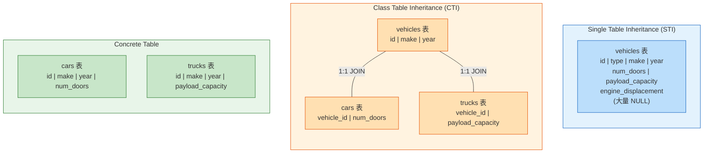
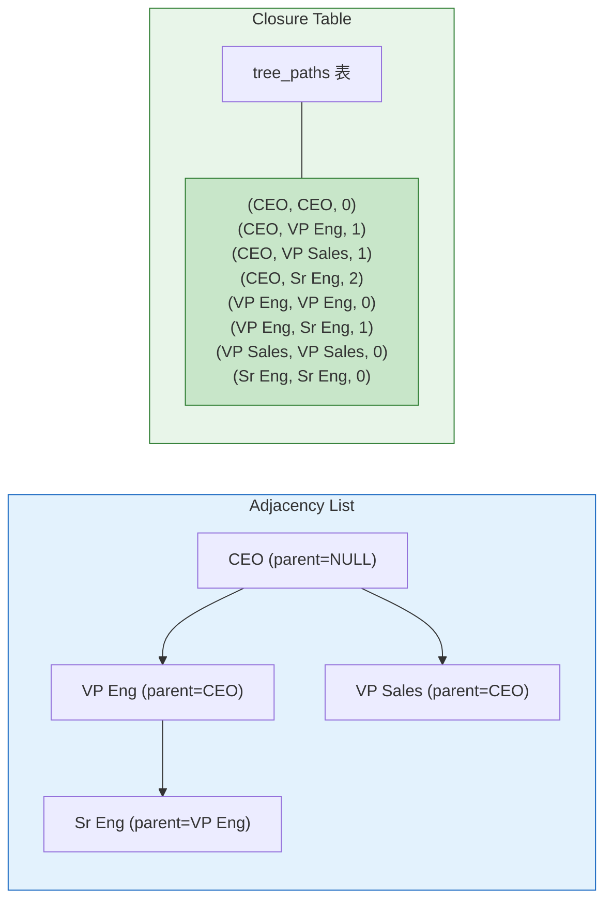
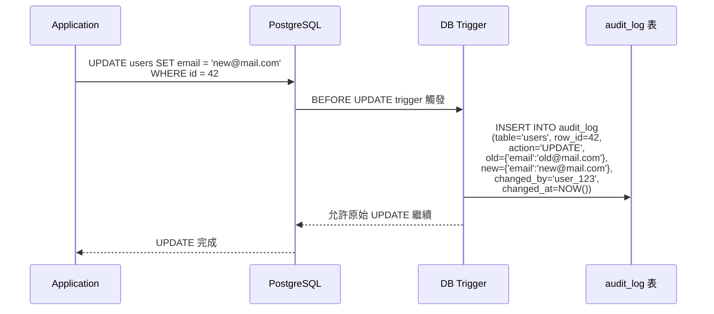
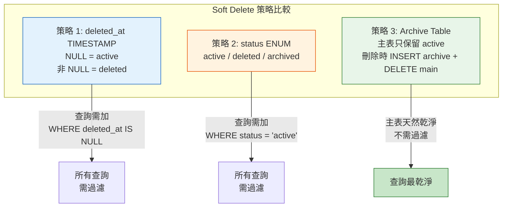

# Database Design Patterns / 資料庫設計模式

## Intent / 意圖

資料庫設計模式解決的核心問題是**如何在關聯式資料庫中正確地建模現實世界中的複雜資料關係——包括多型（polymorphism）、階層（hierarchy）、軟刪除（soft delete）、時序（temporal）資料、稽核軌跡（audit trail）——同時兼顧查詢效能、資料完整性與維護性**。錯誤的 schema 設計可能在初期看起來沒問題，但隨著資料量和複雜度增長，會導致查詢效能劣化、資料一致性漏洞、以及 schema migration 的噩夢。

---

## Problem / 問題情境

**場景一：多型關聯造成 NULL 泛濫** — 電商平台的通知系統需要記錄通知的來源，來源可能是 Order、Product、Review 等不同實體。工程師將所有可能的外鍵放在 notifications 表中（`order_id`、`product_id`、`review_id`），結果每行資料有 2/3 的欄位是 NULL。隨著來源類型增加到 15 種，notifications 表有 15 個 nullable 外鍵欄位，查詢效率與可讀性急劇下降。ALTER TABLE 加新欄位的 migration 越來越慢。

**場景二：階層資料的遞迴查詢效能問題** — 企業組織架構系統使用 adjacency list（`parent_id` 欄位）建模部門階層。查詢「某部門的所有下屬部門（包含孫子部門）」需要遞迴 CTE，在 7 層深的組織架構中，遞迴查詢耗時 800ms。主管想看整個事業群的員工名單，系統逾時。根本原因：adjacency list 不適合深度不確定的遞迴查詢。

**場景三：軟刪除導致 UNIQUE 約束失效** — 內容管理系統使用 `deleted_at` 欄位實作軟刪除。文章的 slug 有 UNIQUE 約束（`UNIQUE(slug)`）。使用者刪除一篇 slug 為 "hello-world" 的文章後，想建立一篇新的 "hello-world" 文章——UNIQUE 約束違反，因為軟刪除的舊文章仍佔用這個 slug。解法不是移除 UNIQUE 約束（那會導致真正的重複），而是使用 partial unique index。

**場景四：缺乏稽核軌跡引發合規問題** — 金融應用的客戶資料被修改後，原始值直接被覆蓋。監管機構要求查看某客戶三個月前的 KYC 資料——系統無法提供，因為沒有保留歷史版本。根本原因：沒有實作 audit trail 或 temporal table。

---

## Core Concepts / 核心概念

### Single Table Inheritance (STI) / 單表繼承

將所有子類型的資料存放在同一張表中，用 `type` discriminator 欄位區分。例如 `vehicles` 表中同時存放 Car、Truck、Motorcycle，用 `vehicle_type` 欄位區分。**優點**：查詢簡單、無 JOIN、schema 簡潔。**缺點**：大量 NULL 欄位（Car 不需要 `payload_capacity`，Motorcycle 不需要 `num_doors`）、UNIQUE/NOT NULL 約束難以針對特定子類型設定。適用於子類型差異小、欄位重疊度高的場景。

### Class Table Inheritance (CTI) / 類別表繼承

每個類別（基類 + 每個子類）各有一張表。`vehicles` 表存共用欄位（id, make, year），`cars` 表存 Car 特有欄位（num_doors, trunk_size），透過共享 PK 做 1:1 JOIN。**優點**：無 NULL 欄位、每個子類型可有自己的約束。**缺點**：查詢需要 JOIN、INSERT 需要兩張表、多型查詢（查所有 vehicle）需要 UNION 或多次 JOIN。

### Concrete Table Inheritance / 具體表繼承

每個子類型獨立一張表，**不共享基類表**。`cars` 表有 car 的所有欄位，`trucks` 表有 truck 的所有欄位，欄位可能有重複。**優點**：查詢最快（無 JOIN）、schema 最簡單。**缺點**：共用欄位重複定義、多型查詢需 UNION ALL、無法建立指向所有 vehicle 的統一外鍵。

### Adjacency List / 鄰接列表

最簡單的階層資料模型——每筆記錄有一個 `parent_id` 指向其父節點。**優點**：schema 簡潔、INSERT/UPDATE/DELETE 操作簡單。**缺點**：查詢任意深度的子孫節點需要遞迴 CTE（PostgreSQL `WITH RECURSIVE`），深度大時效能差；查詢某節點的所有祖先也需要遞迴。

### Materialized Path / 物化路徑

每筆記錄存儲從根節點到自身的完整路徑（如 `/root/asia/taiwan/taipei`）。查詢某節點的所有子孫只需 `LIKE '/root/asia/%'`。**優點**：子孫查詢極快（可用索引）、無遞迴。**缺點**：移動節點時需要更新所有子孫的路徑（代價高）、路徑長度有限制。適用於階層穩定（很少移動節點）的場景，如商品分類。

### Nested Set / 巢狀集合

每筆記錄有 `lft`（左值）和 `rgt`（右值），用先序遍歷（preorder traversal）編號。子孫節點的 lft/rgt 值介於祖先的 lft 和 rgt 之間。**優點**：查詢子孫 `WHERE lft BETWEEN parent.lft AND parent.rgt` 極快。**缺點**：INSERT/DELETE/MOVE 需要重新計算大量節點的 lft/rgt 值，寫入效能差。適用於讀多寫少的靜態階層。

### Closure Table / 閉包表

使用一張額外的 `closure` 表（ancestor_id, descendant_id, depth），存儲所有祖先-後代對。查詢某節點的所有子孫：`SELECT descendant_id FROM closure WHERE ancestor_id = ?`。**優點**：查詢任意深度的子孫/祖先都是常數時間（O(1) JOIN）、支援多根樹、INSERT/DELETE 效能合理。**缺點**：closure 表的行數是 O(n * depth)，空間消耗較大。是大多數場景下最推薦的方案。

### Soft Delete / 軟刪除

標記記錄為「已刪除」而非物理刪除。常見策略：(1) `deleted_at TIMESTAMP`——NULL 表示未刪除，非 NULL 表示已刪除；(2) `status` flag——用 enum（active/deleted/archived）；(3) archive table——將刪除的記錄移至獨立的 archive 表。每種策略各有 trade-off：`deleted_at` 最簡單但所有查詢都需 `WHERE deleted_at IS NULL`；archive table 查詢最乾淨但需要維護兩張表。

### Temporal Table / 時序表

記錄資料在不同時間點的狀態。**單時序表（valid-time）** 記錄業務時間（員工在何時到何時擔任某職位）。**雙時序表（bitemporal）** 同時記錄業務時間和系統時間（何時知道這個事實 + 何時生效）。SQL:2011 標準引入了 `PERIOD FOR` 和 `SYSTEM_TIME` 語法，但 PostgreSQL 尚未完全支援，通常需要手動實作。

### Audit Trail / 稽核軌跡

記錄所有資料變更的歷史——誰（who）、何時（when）、改了什麼（what）、從什麼值變成什麼值（old → new）。常見策略：(1) trigger-based——DB trigger 自動記錄變更到 audit 表；(2) application-level——應用程式在每次寫入時同時寫入 audit log；(3) CDC（Change Data Capture）——從 WAL/binlog 擷取所有變更。

### Entity-Attribute-Value (EAV) / 實體-屬性-值

用 `(entity_id, attribute_name, attribute_value)` 三元組來儲存動態 schema 的資料。**適用場景極有限**——只適合屬性數量不確定且差異極大的場景（如醫療系統的病患觀察記錄，每種疾病需要不同的觀察指標）。**絕大多數情況下應避免使用**——它犧牲了型別安全、外鍵約束、索引效率、查詢可讀性。現代替代方案：PostgreSQL 的 JSONB 欄位。

---

## Architecture / 架構

### 多型關聯模式比較



### 階層資料模式比較



### Audit Trail 架構



### Soft Delete + Partial Index



---

## How It Works / 運作原理

### Closure Table 的完整運作流程

1. **建立節點表和路徑表**：`categories` 表存放節點本身的資料（id, name），`category_tree_paths` 表存放所有祖先-後代對（ancestor_id, descendant_id, depth）。

2. **插入根節點**：插入 categories 記錄後，在 tree_paths 中插入一筆自引用（ancestor=self, descendant=self, depth=0）。

3. **插入子節點**：插入 categories 記錄後，(1) 插入自引用（depth=0）；(2) 複製父節點的所有祖先路徑，將 descendant 替換為新節點、depth +1。SQL：`INSERT INTO tree_paths (ancestor_id, descendant_id, depth) SELECT ancestor_id, NEW_NODE_ID, depth + 1 FROM tree_paths WHERE descendant_id = PARENT_ID UNION ALL SELECT NEW_NODE_ID, NEW_NODE_ID, 0`。

4. **查詢所有子孫**：`SELECT descendant_id FROM tree_paths WHERE ancestor_id = ? AND depth > 0`。一次 JOIN 即可取得所有子孫，不需要遞迴。

5. **查詢所有祖先**：`SELECT ancestor_id FROM tree_paths WHERE descendant_id = ? AND depth > 0`。同樣一次 JOIN。

6. **查詢直接子節點**：`SELECT descendant_id FROM tree_paths WHERE ancestor_id = ? AND depth = 1`。

7. **移動節點**：(1) 刪除被移動節點及其所有子孫的舊祖先路徑（保留子樹內部的路徑）；(2) 將子樹的所有節點與新父節點的祖先建立新的路徑。這是 closure table 最複雜的操作。

8. **刪除節點**：刪除 tree_paths 中所有 `ancestor_id = ? OR descendant_id = ?` 的記錄。如果是刪除整個子樹，需要先查詢所有子孫再批次刪除。

### Soft Delete 配合 Partial Unique Index

1. **建立 deleted_at 欄位**：`ALTER TABLE articles ADD COLUMN deleted_at TIMESTAMP DEFAULT NULL;`

2. **建立 Partial Unique Index**：`CREATE UNIQUE INDEX uq_articles_slug_active ON articles (slug) WHERE deleted_at IS NULL;` 只對未刪除的記錄強制唯一性。

3. **軟刪除操作**：`UPDATE articles SET deleted_at = NOW() WHERE id = ?;` 這筆記錄的 slug 被釋放（因為 deleted_at 不再是 NULL，不受 partial index 約束）。

4. **建立同名記錄**：新的 `INSERT INTO articles (slug, ...) VALUES ('hello-world', ...)` 可以成功，因為 partial index 只檢查 `deleted_at IS NULL` 的記錄。

5. **查詢時自動過濾**：所有業務查詢加上 `WHERE deleted_at IS NULL`。建議建立 view：`CREATE VIEW active_articles AS SELECT * FROM articles WHERE deleted_at IS NULL;`

---

## Rust 實作

以下實作使用 Axum 0.8 + sqlx + PostgreSQL，展示 Closure Table 建模階層資料的完整 CRUD 操作。

```rust
// Cargo.toml dependencies:
// axum = "0.8"
// tokio = { version = "1", features = ["full"] }
// sqlx = { version = "0.8", features = ["runtime-tokio", "postgres", "uuid"] }
// serde = { version = "1", features = ["derive"] }
// serde_json = "1"
// uuid = { version = "1", features = ["v4", "serde"] }

use axum::{
    extract::{Path, State},
    http::StatusCode,
    response::{IntoResponse, Json},
    routing::{get, post},
    Router,
};
use serde::{Deserialize, Serialize};
use sqlx::postgres::PgPoolOptions;
use sqlx::PgPool;
use std::sync::Arc;
use uuid::Uuid;

// ── 資料模型 ───────────────────────────────────────────────────

/// Category 節點
#[derive(Debug, Serialize, Deserialize, sqlx::FromRow)]
struct Category {
    id: Uuid,
    name: String,
    created_at: chrono::NaiveDateTime,
}

/// Closure Table 中的路徑記錄
#[derive(Debug, Serialize, Deserialize, sqlx::FromRow)]
struct TreePath {
    ancestor_id: Uuid,
    descendant_id: Uuid,
    depth: i32,
}

/// 帶有階層資訊的 Category（含 depth 和 children count）
#[derive(Debug, Serialize)]
struct CategoryNode {
    id: Uuid,
    name: String,
    depth: i32,
    children_count: i64,
}

/// 建立 Category 的請求
#[derive(Debug, Deserialize)]
struct CreateCategoryRequest {
    name: String,
    parent_id: Option<Uuid>, // None = 根節點
}

// ── 應用狀態 ───────────────────────────────────────────────────

#[derive(Clone)]
struct AppState {
    db_pool: PgPool,
}

// ── Schema 初始化 ──────────────────────────────────────────────

async fn initialize_database(pool: &PgPool) -> Result<(), sqlx::Error> {
    // 節點表
    sqlx::query(
        "CREATE TABLE IF NOT EXISTS categories (
            id UUID PRIMARY KEY DEFAULT gen_random_uuid(),
            name VARCHAR(255) NOT NULL,
            created_at TIMESTAMP NOT NULL DEFAULT NOW()
        )"
    )
    .execute(pool)
    .await?;

    // Closure Table：存儲所有祖先-後代對
    sqlx::query(
        "CREATE TABLE IF NOT EXISTS category_tree_paths (
            ancestor_id UUID NOT NULL REFERENCES categories(id) ON DELETE CASCADE,
            descendant_id UUID NOT NULL REFERENCES categories(id) ON DELETE CASCADE,
            depth INT NOT NULL DEFAULT 0,
            PRIMARY KEY (ancestor_id, descendant_id)
        )"
    )
    .execute(pool)
    .await?;

    // 索引：加速「查詢某節點所有子孫」和「查詢某節點所有祖先」
    sqlx::query(
        "CREATE INDEX IF NOT EXISTS idx_tree_paths_ancestor
         ON category_tree_paths (ancestor_id, depth)"
    )
    .execute(pool)
    .await?;

    sqlx::query(
        "CREATE INDEX IF NOT EXISTS idx_tree_paths_descendant
         ON category_tree_paths (descendant_id, depth)"
    )
    .execute(pool)
    .await?;

    Ok(())
}

// ── Handler: 建立 Category（根節點或子節點）─────────────────────

async fn create_category(
    State(state): State<Arc<AppState>>,
    Json(request): Json<CreateCategoryRequest>,
) -> Result<(StatusCode, Json<Category>), StatusCode> {
    let mut tx = state
        .db_pool
        .begin()
        .await
        .map_err(|_| StatusCode::INTERNAL_SERVER_ERROR)?;

    // 1. 建立節點
    let category = sqlx::query_as::<_, Category>(
        "INSERT INTO categories (id, name) VALUES ($1, $2)
         RETURNING id, name, created_at"
    )
    .bind(Uuid::new_v4())
    .bind(&request.name)
    .fetch_one(&mut *tx)
    .await
    .map_err(|_| StatusCode::INTERNAL_SERVER_ERROR)?;

    // 2. 在 closure table 中插入路徑
    if let Some(parent_id) = request.parent_id {
        // 子節點：複製父節點的所有祖先路徑 + 自引用
        sqlx::query(
            "INSERT INTO category_tree_paths (ancestor_id, descendant_id, depth)
             SELECT ancestor_id, $1, depth + 1
             FROM category_tree_paths
             WHERE descendant_id = $2
             UNION ALL
             SELECT $1, $1, 0"
        )
        .bind(category.id)
        .bind(parent_id)
        .execute(&mut *tx)
        .await
        .map_err(|_| StatusCode::INTERNAL_SERVER_ERROR)?;
    } else {
        // 根節點：只插入自引用
        sqlx::query(
            "INSERT INTO category_tree_paths (ancestor_id, descendant_id, depth)
             VALUES ($1, $1, 0)"
        )
        .bind(category.id)
        .execute(&mut *tx)
        .await
        .map_err(|_| StatusCode::INTERNAL_SERVER_ERROR)?;
    }

    tx.commit()
        .await
        .map_err(|_| StatusCode::INTERNAL_SERVER_ERROR)?;

    Ok((StatusCode::CREATED, Json(category)))
}

// ── Handler: 查詢某節點的所有子孫 ──────────────────────────────

async fn get_descendants(
    State(state): State<Arc<AppState>>,
    Path(category_id): Path<Uuid>,
) -> Result<Json<Vec<CategoryNode>>, StatusCode> {
    let descendants = sqlx::query_as::<_, (Uuid, String, i32, i64)>(
        "SELECT c.id, c.name, tp.depth,
                (SELECT COUNT(*) FROM category_tree_paths sub
                 WHERE sub.ancestor_id = c.id AND sub.depth = 1) AS children_count
         FROM category_tree_paths tp
         JOIN categories c ON c.id = tp.descendant_id
         WHERE tp.ancestor_id = $1 AND tp.depth > 0
         ORDER BY tp.depth, c.name"
    )
    .bind(category_id)
    .fetch_all(&state.db_pool)
    .await
    .map_err(|_| StatusCode::INTERNAL_SERVER_ERROR)?;

    let nodes: Vec<CategoryNode> = descendants
        .into_iter()
        .map(|(id, name, depth, children_count)| CategoryNode {
            id,
            name,
            depth,
            children_count,
        })
        .collect();

    Ok(Json(nodes))
}

// ── Handler: 查詢某節點的所有祖先（麵包屑路徑）────────────────

async fn get_ancestors(
    State(state): State<Arc<AppState>>,
    Path(category_id): Path<Uuid>,
) -> Result<Json<Vec<CategoryNode>>, StatusCode> {
    let ancestors = sqlx::query_as::<_, (Uuid, String, i32)>(
        "SELECT c.id, c.name, tp.depth
         FROM category_tree_paths tp
         JOIN categories c ON c.id = tp.ancestor_id
         WHERE tp.descendant_id = $1 AND tp.depth > 0
         ORDER BY tp.depth DESC"
    )
    .bind(category_id)
    .fetch_all(&state.db_pool)
    .await
    .map_err(|_| StatusCode::INTERNAL_SERVER_ERROR)?;

    let nodes: Vec<CategoryNode> = ancestors
        .into_iter()
        .map(|(id, name, depth)| CategoryNode {
            id,
            name,
            depth,
            children_count: 0, // 祖先查詢不需要 children count
        })
        .collect();

    Ok(Json(nodes))
}

// ── Handler: 移動節點至新的父節點 ──────────────────────────────

async fn move_category(
    State(state): State<Arc<AppState>>,
    Path((category_id, new_parent_id)): Path<(Uuid, Uuid)>,
) -> Result<StatusCode, StatusCode> {
    let mut tx = state
        .db_pool
        .begin()
        .await
        .map_err(|_| StatusCode::INTERNAL_SERVER_ERROR)?;

    // 1. 取得被移動節點的所有子孫（含自身）
    let subtree_ids: Vec<Uuid> = sqlx::query_scalar(
        "SELECT descendant_id FROM category_tree_paths
         WHERE ancestor_id = $1"
    )
    .bind(category_id)
    .fetch_all(&mut *tx)
    .await
    .map_err(|_| StatusCode::INTERNAL_SERVER_ERROR)?;

    // 2. 刪除子樹與舊祖先的連線（保留子樹內部的路徑）
    sqlx::query(
        "DELETE FROM category_tree_paths
         WHERE descendant_id = ANY($1)
         AND ancestor_id != ALL($1)"
    )
    .bind(&subtree_ids)
    .execute(&mut *tx)
    .await
    .map_err(|_| StatusCode::INTERNAL_SERVER_ERROR)?;

    // 3. 將子樹與新祖先建立連線
    sqlx::query(
        "INSERT INTO category_tree_paths (ancestor_id, descendant_id, depth)
         SELECT supertree.ancestor_id, subtree.descendant_id,
                supertree.depth + subtree.depth + 1
         FROM category_tree_paths supertree
         CROSS JOIN category_tree_paths subtree
         WHERE supertree.descendant_id = $1
         AND subtree.ancestor_id = $2"
    )
    .bind(new_parent_id)
    .bind(category_id)
    .execute(&mut *tx)
    .await
    .map_err(|_| StatusCode::INTERNAL_SERVER_ERROR)?;

    tx.commit()
        .await
        .map_err(|_| StatusCode::INTERNAL_SERVER_ERROR)?;

    Ok(StatusCode::OK)
}

// ── 主程式 ─────────────────────────────────────────────────────

#[tokio::main]
async fn main() -> Result<(), Box<dyn std::error::Error>> {
    let database_url = std::env::var("DATABASE_URL")
        .unwrap_or_else(|_| "postgres://localhost/hierarchy_demo".to_string());

    let db_pool = PgPoolOptions::new()
        .max_connections(10)
        .connect(&database_url)
        .await?;

    initialize_database(&db_pool).await?;

    let app_state = Arc::new(AppState { db_pool });

    let app = Router::new()
        .route("/api/categories", post(create_category))
        .route("/api/categories/{id}/descendants", get(get_descendants))
        .route("/api/categories/{id}/ancestors", get(get_ancestors))
        .route(
            "/api/categories/{id}/move/{new_parent_id}",
            post(move_category),
        )
        .with_state(app_state);

    let listener = tokio::net::TcpListener::bind("0.0.0.0:3000").await?;
    println!("Server running on :3000");
    axum::serve(listener, app).await?;

    Ok(())
}

// Output:
// Server running on :3000
//
// # 建立根節點
// curl -X POST http://localhost:3000/api/categories \
//   -H "Content-Type: application/json" \
//   -d '{"name": "Electronics"}'
// => {"id":"aaa...","name":"Electronics","created_at":"..."}
//
// # 建立子節點
// curl -X POST http://localhost:3000/api/categories \
//   -H "Content-Type: application/json" \
//   -d '{"name": "Laptops", "parent_id": "aaa..."}'
// => {"id":"bbb...","name":"Laptops","created_at":"..."}
//
// # 查詢所有子孫
// curl http://localhost:3000/api/categories/aaa.../descendants
// => [{"id":"bbb...","name":"Laptops","depth":1,"children_count":0}]
//
// # 查詢祖先（麵包屑）
// curl http://localhost:3000/api/categories/bbb.../ancestors
// => [{"id":"aaa...","name":"Electronics","depth":1,"children_count":1}]
```

---

## Go 實作

以下實作使用 Go 1.24+ 標準庫 `database/sql`，展示 Soft Delete + Audit Trail 的完整設計。

```go
package main

import (
	"context"
	"database/sql"
	"encoding/json"
	"fmt"
	"log"
	"net/http"
	"time"

	_ "github.com/lib/pq"
)

// ── 資料模型 ───────────────────────────────────────────────────

// Article 文章（含軟刪除欄位）
type Article struct {
	ID        string     `json:"id"`
	Slug      string     `json:"slug"`
	Title     string     `json:"title"`
	Content   string     `json:"content"`
	AuthorID  string     `json:"author_id"`
	CreatedAt time.Time  `json:"created_at"`
	UpdatedAt time.Time  `json:"updated_at"`
	DeletedAt *time.Time `json:"deleted_at,omitempty"` // NULL = active
}

// AuditEntry 稽核記錄
type AuditEntry struct {
	ID         string          `json:"id"`
	TableName  string          `json:"table_name"`
	RowID      string          `json:"row_id"`
	Action     string          `json:"action"` // INSERT, UPDATE, DELETE
	OldValues  json.RawMessage `json:"old_values,omitempty"`
	NewValues  json.RawMessage `json:"new_values,omitempty"`
	ChangedBy  string          `json:"changed_by"`
	ChangedAt  time.Time       `json:"changed_at"`
}

// CreateArticleRequest 建立文章請求
type CreateArticleRequest struct {
	Slug     string `json:"slug"`
	Title    string `json:"title"`
	Content  string `json:"content"`
	AuthorID string `json:"author_id"`
}

// UpdateArticleRequest 更新文章請求
type UpdateArticleRequest struct {
	Title   *string `json:"title,omitempty"`
	Content *string `json:"content,omitempty"`
}

// ── Repository: Soft Delete + Audit Trail ─────────────────────

// ArticleRepository 封裝文章的資料庫操作
type ArticleRepository struct {
	db *sql.DB
}

// NewArticleRepository 建立新的 Repository
func NewArticleRepository(db *sql.DB) *ArticleRepository {
	return &ArticleRepository{db: db}
}

// Create 建立文章 + 記錄 audit trail
func (r *ArticleRepository) Create(ctx context.Context, req CreateArticleRequest, userID string) (*Article, error) {
	tx, err := r.db.BeginTx(ctx, nil)
	if err != nil {
		return nil, fmt.Errorf("begin transaction: %w", err)
	}
	defer tx.Rollback() //nolint:errcheck

	// 1. 插入文章（deleted_at = NULL → active）
	var article Article
	err = tx.QueryRowContext(ctx,
		`INSERT INTO articles (slug, title, content, author_id, created_at, updated_at)
		 VALUES ($1, $2, $3, $4, NOW(), NOW())
		 RETURNING id, slug, title, content, author_id, created_at, updated_at, deleted_at`,
		req.Slug, req.Title, req.Content, req.AuthorID,
	).Scan(
		&article.ID, &article.Slug, &article.Title, &article.Content,
		&article.AuthorID, &article.CreatedAt, &article.UpdatedAt, &article.DeletedAt,
	)
	if err != nil {
		return nil, fmt.Errorf("insert article: %w", err)
	}

	// 2. 記錄 audit trail
	newValues, _ := json.Marshal(map[string]any{
		"slug": req.Slug, "title": req.Title,
		"content": req.Content, "author_id": req.AuthorID,
	})

	_, err = tx.ExecContext(ctx,
		`INSERT INTO audit_log (table_name, row_id, action, new_values, changed_by, changed_at)
		 VALUES ('articles', $1, 'INSERT', $2, $3, NOW())`,
		article.ID, newValues, userID,
	)
	if err != nil {
		return nil, fmt.Errorf("insert audit log: %w", err)
	}

	if err := tx.Commit(); err != nil {
		return nil, fmt.Errorf("commit: %w", err)
	}

	return &article, nil
}

// Update 更新文章 + 記錄 audit trail（含 old/new values）
func (r *ArticleRepository) Update(
	ctx context.Context,
	articleID string,
	req UpdateArticleRequest,
	userID string,
) (*Article, error) {
	tx, err := r.db.BeginTx(ctx, nil)
	if err != nil {
		return nil, fmt.Errorf("begin transaction: %w", err)
	}
	defer tx.Rollback() //nolint:errcheck

	// 1. 查詢舊值（for audit trail）
	var oldTitle, oldContent string
	err = tx.QueryRowContext(ctx,
		`SELECT title, content FROM articles
		 WHERE id = $1 AND deleted_at IS NULL`,
		articleID,
	).Scan(&oldTitle, &oldContent)
	if err == sql.ErrNoRows {
		return nil, fmt.Errorf("article not found or deleted")
	}
	if err != nil {
		return nil, fmt.Errorf("query old values: %w", err)
	}

	// 2. 建立更新 SQL（只更新有值的欄位）
	newTitle := oldTitle
	newContent := oldContent
	if req.Title != nil {
		newTitle = *req.Title
	}
	if req.Content != nil {
		newContent = *req.Content
	}

	var article Article
	err = tx.QueryRowContext(ctx,
		`UPDATE articles SET title = $1, content = $2, updated_at = NOW()
		 WHERE id = $3 AND deleted_at IS NULL
		 RETURNING id, slug, title, content, author_id, created_at, updated_at, deleted_at`,
		newTitle, newContent, articleID,
	).Scan(
		&article.ID, &article.Slug, &article.Title, &article.Content,
		&article.AuthorID, &article.CreatedAt, &article.UpdatedAt, &article.DeletedAt,
	)
	if err != nil {
		return nil, fmt.Errorf("update article: %w", err)
	}

	// 3. 記錄 audit trail（old → new）
	oldValues, _ := json.Marshal(map[string]string{
		"title": oldTitle, "content": oldContent,
	})
	newValues, _ := json.Marshal(map[string]string{
		"title": newTitle, "content": newContent,
	})

	_, err = tx.ExecContext(ctx,
		`INSERT INTO audit_log (table_name, row_id, action, old_values, new_values, changed_by, changed_at)
		 VALUES ('articles', $1, 'UPDATE', $2, $3, $4, NOW())`,
		articleID, oldValues, newValues, userID,
	)
	if err != nil {
		return nil, fmt.Errorf("insert audit log: %w", err)
	}

	if err := tx.Commit(); err != nil {
		return nil, fmt.Errorf("commit: %w", err)
	}

	return &article, nil
}

// SoftDelete 軟刪除文章 + 記錄 audit trail
func (r *ArticleRepository) SoftDelete(ctx context.Context, articleID string, userID string) error {
	tx, err := r.db.BeginTx(ctx, nil)
	if err != nil {
		return fmt.Errorf("begin transaction: %w", err)
	}
	defer tx.Rollback() //nolint:errcheck

	// 1. 設定 deleted_at
	result, err := tx.ExecContext(ctx,
		`UPDATE articles SET deleted_at = NOW(), updated_at = NOW()
		 WHERE id = $1 AND deleted_at IS NULL`,
		articleID,
	)
	if err != nil {
		return fmt.Errorf("soft delete: %w", err)
	}

	rowsAffected, _ := result.RowsAffected()
	if rowsAffected == 0 {
		return fmt.Errorf("article not found or already deleted")
	}

	// 2. 記錄 audit trail
	_, err = tx.ExecContext(ctx,
		`INSERT INTO audit_log (table_name, row_id, action, changed_by, changed_at)
		 VALUES ('articles', $1, 'SOFT_DELETE', $2, NOW())`,
		articleID, userID,
	)
	if err != nil {
		return fmt.Errorf("insert audit log: %w", err)
	}

	return tx.Commit()
}

// ListActive 列出所有未刪除的文章
func (r *ArticleRepository) ListActive(ctx context.Context) ([]Article, error) {
	rows, err := r.db.QueryContext(ctx,
		`SELECT id, slug, title, content, author_id, created_at, updated_at, deleted_at
		 FROM articles
		 WHERE deleted_at IS NULL
		 ORDER BY created_at DESC`,
	)
	if err != nil {
		return nil, fmt.Errorf("query articles: %w", err)
	}
	defer rows.Close()

	var articles []Article
	for rows.Next() {
		var a Article
		if err := rows.Scan(
			&a.ID, &a.Slug, &a.Title, &a.Content,
			&a.AuthorID, &a.CreatedAt, &a.UpdatedAt, &a.DeletedAt,
		); err != nil {
			return nil, fmt.Errorf("scan article: %w", err)
		}
		articles = append(articles, a)
	}

	if articles == nil {
		articles = []Article{}
	}
	return articles, rows.Err()
}

// GetAuditTrail 取得某記錄的完整變更歷史
func (r *ArticleRepository) GetAuditTrail(ctx context.Context, articleID string) ([]AuditEntry, error) {
	rows, err := r.db.QueryContext(ctx,
		`SELECT id, table_name, row_id, action,
		        COALESCE(old_values, '{}'), COALESCE(new_values, '{}'),
		        changed_by, changed_at
		 FROM audit_log
		 WHERE table_name = 'articles' AND row_id = $1
		 ORDER BY changed_at ASC`,
		articleID,
	)
	if err != nil {
		return nil, fmt.Errorf("query audit log: %w", err)
	}
	defer rows.Close()

	var entries []AuditEntry
	for rows.Next() {
		var e AuditEntry
		if err := rows.Scan(
			&e.ID, &e.TableName, &e.RowID, &e.Action,
			&e.OldValues, &e.NewValues, &e.ChangedBy, &e.ChangedAt,
		); err != nil {
			return nil, fmt.Errorf("scan audit entry: %w", err)
		}
		entries = append(entries, e)
	}

	if entries == nil {
		entries = []AuditEntry{}
	}
	return entries, rows.Err()
}

// ── Schema 初始化 ──────────────────────────────────────────────

func initializeDatabase(db *sql.DB) error {
	statements := []string{
		// 文章表（含軟刪除欄位）
		`CREATE TABLE IF NOT EXISTS articles (
			id UUID PRIMARY KEY DEFAULT gen_random_uuid(),
			slug VARCHAR(255) NOT NULL,
			title VARCHAR(500) NOT NULL,
			content TEXT NOT NULL,
			author_id VARCHAR(100) NOT NULL,
			created_at TIMESTAMP NOT NULL DEFAULT NOW(),
			updated_at TIMESTAMP NOT NULL DEFAULT NOW(),
			deleted_at TIMESTAMP DEFAULT NULL
		)`,

		// Partial Unique Index：只對未刪除的記錄強制 slug 唯一
		`CREATE UNIQUE INDEX IF NOT EXISTS uq_articles_slug_active
		 ON articles (slug) WHERE deleted_at IS NULL`,

		// 稽核記錄表
		`CREATE TABLE IF NOT EXISTS audit_log (
			id UUID PRIMARY KEY DEFAULT gen_random_uuid(),
			table_name VARCHAR(100) NOT NULL,
			row_id VARCHAR(100) NOT NULL,
			action VARCHAR(50) NOT NULL,
			old_values JSONB,
			new_values JSONB,
			changed_by VARCHAR(100) NOT NULL,
			changed_at TIMESTAMP NOT NULL DEFAULT NOW()
		)`,

		// 稽核記錄索引
		`CREATE INDEX IF NOT EXISTS idx_audit_log_table_row
		 ON audit_log (table_name, row_id, changed_at)`,
	}

	for _, stmt := range statements {
		if _, err := db.Exec(stmt); err != nil {
			return fmt.Errorf("execute statement: %w", err)
		}
	}
	return nil
}

// ── HTTP Handlers ──────────────────────────────────────────────

func handleCreateArticle(repo *ArticleRepository) http.HandlerFunc {
	return func(w http.ResponseWriter, r *http.Request) {
		var req CreateArticleRequest
		if err := json.NewDecoder(r.Body).Decode(&req); err != nil {
			http.Error(w, `{"error":"invalid request"}`, http.StatusBadRequest)
			return
		}

		userID := r.Header.Get("X-User-Id")
		if userID == "" {
			userID = "anonymous"
		}

		article, err := repo.Create(r.Context(), req, userID)
		if err != nil {
			log.Printf("create article error: %v", err)
			http.Error(w, `{"error":"failed to create article"}`, http.StatusInternalServerError)
			return
		}

		w.Header().Set("Content-Type", "application/json")
		w.WriteHeader(http.StatusCreated)
		json.NewEncoder(w).Encode(article)
	}
}

func handleListArticles(repo *ArticleRepository) http.HandlerFunc {
	return func(w http.ResponseWriter, r *http.Request) {
		articles, err := repo.ListActive(r.Context())
		if err != nil {
			log.Printf("list articles error: %v", err)
			http.Error(w, `{"error":"failed to list articles"}`, http.StatusInternalServerError)
			return
		}

		w.Header().Set("Content-Type", "application/json")
		json.NewEncoder(w).Encode(articles)
	}
}

func handleDeleteArticle(repo *ArticleRepository) http.HandlerFunc {
	return func(w http.ResponseWriter, r *http.Request) {
		articleID := r.PathValue("id")
		userID := r.Header.Get("X-User-Id")
		if userID == "" {
			userID = "anonymous"
		}

		if err := repo.SoftDelete(r.Context(), articleID, userID); err != nil {
			log.Printf("soft delete error: %v", err)
			http.Error(w, `{"error":"failed to delete article"}`, http.StatusInternalServerError)
			return
		}

		w.WriteHeader(http.StatusNoContent)
	}
}

func handleGetAuditTrail(repo *ArticleRepository) http.HandlerFunc {
	return func(w http.ResponseWriter, r *http.Request) {
		articleID := r.PathValue("id")

		entries, err := repo.GetAuditTrail(r.Context(), articleID)
		if err != nil {
			log.Printf("get audit trail error: %v", err)
			http.Error(w, `{"error":"failed to get audit trail"}`, http.StatusInternalServerError)
			return
		}

		w.Header().Set("Content-Type", "application/json")
		json.NewEncoder(w).Encode(entries)
	}
}

// ── 主程式 ─────────────────────────────────────────────────────

func main() {
	dsn := "postgres://localhost/design_patterns_demo?sslmode=disable"
	db, err := sql.Open("postgres", dsn)
	if err != nil {
		log.Fatalf("connect to database: %v", err)
	}
	defer db.Close()

	db.SetMaxOpenConns(10)
	db.SetMaxIdleConns(5)
	db.SetConnMaxLifetime(30 * time.Minute)

	if err := initializeDatabase(db); err != nil {
		log.Fatalf("initialize database: %v", err)
	}

	repo := NewArticleRepository(db)

	mux := http.NewServeMux()
	mux.HandleFunc("POST /api/articles", handleCreateArticle(repo))
	mux.HandleFunc("GET /api/articles", handleListArticles(repo))
	mux.HandleFunc("DELETE /api/articles/{id}", handleDeleteArticle(repo))
	mux.HandleFunc("GET /api/articles/{id}/audit", handleGetAuditTrail(repo))

	server := &http.Server{
		Addr:    ":8080",
		Handler: mux,
	}

	log.Println("Server running on :8080")
	if err := server.ListenAndServe(); err != nil {
		log.Fatalf("server error: %v", err)
	}
}

// Output:
// Server running on :8080
//
// # 建立文章
// curl -X POST http://localhost:8080/api/articles \
//   -H "Content-Type: application/json" \
//   -H "X-User-Id: user_123" \
//   -d '{"slug":"hello-world","title":"Hello World","content":"First post","author_id":"user_123"}'
// => {"id":"abc...","slug":"hello-world","title":"Hello World",...}
//
// # 軟刪除
// curl -X DELETE http://localhost:8080/api/articles/abc... \
//   -H "X-User-Id: user_123"
// => 204 No Content
//
// # 可以建立同名 slug（partial unique index 生效）
// curl -X POST http://localhost:8080/api/articles \
//   -H "Content-Type: application/json" \
//   -d '{"slug":"hello-world","title":"Hello World v2","content":"New post","author_id":"user_456"}'
// => {"id":"def...","slug":"hello-world","title":"Hello World v2",...}
//
// # 查看稽核軌跡
// curl http://localhost:8080/api/articles/abc.../audit
// => [{"action":"INSERT","new_values":{...}},{"action":"SOFT_DELETE",...}]
```

---

## Rust vs Go 對照表

| 比較維度 | Rust (sqlx + Closure Table) | Go (database/sql + Soft Delete) |
|---------|---------------------------|-------------------------------|
| **模式焦點** | Closure Table 建模階層資料 | Soft Delete + Audit Trail |
| **Transaction 管理** | `pool.begin().await?` + `tx.commit().await?`，`?` 自動錯誤傳播 | `db.BeginTx(ctx, nil)` + `defer tx.Rollback()` + `tx.Commit()`，需手動 defer |
| **JSON 處理** | `serde` derive macro，零成本序列化 | `encoding/json` + struct tag，reflection-based |
| **UUID 生成** | `uuid::Uuid::new_v4()` — 應用層生成 | `gen_random_uuid()` — 資料庫層生成（PostgreSQL 內建） |
| **NULL 處理** | `Option<T>` — 型別安全，編譯期強制處理 | `*time.Time` 或 `sql.NullString` — 需要手動判斷 |
| **路由參數** | `Path<(Uuid, Uuid)>` — 型別安全的路徑參數解析 | `r.PathValue("id")` — 字串型別，需手動轉換 |
| **批次操作效能** | sqlx 支援 `query_as` 批次 fetch，pipeline 化 | `rows.Scan` 逐行讀取，需手動 `defer rows.Close()` |

---

## When to Use / 適用場景

1. **需要建模多型關聯的系統**：當一個實體需要關聯到多種不同型別的實體時（如通知系統的來源可以是 Order、User、Product），應使用 CTI 或 STI 而非多個 nullable 外鍵。CTI 在子類型差異大時最佳，STI 在差異小時最簡潔。

2. **具有階層結構的資料模型**：商品分類、組織架構、檔案系統、評論的巢狀回覆。如果查詢模式以「查詢所有子孫」為主且寫入較少，Closure Table 是最佳選擇；如果階層固定且讀寫均衡，Materialized Path 更簡潔。

3. **需要合規稽核的應用**：金融、醫療、政府系統通常有法規要求保留所有資料變更的歷史記錄。Audit Trail 模式（trigger-based 或 application-level）可以滿足這些合規需求。

---

## When NOT to Use / 不適用場景

1. **EAV 模式在絕大多數場景下都不適用**：除非你確定屬性的數量和型別完全無法預測（如醫療觀察記錄、自定義表單），否則應使用 JSONB 欄位或正規化的表結構。EAV 犧牲了型別安全、索引效率、查詢可讀性，且使得 JOIN 變成噩夢。

2. **對高併發寫入場景使用 Nested Set**：Nested Set 的 INSERT/DELETE 需要更新大量節點的 lft/rgt 值，在高併發寫入場景會造成嚴重的行鎖競爭。應改用 Closure Table 或 Materialized Path。

3. **對簡單資料模型過度設計**：如果你的「階層」只有兩層（如「類別 → 子類別」），用一個 `parent_id` 的 adjacency list 就夠了，不需要 Closure Table 的額外複雜度。同理，如果「多型」只有兩種類型且不太可能增加，兩個 nullable 外鍵比 CTI 更簡單。

---

## Real-World Examples / 真實世界案例

### WordPress — 多型關聯與 EAV

WordPress 的資料庫設計是多型關聯和 EAV 的經典（也是爭議性的）案例：

- **wp_posts** 表使用 STI 模式——`post_type` 欄位區分 post、page、attachment、custom post type 等。一張表存所有內容類型。
- **wp_postmeta** 和 **wp_usermeta** 使用 EAV 模式——`(meta_key, meta_value)` 存儲任意的 key-value 元資料。這讓 WordPress 極度靈活（plugin 可以任意擴展），但查詢效能極差——要取得一個 post 的所有 meta 需要 JOIN wp_postmeta 再 PIVOT。
- **教訓**：WordPress 的 EAV 設計在 2003 年是合理的（plugin 生態需要極度靈活性），但在現代應用中，JSONB 欄位可以提供相同的靈活性，同時保留索引和查詢能力。

### GitLab — Soft Delete 與 Delayed Destruction

GitLab 的 project 和 group 刪除使用**延遲軟刪除**模式：

- 使用者刪除 project 後，資料不會立刻被清除。`marked_for_deletion_at` 欄位記錄標記刪除的時間。
- **7 天寬限期**：在標記刪除後的 7 天內，管理者可以恢復（undelete）project。
- **背景清理任務**：一個定期執行的 background job 掃描 `marked_for_deletion_at < NOW() - INTERVAL '7 days'` 的記錄，執行物理刪除（包括 Git repository、CI artifacts、container registry images 等）。
- **Partial Index**：`CREATE INDEX idx_projects_pending_deletion ON projects (marked_for_deletion_at) WHERE marked_for_deletion_at IS NOT NULL;` 只索引待刪除的記錄，避免影響正常查詢。

---

## Interview Questions / 面試常見問題

### Q1: 請比較 STI、CTI 和 Concrete Table Inheritance 三種多型建模方式的優缺點。

**答**：

| 面向 | STI（單表繼承） | CTI（類別表繼承） | Concrete Table |
|------|---------------|-----------------|---------------|
| 表數量 | 1 張 | 1 + N 張 | N 張 |
| NULL 欄位 | 多（子類型不共用的欄位） | 無 | 無 |
| 查詢效能 | 最快（無 JOIN） | 中等（需 1:1 JOIN） | 最快（無 JOIN） |
| 多型查詢 | 簡單（WHERE type = ?） | 需 JOIN 基類表 | 需 UNION ALL |
| 約束 | 難以針對子類型設定 NOT NULL | 每個子類表可有自己的約束 | 完全獨立約束 |
| 適用場景 | 子類型差異小、欄位重疊高 | 子類型差異大、需要嚴格約束 | 子類型完全獨立、不需要多型查詢 |

選擇建議：先評估多型查詢的頻率（是否經常需要「查所有 vehicle 不分類型」）。如果多型查詢頻繁，選 STI（簡單）或 CTI（嚴謹）。如果幾乎不需要多型查詢，選 Concrete Table。

### Q2: 為什麼 Closure Table 比 Adjacency List 更適合深度不確定的階層查詢？

**答**：Adjacency List 只記錄直接父子關係（parent_id），查詢任意深度的子孫需要遞迴 CTE（`WITH RECURSIVE`）。遞迴查詢的缺點：(1) 效能隨深度線性下降——每多一層就多一次 JOIN；(2) 大多數資料庫對遞迴深度有限制；(3) 很難在遞迴查詢上加上分頁或排序。

Closure Table 將所有祖先-後代對**預計算並存儲**在獨立的 `tree_paths` 表中。查詢某節點的所有子孫只需 `SELECT descendant_id FROM tree_paths WHERE ancestor_id = ? AND depth > 0`——一個簡單的索引查詢，O(1) JOIN，效能與深度無關。

代價是空間：closure table 的行數是 O(n * average_depth)。對於 1000 個節點、平均深度 5 的樹，tree_paths 大約 5000 行——在現代資料庫中完全不是問題。

### Q3: Soft Delete 有哪些常見陷阱？如何解決？

**答**：

1. **UNIQUE 約束失效**：軟刪除的記錄仍佔用 UNIQUE 值。解法：使用 partial unique index（`CREATE UNIQUE INDEX ... WHERE deleted_at IS NULL`）。

2. **查詢遺漏 WHERE 條件**：所有業務查詢都必須加 `WHERE deleted_at IS NULL`，忘記就會查到已刪除的資料。解法：建立 view（`CREATE VIEW active_articles AS SELECT * FROM articles WHERE deleted_at IS NULL`），業務程式碼只查 view。

3. **外鍵指向已刪除記錄**：子表的外鍵可能指向已軟刪除的父記錄，造成孤兒資料。解法：CASCADE 軟刪除（軟刪除父記錄時同時軟刪除所有子記錄）。

4. **表膨脹**：長期累積的軟刪除記錄會讓表越來越大。解法：定期將超過保留期的軟刪除記錄物理刪除，或移至 archive 表。

5. **全文搜尋索引膨脹**：搜尋引擎（Elasticsearch）可能索引了已軟刪除的記錄。解法：軟刪除時同步更新搜尋索引。

### Q4: Audit Trail 應該用 DB Trigger 還是 Application Code 實作？各有什麼優缺點？

**答**：

| 面向 | DB Trigger | Application Code |
|------|-----------|-----------------|
| 覆蓋率 | 100%（即使直接操作 DB 也會觸發） | 取決於程式碼覆蓋率（直接 SQL 操作不會被記錄） |
| 效能影響 | 每次寫入都觸發 trigger，增加 DB 負擔 | 可以選擇性記錄（只記錄重要變更） |
| changed_by | 難以取得（DB trigger 不知道是哪個使用者） | 容易取得（從 request context 中提取） |
| 跨資料庫 | 語法不同（PostgreSQL vs MySQL trigger 語法不同） | 資料庫無關 |
| 維護性 | trigger 邏輯隱藏在 DB 中，不在版本控制中 | 邏輯在應用程式碼中，版本控制友好 |

推薦做法：**兩者結合**。Application code 負責記錄 `changed_by` 和業務上下文（如操作原因）。DB trigger 作為安全網，確保即使有人直接操作 DB 也有紀錄。或者使用 CDC（Change Data Capture）從 WAL 擷取所有變更，同時取得完整覆蓋率和低效能影響。

### Q5: 什麼時候應該使用 JSONB 欄位，什麼時候應該正規化為獨立的表？

**答**：

**適合 JSONB 的場景**：
- 屬性結構不固定或頻繁變動（如使用者自定義欄位、API 回應的快取）
- 不需要對 JSONB 內部的值做 JOIN 或 GROUP BY
- 資料量不大，JSONB 欄位大小可控

**應該正規化的場景**：
- 需要對欄位做外鍵約束（JSONB 內部無法建立外鍵）
- 需要對欄位做 UNIQUE 約束
- 經常需要對 JSONB 內部的值做 GROUP BY 或 aggregation
- JSONB 欄位可能非常大（MB 級別）——更新時需要重寫整個 JSONB 值

經驗法則：如果你需要在 JSONB 欄位上建立超過 2 個 GIN 索引，這通常是一個信號——應該考慮將該資料正規化為獨立的表。

---

## Pitfalls / 常見陷阱

### 陷阱一：Soft Delete 未加 Partial Unique Index

```sql
-- 錯誤：UNIQUE 約束覆蓋所有記錄（含已刪除的）
CREATE UNIQUE INDEX uq_articles_slug ON articles (slug);
-- 軟刪除一篇 slug="hello" 的文章後，無法建立新的 slug="hello" 文章

-- 正確：只對 active 記錄強制唯一
CREATE UNIQUE INDEX uq_articles_slug_active
ON articles (slug) WHERE deleted_at IS NULL;
```

### 陷阱二：查詢忘記過濾 deleted_at

```go
// 錯誤（Go）：直接查全表，包含已刪除的記錄
rows, err := db.QueryContext(ctx,
    "SELECT * FROM articles ORDER BY created_at DESC")
// 回傳結果包含已軟刪除的文章！

// 正確做法：永遠加上 WHERE deleted_at IS NULL
rows, err := db.QueryContext(ctx,
    "SELECT * FROM articles WHERE deleted_at IS NULL ORDER BY created_at DESC")

// 更好的做法：使用 View
// CREATE VIEW active_articles AS SELECT * FROM articles WHERE deleted_at IS NULL;
rows, err := db.QueryContext(ctx,
    "SELECT * FROM active_articles ORDER BY created_at DESC")
```

### 陷阱三：Closure Table INSERT 忘記自引用

```rust
// 錯誤（Rust）：插入子節點時只複製祖先路徑，忘記自引用
sqlx::query(
    "INSERT INTO tree_paths (ancestor_id, descendant_id, depth)
     SELECT ancestor_id, $1, depth + 1
     FROM tree_paths WHERE descendant_id = $2"
     // 缺少 UNION ALL SELECT $1, $1, 0 !!!
)
.bind(new_node_id)
.bind(parent_id)
.execute(&mut *tx)
.await?;
// 後果：新節點無法被自己查詢到，且後續插入子節點時路徑計算錯誤

// 正確做法：加上自引用
sqlx::query(
    "INSERT INTO tree_paths (ancestor_id, descendant_id, depth)
     SELECT ancestor_id, $1, depth + 1
     FROM tree_paths WHERE descendant_id = $2
     UNION ALL SELECT $1, $1, 0"
)
.bind(new_node_id)
.bind(parent_id)
.execute(&mut *tx)
.await?;
```

### 陷阱四：Audit Trail 中的 changed_by 未正確傳遞

```go
// 錯誤（Go）：在 DB trigger 中嘗試取得 changed_by
// trigger 無法知道是哪個使用者觸發了變更
// 只能記錄 current_user（通常是 app_user，不是終端使用者）

// 正確做法：透過 session variable 傳遞
// 在應用層設定 session variable
tx.ExecContext(ctx,
    "SET LOCAL app.current_user_id = $1", userID)
// 在 trigger 中讀取
// NEW.changed_by = current_setting('app.current_user_id');
```

### 陷阱五：EAV 模式導致查詢爆炸

```sql
-- 錯誤：使用 EAV 儲存使用者資料
-- 查詢「email 為 xxx 且 age > 30 的使用者」需要：
SELECT e.id
FROM entities e
JOIN attributes a1 ON e.id = a1.entity_id AND a1.key = 'email' AND a1.value = 'xxx'
JOIN attributes a2 ON e.id = a2.entity_id AND a2.key = 'age' AND CAST(a2.value AS INT) > 30;
-- 兩個條件就需要兩個 JOIN！N 個條件需要 N 個 JOIN

-- 正確做法：使用 JSONB 欄位
SELECT id FROM users
WHERE profile->>'email' = 'xxx'
AND (profile->>'age')::int > 30;
-- 一個查詢，可用 GIN 索引加速

-- 更好的做法：如果查詢頻繁，正規化為欄位
SELECT id FROM users WHERE email = 'xxx' AND age > 30;
```

### 陷阱六：Rust 中 sqlx::FromRow derive 對 Option 欄位的處理

```rust
// 錯誤（Rust）：deleted_at 可能為 NULL，但欄位型別不是 Option
#[derive(sqlx::FromRow)]
struct Article {
    id: Uuid,
    slug: String,
    deleted_at: chrono::NaiveDateTime, // 非 Option！NULL 時會 panic
}

// 正確做法：使用 Option<T> 表示 nullable 欄位
#[derive(sqlx::FromRow)]
struct Article {
    id: Uuid,
    slug: String,
    deleted_at: Option<chrono::NaiveDateTime>, // 正確處理 NULL
}
```

---

## Cross-references / 交叉引用

- [[43_sharding_partitioning]] — 大表的 sharding 策略與設計模式的交互影響
- [[44_database_replication]] — Replication 環境下的 audit trail 設計考量
- [[45_nosql_selection_guide]] — NoSQL 天然支援靈活 schema（類似 EAV 但更高效）
- [[55_zero_downtime_schema_migration]] — Schema 變更對現有設計模式的影響
- [[../database/indexing]] — Partial index、composite index 在各模式中的應用
- [[../database/transactions]] — Transaction 在 audit trail 和 closure table 操作中的角色


---

## References / 參考資料

- Bill Karwin. "SQL Antipatterns: Avoiding the Pitfalls of Database Programming." Pragmatic Bookshelf, 2010. — 包含 EAV、Polymorphic Association、Naive Trees 等反模式的深入分析。
- PostgreSQL Documentation. "Row Security Policies" and "Partial Indexes." https://www.postgresql.org/docs/current/indexes-partial.html
- Martin Fowler. "Patterns of Enterprise Application Architecture." — 包含 STI、CTI、Concrete Table Inheritance 的經典定義。
- GitLab Documentation. "Soft delete and delayed destruction." https://docs.gitlab.com/ee/development/soft_delete.html
- Percona Blog. "Closure Table: A Convenient Way to Store Hierarchies." https://www.percona.com/blog/closure-table-pattern/
