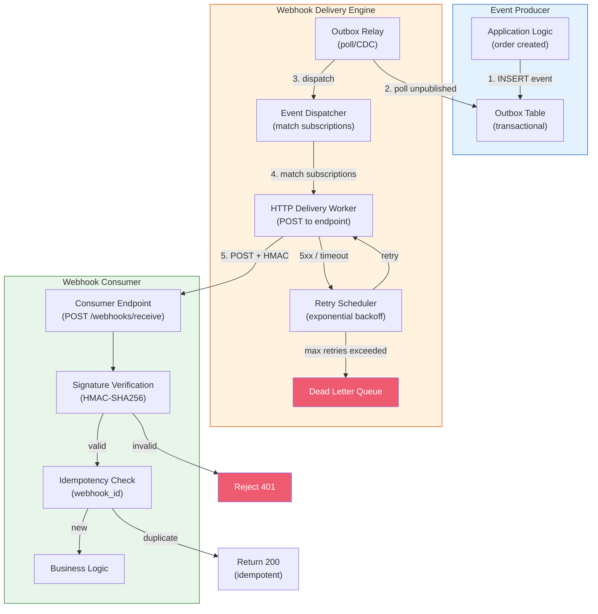
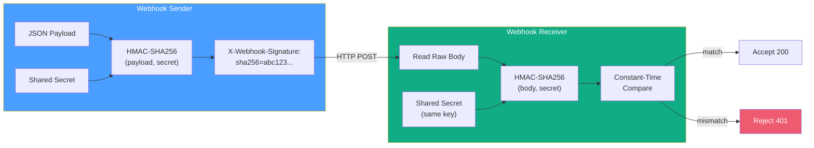
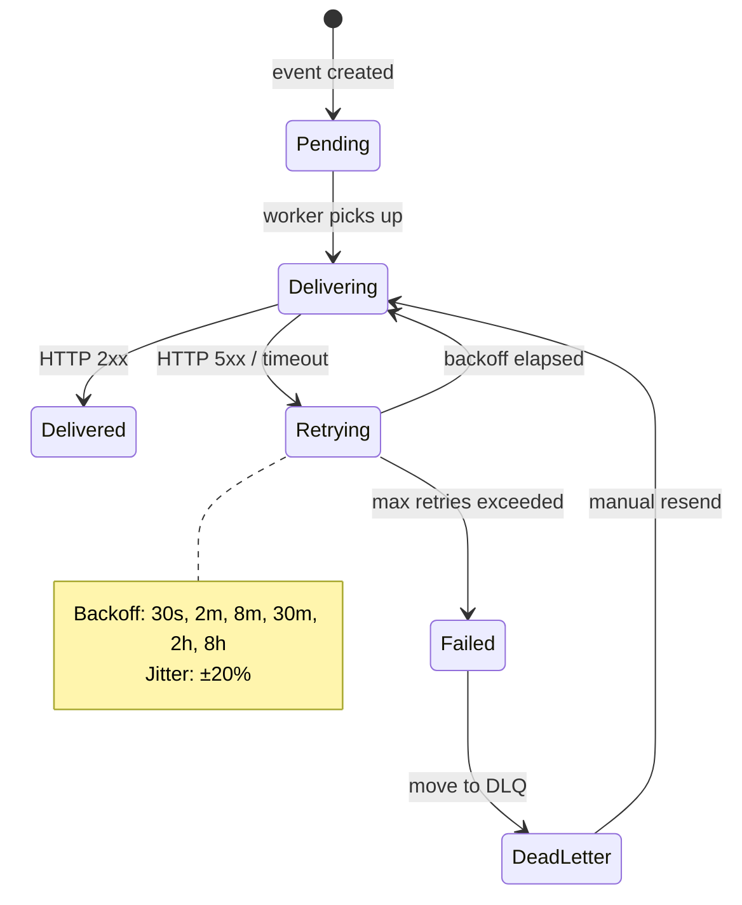

# Webhook Design Patterns / Webhook 設計模式

## Intent / 意圖

Webhook 是一種 **push-based 的事件通知機制**——當系統 A 發生特定事件時，主動向系統 B 預先註冊的 URL 發送 HTTP POST 請求。相比 polling（系統 B 定期詢問系統 A「有新資料嗎？」），webhook 具有更低的延遲、更少的無效請求和更高的資源效率。本篇涵蓋 webhook 的核心設計模式：delivery guarantee（at-least-once）、retry with exponential backoff、HMAC signature verification、idempotency key、registration API、payload design、dead letter queue，以及 webhook vs polling vs SSE 的比較和適用場景。

核心問題：**如何設計一個可靠的 webhook 系統，確保事件「至少一次」送達接收方，同時讓接收方能驗證請求的真實性、處理重複投遞、以及在臨時故障後不遺失任何事件？**

---

## Problem / 問題情境

**場景一：Webhook 投遞失敗無人知曉** — 電商平台在訂單建立時向合作物流商發送 webhook。某天物流商的伺服器維護 2 小時，所有 webhook 回傳 503。平台沒有 retry 機制，600 筆訂單的通知就此遺失。物流商不知道有新訂單，客戶投訴包裹遲未出貨。若平台實作了 exponential backoff retry + dead letter queue，即使物流商暫時不可用，事件也會在恢復後自動重送。

**場景二：偽造 Webhook 導致安全事故** — 支付閘道向商戶系統發送支付成功的 webhook。攻擊者發現商戶的 webhook endpoint URL，偽造一個 `payment.completed` 事件。商戶系統未驗證 webhook 的簽章（HMAC signature），直接信任 payload 內容，將攻擊者的訂單標記為已付款並出貨。若商戶實作了 HMAC-SHA256 signature verification，偽造的 webhook 會因簽章不匹配而被拒絕。

**場景三：重複投遞導致重複處理** — 因網路超時，webhook sender 沒有收到 receiver 的 200 回應，觸發 retry。Receiver 收到同一筆 `order.created` 事件兩次，重複建立了兩個物流單。若 receiver 實作了基於 `webhook_id` 或 `idempotency_key` 的去重機制，第二次投遞會被識別為重複並安全忽略。

---

## Core Concepts / 核心概念

### Webhook Delivery Guarantee / 投遞保證

Webhook 系統通常提供 **at-least-once** delivery guarantee——事件至少被投遞一次，但可能因 retry 而投遞多次。

- **At-most-once**：發送一次，不 retry。最簡單但不可靠。
- **At-least-once**：發送直到收到成功回應（或達到 retry 上限）。接收方必須處理重複。
- **Exactly-once**：理論上不可能在分散式系統中完美實現。實務做法是 at-least-once + idempotency。

### Retry with Exponential Backoff / 指數退避重試

當 webhook 投遞失敗（5xx、timeout、connection refused）時，sender 不應立即重試，而是使用指數退避策略：

```
Attempt 1: 立即
Attempt 2: 30 秒後
Attempt 3: 2 分鐘後
Attempt 4: 8 分鐘後
Attempt 5: 30 分鐘後
Attempt 6: 2 小時後
Attempt 7: 8 小時後（最後一次嘗試）
```

加上 **jitter**（隨機偏移）避免 thundering herd——所有 retry 在同一時間發送打爆接收方。

常見的 retry policy：最多 7 次嘗試，跨越 24-72 小時。超過後將事件移入 dead letter queue。

### HMAC Signature Verification / HMAC 簽章驗證

Sender 和 receiver 共享一個 secret key。Sender 在每次投遞時計算 payload 的 HMAC-SHA256 並放入 header：

```
X-Webhook-Signature: sha256=<HMAC(payload, secret)>
```

Receiver 收到後：
1. 讀取 raw request body
2. 用自己的 secret 計算 HMAC
3. **Constant-time compare** 計算結果與 header 中的值
4. 不匹配則拒絕（返回 401/403）

**重要**：必須使用 constant-time comparison（`crypto/hmac.Equal` 或 `ring::constant_time::verify_slices_are_equal`）避免 timing attack。

### Idempotency Key / 冪等鍵

每個 webhook event 攜帶一個唯一的 `webhook_id`（或 `idempotency_key`）。Receiver 在處理前檢查此 ID 是否已在本地記錄中：

- **已存在**：直接回傳 200，不再處理（冪等）
- **不存在**：處理事件，並將 ID 記錄到 DB/Redis（設 TTL 如 7 天）

這是實現 effectively-once 語義的關鍵——at-least-once delivery + idempotent processing = effectively-once。

### Webhook Registration API / 註冊 API

Webhook system 通常提供 CRUD API 讓消費者管理自己的 webhook 訂閱：

```
POST   /webhooks          → 建立 webhook endpoint
GET    /webhooks           → 列出所有 webhook endpoints
GET    /webhooks/{id}      → 取得特定 webhook 詳情
PATCH  /webhooks/{id}      → 更新 endpoint URL 或 event types
DELETE /webhooks/{id}      → 刪除 webhook
POST   /webhooks/{id}/test → 發送測試事件
```

Registration 資料包含：
- `url`：接收 webhook 的 endpoint
- `events`：訂閱的事件類型（`order.created`、`payment.completed`）
- `secret`：用於 HMAC 簽章的共享密鑰
- `active`：是否啟用
- `metadata`：自訂標籤

### Webhook Payload Design / Payload 設計

**Thin payload**（推薦）：只包含事件類型和資源 ID，receiver 收到後回查 API 取得完整資料。

```json
{
  "webhook_id": "wh_abc123",
  "event_type": "order.created",
  "created_at": "2026-02-18T10:30:00Z",
  "data": {
    "order_id": "ord_789"
  }
}
```

**Fat payload**：包含完整的資源資料。

```json
{
  "webhook_id": "wh_abc123",
  "event_type": "order.created",
  "created_at": "2026-02-18T10:30:00Z",
  "data": {
    "order_id": "ord_789",
    "customer_name": "Alice",
    "items": [...],
    "total_amount": 199.99
  }
}
```

Thin payload 優點：減少資料洩漏風險、payload 小、不存在 schema coupling。缺點：receiver 需要額外 API call。

### Dead Letter Queue (DLQ) / 死信佇列

超過 retry 上限仍失敗的 webhook 事件被放入 DLQ。DLQ 提供：
- **可見性**：管理介面顯示所有失敗事件
- **手動重送**：運維可在問題修復後一鍵重送
- **告警**：DLQ 深度超過閾值時通知相關團隊

### Webhook vs Polling vs SSE / 推送機制比較

| 維度 | Webhook | Polling | SSE |
|------|---------|---------|-----|
| 方向 | Server → Client（push） | Client → Server（pull） | Server → Client（push） |
| 延遲 | 秒級 | 取決於 polling interval | 毫秒級 |
| 資源效率 | 高（有事件才發送） | 低（大量空回應） | 中（保持連線） |
| 可靠性 | 需要 retry + DLQ | 天然冪等（GET） | 需要重連邏輯 |
| 防火牆友好 | Client 需暴露 public URL | Client 主動出連 ✓ | Client 主動出連 ✓ |
| 適用場景 | B2B 整合、支付通知 | 簡單整合、不可暴露端點 | Real-time UI 更新 |

---

## Architecture / 架構

### Webhook Delivery Pipeline



### HMAC Signature Flow



### Retry State Machine



---

## How It Works / 運作原理

### Webhook Sender 的完整投遞流程

1. **事件產生**：應用邏輯完成業務操作（如訂單建立），在同一個 DB transaction 中將事件寫入 outbox table。這確保「業務操作成功 ↔ 事件記錄存在」的原子性。

2. **Outbox Relay 擷取**：獨立的 relay 程序（polling 或 CDC）讀取 outbox 中未投遞的事件，標記為 processing。

3. **訂閱匹配**：根據事件類型（`order.created`）查詢 webhook subscription table，找到所有訂閱此事件的 endpoint。

4. **Payload 建構**：建構 JSON payload，包含 `webhook_id`（unique ID）、`event_type`、`created_at`、`data`。

5. **HMAC 簽章計算**：使用 subscription 的 shared secret 計算 `HMAC-SHA256(payload_bytes)`，放入 `X-Webhook-Signature` header。

6. **HTTP POST 發送**：向 consumer 的 endpoint 發送 POST 請求。設定合理的 timeout（通常 5-10 秒）。

7. **回應處理**：
   - **2xx**：投遞成功，標記為 delivered
   - **3xx**：不跟隨 redirect（安全考量——避免 SSRF）
   - **4xx**（non-429）：consumer 邏輯錯誤，不 retry（除 429 Too Many Requests 外）
   - **429**：consumer 限流，按 `Retry-After` header 延遲重試
   - **5xx / timeout / connection error**：安排 retry

8. **Retry 排程**：計算下次 retry 時間 = `base_delay * 2^attempt + random_jitter`。將事件放回 retry queue。

9. **Dead Letter**：超過 max retries（如 7 次，跨越 ~24 小時）後，事件移入 DLQ。觸發告警通知 webhook consumer 和平台管理員。

### Webhook Receiver 的處理流程

1. **接收 HTTP POST**：驗證 Content-Type 是 `application/json`。

2. **讀取 Raw Body**：必須先讀取原始 bytes（用於 HMAC 驗證），再 deserialize JSON。不能先 parse 再 serialize 回去計算 HMAC——JSON serialization 不保證 key 順序。

3. **Signature Verification**：用 shared secret 計算 `HMAC-SHA256(raw_body)`，constant-time compare 與 `X-Webhook-Signature` header 中的值。不匹配 → 返回 401。

4. **Idempotency Check**：從 payload 提取 `webhook_id`，查詢本地記錄（DB 或 Redis）。若已存在 → 返回 200（不再處理）。

5. **快速回應**：在開始處理業務邏輯**之前**先回傳 200 OK。這避免 sender 因 receiver 處理時間過長而 timeout 觸發不必要的 retry。

6. **非同步處理**：將事件放入內部 queue（channel/message queue），由背景 worker 處理實際的業務邏輯。

7. **記錄 webhook_id**：業務處理完成後，將 `webhook_id` 記錄到 DB（設 TTL 7-30 天），用於後續的去重。

---

## Rust 實作

Webhook sender with HMAC signing + exponential backoff retry in Axum。

```rust
// webhook_system.rs — Axum 0.8 + HMAC-SHA256 + Retry
// Cargo.toml dependencies:
// axum = "0.8"
// tokio = { version = "1", features = ["full"] }
// serde = { version = "1", features = ["derive"] }
// serde_json = "1"
// hmac = "0.12"
// sha2 = "0.10"
// hex = "0.4"
// uuid = { version = "1", features = ["v4"] }
// reqwest = { version = "0.12", features = ["json"] }
// tracing = "0.1"
// tracing-subscriber = "0.3"

use axum::{
    body::Bytes,
    extract::State,
    http::{HeaderMap, StatusCode},
    routing::{get, post},
    Json, Router,
};
use hmac::{Hmac, Mac};
use serde::{Deserialize, Serialize};
use sha2::Sha256;
use std::{
    collections::HashMap,
    sync::{Arc, Mutex},
    time::Duration,
};
use tracing::{error, info, warn};
use uuid::Uuid;

type HmacSha256 = Hmac<Sha256>;

// ---------- Data Models ----------

#[derive(Debug, Clone, Serialize, Deserialize)]
struct WebhookEvent {
    webhook_id: String,
    event_type: String,
    created_at: String,
    data: serde_json::Value,
}

#[derive(Debug, Clone, Serialize, Deserialize)]
struct WebhookSubscription {
    id: String,
    url: String,
    secret: String,
    events: Vec<String>,
    active: bool,
}

#[derive(Debug, Clone, Serialize, Deserialize)]
struct DeliveryRecord {
    webhook_id: String,
    subscription_id: String,
    status: DeliveryStatus,
    attempts: u32,
    last_error: Option<String>,
}

#[derive(Debug, Clone, Serialize, Deserialize, PartialEq)]
enum DeliveryStatus {
    Pending,
    Delivered,
    Retrying,
    Failed,
}

// ---------- Webhook Sender ----------

struct WebhookSender {
    http_client: reqwest::Client,
    max_retries: u32,
    base_delay: Duration,
}

impl WebhookSender {
    fn new() -> Self {
        let http_client = reqwest::Client::builder()
            .timeout(Duration::from_secs(10))
            .connect_timeout(Duration::from_secs(5))
            .redirect(reqwest::redirect::Policy::none()) // 不跟隨 redirect（防 SSRF）
            .build()
            .unwrap();

        Self {
            http_client,
            max_retries: 7,
            base_delay: Duration::from_secs(30),
        }
    }

    /// 計算 HMAC-SHA256 簽章
    fn compute_signature(payload: &[u8], secret: &str) -> String {
        let mut mac =
            HmacSha256::new_from_slice(secret.as_bytes()).expect("HMAC can take key of any size");
        mac.update(payload);
        let result = mac.finalize();
        format!("sha256={}", hex::encode(result.into_bytes()))
    }

    /// 發送 webhook with retry
    async fn deliver(
        &self,
        event: &WebhookEvent,
        subscription: &WebhookSubscription,
    ) -> DeliveryRecord {
        let payload = serde_json::to_vec(event).unwrap();
        let signature = Self::compute_signature(&payload, &subscription.secret);

        let mut record = DeliveryRecord {
            webhook_id: event.webhook_id.clone(),
            subscription_id: subscription.id.clone(),
            status: DeliveryStatus::Pending,
            attempts: 0,
            last_error: None,
        };

        for attempt in 0..=self.max_retries {
            record.attempts = attempt + 1;

            if attempt > 0 {
                // Exponential backoff with jitter
                let delay_secs = self.base_delay.as_secs() * 2u64.pow(attempt - 1);
                let jitter = (rand_jitter() * delay_secs as f64) as u64;
                let actual_delay = Duration::from_secs(delay_secs + jitter);
                info!(
                    attempt = attempt + 1,
                    delay_secs = actual_delay.as_secs(),
                    webhook_id = %event.webhook_id,
                    "retrying webhook delivery"
                );
                tokio::time::sleep(actual_delay).await;
            }

            match self
                .http_client
                .post(&subscription.url)
                .header("Content-Type", "application/json")
                .header("X-Webhook-Signature", &signature)
                .header("X-Webhook-Id", &event.webhook_id)
                .header("X-Webhook-Event", &event.event_type)
                .body(payload.clone())
                .send()
                .await
            {
                Ok(resp) if resp.status().is_success() => {
                    record.status = DeliveryStatus::Delivered;
                    info!(
                        webhook_id = %event.webhook_id,
                        attempts = record.attempts,
                        status = %resp.status(),
                        "webhook delivered successfully"
                    );
                    return record;
                }
                Ok(resp) if resp.status().as_u16() >= 400 && resp.status().as_u16() < 500 => {
                    // 4xx（非 429）不 retry
                    if resp.status().as_u16() != 429 {
                        record.status = DeliveryStatus::Failed;
                        record.last_error =
                            Some(format!("client error: {}", resp.status()));
                        warn!(
                            webhook_id = %event.webhook_id,
                            status = %resp.status(),
                            "webhook rejected by consumer (4xx, not retrying)"
                        );
                        return record;
                    }
                    record.status = DeliveryStatus::Retrying;
                    record.last_error = Some("rate limited (429)".to_string());
                }
                Ok(resp) => {
                    record.status = DeliveryStatus::Retrying;
                    record.last_error =
                        Some(format!("server error: {}", resp.status()));
                    warn!(
                        webhook_id = %event.webhook_id,
                        status = %resp.status(),
                        attempt = attempt + 1,
                        "webhook delivery failed, will retry"
                    );
                }
                Err(e) => {
                    record.status = DeliveryStatus::Retrying;
                    record.last_error = Some(format!("connection error: {e}"));
                    warn!(
                        webhook_id = %event.webhook_id,
                        error = %e,
                        attempt = attempt + 1,
                        "webhook delivery error, will retry"
                    );
                }
            }
        }

        record.status = DeliveryStatus::Failed;
        error!(
            webhook_id = %event.webhook_id,
            attempts = record.attempts,
            "webhook delivery failed after all retries, moving to DLQ"
        );
        record
    }
}

fn rand_jitter() -> f64 {
    // 簡化版 jitter（±20%），生產環境用 rand crate
    0.2
}

// ---------- Webhook Receiver ----------

#[derive(Clone)]
struct ReceiverState {
    secret: String,
    processed_ids: Arc<Mutex<HashMap<String, bool>>>, // 實際用 Redis with TTL
}

/// 驗證 HMAC 簽章（constant-time compare）
fn verify_signature(payload: &[u8], secret: &str, signature_header: &str) -> bool {
    let expected_prefix = "sha256=";
    if !signature_header.starts_with(expected_prefix) {
        return false;
    }
    let provided_hex = &signature_header[expected_prefix.len()..];
    let provided_bytes = match hex::decode(provided_hex) {
        Ok(b) => b,
        Err(_) => return false,
    };

    let mut mac =
        HmacSha256::new_from_slice(secret.as_bytes()).expect("HMAC can take key of any size");
    mac.update(payload);

    // constant-time verification（防止 timing attack）
    mac.verify_slice(&provided_bytes).is_ok()
}

async fn receive_webhook(
    State(state): State<ReceiverState>,
    headers: HeaderMap,
    body: Bytes,
) -> Result<Json<serde_json::Value>, StatusCode> {
    // Step 1: 驗證 signature
    let signature = headers
        .get("x-webhook-signature")
        .and_then(|v| v.to_str().ok())
        .unwrap_or("");

    if !verify_signature(&body, &state.secret, signature) {
        warn!("webhook signature verification failed");
        return Err(StatusCode::UNAUTHORIZED);
    }

    // Step 2: Parse payload
    let event: WebhookEvent = serde_json::from_slice(&body).map_err(|e| {
        warn!(error = %e, "invalid webhook payload");
        StatusCode::BAD_REQUEST
    })?;

    // Step 3: Idempotency check
    {
        let mut processed = state.processed_ids.lock().unwrap();
        if processed.contains_key(&event.webhook_id) {
            info!(
                webhook_id = %event.webhook_id,
                "duplicate webhook, returning 200 (idempotent)"
            );
            return Ok(Json(
                serde_json::json!({"status": "already_processed"}),
            ));
        }
        processed.insert(event.webhook_id.clone(), true);
    }

    // Step 4: 快速回應，非同步處理
    info!(
        webhook_id = %event.webhook_id,
        event_type = %event.event_type,
        "webhook received and accepted"
    );

    // 實際生產環境：將 event 放入 internal queue 由 worker 處理
    // tokio::spawn(async move { process_event(event).await });

    Ok(Json(serde_json::json!({"status": "accepted"})))
}

// ---------- Main ----------

#[tokio::main]
async fn main() {
    tracing_subscriber::fmt::init();

    // --- Sender Demo ---
    let sender = WebhookSender::new();
    let event = WebhookEvent {
        webhook_id: format!("wh_{}", Uuid::new_v4()),
        event_type: "order.created".to_string(),
        created_at: "2026-02-18T10:30:00Z".to_string(),
        data: serde_json::json!({
            "order_id": "ord_789",
            "customer_id": "cust_456",
            "total_amount": 199.99
        }),
    };

    let subscription = WebhookSubscription {
        id: "sub_001".to_string(),
        url: "http://localhost:3001/webhooks/receive".to_string(),
        secret: "whsec_my_super_secret_key_2026".to_string(),
        events: vec!["order.created".to_string()],
        active: true,
    };

    info!("webhook_id={}, signature={}",
        event.webhook_id,
        WebhookSender::compute_signature(
            &serde_json::to_vec(&event).unwrap(),
            &subscription.secret
        )
    );

    // --- Receiver Server ---
    let receiver_state = ReceiverState {
        secret: "whsec_my_super_secret_key_2026".to_string(),
        processed_ids: Arc::new(Mutex::new(HashMap::new())),
    };

    let app = Router::new()
        .route("/webhooks/receive", post(receive_webhook))
        .route("/health", get(|| async { "OK" }))
        .with_state(receiver_state);

    info!("starting webhook receiver on :3001");
    let listener = tokio::net::TcpListener::bind("0.0.0.0:3001").await.unwrap();
    axum::serve(listener, app).await.unwrap();
}

// Output:
// $ cargo run
// INFO starting webhook receiver on :3001
//
// $ curl -X POST http://localhost:3001/webhooks/receive \
//   -H "Content-Type: application/json" \
//   -H "X-Webhook-Signature: sha256=<valid_signature>" \
//   -d '{"webhook_id":"wh_test1","event_type":"order.created","created_at":"...","data":{"order_id":"ord_1"}}'
// {"status":"accepted"}
//
// # 重複發送同一個 webhook_id：
// {"status":"already_processed"}
//
// # 錯誤簽章：
// 401 Unauthorized
```

---

## Go 實作

Webhook receiver with HMAC signature verification + idempotency check。

```go
// webhook_system.go — Go 1.24+ / net/http + crypto/hmac + retry
package main

import (
	"bytes"
	"crypto/hmac"
	"crypto/sha256"
	"encoding/hex"
	"encoding/json"
	"fmt"
	"io"
	"log/slog"
	"math"
	"net/http"
	"os"
	"strings"
	"sync"
	"time"

	"github.com/google/uuid"
)

// ---------- Data Models ----------

type WebhookEvent struct {
	WebhookID string          `json:"webhook_id"`
	EventType string          `json:"event_type"`
	CreatedAt string          `json:"created_at"`
	Data      json.RawMessage `json:"data"`
}

type WebhookSubscription struct {
	ID     string   `json:"id"`
	URL    string   `json:"url"`
	Secret string   `json:"secret"`
	Events []string `json:"events"`
	Active bool     `json:"active"`
}

type DeliveryStatus string

const (
	StatusPending   DeliveryStatus = "pending"
	StatusDelivered DeliveryStatus = "delivered"
	StatusRetrying  DeliveryStatus = "retrying"
	StatusFailed    DeliveryStatus = "failed"
)

type DeliveryRecord struct {
	WebhookID      string         `json:"webhook_id"`
	SubscriptionID string         `json:"subscription_id"`
	Status         DeliveryStatus `json:"status"`
	Attempts       int            `json:"attempts"`
	LastError      string         `json:"last_error,omitempty"`
}

// ---------- Webhook Sender ----------

type WebhookSender struct {
	client     *http.Client
	maxRetries int
	baseDelay  time.Duration
	logger     *slog.Logger
}

func NewWebhookSender(logger *slog.Logger) *WebhookSender {
	return &WebhookSender{
		client: &http.Client{
			Timeout: 10 * time.Second,
			CheckRedirect: func(req *http.Request, via []*http.Request) error {
				return http.ErrUseLastResponse // 不跟隨 redirect（防 SSRF）
			},
		},
		maxRetries: 7,
		baseDelay:  30 * time.Second,
		logger:     logger,
	}
}

// ComputeSignature 計算 HMAC-SHA256 簽章
func ComputeSignature(payload []byte, secret string) string {
	mac := hmac.New(sha256.New, []byte(secret))
	mac.Write(payload)
	return "sha256=" + hex.EncodeToString(mac.Sum(nil))
}

// Deliver 發送 webhook with exponential backoff retry
func (ws *WebhookSender) Deliver(event *WebhookEvent, sub *WebhookSubscription) DeliveryRecord {
	payload, _ := json.Marshal(event)
	signature := ComputeSignature(payload, sub.Secret)

	record := DeliveryRecord{
		WebhookID:      event.WebhookID,
		SubscriptionID: sub.ID,
		Status:         StatusPending,
	}

	for attempt := 0; attempt <= ws.maxRetries; attempt++ {
		record.Attempts = attempt + 1

		if attempt > 0 {
			// Exponential backoff with jitter
			delaySecs := float64(ws.baseDelay.Seconds()) * math.Pow(2, float64(attempt-1))
			jitter := delaySecs * 0.2 // ±20% jitter
			actualDelay := time.Duration(delaySecs+jitter) * time.Second
			ws.logger.Info("retrying webhook delivery",
				slog.Int("attempt", attempt+1),
				slog.Duration("delay", actualDelay),
				slog.String("webhook_id", event.WebhookID),
			)
			time.Sleep(actualDelay)
		}

		req, err := http.NewRequest("POST", sub.URL, bytes.NewReader(payload))
		if err != nil {
			record.LastError = fmt.Sprintf("build request: %v", err)
			continue
		}
		req.Header.Set("Content-Type", "application/json")
		req.Header.Set("X-Webhook-Signature", signature)
		req.Header.Set("X-Webhook-Id", event.WebhookID)
		req.Header.Set("X-Webhook-Event", event.EventType)

		resp, err := ws.client.Do(req)
		if err != nil {
			record.Status = StatusRetrying
			record.LastError = fmt.Sprintf("connection error: %v", err)
			ws.logger.Warn("webhook delivery error",
				slog.String("webhook_id", event.WebhookID),
				slog.String("error", err.Error()),
				slog.Int("attempt", attempt+1),
			)
			continue
		}
		resp.Body.Close()

		if resp.StatusCode >= 200 && resp.StatusCode < 300 {
			record.Status = StatusDelivered
			ws.logger.Info("webhook delivered",
				slog.String("webhook_id", event.WebhookID),
				slog.Int("attempts", record.Attempts),
				slog.Int("status_code", resp.StatusCode),
			)
			return record
		}

		if resp.StatusCode >= 400 && resp.StatusCode < 500 && resp.StatusCode != 429 {
			record.Status = StatusFailed
			record.LastError = fmt.Sprintf("client error: %d", resp.StatusCode)
			ws.logger.Warn("webhook rejected (4xx, not retrying)",
				slog.String("webhook_id", event.WebhookID),
				slog.Int("status_code", resp.StatusCode),
			)
			return record
		}

		record.Status = StatusRetrying
		record.LastError = fmt.Sprintf("server error: %d", resp.StatusCode)
		ws.logger.Warn("webhook delivery failed, will retry",
			slog.String("webhook_id", event.WebhookID),
			slog.Int("status_code", resp.StatusCode),
			slog.Int("attempt", attempt+1),
		)
	}

	record.Status = StatusFailed
	ws.logger.Error("webhook delivery failed after all retries, moving to DLQ",
		slog.String("webhook_id", event.WebhookID),
		slog.Int("attempts", record.Attempts),
	)
	return record
}

// ---------- Webhook Receiver ----------

type WebhookReceiver struct {
	secret       string
	processedIDs sync.Map // map[string]bool — 生產環境用 Redis with TTL
	logger       *slog.Logger
}

func NewWebhookReceiver(secret string, logger *slog.Logger) *WebhookReceiver {
	return &WebhookReceiver{
		secret: secret,
		logger: logger,
	}
}

// VerifySignature 驗證 HMAC-SHA256 簽章（constant-time compare）
func VerifySignature(payload []byte, secret, signatureHeader string) bool {
	prefix := "sha256="
	if !strings.HasPrefix(signatureHeader, prefix) {
		return false
	}
	providedHex := signatureHeader[len(prefix):]
	providedBytes, err := hex.DecodeString(providedHex)
	if err != nil {
		return false
	}

	mac := hmac.New(sha256.New, []byte(secret))
	mac.Write(payload)
	expectedBytes := mac.Sum(nil)

	// constant-time comparison（防 timing attack）
	return hmac.Equal(providedBytes, expectedBytes)
}

func (wr *WebhookReceiver) HandleWebhook(w http.ResponseWriter, r *http.Request) {
	// Step 1: 讀取 raw body（用於 HMAC 驗證）
	body, err := io.ReadAll(io.LimitReader(r.Body, 1<<20)) // 限制 1MB
	if err != nil {
		http.Error(w, `{"error":"failed to read body"}`, http.StatusBadRequest)
		return
	}
	defer r.Body.Close()

	// Step 2: 驗證 signature
	signature := r.Header.Get("X-Webhook-Signature")
	if !VerifySignature(body, wr.secret, signature) {
		wr.logger.Warn("webhook signature verification failed",
			slog.String("remote_addr", r.RemoteAddr),
		)
		http.Error(w, `{"error":"invalid signature"}`, http.StatusUnauthorized)
		return
	}

	// Step 3: Parse payload
	var event WebhookEvent
	if err := json.Unmarshal(body, &event); err != nil {
		wr.logger.Warn("invalid webhook payload", slog.String("error", err.Error()))
		http.Error(w, `{"error":"invalid payload"}`, http.StatusBadRequest)
		return
	}

	// Step 4: Idempotency check
	if _, loaded := wr.processedIDs.LoadOrStore(event.WebhookID, true); loaded {
		wr.logger.Info("duplicate webhook, returning 200 (idempotent)",
			slog.String("webhook_id", event.WebhookID),
		)
		w.Header().Set("Content-Type", "application/json")
		json.NewEncoder(w).Encode(map[string]string{"status": "already_processed"})
		return
	}

	// Step 5: 快速回應，非同步處理
	wr.logger.Info("webhook received and accepted",
		slog.String("webhook_id", event.WebhookID),
		slog.String("event_type", event.EventType),
	)

	// 生產環境：放入 internal queue 由 worker 處理
	// go processEvent(event)

	w.Header().Set("Content-Type", "application/json")
	json.NewEncoder(w).Encode(map[string]string{"status": "accepted"})
}

func main() {
	logger := slog.New(slog.NewJSONHandler(os.Stdout, &slog.HandlerOptions{Level: slog.LevelInfo}))

	// Demo: 建立 event 和計算 signature
	event := &WebhookEvent{
		WebhookID: "wh_" + uuid.New().String()[:8],
		EventType: "order.created",
		CreatedAt: time.Now().UTC().Format(time.RFC3339),
		Data:      json.RawMessage(`{"order_id":"ord_789","total_amount":199.99}`),
	}

	secret := "whsec_my_super_secret_key_2026"
	payload, _ := json.Marshal(event)
	signature := ComputeSignature(payload, secret)
	logger.Info("webhook prepared",
		slog.String("webhook_id", event.WebhookID),
		slog.String("signature", signature),
	)

	// Receiver server
	receiver := NewWebhookReceiver(secret, logger)

	mux := http.NewServeMux()
	mux.HandleFunc("POST /webhooks/receive", receiver.HandleWebhook)
	mux.HandleFunc("GET /health", func(w http.ResponseWriter, r *http.Request) {
		w.Write([]byte("OK"))
	})

	logger.Info("starting webhook receiver", slog.String("addr", ":3001"))
	server := &http.Server{Addr: ":3001", Handler: mux}
	if err := server.ListenAndServe(); err != nil {
		logger.Error("server error", slog.String("error", err.Error()))
	}
}

// Output:
// $ go run .
// {"level":"INFO","msg":"webhook prepared","webhook_id":"wh_a1b2c3d4",
//  "signature":"sha256=8f3c..."}
// {"level":"INFO","msg":"starting webhook receiver","addr":":3001"}
//
// $ curl -X POST http://localhost:3001/webhooks/receive \
//   -H "Content-Type: application/json" \
//   -H "X-Webhook-Signature: sha256=<valid>" \
//   -d '{"webhook_id":"wh_test","event_type":"order.created",...}'
// {"status":"accepted"}
//
// # 重複：
// {"status":"already_processed"}
//
// # 錯誤簽章：
// {"error":"invalid signature"}   (HTTP 401)
```

---

## Rust vs Go 對照表

| 比較維度 | Rust | Go |
|---------|------|-----|
| **HMAC 計算** | `hmac` + `sha2` crate，型別安全的 MAC API | `crypto/hmac` + `crypto/sha256` 標準庫，簡潔的 API |
| **Constant-time Compare** | `hmac::Mac::verify_slice()` 內建 constant-time | `hmac.Equal()` 標準庫函數 |
| **HTTP Client** | `reqwest` crate，async/await，支援 redirect policy | `net/http.Client`，同步但 goroutine 天然並發 |
| **Idempotency Store** | `HashMap` + `Mutex`（demo）；生產用 Redis | `sync.Map`（demo）；生產用 Redis |
| **Retry 實作** | `tokio::time::sleep` in async loop | `time.Sleep` in goroutine |
| **Body 讀取** | `axum::body::Bytes` 一次性讀取 raw bytes | `io.ReadAll(io.LimitReader(...))` 限制大小 |

---

## When to Use / 適用場景

- **B2B 事件通知**：支付閘道通知商戶支付結果（Stripe、PayPal）、SaaS 平台通知客戶資源狀態變更（GitHub webhook、Slack event subscription）。Webhook 是 B2B 整合的事實標準。

- **非同步工作流觸發**：訂單建立後觸發物流系統建立運單、使用者註冊後觸發歡迎信寄送。Webhook 將同步的呼叫鏈解耦為非同步的事件通知。

- **跨組織的事件訂閱**：當 consumer 是外部組織（不同公司、不同 VPC），無法直接存取 message queue。Webhook 透過 HTTP 跨越網路邊界。

---

## When NOT to Use / 不適用場景

- **Consumer 無法暴露 public URL**：Webhook 需要 consumer 有可達的 HTTP endpoint。如果 consumer 在防火牆後、NAT 後或桌面應用，webhook 不可行——改用 polling 或 WebSocket。

- **需要即時性（< 100ms）的場景**：Webhook 的投遞延遲受限於 HTTP 往返和 queue 處理，通常在秒級。需要毫秒級即時性時使用 WebSocket 或 SSE。

- **高吞吐量、高頻率的事件流**：每秒數萬筆事件使用 webhook 會對 sender 和 receiver 造成巨大的 HTTP connection 壓力。這類場景應使用 message queue（Kafka、RabbitMQ）而非 webhook。

- **需要 exactly-once 語義的場景**：Webhook 只能提供 at-least-once。如果 receiver 無法實作 idempotency（如呼叫不可逆的第三方 API），webhook 不適合。

---

## Real-World Examples / 真實世界案例

### Stripe — Webhook Delivery & Signature Verification

Stripe 的 webhook 系統是業界標杆。每筆支付事件（`payment_intent.succeeded`、`charge.refunded`）都會向商戶的 webhook endpoint 發送通知。核心設計：(1) HMAC-SHA256 簽章使用 `whsec_` prefix 的 secret；(2) 簽章包含 timestamp 防止 replay attack：`v1=HMAC(timestamp + "." + payload)`；(3) 商戶可以在 dashboard 查看每次投遞的 status、response code、retry 歷史；(4) 失敗的 webhook 自動 retry 最多 7 次（跨 3 天）；(5) 提供 Stripe CLI 的 `stripe listen` 命令將 webhook 轉發到 localhost 方便開發。

### GitHub — Webhook Events & Payload Design

GitHub 為 repository、organization、marketplace 提供超過 50 種 webhook event type。設計特點：(1) 每個 event 的 payload 結構在文件中明確定義（schema contract）；(2) `X-GitHub-Event` header 標示事件類型；(3) `X-Hub-Signature-256` header 攜帶 HMAC-SHA256 簽章；(4) 提供 "recent deliveries" 介面讓使用者查看投遞歷史和 redeliver；(5) 支援 content type 選擇（`application/json` 或 `application/x-www-form-urlencoded`）。

### Shopify — Webhook Rate Limiting & Compliance

Shopify 的 webhook 系統每天處理數十億筆事件。面臨的挑戰：(1) 大量商戶的 webhook endpoint 品質參差不齊（慢回應、頻繁 5xx）；(2) 部分商戶的 endpoint 被攻擊者劫持。解決方案：webhook endpoint 必須在 5 秒內回應（否則視為 timeout）；連續失敗 19 次後自動停用 webhook（需商戶手動重新啟用）；mandatory HMAC verification 且 secret 定期 rotation。

---

## Interview Questions / 面試常見問題

### Q1: Webhook 如何保證可靠投遞？如果 receiver 暫時不可用怎麼辦？

**回答**：

Webhook 透過 **at-least-once delivery** 保證可靠性，核心機制：

1. **Transactional Outbox**：事件與業務資料在同一個 DB transaction 中寫入，確保「業務成功 ↔ 事件存在」的原子性。不會出現「訂單已建立但 webhook event 遺失」的情況。

2. **Exponential Backoff Retry**：投遞失敗時不立即重試，而是以指數增長的間隔重試：30s → 2m → 8m → 30m → 2h → 8h。加上 jitter 避免所有 retry 在同一時間發送。

3. **Dead Letter Queue**：超過最大重試次數（如 7 次，跨 24-72 小時）後，事件移入 DLQ。管理員可在 receiver 恢復後手動重送。

4. **Receiver 端的 idempotency**：因為 at-least-once 可能重複投遞，receiver 必須實作冪等——基於 `webhook_id` 的去重機制確保同一事件只被處理一次。

如果 receiver 長時間不可用（如數天），DLQ 中的事件會持續累積。webhook provider 通常提供 "resend all" 功能或 event replay API，讓 receiver 恢復後批量處理遺漏的事件。

### Q2: 為什麼 HMAC signature 的比較必須是 constant-time？什麼是 timing attack？

**回答**：

**Timing Attack 原理**：普通的字串比較（如 `==`）在發現第一個不匹配的 byte 時立即返回 false。攻擊者可以：
1. 發送一個 signature，測量回應時間
2. 逐 byte 嘗試：如果第一個 byte 正確，比較會進行到第二個 byte，回應時間略長
3. 重複此過程，逐步推斷出正確的 signature

雖然每次差異只有數十 nanosecond，但統計分析足夠大量的請求後可以區分。

**Constant-time Compare 的做法**：無論 signature 是否匹配，都遍歷完所有 bytes。Go 的 `hmac.Equal()` 和 Rust 的 `hmac::Mac::verify_slice()` 都使用 XOR + OR 累積差異的方式，確保執行時間不依賴於輸入的相似程度。

**實務建議**：永遠不要自己實作 HMAC comparison。使用語言標準庫或密碼學 library 提供的 constant-time compare 函數。

### Q3: Webhook 的 payload 應該包含完整資料（fat payload）還是只包含 ID（thin payload）？

**回答**：

**Thin Payload（推薦）**：只包含事件類型和資源 ID。

優點：
- **安全性**：敏感資料不在 webhook payload 中傳輸。即使 endpoint 被 MITM，只暴露 ID 不暴露資料。
- **資料一致性**：receiver 回查 API 時永遠取得最新狀態。fat payload 可能在投遞延遲期間已過時。
- **Schema 解耦**：payload 結構極簡，不需要維護 schema versioning。

缺點：receiver 需要額外的 API call 回查完整資料。

**Fat Payload**：包含完整的資源資料。

優點：receiver 不需要回查 API，減少往返延遲和 API 負載。

缺點：payload 大、資料可能過時、增加安全風險、schema 變更影響所有 consumer。

**建議**：大部分場景用 thin payload。Fat payload 適合 consumer 是外部組織且 API 回查有 rate limit 或延遲較高的場景。提供 API endpoint 讓 consumer 按需取得完整資料。

### Q4: 如何防止 webhook endpoint 被 SSRF 攻擊？

**回答**：

SSRF（Server-Side Request Forgery）風險：攻擊者註冊 webhook endpoint 為 `http://169.254.169.254/latest/meta-data/`（AWS metadata endpoint），webhook sender 向此 URL 發送 POST 請求，讀取到雲端 instance 的 IAM credential。

防禦策略：

1. **URL 驗證**：拒絕 private IP ranges（10.0.0.0/8、172.16.0.0/12、192.168.0.0/16、127.0.0.0/8、169.254.0.0/16）和 localhost。

2. **DNS 解析後再驗證**：URL 可能是 `http://evil.com` 但 DNS 解析到 127.0.0.1。必須在 DNS 解析後驗證 IP 不在 private range。

3. **不跟隨 redirect**：redirect 可能指向 internal URL。HTTP client 設定 `redirect: none`。

4. **限制 protocol**：只允許 `https://`（或 `http://` 用於 development）。拒絕 `file://`、`ftp://`、`gopher://`。

5. **IP allowlist**（可選）：只允許 webhook endpoint 在特定 IP range（如 consumer 提供的 CIDR）。

6. **Verification 機制**：註冊 webhook 時向 endpoint 發送 challenge（如 Slack 的 URL verification），確認 consumer 確實控制此 endpoint。

### Q5: Webhook vs Polling vs SSE，如何選擇？

**回答**：

選擇取決於三個關鍵維度：

| 維度 | Webhook | Polling | SSE |
|------|---------|---------|-----|
| Consumer 能否暴露 public URL？ | 必須 | 不需要 | 不需要 |
| 延遲要求 | 秒級 | 取決於 interval | 毫秒級 |
| 事件頻率 | 低-中（< 100/s） | 低 | 高 |

**選 Webhook 的情況**：
- B2B 整合（consumer 有 server）
- 事件頻率低但需要秒級通知
- 典型案例：支付通知、CI/CD 事件

**選 Polling 的情況**：
- Consumer 在防火牆後
- 事件頻率極低（每小時個位數）
- 不想維護 webhook 基礎設施
- 典型案例：定期同步庫存、每小時拉取報表

**選 SSE 的情況**：
- 需要 real-time UI 更新
- 高頻率事件流
- 瀏覽器直接消費
- 典型案例：股票報價、聊天訊息、即時通知

---

## Pitfalls / 常見陷阱

### 1. 先 Parse JSON 再計算 HMAC（通用）

**錯誤**：receiver 先將 body parse 為 JSON object，再 serialize 回 string 計算 HMAC。JSON serialization 不保證 key 順序和空白格式，計算出的 HMAC 幾乎一定與 sender 不同。

**解法**：先讀取 raw bytes 計算 HMAC，驗證通過後再 parse JSON。

### 2. 同步處理 Webhook 導致 Timeout（通用）

**錯誤**：receiver 在 HTTP handler 中執行完整的業務邏輯（呼叫 DB、呼叫其他服務），耗時 15 秒。Sender 等待 10 秒後 timeout，觸發 retry。Receiver 收到重複的 webhook 但沒有 idempotency check，處理兩次。

**解法**：收到 webhook 後立即回傳 200，將事件放入 internal queue 非同步處理。

### 3. Rust 特有：reqwest 的 timeout 不含 DNS resolution

```rust
// 問題：reqwest 的 timeout() 只控制 HTTP 請求的 timeout
// 但 DNS resolution 和 TCP handshake 可能各自花費數秒
let client = reqwest::Client::builder()
    .timeout(Duration::from_secs(10)) // 只控制 HTTP 部分
    .build()?;

// 如果 DNS 解析花了 30 秒，總耗時 40 秒

// 正確：同時設定 connect_timeout
let client = reqwest::Client::builder()
    .timeout(Duration::from_secs(10))        // 整體 timeout
    .connect_timeout(Duration::from_secs(5)) // 連線建立 timeout（含 DNS）
    .build()?;
```

### 4. Go 特有：http.Client 的預設 redirect 行為導致 SSRF

```go
// 問題：Go 的 http.Client 預設跟隨最多 10 次 redirect
// 攻擊者的 webhook endpoint 可以 302 redirect 到 internal IP
client := &http.Client{} // 預設允許 redirect
resp, _ := client.Post("http://evil.com/webhook", "application/json", body)
// evil.com 回傳 302 → http://169.254.169.254/metadata → SSRF 成功！

// 正確：禁止 redirect
client := &http.Client{
    CheckRedirect: func(req *http.Request, via []*http.Request) error {
        return http.ErrUseLastResponse // 不跟隨任何 redirect
    },
}
```

### 5. 未設定 Request Body 大小限制（通用）

**問題**：receiver 未限制 request body 大小。攻擊者發送 100MB 的 body 耗盡 receiver 記憶體。

**解法**：
- Go: `io.LimitReader(r.Body, 1<<20)` 限制 1MB
- Rust: Axum 的 `DefaultBodyLimit::max(1_048_576)` 或 `Bytes` extractor 配合 layer

### 6. Rust 特有：hex encoding 的大小寫不一致

```rust
// 問題：sender 用 hex::encode (lowercase)，receiver 用 uppercase 比較
// hex::encode produces "a1b2c3" (lowercase)
let signature = hex::encode(hmac_result); // "sha256=a1b2c3..."

// 但 receiver 預期 uppercase "SHA256=A1B2C3..." → 不匹配

// 正確：統一使用 lowercase，且使用 constant-time compare
// hex::encode 產生 lowercase 是慣例（Stripe、GitHub 都用 lowercase）
```

### 7. Go 特有：忘記 Close Response Body 導致 connection leak

```go
// 問題：webhook sender 發送後忘記 close response body
// TCP connection 不會被歸還到 connection pool，最終 goroutine leak
resp, err := client.Post(url, "application/json", body)
if err != nil {
    // 處理錯誤
    return
}
// 忘記 resp.Body.Close() → connection leak!

// 正確：
resp, err := client.Post(url, "application/json", body)
if err != nil {
    return
}
defer resp.Body.Close()
io.Copy(io.Discard, resp.Body) // 確保 body 被完全讀取，connection 可複用
```

---

## Cross-references / 交叉引用

- [[04_api_design_rest]] — REST API 設計原則，webhook registration API 遵循 REST 慣例
- [[19_idempotency_design]] — Idempotency 的完整設計模式，webhook receiver 的冪等實作基礎
- [[39_error_handling_retry]] — Retry 策略的詳細說明（exponential backoff、jitter、circuit breaker）
- [[28_owasp_api_security]] — OWASP API 安全，包含 SSRF 防禦和 HMAC 簽章驗證
- [[08_event_driven_architecture]] — Event-Driven Architecture 和 Transactional Outbox Pattern

---

## References / 參考資料

- [Stripe — Webhook Best Practices](https://stripe.com/docs/webhooks/best-practices) — Stripe 的 webhook 設計最佳實踐
- [GitHub — Webhooks Documentation](https://docs.github.com/en/webhooks) — GitHub webhook 的完整文件
- [Standard Webhooks](https://www.standardwebhooks.com/) — 由 Svix 主導的 webhook 標準化提案
- [Svix — Webhook as a Service](https://www.svix.com/) — 開源的 webhook delivery platform
- [OWASP — Server-Side Request Forgery](https://owasp.org/www-community/attacks/Server_Side_Request_Forgery) — SSRF 攻擊與防禦
