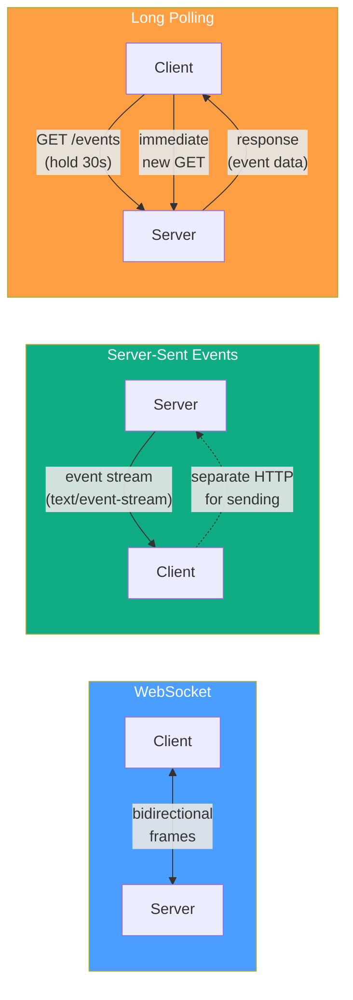
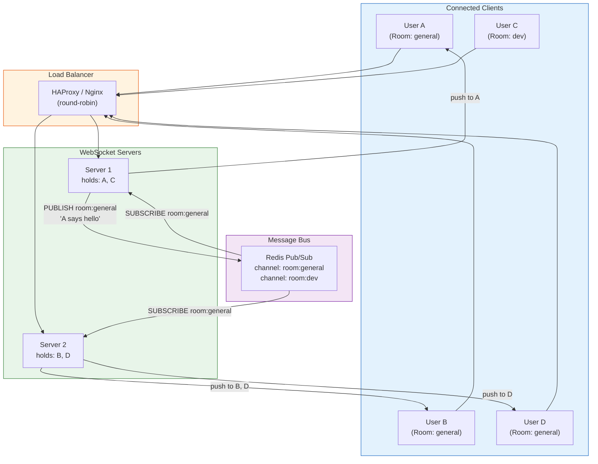
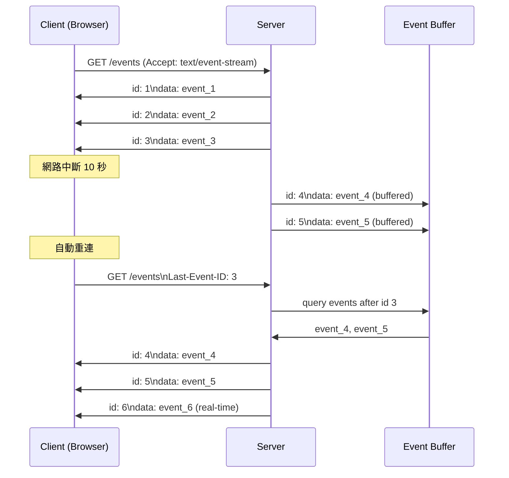

# Real-time Patterns / 即時通訊模式選型

## Intent / 意圖

即時通訊（Real-time Communication）是現代後端系統的核心需求之一——從聊天訊息、股票報價、協作編輯到即時通知，使用者期望看到「現在正在發生的事」而非「上次刷新時的狀態」。本篇系統性比較四種即時通訊技術（WebSocket、SSE、Long Polling、HTTP/2 Server Push），提供決策矩陣幫助選型，並深入探討大規模連線管理、heartbeat/ping-pong、reconnection 策略、fan-out patterns（pub/sub for real-time）、WebSocket 的 sticky sessions vs Redis pub/sub 水平擴展方案，以及 SSE 的 Last-Event-ID resumption 機制。

核心問題：**當系統需要將伺服器端的事件即時推送到客戶端時，應該選擇 WebSocket、SSE 還是 Long Polling？選擇後如何在數十萬併發連線的規模下保持穩定和可擴展？**

---

## Problem / 問題情境

**場景一：Polling 導致的資源浪費** — 即時股票報價系統使用 polling（每秒一次 GET /quotes）。10 萬個活躍使用者 = 每秒 10 萬個 HTTP request，但 90% 的回應是「沒有新資料」。API server 的 CPU 30% 花在處理空回應上，CDN 因 no-cache 每次都打穿到 origin。若改用 SSE，server 只在價格變動時推送，空閒連線的 CPU 成本幾乎為零。

**場景二：WebSocket 水平擴展的困境** — 聊天應用有 50 萬活躍使用者分佈在 10 台 server 上。User A 連接到 Server 1、User B 連接到 Server 5。A 發訊息給 B，Server 1 收到訊息但不知道 B 的 WebSocket 在 Server 5。若使用 sticky session，同一個 chatroom 的使用者必須連到同一台 server——但 chatroom 大小不均導致 server 負載不平衡。改用 Redis Pub/Sub 作為跨 server 的 message bus，每台 server 訂閱相關的 channel，訊息透過 Redis 廣播到所有持有目標使用者連線的 server。

**場景三：SSE 斷線後遺失事件** — 即時通知系統使用 SSE。使用者手機進入隧道 10 秒後恢復連線。在斷線期間發生了 3 筆通知，但 SSE reconnect 後這 3 筆通知遺失了。若 server 實作了 `Last-Event-ID` 機制，client 在重連時帶上最後收到的 event ID，server 從該 ID 之後重播遺漏的事件。

---

## Core Concepts / 核心概念

### WebSocket / 全雙工通訊協議

WebSocket（RFC 6455）是建立在 TCP 之上的全雙工通訊協議。特點：

- **Full-duplex**：client 和 server 可同時發送訊息（不需要 request-response 輪詢）
- **Low overhead**：初始 HTTP upgrade 握手後，後續的 frame header 只有 2-14 bytes
- **Binary & Text**：支援文字和二進位資料
- **Protocol**：`ws://`（明文）和 `wss://`（TLS）

**升級流程**：
```
Client → Server:
  GET /ws HTTP/1.1
  Upgrade: websocket
  Connection: Upgrade
  Sec-WebSocket-Key: dGhlIHNhbXBsZSBub25jZQ==

Server → Client:
  HTTP/1.1 101 Switching Protocols
  Upgrade: websocket
  Connection: Upgrade
  Sec-WebSocket-Accept: s3pPLMBiTxaQ9kYGzzhZRbK+xOo=
```

### Server-Sent Events (SSE) / 伺服器推送事件

SSE（HTML5 EventSource API）是建立在 HTTP 之上的**單向推送**協議。特點：

- **Server → Client only**：只有 server 可以推送，client 發送需要另開 HTTP request
- **Text-only**：只支援 UTF-8 文字（不支援 binary）
- **Auto-reconnect**：瀏覽器的 EventSource API 自動處理斷線重連
- **Last-Event-ID**：斷線重連時帶上最後收到的 event ID，server 可重播遺漏事件
- **HTTP/2 compatible**：SSE 在 HTTP/2 上不佔用額外的 TCP 連線（multiplexed）

**協議格式**：
```
data: {"price": 150.25, "symbol": "AAPL"}
id: evt_001
event: price_update

data: {"price": 2835.10, "symbol": "GOOG"}
id: evt_002
event: price_update
```

### Long Polling / 長輪詢

Long Polling 是在 WebSocket 和 SSE 出現之前的「偽即時」技術：

1. Client 發送 HTTP request
2. Server **不立即回應**，而是 hold 住連線直到有新資料或超時（通常 30s）
3. 回應後 client 立即發送新的 request
4. 重複步驟 1-3

**優點**：完全基於 HTTP，所有 proxy 和防火牆都支援。
**缺點**：每次回應都需要新的 HTTP request（header overhead）、伺服器需要 hold 住大量連線。

### HTTP/2 Server Push（已棄用）

HTTP/2 Server Push 是 HTTP/2 規範中的功能，允許 server 主動推送資源（如 CSS、JS）。但它用於**資源預載**而非**即時事件推送**，且 Chrome 在 2022 年移除了支援。**不建議用於 real-time 場景**。

### 技術選型決策矩陣

| 維度 | WebSocket | SSE | Long Polling |
|------|-----------|-----|-------------|
| 通訊方向 | 雙向 | 單向（Server→Client） | 單向（模擬） |
| 資料格式 | Text + Binary | Text only（UTF-8） | 任意 HTTP body |
| 連線成本 | 1 TCP 連線（持續） | 1 HTTP 連線（持續） | 頻繁建立/關閉 |
| HTTP/2 相容性 | 不適用（自有協議） | 天然相容（multiplexed） | 天然相容 |
| 自動重連 | 需自行實作 | EventSource 內建 | 天然（每次都是新 request） |
| 瀏覽器支援 | 全部 | 全部（IE 不支援） | 全部 |
| Proxy 友好度 | 部分 proxy 不支援 upgrade | 完全相容 | 完全相容 |
| 適用場景 | 聊天、遊戲、協作編輯 | 通知、即時 feed、stock ticker | 簡單整合、legacy 系統 |

### Connection Management at Scale / 大規模連線管理

每個 WebSocket/SSE 連線佔用一個 file descriptor 和少量記憶體。在 Linux 上：

- **File Descriptors**：預設 per-process limit 1024，需調高到 100K+（`ulimit -n` + `sysctl fs.file-max`）
- **Memory**：每個連線約 10-50 KB（取決於 buffer size）。10 萬連線 ≈ 1-5 GB
- **epoll**：Linux 的 I/O multiplexing，O(1) 效率處理大量連線（tokio/Go runtime 底層使用）

### Heartbeat / Ping-Pong

長連線必須有存活偵測機制，否則「半開連線」（client 已離線但 server 不知道）會持續佔用資源。

**WebSocket Ping/Pong Frame**：WebSocket 協議內建 ping/pong control frame。Server 定期發送 ping，client 自動回覆 pong。超過 N 秒未收到 pong → 關閉連線。

**SSE Heartbeat**：SSE 沒有內建 ping/pong。常見做法是定期發送 comment line（`: heartbeat`）或空 event。如果 TCP 連線斷了，write 會失敗，server 即可清理連線。

### Reconnection Strategies / 重連策略

- **SSE**：EventSource API 自動重連，預設間隔由 server 的 `retry:` 欄位控制。重連時帶上 `Last-Event-ID` header。
- **WebSocket**：需自行實作。最佳實踐：exponential backoff + jitter + max retries + server-suggested delay。
- **Last-Event-ID Resumption**：server 為每個 event 分配遞增的 ID。斷線重連後 server 從 ID 後開始重播。需要 server 端 buffer（如 Redis Streams 或 in-memory ring buffer）。

### Fan-Out Patterns / 扇出模式

當 server 收到一筆事件需要推送給多個 client 時的分發模式：

- **In-process broadcast**：tokio `broadcast` channel / Go `sync.Cond` 或 channel。單機有效，不跨 server。
- **Redis Pub/Sub**：事件發佈到 Redis channel，所有 server 訂閱。跨 server fan-out 的最常見方案。
- **NATS / Kafka**：更高吞吐量的 message bus，適合大規模系統。

### Scaling WebSocket / 水平擴展 WebSocket

**方案一：Sticky Sessions**
- Load balancer 根據 cookie 或 IP hash 將同一個使用者導向同一台 server
- 優點：簡單，不需要跨 server 通訊
- 缺點：負載不均衡、server 故障導致連線全部中斷

**方案二：Redis Pub/Sub（推薦）**
- 每台 server 訂閱相關的 Redis channel
- 事件發佈到 Redis，Redis 廣播到所有 server
- 每台 server 只推送給自己持有的連線
- 優點：負載均衡、server 無狀態、容錯性好

**方案三：Dedicated Message Broker（NATS、Kafka）**
- 與 Redis Pub/Sub 類似但更可靠（持久化、replay）
- 適合需要 message durability 的場景

---

## Architecture / 架構

### Real-time Technology Comparison



### WebSocket Scaling with Redis Pub/Sub



### SSE with Last-Event-ID Resumption



---

## How It Works / 運作原理

### SSE 的完整運作流程

1. **Client 發起連線**：瀏覽器 `new EventSource("/events")` 發送 HTTP GET 請求，`Accept: text/event-stream`。

2. **Server 回應**：設定 `Content-Type: text/event-stream`、`Cache-Control: no-cache`、`Connection: keep-alive`。回應 status 200 但**不關閉連線**。

3. **Server 推送事件**：以特定格式寫入 response body：
   ```
   id: <event_id>
   event: <event_type>
   data: <json_payload>
   \n
   ```
   每個事件以空行（`\n\n`）結尾。

4. **Client 處理事件**：`EventSource` 的 `onmessage` callback 被觸發。如果有 `event` 欄位，需要用 `addEventListener(event_type, ...)` 監聽。

5. **Heartbeat**：Server 每 15-30 秒發送 `: heartbeat\n\n`（comment line），保持連線活躍。如果 TCP 層的 write 失敗，server 得知 client 已斷線。

6. **斷線偵測**：EventSource 的 `onerror` callback 被觸發。瀏覽器自動在 `retry` 毫秒後重連，帶上 `Last-Event-ID` header。

7. **Server 端重播**：Server 收到帶有 `Last-Event-ID` 的 request，從 event buffer（in-memory ring buffer 或 Redis Streams）中找到該 ID 之後的所有事件，依序推送給 client。

### WebSocket 的大規模管理

1. **連線建立**：HTTP upgrade → WebSocket。Server 為此連線分配一個唯一 ID，加入 connection pool。

2. **Room/Channel 管理**：使用者加入 room（`JOIN room:general`）。Server 維護 `room → [connections]` 的映射。

3. **訊息發佈**：使用者發送訊息。Server 將訊息 PUBLISH 到 Redis channel `room:general`。

4. **跨 server Fan-out**：所有訂閱了 `room:general` 的 server 收到 Redis 通知。每台 server 遍歷自己持有的 `room:general` 連線，將訊息寫入每個 WebSocket。

5. **Ping/Pong 存活偵測**：Server 每 30 秒向所有連線發送 ping frame。未在 10 秒內收到 pong 的連線被標記為 dead 並清理。

6. **Graceful 斷線**：client 發送 close frame → server 回覆 close frame → TCP 關閉。或 server 主動 close（如部署新版本）→ client 收到 close event → 觸發重連邏輯。

7. **Reconnection（Client 端）**：
   ```
   Attempt 1: 立即
   Attempt 2: 1 秒 + random(0-1s)
   Attempt 3: 2 秒 + random(0-2s)
   Attempt 4: 4 秒 + random(0-4s)
   ...
   Max: 30 秒
   ```
   重連後重新加入之前的 room，並請求 server 從最後收到的 message ID 重播。

### Long Polling vs SSE 的資源效率比較

假設 10,000 個 client，每秒 2 個事件：

**Long Polling**：
- 每個事件 = 1 HTTP request + 1 HTTP response
- 每秒 20,000 HTTP transactions
- 每個 transaction 的 header overhead ≈ 500 bytes → 10 MB/s header waste

**SSE**：
- 10,000 持續連線（無 header overhead）
- 每秒 20,000 個 `data:` line（每個 ≈ 100 bytes）→ 2 MB/s 純資料
- 節省 80% 頻寬

---

## Rust 實作

SSE endpoint with Axum + tokio broadcast channel，支援 Last-Event-ID resumption。

```rust
// realtime_sse.rs — Axum 0.8 + tokio broadcast channel + SSE
// Cargo.toml dependencies:
// axum = "0.8"
// tokio = { version = "1", features = ["full"] }
// tokio-stream = "0.1"
// serde = { version = "1", features = ["derive"] }
// serde_json = "1"
// futures = "0.3"
// uuid = { version = "1", features = ["v4"] }
// tracing = "0.1"
// tracing-subscriber = "0.3"

use axum::{
    extract::{Query, State},
    http::HeaderMap,
    response::{
        sse::{Event, KeepAlive, Sse},
        IntoResponse,
    },
    routing::{get, post},
    Json, Router,
};
use futures::stream::Stream;
use serde::{Deserialize, Serialize};
use std::{
    collections::VecDeque,
    convert::Infallible,
    sync::{Arc, Mutex},
    time::Duration,
};
use tokio::sync::broadcast;
use tokio_stream::{wrappers::BroadcastStream, StreamExt};
use tracing::{info, warn};

// ---------- Data Models ----------

#[derive(Debug, Clone, Serialize, Deserialize)]
struct ChatMessage {
    id: u64,
    event_type: String,
    user: String,
    content: String,
    timestamp: String,
}

// ---------- Application State ----------

#[derive(Clone)]
struct AppState {
    /// Broadcast channel 用於 fan-out 到所有 SSE client
    sender: broadcast::Sender<ChatMessage>,
    /// 環形 buffer 用於 Last-Event-ID resumption
    event_buffer: Arc<Mutex<EventBuffer>>,
    /// 自增的 event ID
    next_id: Arc<std::sync::atomic::AtomicU64>,
}

struct EventBuffer {
    buffer: VecDeque<ChatMessage>,
    capacity: usize,
}

impl EventBuffer {
    fn new(capacity: usize) -> Self {
        Self {
            buffer: VecDeque::with_capacity(capacity),
            capacity,
        }
    }

    fn push(&mut self, msg: ChatMessage) {
        if self.buffer.len() >= self.capacity {
            self.buffer.pop_front();
        }
        self.buffer.push_back(msg);
    }

    /// 取得指定 ID 之後的所有事件
    fn events_after(&self, last_id: u64) -> Vec<ChatMessage> {
        self.buffer
            .iter()
            .filter(|m| m.id > last_id)
            .cloned()
            .collect()
    }
}

// ---------- Handlers ----------

/// SSE endpoint — Server-Sent Events stream
async fn sse_handler(
    State(state): State<AppState>,
    headers: HeaderMap,
) -> Sse<impl Stream<Item = Result<Event, Infallible>>> {
    // 讀取 Last-Event-ID（瀏覽器斷線重連時自動帶上）
    let last_event_id: u64 = headers
        .get("last-event-id")
        .and_then(|v| v.to_str().ok())
        .and_then(|s| s.parse().ok())
        .unwrap_or(0);

    info!(
        last_event_id = last_event_id,
        "new SSE client connected"
    );

    // 訂閱 broadcast channel
    let rx = state.sender.subscribe();
    let event_buffer = state.event_buffer.clone();

    let stream = async_stream::stream! {
        // Step 1: 重播斷線期間遺漏的事件（Last-Event-ID resumption）
        if last_event_id > 0 {
            let missed_events = event_buffer.lock().unwrap().events_after(last_event_id);
            info!(
                missed_count = missed_events.len(),
                last_event_id = last_event_id,
                "replaying missed events"
            );
            for msg in missed_events {
                let data = serde_json::to_string(&msg).unwrap();
                yield Ok(Event::default()
                    .id(msg.id.to_string())
                    .event(&msg.event_type)
                    .data(data));
            }
        }

        // Step 2: 即時推送新事件
        let mut stream = BroadcastStream::new(rx);
        while let Some(result) = stream.next().await {
            match result {
                Ok(msg) => {
                    let data = serde_json::to_string(&msg).unwrap();
                    yield Ok(Event::default()
                        .id(msg.id.to_string())
                        .event(&msg.event_type)
                        .data(data));
                }
                Err(tokio_stream::wrappers::errors::BroadcastStreamRecvError::Lagged(n)) => {
                    warn!(lagged = n, "SSE client lagged behind, some events dropped");
                    // 可選：發送 lag notification event
                    yield Ok(Event::default()
                        .event("system")
                        .data(format!("{{\"warning\":\"missed {n} events due to lag\"}}")));
                }
            }
        }
    };

    Sse::new(stream).keep_alive(
        KeepAlive::new()
            .interval(Duration::from_secs(15))
            .text("heartbeat"),
    )
}

/// 發送訊息（模擬 chat message）
#[derive(Deserialize)]
struct SendMessageRequest {
    user: String,
    content: String,
}

async fn send_message(
    State(state): State<AppState>,
    Json(req): Json<SendMessageRequest>,
) -> impl IntoResponse {
    let id = state
        .next_id
        .fetch_add(1, std::sync::atomic::Ordering::SeqCst);

    let msg = ChatMessage {
        id,
        event_type: "message".to_string(),
        user: req.user,
        content: req.content,
        timestamp: chrono_now(),
    };

    // 寫入 event buffer（用於 Last-Event-ID resumption）
    state.event_buffer.lock().unwrap().push(msg.clone());

    // 廣播到所有 SSE client
    let receiver_count = state.sender.send(msg.clone()).unwrap_or(0);

    info!(
        event_id = id,
        receivers = receiver_count,
        "message broadcasted"
    );

    Json(serde_json::json!({
        "status": "sent",
        "event_id": id,
        "receivers": receiver_count,
    }))
}

/// 查詢連線統計
async fn stats(State(state): State<AppState>) -> Json<serde_json::Value> {
    let buffer_size = state.event_buffer.lock().unwrap().buffer.len();
    let receiver_count = state.sender.receiver_count();

    Json(serde_json::json!({
        "active_connections": receiver_count,
        "buffered_events": buffer_size,
        "next_event_id": state.next_id.load(std::sync::atomic::Ordering::SeqCst),
    }))
}

fn chrono_now() -> String {
    // 簡化版 timestamp（生產環境用 chrono crate）
    "2026-02-18T10:30:00Z".to_string()
}

#[tokio::main]
async fn main() {
    tracing_subscriber::fmt::init();

    let (sender, _) = broadcast::channel::<ChatMessage>(1024);

    let state = AppState {
        sender,
        event_buffer: Arc::new(Mutex::new(EventBuffer::new(1000))),
        next_id: Arc::new(std::sync::atomic::AtomicU64::new(1)),
    };

    let app = Router::new()
        .route("/events", get(sse_handler))
        .route("/messages", post(send_message))
        .route("/stats", get(stats))
        .route("/health", get(|| async { "OK" }))
        .with_state(state);

    info!("starting SSE server on :3000");
    let listener = tokio::net::TcpListener::bind("0.0.0.0:3000").await.unwrap();
    axum::serve(listener, app).await.unwrap();
}

// Output:
// $ cargo run
// INFO starting SSE server on :3000
//
// # Terminal 1: 連線 SSE
// $ curl -N http://localhost:3000/events
// : heartbeat
//
// # Terminal 2: 發送訊息
// $ curl -X POST http://localhost:3000/messages \
//   -H "Content-Type: application/json" \
//   -d '{"user":"Alice","content":"Hello!"}'
// {"status":"sent","event_id":1,"receivers":1}
//
// # Terminal 1 收到即時推送:
// id: 1
// event: message
// data: {"id":1,"event_type":"message","user":"Alice","content":"Hello!","timestamp":"..."}
//
// # 斷線重連（帶 Last-Event-ID）:
// $ curl -N -H "Last-Event-ID: 1" http://localhost:3000/events
// # 先收到 id=1 之後的 buffered events，再收到即時事件
```

---

## Go 實作

WebSocket server with nhooyr.io/websocket + Redis pub/sub fan-out pattern。

```go
// realtime_websocket.go — Go 1.24+ / nhooyr.io/websocket + broadcast
package main

import (
	"context"
	"encoding/json"
	"fmt"
	"log/slog"
	"net/http"
	"os"
	"sync"
	"sync/atomic"
	"time"

	"nhooyr.io/websocket"
	"nhooyr.io/websocket/wsjson"
)

// ---------- Data Models ----------

type ChatMessage struct {
	ID        uint64 `json:"id"`
	EventType string `json:"event_type"`
	User      string `json:"user"`
	Content   string `json:"content"`
	Timestamp string `json:"timestamp"`
}

type ClientMessage struct {
	Action  string `json:"action"` // "join", "leave", "message"
	Room    string `json:"room"`
	Content string `json:"content,omitempty"`
}

// ---------- Hub (Connection Manager) ----------

type Client struct {
	conn *websocket.Conn
	user string
	room string
	send chan ChatMessage
}

type Hub struct {
	mu       sync.RWMutex
	clients  map[*Client]bool
	rooms    map[string]map[*Client]bool
	nextID   atomic.Uint64
	logger   *slog.Logger

	// Event buffer for replay on reconnect
	bufferMu sync.RWMutex
	buffer   []ChatMessage
	bufferCap int
}

func NewHub(logger *slog.Logger) *Hub {
	return &Hub{
		clients:   make(map[*Client]bool),
		rooms:     make(map[string]map[*Client]bool),
		logger:    logger,
		buffer:    make([]ChatMessage, 0, 1000),
		bufferCap: 1000,
	}
}

func (h *Hub) Register(client *Client) {
	h.mu.Lock()
	defer h.mu.Unlock()
	h.clients[client] = true
	h.logger.Info("client connected",
		slog.String("user", client.user),
		slog.Int("total_clients", len(h.clients)),
	)
}

func (h *Hub) Unregister(client *Client) {
	h.mu.Lock()
	defer h.mu.Unlock()
	if _, ok := h.clients[client]; ok {
		delete(h.clients, client)
		close(client.send)
		// 從 room 移除
		if room, ok := h.rooms[client.room]; ok {
			delete(room, client)
			if len(room) == 0 {
				delete(h.rooms, client.room)
			}
		}
	}
	h.logger.Info("client disconnected",
		slog.String("user", client.user),
		slog.Int("total_clients", len(h.clients)),
	)
}

func (h *Hub) JoinRoom(client *Client, room string) {
	h.mu.Lock()
	defer h.mu.Unlock()
	// 離開舊 room
	if oldRoom, ok := h.rooms[client.room]; ok {
		delete(oldRoom, client)
	}
	// 加入新 room
	client.room = room
	if _, ok := h.rooms[room]; !ok {
		h.rooms[room] = make(map[*Client]bool)
	}
	h.rooms[room][client] = true
	h.logger.Info("client joined room",
		slog.String("user", client.user),
		slog.String("room", room),
		slog.Int("room_size", len(h.rooms[room])),
	)
}

func (h *Hub) Broadcast(room string, msg ChatMessage) {
	// 寫入 buffer
	h.bufferMu.Lock()
	if len(h.buffer) >= h.bufferCap {
		h.buffer = h.buffer[1:]
	}
	h.buffer = append(h.buffer, msg)
	h.bufferMu.Unlock()

	// Fan-out 到 room 中的所有 client
	h.mu.RLock()
	clients := h.rooms[room]
	h.mu.RUnlock()

	for client := range clients {
		select {
		case client.send <- msg:
		default:
			// send buffer 已滿，client 太慢，斷開連線
			h.logger.Warn("client too slow, dropping",
				slog.String("user", client.user),
			)
			go h.Unregister(client)
		}
	}

	h.logger.Info("message broadcasted",
		slog.Uint64("event_id", msg.ID),
		slog.String("room", room),
		slog.Int("recipients", len(clients)),
	)
}

// EventsAfter 取得指定 ID 之後的事件（用於 reconnect replay）
func (h *Hub) EventsAfter(lastID uint64) []ChatMessage {
	h.bufferMu.RLock()
	defer h.bufferMu.RUnlock()
	var result []ChatMessage
	for _, msg := range h.buffer {
		if msg.ID > lastID {
			result = append(result, msg)
		}
	}
	return result
}

func (h *Hub) Stats() map[string]any {
	h.mu.RLock()
	defer h.mu.RUnlock()
	roomStats := make(map[string]int)
	for room, clients := range h.rooms {
		roomStats[room] = len(clients)
	}
	return map[string]any{
		"total_clients": len(h.clients),
		"rooms":         roomStats,
	}
}

// ---------- WebSocket Handler ----------

func wsHandler(hub *Hub, logger *slog.Logger) http.HandlerFunc {
	return func(w http.ResponseWriter, r *http.Request) {
		conn, err := websocket.Accept(w, r, &websocket.AcceptOptions{
			OriginPatterns: []string{"*"}, // 生產環境限制 origin
		})
		if err != nil {
			logger.Error("websocket accept error", slog.String("error", err.Error()))
			return
		}

		// 從 query parameter 取得 user name
		user := r.URL.Query().Get("user")
		if user == "" {
			user = "anonymous"
		}

		client := &Client{
			conn: conn,
			user: user,
			send: make(chan ChatMessage, 256),
		}

		hub.Register(client)
		defer hub.Unregister(client)

		ctx, cancel := context.WithCancel(r.Context())
		defer cancel()

		// Writer goroutine: 將 hub 的訊息寫入 WebSocket
		go func() {
			defer cancel()
			for {
				select {
				case msg, ok := <-client.send:
					if !ok {
						return
					}
					writeCtx, writeCancel := context.WithTimeout(ctx, 5*time.Second)
					err := wsjson.Write(writeCtx, conn, msg)
					writeCancel()
					if err != nil {
						logger.Warn("websocket write error",
							slog.String("user", user),
							slog.String("error", err.Error()),
						)
						return
					}
				case <-ctx.Done():
					return
				}
			}
		}()

		// Ping/Pong goroutine: 定期 ping 確認連線存活
		go func() {
			ticker := time.NewTicker(30 * time.Second)
			defer ticker.Stop()
			for {
				select {
				case <-ticker.C:
					pingCtx, pingCancel := context.WithTimeout(ctx, 10*time.Second)
					err := conn.Ping(pingCtx)
					pingCancel()
					if err != nil {
						logger.Info("ping failed, closing connection",
							slog.String("user", user),
						)
						cancel()
						return
					}
				case <-ctx.Done():
					return
				}
			}
		}()

		// Reader loop: 讀取 client 發送的訊息
		for {
			var clientMsg ClientMessage
			err := wsjson.Read(ctx, conn, &clientMsg)
			if err != nil {
				// 正常關閉或錯誤
				if websocket.CloseStatus(err) == websocket.StatusNormalClosure {
					logger.Info("client closed normally", slog.String("user", user))
				}
				return
			}

			switch clientMsg.Action {
			case "join":
				hub.JoinRoom(client, clientMsg.Room)

				// 發送 replay（如果 client 提供了 last_id）
				// 實際實作中 last_id 會在 join message 中帶上

			case "message":
				if client.room == "" {
					continue
				}
				id := hub.nextID.Add(1)
				msg := ChatMessage{
					ID:        id,
					EventType: "message",
					User:      user,
					Content:   clientMsg.Content,
					Timestamp: time.Now().UTC().Format(time.RFC3339),
				}
				hub.Broadcast(client.room, msg)

			case "leave":
				// 可選：從 room 移除
			}
		}
	}
}

// ---------- REST Handlers ----------

func sendMessageHandler(hub *Hub) http.HandlerFunc {
	return func(w http.ResponseWriter, r *http.Request) {
		var req struct {
			Room    string `json:"room"`
			User    string `json:"user"`
			Content string `json:"content"`
		}
		if err := json.NewDecoder(r.Body).Decode(&req); err != nil {
			http.Error(w, `{"error":"invalid body"}`, http.StatusBadRequest)
			return
		}

		id := hub.nextID.Add(1)
		msg := ChatMessage{
			ID:        id,
			EventType: "message",
			User:      req.User,
			Content:   req.Content,
			Timestamp: time.Now().UTC().Format(time.RFC3339),
		}
		hub.Broadcast(req.Room, msg)

		w.Header().Set("Content-Type", "application/json")
		json.NewEncoder(w).Encode(map[string]any{
			"status":   "sent",
			"event_id": id,
		})
	}
}

func statsHandler(hub *Hub) http.HandlerFunc {
	return func(w http.ResponseWriter, r *http.Request) {
		w.Header().Set("Content-Type", "application/json")
		json.NewEncoder(w).Encode(hub.Stats())
	}
}

func main() {
	logger := slog.New(slog.NewJSONHandler(os.Stdout, &slog.HandlerOptions{Level: slog.LevelInfo}))
	hub := NewHub(logger)

	mux := http.NewServeMux()
	mux.HandleFunc("GET /ws", wsHandler(hub, logger))
	mux.HandleFunc("POST /messages", sendMessageHandler(hub))
	mux.HandleFunc("GET /stats", statsHandler(hub))
	mux.HandleFunc("GET /health", func(w http.ResponseWriter, r *http.Request) {
		w.Write([]byte("OK"))
	})

	// 提供簡單的 HTML 測試頁面
	mux.HandleFunc("GET /", func(w http.ResponseWriter, r *http.Request) {
		w.Header().Set("Content-Type", "text/html")
		fmt.Fprint(w, `<!DOCTYPE html><html><body>
<h2>WebSocket Chat</h2>
<div id="log"></div>
<input id="msg" placeholder="Type message...">
<button onclick="send()">Send</button>
<script>
const ws = new WebSocket('ws://localhost:3000/ws?user=Browser');
ws.onmessage = e => {
    document.getElementById('log').innerHTML += '<p>' + e.data + '</p>';
};
ws.onopen = () => ws.send(JSON.stringify({action:'join',room:'general'}));
function send() {
    const input = document.getElementById('msg');
    ws.send(JSON.stringify({action:'message',content:input.value}));
    input.value = '';
}
</script></body></html>`)
	})

	logger.Info("starting WebSocket server", slog.String("addr", ":3000"))
	server := &http.Server{Addr: ":3000", Handler: mux}
	if err := server.ListenAndServe(); err != nil {
		logger.Error("server error", slog.String("error", err.Error()))
	}
}

// Output:
// $ go run .
// {"level":"INFO","msg":"starting WebSocket server","addr":":3000"}
//
// # 使用 wscat 測試:
// $ wscat -c 'ws://localhost:3000/ws?user=Alice'
// > {"action":"join","room":"general"}
// {"level":"INFO","msg":"client joined room","user":"Alice","room":"general","room_size":1}
// > {"action":"message","content":"Hello everyone!"}
// < {"id":1,"event_type":"message","user":"Alice","content":"Hello everyone!","timestamp":"..."}
//
// # 另一個 terminal:
// $ curl -X POST localhost:3000/messages \
//   -H "Content-Type: application/json" \
//   -d '{"room":"general","user":"System","content":"Welcome!"}'
// {"event_id":2,"status":"sent"}
//
// # Alice 的 wscat 收到:
// < {"id":2,"event_type":"message","user":"System","content":"Welcome!","timestamp":"..."}
//
// # 連線統計:
// $ curl localhost:3000/stats
// {"rooms":{"general":1},"total_clients":1}
```

---

## Rust vs Go 對照表

| 比較維度 | Rust | Go |
|---------|------|-----|
| **SSE 實作** | Axum 內建 `axum::response::sse::Sse`，與 Stream trait 整合 | 需手動設定 `Content-Type` + `Flusher` interface |
| **WebSocket Library** | `tokio-tungstenite`（低階）或 `axum` extract（高階） | `nhooyr.io/websocket`（推薦）或 `gorilla/websocket`（維護模式） |
| **Broadcast Channel** | `tokio::sync::broadcast`：bounded, lagged receiver 通知 | 無內建；通常用 channel + goroutine fan-out |
| **Connection 管理** | `Arc<Mutex<HashMap>>` 或 `DashMap` 管理連線映射 | `sync.RWMutex` + `map[*Client]bool` |
| **Ping/Pong** | `tokio-tungstenite` 自動回覆 pong；`axum` 需手動處理 | `nhooyr.io/websocket` 的 `conn.Ping(ctx)` 完整支援 |
| **記憶體效率** | tokio task 極輕量（< 1KB per task），10 萬連線可行 | goroutine 極輕量（< 4KB per goroutine），10 萬連線可行 |

---

## When to Use / 適用場景

- **即時通知和 Dashboard 更新**：使用 **SSE**。單向推送、自動重連、Last-Event-ID resumption，且在 HTTP/2 上不佔額外 TCP 連線。適合 Grafana-like dashboard、新聞 feed、即時通知。

- **雙向互動（聊天、協作編輯、遊戲）**：使用 **WebSocket**。client 需要頻繁發送資料（按鍵、游標位置、聊天訊息），WebSocket 的低 overhead 雙向通訊是唯一選擇。

- **簡單整合、防火牆限制、低頻率更新**：使用 **Long Polling**。不需要額外的協議支援，所有 HTTP client/proxy 都相容。適合 legacy 系統整合或 consumer 無法保持長連線的場景。

---

## When NOT to Use / 不適用場景

- **不要用 WebSocket 做單向推送**：如果 server → client 的單向推送就夠了（如通知、feed 更新），SSE 更簡單、更可靠（自動重連、Last-Event-ID）。WebSocket 的雙向能力在此場景下是不必要的複雜度。

- **不要用 Real-time 技術替代 Message Queue**：server-to-server 的事件通訊應使用 Kafka/RabbitMQ/NATS，而非 WebSocket。Real-time 技術的 client 是瀏覽器或 mobile app，不是另一個 backend service。

- **不要在高延遲 tolerance 的場景中使用 SSE/WebSocket**：如果使用者可以接受 30 秒以上的延遲（如 email 通知、批次報表生成），簡單的 polling 或 webhook 就足夠。維護數萬個持續連線的成本不值得。

- **不要低估連線數量的資源需求**：10 萬個 WebSocket 連線需要 10 萬個 file descriptor、數 GB 記憶體和專用的 connection management 基礎設施（Redis pub/sub、horizontal scaling）。在需求 < 1000 連線時，簡單的單機方案就夠了。

---

## Real-World Examples / 真實世界案例

### Slack — WebSocket at Scale

Slack 使用 WebSocket 為數百萬同時在線的使用者提供即時訊息服務。架構要點：(1) 每個 WebSocket 連線由 gateway server 持有，gateway 是無狀態的——只負責維護連線和轉發訊息；(2) 訊息透過內部 message bus 在 gateway 之間分發；(3) 連線中斷時，client SDK 使用 exponential backoff 重連，並透過 "catch-up" API 取得斷線期間遺漏的訊息（類似 Last-Event-ID 概念）；(4) 為了減少連線數，Slack 在手機 app 切到背景時降級為 push notification，只在前台使用 WebSocket。

### GitHub — Server-Sent Events for Live Updates

GitHub 的 Actions workflow 頁面使用 SSE 提供即時的 build log 更新。選擇 SSE 而非 WebSocket 的原因：(1) 單向推送就夠了（server → browser）；(2) SSE 基於 HTTP，完全相容所有 proxy 和 CDN；(3) EventSource API 自帶 reconnection 和 Last-Event-ID；(4) 在 HTTP/2 上多個 SSE stream 共用同一個 TCP 連線，效率更高。GitHub 的實作中，每個 SSE event 帶有遞增的 ID，斷線重連後 server 從最後的 ID 繼續推送。

### Discord — WebSocket + ETF Binary Protocol

Discord 為數百萬同時在線的使用者使用 WebSocket，但進一步最佳化：(1) 自訂的 binary protocol（Erlang Term Format, ETF）替代 JSON，減少 payload 大小和 serialization 成本；(2) Gateway 分片（sharding）——每個 shard 處理特定 guild（server）range 的事件；(3) 分層的 fan-out：API server → Redis → Gateway shard → WebSocket connections；(4) 連線健康檢查使用 WebSocket 原生的 heartbeat（server 發送 heartbeat interval，client 定期回覆 heartbeat ACK）。

---

## Interview Questions / 面試常見問題

### Q1: WebSocket 和 SSE 各自適用什麼場景？如何選擇？

**回答**：

**選 SSE 的場景**：
- 只需要 server → client 的單向推送（通知、feed、dashboard）
- 需要自動重連和事件 resumption（Last-Event-ID）
- 瀏覽器直接消費（EventSource API 極簡）
- 希望利用 HTTP/2 的 connection multiplexing
- 典型案例：GitHub Actions log、股票報價、即時通知

**選 WebSocket 的場景**：
- 需要雙向通訊（client 也要頻繁發送資料）
- 需要 binary 資料傳輸（如遊戲狀態、音訊串流）
- 需要自訂的 sub-protocol（如 GraphQL subscription over WebSocket）
- 典型案例：聊天室、協作編輯、即時遊戲

**選 Long Polling 的場景**：
- 客戶端環境限制（舊瀏覽器、不支援 WebSocket 的 proxy）
- 事件頻率極低（分鐘級）
- 最簡單的實作，不需要額外的基礎設施

**決策流程**：
1. client 需要發送資料嗎？→ Yes → WebSocket
2. 只需要 server push？→ Yes → SSE（優先）或 Long Polling（fallback）
3. 需要 binary？→ Yes → WebSocket
4. 需要 auto-reconnect + resumption？→ Yes → SSE

### Q2: 如何水平擴展 WebSocket 服務到多台 server？

**回答**：

核心挑戰：WebSocket 是 stateful 的——每個連線綁定在特定 server 上。User A 在 Server 1 發訊息給 User B（在 Server 5），Server 1 不知道 B 的連線在哪裡。

**方案一：Sticky Sessions**
Load balancer 根據 cookie/IP 將同一個使用者導向同一台 server。
- 優點：簡單，不需要跨 server 通訊
- 缺點：負載不均衡（hot room problem）；server 故障導致所有連線重連

**方案二：Redis Pub/Sub（推薦）**
每台 server 訂閱相關的 Redis channel。訊息先 PUBLISH 到 Redis，Redis 廣播到所有 server，每台 server 只推送給自己持有的連線。
- 優點：server 無狀態、負載均衡、容錯性好
- 缺點：增加 Redis 依賴和延遲（< 1ms）

**方案三：Consistent Hashing**
用 hash(room_id) 決定哪台 server 負責哪個 room。所有進入 room 的連線被 load balancer 導向對應 server。
- 優點：不需要 Redis
- 缺點：room 遷移複雜；server 加減時需要 rebalance

**生產建議**：Redis Pub/Sub 是最普遍的方案。Redis Cluster 可以處理百萬級 Pub/Sub message/s。對於更大規模，使用 NATS 或 Kafka 替代 Redis。

### Q3: SSE 的 Last-Event-ID 機制如何實作？有哪些注意事項？

**回答**：

**Server 端實作**：
1. 每個 event 分配遞增的 ID（`id: 42\n`）
2. 將 event 寫入環形 buffer（in-memory）或 Redis Streams（跨 server 共享）
3. 收到帶有 `Last-Event-ID: 42` 的 request 時，從 buffer 中取出 id > 42 的所有 event
4. 先推送 buffered events，再切到 real-time stream

**注意事項**：

1. **Buffer 大小限制**：in-memory buffer 不能無限增長。環形 buffer 保留最近 N 個 event（如 1000）。如果 client 斷線太久，超出 buffer 範圍的 event 無法重播——此時 client 需要 full refresh。

2. **跨 server 一致性**：如果 client 重連到不同 server，server 的 in-memory buffer 不同。解法：使用 Redis Streams 作為共享 buffer。

3. **ID 格式**：使用遞增的 numeric ID（不是 UUID），方便做範圍查詢。或使用 timestamp-based ID。

4. **ID 的 gap 處理**：event ID 不一定連續（如 filtering 後某些 ID 被跳過）。client 不應假設 ID 是連續的。

5. **重播期間的新事件**：重播 buffered events 時，新事件可能同時產生。需要確保重播和 real-time stream 之間無縫銜接，不遺漏也不重複。

### Q4: WebSocket 的 heartbeat / ping-pong 機制如何運作？為什麼需要？

**回答**：

**為什麼需要**：TCP 的 keep-alive 預設探測間隔是 2 小時（太長）。在此期間，如果 client 已經離線（手機關機、網路切斷），server 完全不知道，繼續維護一個 "zombie connection"——佔用 file descriptor 和記憶體。NAT/proxy 設備通常在 60-120 秒後關閉 idle connection，但不會通知任何一端。

**WebSocket Ping/Pong 協議**：
- WebSocket 規範定義了 control frame：ping（opcode 0x9）和 pong（opcode 0xA）
- Server 每 30 秒發送 ping frame
- Client 的 WebSocket library 自動回覆 pong frame
- Server 設定 read deadline：如果 30+10=40 秒內未收到任何 frame（包括 pong），判定連線已斷

**Application-level Heartbeat**：
有些系統使用 application-level heartbeat（如 Discord 的 heartbeat_interval）：
- Server 告訴 client heartbeat interval（如 41.25 秒）
- Client 定期發送 heartbeat message
- Server 未在 interval + grace period 內收到 → 斷開

好處是不依賴底層 WebSocket library 的 ping/pong 實作，且可以攜帶 payload（如 sequence number）。

### Q5: 十萬級 WebSocket 連線的 server 需要注意哪些系統層面的設定？

**回答**：

**OS 層面**：
1. **File Descriptor Limit**：每個 WebSocket 連線 = 1 fd。`ulimit -n 1000000` 且 `sysctl fs.file-max = 2000000`。
2. **Ephemeral Port Range**：如果 server 也是 client（連 Redis），`sysctl net.ipv4.ip_local_port_range = "10000 65535"`。
3. **TCP Memory**：`sysctl net.ipv4.tcp_mem` 和 `net.core.rmem_max / wmem_max` 確保 kernel 有足夠的 buffer。
4. **Conntrack Table**：如果有 iptables/netfilter，`sysctl net.netfilter.nf_conntrack_max = 1000000`。

**Application 層面**：
1. **Per-connection Memory**：控制每個連線的 read/write buffer 大小。10 萬連線 x 64KB buffer = 6.4 GB。
2. **Goroutine/Task 數量**：Go 的 goroutine 和 Rust 的 tokio task 都很輕量，但 10 萬個仍需數百 MB stack。
3. **GC 壓力**（Go）：大量小物件（message、buffer）增加 GC 負擔。使用 `sync.Pool` 和 buffer pooling。
4. **Connection 清理**：及時清理 dead connection（ping timeout），避免 zombie 連線累積。

**基礎設施層面**：
1. **Load Balancer**：需支援 WebSocket（HTTP upgrade）。Nginx、HAProxy、AWS ALB 都支援。
2. **Redis Pub/Sub**：確保 Redis 有足夠的 output buffer（`client-output-buffer-limit pubsub`）。
3. **Monitoring**：監控 active connections、message throughput、ping timeout rate、reconnection rate。

---

## Pitfalls / 常見陷阱

### 1. SSE 在 HTTP/1.1 下佔用瀏覽器連線配額（通用）

**問題**：瀏覽器對同一個 domain 的 HTTP/1.1 連線數有限制（Chrome: 6）。如果開了 2 個 SSE 連線，只剩 4 個連線給其他 HTTP request。在多 tab 場景下更嚴重——6 個 tab 各開一個 SSE = 連線配額耗盡。

**解法**：使用 HTTP/2（SSE 在 HTTP/2 上 multiplexed，不佔額外連線）。或使用 SharedWorker 在多個 tab 間共享一個 SSE 連線。

### 2. WebSocket 未處理 Backpressure（通用）

**問題**：server 端向 WebSocket 寫入速度 > client 端讀取速度。write buffer 持續增長，最終 OOM。

**解法**：設定 per-connection 的 send buffer 大小上限。buffer 滿時丟棄最舊的訊息或斷開慢 client（"slow consumer" policy）。

### 3. Rust 特有：tokio broadcast channel 的 lagged receiver

```rust
// 問題：broadcast channel 有固定容量。如果 receiver 處理太慢，
// 會錯過部分訊息並收到 RecvError::Lagged(n)
let (tx, _) = broadcast::channel::<String>(16); // 容量只有 16
let mut rx = tx.subscribe();

// sender 快速發送 100 條訊息
for i in 0..100 {
    tx.send(format!("msg_{i}")).unwrap();
}

// receiver 才開始讀
match rx.recv().await {
    Ok(msg) => println!("got: {msg}"),
    Err(broadcast::error::RecvError::Lagged(n)) => {
        // 錯過了 n 條訊息！
        println!("lagged behind by {n} messages");
    }
    Err(_) => {}
}

// 解法：設定足夠大的 channel 容量（如 1024-8192），
// 並在 Lagged 時通知 client 做 full refresh
```

### 4. Go 特有：goroutine leak 在 WebSocket handler 中

```go
// 問題：WebSocket handler 啟動了多個 goroutine（reader, writer, pinger），
// 但某個 goroutine 阻塞導致其他 goroutine 不會退出

func handleWS(conn *websocket.Conn) {
    go reader(conn)  // 阻塞在 conn.Read
    go writer(conn)  // 阻塞在 channel recv
    go pinger(conn)  // 阻塞在 ticker
    // handler 返回，但 goroutine 還在！
}

// 正確：使用 context cancellation 統一控制所有 goroutine 的生命週期
func handleWS(conn *websocket.Conn) {
    ctx, cancel := context.WithCancel(context.Background())
    defer cancel() // 確保所有 goroutine 都能退出

    go func() {
        defer cancel()
        reader(ctx, conn)
    }()
    go func() {
        defer cancel()
        writer(ctx, conn)
    }()

    <-ctx.Done() // 等待任一 goroutine 結束（觸發 cancel）
    conn.Close(websocket.StatusNormalClosure, "bye")
}
```

### 5. 未限制 WebSocket Message 大小（通用）

**問題**：攻擊者發送 100MB 的 WebSocket message，server 嘗試將整個 message 讀入記憶體，導致 OOM。

**解法**：
- Go: `conn.SetReadLimit(64 * 1024)` (nhooyr.io/websocket)
- Rust: `tokio-tungstenite` 的 `MaxMessageSize` config
- 超過限制時自動關閉連線

### 6. Rust 特有：SSE response 未 flush

```rust
// 問題：Axum 的 SSE response 可能被 buffered，
// 導致 client 看不到即時推送（訊息累積在 buffer 中直到 buffer 滿或連線關閉）

// 解法：Axum 的 Sse response 內建 auto-flush。
// 但如果使用自訂的 streaming response，需要確保每次寫入後 flush：
// 使用 axum::response::sse::Sse 而非手動建構 response body
```

### 7. Go 特有：http.ResponseWriter 需要 Flush 才能推送 SSE

```go
// 問題：Go 的 http.ResponseWriter 預設 buffer 整個 response
// SSE 需要在每個 event 後 flush

func sseHandler(w http.ResponseWriter, r *http.Request) {
    w.Header().Set("Content-Type", "text/event-stream")
    w.Header().Set("Cache-Control", "no-cache")

    // 錯誤：直接 Write 不 Flush，client 看不到即時資料
    fmt.Fprintf(w, "data: hello\n\n")
    // client 可能要等很久才收到！

    // 正確：確認 ResponseWriter 實作 http.Flusher 並每次 Flush
    flusher, ok := w.(http.Flusher)
    if !ok {
        http.Error(w, "streaming not supported", http.StatusInternalServerError)
        return
    }
    fmt.Fprintf(w, "data: hello\n\n")
    flusher.Flush() // 立即推送到 client
}
```

---

## Cross-references / 交叉引用

- [[31_websocket_tls_mtls]] — WebSocket 協議的詳細規範、TLS 握手和安全性
- [[08_event_driven_architecture]] — Event-Driven Architecture 中的 Pub/Sub 模式，與 real-time fan-out 相關
- [[01_scalability_fundamentals]] — 水平擴展的基本原則，WebSocket scaling 是其具體應用
- [[36_concurrency_patterns]] — Goroutine 和 tokio task 的並發模型，real-time server 的底層基礎
- [[70_webhook_design_patterns]] — Webhook vs SSE vs Polling 的比較在該章也有涉及

---

## References / 參考資料

- [MDN — Server-Sent Events](https://developer.mozilla.org/en-US/docs/Web/API/Server-sent_events) — SSE 的 Web API 文件
- [RFC 6455 — The WebSocket Protocol](https://datatracker.ietf.org/doc/html/rfc6455) — WebSocket 協議規範
- [nhooyr.io/websocket](https://pkg.go.dev/nhooyr.io/websocket) — Go 的現代 WebSocket library
- [Axum SSE Example](https://github.com/tokio-rs/axum/tree/main/examples/sse) — Axum 官方的 SSE 範例
- [Slack Engineering — Scaling WebSockets](https://slack.engineering/flannel-an-application-level-edge-cache-to-make-slack-scale/) — Slack 的 WebSocket 架構分享
