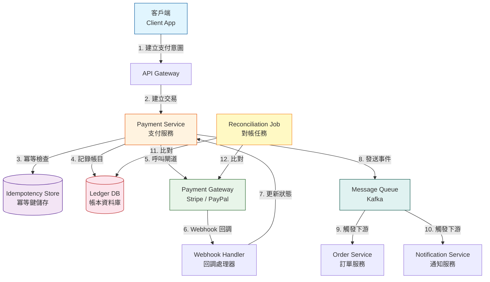
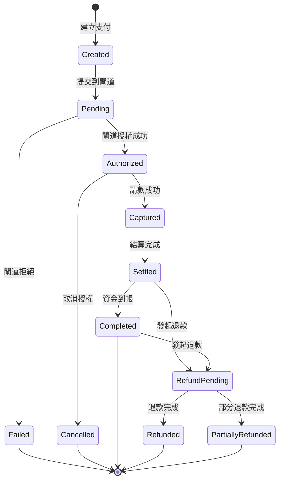
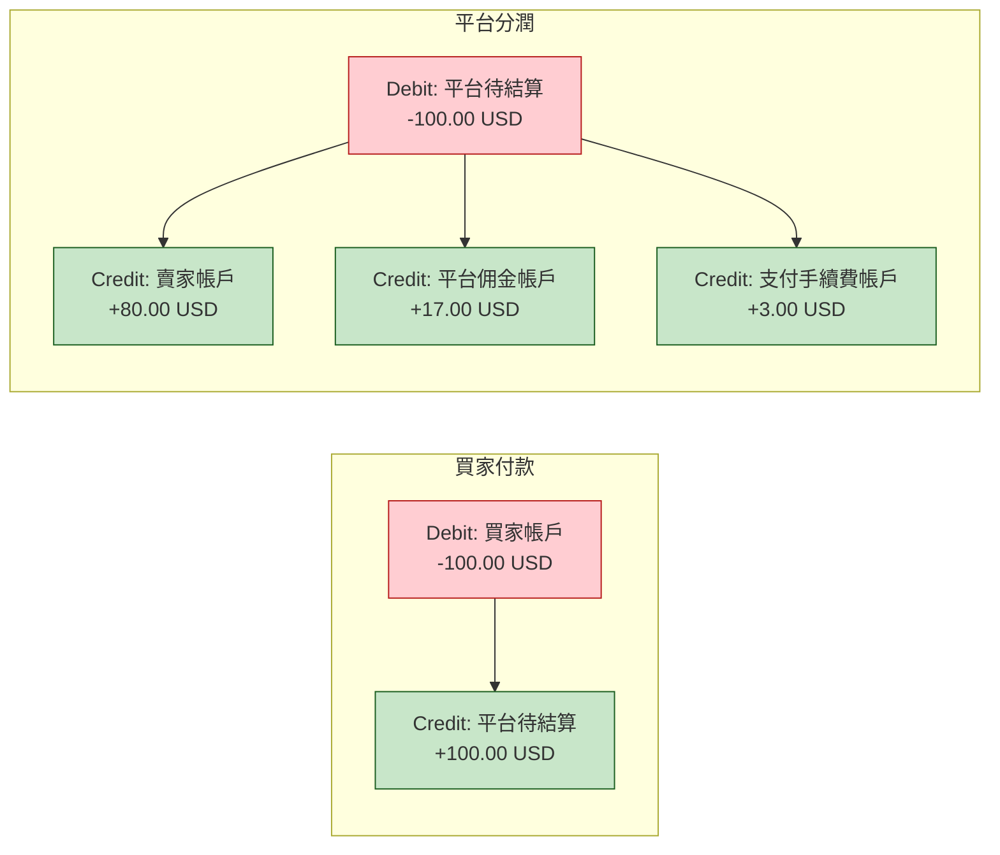

# Payment & Financial Transactions / 支付與金融交易模式

## Intent / 意圖

支付與金融交易系統是所有商業平台的命脈——每一筆交易都必須正確記錄、可追溯、可對帳，且在分散式環境中面對網路故障、重複請求、部分失敗時仍能保證資金安全。核心挑戰不是「怎麼呼叫支付閘道 API」，而是如何設計一套帳本（ledger）驅動的交易系統，讓每一分錢的流向都有跡可循，且在任何時間點都能通過對帳（reconciliation）驗證一致性。

核心問題：**當系統每秒處理數千筆支付交易，涉及多方資金流轉（買家 → 平台 → 賣家 → 退款），且必須與外部支付閘道（Stripe、PayPal）整合時，如何設計一套兼顧正確性（每筆帳目借貸平衡）、冪等性（重複請求不重複扣款）、可審計性（完整交易軌跡）與容錯性（部分失敗可恢復）的金融交易架構？**

---

## Problem / 問題情境

**場景一：電商平台重複扣款引發客訴風暴**

某電商平台的支付服務在處理訂單付款時，前端因網路超時重試了支付請求。後端沒有冪等性保護——第一次請求成功扣款後，第二次請求再次呼叫 Stripe Charge API，導致客戶被扣了兩次款。更糟糕的是，系統的帳本只記錄了一筆交易（第二次請求覆蓋了第一次的交易記錄），導致對帳時發現 Stripe 帳單金額是系統記錄的兩倍。客服團隊花了三天才手動核對出所有受影響的訂單，期間客訴量暴增 400%。

問題根因：
- **缺乏冪等鍵（idempotency key）**：沒有機制判斷重複請求，每次 API 呼叫都當作全新交易處理。
- **帳本記錄不完整**：交易記錄被覆蓋而非追加，失去了審計軌跡。
- **沒有對帳機制**：系統帳本與支付閘道帳單之間沒有自動化比對，差異要到月結時才被發現。

**場景二：多方分潤計算導致資金對不上帳**

某 marketplace 平台每筆交易需要將金額拆分為：賣家收入（80%）、平台佣金（15%）、支付手續費（2.9% + 0.30 USD）、稅金（依地區不同）。開發者使用浮點數（float64）計算分潤：

```
total = 29.99
seller_share = total * 0.80  // 23.992000000000001
platform_fee = total * 0.15  // 4.498500000000001
payment_fee = total * 0.029 + 0.30  // 1.16971
```

三個分潤加起來是 29.660210000000002，與原始金額 29.99 差了 0.32979 — 這筆錢「消失」了。乘以每天 10 萬筆交易，每月累計差異達數萬美元，審計報告無法通過。

問題根因：
- **使用浮點數處理貨幣**：IEEE 754 浮點數無法精確表示十進制小數，累計誤差不可避免。
- **分潤計算不基於複式簿記**：沒有確保「借方總額 = 貸方總額」的機制，資金可以憑空出現或消失。

**場景三：支付狀態不一致導致發貨但未收款**

訂單服務呼叫支付服務扣款，支付服務呼叫 Stripe 成功後返回 HTTP 200，但在更新本地資料庫前崩潰。訂單服務收到成功回應後觸發發貨流程。支付服務重啟後，本地資料庫中該筆支付仍為 "pending" 狀態。對帳時發現：Stripe 已扣款、商品已發貨、但系統記錄顯示「未付款」。需要人工介入對帳修正。

問題根因：
- **支付狀態機不完整**：缺少 "authorized" → "captured" → "settled" 的完整狀態流轉。
- **沒有補償機制**：系統崩潰後無法自動恢復到一致狀態。
- **先回應再寫庫的反模式**：應該先持久化狀態變更，再回應上游。

---

## Core Concepts / 核心概念

### Double-Entry Bookkeeping / 複式簿記

複式簿記是金融系統的基石原則：每一筆交易必須同時記錄借方（debit）和貸方（credit），且借方總額必須等於貸方總額。這不是會計術語的堆砌，而是一種資料完整性保障——如果任何一筆交易的借貸不平衡，代表系統出了問題。在程式碼中，一筆「買家付款 100 元」的交易會產生兩筆帳目：(1) 借記買家帳戶 100 元（資產減少）；(2) 貸記平台待結算帳戶 100 元（負債增加）。這種對稱性讓系統可以在任何時間點透過「所有帳戶的借方總額 == 貸方總額」來驗證資料一致性。

### Ledger / 帳本

帳本是所有交易記錄的不可變（immutable）日誌。與傳統的餘額表（balance table）不同，帳本採用 append-only 設計——交易一旦寫入就不能修改或刪除，修正錯誤的方式是寫入一筆新的「沖銷（reversal）」交易。帳本的每一筆條目（entry）包含：交易 ID、借方帳戶、貸方帳戶、金額、貨幣、時間戳、冪等鍵。帳戶的「當前餘額」是從帳本計算得出的衍生值（所有貸方 - 所有借方），而非獨立儲存的欄位。

### Payment State Machine / 支付狀態機

支付不是一個原子操作，而是一系列狀態轉換：`created` → `pending` → `authorized` → `captured` → `settled` → `completed`，以及異常路徑：`failed`、`cancelled`、`refund_pending` → `refunded`、`partially_refunded`、`disputed`。每個狀態轉換都有嚴格的前置條件——例如只有 `authorized` 狀態才能轉為 `captured`，只有 `settled` 或 `completed` 狀態才能轉為 `refund_pending`。狀態機防止非法轉換（如從 `refunded` 跳到 `captured`），且每次轉換都寫入帳本。

### Idempotency Key / 冪等鍵

冪等鍵是由客戶端生成的唯一識別符（通常是 UUID），附在每個支付 API 請求的 header 中。伺服器在處理請求前先檢查該冪等鍵是否已存在——如果存在，直接返回之前的處理結果，不執行任何新操作。這確保了即使客戶端因超時重試多次，同一筆支付只會被執行一次。冪等鍵通常設定 24-48 小時的 TTL，過期後自動清除。關鍵實作細節：冪等鍵的檢查和交易寫入必須在同一個資料庫事務中，否則在並發情況下仍可能重複執行。

### Reconciliation / 對帳

對帳是金融系統的「健康檢查」——定期比對系統帳本與外部來源（支付閘道報表、銀行對帳單）的資料，找出差異並修正。對帳分為三個層次：(1) **交易級對帳**：逐筆比對每筆交易的金額、狀態、時間；(2) **帳戶級對帳**：比對帳戶餘額；(3) **總帳對帳**：驗證所有帳戶的借方總額等於貸方總額。理想情況下對帳差異為零，任何非零差異都需要調查並出具調整分錄（adjustment entry）。

### Currency Precision / 貨幣精度

金融系統中絕對不能使用浮點數（float32/float64）表示貨幣。正確做法是使用最小貨幣單位的整數表示——例如 USD 用 cents（$12.34 存為 1234），JPY 用 yen（¥1000 存為 1000，因為日圓沒有「分」）。或者使用定點數（decimal）類型。Rust 中用 `rust_decimal::Decimal`，Go 中用 `shopspring/decimal`。所有中間計算都保持整數運算，只在最終展示給使用者時才轉換為帶小數點的格式。分潤計算中的尾差（rounding residual）必須有明確的分配規則（如「尾差歸平台」）。

### PCI DSS / 支付卡產業資料安全標準

PCI DSS（Payment Card Industry Data Security Standard）是處理信用卡資料的安全合規標準。核心要求：不要在自己的伺服器上儲存、處理或傳輸原始卡號（PAN）。現代做法是使用支付閘道的 tokenization——前端使用 Stripe Elements 或 PayPal SDK 直接將卡號發送到支付閘道，閘道返回一個 token（如 `tok_visa_4242`），後端只處理 token。這讓系統可以達到 PCI DSS SAQ-A（最低合規等級），避免昂貴的 SAQ-D 審計。

---

## Architecture / 架構

### 支付系統整體架構



### 支付狀態機



### 複式簿記帳目流轉



---

## How It Works / 運作原理

### 支付交易完整流程（以信用卡付款為例）

1. **客戶端建立支付意圖（Payment Intent）**：前端使用 Stripe Elements 收集卡號，Stripe 返回一個 `payment_method` token。前端將 token、訂單 ID、金額、冪等鍵（UUID）發送到後端 API。

2. **冪等鍵檢查**：支付服務收到請求後，先在冪等鍵儲存（Redis 或資料庫表）中查找該 key。如果已存在且狀態為「已完成」，直接返回之前的結果。如果已存在且狀態為「處理中」，返回 409 Conflict（表示前一次請求還在處理，請稍後再試）。如果不存在，寫入冪等鍵記錄，狀態設為「處理中」。

3. **建立交易記錄**：在本地資料庫中建立支付交易記錄，狀態為 `created`。同時在帳本中寫入初始帳目（此時只是預記錄，尚未扣款）。

4. **呼叫支付閘道**：呼叫 Stripe Payment Intent API，傳入 `payment_method` token 和金額。Stripe 會聯繫發卡銀行進行授權（authorization），確認卡片有效且餘額足夠。

5. **處理閘道回應**：如果授權成功，Stripe 返回 `requires_capture` 狀態。支付服務將本地交易狀態從 `created` 更新為 `authorized`。此時資金已被「凍結」在買家帳戶中，但尚未真正轉移。

6. **請款（Capture）**：在確認訂單準備發貨後（可能是幾分鐘到幾天後），系統呼叫 Stripe Capture API 進行請款。成功後交易狀態從 `authorized` 更新為 `captured`，帳本寫入正式的借貸記錄。

7. **Webhook 處理**：Stripe 在資金結算（settlement）完成後會發送 webhook 通知。Webhook handler 驗證簽名後更新交易狀態為 `settled`。Webhook 處理必須是冪等的——Stripe 可能因為超時重發同一個 webhook。

8. **對帳**：每日批次任務比對系統帳本與 Stripe 報表。逐筆匹配每筆交易的金額、狀態、時間戳。找出差異：系統有但 Stripe 沒有（可能是請款未送出）、Stripe 有但系統沒有（可能是 webhook 遺漏）、金額不一致（可能是貨幣轉換誤差）。差異記錄生成調查工單。

9. **分潤與結算**：在交易 `settled` 後，系統根據分潤規則將資金拆分到各帳戶。這是一筆獨立的帳本交易：借記平台待結算帳戶，貸記賣家帳戶、佣金帳戶、手續費帳戶。所有金額使用最小貨幣單位（cents），尾差分配到平台帳戶。

10. **退款處理**：退款是一筆反向交易——借記平台帳戶，貸記買家帳戶。退款不是「刪除原始交易」，而是新增一筆沖銷交易。這保留了完整的審計軌跡：原始付款和退款都可追溯。

---

## Rust 實作

以下實作一個基於複式簿記的帳本系統，使用 Axum 0.8 提供 API，支援建立帳戶、轉帳、查詢餘額，並確保每筆交易的借貸平衡。

```rust
// Cargo.toml dependencies:
// axum = "0.8"
// tokio = { version = "1", features = ["full"] }
// serde = { version = "1", features = ["derive"] }
// serde_json = "1"
// uuid = { version = "1", features = ["v4"] }
// chrono = { version = "0.4", features = ["serde"] }
// rust_decimal = { version = "1", features = ["serde"] }

use axum::{
    extract::{Path, State},
    http::StatusCode,
    response::Json,
    routing::{get, post},
    Router,
};
use chrono::{DateTime, Utc};
use rust_decimal::Decimal;
use serde::{Deserialize, Serialize};
use std::collections::HashMap;
use std::sync::Arc;
use tokio::sync::RwLock;
use uuid::Uuid;

// ─── Domain Types ───────────────────────────────────────────

/// 帳目方向：借方或貸方
#[derive(Debug, Clone, Copy, PartialEq, Eq, Serialize, Deserialize)]
#[serde(rename_all = "lowercase")]
enum EntryDirection {
    Debit,
    Credit,
}

/// 帳本中的單筆條目
#[derive(Debug, Clone, Serialize, Deserialize)]
struct LedgerEntry {
    entry_id: Uuid,
    transaction_id: Uuid,
    account_id: String,
    direction: EntryDirection,
    amount_cents: i64,        // 最小貨幣單位（cents）
    currency: String,
    description: String,
    created_at: DateTime<Utc>,
}

/// 一筆完整的交易（包含多個 entries，借貸必須平衡）
#[derive(Debug, Clone, Serialize, Deserialize)]
struct Transaction {
    transaction_id: Uuid,
    idempotency_key: String,
    entries: Vec<LedgerEntry>,
    created_at: DateTime<Utc>,
}

/// 帳戶資訊
#[derive(Debug, Clone, Serialize, Deserialize)]
struct Account {
    account_id: String,
    account_name: String,
    account_type: AccountType,
    currency: String,
    created_at: DateTime<Utc>,
}

#[derive(Debug, Clone, Copy, PartialEq, Eq, Serialize, Deserialize)]
#[serde(rename_all = "snake_case")]
enum AccountType {
    Asset,      // 資產帳戶（如買家錢包）
    Liability,  // 負債帳戶（如平台待結算）
    Revenue,    // 收入帳戶（如平台佣金）
    Expense,    // 支出帳戶（如支付手續費）
}

/// 支付狀態機
#[derive(Debug, Clone, Copy, PartialEq, Eq, Serialize, Deserialize)]
#[serde(rename_all = "snake_case")]
enum PaymentStatus {
    Created,
    Pending,
    Authorized,
    Captured,
    Settled,
    Completed,
    Failed,
    Cancelled,
    RefundPending,
    Refunded,
}

impl PaymentStatus {
    /// 驗證狀態轉換是否合法
    fn can_transition_to(&self, next: PaymentStatus) -> bool {
        matches!(
            (self, next),
            (PaymentStatus::Created, PaymentStatus::Pending)
                | (PaymentStatus::Pending, PaymentStatus::Authorized)
                | (PaymentStatus::Pending, PaymentStatus::Failed)
                | (PaymentStatus::Authorized, PaymentStatus::Captured)
                | (PaymentStatus::Authorized, PaymentStatus::Cancelled)
                | (PaymentStatus::Captured, PaymentStatus::Settled)
                | (PaymentStatus::Settled, PaymentStatus::Completed)
                | (PaymentStatus::Settled, PaymentStatus::RefundPending)
                | (PaymentStatus::Completed, PaymentStatus::RefundPending)
                | (PaymentStatus::RefundPending, PaymentStatus::Refunded)
        )
    }
}

/// 支付記錄
#[derive(Debug, Clone, Serialize, Deserialize)]
struct Payment {
    payment_id: Uuid,
    order_id: String,
    amount_cents: i64,
    currency: String,
    status: PaymentStatus,
    idempotency_key: String,
    status_history: Vec<(PaymentStatus, DateTime<Utc>)>,
    created_at: DateTime<Utc>,
    updated_at: DateTime<Utc>,
}

// ─── Application State ──────────────────────────────────────

#[derive(Debug, Default)]
struct AppState {
    accounts: RwLock<HashMap<String, Account>>,
    ledger_entries: RwLock<Vec<LedgerEntry>>,
    transactions: RwLock<Vec<Transaction>>,
    payments: RwLock<HashMap<Uuid, Payment>>,
    idempotency_store: RwLock<HashMap<String, serde_json::Value>>,
}

type SharedState = Arc<AppState>;

// ─── Request / Response DTOs ────────────────────────────────

#[derive(Deserialize)]
struct CreateAccountRequest {
    account_id: String,
    account_name: String,
    account_type: AccountType,
    currency: String,
}

#[derive(Deserialize)]
struct TransferRequest {
    idempotency_key: String,
    from_account: String,
    to_account: String,
    amount_cents: i64,
    currency: String,
    description: String,
}

#[derive(Serialize)]
struct BalanceResponse {
    account_id: String,
    balance_cents: i64,
    currency: String,
}

#[derive(Serialize)]
struct TransactionResponse {
    transaction_id: Uuid,
    entries: Vec<LedgerEntry>,
    message: String,
}

#[derive(Serialize)]
struct ErrorResponse {
    error: String,
}

// ─── Handlers ───────────────────────────────────────────────

/// 建立帳戶
async fn create_account(
    State(state): State<SharedState>,
    Json(req): Json<CreateAccountRequest>,
) -> Result<Json<Account>, (StatusCode, Json<ErrorResponse>)> {
    let mut accounts = state.accounts.write().await;

    if accounts.contains_key(&req.account_id) {
        return Err((
            StatusCode::CONFLICT,
            Json(ErrorResponse {
                error: format!("帳戶 {} 已存在", req.account_id),
            }),
        ));
    }

    let account = Account {
        account_id: req.account_id.clone(),
        account_name: req.account_name,
        account_type: req.account_type,
        currency: req.currency,
        created_at: Utc::now(),
    };

    accounts.insert(req.account_id, account.clone());
    Ok(Json(account))
}

/// 執行轉帳（複式簿記）
async fn transfer(
    State(state): State<SharedState>,
    Json(req): Json<TransferRequest>,
) -> Result<Json<TransactionResponse>, (StatusCode, Json<ErrorResponse>)> {
    // 步驟 1：冪等性檢查
    {
        let idempotency_store = state.idempotency_store.read().await;
        if let Some(cached_result) = idempotency_store.get(&req.idempotency_key) {
            let response: TransactionResponse =
                serde_json::from_value(cached_result.clone()).unwrap();
            return Ok(Json(response));
        }
    }

    // 步驟 2：驗證帳戶存在
    {
        let accounts = state.accounts.read().await;
        if !accounts.contains_key(&req.from_account) {
            return Err((
                StatusCode::BAD_REQUEST,
                Json(ErrorResponse {
                    error: format!("來源帳戶 {} 不存在", req.from_account),
                }),
            ));
        }
        if !accounts.contains_key(&req.to_account) {
            return Err((
                StatusCode::BAD_REQUEST,
                Json(ErrorResponse {
                    error: format!("目標帳戶 {} 不存在", req.to_account),
                }),
            ));
        }
    }

    // 步驟 3：驗證金額
    if req.amount_cents <= 0 {
        return Err((
            StatusCode::BAD_REQUEST,
            Json(ErrorResponse {
                error: "轉帳金額必須為正數".to_string(),
            }),
        ));
    }

    // 步驟 4：建立複式簿記帳目
    let transaction_id = Uuid::new_v4();
    let now = Utc::now();

    let debit_entry = LedgerEntry {
        entry_id: Uuid::new_v4(),
        transaction_id,
        account_id: req.from_account.clone(),
        direction: EntryDirection::Debit,
        amount_cents: req.amount_cents,
        currency: req.currency.clone(),
        description: req.description.clone(),
        created_at: now,
    };

    let credit_entry = LedgerEntry {
        entry_id: Uuid::new_v4(),
        transaction_id,
        account_id: req.to_account.clone(),
        direction: EntryDirection::Credit,
        amount_cents: req.amount_cents,
        currency: req.currency.clone(),
        description: req.description.clone(),
        created_at: now,
    };

    // 步驟 5：驗證借貸平衡
    let total_debit: i64 = debit_entry.amount_cents;
    let total_credit: i64 = credit_entry.amount_cents;
    assert_eq!(
        total_debit, total_credit,
        "借方總額必須等於貸方總額（Double-Entry 不變量）"
    );

    let entries = vec![debit_entry, credit_entry];

    let transaction = Transaction {
        transaction_id,
        idempotency_key: req.idempotency_key.clone(),
        entries: entries.clone(),
        created_at: now,
    };

    // 步驟 6：原子寫入帳本
    {
        let mut ledger = state.ledger_entries.write().await;
        let mut transactions = state.transactions.write().await;

        for entry in &entries {
            ledger.push(entry.clone());
        }
        transactions.push(transaction);
    }

    // 步驟 7：快取冪等結果
    let response = TransactionResponse {
        transaction_id,
        entries,
        message: format!(
            "轉帳 {} cents 從 {} 到 {} 成功",
            req.amount_cents, req.from_account, req.to_account
        ),
    };

    {
        let mut idempotency_store = state.idempotency_store.write().await;
        idempotency_store.insert(
            req.idempotency_key,
            serde_json::to_value(&response).unwrap(),
        );
    }

    Ok(Json(response))
}

/// 查詢帳戶餘額（從帳本計算）
async fn get_balance(
    State(state): State<SharedState>,
    Path(account_id): Path<String>,
) -> Result<Json<BalanceResponse>, (StatusCode, Json<ErrorResponse>)> {
    let accounts = state.accounts.read().await;
    let account = accounts.get(&account_id).ok_or_else(|| {
        (
            StatusCode::NOT_FOUND,
            Json(ErrorResponse {
                error: format!("帳戶 {} 不存在", account_id),
            }),
        )
    })?;

    let ledger = state.ledger_entries.read().await;

    // 餘額 = 所有 credit 之和 - 所有 debit 之和
    let balance_cents: i64 = ledger
        .iter()
        .filter(|entry| entry.account_id == account_id)
        .map(|entry| match entry.direction {
            EntryDirection::Credit => entry.amount_cents,
            EntryDirection::Debit => -entry.amount_cents,
        })
        .sum();

    Ok(Json(BalanceResponse {
        account_id,
        balance_cents,
        currency: account.currency.clone(),
    }))
}

/// 對帳檢查：驗證所有交易的借貸平衡
async fn reconciliation_check(
    State(state): State<SharedState>,
) -> Json<serde_json::Value> {
    let transactions = state.transactions.read().await;
    let mut discrepancies: Vec<String> = Vec::new();
    let mut total_debit: i64 = 0;
    let mut total_credit: i64 = 0;

    for txn in transactions.iter() {
        let txn_debit: i64 = txn
            .entries
            .iter()
            .filter(|e| e.direction == EntryDirection::Debit)
            .map(|e| e.amount_cents)
            .sum();

        let txn_credit: i64 = txn
            .entries
            .iter()
            .filter(|e| e.direction == EntryDirection::Credit)
            .map(|e| e.amount_cents)
            .sum();

        if txn_debit != txn_credit {
            discrepancies.push(format!(
                "交易 {} 借貸不平衡: debit={}, credit={}",
                txn.transaction_id, txn_debit, txn_credit
            ));
        }

        total_debit += txn_debit;
        total_credit += txn_credit;
    }

    Json(serde_json::json!({
        "total_transactions": transactions.len(),
        "total_debit_cents": total_debit,
        "total_credit_cents": total_credit,
        "is_balanced": total_debit == total_credit,
        "discrepancies": discrepancies,
    }))
}

#[tokio::main]
async fn main() {
    let state: SharedState = Arc::new(AppState::default());

    let app = Router::new()
        .route("/accounts", post(create_account))
        .route("/accounts/{account_id}/balance", get(get_balance))
        .route("/transfer", post(transfer))
        .route("/reconciliation", get(reconciliation_check))
        .with_state(state);

    let listener = tokio::net::TcpListener::bind("0.0.0.0:3000")
        .await
        .unwrap();
    println!("帳本服務啟動於 http://localhost:3000");
    axum::serve(listener, app).await.unwrap();
}

// Output:
// 帳本服務啟動於 http://localhost:3000
//
// 使用範例（curl）：
//
// 1. 建立帳戶：
// curl -X POST http://localhost:3000/accounts \
//   -H "Content-Type: application/json" \
//   -d '{"account_id":"buyer_001","account_name":"買家帳戶","account_type":"asset","currency":"USD"}'
//
// 2. 轉帳（複式簿記）：
// curl -X POST http://localhost:3000/transfer \
//   -H "Content-Type: application/json" \
//   -d '{"idempotency_key":"pay_abc123","from_account":"buyer_001","to_account":"platform_escrow","amount_cents":10000,"currency":"USD","description":"訂單 #1001 付款"}'
//
// 3. 查詢餘額：
// curl http://localhost:3000/accounts/buyer_001/balance
// => {"account_id":"buyer_001","balance_cents":-10000,"currency":"USD"}
//
// 4. 重複請求（冪等性）：
// curl -X POST http://localhost:3000/transfer \
//   -H "Content-Type: application/json" \
//   -d '{"idempotency_key":"pay_abc123","from_account":"buyer_001","to_account":"platform_escrow","amount_cents":10000,"currency":"USD","description":"訂單 #1001 付款"}'
// => 返回與第一次相同的結果，不會重複扣款
//
// 5. 對帳檢查：
// curl http://localhost:3000/reconciliation
// => {"total_transactions":1,"total_debit_cents":10000,"total_credit_cents":10000,"is_balanced":true,"discrepancies":[]}
```

---

## Go 實作

以下實作一個支付狀態機系統，支援冪等性 API、狀態轉換驗證、以及完整的支付生命週期管理。使用 Go 1.24+ 標準庫。

```go
package main

import (
	"crypto/rand"
	"encoding/json"
	"fmt"
	"log"
	"net/http"
	"sync"
	"time"
)

// ─── Domain Types ───────────────────────────────────────────

// PaymentStatus 支付狀態
type PaymentStatus string

const (
	StatusCreated       PaymentStatus = "created"
	StatusPending       PaymentStatus = "pending"
	StatusAuthorized    PaymentStatus = "authorized"
	StatusCaptured      PaymentStatus = "captured"
	StatusSettled       PaymentStatus = "settled"
	StatusCompleted     PaymentStatus = "completed"
	StatusFailed        PaymentStatus = "failed"
	StatusCancelled     PaymentStatus = "cancelled"
	StatusRefundPending PaymentStatus = "refund_pending"
	StatusRefunded      PaymentStatus = "refunded"
)

// validTransitions 合法的狀態轉換表
var validTransitions = map[PaymentStatus][]PaymentStatus{
	StatusCreated:       {StatusPending},
	StatusPending:       {StatusAuthorized, StatusFailed},
	StatusAuthorized:    {StatusCaptured, StatusCancelled},
	StatusCaptured:      {StatusSettled},
	StatusSettled:       {StatusCompleted, StatusRefundPending},
	StatusCompleted:     {StatusRefundPending},
	StatusRefundPending: {StatusRefunded},
}

// canTransitionTo 驗證狀態轉換是否合法
func (s PaymentStatus) canTransitionTo(next PaymentStatus) bool {
	allowed, ok := validTransitions[s]
	if !ok {
		return false
	}
	for _, a := range allowed {
		if a == next {
			return true
		}
	}
	return false
}

// StatusTransition 狀態轉換記錄
type StatusTransition struct {
	From      PaymentStatus `json:"from"`
	To        PaymentStatus `json:"to"`
	Timestamp time.Time     `json:"timestamp"`
	Reason    string        `json:"reason"`
}

// Payment 支付記錄
type Payment struct {
	PaymentID      string             `json:"payment_id"`
	OrderID        string             `json:"order_id"`
	AmountCents    int64              `json:"amount_cents"`
	Currency       string             `json:"currency"`
	Status         PaymentStatus      `json:"status"`
	IdempotencyKey string             `json:"idempotency_key"`
	GatewayRef     string             `json:"gateway_ref,omitempty"`
	History        []StatusTransition `json:"history"`
	CreatedAt      time.Time          `json:"created_at"`
	UpdatedAt      time.Time          `json:"updated_at"`
}

// TransitionTo 嘗試將支付狀態轉換到新狀態
func (p *Payment) TransitionTo(next PaymentStatus, reason string) error {
	if !p.Status.canTransitionTo(next) {
		return fmt.Errorf(
			"非法狀態轉換: %s -> %s（支付 %s）",
			p.Status, next, p.PaymentID,
		)
	}

	now := time.Now().UTC()
	p.History = append(p.History, StatusTransition{
		From:      p.Status,
		To:        next,
		Timestamp: now,
		Reason:    reason,
	})
	p.Status = next
	p.UpdatedAt = now
	return nil
}

// ─── In-Memory Store ────────────────────────────────────────

// PaymentStore 支付儲存（生產環境應替換為資料庫）
type PaymentStore struct {
	mu               sync.RWMutex
	payments         map[string]*Payment          // paymentID -> Payment
	idempotencyIndex map[string]string             // idempotencyKey -> paymentID
	idempotencyCache map[string]json.RawMessage    // idempotencyKey -> cached response
}

func NewPaymentStore() *PaymentStore {
	return &PaymentStore{
		payments:         make(map[string]*Payment),
		idempotencyIndex: make(map[string]string),
		idempotencyCache: make(map[string]json.RawMessage),
	}
}

// ─── UUID Generation ────────────────────────────────────────

func generateUUID() string {
	b := make([]byte, 16)
	_, _ = rand.Read(b)
	b[6] = (b[6] & 0x0f) | 0x40 // Version 4
	b[8] = (b[8] & 0x3f) | 0x80 // Variant
	return fmt.Sprintf("%08x-%04x-%04x-%04x-%12x",
		b[0:4], b[4:6], b[6:8], b[8:10], b[10:16])
}

// ─── API Handlers ───────────────────────────────────────────

// CreatePaymentRequest 建立支付的請求
type CreatePaymentRequest struct {
	OrderID        string `json:"order_id"`
	AmountCents    int64  `json:"amount_cents"`
	Currency       string `json:"currency"`
	IdempotencyKey string `json:"idempotency_key"`
}

// APIResponse 統一的 API 回應格式
type APIResponse struct {
	Success bool        `json:"success"`
	Data    interface{} `json:"data,omitempty"`
	Error   string      `json:"error,omitempty"`
}

func writeJSON(w http.ResponseWriter, status int, v interface{}) {
	w.Header().Set("Content-Type", "application/json")
	w.WriteHeader(status)
	json.NewEncoder(w).Encode(v)
}

// PaymentServer 支付 API 伺服器
type PaymentServer struct {
	store *PaymentStore
}

func NewPaymentServer() *PaymentServer {
	return &PaymentServer{store: NewPaymentStore()}
}

// handleCreatePayment 建立支付（含冪等性保護）
func (s *PaymentServer) handleCreatePayment(w http.ResponseWriter, r *http.Request) {
	if r.Method != http.MethodPost {
		writeJSON(w, http.StatusMethodNotAllowed, APIResponse{
			Error: "僅允許 POST 方法",
		})
		return
	}

	var req CreatePaymentRequest
	if err := json.NewDecoder(r.Body).Decode(&req); err != nil {
		writeJSON(w, http.StatusBadRequest, APIResponse{
			Error: fmt.Sprintf("請求格式錯誤: %v", err),
		})
		return
	}

	// 驗證必填欄位
	if req.IdempotencyKey == "" {
		writeJSON(w, http.StatusBadRequest, APIResponse{
			Error: "idempotency_key 為必填欄位",
		})
		return
	}
	if req.AmountCents <= 0 {
		writeJSON(w, http.StatusBadRequest, APIResponse{
			Error: "金額必須為正整數（以 cents 為單位）",
		})
		return
	}

	s.store.mu.Lock()
	defer s.store.mu.Unlock()

	// 冪等性檢查：如果已處理過，返回快取的結果
	if cached, exists := s.store.idempotencyCache[req.IdempotencyKey]; exists {
		w.Header().Set("Content-Type", "application/json")
		w.Header().Set("X-Idempotent-Replayed", "true")
		w.WriteHeader(http.StatusOK)
		w.Write(cached)
		return
	}

	// 建立新支付
	paymentID := generateUUID()
	now := time.Now().UTC()

	payment := &Payment{
		PaymentID:      paymentID,
		OrderID:        req.OrderID,
		AmountCents:    req.AmountCents,
		Currency:       req.Currency,
		Status:         StatusCreated,
		IdempotencyKey: req.IdempotencyKey,
		History: []StatusTransition{
			{
				From:      "",
				To:        StatusCreated,
				Timestamp: now,
				Reason:    "支付建立",
			},
		},
		CreatedAt: now,
		UpdatedAt: now,
	}

	// 儲存支付記錄
	s.store.payments[paymentID] = payment
	s.store.idempotencyIndex[req.IdempotencyKey] = paymentID

	// 快取回應供冪等重播使用
	resp := APIResponse{Success: true, Data: payment}
	respBytes, _ := json.Marshal(resp)
	s.store.idempotencyCache[req.IdempotencyKey] = respBytes

	writeJSON(w, http.StatusCreated, resp)
}

// TransitionRequest 狀態轉換請求
type TransitionRequest struct {
	NextStatus PaymentStatus `json:"next_status"`
	Reason     string        `json:"reason"`
	GatewayRef string        `json:"gateway_ref,omitempty"`
}

// handleTransition 處理支付狀態轉換
func (s *PaymentServer) handleTransition(w http.ResponseWriter, r *http.Request) {
	if r.Method != http.MethodPost {
		writeJSON(w, http.StatusMethodNotAllowed, APIResponse{
			Error: "僅允許 POST 方法",
		})
		return
	}

	paymentID := r.PathValue("id")

	var req TransitionRequest
	if err := json.NewDecoder(r.Body).Decode(&req); err != nil {
		writeJSON(w, http.StatusBadRequest, APIResponse{
			Error: fmt.Sprintf("請求格式錯誤: %v", err),
		})
		return
	}

	s.store.mu.Lock()
	defer s.store.mu.Unlock()

	payment, exists := s.store.payments[paymentID]
	if !exists {
		writeJSON(w, http.StatusNotFound, APIResponse{
			Error: fmt.Sprintf("支付 %s 不存在", paymentID),
		})
		return
	}

	// 執行狀態轉換（含合法性驗證）
	if err := payment.TransitionTo(req.NextStatus, req.Reason); err != nil {
		writeJSON(w, http.StatusConflict, APIResponse{
			Error: err.Error(),
		})
		return
	}

	if req.GatewayRef != "" {
		payment.GatewayRef = req.GatewayRef
	}

	writeJSON(w, http.StatusOK, APIResponse{
		Success: true,
		Data:    payment,
	})
}

// handleGetPayment 查詢支付詳情（含完整狀態歷史）
func (s *PaymentServer) handleGetPayment(w http.ResponseWriter, r *http.Request) {
	if r.Method != http.MethodGet {
		writeJSON(w, http.StatusMethodNotAllowed, APIResponse{
			Error: "僅允許 GET 方法",
		})
		return
	}

	paymentID := r.PathValue("id")

	s.store.mu.RLock()
	defer s.store.mu.RUnlock()

	payment, exists := s.store.payments[paymentID]
	if !exists {
		writeJSON(w, http.StatusNotFound, APIResponse{
			Error: fmt.Sprintf("支付 %s 不存在", paymentID),
		})
		return
	}

	writeJSON(w, http.StatusOK, APIResponse{
		Success: true,
		Data:    payment,
	})
}

// handleListPayments 列出所有支付
func (s *PaymentServer) handleListPayments(w http.ResponseWriter, r *http.Request) {
	if r.Method != http.MethodGet {
		writeJSON(w, http.StatusMethodNotAllowed, APIResponse{
			Error: "僅允許 GET 方法",
		})
		return
	}

	s.store.mu.RLock()
	defer s.store.mu.RUnlock()

	payments := make([]*Payment, 0, len(s.store.payments))
	for _, p := range s.store.payments {
		payments = append(payments, p)
	}

	writeJSON(w, http.StatusOK, APIResponse{
		Success: true,
		Data:    payments,
	})
}

func main() {
	server := NewPaymentServer()

	mux := http.NewServeMux()
	mux.HandleFunc("POST /payments", server.handleCreatePayment)
	mux.HandleFunc("POST /payments/{id}/transition", server.handleTransition)
	mux.HandleFunc("GET /payments/{id}", server.handleGetPayment)
	mux.HandleFunc("GET /payments", server.handleListPayments)

	addr := ":8080"
	fmt.Printf("支付服務啟動於 http://localhost%s\n", addr)
	log.Fatal(http.ListenAndServe(addr, mux))
}

// Output:
// 支付服務啟動於 http://localhost:8080
//
// 使用範例：
//
// 1. 建立支付：
// curl -X POST http://localhost:8080/payments \
//   -H "Content-Type: application/json" \
//   -d '{"order_id":"ORD-1001","amount_cents":9999,"currency":"USD","idempotency_key":"idem_abc123"}'
// => {"success":true,"data":{"payment_id":"...","status":"created",...}}
//
// 2. 模擬閘道授權：
// curl -X POST http://localhost:8080/payments/{id}/transition \
//   -d '{"next_status":"pending","reason":"提交到支付閘道"}'
// curl -X POST http://localhost:8080/payments/{id}/transition \
//   -d '{"next_status":"authorized","reason":"Stripe 授權成功","gateway_ref":"ch_xxx"}'
//
// 3. 請款：
// curl -X POST http://localhost:8080/payments/{id}/transition \
//   -d '{"next_status":"captured","reason":"訂單已發貨，執行請款"}'
//
// 4. 嘗試非法轉換（會被拒絕）：
// curl -X POST http://localhost:8080/payments/{id}/transition \
//   -d '{"next_status":"refunded","reason":"嘗試直接退款"}'
// => {"success":false,"error":"非法狀態轉換: captured -> refunded（支付 ...）"}
//
// 5. 冪等性驗證（重複建立同一筆支付）：
// curl -X POST http://localhost:8080/payments \
//   -d '{"order_id":"ORD-1001","amount_cents":9999,"currency":"USD","idempotency_key":"idem_abc123"}'
// => 返回與第一次完全相同的結果，Header 包含 X-Idempotent-Replayed: true
```

---

## Rust vs Go 對照表

| 比較維度 | Rust 實作 | Go 實作 |
|---------|----------|--------|
| **核心抽象** | 複式簿記帳本（Ledger），以 `LedgerEntry` 為核心，餘額是帳目的衍生值 | 支付狀態機（State Machine），以 `PaymentStatus` 轉換為核心，狀態歷史追蹤完整生命週期 |
| **貨幣精度** | 使用 `rust_decimal::Decimal` 提供精確十進制運算，`i64` 表示最小貨幣單位 | 使用 `int64` 表示 cents（最小貨幣單位），避免 float64 |
| **冪等性實作** | `HashMap<String, serde_json::Value>` 快取完整回應，讀寫鎖保護 | `map[string]json.RawMessage` 快取序列化後的回應 bytes，mutex 保護 |
| **狀態驗證** | `PaymentStatus::can_transition_to()` 使用 `matches!` 巨集，編譯期窮舉檢查 | `validTransitions` map 查表，運行期驗證 |
| **並發模型** | `tokio::sync::RwLock` + `Arc`，非同步讀寫鎖 | `sync.RWMutex`，標準庫讀寫鎖 |
| **型別安全** | Enum variant 確保只有合法的狀態值，`serde` 提供序列化/反序列化保障 | String type alias，編譯期無法阻止非法狀態字串 |
| **路由風格** | Axum 0.8 的 `Router::new().route()` 鏈式呼叫，handler 透過 extractor 注入依賴 | Go 1.22+ `http.NewServeMux` 內建 pattern matching，`r.PathValue()` 取得路徑參數 |
| **錯誤處理** | `Result<Json<T>, (StatusCode, Json<ErrorResponse>)>` 型別驅動的錯誤回傳 | 手動檢查 + `writeJSON` helper，無編譯期強制 |

---

## When to Use / 適用場景

### 電子商務與 Marketplace 平台

任何涉及買賣雙方資金流轉的平台都需要完整的支付交易系統。例如 Shopify 的多方分潤（賣家、平台、物流商）、Uber 的即時結算（乘客 → 平台 → 司機）。複式簿記確保每一分錢的去向可追溯，狀態機防止重複扣款或遺漏退款。

### SaaS 訂閱與計費系統

基於使用量的計費（metered billing）需要精確的帳本記錄——每個 API 呼叫、每 GB 儲存、每分鐘運算都是一筆微交易。Stripe Billing、Zuora 等系統的核心就是帳本。冪等性在計費場景尤其重要：計量事件可能因為客戶端重試或消息佇列重投而重複，帳本必須只記錄一次。

### 金融科技與數位錢包

數位錢包（如 Line Pay、街口支付）的核心是一套完整的帳本系統——充值、消費、轉帳、提現的每一步都是複式簿記的借貸記錄。監管要求所有交易都必須可審計、可追溯，帳本的 append-only 設計天然滿足這個需求。

---

## When NOT to Use / 不適用場景

### 簡單的一次性收款頁面

如果只是一個捐款頁面或活動報名費收款，沒有分潤、退款、對帳的需求，直接使用 Stripe Checkout 或 PayPal Button 即可。不需要自建帳本系統——過度工程化會增加維護成本和出錯風險。Stripe 的 hosted checkout page 已經處理了 PCI 合規、卡號安全、重複支付防護。

### 內部系統的「積分」或「虛擬貨幣」

如果是遊戲金幣、論壇積分這類不涉及真實資金的虛擬經濟系統，使用簡單的餘額表（balance column）加上樂觀鎖就足夠了。複式簿記的嚴謹性在這裡是過度設計——虛擬貨幣的「遺失」或「多出」不會觸發法律責任或監管審查。

### 高頻交易（HFT）系統

高頻交易要求微秒級延遲，複式簿記的每筆交易多次 I/O（寫入多筆帳目、冪等鍵檢查）無法滿足。HFT 系統通常使用更特化的架構——記憶體內撮合引擎、事後批次對帳，交易期間只做最小的狀態更新。

---

## Real-World Examples / 真實世界案例

### Stripe 的複式帳本系統

Stripe 的核心是一個大規模的複式簿記帳本——每一筆 Charge、Refund、Transfer、Payout 都對應帳本中的借貸記錄。Stripe 在 2019 年的工程部落格中描述了他們的 "double-entry accounting system"：每個 Stripe 帳戶（商家帳戶、平台帳戶、Stripe 自身帳戶）都有對應的 ledger，所有資金流轉通過 journal entries 記錄。他們使用 "idempotency keys" 確保 API 的冪等性——客戶端在 header 中傳入 `Idempotency-Key`，Stripe 保證同一個 key 只會被執行一次，後續重試返回相同結果。Stripe 還實作了「two-phase capture」：先 authorize（凍結資金）再 capture（實際扣款），讓商家可以在發貨後才真正收款。

### Airbnb 的支付與分潤系統

Airbnb 需要處理複雜的三方分潤：房客付款 → 平台暫存（escrow）→ 入住確認後撥款給房東（扣除服務費）。他們的支付系統基於 "payment orchestration" 模式：一個中央支付編排器（orchestrator）管理每筆交易的完整生命週期，透過 Saga pattern 處理跨服務的分散式交易。當房客取消預訂時，系統根據取消政策（全額退款、部分退款、不退款）自動執行反向交易，所有操作都在帳本中留下完整記錄。

### Square（Block）的帳本即服務

Square 將其內部帳本系統抽象為獨立的基礎設施服務（Ledger-as-a-Service），所有業務系統（POS、Cash App、Square Loans）共用同一套帳本 API。他們在 2022 年的技術分享中提到：帳本每天處理數十億筆帳目，使用 append-only 的 event log 架構，帳戶餘額透過 materialized view 實時更新。對帳系統每小時自動運行，將帳本資料與銀行報表、信用卡網路清算檔進行三方比對。

---

## Interview Questions / 面試常見問題

### Q1: 為什麼金融系統中不能使用浮點數（float）表示貨幣？

浮點數（IEEE 754）使用二進制表示十進制數，許多看似簡單的十進制數在二進制中是無限循環的。例如 `0.1` 在 float64 中實際儲存為 `0.1000000000000000055511151231257827021181583404541015625`。當進行加法、乘法運算時，微小的精度誤差會累積：

```
0.1 + 0.2 = 0.30000000000000004  (不是 0.3)
```

在金融系統中，每天數百萬筆交易的累積誤差可能達到數千甚至數萬元。更嚴重的是，不同的運算順序可能產生不同的結果（浮點加法不滿足結合律），導致對帳時系統計算的餘額與銀行報表不一致。

正確做法：
- **整數表示最小貨幣單位**：USD 用 cents（`$12.34` → `1234`），BTC 用 satoshi。
- **定點數（Decimal）**：Rust 的 `rust_decimal::Decimal`，Go 的 `shopspring/decimal`，Java 的 `BigDecimal`。
- **分潤尾差處理**：明確規定尾差歸誰（通常歸平台），而非依賴浮點四捨五入。

### Q2: 解釋支付系統中冪等性（idempotency）的實作方式及其重要性。

冪等性確保「同一個操作執行一次和執行多次的效果相同」。在支付場景中，這至關重要——網路超時、客戶端重試、負載均衡器切換都可能導致同一筆支付請求被發送多次。如果沒有冪等性保護，客戶可能被重複扣款。

實作方式：
1. **客戶端生成冪等鍵**：每個支付請求攜帶一個唯一的 `Idempotency-Key`（通常是 UUID v4），放在 HTTP header 中。
2. **伺服器端檢查**：收到請求後，先在冪等鍵儲存（Redis / DB table）中查找該 key。
3. **三種情況**：
   - Key 不存在 → 正常處理請求，完成後將 key 和回應結果一起儲存。
   - Key 存在且已完成 → 直接返回快取的回應，不執行任何操作。
   - Key 存在但處理中 → 返回 409 Conflict，表示前一次請求仍在處理。
4. **原子性保證**：冪等鍵的檢查和交易寫入必須在同一個資料庫事務中。如果分開處理，並發請求可能在檢查和寫入之間的空檔同時通過。
5. **TTL 設定**：冪等鍵通常設定 24-48 小時的過期時間，避免儲存無限增長。

### Q3: 什麼是複式簿記（Double-Entry Bookkeeping）？在軟體系統中如何應用？

複式簿記是一種會計原則：每筆交易必須同時在至少兩個帳戶中記錄——一個借方（debit）和一個貸方（credit），且借方總額必須等於貸方總額。這個看似簡單的規則是金融資料完整性的基石。

在軟體系統中的應用：
- **資料模型**：不使用 `UPDATE balance SET amount = amount - 100` 這種直接修改餘額的方式，而是寫入帳目記錄（journal entry）。帳戶餘額是從帳目計算出的衍生值。
- **不變量（Invariant）**：任何時間點，`SUM(所有借方) == SUM(所有貸方)` 必須成立。如果不成立，代表系統有 bug。
- **Append-only**：帳目寫入後不可修改或刪除。修正錯誤的方式是寫入一筆「沖銷（reversal）」交易。
- **審計軌跡**：每筆資金流轉都有完整的記錄——誰在什麼時候從哪個帳戶轉了多少錢到哪個帳戶。

例如「買家用信用卡付款 100 元給賣家」：
- Debit: 買家帳戶 100 元（買家的資產減少）
- Credit: 平台 escrow 帳戶 100 元（平台的負債增加）
- （結算時）Debit: 平台 escrow 帳戶 100 元
- （結算時）Credit: 賣家帳戶 80 元 + 平台佣金帳戶 20 元

### Q4: 支付系統如何處理部分失敗（partial failure）？

支付流程涉及多個步驟（扣款、更新訂單狀態、發送通知、觸發發貨），任何一步都可能失敗。處理策略取決於失敗發生的階段：

1. **扣款前失敗**（如參數驗證失敗）：直接返回錯誤，無需補償。
2. **扣款成功但後續步驟失敗**：
   - **Saga pattern**：每個步驟有對應的補償操作。如果步驟 3 失敗，按逆序執行步驟 2 的補償 → 步驟 1 的補償（退款）。
   - **冪等重試**：將每個步驟設計為冪等的，失敗時重試直到成功。搭配 exponential backoff 和最大重試次數。
3. **閘道超時**（最棘手的場景）：不知道扣款是否成功。策略是「先記錄再查詢」——在本地記錄「已發送扣款請求」的狀態，然後啟動非同步任務查詢閘道的實際結果。切記不要在不確定扣款結果的情況下直接重試扣款——可能導致重複扣款。
4. **對帳兜底**：所有自動補償機制都可能有遺漏，定期對帳是最後的安全網。對帳發現的差異生成工單，由人工確認後處理。

### Q5: 解釋 Payment Gateway 整合中的 authorize 和 capture 分離模式。

Authorize（授權）和 Capture（請款）是信用卡支付的兩個獨立步驟，分離這兩步讓商家有更大的靈活性：

- **Authorize**：向發卡銀行確認卡片有效且餘額充足，凍結指定金額。此時資金尚未轉移，只是「預留」。授權通常有有效期（7-30 天），過期自動釋放。
- **Capture**：在授權有效期內，商家確認要收款時執行 capture。此時資金才真正從買家帳戶轉移到商家帳戶。

分離的好處：
- **先確認再收款**：電商可以在發貨時才 capture，避免「收了款但缺貨無法發貨」的尷尬。
- **金額調整**：capture 金額可以小於 authorize 金額（如部分發貨），但不能超過。
- **取消成本低**：取消 authorize（void）不產生手續費，但退款（refund）通常會產生手續費。
- **飯店/租車場景**：先 authorize 預估金額，退房/還車後按實際金額 capture。

Stripe 的實作：建立 PaymentIntent 時設定 `capture_method: manual`，成功後狀態為 `requires_capture`，商家呼叫 `capture` API 完成收款。

### Q6: 如何設計支付系統的對帳（reconciliation）流程？

對帳是確保系統帳本與外部來源（支付閘道、銀行）資料一致的關鍵流程。設計要點：

1. **對帳頻率**：高頻交易系統至少每小時對帳一次，一般系統每日對帳。
2. **資料來源**：
   - 系統帳本（source of truth）
   - 支付閘道報表（Stripe Balance Transactions API、PayPal Settlement Report）
   - 銀行對帳單（Bank Statement）
3. **對帳邏輯**：
   - **逐筆匹配**：以交易 ID（或閘道 reference）為 key，比對金額、狀態、時間。
   - **分類差異**：系統有但外部沒有（missing）、外部有但系統沒有（extra）、金額不一致（mismatch）。
   - **容差處理**：時間差異容許幾分鐘（因為結算有延遲），金額差異容許 ±1 cent（因為貨幣轉換四捨五入）。
4. **差異處理流程**：自動分類 → 自動修復（如補寫遺漏的 webhook）→ 人工審核（無法自動修復的差異）→ 調整分錄（adjustment entry）。
5. **告警機制**：差異數量超過閾值或差異金額超過閾值時自動告警。

---

## Pitfalls / 常見陷阱

### 陷阱一：使用浮點數計算貨幣（通用）

```python
# 錯誤示範（Python，但問題適用於所有語言）
total = 29.99
platform_fee = total * 0.15  # 4.498500000000001
seller_share = total * 0.80  # 23.992000000000001
payment_fee = total * 0.029 + 0.30  # 1.16971
# 三個分潤加起來 != 29.99，資金「消失」了
```

**修正**：所有金額使用整數（cents）或 Decimal 類型。分潤時先計算確定的部分，剩餘歸最後一方。

### 陷阱二：冪等鍵檢查與交易寫入不在同一事務中（通用）

```
// 錯誤流程：
1. 檢查冪等鍵 → 不存在
2. （此時另一個並發請求也通過了冪等檢查）
3. 執行扣款
4. 寫入冪等鍵
// 結果：兩個並發請求都通過了檢查，扣了兩次款
```

**修正**：使用資料庫事務（BEGIN ... COMMIT）包裹冪等鍵檢查和交易寫入，或使用 Redis `SETNX` 原子操作。

### 陷阱三：先回應再持久化（通用）

收到閘道成功回應後先回 HTTP 200 給客戶端，再寫資料庫。如果寫庫前崩潰，客戶端以為成功但系統沒有記錄。**修正**：先寫庫再回應。如果回應超時但寫庫成功，客戶端重試時靠冪等鍵返回已有結果。

### 陷阱四：退款直接刪除原始交易記錄（通用）

帳本是 append-only 的。退款應該新增一筆反向交易（reversal），而非刪除或修改原始交易。刪除會破壞審計軌跡，且在併發情況下可能導致帳本不一致。

### 陷阱五（Rust）：RwLock 跨 await 持有導致死鎖

```rust
// 錯誤示範：在持有寫鎖的情況下 await 外部服務
async fn process_payment(state: SharedState) {
    let mut store = state.payments.write().await;
    // 持有寫鎖的同時呼叫外部服務（可能耗時數秒）
    let gateway_result = call_payment_gateway().await;  // 死鎖風險！
    store.insert(payment_id, payment);
}

// 修正：先釋放鎖，呼叫外部服務後再重新取鎖
async fn process_payment(state: SharedState) {
    let payment_id = {
        let mut store = state.payments.write().await;
        store.insert(payment_id, pending_payment);
        payment_id
        // 鎖在這裡釋放
    };
    let gateway_result = call_payment_gateway().await;
    let mut store = state.payments.write().await;
    store.get_mut(&payment_id).unwrap().status = PaymentStatus::Authorized;
}
```

### 陷阱六（Go）：goroutine 洩漏在支付超時處理中

```go
// 錯誤示範：未處理 context 取消，goroutine 永遠等待
func chargeWithTimeout(amount int64) (*ChargeResult, error) {
    ch := make(chan *ChargeResult)
    go func() {
        result := callGateway(amount) // 如果閘道永遠不回應呢？
        ch <- result                   // 這個 goroutine 永遠阻塞
    }()

    select {
    case result := <-ch:
        return result, nil
    case <-time.After(5 * time.Second):
        return nil, fmt.Errorf("支付超時")
        // goroutine 洩漏！callGateway 的 goroutine 還在等待
    }
}

// 修正：使用 context 傳遞取消信號
func chargeWithTimeout(ctx context.Context, amount int64) (*ChargeResult, error) {
    ctx, cancel := context.WithTimeout(ctx, 5*time.Second)
    defer cancel()

    ch := make(chan *ChargeResult, 1) // buffered channel
    go func() {
        result := callGatewayWithContext(ctx, amount)
        ch <- result
    }()

    select {
    case result := <-ch:
        return result, nil
    case <-ctx.Done():
        return nil, fmt.Errorf("支付超時: %w", ctx.Err())
    }
}
```

### 陷阱七：忽略貨幣的小數位數差異

不同貨幣有不同的最小單位：USD/EUR 的最小單位是 cent（1/100），JPY 的最小單位是 yen（無小數），BHD 的最小單位是 fils（1/1000）。如果系統對所有貨幣統一使用 "÷100" 的邏輯，日圓金額會被錯誤縮小 100 倍。**修正**：維護一張貨幣小數位數對照表，根據 ISO 4217 標準處理不同貨幣。

---

## Cross-references / 交叉引用

- [[13_saga_pattern|Ch.13 Saga Pattern]] — 支付流程涉及多步驟的分散式交易，Saga 是處理部分失敗和補償的核心模式
- [[14_two_phase_commit|Ch.14 Two-Phase Commit]] — 理解 2PC 的限制有助於理解為什麼支付系統偏好 Saga 而非 2PC
- [[19_idempotency_design|Ch.19 Idempotency Design]] — 支付 API 的冪等性是整個系統正確性的基礎
- [[15_distributed_locking|Ch.15 Distributed Lock]] — 併發支付請求的排他控制，防止 double-spend

---

## References / 參考資料

- Stripe Engineering Blog, "Designing robust and predictable APIs with idempotency" — https://stripe.com/blog/idempotency
- Martin Kleppmann, "Designing Data-Intensive Applications", Chapter 9: Consistency and Consensus — 分散式交易的理論基礎
- Pat Helland, "Life Beyond Distributed Transactions: An Apostate's Opinion" — 為什麼大規模系統需要冪等性而非分散式事務
- PCI Security Standards Council, "PCI DSS v4.0 Quick Reference Guide" — https://www.pcisecuritystandards.org
- Square Engineering Blog, "Hermes: Building a Ledger" — Square 帳本系統的設計與實作經驗
