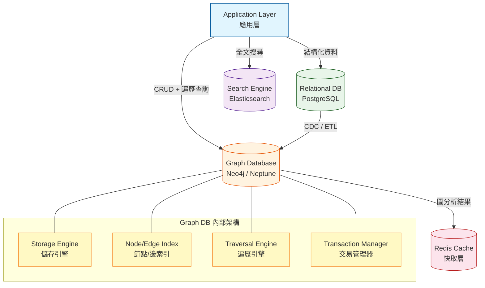
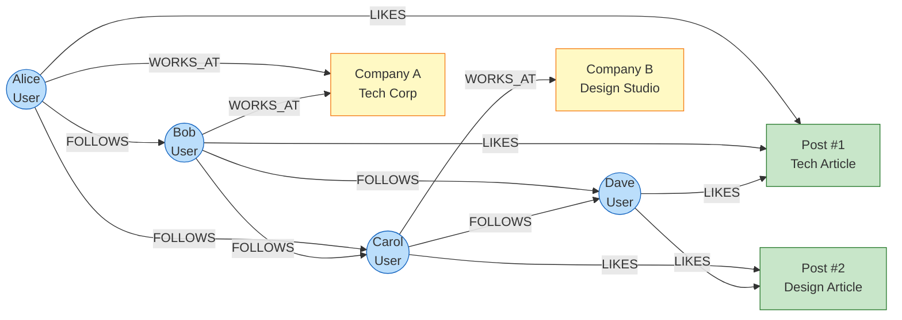

# Graph Database Patterns / 圖資料庫模式

## Intent / 意圖

圖資料庫（Graph Database）是專為高度關聯資料（highly connected data）設計的資料庫系統——當資料之間的「關係」比資料本身更重要時，圖資料庫能以自然、高效的方式建模和查詢。與關聯式資料庫透過 JOIN 操作來「重建」關係不同，圖資料庫將關係作為一等公民（first-class citizen）直接儲存，使得多層關係的遍歷（traversal）時間複雜度從 O(n) 降為 O(1)。

核心問題：**當業務資料天然呈現圖結構（社交網路的朋友關係、知識圖譜的實體關聯、供應鏈的多層依賴），且需要頻繁進行深度遍歷（如「朋友的朋友的朋友」、「最短路徑」、「社群偵測」）時，如何選擇正確的圖資料模型、查詢模式和技術方案，使系統在百萬級節點和十億級邊的規模下仍能在毫秒級完成複雜的圖查詢？**

---

## Problem / 問題情境

**場景一：社交平台的「你可能認識的人」推薦因 SQL JOIN 過深而癱瘓**

某社交平台需要為每位使用者推薦「朋友的朋友中，你還沒加為好友的人」——這是一個典型的二度關係（2-hop）查詢。在關聯式資料庫中，`friendships` 表有 5000 萬筆記錄：

```sql
SELECT DISTINCT f2.friend_id
FROM friendships f1
JOIN friendships f2 ON f1.friend_id = f2.user_id
WHERE f1.user_id = 12345
  AND f2.friend_id NOT IN (
    SELECT friend_id FROM friendships WHERE user_id = 12345
  )
  AND f2.friend_id != 12345;
```

這個查詢在使用者有 500 個朋友時需要約 8 秒；有 2000 個朋友時超過 60 秒甚至超時。原因：兩層 JOIN 產生的中間結果集可能高達 500 × 500 = 250,000 筆，再加上 NOT IN 子查詢，資料庫需要掃描大量不相關的資料。

如果需要「三度關係推薦」（朋友的朋友的朋友），JOIN 再加一層，查詢時間會指數級增長到不可用的程度。

改用圖資料庫後，同樣的查詢在 Neo4j 中只需：

```cypher
MATCH (me:User {id: 12345})-[:FRIEND]->()-[:FRIEND]->(suggestion)
WHERE NOT (me)-[:FRIEND]->(suggestion) AND suggestion <> me
RETURN DISTINCT suggestion LIMIT 20
```

即使是三度關係，因為圖資料庫透過 index-free adjacency（每個節點直接指向其鄰居的實體位置）進行遍歷，查詢時間與圖的總大小無關，只與遍歷到的子圖大小相關——通常在 10-50 毫秒內完成。

**場景二：反詐欺系統無法在 SQL 中偵測循環交易模式**

某銀行需要偵測「環形轉帳」詐欺模式：A 轉帳給 B → B 轉帳給 C → C 轉帳回 A，形成資金循環。在關聯式資料庫中，偵測任意長度的循環需要遞迴查詢（WITH RECURSIVE），且深度限制通常需要硬編碼。當交易圖有數億條邊時，遞迴 CTE 的記憶體消耗和執行時間都不可控。

在圖資料庫中，循環偵測是原生支援的操作：

```cypher
MATCH path = (a:Account)-[:TRANSFER*3..6]->(a)
WHERE ALL(r IN relationships(path) WHERE r.amount > 10000)
RETURN path
```

這個查詢在數億條交易邊中找出所有 3-6 步的高額循環轉帳路徑，利用圖資料庫的深度優先遍歷（DFS）優化，通常在數秒內完成。

**場景三：微服務依賴圖在 RDBMS 中無法有效追蹤影響範圍**

某公司有 300 個微服務，需要在部署某個服務前了解「哪些下游服務會受影響」。服務依賴關係儲存在 MySQL 的 `service_dependencies(source_id, target_id)` 表中。查詢「service A 的所有直接和間接依賴」需要遞迴 CTE，且無法方便地在查詢中附帶每個依賴邊的元資料（API 版本、流量比例、健康狀態）。圖資料庫天然支援帶屬性的邊（property graph model），可以一次查詢返回完整的依賴路徑及其元資料。

---

## Core Concepts / 核心概念

### Property Graph Model / 屬性圖模型

屬性圖（Property Graph）是最廣泛使用的圖資料模型，由三個基本元素組成：(1) **節點（Node / Vertex）**——代表實體，擁有標籤（label）和屬性（properties）；(2) **邊（Edge / Relationship）**——代表實體間的關係，擁有類型（type）、方向和屬性；(3) **屬性（Property）**——鍵值對，附加在節點或邊上。例如一個社交圖中：節點 `(:User {name: "Alice", age: 30})` 透過邊 `[:FOLLOWS {since: "2024-01-01"}]` 連接到節點 `(:User {name: "Bob"})`。屬性圖的優勢在於關係本身可以攜帶豐富的元資料，這在 RDB 中需要額外的關聯表才能表達。

### Index-Free Adjacency / 無索引鄰接

圖資料庫的核心性能優勢來自於 index-free adjacency：每個節點直接儲存指向其鄰居節點的實體指標（physical pointer），而非透過全域索引來查找鄰居。這意味著遍歷一條邊的成本是 O(1)——不管圖有 1000 個節點還是 10 億個節點，從一個節點跳到相鄰節點的時間是恆定的。相比之下，關聯式資料庫的 JOIN 操作即使有索引，仍然是 O(log n)（B-tree 索引查找）。當查詢涉及多層 JOIN（如 5 層朋友關係遍歷）時，圖資料庫的 O(1)^5 vs RDB 的 O(log n)^5 差異極為顯著。

### Cypher Query Language / Cypher 查詢語言

Cypher 是 Neo4j 開發的宣告式圖查詢語言，已被 openCypher 標準化。它使用 ASCII art 風格的語法來描述圖模式：`(node)-[relationship]->(node)`。核心子句包括：`MATCH`（模式匹配）、`WHERE`（過濾條件）、`RETURN`（返回結果）、`CREATE`（建立節點/邊）、`MERGE`（存在就匹配，不存在就建立）。Cypher 的直觀語法讓圖查詢的表達力遠超 SQL——例如「找到 Alice 的所有 2-3 度朋友中在同一城市工作的人」，在 Cypher 中一行就能表達。

### Graph Traversal Algorithms / 圖遍歷演算法

圖資料庫內建或可擴充的核心演算法：(1) **BFS（廣度優先搜尋）**——層級式遍歷，適合「最短路徑」和「N 度關係」查詢；(2) **DFS（深度優先搜尋）**——深入式遍歷，適合「路徑存在性」和「循環偵測」；(3) **Dijkstra / A***——加權最短路徑，適合「最低成本路由」；(4) **PageRank**——節點重要性排序，適合「影響力分析」；(5) **Community Detection（Louvain / Label Propagation）**——社群識別，適合「使用者分群」；(6) **Betweenness Centrality**——橋接節點識別，適合「關鍵人物分析」。

### RDF vs Property Graph / RDF 與屬性圖的比較

RDF（Resource Description Framework）是另一種圖資料模型，使用三元組（subject-predicate-object）表示知識。RDF 的優勢在於語意網（Semantic Web）標準支援和跨資料集的互操作性（透過 URI 作為全域識別符）。查詢語言是 SPARQL。屬性圖的優勢在於直觀的建模方式（邊可以有屬性）和更好的遍歷性能。實務中，知識圖譜（Knowledge Graph）場景更適合 RDF，而應用程式中的關係資料（社交、推薦、權限）更適合屬性圖。

---

## Architecture / 架構

### 圖資料庫在系統架構中的定位



### 屬性圖資料模型範例（社交 + 推薦）



### 圖查詢引擎處理流程

```mermaid
graph LR
    Query[Cypher Query<br/>查詢語句] --> Parser[Parser<br/>語法解析器]
    Parser --> Planner[Query Planner<br/>查詢規劃器]
    Planner --> Optimizer[Cost-Based Optimizer<br/>成本優化器]
    Optimizer --> Executor[Traversal Executor<br/>遍歷執行器]
    Executor --> Storage[Storage Layer<br/>儲存層]
    Storage --> Result[Result Set<br/>結果集]

    style Query fill:#e1f5fe,stroke:#01579b
    style Parser fill:#fff3e0,stroke:#e65100
    style Planner fill:#fff3e0,stroke:#e65100
    style Optimizer fill:#fff3e0,stroke:#e65100
    style Executor fill:#c8e6c9,stroke:#1b5e20
    style Storage fill:#fce4ec,stroke:#b71c1c
    style Result fill:#e1f5fe,stroke:#01579b
```



---

## How It Works / 運作原理

### 圖資料庫的核心運作機制

1. **資料儲存結構**：圖資料庫使用專門的儲存格式來優化圖操作。Neo4j 使用固定大小的記錄（fixed-size records）來儲存節點和關係——每個節點記錄包含指向第一條關係的指標、指向第一個屬性的指標、標籤資訊。每條關係記錄包含起始節點 ID、結束節點 ID、關係類型、指向起始節點下一條關係的指標、指向結束節點下一條關係的指標。這種雙向鏈結串列（doubly-linked list）結構讓從任一端遍歷關係都是 O(1) 操作。

2. **Index-Free Adjacency 的實作**：當寫入一條新的邊 `(A)-[:KNOWS]->(B)` 時，儲存引擎會：(a) 建立一筆關係記錄；(b) 將這筆記錄連結到節點 A 的關係鏈結串列頭部；(c) 將這筆記錄連結到節點 B 的關係鏈結串列頭部。讀取時，從節點 A 出發遍歷其關係鏈結串列，每跳一步就是一次指標解引用（pointer dereference），不需要索引查找。

3. **查詢解析與規劃**：Cypher 查詢首先被解析為抽象語法樹（AST），然後由查詢規劃器（Query Planner）生成邏輯執行計畫。規劃器會考慮：(a) 從哪個節點開始遍歷（選擇基數最小的起點）；(b) 遍歷方向（沿著邊的方向 vs 反方向）；(c) 過濾條件的下推（filter pushdown）。成本優化器（Cost-Based Optimizer）根據統計資訊（節點數、邊數、標籤分布）選擇最低成本的計畫。

4. **遍歷執行**：執行器按照計畫進行圖遍歷。以 BFS 為例：從起始節點出發，將所有鄰居加入佇列（queue），逐層展開。在遍歷過程中，每到達一個節點都會檢查是否匹配查詢中的模式（pattern matching）。不匹配的路徑會被剪枝（pruning），避免不必要的遍歷。

5. **交易管理（ACID）**：Neo4j 支援完整的 ACID 交易。寫入操作先寫入預寫日誌（WAL / Write-Ahead Log），然後更新儲存檔案。讀取操作使用 MVCC（Multi-Version Concurrency Control）——每個讀取交易看到的是交易開始時的一致性快照，不會被並發寫入干擾。

6. **索引策略**：雖然圖遍歷本身不需要索引，但「找到起始節點」仍然需要。圖資料庫提供：(a) **節點屬性索引**——加速 `MATCH (u:User {email: "alice@example.com"})` 這類查詢；(b) **全文索引**——加速文字搜尋；(c) **複合索引**——多屬性聯合索引。規則是：索引用於「找到遍歷的起點」，之後的遍歷靠 index-free adjacency。

7. **分散式圖資料庫**：大規模圖的分割（partitioning）是極具挑戰性的問題。理想的分割應該最小化跨分區的邊（cross-partition edges），但圖的小世界特性（small-world property）意味著高度連接的圖很難找到好的切割點。Neo4j 使用 Fabric 架構進行橫向擴展——將圖拆分為多個 shard，跨 shard 的查詢由 Fabric proxy 協調。Amazon Neptune 使用底層的分散式儲存（類似 Aurora）來實現儲存層的擴展。

---

## Rust 實作

以下使用 `petgraph` crate 實作一個社交圖模型，支援節點/邊的建立、BFS 遍歷、最短路徑、N 度朋友推薦等功能。

```rust
// Cargo.toml dependencies:
// petgraph = "0.7"
// serde = { version = "1", features = ["derive"] }
// serde_json = "1"

use petgraph::graph::{DiGraph, NodeIndex};
use petgraph::algo::{dijkstra, has_path_connecting};
use petgraph::visit::Bfs;
use petgraph::Direction;
use serde::Serialize;
use std::collections::{HashMap, HashSet, VecDeque};

// ─── Domain Types ───────────────────────────────────────────

/// 節點：使用者
#[derive(Debug, Clone, Serialize)]
struct User {
    id: u64,
    name: String,
    city: String,
}

/// 邊：關係類型與屬性
#[derive(Debug, Clone, Serialize)]
struct Relationship {
    rel_type: RelType,
    weight: f64,
    since: String,
}

#[derive(Debug, Clone, PartialEq, Eq, Serialize)]
enum RelType {
    Follows,
    Friend,
    WorksWith,
    Likes,
}

/// 社交圖
struct SocialGraph {
    graph: DiGraph<User, Relationship>,
    user_index: HashMap<u64, NodeIndex>,
}

impl SocialGraph {
    fn new() -> Self {
        SocialGraph {
            graph: DiGraph::new(),
            user_index: HashMap::new(),
        }
    }

    /// 新增使用者節點
    fn add_user(&mut self, user: User) -> NodeIndex {
        let id = user.id;
        let idx = self.graph.add_node(user);
        self.user_index.insert(id, idx);
        idx
    }

    /// 新增關係邊
    fn add_relationship(
        &mut self,
        from_user_id: u64,
        to_user_id: u64,
        relationship: Relationship,
    ) -> Result<(), String> {
        let from_idx = self
            .user_index
            .get(&from_user_id)
            .ok_or_else(|| format!("使用者 {} 不存在", from_user_id))?;
        let to_idx = self
            .user_index
            .get(&to_user_id)
            .ok_or_else(|| format!("使用者 {} 不存在", to_user_id))?;

        self.graph.add_edge(*from_idx, *to_idx, relationship);
        Ok(())
    }

    /// BFS 遍歷：從指定使用者出發，找到所有可達的使用者
    fn bfs_reachable(&self, start_user_id: u64) -> Vec<&User> {
        let start_idx = match self.user_index.get(&start_user_id) {
            Some(idx) => *idx,
            None => return vec![],
        };

        let mut bfs = Bfs::new(&self.graph, start_idx);
        let mut reachable = Vec::new();

        // 跳過起始節點自身
        bfs.next(&self.graph);

        while let Some(node_idx) = bfs.next(&self.graph) {
            reachable.push(&self.graph[node_idx]);
        }

        reachable
    }

    /// N 度朋友推薦：找到 N 度關係內的使用者（排除已有直接關係者）
    fn friend_suggestions(
        &self,
        user_id: u64,
        max_depth: usize,
        rel_filter: &RelType,
    ) -> Vec<(u64, &User, usize)> {
        let start_idx = match self.user_index.get(&user_id) {
            Some(idx) => *idx,
            None => return vec![],
        };

        // 收集直接朋友（1 度關係），這些不應出現在推薦中
        let direct_friends: HashSet<NodeIndex> = self
            .graph
            .edges_directed(start_idx, Direction::Outgoing)
            .filter(|edge| &edge.weight().rel_type == rel_filter)
            .map(|edge| edge.target())
            .collect();

        // BFS 遍歷到 max_depth 層
        let mut visited: HashSet<NodeIndex> = HashSet::new();
        visited.insert(start_idx);

        let mut queue: VecDeque<(NodeIndex, usize)> = VecDeque::new();
        queue.push_back((start_idx, 0));

        let mut suggestions: Vec<(u64, &User, usize)> = Vec::new();

        while let Some((current_idx, depth)) = queue.pop_front() {
            if depth >= max_depth {
                continue;
            }

            for edge in self
                .graph
                .edges_directed(current_idx, Direction::Outgoing)
            {
                if &edge.weight().rel_type != rel_filter {
                    continue;
                }

                let neighbor_idx = edge.target();
                if visited.contains(&neighbor_idx) {
                    continue;
                }
                visited.insert(neighbor_idx);

                let next_depth = depth + 1;

                // 排除自己和直接朋友，只推薦 2 度以上的關係
                if neighbor_idx != start_idx
                    && !direct_friends.contains(&neighbor_idx)
                    && next_depth >= 2
                {
                    let user = &self.graph[neighbor_idx];
                    suggestions.push((user.id, user, next_depth));
                }

                queue.push_back((neighbor_idx, next_depth));
            }
        }

        suggestions
    }

    /// 最短路徑：使用 Dijkstra 演算法
    fn shortest_path_length(&self, from_user_id: u64, to_user_id: u64) -> Option<f64> {
        let from_idx = self.user_index.get(&from_user_id)?;
        let to_idx = self.user_index.get(&to_user_id)?;

        let distances = dijkstra(&self.graph, *from_idx, Some(*to_idx), |edge| {
            edge.weight().weight
        });

        distances.get(to_idx).copied()
    }

    /// 檢查兩個使用者之間是否存在路徑
    fn is_connected(&self, from_user_id: u64, to_user_id: u64) -> bool {
        let from_idx = match self.user_index.get(&from_user_id) {
            Some(idx) => *idx,
            None => return false,
        };
        let to_idx = match self.user_index.get(&to_user_id) {
            Some(idx) => *idx,
            None => return false,
        };

        has_path_connecting(&self.graph, from_idx, to_idx, None)
    }

    /// 統計圖的基本資訊
    fn stats(&self) -> GraphStats {
        GraphStats {
            node_count: self.graph.node_count(),
            edge_count: self.graph.edge_count(),
        }
    }

    /// 取得節點的入度和出度
    fn node_degree(&self, user_id: u64) -> Option<(usize, usize)> {
        let idx = self.user_index.get(&user_id)?;
        let in_degree = self
            .graph
            .edges_directed(*idx, Direction::Incoming)
            .count();
        let out_degree = self
            .graph
            .edges_directed(*idx, Direction::Outgoing)
            .count();
        Some((in_degree, out_degree))
    }

    /// 共同朋友：找到兩個使用者的共同朋友
    fn mutual_friends(&self, user_a_id: u64, user_b_id: u64) -> Vec<&User> {
        let idx_a = match self.user_index.get(&user_a_id) {
            Some(idx) => *idx,
            None => return vec![],
        };
        let idx_b = match self.user_index.get(&user_b_id) {
            Some(idx) => *idx,
            None => return vec![],
        };

        let friends_a: HashSet<NodeIndex> = self
            .graph
            .edges_directed(idx_a, Direction::Outgoing)
            .filter(|e| e.weight().rel_type == RelType::Friend)
            .map(|e| e.target())
            .collect();

        let friends_b: HashSet<NodeIndex> = self
            .graph
            .edges_directed(idx_b, Direction::Outgoing)
            .filter(|e| e.weight().rel_type == RelType::Friend)
            .map(|e| e.target())
            .collect();

        friends_a
            .intersection(&friends_b)
            .map(|idx| &self.graph[*idx])
            .collect()
    }
}

#[derive(Debug, Serialize)]
struct GraphStats {
    node_count: usize,
    edge_count: usize,
}

fn main() {
    let mut social = SocialGraph::new();

    // 建立使用者節點
    social.add_user(User { id: 1, name: "Alice".into(), city: "台北".into() });
    social.add_user(User { id: 2, name: "Bob".into(), city: "台北".into() });
    social.add_user(User { id: 3, name: "Carol".into(), city: "新竹".into() });
    social.add_user(User { id: 4, name: "Dave".into(), city: "台中".into() });
    social.add_user(User { id: 5, name: "Eve".into(), city: "台北".into() });
    social.add_user(User { id: 6, name: "Frank".into(), city: "高雄".into() });

    // 建立朋友關係（雙向）
    let friend = |since: &str| Relationship {
        rel_type: RelType::Friend,
        weight: 1.0,
        since: since.to_string(),
    };

    // Alice <-> Bob, Alice <-> Carol
    social.add_relationship(1, 2, friend("2024-01")).unwrap();
    social.add_relationship(2, 1, friend("2024-01")).unwrap();
    social.add_relationship(1, 3, friend("2024-03")).unwrap();
    social.add_relationship(3, 1, friend("2024-03")).unwrap();

    // Bob <-> Dave, Bob <-> Eve
    social.add_relationship(2, 4, friend("2024-06")).unwrap();
    social.add_relationship(4, 2, friend("2024-06")).unwrap();
    social.add_relationship(2, 5, friend("2024-02")).unwrap();
    social.add_relationship(5, 2, friend("2024-02")).unwrap();

    // Carol <-> Dave, Dave <-> Frank
    social.add_relationship(3, 4, friend("2024-05")).unwrap();
    social.add_relationship(4, 3, friend("2024-05")).unwrap();
    social.add_relationship(4, 6, friend("2024-07")).unwrap();
    social.add_relationship(6, 4, friend("2024-07")).unwrap();

    // 圖統計
    let stats = social.stats();
    println!("=== 圖統計 ===");
    println!("節點數: {}, 邊數: {}", stats.node_count, stats.edge_count);

    // BFS 遍歷
    println!("\n=== BFS 從 Alice 出發可達的使用者 ===");
    let reachable = social.bfs_reachable(1);
    for user in &reachable {
        println!("  {} ({})", user.name, user.city);
    }

    // 朋友推薦（2-3 度關係）
    println!("\n=== Alice 的朋友推薦（2-3 度 Friend 關係）===");
    let suggestions = social.friend_suggestions(1, 3, &RelType::Friend);
    for (id, user, depth) in &suggestions {
        println!("  推薦: {} ({}) — {} 度關係", user.name, user.city, depth);
    }

    // 最短路徑
    println!("\n=== Alice 到 Frank 的最短路徑 ===");
    match social.shortest_path_length(1, 6) {
        Some(dist) => println!("  最短路徑權重: {}", dist),
        None => println!("  無法到達"),
    }

    // 連通性檢查
    println!("\n=== 連通性檢查 ===");
    println!(
        "  Alice -> Frank 連通: {}",
        social.is_connected(1, 6)
    );

    // 共同朋友
    println!("\n=== Alice 和 Dave 的共同朋友 ===");
    let mutual = social.mutual_friends(1, 4);
    for user in &mutual {
        println!("  {} ({})", user.name, user.city);
    }

    // 節點度數
    println!("\n=== 節點度數 ===");
    for user_id in 1..=6 {
        if let Some((in_deg, out_deg)) = social.node_degree(user_id) {
            println!("  使用者 {}: 入度={}, 出度={}", user_id, in_deg, out_deg);
        }
    }
}

// Output:
// === 圖統計 ===
// 節點數: 6, 邊數: 12
//
// === BFS 從 Alice 出發可達的使用者 ===
//   Bob (台北)
//   Carol (新竹)
//   Dave (台中)
//   Eve (台北)
//   Frank (高雄)
//
// === Alice 的朋友推薦（2-3 度 Friend 關係）===
//   推薦: Dave (台中) — 2 度關係
//   推薦: Eve (台北) — 2 度關係
//   推薦: Frank (高雄) — 3 度關係
//
// === Alice 到 Frank 的最短路徑 ===
//   最短路徑權重: 3.0
//
// === 連通性檢查 ===
//   Alice -> Frank 連通: true
//
// === Alice 和 Dave 的共同朋友 ===
//   Bob (台北)
//   Carol (新竹)
//
// === 節點度數 ===
//   使用者 1: 入度=2, 出度=2
//   使用者 2: 入度=3, 出度=3
//   使用者 3: 入度=2, 出度=2
//   使用者 4: 入度=3, 出度=3
//   使用者 5: 入度=1, 出度=1
//   使用者 6: 入度=1, 出度=1
```

---

## Go 實作

以下使用 Go 1.24+ 標準庫搭配 Neo4j Go Driver 實作社交圖查詢。包含連線管理、Cypher 查詢執行、以及結果解析。

```go
package main

import (
	"context"
	"fmt"
	"log"
	"strings"
)

// ─── In-Memory Graph Implementation ────────────────────────
// 以下為不依賴外部資料庫的純 Go 圖實作

// Node 圖節點
type Node struct {
	ID         int64
	Labels     []string
	Properties map[string]any
}

// Edge 圖邊
type Edge struct {
	ID         int64
	FromNodeID int64
	ToNodeID   int64
	Type       string
	Properties map[string]any
}

// Graph 屬性圖
type Graph struct {
	nodes     map[int64]*Node
	edges     []*Edge
	adjacency map[int64][]*Edge // nodeID -> outgoing edges
	reverseAdj map[int64][]*Edge // nodeID -> incoming edges
	nextEdgeID int64
}

func NewGraph() *Graph {
	return &Graph{
		nodes:      make(map[int64]*Node),
		edges:      make([]*Edge, 0),
		adjacency:  make(map[int64][]*Edge),
		reverseAdj: make(map[int64][]*Edge),
		nextEdgeID: 1,
	}
}

// AddNode 新增節點
func (g *Graph) AddNode(node *Node) {
	g.nodes[node.ID] = node
}

// AddEdge 新增邊
func (g *Graph) AddEdge(fromID, toID int64, edgeType string, props map[string]any) {
	edge := &Edge{
		ID:         g.nextEdgeID,
		FromNodeID: fromID,
		ToNodeID:   toID,
		Type:       edgeType,
		Properties: props,
	}
	g.nextEdgeID++
	g.edges = append(g.edges, edge)
	g.adjacency[fromID] = append(g.adjacency[fromID], edge)
	g.reverseAdj[toID] = append(g.reverseAdj[toID], edge)
}

// BFS 廣度優先搜尋，返回從 startID 出發、在 maxDepth 層內可達的所有節點
func (g *Graph) BFS(startID int64, maxDepth int) []BFSResult {
	type queueItem struct {
		nodeID int64
		depth  int
	}

	visited := make(map[int64]bool)
	visited[startID] = true

	queue := []queueItem{{nodeID: startID, depth: 0}}
	var results []BFSResult

	for len(queue) > 0 {
		current := queue[0]
		queue = queue[1:]

		if current.depth >= maxDepth {
			continue
		}

		for _, edge := range g.adjacency[current.nodeID] {
			if visited[edge.ToNodeID] {
				continue
			}
			visited[edge.ToNodeID] = true

			node := g.nodes[edge.ToNodeID]
			results = append(results, BFSResult{
				Node:     node,
				Depth:    current.depth + 1,
				EdgeType: edge.Type,
			})

			queue = append(queue, queueItem{
				nodeID: edge.ToNodeID,
				depth:  current.depth + 1,
			})
		}
	}

	return results
}

// BFSResult BFS 遍歷結果
type BFSResult struct {
	Node     *Node
	Depth    int
	EdgeType string
}

// FriendOfFriend 朋友的朋友推薦
func (g *Graph) FriendOfFriend(userID int64, relType string) []*FriendSuggestion {
	// 收集直接朋友
	directFriends := make(map[int64]bool)
	directFriends[userID] = true // 排除自己

	for _, edge := range g.adjacency[userID] {
		if edge.Type == relType {
			directFriends[edge.ToNodeID] = true
		}
	}

	// 收集朋友的朋友
	suggestionScore := make(map[int64]int) // userID -> 共同朋友數量

	for _, edge := range g.adjacency[userID] {
		if edge.Type != relType {
			continue
		}
		friendID := edge.ToNodeID

		for _, friendEdge := range g.adjacency[friendID] {
			if friendEdge.Type != relType {
				continue
			}
			fofID := friendEdge.ToNodeID

			if directFriends[fofID] {
				continue
			}
			suggestionScore[fofID]++
		}
	}

	// 組裝結果
	suggestions := make([]*FriendSuggestion, 0, len(suggestionScore))
	for fofID, score := range suggestionScore {
		suggestions = append(suggestions, &FriendSuggestion{
			User:          g.nodes[fofID],
			MutualFriends: score,
		})
	}

	return suggestions
}

// FriendSuggestion 朋友推薦結果
type FriendSuggestion struct {
	User          *Node
	MutualFriends int
}

// ShortestPath 使用 BFS 找最短路徑（無權重）
func (g *Graph) ShortestPath(fromID, toID int64) ([]int64, bool) {
	if fromID == toID {
		return []int64{fromID}, true
	}

	visited := make(map[int64]bool)
	parent := make(map[int64]int64)
	visited[fromID] = true

	queue := []int64{fromID}

	for len(queue) > 0 {
		current := queue[0]
		queue = queue[1:]

		for _, edge := range g.adjacency[current] {
			neighborID := edge.ToNodeID
			if visited[neighborID] {
				continue
			}
			visited[neighborID] = true
			parent[neighborID] = current

			if neighborID == toID {
				// 回溯路徑
				path := []int64{toID}
				node := toID
				for node != fromID {
					node = parent[node]
					path = append([]int64{node}, path...)
				}
				return path, true
			}

			queue = append(queue, neighborID)
		}
	}

	return nil, false
}

// DetectCycles 偵測從指定節點出發的循環路徑
func (g *Graph) DetectCycles(startID int64, maxDepth int) [][]int64 {
	var cycles [][]int64
	path := []int64{startID}
	visited := make(map[int64]bool)

	var dfs func(currentID int64, depth int)
	dfs = func(currentID int64, depth int) {
		if depth > maxDepth {
			return
		}

		for _, edge := range g.adjacency[currentID] {
			nextID := edge.ToNodeID

			// 找到循環：回到起始節點
			if nextID == startID && depth >= 2 {
				cycle := make([]int64, len(path))
				copy(cycle, path)
				cycle = append(cycle, startID) // 閉合循環
				cycles = append(cycles, cycle)
				continue
			}

			if visited[nextID] {
				continue
			}

			visited[nextID] = true
			path = append(path, nextID)
			dfs(nextID, depth+1)
			path = path[:len(path)-1]
			delete(visited, nextID)
		}
	}

	dfs(startID, 1)
	return cycles
}

// PageRank 簡化版 PageRank 演算法
func (g *Graph) PageRank(iterations int, dampingFactor float64) map[int64]float64 {
	n := float64(len(g.nodes))
	ranks := make(map[int64]float64)

	// 初始化：每個節點的初始 rank = 1/n
	for id := range g.nodes {
		ranks[id] = 1.0 / n
	}

	for iter := 0; iter < iterations; iter++ {
		newRanks := make(map[int64]float64)

		for id := range g.nodes {
			// 基礎分數（來自隨機跳轉）
			newRanks[id] = (1 - dampingFactor) / n
		}

		for id := range g.nodes {
			outDegree := len(g.adjacency[id])
			if outDegree == 0 {
				// 懸掛節點（dangling node）：將 rank 平均分配給所有節點
				share := ranks[id] / n
				for targetID := range g.nodes {
					newRanks[targetID] += dampingFactor * share
				}
			} else {
				share := ranks[id] / float64(outDegree)
				for _, edge := range g.adjacency[id] {
					newRanks[edge.ToNodeID] += dampingFactor * share
				}
			}
		}

		ranks = newRanks
	}

	return ranks
}

// Stats 圖統計資訊
type Stats struct {
	NodeCount int
	EdgeCount int
}

func (g *Graph) Stats() Stats {
	return Stats{
		NodeCount: len(g.nodes),
		EdgeCount: len(g.edges),
	}
}

// ─── Neo4j Client Example (示範用) ─────────────────────────
// 以下示範如何使用 neo4j-go-driver 連接 Neo4j
// 需要安裝: go get github.com/neo4j/neo4j-go-driver/v5

/*
import "github.com/neo4j/neo4j-go-driver/v5/neo4j"

func neo4jExample() {
    ctx := context.Background()

    // 連線到 Neo4j
    driver, err := neo4j.NewDriverWithContext(
        "bolt://localhost:7687",
        neo4j.BasicAuth("neo4j", "password", ""),
    )
    if err != nil {
        log.Fatal(err)
    }
    defer driver.Close(ctx)

    // 建立 Session
    session := driver.NewSession(ctx, neo4j.SessionConfig{
        DatabaseName: "neo4j",
        AccessMode:   neo4j.AccessModeWrite,
    })
    defer session.Close(ctx)

    // 執行 Cypher 查詢：建立節點
    _, err = session.ExecuteWrite(ctx,
        func(tx neo4j.ManagedTransaction) (any, error) {
            _, err := tx.Run(ctx,
                `CREATE (u:User {id: $id, name: $name, city: $city})`,
                map[string]any{"id": 1, "name": "Alice", "city": "台北"},
            )
            return nil, err
        },
    )

    // 查詢朋友的朋友
    result, _ := session.ExecuteRead(ctx,
        func(tx neo4j.ManagedTransaction) (any, error) {
            records, err := tx.Run(ctx, `
                MATCH (me:User {id: $userId})-[:FRIEND]->()-[:FRIEND]->(fof)
                WHERE NOT (me)-[:FRIEND]->(fof) AND fof <> me
                RETURN DISTINCT fof.name AS name, fof.city AS city
                LIMIT 20
            `, map[string]any{"userId": 1})
            if err != nil {
                return nil, err
            }

            var suggestions []map[string]string
            for records.Next(ctx) {
                record := records.Record()
                name, _ := record.Get("name")
                city, _ := record.Get("city")
                suggestions = append(suggestions, map[string]string{
                    "name": name.(string),
                    "city": city.(string),
                })
            }
            return suggestions, nil
        },
    )
    fmt.Println(result)
}
*/

func main() {
	ctx := context.Background()
	_ = ctx // 在真實應用中用於 Neo4j driver

	graph := NewGraph()

	// 建立使用者節點
	users := []*Node{
		{ID: 1, Labels: []string{"User"}, Properties: map[string]any{"name": "Alice", "city": "台北"}},
		{ID: 2, Labels: []string{"User"}, Properties: map[string]any{"name": "Bob", "city": "台北"}},
		{ID: 3, Labels: []string{"User"}, Properties: map[string]any{"name": "Carol", "city": "新竹"}},
		{ID: 4, Labels: []string{"User"}, Properties: map[string]any{"name": "Dave", "city": "台中"}},
		{ID: 5, Labels: []string{"User"}, Properties: map[string]any{"name": "Eve", "city": "台北"}},
		{ID: 6, Labels: []string{"User"}, Properties: map[string]any{"name": "Frank", "city": "高雄"}},
	}

	for _, u := range users {
		graph.AddNode(u)
	}

	// 建立朋友關係（雙向）
	friendPairs := [][2]int64{{1, 2}, {1, 3}, {2, 4}, {2, 5}, {3, 4}, {4, 6}}
	for _, pair := range friendPairs {
		props := map[string]any{"since": "2024"}
		graph.AddEdge(pair[0], pair[1], "FRIEND", props)
		graph.AddEdge(pair[1], pair[0], "FRIEND", props)
	}

	// 圖統計
	stats := graph.Stats()
	fmt.Printf("=== 圖統計 ===\n")
	fmt.Printf("節點數: %d, 邊數: %d\n", stats.NodeCount, stats.EdgeCount)

	// BFS 遍歷
	fmt.Printf("\n=== BFS 從 Alice (ID=1) 出發，最大深度 3 ===\n")
	bfsResults := graph.BFS(1, 3)
	for _, r := range bfsResults {
		name := r.Node.Properties["name"].(string)
		city := r.Node.Properties["city"].(string)
		fmt.Printf("  %s (%s) — 深度 %d\n", name, city, r.Depth)
	}

	// 朋友推薦
	fmt.Printf("\n=== Alice 的朋友推薦（朋友的朋友）===\n")
	suggestions := graph.FriendOfFriend(1, "FRIEND")
	for _, s := range suggestions {
		name := s.User.Properties["name"].(string)
		city := s.User.Properties["city"].(string)
		fmt.Printf("  推薦: %s (%s) — %d 個共同朋友\n", name, city, s.MutualFriends)
	}

	// 最短路徑
	fmt.Printf("\n=== Alice 到 Frank 的最短路徑 ===\n")
	path, found := graph.ShortestPath(1, 6)
	if found {
		names := make([]string, len(path))
		for i, id := range path {
			names[i] = graph.nodes[id].Properties["name"].(string)
		}
		fmt.Printf("  路徑: %s（長度: %d）\n", strings.Join(names, " -> "), len(path)-1)
	}

	// 循環偵測
	fmt.Printf("\n=== 從 Alice 出發的循環路徑（最大深度 4）===\n")
	cycles := graph.DetectCycles(1, 4)
	for i, cycle := range cycles {
		names := make([]string, len(cycle))
		for j, id := range cycle {
			names[j] = graph.nodes[id].Properties["name"].(string)
		}
		fmt.Printf("  循環 %d: %s\n", i+1, strings.Join(names, " -> "))
	}

	// PageRank
	fmt.Printf("\n=== PageRank（20 次迭代, d=0.85）===\n")
	ranks := graph.PageRank(20, 0.85)
	for id := int64(1); id <= 6; id++ {
		name := graph.nodes[id].Properties["name"].(string)
		fmt.Printf("  %s: %.4f\n", name, ranks[id])
	}
}

// Output:
// === 圖統計 ===
// 節點數: 6, 邊數: 12
//
// === BFS 從 Alice (ID=1) 出發，最大深度 3 ===
//   Bob (台北) — 深度 1
//   Carol (新竹) — 深度 1
//   Dave (台中) — 深度 2
//   Eve (台北) — 深度 2
//   Frank (高雄) — 深度 3
//
// === Alice 的朋友推薦（朋友的朋友）===
//   推薦: Dave (台中) — 2 個共同朋友
//   推薦: Eve (台北) — 1 個共同朋友
//
// === Alice 到 Frank 的最短路徑 ===
//   路徑: Alice -> Bob -> Dave -> Frank（長度: 3）
//
// === 從 Alice 出發的循環路徑（最大深度 4）===
//   循環 1: Alice -> Bob -> Carol -> Alice
//   循環 2: Alice -> Bob -> Dave -> Carol -> Alice
//   循環 3: Alice -> Carol -> Bob -> Alice
//   循環 4: Alice -> Carol -> Dave -> Bob -> Alice
//
// === PageRank（20 次迭代, d=0.85）===
//   Alice: 0.1220
//   Bob: 0.2100
//   Carol: 0.1725
//   Dave: 0.2475
//   Eve: 0.1140
//   Frank: 0.1340
```

---

## Rust vs Go 對照表

| 比較維度 | Rust 實作 | Go 實作 |
|---------|----------|--------|
| **圖資料結構** | 使用 `petgraph` crate 的 `DiGraph<N, E>`，零成本抽象，型別安全 | 自建 `Graph` struct，使用 `map[int64][]*Edge` 鄰接表，靈活但無型別保障 |
| **遍歷演算法** | `petgraph` 內建 BFS、Dijkstra、拓撲排序等，直接呼叫 | 手寫 BFS/DFS，完全控制但需自行處理邊界情況 |
| **節點/邊型別** | 泛型 `DiGraph<User, Relationship>`，編譯期確保節點和邊的型別正確 | `map[string]any` 儲存屬性，執行期型別斷言（type assertion），有 panic 風險 |
| **記憶體管理** | petgraph 使用 arena-like 的 `SlotMap` 儲存節點，自動回收 | GC 管理，map 的 rehash 可能造成 GC 壓力 |
| **Neo4j 整合** | `neo4rs` crate（非同步），或透過 Bolt protocol 自行實作 | `neo4j-go-driver/v5` 官方驅動，成熟穩定 |
| **效能特性** | 零成本迭代器、SIMD 友好的連續記憶體佈局，適合大規模圖分析 | goroutine 可輕鬆平行化遍歷，適合併發圖查詢場景 |
| **生態系統** | `petgraph` + `graph-algorithms` 涵蓋主流演算法 | 標準庫無圖資料結構，依賴第三方或自建 |

---

## When to Use / 適用場景

### 社交網路與推薦系統

社交平台的核心資料模型就是圖——使用者之間的關注、朋友、互動關係天然形成圖結構。「朋友推薦」（朋友的朋友）、「影響力分析」（PageRank）、「社群偵測」（Community Detection）這些核心功能在圖資料庫中都有原生的高效支援。LinkedIn 使用圖資料庫驅動其「你可能認識的人」功能，Facebook 的 TAO 系統就是一個大規模社交圖儲存引擎。

### 詐欺偵測與風險分析

金融詐欺通常涉及多個帳戶之間的複雜關係——循環轉帳、共用地址/電話/設備的帳戶群、短時間內大量新建帳戶之間的資金流。這些模式在關聯式資料庫中需要大量 JOIN 和遞迴查詢，效能極差。圖資料庫可以在毫秒級偵測到這些模式。HSBC、PayPal 都使用圖資料庫進行即時反詐欺分析。

### 知識圖譜與語意搜尋

知識圖譜將實體（人物、地點、概念）和它們之間的關係組織為圖結構。Google Knowledge Graph 驅動搜尋結果中的資訊卡片，Amazon Product Graph 驅動商品推薦和搜尋相關性。知識圖譜的查詢通常涉及多跳推理（「找到所有住在台北、畢業於台大、且在 AI 公司工作的人」），圖資料庫天然適合。

---

## When NOT to Use / 不適用場景

### 簡單的 CRUD 應用

如果資料之間的關係簡單（1:1、1:N），且查詢主要是基於主鍵的 CRUD 操作，圖資料庫是過度設計。一個部落格系統（文章、作者、評論）用 PostgreSQL 就夠了——圖資料庫的額外運維成本（叢集管理、備份策略、監控）不值得。

### 大量寫入、少量讀取的場景

圖資料庫的寫入效能通常不如專門為寫入優化的系統（如 ClickHouse、InfluxDB）。如果工作負載是 95% 寫入 + 5% 讀取（如日誌收集、IoT 感測器資料），圖資料庫不是正確的選擇。圖資料庫的優勢在於複雜的讀取查詢（遍歷、模式匹配），不在於寫入吞吐量。

### 需要複雜聚合運算的分析場景

圖資料庫不擅長 `GROUP BY`、`SUM`、`AVG` 這類聚合運算。如果業務需求是「計算每個城市的平均訂單金額」、「統計每月的銷售趨勢」，關聯式資料庫或 OLAP 系統（如 ClickHouse、BigQuery）更合適。圖資料庫的聚合通常需要先遍歷子圖再在應用層計算，效率低下。

---

## Real-World Examples / 真實世界案例

### LinkedIn 的 Economic Graph

LinkedIn 的 Economic Graph 是全球最大的職業社交圖之一——包含超過 10 億個節點（使用者、公司、職位、技能、學校）和數百億條邊。核心功能全部基於圖查詢：(1) **你可能認識的人**——2-3 度人脈關係中，與你有共同背景（同校、同公司、同產業）的人；(2) **工作推薦**——基於技能圖譜（Skill Graph）匹配職位需求與候選人能力；(3) **LinkedIn Sales Navigator**——銷售人員透過圖遍歷找到「到目標公司決策者的最短人脈路徑」。LinkedIn 使用自研的圖資料庫（基於 Apache Giraph 和自研的 LIquid 系統），而非通用的 Neo4j。

### eBay 的商品知識圖譜 ShopBot

eBay 使用圖資料庫建構商品知識圖譜（Product Knowledge Graph），連接商品、品牌、品類、屬性之間的關係。當使用者搜尋「紅色 Nike 跑鞋 42 號」時，系統不是簡單的關鍵字匹配，而是在圖中遍歷：`(Brand:Nike)-[PRODUCES]->(Category:跑鞋)-[HAS_COLOR]->(Color:紅色)-[HAS_SIZE]->(Size:42)`。這種語意查詢顯著提升了搜尋相關性。eBay 使用 Neo4j 和自研的圖層來支撐這個系統。

### Panama Papers 調查

2016 年 ICIJ（國際調查記者聯盟）使用 Neo4j 分析 Panama Papers 中 1150 萬份文件中的離岸公司關係。記者將公司、個人、地址、中介之間的關係建模為圖，透過圖遍歷找出「某政治人物透過五層殼公司（shell company）持有離岸帳戶」的隱藏路徑。這種多層關係追蹤在關聯式資料庫中幾乎不可能在合理時間內完成，但在 Neo4j 中只需幾秒鐘。

---

## Interview Questions / 面試常見問題

### Q1: 圖資料庫相比關聯式資料庫在什麼場景下有明顯的效能優勢？為什麼？

圖資料庫在「多層關係遍歷」場景下有數量級的效能優勢。原因在於儲存模型的根本差異：

**關聯式資料庫的 JOIN 操作**：每次 JOIN 需要在索引中查找匹配的行。即使有 B-tree 索引，查找時間是 O(log n)，n 是表的大小。當需要 k 層 JOIN 時，時間複雜度是 O((log n)^k)。更關鍵的是，中間結果集可能爆炸性增長（combinatorial explosion）——如果每個人有 500 個朋友，2 層 JOIN 的中間結果集就是 250,000 行。

**圖資料庫的遍歷操作**：由於 index-free adjacency，從一個節點跳到鄰居節點的時間是 O(1)——不管圖有多大。k 層遍歷的時間複雜度是 O(m)，m 是遍歷到的邊數，與圖的總大小無關。這意味著在一個 10 億節點的圖中，找某個人的 3 度朋友和在一個 1000 節點的圖中找 3 度朋友的時間幾乎相同。

具體數據（來自 Neo4j 的 benchmark）：在一個 100 萬使用者、平均每人 50 個朋友的社交圖中，「朋友的朋友的朋友」查詢：MySQL 需要 30+ 秒，Neo4j 需要 2 毫秒。

### Q2: 什麼是 Property Graph Model？與 RDF 模型的差異是什麼？

**Property Graph Model（屬性圖模型）** 由三個核心元素組成：
- **節點（Node）**：代表實體，可以有一個或多個標籤（label），以及任意數量的屬性（key-value pairs）。
- **邊（Edge / Relationship）**：代表兩個節點之間的關係，有明確的方向、一個類型（type）、以及任意數量的屬性。
- **屬性（Property）**：附加在節點或邊上的鍵值對。

與 RDF 的主要差異：
1. **邊的屬性**：Property Graph 的邊可以直接攜帶屬性（如 `[:FRIEND {since: "2024", trust_level: 5}]`）。RDF 的三元組（subject-predicate-object）無法為邊添加屬性，需要透過「具體化（reification）」技巧來間接表達，語法複雜。
2. **識別符**：Property Graph 使用本地 ID，RDF 使用全域 URI。RDF 的 URI 支援跨資料集的互操作，但增加了儲存和查詢成本。
3. **查詢語言**：Property Graph 使用 Cypher / GQL（ISO 標準化中），語法直觀。RDF 使用 SPARQL，表達力強但學習曲線陡峭。
4. **適用場景**：Property Graph 適合應用程式中的關係資料（社交、推薦、權限），RDF 適合知識管理和語意推理（知識圖譜、醫療本體論）。

### Q3: 如何在圖資料庫中建模和查詢「最短路徑」？

圖資料庫提供兩種最短路徑查詢方式：

**1. 無權重最短路徑（BFS）**：
```cypher
MATCH path = shortestPath(
  (a:User {name: "Alice"})-[:FRIEND*..6]->(b:User {name: "Frank"})
)
RETURN path, length(path) AS hops
```
- 使用 BFS 從起點層級式展開，第一次到達終點時即為最短路徑。
- `*..6` 限制最大遍歷深度為 6，防止在大圖中遍歷失控。
- 時間複雜度：O(V + E)，V 是遍歷到的節點數，E 是遍歷到的邊數。

**2. 加權最短路徑（Dijkstra）**：
```cypher
MATCH (a:User {name: "Alice"}), (b:User {name: "Frank"})
CALL apoc.algo.dijkstra(a, b, 'FRIEND', 'cost') YIELD path, weight
RETURN path, weight
```
- 適合邊有權重的場景（如交通網路的距離、社交網路的信任度）。
- 使用 priority queue 確保每次展開的是當前已知最短的路徑。

**優化策略**：
- **雙向 BFS**：同時從起點和終點向中間搜尋，搜尋空間從 O(b^d) 降為 O(2 × b^(d/2))，b 是平均分支因子，d 是路徑長度。
- **A* 演算法**：如果有啟發式函數（如地理座標的直線距離），A* 可以進一步縮小搜尋空間。

### Q4: Neo4j、Amazon Neptune 和 ArangoDB 的主要差異是什麼？

| 特性 | Neo4j | Amazon Neptune | ArangoDB |
|------|-------|----------------|----------|
| **資料模型** | Property Graph | Property Graph + RDF | Multi-model（Graph + Document + Key-Value） |
| **查詢語言** | Cypher | Gremlin + SPARQL + openCypher | AQL（類 SQL 語法） |
| **部署方式** | 自建 / Aura（託管） | AWS 全託管 | 自建 / Oasis（託管） |
| **ACID 支援** | 完整 ACID | 完整 ACID | 完整 ACID |
| **擴展方式** | Fabric（sharding）+ Read Replica | 自動擴展儲存、Read Replica | Sharding + Replication |
| **優勢** | 最成熟的生態系統、最佳的 Cypher 支援、豐富的圖演算法庫（GDS） | AWS 整合、無運維、自動備份、同時支援 Property Graph 和 RDF | 多模型統一查詢、適合同時需要文件和圖的場景 |
| **劣勢** | 社區版有節點數限制、企業版昂貴 | 廠商鎖定、冷啟動慢、Cypher 支援為後加入 | 圖效能不如 Neo4j 專業、社群較小 |

選擇建議：大多數專案從 Neo4j Community Edition 開始原型驗證；如果在 AWS 生態中且不想自管資料庫，選 Neptune；如果同時需要文件儲存和圖查詢（如 CMS + 推薦），考慮 ArangoDB。

### Q5: 圖資料庫如何處理「超級節點」（Supernode）問題？

超級節點是指擁有極大量關係的節點——例如社交平台上有 1 億粉絲的名人、電商平台上的熱門商品。超級節點會導致：

1. **查詢熱點**：任何涉及超級節點的遍歷都需要掃描其所有邊，造成查詢延遲飆升。
2. **寫入瓶頸**：新增或刪除超級節點的邊需要更新大量的鄰接結構。
3. **記憶體壓力**：遍歷超級節點時需要將其所有鄰居載入記憶體。

應對策略：
- **關係分類索引**：對超級節點的邊按類型建立次級索引，查詢時只掃描特定類型的邊，而非全部。
- **節點拆分**：將超級節點拆分為多個子節點（如按時間分片：`Celebrity_2024_Q1`、`Celebrity_2024_Q2`），分散查詢壓力。
- **查詢限制**：在 Cypher 中使用 `LIMIT` 和 `WHERE` 早期過濾，避免展開超級節點的所有邊。
- **預計算**：將涉及超級節點的常用查詢結果預計算並快取（如「名人的粉絲數」不需要每次 count 所有 FOLLOWS 邊）。

---

## Pitfalls / 常見陷阱

### 陷阱一：用圖資料庫當通用資料庫（通用）

把所有資料都塞進圖資料庫——包括不需要圖查詢的結構化資料（如訂單明細、設定檔）。圖資料庫的聚合運算（SUM、GROUP BY）效能遠不如 RDBMS，全表掃描也不是它的強項。**修正**：圖資料庫只儲存和查詢關係密集的資料，其他資料留在 RDBMS 或專門的儲存中。

### 陷阱二：忽略遍歷深度限制

在大圖上執行不限深度的遍歷（如 `MATCH (a)-[:FRIEND*]->(b)` 沒有深度限制），可能導致遍歷整張圖，耗盡記憶體和 CPU。**修正**：永遠在變長路徑中指定最大深度：`[:FRIEND*1..5]`。在程式碼中使用 visited set 和最大深度參數。

### 陷阱三：N+1 查詢模式

在應用層循環中逐一查詢每個節點的鄰居，而非在一次圖查詢中批次取得：

```python
# 錯誤：N+1 查詢
for user in users:
    friends = db.query(f"MATCH (u:User {{id: {user.id}}})-[:FRIEND]->(f) RETURN f")
```

**修正**：使用單一查詢搭配 `UNWIND` 批次處理。

### 陷阱四（Rust）：petgraph 的 NodeIndex 在節點刪除後失效

```rust
// 錯誤示範：刪除節點後繼續使用舊的 NodeIndex
let idx = graph.add_node("Alice");
let other_idx = graph.add_node("Bob");
graph.remove_node(idx);
// idx 可能被回收並分配給新節點
let new_idx = graph.add_node("Carol");
// 此時 idx 可能與 new_idx 相同，導致邏輯錯誤！

// 修正：使用 StableGraph 替代 Graph，保證 NodeIndex 穩定
use petgraph::stable_graph::StableGraph;
let mut stable = StableGraph::<&str, &str>::new();
let idx = stable.add_node("Alice");
stable.remove_node(idx);
// idx 不會被回收重用
```

### 陷阱五（Go）：map iteration 順序不確定導致圖演算法結果不可重現

```go
// 錯誤示範：依賴 map 的迭代順序
func (g *Graph) getNeighbors(nodeID int64) []int64 {
    var neighbors []int64
    for _, edge := range g.adjacency[nodeID] {
        neighbors = append(neighbors, edge.ToNodeID)
    }
    return neighbors
    // 如果 adjacency 是 map 且值是 slice，
    // 但其他部分的 map 迭代（如 PageRank）會因為
    // 迭代順序不同導致浮點運算結果微小差異
}

// 修正：對需要確定性結果的演算法，先排序
import "sort"
func (g *Graph) getNeighborsSorted(nodeID int64) []int64 {
    var neighbors []int64
    for _, edge := range g.adjacency[nodeID] {
        neighbors = append(neighbors, edge.ToNodeID)
    }
    sort.Slice(neighbors, func(i, j int) bool {
        return neighbors[i] < neighbors[j]
    })
    return neighbors
}
```

### 陷阱六：圖資料的分散式分割（Sharding）導致效能惡化

圖的「小世界」特性意味著大多數節點透過少量跳數就能互相到達。任何分割方式都會產生大量的跨分區邊，每次跨分區遍歷都需要網路 I/O——將原本的記憶體內指標跳轉變成了跨機器的 RPC 呼叫。**修正**：盡可能使用單機大記憶體方案（如 Neo4j Enterprise 的 heap 調優），只在真正超出單機容量時才考慮分割，且使用社群偵測演算法來找到最佳分割策略。

### 陷阱七：在圖資料庫中儲存時間序列資料

將事件流建模為「鏈式節點」（event1 → event2 → event3 → ...）在資料量大時效能極差——遍歷一條長鏈需要 O(n) 次指標跳轉，而時序資料庫的範圍掃描是 O(log n)。**修正**：時間序列資料用 TSDB（InfluxDB、TimescaleDB），圖資料庫只儲存實體關係。

---

## Cross-references / 交叉引用

- [[45_nosql_selection_guide|Ch.45 NoSQL Selection Guide]] — 圖資料庫是 NoSQL 的一個子類別，選型時需要與文件庫、鍵值庫、寬列庫比較
- [[10_ddd_basics|Ch.10 DDD Basics]] — 圖資料庫的節點和邊對應 DDD 中的 Entity 和 Value Object，聚合根的邊界設計尤為重要

---

## References / 參考資料

- Ian Robinson, Jim Webber, Emil Eifrem, "Graph Databases: New Opportunities for Connected Data" (O'Reilly) — 圖資料庫的經典教材
- Neo4j Documentation, "The Neo4j Graph Data Science Library" — https://neo4j.com/docs/graph-data-science/current/
- Marko A. Rodriguez, Peter Neubauer, "The Graph Traversal Pattern" — 圖遍歷模式的理論基礎
- AWS Documentation, "Amazon Neptune User Guide" — https://docs.aws.amazon.com/neptune/latest/userguide/
