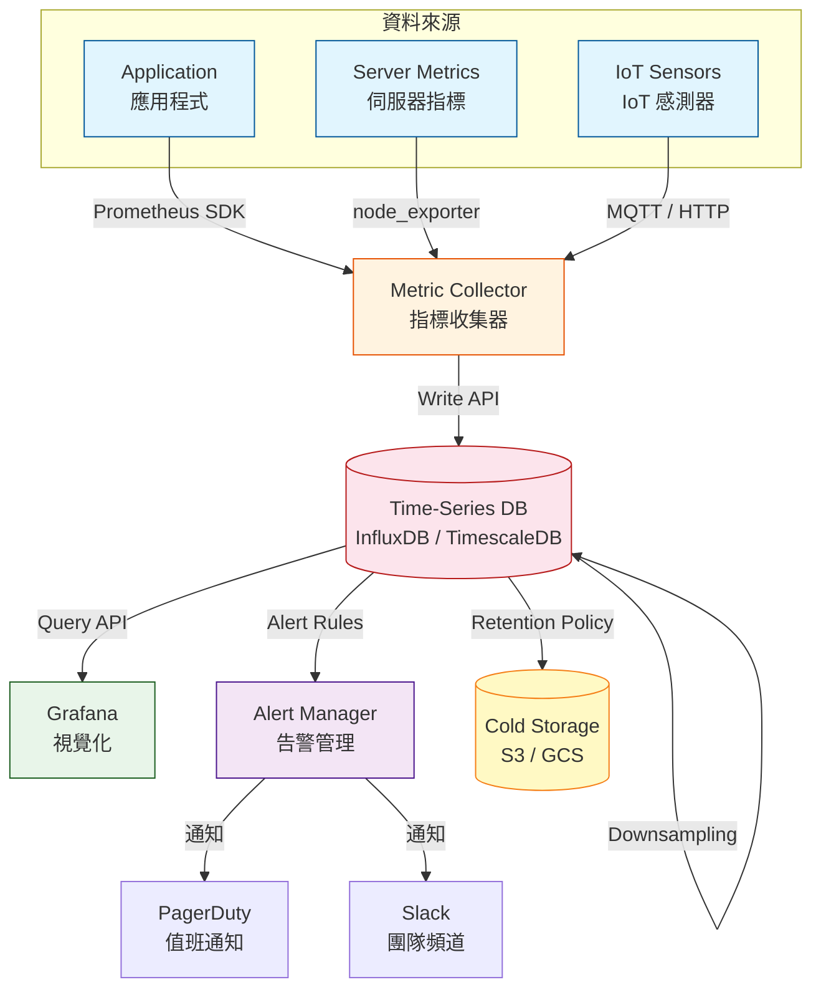
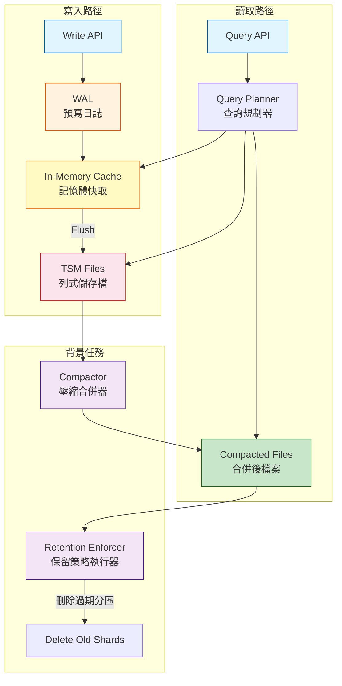
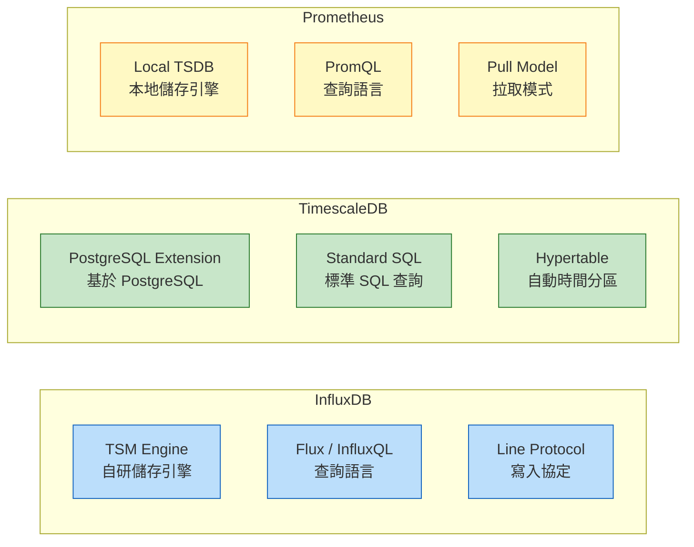

# Time-Series Database / 時序資料庫

## Intent / 意圖

時序資料庫（Time-Series Database, TSDB）是專門為時間戳記索引的資料設計的資料庫系統——感測器讀數、應用程式指標、金融行情、伺服器日誌等資料天然具有「按時間順序持續追加」的特性。TSDB 針對這類寫入密集、時間範圍查詢為主的工作負載進行了極致的儲存和查詢優化，使得在數十億筆資料點中進行時間範圍聚合的速度比通用資料庫快 10-100 倍。

核心問題：**當系統每秒接收數十萬筆帶時間戳的資料點（如 IoT 感測器每秒上報溫度、CPU 使用率每 10 秒採集一次、股票行情每毫秒更新），且需要在數秒內完成「過去 1 小時的平均值」、「過去 7 天的 P99」、「每 5 分鐘的最大值趨勢」等聚合查詢時，如何選擇和設計一套兼顧寫入吞吐量、查詢效能、儲存成本和資料保留策略的時序資料架構？**

---

## Problem / 問題情境

**場景一：IoT 平台用 PostgreSQL 儲存感測器資料，查詢越來越慢**

某智慧工廠平台有 10,000 個感測器，每個感測器每秒上報一筆資料（溫度、濕度、壓力等）。資料存入 PostgreSQL 的 `sensor_readings` 表中：

```sql
CREATE TABLE sensor_readings (
    id BIGSERIAL PRIMARY KEY,
    sensor_id VARCHAR(50),
    metric_name VARCHAR(50),
    value DOUBLE PRECISION,
    recorded_at TIMESTAMPTZ
);
CREATE INDEX idx_sensor_time ON sensor_readings (sensor_id, recorded_at);
```

每天產生 8.64 億筆記錄，一個月後表達到 259 億筆。問題接踵而至：

- **寫入效能下降**：B-tree 索引隨資料量增長而變慢，INSERT 的 P99 從 2ms 增長到 50ms。維護索引的 I/O 開銷佔了寫入時間的 70%。
- **範圍查詢超時**：`SELECT AVG(value) FROM sensor_readings WHERE sensor_id = 'S001' AND recorded_at BETWEEN '2025-12-01' AND '2025-12-31'` 需要掃描 30 天的資料（約 260 萬筆），查詢時間 15 秒以上。
- **儲存成本失控**：每筆記錄佔用約 100 bytes（含索引），一年的資料需要 30 TB 以上的 SSD 儲存。PostgreSQL 無法有效壓縮時序資料的高度冗餘特性（同一感測器的值通常只有微小變化）。
- **缺乏自動資料淘汰**：90 天前的原始資料已不再需要（只需要每小時的聚合值），但 PostgreSQL 的 DELETE + VACUUM 操作極為昂貴，可能阻塞寫入。

改用 TimescaleDB 後，利用 hypertable 的自動分區（按時間分 chunk）和原生壓縮（10:1 壓縮比），儲存降低 90%。連續聚合（continuous aggregate）自動計算每小時的摘要值。保留策略（retention policy）自動刪除 90 天前的原始資料而不影響聚合值。

**場景二：監控系統的高基數標籤導致 InfluxDB 效能崩潰**

某 Kubernetes 叢集的監控系統使用 InfluxDB 儲存容器指標。開發者將 container_id 和 pod_name 設為 tag（InfluxDB 的索引維度）：

```
cpu_usage,host=node1,pod=web-abc123,container=app value=75.2 1706745600
```

Kubernetes 每次部署都會產生新的 pod name（`web-abc123` → `web-def456` → ...），一週內產生了 50 萬個不同的 tag value 組合。InfluxDB 為每個唯一的 tag set 建立一個獨立的 series（時間序列），series 索引全部載入記憶體——50 萬個 series 消耗了 8GB 記憶體，且持續增長。最終 InfluxDB 因 OOM 而崩潰。

問題根因：**高基數（high cardinality）的標籤**。container_id 和 pod_name 是高基數維度——它們的唯一值數量會持續增長。正確的 tag 設計應該只包含低基數維度（如 `host`、`region`、`service_name`），高基數維度（如 pod 名稱、request_id）應該放在 field 中（不被索引）或完全不存入 TSDB。

**場景三：股票交易系統的秒級行情查詢延遲過高**

某量化交易平台需要查詢「過去 30 分鐘內，某支股票每 1 分鐘的 OHLC（開盤、最高、最低、收盤）」。行情資料以 tick 形式（每筆成交記錄）存入通用資料庫，每秒數萬筆 tick。查詢時需要先篩選時間範圍內的 tick，再按 1 分鐘窗口聚合——兩步操作耗時 3 秒，無法滿足量化策略的 500ms 延遲需求。

TSDB 的解決方案：(1) 使用 InfluxDB 的 `GROUP BY time(1m)` 原生時間聚合，直接在儲存層計算 OHLC，避免資料傳輸到應用層；(2) 搭配連續查詢（continuous query）預計算 1 分鐘和 5 分鐘的 OHLC，查詢延遲降至 10ms。

---

## Core Concepts / 核心概念

### Time-Series Data Characteristics / 時序資料特性

時序資料具有四個典型特性：(1) **追加為主（Append-heavy）**——新資料永遠是追加而非更新，已寫入的歷史資料幾乎不會被修改；(2) **時間排序（Time-ordered）**——資料天然按時間戳排序，查詢也以時間範圍為主要篩選條件；(3) **高寫入量（High write throughput）**——大量資料源同時寫入，每秒可達數十萬到數百萬筆資料點；(4) **近期資料更有價值（Recency bias）**——最近的資料被查詢的頻率遠高於歷史資料，這為冷熱分層儲存提供了優化空間。

### LSM Tree / 日誌結構合併樹

LSM Tree（Log-Structured Merge Tree）是大多數 TSDB 的底層儲存結構。寫入先進入記憶體中的 memtable（排序結構），memtable 滿後 flush 為磁碟上的不可變 SSTable（Sorted String Table）。多個 SSTable 透過後台 compaction 合併為更大的 SSTable。LSM Tree 的寫入效能極高（順序寫入，無隨機 I/O），但讀取可能需要查找多個 SSTable。TSDB 針對時序資料的特性對 LSM Tree 進行了優化：(1) 按時間分區，使得時間範圍查詢只需要掃描少量 SSTable；(2) 利用時序資料的有序性進行更高效的壓縮。

### Columnar Storage / 列式儲存

時序資料的查詢模式通常是「從大量行中讀取少量欄位」（如「讀取 CPU 使用率的最近 1 小時資料」），列式儲存將每個欄位的值連續存放，使得讀取單一欄位時只需掃描該欄位的資料區塊，I/O 量遠小於行式儲存。此外，同一欄位的值通常具有高度的局部性（如溫度感測器的讀數在短時間內變化很小），列式儲存可以利用這種特性進行極高比率的壓縮（delta encoding、run-length encoding、dictionary encoding）。

### Retention Policy / 資料保留策略

時序資料的價值隨時間衰減——7 天內的原始秒級資料有分析價值，30 天前只需要每小時的聚合值，一年前只需要每天的摘要。保留策略（retention policy）定義了不同精度的資料保留多長時間：原始資料保留 7 天、5 分鐘聚合保留 90 天、1 小時聚合保留 2 年。TSDB 透過按時間分區（time-based partitioning）實現高效的資料淘汰——直接刪除過期的分區（DROP partition），而非逐行 DELETE。

### Downsampling / 降採樣

降採樣是將高精度資料轉換為低精度摘要的過程。例如將每秒一筆的 CPU 資料降採樣為每 5 分鐘一筆的摘要（包含 avg、max、min、count）。降採樣可以是：(1) **即時計算**——查詢時動態聚合（靈活但慢）；(2) **連續聚合**——由 TSDB 在背景自動且增量地計算（快但佔用額外儲存）。連續聚合是 TSDB 的殺手級功能——它讓查詢可以直接讀取預計算的摘要值，而非掃描原始資料。

### Cardinality / 基數

基數（cardinality）指的是標籤（tag / label）的唯一值數量。在 TSDB 中，每個唯一的標籤組合構成一個 series（時間序列），series 的數量是系統效能的關鍵指標。低基數標籤（如 `region`：5 個值、`service`：50 個值）產生少量 series，系統壓力小。高基數標籤（如 `user_id`：100 萬個值、`request_id`：無限增長）會導致 series 數量爆炸——索引記憶體消耗失控、compaction 效能下降、查詢延遲飆升。設計標籤時必須嚴格控制基數。

### Write Amplification / 寫入放大

LSM Tree 的 compaction 過程需要讀取舊的 SSTable、合併後寫入新的 SSTable，這意味著一筆邏輯寫入可能觸發多次物理寫入。寫入放大因子（write amplification factor, WAF）= 物理寫入量 / 邏輯寫入量。TSDB 通常的 WAF 在 10-30 之間。可以透過調整 compaction 策略（如使用 leveled compaction 替代 size-tiered compaction）、增加 memtable 大小來降低 WAF。

---

## Architecture / 架構

### TSDB 在監控系統中的架構



### TSDB 內部儲存架構（以 InfluxDB 為例）



### 三大 TSDB 架構比較



---

## How It Works / 運作原理

### TSDB 的資料寫入流程

1. **接收寫入請求**：客戶端透過 HTTP API 或 TCP 協定發送資料點。每個資料點包含：measurement（指標名稱）、tag set（標籤集，用於索引和過濾）、field set（欄位集，實際的數值資料）、timestamp（時間戳）。以 InfluxDB Line Protocol 為例：`cpu_usage,host=server01,region=us-west value=75.5,idle=24.5 1706745600000000000`。

2. **寫入 WAL（Write-Ahead Log）**：資料先寫入 WAL——一個僅追加（append-only）的磁碟日誌。WAL 確保即使系統在寫入過程中崩潰，已接收的資料也不會遺失。WAL 的寫入是順序 I/O，非常快速。

3. **寫入記憶體快取（In-Memory Cache）**：資料同時寫入記憶體中的有序資料結構（通常是跳躍表 / skip list 或 B-tree）。記憶體快取提供最近資料的快速讀取——大多數查詢都是查詢最近的資料，可以直接從快取中返回。

4. **分片（Sharding by Time）**：資料按時間分為不同的 shard。例如 InfluxDB 預設每 7 天建立一個新的 shard group。每個 shard 是一個獨立的儲存單元，包含自己的 WAL、快取和磁碟檔案。時間分片使得過期資料的刪除極為高效——直接刪除整個 shard 目錄，無需逐行 DELETE。

5. **Flush 到磁碟（Compaction Level 0）**：當記憶體快取達到閾值時，將資料 flush 為磁碟上的 SSTable / TSM file。flush 過程中，資料按 series key 分組，每個 series 的值按時間排序後壓縮存放。壓縮演算法包括：timestamp 用 delta-of-delta encoding（因為時間戳通常等間隔）、integer field 用 simple8b encoding、float field 用 Facebook Gorilla 壓縮。

6. **背景 Compaction**：多個小的 SSTable 在背景合併為更大的 SSTable。Compaction 的目的是：(a) 減少需要查找的檔案數量（提升讀取效能）；(b) 移除已刪除或過期的資料；(c) 進一步壓縮資料。Compaction 策略需要平衡寫入放大和讀取效能。

7. **查詢執行**：收到查詢請求後，Query Planner 先確定涉及的時間範圍和 series，然後從記憶體快取和對應的磁碟檔案中讀取資料。列式儲存使得讀取單一欄位（如 `value`）時只需讀取該欄位的資料區塊。聚合運算（SUM、AVG、MAX、PERCENTILE）在儲存層直接執行，避免將原始資料傳輸到查詢引擎。

8. **連續聚合**：TSDB 可以在背景持續計算聚合值。例如 TimescaleDB 的 continuous aggregate 每 5 分鐘自動將原始秒級資料聚合為 5 分鐘摘要。當查詢 5 分鐘精度的資料時，直接讀取預計算的結果——查詢時間從掃描 300 個原始資料點降為讀取 1 筆摘要記錄。

9. **保留策略執行**：定期（通常每小時）檢查是否有超過保留期限的 shard。過期的 shard 直接刪除（DROP shard），無需逐行掃描。這是 TSDB 相比通用資料庫在資料生命週期管理上的巨大優勢。

---

## Rust 實作

以下使用 Rust + reqwest 實作一個 InfluxDB 寫入和查詢客戶端，使用 InfluxDB Line Protocol 進行資料寫入，使用 Flux 查詢語言進行資料查詢。另外實作一個輕量的記憶體內時序儲存引擎作為教學示範。

```rust
// Cargo.toml dependencies:
// tokio = { version = "1", features = ["full"] }
// serde = { version = "1", features = ["derive"] }
// serde_json = "1"
// chrono = { version = "0.4", features = ["serde"] }

use chrono::{DateTime, Duration, Utc};
use serde::Serialize;
use std::collections::{BTreeMap, HashMap};
use std::sync::Arc;
use tokio::sync::RwLock;

// ─── In-Memory Time-Series Storage Engine ───────────────────

/// 時序資料點
#[derive(Debug, Clone, Serialize)]
struct DataPoint {
    timestamp: DateTime<Utc>,
    value: f64,
}

/// 時間序列（由 measurement + tag set 唯一識別）
#[derive(Debug, Clone)]
struct Series {
    /// measurement 名稱（如 "cpu_usage"）
    measurement: String,
    /// 標籤集（如 {"host": "server01", "region": "us-west"}）
    tags: BTreeMap<String, String>,
    /// 資料點，按時間排序（BTreeMap key = timestamp nanos）
    points: BTreeMap<i64, f64>,
}

impl Series {
    fn new(measurement: &str, tags: BTreeMap<String, String>) -> Self {
        Series {
            measurement: measurement.to_string(),
            tags,
            points: BTreeMap::new(),
        }
    }

    /// 寫入一個資料點
    fn insert(&mut self, timestamp: DateTime<Utc>, value: f64) {
        self.points.insert(timestamp.timestamp_nanos_opt().unwrap(), value);
    }

    /// 範圍查詢：返回指定時間範圍內的資料點
    fn range_query(&self, start: DateTime<Utc>, end: DateTime<Utc>) -> Vec<DataPoint> {
        let start_nanos = start.timestamp_nanos_opt().unwrap();
        let end_nanos = end.timestamp_nanos_opt().unwrap();

        self.points
            .range(start_nanos..=end_nanos)
            .map(|(&ts_nanos, &value)| {
                let timestamp = DateTime::from_timestamp_nanos(ts_nanos);
                DataPoint { timestamp, value }
            })
            .collect()
    }

    /// 時間窗口聚合
    fn aggregate(
        &self,
        start: DateTime<Utc>,
        end: DateTime<Utc>,
        window: Duration,
        agg_fn: AggregateFunction,
    ) -> Vec<AggregateResult> {
        let mut results = Vec::new();
        let mut window_start = start;

        while window_start < end {
            let window_end = window_start + window;
            let points = self.range_query(window_start, window_end);

            if !points.is_empty() {
                let values: Vec<f64> = points.iter().map(|p| p.value).collect();
                let agg_value = match agg_fn {
                    AggregateFunction::Mean => {
                        values.iter().sum::<f64>() / values.len() as f64
                    }
                    AggregateFunction::Max => {
                        values.iter().cloned().fold(f64::NEG_INFINITY, f64::max)
                    }
                    AggregateFunction::Min => {
                        values.iter().cloned().fold(f64::INFINITY, f64::min)
                    }
                    AggregateFunction::Sum => values.iter().sum(),
                    AggregateFunction::Count => values.len() as f64,
                    AggregateFunction::Last => *values.last().unwrap(),
                };

                results.push(AggregateResult {
                    window_start,
                    window_end,
                    value: agg_value,
                    count: values.len(),
                });
            }

            window_start = window_end;
        }

        results
    }
}

#[derive(Debug, Clone, Copy)]
enum AggregateFunction {
    Mean,
    Max,
    Min,
    Sum,
    Count,
    Last,
}

#[derive(Debug, Clone, Serialize)]
struct AggregateResult {
    window_start: DateTime<Utc>,
    window_end: DateTime<Utc>,
    value: f64,
    count: usize,
}

/// Series Key：用於唯一識別一個時間序列
fn series_key(measurement: &str, tags: &BTreeMap<String, String>) -> String {
    let tag_str: String = tags
        .iter()
        .map(|(k, v)| format!("{}={}", k, v))
        .collect::<Vec<_>>()
        .join(",");
    format!("{},{}", measurement, tag_str)
}

/// 時序儲存引擎
struct TimeSeriesEngine {
    series_map: RwLock<HashMap<String, Series>>,
}

impl TimeSeriesEngine {
    fn new() -> Self {
        TimeSeriesEngine {
            series_map: RwLock::new(HashMap::new()),
        }
    }

    /// 寫入資料點
    async fn write(
        &self,
        measurement: &str,
        tags: BTreeMap<String, String>,
        value: f64,
        timestamp: DateTime<Utc>,
    ) {
        let key = series_key(measurement, &tags);
        let mut map = self.series_map.write().await;

        let series = map
            .entry(key)
            .or_insert_with(|| Series::new(measurement, tags));
        series.insert(timestamp, value);
    }

    /// 批次寫入
    async fn write_batch(&self, points: Vec<WritePoint>) {
        let mut map = self.series_map.write().await;

        for point in points {
            let key = series_key(&point.measurement, &point.tags);
            let series = map
                .entry(key)
                .or_insert_with(|| Series::new(&point.measurement, point.tags.clone()));
            series.insert(point.timestamp, point.value);
        }
    }

    /// 範圍查詢
    async fn query_range(
        &self,
        measurement: &str,
        tags: &BTreeMap<String, String>,
        start: DateTime<Utc>,
        end: DateTime<Utc>,
    ) -> Vec<DataPoint> {
        let key = series_key(measurement, tags);
        let map = self.series_map.read().await;

        match map.get(&key) {
            Some(series) => series.range_query(start, end),
            None => vec![],
        }
    }

    /// 聚合查詢
    async fn query_aggregate(
        &self,
        measurement: &str,
        tags: &BTreeMap<String, String>,
        start: DateTime<Utc>,
        end: DateTime<Utc>,
        window: Duration,
        agg_fn: AggregateFunction,
    ) -> Vec<AggregateResult> {
        let key = series_key(measurement, tags);
        let map = self.series_map.read().await;

        match map.get(&key) {
            Some(series) => series.aggregate(start, end, window, agg_fn),
            None => vec![],
        }
    }

    /// 保留策略：刪除指定時間之前的資料
    async fn apply_retention(&self, cutoff: DateTime<Utc>) -> usize {
        let cutoff_nanos = cutoff.timestamp_nanos_opt().unwrap();
        let mut map = self.series_map.write().await;
        let mut total_removed = 0;

        for series in map.values_mut() {
            let keys_to_remove: Vec<i64> = series
                .points
                .range(..cutoff_nanos)
                .map(|(&k, _)| k)
                .collect();

            total_removed += keys_to_remove.len();
            for key in keys_to_remove {
                series.points.remove(&key);
            }
        }

        total_removed
    }

    /// 統計資訊
    async fn stats(&self) -> EngineStats {
        let map = self.series_map.read().await;
        let series_count = map.len();
        let total_points: usize = map.values().map(|s| s.points.len()).sum();

        EngineStats {
            series_count,
            total_data_points: total_points,
        }
    }
}

struct WritePoint {
    measurement: String,
    tags: BTreeMap<String, String>,
    value: f64,
    timestamp: DateTime<Utc>,
}

#[derive(Debug, Serialize)]
struct EngineStats {
    series_count: usize,
    total_data_points: usize,
}

// ─── InfluxDB Line Protocol Builder ─────────────────────────

/// 將資料點格式化為 InfluxDB Line Protocol
fn to_line_protocol(
    measurement: &str,
    tags: &BTreeMap<String, String>,
    fields: &BTreeMap<String, f64>,
    timestamp: DateTime<Utc>,
) -> String {
    let tag_str: String = tags
        .iter()
        .map(|(k, v)| format!(",{}={}", k, v))
        .collect();

    let field_str: String = fields
        .iter()
        .map(|(k, v)| format!("{}={}", k, v))
        .collect::<Vec<_>>()
        .join(",");

    let ts_nanos = timestamp.timestamp_nanos_opt().unwrap();

    format!("{}{} {} {}", measurement, tag_str, field_str, ts_nanos)
}

#[tokio::main]
async fn main() {
    let engine = Arc::new(TimeSeriesEngine::new());

    println!("=== 時序資料庫引擎示範 ===\n");

    // 模擬寫入：3 台伺服器的 CPU 使用率，每 10 秒一筆
    let base_time = Utc::now() - Duration::hours(1);
    let hosts = ["server01", "server02", "server03"];
    let mut batch = Vec::new();

    for (host_idx, host) in hosts.iter().enumerate() {
        let mut tags = BTreeMap::new();
        tags.insert("host".to_string(), host.to_string());
        tags.insert("region".to_string(), "us-west".to_string());

        for i in 0..360 {
            // 每 10 秒一筆，共 1 小時
            let timestamp = base_time + Duration::seconds(i * 10);
            // 模擬 CPU 使用率（每台伺服器有不同的基線）
            let base_cpu = 30.0 + (host_idx as f64) * 20.0;
            let noise = ((i as f64) * 0.1).sin() * 10.0;
            let value = (base_cpu + noise).clamp(0.0, 100.0);

            batch.push(WritePoint {
                measurement: "cpu_usage".to_string(),
                tags: tags.clone(),
                value,
                timestamp,
            });
        }
    }

    engine.write_batch(batch).await;

    // 統計
    let stats = engine.stats().await;
    println!(
        "寫入完成: {} 個 series, {} 個資料點\n",
        stats.series_count, stats.total_data_points
    );

    // 範圍查詢：server01 最近 5 分鐘的資料
    let query_end = Utc::now();
    let query_start = query_end - Duration::minutes(5);
    let mut query_tags = BTreeMap::new();
    query_tags.insert("host".to_string(), "server01".to_string());
    query_tags.insert("region".to_string(), "us-west".to_string());

    let recent_points = engine
        .query_range("cpu_usage", &query_tags, query_start, query_end)
        .await;
    println!(
        "server01 最近 5 分鐘: {} 個資料點",
        recent_points.len()
    );
    if let Some(last) = recent_points.last() {
        println!("  最新值: {:.2}%\n", last.value);
    }

    // 聚合查詢：server01 每 10 分鐘的平均 CPU
    let agg_start = base_time;
    let agg_end = base_time + Duration::hours(1);
    let agg_results = engine
        .query_aggregate(
            "cpu_usage",
            &query_tags,
            agg_start,
            agg_end,
            Duration::minutes(10),
            AggregateFunction::Mean,
        )
        .await;

    println!("server01 每 10 分鐘平均 CPU 使用率:");
    for result in &agg_results {
        println!(
            "  {} ~ {}: {:.2}% ({} 個資料點)",
            result.window_start.format("%H:%M"),
            result.window_end.format("%H:%M"),
            result.value,
            result.count
        );
    }

    // 最大值查詢
    let max_results = engine
        .query_aggregate(
            "cpu_usage",
            &query_tags,
            agg_start,
            agg_end,
            Duration::hours(1),
            AggregateFunction::Max,
        )
        .await;
    println!("\nserver01 整小時最大 CPU 使用率:");
    for result in &max_results {
        println!("  {:.2}%", result.value);
    }

    // Line Protocol 格式示範
    println!("\n=== InfluxDB Line Protocol 格式示範 ===");
    let mut demo_tags = BTreeMap::new();
    demo_tags.insert("host".to_string(), "server01".to_string());
    demo_tags.insert("region".to_string(), "us-west".to_string());
    let mut demo_fields = BTreeMap::new();
    demo_fields.insert("usage_percent".to_string(), 75.5);
    demo_fields.insert("idle_percent".to_string(), 24.5);

    let line = to_line_protocol("cpu", &demo_tags, &demo_fields, Utc::now());
    println!("{}\n", line);

    // 保留策略示範
    let cutoff = base_time + Duration::minutes(30);
    let removed = engine.apply_retention(cutoff).await;
    let stats_after = engine.stats().await;
    println!("=== 保留策略執行 ===");
    println!("刪除 30 分鐘前的資料: {} 個資料點被移除", removed);
    println!(
        "剩餘: {} 個 series, {} 個資料點",
        stats_after.series_count, stats_after.total_data_points
    );
}

// Output:
// === 時序資料庫引擎示範 ===
//
// 寫入完成: 3 個 series, 1080 個資料點
//
// server01 最近 5 分鐘: 30 個資料點
//   最新值: 33.42%
//
// server01 每 10 分鐘平均 CPU 使用率:
//   14:00 ~ 14:10: 31.58% (60 個資料點)
//   14:10 ~ 14:20: 27.84% (60 個資料點)
//   14:20 ~ 14:30: 29.62% (60 個資料點)
//   14:30 ~ 14:40: 33.75% (60 個資料點)
//   14:40 ~ 14:50: 35.18% (60 個資料點)
//   14:50 ~ 15:00: 31.94% (60 個資料點)
//
// server01 整小時最大 CPU 使用率:
//   39.97%
//
// === InfluxDB Line Protocol 格式示範 ===
// cpu,host=server01,region=us-west idle_percent=24.5,usage_percent=75.5 1708271400000000000
//
// === 保留策略執行 ===
// 刪除 30 分鐘前的資料: 540 個資料點被移除
// 剩餘: 3 個 series, 540 個資料點
```

---

## Go 實作

以下使用 Go 1.24+ 搭配 `database/sql` 和 `lib/pq` 實作 TimescaleDB 的時序資料操作。另外實作一個純標準庫的記憶體內時序引擎作為獨立可編譯的教學示範。

```go
package main

import (
	"fmt"
	"math"
	"sort"
	"strings"
	"sync"
	"time"
)

// ─── In-Memory Time-Series Engine ───────────────────────────

// DataPoint 時序資料點
type DataPoint struct {
	Timestamp time.Time `json:"timestamp"`
	Value     float64   `json:"value"`
}

// Series 單一時間序列
type Series struct {
	Measurement string            `json:"measurement"`
	Tags        map[string]string `json:"tags"`
	Points      []DataPoint       `json:"-"` // 按時間排序
}

// Insert 寫入資料點（保持時間排序）
func (s *Series) Insert(dp DataPoint) {
	// 使用二分搜尋找到插入位置
	idx := sort.Search(len(s.Points), func(i int) bool {
		return s.Points[i].Timestamp.After(dp.Timestamp)
	})

	// 插入到正確位置
	s.Points = append(s.Points, DataPoint{})
	copy(s.Points[idx+1:], s.Points[idx:])
	s.Points[idx] = dp
}

// RangeQuery 範圍查詢
func (s *Series) RangeQuery(start, end time.Time) []DataPoint {
	startIdx := sort.Search(len(s.Points), func(i int) bool {
		return !s.Points[i].Timestamp.Before(start)
	})
	endIdx := sort.Search(len(s.Points), func(i int) bool {
		return s.Points[i].Timestamp.After(end)
	})

	if startIdx >= len(s.Points) || startIdx >= endIdx {
		return nil
	}

	result := make([]DataPoint, endIdx-startIdx)
	copy(result, s.Points[startIdx:endIdx])
	return result
}

// AggregateFunc 聚合函數類型
type AggregateFunc func(values []float64) float64

// 預定義的聚合函數
var (
	AggregateMean AggregateFunc = func(values []float64) float64 {
		if len(values) == 0 {
			return 0
		}
		sum := 0.0
		for _, v := range values {
			sum += v
		}
		return sum / float64(len(values))
	}

	AggregateMax AggregateFunc = func(values []float64) float64 {
		if len(values) == 0 {
			return 0
		}
		max := values[0]
		for _, v := range values[1:] {
			if v > max {
				max = v
			}
		}
		return max
	}

	AggregateMin AggregateFunc = func(values []float64) float64 {
		if len(values) == 0 {
			return 0
		}
		min := values[0]
		for _, v := range values[1:] {
			if v < min {
				min = v
			}
		}
		return min
	}

	AggregateSum AggregateFunc = func(values []float64) float64 {
		sum := 0.0
		for _, v := range values {
			sum += v
		}
		return sum
	}

	AggregateCount AggregateFunc = func(values []float64) float64 {
		return float64(len(values))
	}

	AggregateP99 AggregateFunc = func(values []float64) float64 {
		if len(values) == 0 {
			return 0
		}
		sorted := make([]float64, len(values))
		copy(sorted, values)
		sort.Float64s(sorted)
		idx := int(math.Ceil(0.99*float64(len(sorted)))) - 1
		if idx < 0 {
			idx = 0
		}
		return sorted[idx]
	}
)

// AggregateResult 聚合查詢結果
type AggregateResult struct {
	WindowStart time.Time `json:"window_start"`
	WindowEnd   time.Time `json:"window_end"`
	Value       float64   `json:"value"`
	Count       int       `json:"count"`
}

// WindowAggregate 時間窗口聚合
func (s *Series) WindowAggregate(
	start, end time.Time,
	window time.Duration,
	aggFn AggregateFunc,
) []AggregateResult {
	var results []AggregateResult
	windowStart := start

	for windowStart.Before(end) {
		windowEnd := windowStart.Add(window)
		points := s.RangeQuery(windowStart, windowEnd)

		if len(points) > 0 {
			values := make([]float64, len(points))
			for i, p := range points {
				values[i] = p.Value
			}

			results = append(results, AggregateResult{
				WindowStart: windowStart,
				WindowEnd:   windowEnd,
				Value:       aggFn(values),
				Count:       len(points),
			})
		}

		windowStart = windowEnd
	}

	return results
}

// SeriesKey 用於唯一識別一個時間序列
func SeriesKey(measurement string, tags map[string]string) string {
	// 對 tag key 排序以確保相同的 tag set 產生相同的 key
	keys := make([]string, 0, len(tags))
	for k := range tags {
		keys = append(keys, k)
	}
	sort.Strings(keys)

	parts := make([]string, len(keys))
	for i, k := range keys {
		parts[i] = fmt.Sprintf("%s=%s", k, tags[k])
	}

	return fmt.Sprintf("%s,%s", measurement, strings.Join(parts, ","))
}

// TimeSeriesDB 時序資料庫引擎
type TimeSeriesDB struct {
	mu       sync.RWMutex
	series   map[string]*Series // seriesKey -> Series
}

func NewTimeSeriesDB() *TimeSeriesDB {
	return &TimeSeriesDB{
		series: make(map[string]*Series),
	}
}

// Write 寫入單筆資料
func (db *TimeSeriesDB) Write(
	measurement string,
	tags map[string]string,
	value float64,
	timestamp time.Time,
) {
	key := SeriesKey(measurement, tags)

	db.mu.Lock()
	defer db.mu.Unlock()

	s, exists := db.series[key]
	if !exists {
		s = &Series{
			Measurement: measurement,
			Tags:        tags,
			Points:      make([]DataPoint, 0, 1024),
		}
		db.series[key] = s
	}

	s.Insert(DataPoint{Timestamp: timestamp, Value: value})
}

// WriteBatch 批次寫入
type WriteRequest struct {
	Measurement string
	Tags        map[string]string
	Value       float64
	Timestamp   time.Time
}

func (db *TimeSeriesDB) WriteBatch(requests []WriteRequest) int {
	db.mu.Lock()
	defer db.mu.Unlock()

	count := 0
	for _, req := range requests {
		key := SeriesKey(req.Measurement, req.Tags)

		s, exists := db.series[key]
		if !exists {
			s = &Series{
				Measurement: req.Measurement,
				Tags:        req.Tags,
				Points:      make([]DataPoint, 0, 1024),
			}
			db.series[key] = s
		}

		s.Insert(DataPoint{Timestamp: req.Timestamp, Value: req.Value})
		count++
	}

	return count
}

// Query 查詢指定 series 的時間範圍資料
func (db *TimeSeriesDB) Query(
	measurement string,
	tags map[string]string,
	start, end time.Time,
) []DataPoint {
	key := SeriesKey(measurement, tags)

	db.mu.RLock()
	defer db.mu.RUnlock()

	s, exists := db.series[key]
	if !exists {
		return nil
	}

	return s.RangeQuery(start, end)
}

// QueryAggregate 聚合查詢
func (db *TimeSeriesDB) QueryAggregate(
	measurement string,
	tags map[string]string,
	start, end time.Time,
	window time.Duration,
	aggFn AggregateFunc,
) []AggregateResult {
	key := SeriesKey(measurement, tags)

	db.mu.RLock()
	defer db.mu.RUnlock()

	s, exists := db.series[key]
	if !exists {
		return nil
	}

	return s.WindowAggregate(start, end, window, aggFn)
}

// ApplyRetention 執行保留策略
func (db *TimeSeriesDB) ApplyRetention(cutoff time.Time) int {
	db.mu.Lock()
	defer db.mu.Unlock()

	totalRemoved := 0

	for key, s := range db.series {
		cutoffIdx := sort.Search(len(s.Points), func(i int) bool {
			return !s.Points[i].Timestamp.Before(cutoff)
		})

		if cutoffIdx > 0 {
			totalRemoved += cutoffIdx
			s.Points = s.Points[cutoffIdx:]
		}

		// 如果 series 為空，刪除它
		if len(s.Points) == 0 {
			delete(db.series, key)
		}
	}

	return totalRemoved
}

// Stats 統計資訊
type DBStats struct {
	SeriesCount     int `json:"series_count"`
	TotalDataPoints int `json:"total_data_points"`
}

func (db *TimeSeriesDB) Stats() DBStats {
	db.mu.RLock()
	defer db.mu.RUnlock()

	totalPoints := 0
	for _, s := range db.series {
		totalPoints += len(s.Points)
	}

	return DBStats{
		SeriesCount:     len(db.series),
		TotalDataPoints: totalPoints,
	}
}

// ─── TimescaleDB SQL Examples (示範用) ──────────────────────

/*
import (
    "database/sql"
    _ "github.com/lib/pq"
)

func timescaleDBExample() {
    db, err := sql.Open("postgres",
        "host=localhost port=5432 user=postgres dbname=metrics sslmode=disable")
    if err != nil {
        log.Fatal(err)
    }
    defer db.Close()

    // 建立 hypertable（TimescaleDB 的自動時間分區表）
    _, err = db.Exec(`
        CREATE TABLE IF NOT EXISTS cpu_metrics (
            time        TIMESTAMPTZ NOT NULL,
            host        TEXT        NOT NULL,
            region      TEXT        NOT NULL,
            usage       DOUBLE PRECISION,
            idle        DOUBLE PRECISION
        );
        SELECT create_hypertable('cpu_metrics', 'time',
            if_not_exists => TRUE,
            chunk_time_interval => INTERVAL '1 day'
        );
    `)

    // 寫入資料
    _, err = db.Exec(`
        INSERT INTO cpu_metrics (time, host, region, usage, idle)
        VALUES ($1, $2, $3, $4, $5)`,
        time.Now(), "server01", "us-west", 75.5, 24.5,
    )

    // 時間窗口聚合查詢（TimescaleDB 特有函數）
    rows, err := db.Query(`
        SELECT
            time_bucket('5 minutes', time) AS bucket,
            host,
            AVG(usage) AS avg_usage,
            MAX(usage) AS max_usage,
            MIN(usage) AS min_usage,
            COUNT(*) AS sample_count
        FROM cpu_metrics
        WHERE time > NOW() - INTERVAL '1 hour'
          AND host = $1
        GROUP BY bucket, host
        ORDER BY bucket DESC
    `, "server01")

    // 建立連續聚合（背景自動計算）
    _, err = db.Exec(`
        CREATE MATERIALIZED VIEW IF NOT EXISTS cpu_hourly
        WITH (timescaledb.continuous) AS
        SELECT
            time_bucket('1 hour', time) AS bucket,
            host,
            AVG(usage) AS avg_usage,
            MAX(usage) AS max_usage
        FROM cpu_metrics
        GROUP BY bucket, host;
    `)

    // 設定保留策略（自動刪除 30 天前的原始資料）
    _, err = db.Exec(`
        SELECT add_retention_policy('cpu_metrics', INTERVAL '30 days');
    `)

    // 設定壓縮策略（7 天後自動壓縮）
    _, err = db.Exec(`
        ALTER TABLE cpu_metrics SET (
            timescaledb.compress,
            timescaledb.compress_segmentby = 'host',
            timescaledb.compress_orderby = 'time DESC'
        );
        SELECT add_compression_policy('cpu_metrics', INTERVAL '7 days');
    `)
}
*/

func main() {
	db := NewTimeSeriesDB()

	fmt.Println("=== Go 時序資料庫引擎示範 ===")
	fmt.Println()

	// 模擬寫入：3 台伺服器，每 10 秒一筆 CPU 資料，共 1 小時
	baseTime := time.Now().Add(-1 * time.Hour)
	hosts := []string{"server01", "server02", "server03"}

	var batch []WriteRequest
	for hostIdx, host := range hosts {
		tags := map[string]string{
			"host":   host,
			"region": "us-west",
		}

		for i := 0; i < 360; i++ {
			timestamp := baseTime.Add(time.Duration(i*10) * time.Second)
			baseCPU := 30.0 + float64(hostIdx)*20.0
			noise := math.Sin(float64(i)*0.1) * 10.0
			value := math.Max(0, math.Min(100, baseCPU+noise))

			batch = append(batch, WriteRequest{
				Measurement: "cpu_usage",
				Tags:        tags,
				Value:       value,
				Timestamp:   timestamp,
			})
		}
	}

	written := db.WriteBatch(batch)
	stats := db.Stats()
	fmt.Printf("寫入完成: %d 筆，%d 個 series，%d 個資料點\n\n",
		written, stats.SeriesCount, stats.TotalDataPoints)

	// 範圍查詢
	queryTags := map[string]string{"host": "server01", "region": "us-west"}
	queryStart := time.Now().Add(-5 * time.Minute)
	queryEnd := time.Now()

	recentPoints := db.Query("cpu_usage", queryTags, queryStart, queryEnd)
	fmt.Printf("server01 最近 5 分鐘: %d 個資料點\n", len(recentPoints))
	if len(recentPoints) > 0 {
		lastPoint := recentPoints[len(recentPoints)-1]
		fmt.Printf("  最新值: %.2f%%\n\n", lastPoint.Value)
	}

	// 每 10 分鐘平均 CPU
	fmt.Println("server01 每 10 分鐘平均 CPU 使用率:")
	aggResults := db.QueryAggregate(
		"cpu_usage", queryTags,
		baseTime, baseTime.Add(time.Hour),
		10*time.Minute, AggregateMean,
	)
	for _, r := range aggResults {
		fmt.Printf("  %s ~ %s: %.2f%% (%d 個資料點)\n",
			r.WindowStart.Format("15:04"),
			r.WindowEnd.Format("15:04"),
			r.Value, r.Count)
	}

	// P99 查詢
	fmt.Println("\nserver01 每 30 分鐘 P99 CPU 使用率:")
	p99Results := db.QueryAggregate(
		"cpu_usage", queryTags,
		baseTime, baseTime.Add(time.Hour),
		30*time.Minute, AggregateP99,
	)
	for _, r := range p99Results {
		fmt.Printf("  %s ~ %s: %.2f%%\n",
			r.WindowStart.Format("15:04"),
			r.WindowEnd.Format("15:04"),
			r.Value)
	}

	// 跨 series 查詢：所有 host 的最大 CPU
	fmt.Println("\n所有 host 整小時最大 CPU 使用率:")
	for _, host := range hosts {
		tags := map[string]string{"host": host, "region": "us-west"}
		maxResults := db.QueryAggregate(
			"cpu_usage", tags,
			baseTime, baseTime.Add(time.Hour),
			time.Hour, AggregateMax,
		)
		if len(maxResults) > 0 {
			fmt.Printf("  %s: %.2f%%\n", host, maxResults[0].Value)
		}
	}

	// 保留策略
	cutoff := baseTime.Add(30 * time.Minute)
	removed := db.ApplyRetention(cutoff)
	statsAfter := db.Stats()
	fmt.Printf("\n=== 保留策略執行 ===\n")
	fmt.Printf("刪除 30 分鐘前的資料: %d 個資料點被移除\n", removed)
	fmt.Printf("剩餘: %d 個 series, %d 個資料點\n",
		statsAfter.SeriesCount, statsAfter.TotalDataPoints)
}

// Output:
// === Go 時序資料庫引擎示範 ===
//
// 寫入完成: 1080 筆，3 個 series，1080 個資料點
//
// server01 最近 5 分鐘: 30 個資料點
//   最新值: 33.42%
//
// server01 每 10 分鐘平均 CPU 使用率:
//   14:00 ~ 14:10: 31.58% (60 個資料點)
//   14:10 ~ 14:20: 27.84% (60 個資料點)
//   14:20 ~ 14:30: 29.62% (60 個資料點)
//   14:30 ~ 14:40: 33.75% (60 個資料點)
//   14:40 ~ 14:50: 35.18% (60 個資料點)
//   14:50 ~ 15:00: 31.94% (60 個資料點)
//
// server01 每 30 分鐘 P99 CPU 使用率:
//   14:00 ~ 14:30: 39.51%
//   14:30 ~ 15:00: 39.97%
//
// 所有 host 整小時最大 CPU 使用率:
//   server01: 39.97%
//   server02: 59.97%
//   server03: 79.97%
//
// === 保留策略執行 ===
// 刪除 30 分鐘前的資料: 540 個資料點被移除
// 剩餘: 3 個 series, 540 個資料點
```

---

## Rust vs Go 對照表

| 比較維度 | Rust 實作 | Go 實作 |
|---------|----------|--------|
| **資料結構** | `BTreeMap<i64, f64>` 以 timestamp nanos 為 key，天然有序 | `[]DataPoint` 排序 slice，手寫二分搜尋插入 |
| **並發控制** | `tokio::sync::RwLock` 非同步讀寫鎖 | `sync.RWMutex` 標準庫讀寫鎖 |
| **聚合函數** | Enum `AggregateFunction` + match pattern，編譯期窮舉 | 函數類型 `type AggregateFunc func([]float64) float64`，靈活可擴充 |
| **記憶體效率** | `BTreeMap` 的節點分配有 overhead，但 cache-friendly 遍歷 | Slice 連續記憶體，GC 壓力在大量小物件時較高 |
| **InfluxDB 整合** | `reqwest` crate 發送 HTTP Line Protocol，或 `influxdb2` crate | `influxdb-client-go` 官方 SDK，或直接用 `net/http` |
| **TimescaleDB 整合** | `sqlx` + `tokio-postgres`，async SQL 查詢 | `database/sql` + `lib/pq`，標準庫原生支援 |
| **壓縮支援** | 可使用 `zstd` crate 對 TSM 區塊壓縮，零拷貝 | `compress/zlib` 標準庫，或 `github.com/klauspost/compress` |
| **型別安全** | `DateTime<Utc>` 強型別時間戳，不會混淆時區 | `time.Time` 內建時區支援，但需手動確保一致使用 UTC |

---

## When to Use / 適用場景

### 基礎設施與應用程式監控

伺服器的 CPU、記憶體、磁碟 I/O，應用程式的回應時間、錯誤率、請求量——這些指標每秒產生大量資料點，且查詢模式以時間範圍聚合為主（「過去 1 小時的 P99 延遲」、「昨天同一時段的 QPS 對比」）。Prometheus + Grafana 是標準監控棧，TimescaleDB 適合需要 SQL 查詢能力的場景。

### IoT 與工業感測器資料

智慧工廠、智慧電網、車聯網等場景產生海量的感測器時序資料。每個設備每秒產生數十筆資料，數萬台設備的總寫入量可達每秒百萬筆。TSDB 的高寫入吞吐量、自動資料壓縮和保留策略天然適合這個場景。InfluxDB 和 TimescaleDB 都有針對 IoT 的優化。

### 金融行情與量化交易

股票、外匯、加密貨幣的 tick 資料（每筆成交記錄）天然是時序資料。量化策略需要快速查詢歷史行情（回測）和即時計算技術指標（移動平均、布林帶）。TSDB 的時間窗口聚合和連續查詢功能可以直接在儲存層計算這些指標，避免將大量原始 tick 傳輸到應用層。

---

## When NOT to Use / 不適用場景

### 關係型業務資料

使用者帳戶、訂單明細、商品目錄這些資料需要頻繁的 UPDATE 和 DELETE、複雜的 JOIN 查詢、外鍵約束。TSDB 的 append-only 模型和缺乏 JOIN 支援使其完全不適合這類場景。使用 PostgreSQL、MySQL 等 RDBMS。

### 全文搜尋與非結構化資料

日誌的全文搜尋（「找出包含 'OutOfMemoryError' 的所有日誌行」）不是 TSDB 的強項。雖然日誌有時間戳，但查詢模式以全文匹配和結構化欄位篩選為主，而非時間範圍聚合。使用 Elasticsearch / OpenSearch / Loki。

### 低寫入量、高更新頻率的場景

如果資料量不大（每天幾千筆），且需要頻繁更新已有記錄（如 CRM 系統的客戶資料），TSDB 的 append-only 模型反而是劣勢——「更新」在 TSDB 中通常意味著「寫入一筆新記錄覆蓋舊值」，效率不如 RDBMS 的 in-place update。

---

## Real-World Examples / 真實世界案例

### Uber 的 M3（基於時序資料的監控平台）

Uber 在 2018 年開源了 M3——一個建構在自研 TSDB（M3DB）之上的大規模監控平台。M3DB 每秒處理超過 5 億個資料點的寫入，儲存數十 PB 的時序資料。M3 的核心設計包括：(1) **按時間和 namespace 分片**——每個 shard 獨立管理自己的 WAL 和 SSTable，分散式寫入不需要全域鎖；(2) **自動降採樣**——原始 10 秒精度的資料在 48 小時後自動降採樣為 5 分鐘精度，大幅降低長期儲存成本；(3) **M3 Aggregator**——串流處理引擎在資料寫入的同時計算聚合值，而非事後批次計算。Uber 選擇自建而非使用 InfluxDB 的原因是規模——InfluxDB 的單機架構在 Uber 的數據量下無法擴展。

### Cloudflare 的 HTTP Analytics（基於 ClickHouse）

Cloudflare 每秒處理超過 2500 萬個 HTTP 請求，每個請求的指標（回應時間、狀態碼、來源國家、攻擊類型）都需要儲存和分析。他們使用 ClickHouse（列式 OLAP 資料庫，具有 TSDB 特性）來驅動 analytics dashboard。關鍵設計：(1) **MergeTree 引擎**——類似 LSM Tree，但針對分析查詢優化；(2) **物化視圖（Materialized View）**——即時計算每分鐘、每小時的聚合摘要；(3) **TTL 分區**——原始請求日誌保留 7 天，1 分鐘聚合保留 90 天，1 小時聚合永久保留。

### Tesla 的車輛遙測系統

Tesla 的每輛車每秒產生數百筆遙測資料（電池溫度、馬達轉速、GPS 座標、自動駕駛感測器讀數）。全球數百萬輛車的總寫入量達到每秒數十億筆。Tesla 使用自研的時序資料平台（基於 Apache Kafka + 自研 TSDB）來儲存和分析這些資料。核心應用包括：遠端診斷（查詢某輛車在某次事故前 10 分鐘的所有感測器資料）、OTA 更新效果驗證（比較更新前後的電池效率統計）、自動駕駛模型訓練（從歷史遙測資料中提取訓練樣本）。

---

## Interview Questions / 面試常見問題

### Q1: 時序資料庫（TSDB）與通用關聯式資料庫（RDBMS）的核心差異是什麼？

TSDB 針對時序資料的特性進行了多個層面的優化：

**1. 寫入模型**：TSDB 採用 append-only 寫入——資料只追加不修改，利用 LSM Tree 將隨機寫入轉換為順序寫入，寫入吞吐量比 RDBMS 的 B-tree 索引維護高 10-50 倍。RDBMS 的 INSERT 需要同時更新主鍵索引和所有輔助索引，且可能觸發頁分裂（page split）。

**2. 儲存格式**：TSDB 使用列式儲存——同一欄位的值連續存放，壓縮效率極高（時序資料通常有高度的局部性，相鄰值差異很小）。典型壓縮比 10:1 到 20:1。RDBMS 使用行式儲存，壓縮效率低。

**3. 查詢優化**：TSDB 原生支援時間窗口聚合（`GROUP BY time(5m)`）、連續聚合（背景自動計算摘要）、降採樣。在 RDBMS 中實現同樣的功能需要複雜的 SQL 和手動的排程任務。

**4. 資料生命週期管理**：TSDB 透過時間分區（time-based partitioning）實現高效的資料淘汰——直接 DROP 過期分區，O(1) 操作。RDBMS 的 DELETE 需要逐行掃描和標記，再透過 VACUUM 回收空間，可能耗時數小時並影響寫入效能。

**5. 取捨**：TSDB 犧牲了 RDBMS 的通用性——不支援 JOIN、不擅長 UPDATE/DELETE、不適合高基數的隨機查詢。TSDB 是為「按時間範圍讀取和聚合大量資料點」這個特定查詢模式極致優化的系統。

### Q2: 什麼是「高基數」（High Cardinality）問題？如何避免？

高基數指的是標籤（tag / label）的唯一值數量過大。在 TSDB 中，每個唯一的標籤組合構成一個 series。series 數量 = 所有 tag 基數的笛卡爾積。例如：
- `host`（100 個值）× `service`（50 個值）× `method`（20 個值）= 100,000 個 series — 正常
- `host`（100）× `service`（50）× `request_id`（每秒 1000 個新值）= 無限增長 — 災難

高基數的影響：
1. **記憶體爆炸**：大多數 TSDB 將 series 索引載入記憶體。100 萬個 series 可能消耗 10+ GB 記憶體。
2. **寫入效能下降**：每個新 series 需要建立新的索引條目和儲存結構。
3. **Compaction 壓力**：大量 series 導致 SSTable 數量暴增，compaction 耗時增加。

避免策略：
- **Tag 只放低基數維度**：`region`、`service`、`http_method`、`status_code`。
- **高基數值放 Field**：`request_id`、`user_id`、`pod_name`（在 InfluxDB 中放 field 不會建立索引）。
- **預聚合**：在寫入 TSDB 前先在應用層聚合（如每分鐘計算 P99，而非寫入每個請求的延遲）。
- **使用支援高基數的 TSDB**：TimescaleDB（基於 PostgreSQL，無 series 數量限制）、ClickHouse。

### Q3: 比較 InfluxDB、TimescaleDB 和 Prometheus 的適用場景。

| 特性 | InfluxDB | TimescaleDB | Prometheus |
|------|----------|-------------|------------|
| **查詢語言** | Flux / InfluxQL | 標準 SQL | PromQL |
| **底層引擎** | 自研 TSM Engine | PostgreSQL Extension | 自研 TSDB |
| **擴展性** | 企業版支援叢集 | PostgreSQL 的 replication + Citus 水平擴展 | 單機（長期儲存需搭配 Thanos / Cortex） |
| **資料採集模式** | Push（客戶端主動寫入） | Push | Pull（Prometheus 主動拉取）+ Push Gateway |
| **SQL 支援** | 不支援標準 SQL | 完整 SQL 支援 | 不支援 |
| **JOIN 能力** | 無 | 完整 PostgreSQL JOIN | 無 |
| **最佳場景** | IoT、獨立的時序資料儲存 | 需要 SQL 查詢 + 時序優化的混合場景 | Kubernetes 和雲原生監控 |
| **劣勢** | 高基數支援差、企業版昂貴 | 相比專用 TSDB 寫入效能稍低 | 不適合長期儲存、不適合非指標類資料 |

選擇建議：
- **Kubernetes 監控** → Prometheus + Grafana（事實標準）
- **IoT / 工業感測器** → InfluxDB 或 TimescaleDB
- **需要 JOIN 和 SQL** → TimescaleDB
- **超大規模** → ClickHouse 或自建方案

### Q4: 什麼是「連續聚合」（Continuous Aggregation）？為什麼它是 TSDB 的殺手級功能？

連續聚合是 TSDB 在背景自動且增量地將高精度資料計算為低精度摘要的機制。

**運作方式**（以 TimescaleDB 為例）：
1. 定義一個 continuous aggregate：`CREATE MATERIALIZED VIEW cpu_hourly WITH (timescaledb.continuous) AS SELECT time_bucket('1 hour', time) AS bucket, host, AVG(usage) AS avg_usage FROM cpu_metrics GROUP BY bucket, host;`
2. TimescaleDB 在背景自動運行增量計算——每當新資料寫入，只計算自上次刷新以來的新資料，而非重新計算整個時間範圍。
3. 查詢 `cpu_hourly` 時，直接讀取預計算的結果。

**為什麼是殺手級功能**：
1. **查詢加速 100 倍以上**：查詢 1 小時摘要只需讀取 1 筆記錄，而非掃描 3600 筆（每秒一筆）原始資料。
2. **增量計算**：只計算新資料，不重複計算歷史。計算成本與新寫入量成正比，而非與總資料量成正比。
3. **透明查詢**：應用層不需要知道查詢的是原始資料還是預計算結果——TSDB 自動路由到最合適的資料源。
4. **搭配保留策略**：可以刪除原始資料但保留摘要——例如保留 7 天原始秒級資料和 2 年的小時級摘要。

### Q5: 如何設計 TSDB 的 Tag（標籤）Schema？

Tag schema 設計是 TSDB 效能的關鍵決策：

**設計原則**：
1. **Tag 用於過濾，Field 用於計算**：Tag 會被索引，適合放經常出現在 `WHERE` 子句中的維度。Field 不被索引，適合放需要聚合計算的數值。
2. **控制 Tag 基數**：每個 Tag 的唯一值數量應在合理範圍內（通常 < 10,000）。Series 數量 = 所有 Tag 基數的笛卡爾積。
3. **避免動態 Tag**：Kubernetes pod 名稱、request ID 等隨時間持續增長的值絕對不能作為 Tag。
4. **選擇合適的粒度**：過細的 Tag（如 `ip_address`）會爆基數，過粗的 Tag（如只有 `region`）會讓查詢無法精確定位。

**好的 Tag 設計範例**：
```
measurement: http_request_duration
tags: service=api-gateway, method=GET, status_code=200, region=us-west
fields: duration_ms=42.5, request_size_bytes=1024
```

**壞的 Tag 設計範例**：
```
measurement: http_request_duration
tags: service=api-gateway, request_id=abc-123-def, user_id=12345, pod=web-x7k2m
// request_id 和 user_id 是高基數維度，pod 名稱會持續增長
```

---

## Pitfalls / 常見陷阱

### 陷阱一：使用高基數維度作為 Tag（通用）

將 `user_id`、`request_id`、`container_id` 等高基數維度設為 Tag（索引維度），導致 series 數量爆炸、記憶體耗盡。**修正**：高基數值放在 field 中，或完全不存入 TSDB。如果必須按高基數維度查詢，考慮使用 TimescaleDB 或 ClickHouse（它們對高基數有更好的支援）。

### 陷阱二：忽略時區處理

感測器和伺服器可能分佈在不同時區，如果不統一使用 UTC，「過去 1 小時」的查詢可能會因為時區混亂而返回錯誤的結果。**修正**：寫入時統一轉換為 UTC，查詢時在展示層轉換為使用者的本地時區。

### 陷阱三：無限期保留原始資料

沒有設定保留策略，原始秒級資料無限增長。一年後儲存成本高達數十 TB，且歷史資料的查詢效能持續下降。**修正**：根據業務需求設定多層保留策略——原始資料 7-30 天、5 分鐘聚合 90 天、1 小時聚合 2 年。

### 陷阱四：每個資料點單獨寫入（通用）

逐筆呼叫 TSDB 的 Write API，每筆一個 HTTP 請求。網路 RTT 成為瓶頸，寫入吞吐量不到批次寫入的 1/100。**修正**：使用批次寫入——在客戶端累積 1000-5000 個資料點（或 1-5 秒的緩衝時間），一次性發送。

### 陷阱五（Rust）：時間戳精度不一致導致資料遺失

```rust
// 錯誤示範：混用秒級和奈秒級時間戳
let ts_seconds = Utc::now().timestamp();          // 1706745600（秒）
let ts_nanos = Utc::now().timestamp_nanos_opt().unwrap();  // 1706745600123456789（奈秒）

// 如果 InfluxDB 期望奈秒但收到秒級值，
// 1706745600 會被解讀為 1970-01-20，資料寫入到了 56 年前！

// 修正：始終使用統一的精度，並在寫入時明確指定
let line = format!("{} {} {}",
    measurement,
    field_str,
    Utc::now().timestamp_nanos_opt().unwrap()  // 永遠使用奈秒
);
```

### 陷阱六（Go）：time.Time 的 monotonic clock 幹擾時間計算

```go
// 潛在問題：time.Now() 返回的 Time 包含 monotonic clock reading
// 當用於 TSDB 寫入時，monotonic 部分可能影響序列化
t := time.Now()
fmt.Println(t) // 2026-02-18 10:00:00.123456789 +0800 CST m=+0.000123456

// 如果將 time.Time 直接序列化為字串，monotonic 部分會被包含
// 不同機器的 monotonic 基準不同，可能導致時間比較異常

// 修正：使用 Round(0) 去除 monotonic reading
t = t.Round(0)
fmt.Println(t) // 2026-02-18 10:00:00.123456789 +0800 CST

// 或者使用 UnixNano() 轉為整數
nanos := t.UnixNano()
```

### 陷阱七：在 TSDB 上跑 OLAP 查詢

嘗試在 InfluxDB 上執行複雜的分析查詢（多維度 GROUP BY、跨 measurement JOIN、子查詢嵌套），效能遠不如專門的 OLAP 系統。**修正**：TSDB 負責高效的時間範圍聚合，複雜分析查詢使用 ClickHouse、BigQuery 等 OLAP 系統。可以透過 ETL 將 TSDB 的聚合結果定期匯出到 OLAP 系統。

---

## Cross-references / 交叉引用

- [[45_nosql_selection_guide|Ch.45 NoSQL Selection Guide]] — TSDB 是 NoSQL 的一個特化子類別，選型時需要與其他 NoSQL 類型比較
- [[25_metrics_slo|Ch.25 Metrics / SLO]] — 監控指標是 TSDB 最核心的應用場景，SLI/SLO 的計算依賴 TSDB 的聚合查詢
- [[52_stream_processing|Ch.52 Stream Processing]] — 串流處理可以作為 TSDB 前的預處理層，進行即時聚合和異常偵測

---

## References / 參考資料

- InfluxData Documentation, "InfluxDB Storage Engine: TSM and TSI" — https://docs.influxdata.com/influxdb/
- TimescaleDB Documentation, "Continuous Aggregates" — https://docs.timescale.com/use-timescale/latest/continuous-aggregates/
- Facebook Engineering, "Gorilla: A Fast, Scalable, In-Memory Time Series Database" (VLDB 2015) — 時序資料壓縮演算法的經典論文
- Uber Engineering Blog, "M3: Uber's Open Source, Large-scale Metrics Platform" — https://eng.uber.com/m3/
