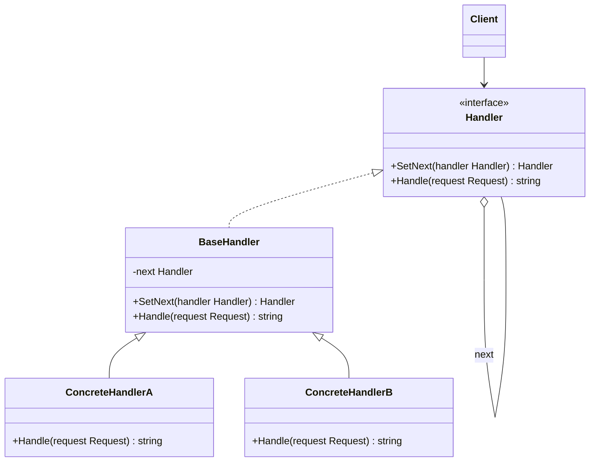

# Chain of Responsibility / 責任鏈模式

## Intent / 意圖
> 將請求沿著處理者鏈傳遞，讓多個物件都有機會處理該請求，避免請求的發送者與接收者之間的耦合。

## Problem / 問題情境
在一個客服系統中，客戶的問題需要根據嚴重程度由不同層級的人員處理：一般問題由客服人員處理、技術問題由工程師處理、緊急問題由主管處理。如果在呼叫端用大量 if-else 判斷該交給誰，會導致呼叫端與所有處理者高度耦合，新增處理層級時必須修改呼叫端程式碼。

## Solution / 解決方案
將每個處理者封裝為獨立物件，每個處理者持有「下一個處理者」的參照。收到請求時，處理者可以選擇自己處理或將請求轉交給下一個處理者。客戶端只需將請求送給鏈的第一個處理者即可，不需要知道最終由誰處理。

## Structure / 結構



## Participants / 參與者
- **Handler**：定義處理請求的介面，以及設定下一個處理者的方法。
- **BaseHandler**（可選）：提供預設的「轉交給下一個處理者」行為。
- **ConcreteHandler**：實作具體的處理邏輯，決定自己處理或轉交。
- **Client**：建構處理者鏈，將請求發送到鏈的起點。

## Go 實作

```go
package main

import "fmt"

// Request 代表客服請求
type Request struct {
	Level   int    // 1: 一般, 2: 技術, 3: 緊急
	Content string
}

// Handler 定義處理者介面
type Handler interface {
	SetNext(handler Handler) Handler
	Handle(req Request) string
}

// BaseHandler 提供預設的鏈式轉交邏輯
type BaseHandler struct {
	next Handler
}

func (b *BaseHandler) SetNext(handler Handler) Handler {
	b.next = handler
	return handler
}

func (b *BaseHandler) Handle(req Request) string {
	if b.next != nil {
		return b.next.Handle(req)
	}
	return "沒有處理者能處理此請求"
}

// SupportAgent 客服人員：處理一般問題
type SupportAgent struct {
	BaseHandler
}

func (s *SupportAgent) Handle(req Request) string {
	if req.Level == 1 {
		return fmt.Sprintf("[客服人員] 處理一般問題: %s", req.Content)
	}
	return s.BaseHandler.Handle(req)
}

// Engineer 工程師：處理技術問題
type Engineer struct {
	BaseHandler
}

func (e *Engineer) Handle(req Request) string {
	if req.Level == 2 {
		return fmt.Sprintf("[工程師] 處理技術問題: %s", req.Content)
	}
	return e.BaseHandler.Handle(req)
}

// Manager 主管：處理緊急問題
type Manager struct {
	BaseHandler
}

func (m *Manager) Handle(req Request) string {
	if req.Level == 3 {
		return fmt.Sprintf("[主管] 處理緊急問題: %s", req.Content)
	}
	return m.BaseHandler.Handle(req)
}

func main() {
	// 建構責任鏈：客服 -> 工程師 -> 主管
	support := &SupportAgent{}
	engineer := &Engineer{}
	manager := &Manager{}

	support.SetNext(engineer).SetNext(manager)

	requests := []Request{
		{Level: 1, Content: "如何重設密碼"},
		{Level: 2, Content: "API 回傳 500 錯誤"},
		{Level: 3, Content: "系統全面當機"},
		{Level: 4, Content: "外星人入侵"},
	}

	for _, req := range requests {
		fmt.Println(support.Handle(req))
	}
}

// Output:
// [客服人員] 處理一般問題: 如何重設密碼
// [工程師] 處理技術問題: API 回傳 500 錯誤
// [主管] 處理緊急問題: 系統全面當機
// 沒有處理者能處理此請求
```

## Rust 實作

```rust
use std::fmt;

#[derive(Debug)]
struct Request {
    level: u8, // 1: 一般, 2: 技術, 3: 緊急
    content: String,
}

impl Request {
    fn new(level: u8, content: &str) -> Self {
        Self {
            level,
            content: content.to_string(),
        }
    }
}

// 使用 linked closures 實作責任鏈
type HandlerFn = Box<dyn Fn(&Request) -> String>;

fn support_agent(next: HandlerFn) -> HandlerFn {
    Box::new(move |req: &Request| {
        if req.level == 1 {
            format!("[客服人員] 處理一般問題: {}", req.content)
        } else {
            next(req)
        }
    })
}

fn engineer(next: HandlerFn) -> HandlerFn {
    Box::new(move |req: &Request| {
        if req.level == 2 {
            format!("[工程師] 處理技術問題: {}", req.content)
        } else {
            next(req)
        }
    })
}

fn manager(next: HandlerFn) -> HandlerFn {
    Box::new(move |req: &Request| {
        if req.level == 3 {
            format!("[主管] 處理緊急問題: {}", req.content)
        } else {
            next(req)
        }
    })
}

fn default_handler() -> HandlerFn {
    Box::new(|_req: &Request| "沒有處理者能處理此請求".to_string())
}

fn main() {
    // 從末端開始組裝：default <- manager <- engineer <- support
    let chain = support_agent(engineer(manager(default_handler())));

    let requests = vec![
        Request::new(1, "如何重設密碼"),
        Request::new(2, "API 回傳 500 錯誤"),
        Request::new(3, "系統全面當機"),
        Request::new(4, "外星人入侵"),
    ];

    for req in &requests {
        println!("{}", chain(req));
    }
}

// Output:
// [客服人員] 處理一般問題: 如何重設密碼
// [工程師] 處理技術問題: API 回傳 500 錯誤
// [主管] 處理緊急問題: 系統全面當機
// 沒有處理者能處理此請求
```

## Go vs Rust 對照表

| 面向 | Go | Rust |
|------|----|----|
| 鏈結構 | interface + embedded struct，手動設定 next 指標 | linked closures，函式組合形成鏈 |
| 多型機制 | interface 搭配 struct embedding 模擬繼承 | 高階函式 + `Box<dyn Fn>` trait object |
| 記憶體管理 | GC 自動回收，鏈中的循環參照不需擔心 | 所有權明確，closure 持有下一層的 Box |
| 擴展方式 | 新增 struct 實作 Handler interface | 新增 handler 函式，組合進鏈中 |

## When to Use / 適用場景
- 多個物件都可能處理同一請求，且處理者在執行時期動態決定。
- 需要按順序嘗試多種處理策略（如 middleware pipeline、日誌過濾器）。
- 想要解耦請求發送者與具體處理者。

## When NOT to Use / 不適用場景
- 每個請求都有明確的唯一處理者，不需要鏈式查找。
- 處理邏輯非常簡單，引入責任鏈反而增加複雜度。

## Real-World Examples / 真實世界案例
- **Go `net/http` middleware**：HTTP handler 透過 `func(http.Handler) http.Handler` 形成 middleware 鏈，每一層可以決定是否呼叫 `next.ServeHTTP()`。
- **Rust `tower` crate**：Service 和 Layer 抽象即為典型的責任鏈模式，用於 HTTP middleware、gRPC interceptor 等。

## Related Patterns / 相關模式
- [Command](14_command.md)：Command 可以作為 Chain of Responsibility 中傳遞的請求物件。
- [Mediator](16_mediator.md)：Mediator 集中管理通訊，而 Chain of Responsibility 讓處理者自行決定是否轉交。

## Pitfalls / 常見陷阱
- **請求未被處理**：如果鏈中沒有任何處理者能處理請求，且沒有預設處理者，請求會被靜默丟棄。務必在鏈尾提供 fallback。
- **鏈過長導致效能問題**：每個請求都要從頭走到適當的處理者，如果鏈很長且大多數請求都在尾端處理，會造成不必要的遍歷。
- **除錯困難**：請求經過多個處理者，追蹤哪個處理者實際處理了請求需要額外的日誌機制。

## References / 參考資料
- *Design Patterns: Elements of Reusable Object-Oriented Software* — GoF
- *Head First Design Patterns* — Freeman & Robson
- [Refactoring Guru — Chain of Responsibility](https://refactoring.guru/design-patterns/chain-of-responsibility)
