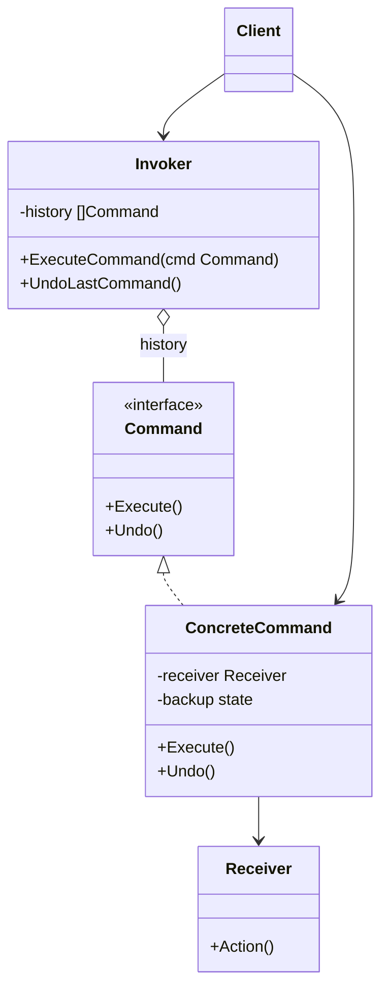

# Command / 命令模式

## Intent / 意圖
> 將請求封裝為物件，讓你可以用不同的請求參數化客戶端、將請求排入佇列、記錄日誌，以及支援可撤銷的操作。

## Problem / 問題情境
在一個文字編輯器中，使用者可以透過選單、快捷鍵、工具列按鈕執行相同的操作（如複製、貼上、撤銷）。如果每個 UI 元件直接呼叫業務邏輯，會導致 UI 層與業務邏輯緊密耦合，且撤銷功能難以實現，因為操作的歷史紀錄無處存放。

## Solution / 解決方案
將每個操作封裝為獨立的命令物件，命令物件包含執行操作所需的全部資訊。UI 元件只需觸發命令物件的 Execute 方法，不需知道具體業務邏輯。透過保存已執行的命令歷史，即可輕鬆實現撤銷（Undo）功能。

## Structure / 結構



## Participants / 參與者
- **Command**：宣告執行操作的介面。
- **ConcreteCommand**：綁定 Receiver 與具體操作，實作 Execute 和 Undo。
- **Receiver**：知道如何執行實際業務邏輯的物件。
- **Invoker**：持有命令並觸發執行，管理命令歷史。
- **Client**：建立具體命令並設定其 Receiver。

## Go 實作

```go
package main

import "fmt"

// Editor 是 Receiver，持有文字內容
type Editor struct {
	content string
}

func (e *Editor) InsertText(text string) {
	e.content += text
}

func (e *Editor) DeleteLast(n int) {
	if n > len(e.content) {
		n = len(e.content)
	}
	e.content = e.content[:len(e.content)-n]
}

func (e *Editor) Content() string {
	return e.content
}

// Command 介面
type Command interface {
	Execute()
	Undo()
}

// InsertCommand 插入文字命令
type InsertCommand struct {
	editor *Editor
	text   string
}

func (c *InsertCommand) Execute() {
	c.editor.InsertText(c.text)
}

func (c *InsertCommand) Undo() {
	c.editor.DeleteLast(len(c.text))
}

// Invoker 管理命令歷史
type CommandHistory struct {
	history []Command
}

func (h *CommandHistory) Execute(cmd Command) {
	cmd.Execute()
	h.history = append(h.history, cmd)
}

func (h *CommandHistory) Undo() {
	if len(h.history) == 0 {
		fmt.Println("Nothing to undo")
		return
	}
	last := h.history[len(h.history)-1]
	h.history = h.history[:len(h.history)-1]
	last.Undo()
}

func main() {
	editor := &Editor{}
	history := &CommandHistory{}

	// 執行一系列命令
	history.Execute(&InsertCommand{editor: editor, text: "Hello"})
	fmt.Printf("After insert 'Hello': %q\n", editor.Content())

	history.Execute(&InsertCommand{editor: editor, text: ", World"})
	fmt.Printf("After insert ', World': %q\n", editor.Content())

	history.Execute(&InsertCommand{editor: editor, text: "!"})
	fmt.Printf("After insert '!': %q\n", editor.Content())

	// 撤銷
	history.Undo()
	fmt.Printf("After undo: %q\n", editor.Content())

	history.Undo()
	fmt.Printf("After undo: %q\n", editor.Content())
}

// Output:
// After insert 'Hello': "Hello"
// After insert ', World': "Hello, World"
// After insert '!': "Hello, World!"
// After undo: "Hello, World"
// After undo: "Hello"
```

## Rust 實作

```rust
// Command 模式：使用 trait object 與 enum dispatch 兩種方式展示

// --- 使用 trait object ---

trait Command {
    fn execute(&mut self);
    fn undo(&mut self);
}

#[derive(Clone)]
struct Editor {
    content: String,
}

impl Editor {
    fn new() -> Self {
        Self {
            content: String::new(),
        }
    }

    fn insert_text(&mut self, text: &str) {
        self.content.push_str(text);
    }

    fn delete_last(&mut self, n: usize) {
        let new_len = self.content.len().saturating_sub(n);
        self.content.truncate(new_len);
    }

    fn content(&self) -> &str {
        &self.content
    }
}

struct InsertCommand<'a> {
    editor: &'a mut Editor,
    text: String,
}

// 因為 Rust 的借用規則，同時持有多個 &mut 不可行。
// 實務上常用 Rc<RefCell<T>> 或 enum dispatch 替代。
// 這裡改用 enum dispatch 展示更地道的 Rust 做法。

#[derive(Debug, Clone)]
enum EditorCommand {
    Insert(String),
}

struct EditorInvoker {
    editor: Editor,
    history: Vec<EditorCommand>,
}

impl EditorInvoker {
    fn new() -> Self {
        Self {
            editor: Editor::new(),
            history: Vec::new(),
        }
    }

    fn execute(&mut self, cmd: EditorCommand) {
        match &cmd {
            EditorCommand::Insert(text) => {
                self.editor.insert_text(text);
            }
        }
        self.history.push(cmd);
    }

    fn undo(&mut self) {
        if let Some(cmd) = self.history.pop() {
            match &cmd {
                EditorCommand::Insert(text) => {
                    self.editor.delete_last(text.len());
                }
            }
        } else {
            println!("Nothing to undo");
        }
    }

    fn content(&self) -> &str {
        self.editor.content()
    }
}

fn main() {
    let mut invoker = EditorInvoker::new();

    invoker.execute(EditorCommand::Insert("Hello".to_string()));
    println!("After insert 'Hello': {:?}", invoker.content());

    invoker.execute(EditorCommand::Insert(", World".to_string()));
    println!("After insert ', World': {:?}", invoker.content());

    invoker.execute(EditorCommand::Insert("!".to_string()));
    println!("After insert '!': {:?}", invoker.content());

    invoker.undo();
    println!("After undo: {:?}", invoker.content());

    invoker.undo();
    println!("After undo: {:?}", invoker.content());
}

// Output:
// After insert 'Hello': "Hello"
// After insert ', World': "Hello, World"
// After insert '!': "Hello, World!"
// After undo: "Hello, World"
// After undo: "Hello"
```

## Go vs Rust 對照表

| 面向 | Go | Rust |
|------|----|----|
| 命令抽象 | `Command` interface 搭配 closure 或 struct | enum dispatch 或 `Box<dyn Command>` trait object |
| 撤銷資料 | struct 內儲存 backup 狀態 | enum variant 內攜帶撤銷資訊，或用 Clone 快照 |
| 借用問題 | 指標自由傳遞，GC 管理 | 需注意 `&mut` 獨佔借用，常用 `Rc<RefCell<T>>` 或將 Receiver 內嵌於 Invoker |
| 命令序列化 | 可用 JSON marshaling | 可用 serde 序列化 enum |

## When to Use / 適用場景
- 需要支援撤銷/重做（Undo/Redo）功能。
- 需要將操作排入佇列、排程或遠端執行。
- 需要記錄操作日誌以便稽核或重播。

## When NOT to Use / 不適用場景
- 操作非常簡單且不需要撤銷，直接呼叫方法即可。
- 命令數量極少且固定，封裝為物件反而增加不必要的抽象層。

## Real-World Examples / 真實世界案例
- **Go `database/sql`**：`Tx`（Transaction）物件封裝了一系列資料庫操作，可以 Commit 或 Rollback，概念上類似 Command 模式。
- **Rust `std::process::Command`**：封裝了系統命令的參數和環境，呼叫 `.spawn()` 或 `.output()` 執行。

## Related Patterns / 相關模式
- [Memento](17_memento.md)：Memento 儲存狀態快照，常與 Command 搭配實作撤銷功能。
- [Strategy](20_strategy.md)：兩者都封裝演算法，但 Command 強調操作的延遲執行與撤銷，Strategy 強調演算法的替換。
- [Chain of Responsibility](13_chain_of_responsibility.md)：可以將 Command 物件沿著責任鏈傳遞。

## Pitfalls / 常見陷阱
- **命令物件膨脹**：每個操作都建立命令物件，如果操作頻率很高（如每次按鍵），歷史佇列可能佔用大量記憶體。需設定歷史上限。
- **Undo 的複雜性**：某些操作（如刪除檔案、發送網路請求）難以真正撤銷，需要仔細設計補償邏輯。
- **命令與 Receiver 的生命週期**：在 Rust 中，命令持有 Receiver 的參照會導致借用衝突，需用 `Rc<RefCell<T>>` 或將 Receiver 整合進 Invoker。

## References / 參考資料
- *Design Patterns: Elements of Reusable Object-Oriented Software* — GoF
- *Head First Design Patterns* — Freeman & Robson
- [Refactoring Guru — Command](https://refactoring.guru/design-patterns/command)
