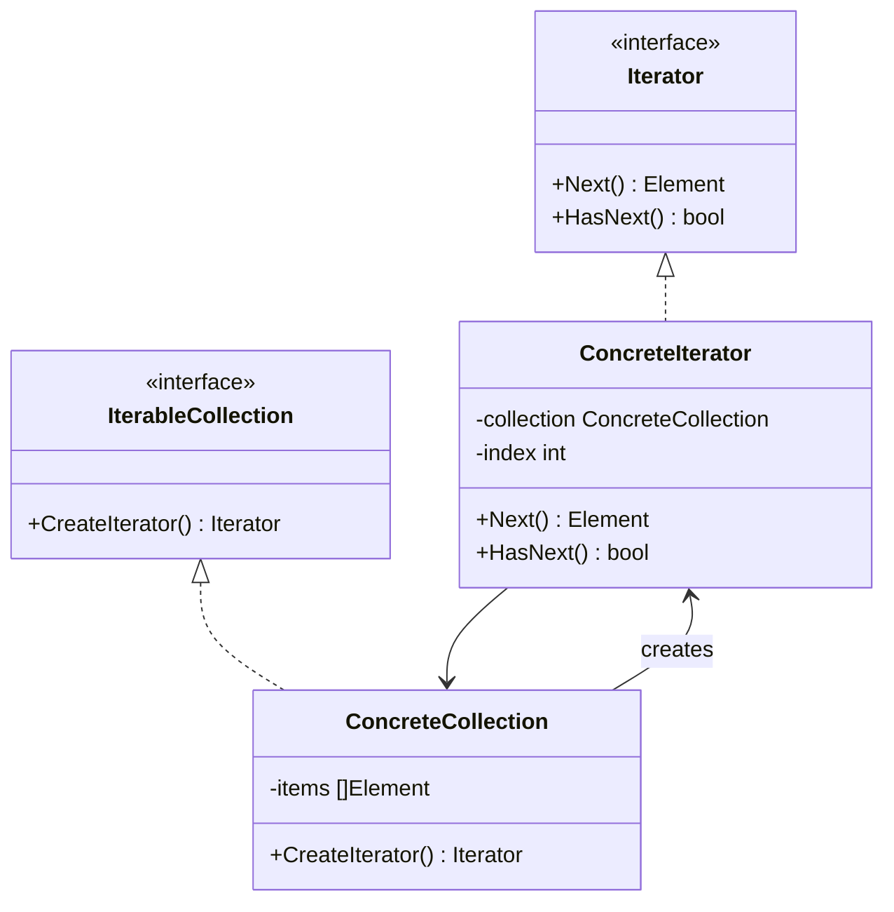

# Iterator / 迭代器模式

## Intent / 意圖
> 提供一種方法依序存取聚合物件中的各個元素，而不需暴露其內部表示方式。

## Problem / 問題情境
在一個社群平台中，使用者的好友清單可能儲存在不同的資料結構中（陣列、鏈結串列、圖）。如果直接暴露內部結構讓外部遍歷，一旦更換資料結構就會破壞所有使用端的程式碼。此外，可能需要多種遍歷方式（如依名稱排序、依最近互動排序），這些邏輯不應該放在集合類別裡。

## Solution / 解決方案
將遍歷邏輯抽取到獨立的迭代器物件中。迭代器提供統一的存取介面（如 `Next()`、`HasNext()`），集合物件只需提供建立迭代器的工廠方法。不同的遍歷策略由不同的迭代器實作負責。

## Structure / 結構



## Participants / 參與者
- **Iterator**：定義存取和遍歷元素的介面。
- **ConcreteIterator**：實作 Iterator 介面，追蹤遍歷的當前位置。
- **IterableCollection**：定義建立 Iterator 的介面。
- **ConcreteCollection**：實作建立 ConcreteIterator 的方法，持有實際資料。

## Go 實作

```go
package main

import "fmt"

// User 代表社群平台的使用者
type User struct {
	Name     string
	Age      int
	IsOnline bool
}

// UserIterator 定義迭代器介面
type UserIterator interface {
	HasNext() bool
	Next() *User
}

// UserCollection 定義可迭代集合的介面
type UserCollection interface {
	CreateIterator() UserIterator
	CreateOnlineIterator() UserIterator
}

// UserList 具體集合
type UserList struct {
	users []*User
}

func (ul *UserList) AddUser(u *User) {
	ul.users = append(ul.users, u)
}

func (ul *UserList) CreateIterator() UserIterator {
	return &AllUsersIterator{users: ul.users, index: 0}
}

func (ul *UserList) CreateOnlineIterator() UserIterator {
	return &OnlineUsersIterator{users: ul.users, index: 0}
}

// AllUsersIterator 遍歷所有使用者
type AllUsersIterator struct {
	users []*User
	index int
}

func (it *AllUsersIterator) HasNext() bool {
	return it.index < len(it.users)
}

func (it *AllUsersIterator) Next() *User {
	if !it.HasNext() {
		return nil
	}
	user := it.users[it.index]
	it.index++
	return user
}

// OnlineUsersIterator 只遍歷在線使用者
type OnlineUsersIterator struct {
	users []*User
	index int
}

func (it *OnlineUsersIterator) HasNext() bool {
	for it.index < len(it.users) {
		if it.users[it.index].IsOnline {
			return true
		}
		it.index++
	}
	return false
}

func (it *OnlineUsersIterator) Next() *User {
	if !it.HasNext() {
		return nil
	}
	user := it.users[it.index]
	it.index++
	return user
}

// channel-based iterator（Go 慣用法）
func ChannelIterator(users []*User) <-chan *User {
	ch := make(chan *User)
	go func() {
		defer close(ch)
		for _, u := range users {
			ch <- u
		}
	}()
	return ch
}

func main() {
	list := &UserList{}
	list.AddUser(&User{Name: "Alice", Age: 30, IsOnline: true})
	list.AddUser(&User{Name: "Bob", Age: 25, IsOnline: false})
	list.AddUser(&User{Name: "Charlie", Age: 35, IsOnline: true})
	list.AddUser(&User{Name: "Diana", Age: 28, IsOnline: false})

	// 遍歷所有使用者
	fmt.Println("=== All Users ===")
	it := list.CreateIterator()
	for it.HasNext() {
		u := it.Next()
		fmt.Printf("  %s (age %d)\n", u.Name, u.Age)
	}

	// 遍歷在線使用者
	fmt.Println("=== Online Users ===")
	onlineIt := list.CreateOnlineIterator()
	for onlineIt.HasNext() {
		u := onlineIt.Next()
		fmt.Printf("  %s (age %d)\n", u.Name, u.Age)
	}

	// Channel-based iterator
	fmt.Println("=== Channel Iterator ===")
	for u := range ChannelIterator(list.users) {
		fmt.Printf("  %s (online: %v)\n", u.Name, u.IsOnline)
	}
}

// Output:
// === All Users ===
//   Alice (age 30)
//   Bob (age 25)
//   Charlie (age 35)
//   Diana (age 28)
// === Online Users ===
//   Alice (age 30)
//   Charlie (age 35)
// === Channel Iterator ===
//   Alice (online: true)
//   Bob (online: false)
//   Charlie (online: true)
//   Diana (online: false)
```

## Rust 實作

```rust
// Rust 的 std::iter::Iterator trait 是語言內建的迭代器模式

#[derive(Debug, Clone)]
struct User {
    name: String,
    age: u32,
    is_online: bool,
}

impl User {
    fn new(name: &str, age: u32, is_online: bool) -> Self {
        Self {
            name: name.to_string(),
            age,
            is_online,
        }
    }
}

struct UserCollection {
    users: Vec<User>,
}

impl UserCollection {
    fn new() -> Self {
        Self { users: Vec::new() }
    }

    fn add(&mut self, user: User) {
        self.users.push(user);
    }

    // 回傳所有使用者的迭代器
    fn iter(&self) -> std::slice::Iter<'_, User> {
        self.users.iter()
    }

    // 回傳在線使用者的 filter 迭代器
    fn online_iter(&self) -> impl Iterator<Item = &User> {
        self.users.iter().filter(|u| u.is_online)
    }
}

// 自訂迭代器：每隔 N 個元素取一個
struct StepIterator<'a> {
    users: &'a [User],
    index: usize,
    step: usize,
}

impl<'a> StepIterator<'a> {
    fn new(users: &'a [User], step: usize) -> Self {
        Self {
            users,
            index: 0,
            step,
        }
    }
}

impl<'a> Iterator for StepIterator<'a> {
    type Item = &'a User;

    fn next(&mut self) -> Option<Self::Item> {
        if self.index < self.users.len() {
            let user = &self.users[self.index];
            self.index += self.step;
            Some(user)
        } else {
            None
        }
    }
}

fn main() {
    let mut collection = UserCollection::new();
    collection.add(User::new("Alice", 30, true));
    collection.add(User::new("Bob", 25, false));
    collection.add(User::new("Charlie", 35, true));
    collection.add(User::new("Diana", 28, false));

    // 遍歷所有使用者
    println!("=== All Users ===");
    for user in collection.iter() {
        println!("  {} (age {})", user.name, user.age);
    }

    // 遍歷在線使用者（利用 Iterator combinators）
    println!("=== Online Users ===");
    for user in collection.online_iter() {
        println!("  {} (age {})", user.name, user.age);
    }

    // 自訂 StepIterator
    println!("=== Step Iterator (every 2nd) ===");
    let step_iter = StepIterator::new(&collection.users, 2);
    for user in step_iter {
        println!("  {} (online: {})", user.name, user.is_online);
    }

    // 展示 Iterator trait 的強大 combinator
    println!("=== Average age of online users ===");
    let online_ages: Vec<u32> = collection
        .online_iter()
        .map(|u| u.age)
        .collect();
    let avg = online_ages.iter().sum::<u32>() as f64 / online_ages.len() as f64;
    println!("  {:.1}", avg);
}

// Output:
// === All Users ===
//   Alice (age 30)
//   Bob (age 25)
//   Charlie (age 35)
//   Diana (age 28)
// === Online Users ===
//   Alice (age 30)
//   Charlie (age 35)
// === Step Iterator (every 2nd) ===
//   Alice (online: true)
//   Charlie (online: true)
// === Average age of online users ===
//   32.5
```

## Go vs Rust 對照表

| 面向 | Go | Rust |
|------|----|----|
| 迭代器介面 | 自訂 `HasNext()/Next()` interface 或 channel-based | 實作 `std::iter::Iterator` trait 的 `next()` 方法 |
| 惰性求值 | channel 天然支援 lazy evaluation | Iterator trait 預設 lazy，呼叫 `.collect()` 才消耗 |
| 組合能力 | 需要手動實作 filter/map | 內建 `.map()`, `.filter()`, `.take()`, `.zip()` 等豐富 combinator |
| 並行迭代 | 搭配 goroutine + channel 很自然 | 搭配 `rayon` crate 的 `.par_iter()` |

## When to Use / 適用場景
- 需要統一遍歷不同資料結構的介面。
- 需要對同一集合提供多種遍歷方式（如過濾、排序、步進）。
- 需要惰性求值以節省記憶體（處理大量資料時不一次載入全部）。

## When NOT to Use / 不適用場景
- 集合非常簡單且只有一種遍歷方式，直接用 for-range 即可。
- 需要隨機存取而非順序存取，迭代器模式不適合。

## Real-World Examples / 真實世界案例
- **Rust `std::iter::Iterator`**：Rust 標準庫的核心 trait，所有集合型別（`Vec`, `HashMap`, `BTreeSet` 等）都實作了 `IntoIterator`。
- **Go `bufio.Scanner`**：透過 `Scan()` + `Text()` 提供逐行讀取的迭代器模式。
- **Go `database/sql.Rows`**：透過 `Next()` + `Scan()` 遍歷查詢結果。

## Related Patterns / 相關模式
- [Visitor](22_visitor.md)：Visitor 在遍歷集合時對每個元素執行操作，常搭配 Iterator 使用。
- [Composite](../structural/08_composite.md)：Composite 結構通常需要 Iterator 來遍歷其樹狀層級。

## Pitfalls / 常見陷阱
- **在迭代過程中修改集合**：Go 中修改 slice 或 map 會導致未定義行為，Rust 的借用規則直接禁止這樣做。
- **Channel-based iterator 的 goroutine leak**：Go 中如果消費端提前停止接收，生產端的 goroutine 會永遠阻塞。應使用 `context.Context` 來控制取消。
- **忘記消耗迭代器**：Rust 的 lazy iterator 不消耗就不執行，忘記 `.collect()` 或 `for` 迴圈會導致副作用不發生。

## References / 參考資料
- *Design Patterns: Elements of Reusable Object-Oriented Software* — GoF
- [Rust by Example — Iterator](https://doc.rust-lang.org/rust-by-example/trait/iter.html)
- [Refactoring Guru — Iterator](https://refactoring.guru/design-patterns/iterator)
