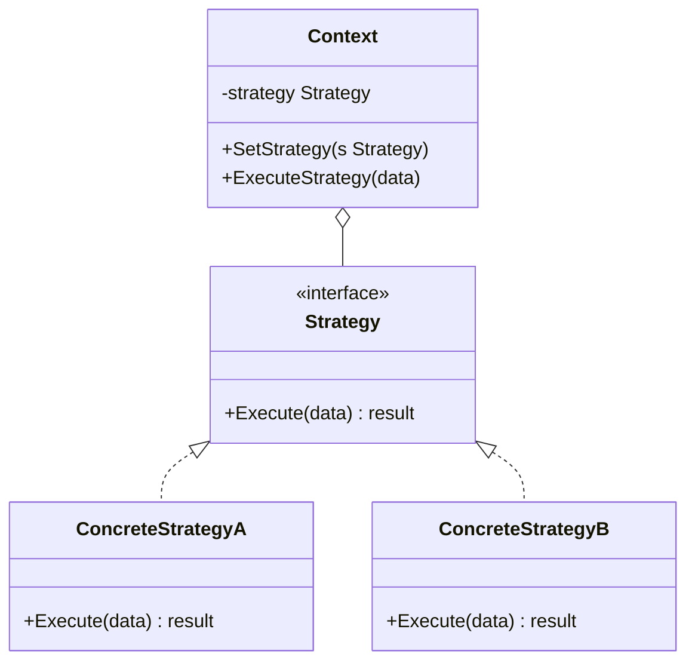

# Strategy / 策略模式

## Intent / 意圖
> 定義一系列演算法，將每個演算法封裝起來，使它們可以互相替換，讓演算法的變化獨立於使用它的客戶端。

## Problem / 問題情境
在一個電商系統中，訂單金額的計算需要根據不同的折扣策略（一般折扣、會員折扣、節日促銷、滿額折扣）來套用。如果在結帳函式中用 switch-case 判斷折扣類型，每新增一種折扣策略就要修改結帳邏輯，違反開閉原則。

## Solution / 解決方案
將每種折扣策略封裝為獨立的物件或函式，定義統一的計算介面。結帳函式接收一個策略物件作為參數，將折扣計算委派給策略。新增折扣策略只需建立新的策略物件，不需修改結帳邏輯。

## Structure / 結構



## Participants / 參與者
- **Strategy**：定義演算法的共同介面。
- **ConcreteStrategy**：實作特定的演算法。
- **Context**：持有一個 Strategy 參照，將工作委派給 Strategy。

## Go 實作

```go
package main

import "fmt"

// DiscountStrategy 定義折扣策略介面
type DiscountStrategy interface {
	Calculate(amount float64) float64
	Name() string
}

// 也可以用 func 類型作為 Strategy（Go 慣用法）
type DiscountFunc func(amount float64) float64

// --- 具體策略 ---

// NoDiscount 無折扣
type NoDiscount struct{}

func (d *NoDiscount) Calculate(amount float64) float64 { return amount }
func (d *NoDiscount) Name() string                     { return "無折扣" }

// PercentageDiscount 百分比折扣
type PercentageDiscount struct {
	Percent float64
}

func (d *PercentageDiscount) Calculate(amount float64) float64 {
	return amount * (1 - d.Percent/100)
}

func (d *PercentageDiscount) Name() string {
	return fmt.Sprintf("%.0f%% 折扣", d.Percent)
}

// ThresholdDiscount 滿額折扣
type ThresholdDiscount struct {
	Threshold float64
	Reduction float64
}

func (d *ThresholdDiscount) Calculate(amount float64) float64 {
	if amount >= d.Threshold {
		return amount - d.Reduction
	}
	return amount
}

func (d *ThresholdDiscount) Name() string {
	return fmt.Sprintf("滿 %.0f 折 %.0f", d.Threshold, d.Reduction)
}

// Order 是 Context
type Order struct {
	items    []string
	subtotal float64
	discount DiscountStrategy
}

func NewOrder(items []string, subtotal float64) *Order {
	return &Order{
		items:    items,
		subtotal: subtotal,
		discount: &NoDiscount{}, // 預設無折扣
	}
}

func (o *Order) SetDiscount(d DiscountStrategy) {
	o.discount = d
}

func (o *Order) Total() float64 {
	return o.discount.Calculate(o.subtotal)
}

func (o *Order) Print() {
	fmt.Printf("訂單: %v\n", o.items)
	fmt.Printf("  小計: $%.2f\n", o.subtotal)
	fmt.Printf("  折扣: %s\n", o.discount.Name())
	fmt.Printf("  合計: $%.2f\n", o.Total())
}

// 使用 func parameter 的版本（更簡潔的 Go 風格）
func CalculateWithFunc(amount float64, strategy DiscountFunc) float64 {
	return strategy(amount)
}

func main() {
	order := NewOrder([]string{"筆電", "滑鼠"}, 1500.0)

	fmt.Println("=== 無折扣 ===")
	order.Print()

	fmt.Println("\n=== 會員 10% 折扣 ===")
	order.SetDiscount(&PercentageDiscount{Percent: 10})
	order.Print()

	fmt.Println("\n=== 滿 1000 折 200 ===")
	order.SetDiscount(&ThresholdDiscount{Threshold: 1000, Reduction: 200})
	order.Print()

	// 使用 func parameter 的簡潔版
	fmt.Println("\n=== Func-based Strategy ===")
	vipDiscount := func(amount float64) float64 {
		return amount * 0.8 // VIP 八折
	}
	result := CalculateWithFunc(1500, vipDiscount)
	fmt.Printf("VIP 折扣後: $%.2f\n", result)
}

// Output:
// === 無折扣 ===
// 訂單: [筆電 滑鼠]
//   小計: $1500.00
//   折扣: 無折扣
//   合計: $1500.00
//
// === 會員 10% 折扣 ===
// 訂單: [筆電 滑鼠]
//   小計: $1500.00
//   折扣: 10% 折扣
//   合計: $1350.00
//
// === 滿 1000 折 200 ===
// 訂單: [筆電 滑鼠]
//   小計: $1500.00
//   折扣: 滿 1000 折 200
//   合計: $1300.00
//
// === Func-based Strategy ===
// VIP 折扣後: $1200.00
```

## Rust 實作

```rust
// Strategy 模式：展示 trait object 與 generic 兩種方式

// --- Trait object 版本 ---

trait DiscountStrategy {
    fn calculate(&self, amount: f64) -> f64;
    fn name(&self) -> String;
}

struct NoDiscount;

impl DiscountStrategy for NoDiscount {
    fn calculate(&self, amount: f64) -> f64 {
        amount
    }
    fn name(&self) -> String {
        "無折扣".to_string()
    }
}

struct PercentageDiscount {
    percent: f64,
}

impl DiscountStrategy for PercentageDiscount {
    fn calculate(&self, amount: f64) -> f64 {
        amount * (1.0 - self.percent / 100.0)
    }
    fn name(&self) -> String {
        format!("{:.0}% 折扣", self.percent)
    }
}

struct ThresholdDiscount {
    threshold: f64,
    reduction: f64,
}

impl DiscountStrategy for ThresholdDiscount {
    fn calculate(&self, amount: f64) -> f64 {
        if amount >= self.threshold {
            amount - self.reduction
        } else {
            amount
        }
    }
    fn name(&self) -> String {
        format!("滿 {:.0} 折 {:.0}", self.threshold, self.reduction)
    }
}

// Context 使用 trait object（動態分派）
struct Order {
    items: Vec<String>,
    subtotal: f64,
    discount: Box<dyn DiscountStrategy>,
}

impl Order {
    fn new(items: Vec<&str>, subtotal: f64) -> Self {
        Self {
            items: items.into_iter().map(String::from).collect(),
            subtotal,
            discount: Box::new(NoDiscount),
        }
    }

    fn set_discount(&mut self, discount: Box<dyn DiscountStrategy>) {
        self.discount = discount;
    }

    fn total(&self) -> f64 {
        self.discount.calculate(self.subtotal)
    }

    fn print(&self) {
        println!("訂單: {:?}", self.items);
        println!("  小計: ${:.2}", self.subtotal);
        println!("  折扣: {}", self.discount.name());
        println!("  合計: ${:.2}", self.total());
    }
}

// --- Generic 版本（靜態分派，zero-cost）---

fn calculate_with_strategy<S: DiscountStrategy>(amount: f64, strategy: &S) -> f64 {
    strategy.calculate(amount)
}

// --- Closure 版本 ---

fn calculate_with_fn(amount: f64, strategy: impl Fn(f64) -> f64) -> f64 {
    strategy(amount)
}

fn main() {
    let mut order = Order::new(vec!["筆電", "滑鼠"], 1500.0);

    println!("=== 無折扣 ===");
    order.print();

    println!("\n=== 會員 10% 折扣 ===");
    order.set_discount(Box::new(PercentageDiscount { percent: 10.0 }));
    order.print();

    println!("\n=== 滿 1000 折 200 ===");
    order.set_discount(Box::new(ThresholdDiscount {
        threshold: 1000.0,
        reduction: 200.0,
    }));
    order.print();

    // Generic 靜態分派
    println!("\n=== Generic Strategy ===");
    let discount = PercentageDiscount { percent: 15.0 };
    let result = calculate_with_strategy(1500.0, &discount);
    println!("{} 後: ${:.2}", discount.name(), result);

    // Closure 版本
    println!("\n=== Closure Strategy ===");
    let vip_discount = |amount: f64| amount * 0.8;
    let result = calculate_with_fn(1500.0, vip_discount);
    println!("VIP 折扣後: ${:.2}", result);
}

// Output:
// === 無折扣 ===
// 訂單: ["筆電", "滑鼠"]
//   小計: $1500.00
//   折扣: 無折扣
//   合計: $1500.00
//
// === 會員 10% 折扣 ===
// 訂單: ["筆電", "滑鼠"]
//   小計: $1500.00
//   折扣: 10% 折扣
//   合計: $1350.00
//
// === 滿 1000 折 200 ===
// 訂單: ["筆電", "滑鼠"]
//   小計: $1500.00
//   折扣: 滿 1000 折 200
//   合計: $1300.00
//
// === Generic Strategy ===
// 15% 折扣 後: $1275.00
//
// === Closure Strategy ===
// VIP 折扣後: $1200.00
```

## Go vs Rust 對照表

| 面向 | Go | Rust |
|------|----|----|
| 策略抽象 | interface 或 `func` 類型 | trait object (`Box<dyn T>`) 或 generic (`impl T`) |
| 動態/靜態分派 | 皆為動態分派（interface） | `Box<dyn T>` 動態分派；generic `T: Trait` 靜態分派（monomorphization） |
| Closure 支援 | 一等公民 `func` 可直接當策略 | closure 實作 `Fn` trait，可直接當策略 |
| 效能 | interface 呼叫有間接成本 | generic 版本 zero-cost，與直接呼叫等效 |

## When to Use / 適用場景
- 需要在執行時期動態切換演算法。
- 有多種演算法只在行為細節上有差異，其他邏輯都相同。
- 想要避免條件判斷來選擇演算法。

## When NOT to Use / 不適用場景
- 演算法數量很少且不太可能變動，直接 if-else 更簡潔。
- 客戶端不需要知道不同策略的存在（此時可能更適合用 Template Method）。

## Real-World Examples / 真實世界案例
- **Go `sort.Interface`**：透過實作 `Len()`, `Less()`, `Swap()` 三個方法，可以對任意資料型別使用不同的排序策略。
- **Rust `Iterator::collect()`**：collect 的具體收集策略由目標型別決定（`Vec`, `HashMap`, `String` 等），是泛型 Strategy 的經典範例。

## Related Patterns / 相關模式
- [State](19_state.md)：State 的結構與 Strategy 幾乎相同，但 State 讓狀態物件自行決定轉換，Strategy 由客戶端選擇。
- [Template Method](21_template_method.md)：Template Method 用繼承改變演算法的部分步驟，Strategy 用組合替換整個演算法。
- [Bridge](../structural/07_bridge.md)：Bridge 也使用組合分離抽象與實作，但目的是解耦維度而非替換演算法。

## Pitfalls / 常見陷阱
- **策略過多導致類別爆炸**：每個策略一個 struct/class 可能產生大量小型類別。可考慮用 closure 或函式指標簡化。
- **客戶端必須了解不同策略**：客戶端需要知道每種策略的特性才能正確選擇，這可能將複雜度從 Context 轉移到客戶端。可用 Factory 封裝策略的建立。
- **策略之間的資料共享**：如果不同策略需要不同的輸入參數，統一的介面可能不夠用，導致介面過度泛化。

## References / 參考資料
- *Design Patterns: Elements of Reusable Object-Oriented Software* — GoF
- *Head First Design Patterns* — Freeman & Robson
- [Refactoring Guru — Strategy](https://refactoring.guru/design-patterns/strategy)
