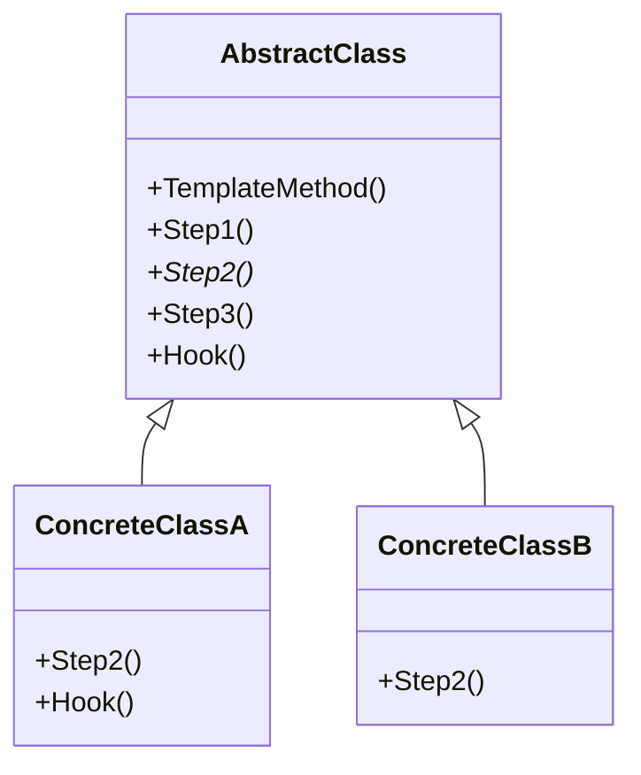

# Template Method / 模板方法模式

## Intent / 意圖
> 在父類別中定義演算法的骨架，將某些步驟延遲到子類別中實作，讓子類別可以在不改變演算法結構的前提下重新定義某些步驟。

## Problem / 問題情境
在一個資料匯出系統中，匯出 CSV 和匯出 JSON 的流程幾乎相同：連接資料來源、查詢資料、格式化輸出、寫入檔案。唯一的差異是格式化步驟。如果兩種匯出各自實作完整流程，會產生大量重複程式碼，且流程變更時需要同步修改兩處。

## Solution / 解決方案
在基礎類別中定義匯出流程的骨架（template method），其中格式化步驟宣告為抽象方法。子類別只需實作格式化步驟，不需關心其他共用邏輯。流程的順序和共用邏輯由基礎類別控制。

## Structure / 結構



## Participants / 參與者
- **AbstractClass**：定義 template method（演算法骨架），包含共用步驟和抽象步驟。
- **ConcreteClass**：實作抽象步驟，可選擇覆寫 hook 方法。
- **Hook**（可選）：在 AbstractClass 中有預設實作的步驟，子類別可以選擇性覆寫。

## Go 實作

```go
package main

import (
	"fmt"
	"strings"
)

// DataExporter 定義需要子類別實作的步驟
type DataExporter interface {
	FormatHeader(columns []string) string
	FormatRow(row map[string]string, columns []string) string
	FormatFooter(totalRows int) string
}

// ExportPipeline 是 template method 的骨架
// Go 沒有繼承，用 embedded interface 模擬
func ExportPipeline(exporter DataExporter, data []map[string]string, columns []string) string {
	var result strings.Builder

	// Step 1: 格式化標頭
	result.WriteString(exporter.FormatHeader(columns))
	result.WriteString("\n")

	// Step 2: 格式化每一列資料
	for _, row := range data {
		result.WriteString(exporter.FormatRow(row, columns))
		result.WriteString("\n")
	}

	// Step 3: 格式化結尾
	footer := exporter.FormatFooter(len(data))
	if footer != "" {
		result.WriteString(footer)
		result.WriteString("\n")
	}

	return result.String()
}

// CSVExporter 實作 CSV 格式匯出
type CSVExporter struct{}

func (e *CSVExporter) FormatHeader(columns []string) string {
	return strings.Join(columns, ",")
}

func (e *CSVExporter) FormatRow(row map[string]string, columns []string) string {
	values := make([]string, len(columns))
	for i, col := range columns {
		values[i] = row[col]
	}
	return strings.Join(values, ",")
}

func (e *CSVExporter) FormatFooter(totalRows int) string {
	return "" // CSV 沒有 footer
}

// JSONExporter 實作 JSON 格式匯出
type JSONExporter struct{}

func (e *JSONExporter) FormatHeader(columns []string) string {
	return "["
}

func (e *JSONExporter) FormatRow(row map[string]string, columns []string) string {
	pairs := make([]string, 0, len(columns))
	for _, col := range columns {
		pairs = append(pairs, fmt.Sprintf(`  "%s": "%s"`, col, row[col]))
	}
	return "  {" + strings.Join(pairs, ", ") + "}"
}

func (e *JSONExporter) FormatFooter(totalRows int) string {
	return fmt.Sprintf("]\n// Total: %d records", totalRows)
}

// MarkdownExporter 實作 Markdown 表格匯出
type MarkdownExporter struct{}

func (e *MarkdownExporter) FormatHeader(columns []string) string {
	header := "| " + strings.Join(columns, " | ") + " |"
	separator := "|"
	for range columns {
		separator += " --- |"
	}
	return header + "\n" + separator
}

func (e *MarkdownExporter) FormatRow(row map[string]string, columns []string) string {
	values := make([]string, len(columns))
	for i, col := range columns {
		values[i] = row[col]
	}
	return "| " + strings.Join(values, " | ") + " |"
}

func (e *MarkdownExporter) FormatFooter(totalRows int) string {
	return fmt.Sprintf("\n*共 %d 筆資料*", totalRows)
}

func main() {
	data := []map[string]string{
		{"name": "Alice", "age": "30", "city": "Taipei"},
		{"name": "Bob", "age": "25", "city": "Tokyo"},
		{"name": "Charlie", "age": "35", "city": "Seoul"},
	}
	columns := []string{"name", "age", "city"}

	fmt.Println("=== CSV Export ===")
	fmt.Print(ExportPipeline(&CSVExporter{}, data, columns))

	fmt.Println("\n=== JSON Export ===")
	fmt.Print(ExportPipeline(&JSONExporter{}, data, columns))

	fmt.Println("\n=== Markdown Export ===")
	fmt.Print(ExportPipeline(&MarkdownExporter{}, data, columns))
}

// Output:
// === CSV Export ===
// name,age,city
// Alice,30,Taipei
// Bob,25,Tokyo
// Charlie,35,Seoul
//
// === JSON Export ===
// [
//   {"name": "Alice", "age": "30", "city": "Taipei"}
//   {"name": "Bob", "age": "25", "city": "Tokyo"}
//   {"name": "Charlie", "age": "35", "city": "Seoul"}
// ]
// // Total: 3 records
//
// === Markdown Export ===
// | name | age | city |
// | --- | --- | --- |
// | Alice | 30 | Taipei |
// | Bob | 25 | Tokyo |
// | Charlie | 35 | Seoul |
//
// *共 3 筆資料*
```

## Rust 實作

```rust
// Template Method 在 Rust 中使用 default trait method 實作

trait DataExporter {
    fn format_header(&self, columns: &[&str]) -> String;
    fn format_row(&self, row: &[(&str, &str)], columns: &[&str]) -> String;

    // Hook: 有預設實作，子類別可覆寫
    fn format_footer(&self, _total_rows: usize) -> Option<String> {
        None
    }

    // Template method: 定義演算法骨架
    fn export(&self, data: &[Vec<(&str, &str)>], columns: &[&str]) -> String {
        let mut result = String::new();

        // Step 1: Header
        result.push_str(&self.format_header(columns));
        result.push('\n');

        // Step 2: Rows
        for row in data {
            result.push_str(&self.format_row(row, columns));
            result.push('\n');
        }

        // Step 3: Footer (hook)
        if let Some(footer) = self.format_footer(data.len()) {
            result.push_str(&footer);
            result.push('\n');
        }

        result
    }
}

struct CsvExporter;

impl DataExporter for CsvExporter {
    fn format_header(&self, columns: &[&str]) -> String {
        columns.join(",")
    }

    fn format_row(&self, row: &[(&str, &str)], columns: &[&str]) -> String {
        columns
            .iter()
            .map(|col| {
                row.iter()
                    .find(|(k, _)| k == col)
                    .map(|(_, v)| *v)
                    .unwrap_or("")
            })
            .collect::<Vec<_>>()
            .join(",")
    }
    // format_footer 使用預設實作（None）
}

struct JsonExporter;

impl DataExporter for JsonExporter {
    fn format_header(&self, _columns: &[&str]) -> String {
        "[".to_string()
    }

    fn format_row(&self, row: &[(&str, &str)], columns: &[&str]) -> String {
        let pairs: Vec<String> = columns
            .iter()
            .filter_map(|col| {
                row.iter()
                    .find(|(k, _)| k == col)
                    .map(|(k, v)| format!("  \"{}\": \"{}\"", k, v))
            })
            .collect();
        format!("  {{{}}}", pairs.join(", "))
    }

    fn format_footer(&self, total_rows: usize) -> Option<String> {
        Some(format!("]\n// Total: {} records", total_rows))
    }
}

struct MarkdownExporter;

impl DataExporter for MarkdownExporter {
    fn format_header(&self, columns: &[&str]) -> String {
        let header = format!("| {} |", columns.join(" | "));
        let separator: String = columns.iter().map(|_| " --- ").collect::<Vec<_>>().join("|");
        format!("{}\n|{}|", header, separator)
    }

    fn format_row(&self, row: &[(&str, &str)], columns: &[&str]) -> String {
        let values: Vec<&str> = columns
            .iter()
            .map(|col| {
                row.iter()
                    .find(|(k, _)| k == col)
                    .map(|(_, v)| *v)
                    .unwrap_or("")
            })
            .collect();
        format!("| {} |", values.join(" | "))
    }

    fn format_footer(&self, total_rows: usize) -> Option<String> {
        Some(format!("\n*共 {} 筆資料*", total_rows))
    }
}

fn main() {
    let data = vec![
        vec![("name", "Alice"), ("age", "30"), ("city", "Taipei")],
        vec![("name", "Bob"), ("age", "25"), ("city", "Tokyo")],
        vec![("name", "Charlie"), ("age", "35"), ("city", "Seoul")],
    ];
    let columns = &["name", "age", "city"];

    println!("=== CSV Export ===");
    print!("{}", CsvExporter.export(&data, columns));

    println!("\n=== JSON Export ===");
    print!("{}", JsonExporter.export(&data, columns));

    println!("\n=== Markdown Export ===");
    print!("{}", MarkdownExporter.export(&data, columns));
}

// Output:
// === CSV Export ===
// name,age,city
// Alice,30,Taipei
// Bob,25,Tokyo
// Charlie,35,Seoul
//
// === JSON Export ===
// [
//   {"name": "Alice", "age": "30", "city": "Taipei"}
//   {"name": "Bob", "age": "25", "city": "Tokyo"}
//   {"name": "Charlie", "age": "35", "city": "Seoul"}
// ]
// // Total: 3 records
//
// === Markdown Export ===
// | name | age | city |
// | --- | --- | --- |
// | Alice | 30 | Taipei |
// | Bob | 25 | Tokyo |
// | Charlie | 35 | Seoul |
//
// *共 3 筆資料*
```

## Go vs Rust 對照表

| 面向 | Go | Rust |
|------|----|----|
| 模板方法 | 獨立函式接收 interface 參數 | trait 的 default method |
| 抽象步驟 | interface 的必要方法 | trait 的必要方法（無 default body） |
| Hook 方法 | 可在 interface 外提供預設行為，但較不直觀 | trait 的 default method 天然支援 |
| 繼承 | 無繼承，用 interface + 組合模擬 | 無繼承，trait default method 是最接近的機制 |

## When to Use / 適用場景
- 多個類別的演算法結構相同，只有個別步驟不同。
- 想要控制子類別的擴展點，只允許覆寫特定步驟。
- 需要在演算法流程中插入 hook（如 before/after 處理）。

## When NOT to Use / 不適用場景
- 子類別需要改變演算法的整體結構，而非僅覆寫個別步驟。
- 步驟之間沒有固定順序，應改用 Strategy 組合不同行為。

## Real-World Examples / 真實世界案例
- **Go `sort.Sort()`**：`sort.Sort()` 定義排序演算法骨架，使用者只需實作 `sort.Interface`（`Len`, `Less`, `Swap`）的具體步驟。
- **Rust `Iterator` trait**：只需實作 `next()` 方法，即可免費獲得 `map()`, `filter()`, `fold()` 等數十個 default method。

## Related Patterns / 相關模式
- [Strategy](20_strategy.md)：Strategy 用組合替換整個演算法，Template Method 用覆寫改變部分步驟。Strategy 在執行時期切換，Template Method 在編譯時期決定。
- [Factory Method](../creational/03_factory_method.md)：Factory Method 是 Template Method 的特例，專門用於建立物件的步驟。

## Pitfalls / 常見陷阱
- **Liskov 替換原則違反**：子類別覆寫 hook 時改變了模板方法的預期行為，可能導致非預期的副作用。
- **過度使用 hook**：太多可覆寫的 hook 會讓基礎類別變得難以理解，子類別也不知道該覆寫哪些。
- **Go 的模擬限制**：Go 沒有繼承，template method 通常實作為接收 interface 的函式，這與傳統 OOP 的做法不同，但更符合 Go 的組合哲學。

## References / 參考資料
- *Design Patterns: Elements of Reusable Object-Oriented Software* — GoF
- [Refactoring Guru — Template Method](https://refactoring.guru/design-patterns/template-method)
