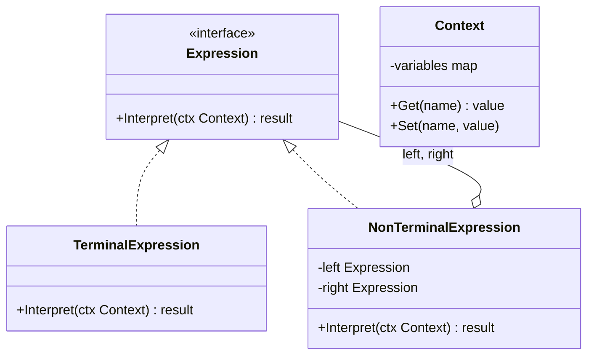

# Interpreter / 解譯器模式

## Intent / 意圖
> 給定一個語言，定義其文法的一種表示方式，並定義一個解譯器來解譯該語言中的句子。

## Problem / 問題情境
在一個規則引擎中，業務人員需要用簡單的表達式來定義規則，例如 `age > 18 AND status == "active"`。如果每種規則組合都硬編碼，規則數量會爆炸性增長。需要一種方式讓使用者自由組合條件，系統能動態解析和執行這些表達式。

## Solution / 解決方案
將表達式定義為一棵語法樹（AST），每個節點代表文法中的一個規則。終端表達式（Terminal Expression）代表最基本的元素（如常數、變數），非終端表達式（Non-terminal Expression）代表運算子（如 AND、OR、比較）。透過遞迴地解譯語法樹來執行表達式。

## Structure / 結構



## Participants / 參與者
- **Expression**：宣告解譯操作的介面。
- **TerminalExpression**：實作與文法中終端符號相關的解譯操作（如變數、常數）。
- **NonTerminalExpression**：實作與文法中非終端符號相關的解譯操作（如 AND、OR、加減乘除）。
- **Context**：包含解譯器需要的全域資訊（如變數值）。

## Go 實作

```go
package main

import (
	"fmt"
	"strconv"
	"strings"
)

// Expression 介面：所有表達式都可以被 Interpret
type Expression interface {
	Interpret(ctx map[string]interface{}) interface{}
	String() string
}

// --- Terminal Expressions ---

// NumberLiteral 數字常數
type NumberLiteral struct {
	Value float64
}

func (n *NumberLiteral) Interpret(ctx map[string]interface{}) interface{} {
	return n.Value
}

func (n *NumberLiteral) String() string {
	return strconv.FormatFloat(n.Value, 'f', -1, 64)
}

// StringLiteral 字串常數
type StringLiteral struct {
	Value string
}

func (s *StringLiteral) Interpret(ctx map[string]interface{}) interface{} {
	return s.Value
}

func (s *StringLiteral) String() string {
	return fmt.Sprintf("%q", s.Value)
}

// Variable 變數參照
type Variable struct {
	Name string
}

func (v *Variable) Interpret(ctx map[string]interface{}) interface{} {
	return ctx[v.Name]
}

func (v *Variable) String() string {
	return v.Name
}

// --- Non-terminal Expressions ---

// Comparison 比較運算
type Comparison struct {
	Left     Expression
	Operator string // ">", "<", "==", "!="
	Right    Expression
}

func (c *Comparison) Interpret(ctx map[string]interface{}) interface{} {
	left := c.Left.Interpret(ctx)
	right := c.Right.Interpret(ctx)

	switch c.Operator {
	case ">":
		return toFloat(left) > toFloat(right)
	case "<":
		return toFloat(left) < toFloat(right)
	case ">=":
		return toFloat(left) >= toFloat(right)
	case "==":
		return fmt.Sprintf("%v", left) == fmt.Sprintf("%v", right)
	case "!=":
		return fmt.Sprintf("%v", left) != fmt.Sprintf("%v", right)
	}
	return false
}

func (c *Comparison) String() string {
	return fmt.Sprintf("(%s %s %s)", c.Left, c.Operator, c.Right)
}

// AndExpression 邏輯 AND
type AndExpression struct {
	Left  Expression
	Right Expression
}

func (a *AndExpression) Interpret(ctx map[string]interface{}) interface{} {
	left := a.Left.Interpret(ctx).(bool)
	right := a.Right.Interpret(ctx).(bool)
	return left && right
}

func (a *AndExpression) String() string {
	return fmt.Sprintf("(%s AND %s)", a.Left, a.Right)
}

// OrExpression 邏輯 OR
type OrExpression struct {
	Left  Expression
	Right Expression
}

func (o *OrExpression) Interpret(ctx map[string]interface{}) interface{} {
	left := o.Left.Interpret(ctx).(bool)
	right := o.Right.Interpret(ctx).(bool)
	return left || right
}

func (o *OrExpression) String() string {
	return fmt.Sprintf("(%s OR %s)", o.Left, o.Right)
}

// NotExpression 邏輯 NOT
type NotExpression struct {
	Expr Expression
}

func (n *NotExpression) Interpret(ctx map[string]interface{}) interface{} {
	return !n.Expr.Interpret(ctx).(bool)
}

func (n *NotExpression) String() string {
	return fmt.Sprintf("NOT(%s)", n.Expr)
}

func toFloat(v interface{}) float64 {
	switch val := v.(type) {
	case float64:
		return val
	case int:
		return float64(val)
	default:
		return 0
	}
}

func main() {
	// 建構表達式: age > 18 AND (status == "active" OR role == "admin")
	expr := &AndExpression{
		Left: &Comparison{
			Left:     &Variable{Name: "age"},
			Operator: ">",
			Right:    &NumberLiteral{Value: 18},
		},
		Right: &OrExpression{
			Left: &Comparison{
				Left:     &Variable{Name: "status"},
				Operator: "==",
				Right:    &StringLiteral{Value: "active"},
			},
			Right: &Comparison{
				Left:     &Variable{Name: "role"},
				Operator: "==",
				Right:    &StringLiteral{Value: "admin"},
			},
		},
	}

	fmt.Printf("Expression: %s\n\n", expr)

	// 測試不同的 context
	contexts := []map[string]interface{}{
		{"age": 25.0, "status": "active", "role": "user"},
		{"age": 16.0, "status": "active", "role": "user"},
		{"age": 30.0, "status": "inactive", "role": "admin"},
		{"age": 15.0, "status": "inactive", "role": "user"},
	}

	for _, ctx := range contexts {
		result := expr.Interpret(ctx)
		fmt.Printf("Context: %v => %v\n", ctx, result)
	}

	_ = strings.TrimSpace // suppress unused import
}

// Output:
// Expression: ((age > 18) AND ((status == "active") OR (role == "admin")))
//
// Context: map[age:25 role:user status:active] => true
// Context: map[age:16 role:user status:active] => false
// Context: map[age:30 role:admin status:inactive] => true
// Context: map[age:15 role:user status:inactive] => false
```

## Rust 實作

```rust
use std::collections::HashMap;
use std::fmt;

// 使用 enum AST 表示所有表達式類型
#[derive(Debug, Clone)]
enum Value {
    Number(f64),
    Str(String),
    Bool(bool),
}

impl fmt::Display for Value {
    fn fmt(&self, f: &mut fmt::Formatter<'_>) -> fmt::Result {
        match self {
            Value::Number(n) => write!(f, "{}", n),
            Value::Str(s) => write!(f, "{}", s),
            Value::Bool(b) => write!(f, "{}", b),
        }
    }
}

#[derive(Debug, Clone)]
enum Expr {
    // Terminal expressions
    NumberLit(f64),
    StringLit(String),
    Var(String),

    // Non-terminal expressions
    Compare {
        left: Box<Expr>,
        op: CompareOp,
        right: Box<Expr>,
    },
    And(Box<Expr>, Box<Expr>),
    Or(Box<Expr>, Box<Expr>),
    Not(Box<Expr>),
}

#[derive(Debug, Clone)]
enum CompareOp {
    Gt,
    Lt,
    Eq,
    Neq,
    Gte,
}

impl fmt::Display for CompareOp {
    fn fmt(&self, f: &mut fmt::Formatter<'_>) -> fmt::Result {
        match self {
            CompareOp::Gt => write!(f, ">"),
            CompareOp::Lt => write!(f, "<"),
            CompareOp::Eq => write!(f, "=="),
            CompareOp::Neq => write!(f, "!="),
            CompareOp::Gte => write!(f, ">="),
        }
    }
}

impl fmt::Display for Expr {
    fn fmt(&self, f: &mut fmt::Formatter<'_>) -> fmt::Result {
        match self {
            Expr::NumberLit(n) => write!(f, "{}", n),
            Expr::StringLit(s) => write!(f, "\"{}\"", s),
            Expr::Var(name) => write!(f, "{}", name),
            Expr::Compare { left, op, right } => {
                write!(f, "({} {} {})", left, op, right)
            }
            Expr::And(l, r) => write!(f, "({} AND {})", l, r),
            Expr::Or(l, r) => write!(f, "({} OR {})", l, r),
            Expr::Not(e) => write!(f, "NOT({})", e),
        }
    }
}

type Context = HashMap<String, Value>;

fn interpret(expr: &Expr, ctx: &Context) -> Value {
    match expr {
        Expr::NumberLit(n) => Value::Number(*n),
        Expr::StringLit(s) => Value::Str(s.clone()),
        Expr::Var(name) => ctx
            .get(name)
            .cloned()
            .unwrap_or(Value::Bool(false)),

        Expr::Compare { left, op, right } => {
            let lval = interpret(left, ctx);
            let rval = interpret(right, ctx);

            let result = match op {
                CompareOp::Gt => as_number(&lval) > as_number(&rval),
                CompareOp::Lt => as_number(&lval) < as_number(&rval),
                CompareOp::Gte => as_number(&lval) >= as_number(&rval),
                CompareOp::Eq => format!("{}", lval) == format!("{}", rval),
                CompareOp::Neq => format!("{}", lval) != format!("{}", rval),
            };
            Value::Bool(result)
        }

        Expr::And(left, right) => {
            let l = as_bool(&interpret(left, ctx));
            let r = as_bool(&interpret(right, ctx));
            Value::Bool(l && r)
        }

        Expr::Or(left, right) => {
            let l = as_bool(&interpret(left, ctx));
            let r = as_bool(&interpret(right, ctx));
            Value::Bool(l || r)
        }

        Expr::Not(inner) => {
            let val = as_bool(&interpret(inner, ctx));
            Value::Bool(!val)
        }
    }
}

fn as_number(v: &Value) -> f64 {
    match v {
        Value::Number(n) => *n,
        _ => 0.0,
    }
}

fn as_bool(v: &Value) -> bool {
    match v {
        Value::Bool(b) => *b,
        _ => false,
    }
}

fn main() {
    // 建構 AST: age > 18 AND (status == "active" OR role == "admin")
    let expr = Expr::And(
        Box::new(Expr::Compare {
            left: Box::new(Expr::Var("age".into())),
            op: CompareOp::Gt,
            right: Box::new(Expr::NumberLit(18.0)),
        }),
        Box::new(Expr::Or(
            Box::new(Expr::Compare {
                left: Box::new(Expr::Var("status".into())),
                op: CompareOp::Eq,
                right: Box::new(Expr::StringLit("active".into())),
            }),
            Box::new(Expr::Compare {
                left: Box::new(Expr::Var("role".into())),
                op: CompareOp::Eq,
                right: Box::new(Expr::StringLit("admin".into())),
            }),
        )),
    );

    println!("Expression: {}\n", expr);

    // 測試不同的 context
    let contexts: Vec<Context> = vec![
        HashMap::from([
            ("age".into(), Value::Number(25.0)),
            ("status".into(), Value::Str("active".into())),
            ("role".into(), Value::Str("user".into())),
        ]),
        HashMap::from([
            ("age".into(), Value::Number(16.0)),
            ("status".into(), Value::Str("active".into())),
            ("role".into(), Value::Str("user".into())),
        ]),
        HashMap::from([
            ("age".into(), Value::Number(30.0)),
            ("status".into(), Value::Str("inactive".into())),
            ("role".into(), Value::Str("admin".into())),
        ]),
        HashMap::from([
            ("age".into(), Value::Number(15.0)),
            ("status".into(), Value::Str("inactive".into())),
            ("role".into(), Value::Str("user".into())),
        ]),
    ];

    for ctx in &contexts {
        let result = interpret(&expr, ctx);
        let display_ctx: Vec<String> = ctx
            .iter()
            .map(|(k, v)| format!("{}: {}", k, v))
            .collect();
        println!("Context: {{{}}} => {}", display_ctx.join(", "), result);
    }
}

// Output:
// Expression: ((age > 18) AND ((status == "active") OR (role == "admin")))
//
// Context: {age: 25, status: active, role: user} => true
// Context: {age: 16, status: active, role: user} => false
// Context: {age: 30, status: inactive, role: admin} => true
// Context: {age: 15, status: inactive, role: user} => false
```

## Go vs Rust 對照表

| 面向 | Go | Rust |
|------|----|----|
| AST 表示 | recursive interface，每個節點是 struct 實作 Expression | enum AST，每個 variant 代表一種節點 |
| 遞迴解譯 | 透過 interface method dispatch | 透過 match 表達式遞迴 |
| 型別安全 | `interface{}` 需要 runtime type assertion | enum `Value` 編譯期型別安全 |
| 擴展性 | 新增 Expression struct 實作 interface（開放） | 新增 enum variant，需修改所有 match（封閉） |

## When to Use / 適用場景
- 需要解析和執行簡單的領域特定語言（DSL）。
- 文法規則簡單且不常改變。
- 需要動態組合規則（如查詢條件、權限規則、驗證規則）。

## When NOT to Use / 不適用場景
- 文法非常複雜（如完整的程式語言），應使用 parser generator（如 ANTLR、pest）。
- 效能要求極高，遞迴解譯器比編譯型方案慢很多。

## Real-World Examples / 真實世界案例
- **Go `regexp` 套件**：正規表達式引擎內部將 regex 編譯為 AST，然後解譯執行。
- **Rust `pest` crate**：PEG parser generator，雖然比基本的 Interpreter 模式更進階，但核心概念相同 — 將語法規則表示為可解譯的結構。
- **SQL WHERE clause**：SQL 的 WHERE 子句解析器就是一個典型的 Interpreter 模式應用。

## Related Patterns / 相關模式
- [Composite](../structural/08_composite.md)：AST 本身就是 Composite 結構，Terminal 是 Leaf，Non-terminal 是 Composite。
- [Visitor](22_visitor.md)：可以用 Visitor 對 AST 執行不同的操作（如解譯、優化、序列化）。
- [Flyweight](../structural/11_flyweight.md)：Terminal Expression 通常可以共享（如相同的變數名稱），適合用 Flyweight 優化。

## Pitfalls / 常見陷阱
- **效能問題**：遞迴解譯每次執行都重新走訪整棵樹，對於高頻執行的規則應考慮編譯成更高效的表示（如 bytecode）。
- **文法演化困難**：一旦文法確定，修改語法規則可能需要重構整個 AST 和解譯器。
- **錯誤處理薄弱**：基本的 Interpreter 模式缺乏位置資訊和友善的錯誤訊息，生產環境需額外投入大量工作在錯誤報告上。

## References / 參考資料
- *Design Patterns: Elements of Reusable Object-Oriented Software* — GoF
- *Crafting Interpreters* — Robert Nystrom (https://craftinginterpreters.com/)
- [Refactoring Guru — Interpreter](https://refactoring.guru/design-patterns/interpreter)
