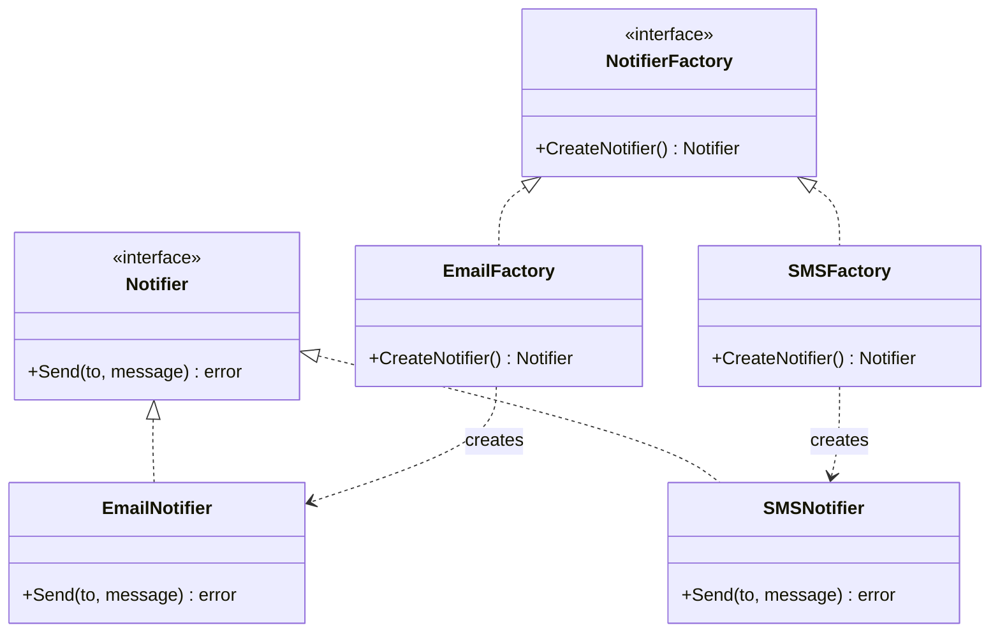

# Factory Method / 工廠方法模式

## Intent / 意圖
> 定義一個建立物件的介面，但讓子類別（或實作者）決定要實例化哪個具體類別，將物件建立邏輯從使用端解耦。

## Problem / 問題情境
你正在開發一個通知系統，需要支援 Email、SMS、Push 等多種通知管道。如果在業務邏輯中直接 `new EmailNotifier()` 或 `new SMSNotifier()`，每次新增管道都要修改現有程式碼，違反開放封閉原則（OCP）。你需要一種方式讓呼叫端只依賴「通知」的抽象介面，而具體建構哪種通知由外部決定。

## Solution / 解決方案
定義一個 Creator 介面（或抽象基底），其中包含一個 Factory Method 負責回傳 Product 介面。具體的 Creator 實作各自決定建立哪一種 Product。呼叫端只與 Creator 和 Product 的抽象介面互動，不需知道具體類別。Go 慣用方式為 interface + constructor function（`func NewXxx() Notifier`）；Rust 慣用方式為 trait + 各 struct 的 `impl` 或關聯函式。

## Structure / 結構



## Participants / 參與者

| 角色 | 職責 |
|------|------|
| Product (Notifier) | 定義產品的抽象介面 |
| ConcreteProduct (EmailNotifier, SMSNotifier) | 實作具體產品邏輯 |
| Creator (NotifierFactory) | 宣告 Factory Method，回傳 Product 介面 |
| ConcreteCreator (EmailFactory, SMSFactory) | 實作 Factory Method，決定建立哪個 ConcreteProduct |

## Go 實作

```go
package main

import "fmt"

// --- Product interface ---

type Notifier interface {
	Send(to, message string) string
}

// --- Concrete Products ---

type EmailNotifier struct{}

func (e *EmailNotifier) Send(to, message string) string {
	return fmt.Sprintf("[Email] To: %s, Message: %s", to, message)
}

type SMSNotifier struct{}

func (s *SMSNotifier) Send(to, message string) string {
	return fmt.Sprintf("[SMS] To: %s, Message: %s", to, message)
}

// --- Creator interface ---

type NotifierFactory interface {
	CreateNotifier() Notifier
}

// --- Concrete Creators ---

type EmailFactory struct{}

func (f *EmailFactory) CreateNotifier() Notifier {
	return &EmailNotifier{}
}

type SMSFactory struct{}

func (f *SMSFactory) CreateNotifier() Notifier {
	return &SMSNotifier{}
}

// --- Client code ---

func sendNotification(factory NotifierFactory, to, message string) {
	notifier := factory.CreateNotifier()
	result := notifier.Send(to, message)
	fmt.Println(result)
}

func main() {
	sendNotification(&EmailFactory{}, "alice@example.com", "Hello from Factory Method")
	sendNotification(&SMSFactory{}, "+886912345678", "Hello from Factory Method")
}

// Output:
// [Email] To: alice@example.com, Message: Hello from Factory Method
// [SMS] To: +886912345678, Message: Hello from Factory Method
```

## Rust 實作

```rust
// --- Product trait ---

trait Notifier {
    fn send(&self, to: &str, message: &str) -> String;
}

// --- Concrete Products ---

struct EmailNotifier;

impl Notifier for EmailNotifier {
    fn send(&self, to: &str, message: &str) -> String {
        format!("[Email] To: {to}, Message: {message}")
    }
}

struct SmsNotifier;

impl Notifier for SmsNotifier {
    fn send(&self, to: &str, message: &str) -> String {
        format!("[SMS] To: {to}, Message: {message}")
    }
}

// --- Creator trait ---

trait NotifierFactory {
    fn create_notifier(&self) -> Box<dyn Notifier>;
}

// --- Concrete Creators ---

struct EmailFactory;

impl NotifierFactory for EmailFactory {
    fn create_notifier(&self) -> Box<dyn Notifier> {
        Box::new(EmailNotifier)
    }
}

struct SmsFactory;

impl NotifierFactory for SmsFactory {
    fn create_notifier(&self) -> Box<dyn Notifier> {
        Box::new(SmsNotifier)
    }
}

// --- Client code ---

fn send_notification(factory: &dyn NotifierFactory, to: &str, message: &str) {
    let notifier = factory.create_notifier();
    let result = notifier.send(to, message);
    println!("{result}");
}

fn main() {
    send_notification(&EmailFactory, "alice@example.com", "Hello from Factory Method");
    send_notification(&SmsFactory, "+886912345678", "Hello from Factory Method");
}

// Output:
// [Email] To: alice@example.com, Message: Hello from Factory Method
// [SMS] To: +886912345678, Message: Hello from Factory Method
```

## Go vs Rust 對照表

| 面向 | Go | Rust |
|------|----|------|
| 抽象機制 | `interface` 隱式實作（duck typing） | `trait` 顯式 `impl`，編譯期檢查 |
| 回傳多型 | 回傳 interface 值（內含指標+vtable） | 回傳 `Box<dyn Trait>`（heap 配置 + vtable）或泛型 `impl Trait` |
| 零成本抽象 | interface 始終有間接呼叫開銷 | 泛型 `impl Trait` 可單態化（monomorphization），無 vtable 開銷 |
| 慣用替代 | 常簡化為 constructor function `func NewXxx() Notifier` | 常簡化為 associated function `Xxx::new()` 或 enum variant |
| 錯誤處理 | Factory Method 可回傳 `(Notifier, error)` | 可回傳 `Result<Box<dyn Notifier>, Error>` |

## When to Use / 適用場景

- 呼叫端只需依賴產品的抽象介面，不需知道具體實作類別（如外掛系統、驅動程式載入）。
- 需要在不修改現有程式碼的情況下擴充新的產品類型（OCP）。
- 產品的建構邏輯複雜且各產品差異大，適合分散到各自的 Factory。

## When NOT to Use / 不適用場景

- 產品類型固定且不太可能擴充 -- 直接用 constructor function 更簡單，不需要額外的 Factory 抽象。
- 建構邏輯極簡單（無參數或僅 1-2 個欄位）-- 過度使用 Factory Method 增加不必要的間接層。

## Real-World Examples / 真實世界案例

- **Go `net/http`**：`http.Handler` interface 就是一個 Product 抽象，`http.HandlerFunc` 是一種 ConcreteProduct。middleware 函式（如 `func loggingMiddleware(next http.Handler) http.Handler`）本質上就是 Factory Method，接收 Handler 回傳 Handler。
- **Rust `std::fs::File::open()`**：`File::open()` 是一個關聯函式（associated function），根據路徑建立 `File` 實例。雖然不是嚴格的 GoF Factory Method，但體現了「建構邏輯封裝在工廠函式」的精神。
- **Go `sql.Open(driverName, dataSourceName)`**：根據 `driverName` 字串查找已註冊的 driver 並建立 `*sql.DB`，是 Factory Method + Registry 的組合模式。

## Related Patterns / 相關模式

- [Abstract Factory](03_abstract_factory.md) -- Abstract Factory 是多個 Factory Method 的組合，用於建立一系列相關產品。
- [Singleton](01_singleton.md) -- Factory 本身可以是 Singleton，確保全域只有一個工廠。
- [Builder](04_builder.md) -- 當建構邏輯更複雜時（多步驟、多選項），可在 Factory Method 內部使用 Builder。

## Pitfalls / 常見陷阱

- **Go：interface 肥大化**。把太多方法塞進 Product interface 會導致每個 ConcreteProduct 都要實作一堆方法，違反 Interface Segregation Principle。Go 慣例是小介面（1-3 個方法），如 `io.Reader`、`io.Writer`。
- **Rust：不必要的 heap 配置**。回傳 `Box<dyn Trait>` 會在 heap 上配置，如果呼叫端在編譯期就知道具體型別，應改用泛型 `impl Trait` 避免動態分發開銷。
- **過度工程**。如果你的系統只有一兩種產品且不太可能擴充，引入 Factory 層只會增加複雜度。先用簡單的 constructor function，等到需要擴充時再重構為 Factory Method。

## References / 參考資料

- Gamma, E., Helm, R., Johnson, R., Vlissides, J. *Design Patterns: Elements of Reusable Object-Oriented Software*, 1994. Chapter 3: Creational Patterns — Factory Method.
- Go 官方 Effective Go — Interfaces：https://go.dev/doc/effective_go#interfaces
- Rust Book — Trait Objects：https://doc.rust-lang.org/book/ch18-02-trait-objects.html
