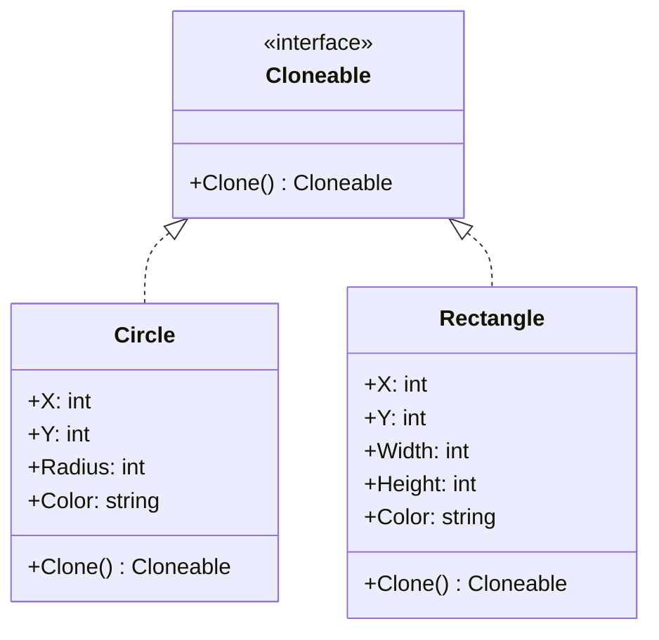

# Prototype / 原型模式

## Intent / 意圖
> 透過複製（clone）現有物件來建立新物件，避免依賴具體類別的建構邏輯。

## Problem / 問題情境
你正在開發一個文件編輯器，用戶可以建立各種形狀（圓形、矩形、三角形）。每種形狀的初始化涉及大量參數（座標、顏色、線條粗細、填充模式等），而且用戶經常需要「複製一個現有形狀，稍微調整位置後放到畫布上」。如果每次都重新呼叫建構函式並逐一設定所有參數，不僅繁瑣，也迫使呼叫端知道具體形狀類別。你需要一種方式讓任何形狀都能「自我複製」，呼叫端只需透過統一介面 `Clone()` 即可取得副本。

## Solution / 解決方案
讓每個可複製的物件實作一個 `Clone()` 方法（或 `Clone` trait），回傳自身的深拷貝。呼叫端持有 Prototype 介面的參照，不需知道具體型別就能複製物件。Go 沒有內建 Clone 機制，需手動實作深拷貝方法；Rust 的 `Clone` trait 是標準庫的核心 trait，可用 `#[derive(Clone)]` 自動生成。

## Structure / 結構



## Participants / 參與者

| 角色 | 職責 |
|------|------|
| Prototype (Cloneable) | 宣告 Clone 介面 |
| ConcretePrototype (Circle, Rectangle) | 實作 Clone 方法，回傳自身的深拷貝 |
| Client | 透過 Prototype 介面複製物件，不需知道具體類別 |

## Go 實作

```go
package main

import "fmt"

// Shape is the prototype interface.
type Shape interface {
	Clone() Shape
	Info() string
}

// Circle is a concrete prototype.
type Circle struct {
	X, Y   int
	Radius int
	Color  string
}

func (c *Circle) Clone() Shape {
	// Manual deep copy — every field is copied explicitly.
	return &Circle{
		X:      c.X,
		Y:      c.Y,
		Radius: c.Radius,
		Color:  c.Color,
	}
}

func (c *Circle) Info() string {
	return fmt.Sprintf("Circle{X:%d, Y:%d, Radius:%d, Color:%s}", c.X, c.Y, c.Radius, c.Color)
}

// Rectangle is a concrete prototype.
type Rectangle struct {
	X, Y          int
	Width, Height int
	Color         string
}

func (r *Rectangle) Clone() Shape {
	return &Rectangle{
		X:      r.X,
		Y:      r.Y,
		Width:  r.Width,
		Height: r.Height,
		Color:  r.Color,
	}
}

func (r *Rectangle) Info() string {
	return fmt.Sprintf("Rectangle{X:%d, Y:%d, W:%d, H:%d, Color:%s}", r.X, r.Y, r.Width, r.Height, r.Color)
}

// ShapeRegistry holds named prototypes for easy lookup and cloning.
type ShapeRegistry struct {
	shapes map[string]Shape
}

func NewShapeRegistry() *ShapeRegistry {
	return &ShapeRegistry{shapes: make(map[string]Shape)}
}

func (r *ShapeRegistry) Register(name string, shape Shape) {
	r.shapes[name] = shape
}

func (r *ShapeRegistry) Get(name string) (Shape, bool) {
	shape, ok := r.shapes[name]
	if !ok {
		return nil, false
	}
	return shape.Clone(), true
}

func main() {
	// Set up prototype registry
	registry := NewShapeRegistry()
	registry.Register("red-circle", &Circle{X: 0, Y: 0, Radius: 10, Color: "red"})
	registry.Register("blue-rect", &Rectangle{X: 0, Y: 0, Width: 20, Height: 10, Color: "blue"})

	// Clone from registry and customize
	shape1, _ := registry.Get("red-circle")
	circle1 := shape1.(*Circle)
	circle1.X = 100
	circle1.Y = 200
	fmt.Println(circle1.Info())

	shape2, _ := registry.Get("red-circle")
	circle2 := shape2.(*Circle)
	circle2.X = 300
	fmt.Println(circle2.Info())

	shape3, _ := registry.Get("blue-rect")
	fmt.Println(shape3.Info())

	// Verify original is untouched
	original, _ := registry.Get("red-circle")
	fmt.Println(original.Info())
}

// Output:
// Circle{X:100, Y:200, Radius:10, Color:red}
// Circle{X:300, Y:0, Radius:10, Color:red}
// Rectangle{X:0, Y:0, W:20, H:10, Color:blue}
// Circle{X:0, Y:0, Radius:10, Color:red}
```

## Rust 實作

```rust
use std::collections::HashMap;

// --- Prototype trait ---
// We need Clone + Info. In Rust, Clone is a standard trait.
// We add a custom trait for polymorphic cloning (clone_box).

trait Shape: ShapeClone {
    fn info(&self) -> String;
}

// Helper trait for cloning trait objects.
trait ShapeClone {
    fn clone_box(&self) -> Box<dyn Shape>;
}

impl<T: 'static + Shape + Clone> ShapeClone for T {
    fn clone_box(&self) -> Box<dyn Shape> {
        Box::new(self.clone())
    }
}

impl Clone for Box<dyn Shape> {
    fn clone(&self) -> Self {
        self.clone_box()
    }
}

// --- Concrete Prototypes ---

#[derive(Clone)]
struct Circle {
    x: i32,
    y: i32,
    radius: i32,
    color: String,
}

impl Shape for Circle {
    fn info(&self) -> String {
        format!(
            "Circle{{X:{}, Y:{}, Radius:{}, Color:{}}}",
            self.x, self.y, self.radius, self.color
        )
    }
}

#[derive(Clone)]
struct Rectangle {
    x: i32,
    y: i32,
    width: i32,
    height: i32,
    color: String,
}

impl Shape for Rectangle {
    fn info(&self) -> String {
        format!(
            "Rectangle{{X:{}, Y:{}, W:{}, H:{}, Color:{}}}",
            self.x, self.y, self.width, self.height, self.color
        )
    }
}

// --- Prototype Registry ---

struct ShapeRegistry {
    shapes: HashMap<String, Box<dyn Shape>>,
}

impl ShapeRegistry {
    fn new() -> Self {
        ShapeRegistry {
            shapes: HashMap::new(),
        }
    }

    fn register(&mut self, name: &str, shape: Box<dyn Shape>) {
        self.shapes.insert(name.to_string(), shape);
    }

    fn get(&self, name: &str) -> Option<Box<dyn Shape>> {
        self.shapes.get(name).map(|s| s.clone_box())
    }
}

fn main() {
    let mut registry = ShapeRegistry::new();
    registry.register(
        "red-circle",
        Box::new(Circle {
            x: 0,
            y: 0,
            radius: 10,
            color: "red".to_string(),
        }),
    );
    registry.register(
        "blue-rect",
        Box::new(Rectangle {
            x: 0,
            y: 0,
            width: 20,
            height: 10,
            color: "blue".to_string(),
        }),
    );

    // Clone from registry and customize
    if let Some(shape) = registry.get("red-circle") {
        // Downcast is not needed if we only use the Shape trait.
        // But for customization we show info of the clone directly.
        println!("{}", shape.info());
    }

    // Clone two independent copies
    let mut circle1 = Circle {
        x: 0,
        y: 0,
        radius: 10,
        color: "red".to_string(),
    };
    let mut circle2 = circle1.clone();

    circle1.x = 100;
    circle1.y = 200;
    circle2.x = 300;

    println!("{}", circle1.info());
    println!("{}", circle2.info());

    // Registry original is untouched
    if let Some(original) = registry.get("red-circle") {
        println!("{}", original.info());
    }
}

// Output:
// Circle{X:0, Y:0, Radius:10, Color:red}
// Circle{X:100, Y:200, Radius:10, Color:red}
// Circle{X:300, Y:0, Radius:10, Color:red}
// Circle{X:0, Y:0, Radius:10, Color:red}
```

## Go vs Rust 對照表

| 面向 | Go | Rust |
|------|----|------|
| Clone 機制 | 無內建 trait，需手動撰寫 `Clone() T` 方法 | `Clone` trait 為標準庫核心，可用 `#[derive(Clone)]` 自動生成 |
| 深拷貝 vs 淺拷貝 | 手動控制每個欄位，slice/map 需自行 copy | `Clone` 預設深拷貝所有欄位；`Copy` 用於棧上的位元拷貝 |
| 多型 Clone | 回傳 interface 值即可 | trait object 不支援 `Clone`（`Clone` 回傳 `Self` 不是 object-safe），需 `clone_box()` pattern |
| 型別斷言 | `shape.(*Circle)` 運行期轉型 | `downcast_ref` 需搭配 `Any` trait，通常避免 |
| 效能 | 每次 Clone 都是 heap 配置（若物件在 heap 上） | 可透過 `Copy` trait 在棧上零成本複製 |

## When to Use / 適用場景

- 物件的建構成本高（如資料庫查詢、檔案讀取），但複製後微調比從零建構更快。
- 呼叫端不應知道（或不方便知道）具體類別，只透過統一介面操作。
- 需要維護一組「預設配置」（原型註冊表），用戶從中選取並客製化。

## When NOT to Use / 不適用場景

- 物件欄位極少、建構成本極低 -- 直接 `new` 比維護 Clone 邏輯更簡單。
- 物件持有不可複製的資源（如 file handle、database connection、mutex lock）-- 複製這些資源會導致未定義行為或資源洩漏。

## Real-World Examples / 真實世界案例

- **Rust `Clone` trait 全面使用**：Rust 標準庫中幾乎所有值型別都實作 `Clone`（`String`、`Vec<T>`、`HashMap<K,V>` 等），是語言層級的 Prototype 支援。
- **Go `proto.Clone()`**：Protocol Buffers 的 Go 庫提供 `proto.Clone(msg)` 函式，對 protobuf message 做深拷貝，是 Prototype 模式的直接應用。
- **JavaScript `Object.assign()` / structuredClone()**：雖非 Go/Rust，但 `structuredClone()` 是瀏覽器層級的 Prototype 實作，展示了此模式的普遍性。

## Related Patterns / 相關模式

- [Factory Method](02_factory_method.md) -- Factory Method 可使用 Prototype 來避免為每個 ConcreteProduct 建立對應的 ConcreteFactory。
- [Builder](04_builder.md) -- 可先用 Builder 建立一個原型，再用 Prototype 複製多份。
- [Abstract Factory](03_abstract_factory.md) -- Abstract Factory 可在內部儲存一組 Prototype，透過複製而非建構來產生產品。

## Pitfalls / 常見陷阱

- **Go：淺拷貝陷阱**。如果 struct 包含 slice、map 或指標欄位，直接賦值（`copy := *original`）只會複製指標，修改 copy 會影響 original。必須為每個引用型別欄位手動做深拷貝（如 `copy.Tags = append([]string{}, original.Tags...)`）。
- **Rust：Clone for trait objects**。`Clone` trait 要求回傳 `Self`，這讓 `dyn Shape` 不是 object-safe。常見解法是加一個 `clone_box(&self) -> Box<dyn Shape>` 輔助 trait 並為所有 `T: Shape + Clone` blanket impl。社群常用 `dyn_clone` crate 簡化此模式。
- **循環引用**。如果物件之間有循環引用（A 持有 B 的參照，B 也持有 A），Clone 會進入無窮迴圈或產生不一致的複本。需要打斷循環（如使用 weak reference）或自訂 Clone 邏輯。
- **身分混淆**。Clone 出來的物件如果帶有唯一 ID（如資料庫主鍵），直接使用會導致 ID 衝突。Clone 後應重新分配 ID。

## References / 參考資料

- Gamma, E., Helm, R., Johnson, R., Vlissides, J. *Design Patterns: Elements of Reusable Object-Oriented Software*, 1994. Chapter 3: Creational Patterns — Prototype.
- Rust 標準庫 `Clone` trait：https://doc.rust-lang.org/std/clone/trait.Clone.html
- Rust `dyn_clone` crate：https://docs.rs/dyn-clone/latest/dyn_clone/
- Go Protocol Buffers `proto.Clone()`：https://pkg.go.dev/google.golang.org/protobuf/proto#Clone
