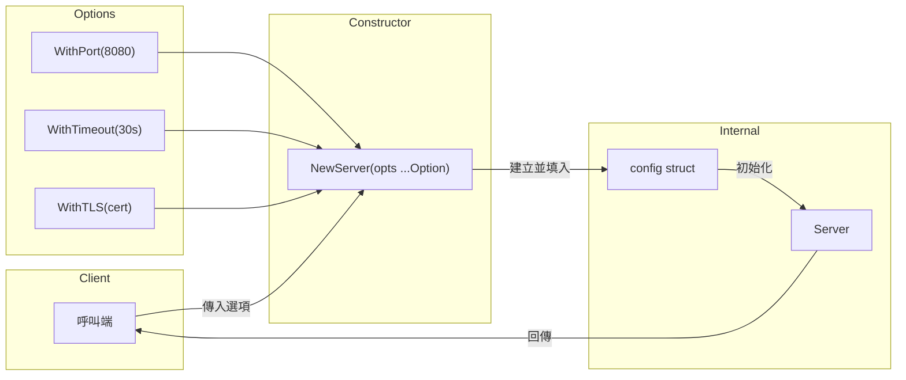

# Functional Options / 函數選項模式

## Intent / 意圖
> 透過一系列可選的函數參數，為物件建構提供靈活、可擴展且自文件化的配置方式，避免冗長的建構子參數列表或複雜的配置結構體。

## Problem / 問題情境
當一個物件（如 HTTP server、database connection pool）需要大量可選配置時，傳統做法面臨以下困難：

1. **建構子爆炸**：每增加一個選項就需要新的建構子重載（Go 沒有函數重載，問題更嚴重）
2. **Config struct 膨脹**：傳入一個大型 config struct，呼叫端必須了解所有欄位，零值語意不明確
3. **向後相容性差**：新增參數會破壞既有呼叫者
4. **可讀性低**：`NewServer("localhost", 8080, true, false, 30, nil)` 完全無法自我描述

## Solution / 解決方案
定義一個不匯出的配置結構體，並提供一系列「選項函數」，每個函數接受配置結構體的指標並修改特定欄位。建構函數接受可變數量的選項函數，依序套用它們。這讓呼叫端可以只指定需要的選項，同時保持 API 的向後相容性。新增選項只需增加新的函數，不影響既有程式碼。

## Structure / 結構



## Participants / 參與者

| 角色 | 職責 |
|------|------|
| **Option** | 函數型別，接受 `*config` 並修改其欄位 |
| **config** | 不匯出的配置結構體，持有所有可選設定及其預設值 |
| **Constructor** | 公開的建構函數，接受 `...Option` 可變參數 |
| **WithXxx** | 每個具體的選項函數，回傳一個 `Option` |
| **Target** | 被建構的目標物件（如 Server） |

## Go 實作

```go
package main

import (
	"fmt"
	"time"
)

// --- 核心實作 ---

// Server 是我們要配置的目標物件
type Server struct {
	host    string
	port    int
	timeout time.Duration
	maxConn int
	tls     bool
}

// Option 定義選項函數的型別
type Option func(*Server)

// WithPort 設定伺服器埠號
func WithPort(port int) Option {
	return func(s *Server) {
		s.port = port
	}
}

// WithTimeout 設定連線逾時時間
func WithTimeout(d time.Duration) Option {
	return func(s *Server) {
		s.timeout = d
	}
}

// WithMaxConn 設定最大連線數
func WithMaxConn(n int) Option {
	return func(s *Server) {
		s.maxConn = n
	}
}

// WithTLS 啟用 TLS
func WithTLS(enabled bool) Option {
	return func(s *Server) {
		s.tls = enabled
	}
}

// NewServer 建立伺服器，套用預設值後依序執行選項函數
func NewServer(host string, opts ...Option) *Server {
	// 預設值
	s := &Server{
		host:    host,
		port:    8080,
		timeout: 30 * time.Second,
		maxConn: 100,
		tls:     false,
	}

	// 依序套用每個選項
	for _, opt := range opts {
		opt(s)
	}

	return s
}

func (s *Server) String() string {
	scheme := "http"
	if s.tls {
		scheme = "https"
	}
	return fmt.Sprintf("%s://%s:%d (timeout=%s, maxConn=%d)",
		scheme, s.host, s.port, s.timeout, s.maxConn)
}

// --- 使用示範 ---

func main() {
	// 最簡呼叫：只有必要參數，其餘用預設值
	s1 := NewServer("localhost")
	fmt.Println("Default:", s1)

	// 自訂部分選項
	s2 := NewServer("api.example.com",
		WithPort(443),
		WithTLS(true),
		WithTimeout(10*time.Second),
	)
	fmt.Println("Custom: ", s2)

	// 動態組合選項
	opts := []Option{WithPort(9090)}
	if true { // 模擬條件判斷
		opts = append(opts, WithMaxConn(500))
	}
	s3 := NewServer("internal.svc", opts...)
	fmt.Println("Dynamic:", s3)
}

// Output:
// Default: http://localhost:8080 (timeout=30s, maxConn=100)
// Custom:  https://api.example.com:443 (timeout=10s, maxConn=100)
// Dynamic: http://internal.svc:9090 (timeout=30s, maxConn=500)
```

## Rust 實作

```rust
use std::time::Duration;

// --- 核心實作 ---

// Rust 慣用做法：Builder pattern + Default trait
#[derive(Debug)]
struct Server {
    host: String,
    port: u16,
    timeout: Duration,
    max_conn: usize,
    tls: bool,
}

#[derive(Debug)]
struct ServerBuilder {
    host: String,
    port: u16,
    timeout: Duration,
    max_conn: usize,
    tls: bool,
}

impl ServerBuilder {
    fn new(host: impl Into<String>) -> Self {
        Self {
            host: host.into(),
            port: 8080,
            timeout: Duration::from_secs(30),
            max_conn: 100,
            tls: false,
        }
    }

    fn port(mut self, port: u16) -> Self {
        self.port = port;
        self
    }

    fn timeout(mut self, d: Duration) -> Self {
        self.timeout = d;
        self
    }

    fn max_conn(mut self, n: usize) -> Self {
        self.max_conn = n;
        self
    }

    fn tls(mut self, enabled: bool) -> Self {
        self.tls = enabled;
        self
    }

    fn build(self) -> Server {
        Server {
            host: self.host,
            port: self.port,
            timeout: self.timeout,
            max_conn: self.max_conn,
            tls: self.tls,
        }
    }
}

// 也可以用 closure-based functional options（更接近 Go 風格）
impl Server {
    fn with_options<F>(host: impl Into<String>, configure: F) -> Self
    where
        F: FnOnce(&mut Server),
    {
        let mut server = Server {
            host: host.into(),
            port: 8080,
            timeout: Duration::from_secs(30),
            max_conn: 100,
            tls: false,
        };
        configure(&mut server);
        server
    }
}

impl std::fmt::Display for Server {
    fn fmt(&self, f: &mut std::fmt::Formatter<'_>) -> std::fmt::Result {
        let scheme = if self.tls { "https" } else { "http" };
        write!(
            f,
            "{}://{}:{} (timeout={:?}, max_conn={})",
            scheme, self.host, self.port, self.timeout, self.max_conn
        )
    }
}

fn main() {
    // Builder pattern（Rust 慣用方式）
    let s1 = ServerBuilder::new("localhost").build();
    println!("Default: {s1}");

    let s2 = ServerBuilder::new("api.example.com")
        .port(443)
        .tls(true)
        .timeout(Duration::from_secs(10))
        .build();
    println!("Custom:  {s2}");

    // Closure-based functional options（Go 風格對應）
    let s3 = Server::with_options("internal.svc", |s| {
        s.port = 9090;
        s.max_conn = 500;
    });
    println!("Closure: {s3}");
}

// Output:
// Default: http://localhost:8080 (timeout=30s, max_conn=100)
// Custom:  https://api.example.com:443 (timeout=10s, max_conn=100)
// Closure: http://internal.svc:9090 (timeout=30s, max_conn=500)
```

## Go vs Rust 對照表

| 面向 | Go | Rust |
|------|----|----|
| 慣用手法 | `func(*T)` 選項函數 + variadic | Builder pattern + method chaining |
| 型別安全 | 執行期檢查，選項函數無法限制組合 | 編譯期檢查，Builder 可用 typestate 限制 |
| 預設值 | 建構函數內手動設定 | `Default` trait 或 builder 內設定 |
| 可擴展性 | 新增 `WithXxx` 函數即可 | 新增 builder method 即可 |
| 動態組合 | `[]Option` slice 動態組合 | 閉包 `FnOnce(&mut T)` 或 builder chain |
| 錯誤處理 | 選項函數可回傳 error（進階用法） | `build()` 回傳 `Result<T, E>` |

## When to Use / 適用場景

- 物件有大量可選配置參數（超過 3 個以上），且大部分有合理的預設值
- API 需要保持向後相容性，未來可能新增更多選項
- 需要在不同情境下動態組合不同的配置選項
- 程式庫設計者希望提供自文件化的 API（`WithTimeout(30*time.Second)` 比 positional arg 清楚）

## When NOT to Use / 不適用場景

- 配置參數只有 1-2 個且全部必填 -- 直接用函數參數更簡單
- 配置之間有複雜的互斥或依賴關係 -- 此時 Builder + 驗證更合適
- 效能極度敏感的 hot path -- 每個選項函數都是一次間接呼叫（實務上影響微乎其微）

## Real-World Examples / 真實世界案例

- **Go `google.golang.org/grpc`**：`grpc.Dial(target, grpc.WithTransportCredentials(...), grpc.WithBlock())` 使用 `DialOption` 函數選項
- **Go `go.uber.org/zap`**：`zap.New(core, zap.AddCaller(), zap.AddStacktrace(level))` 使用 `Option` 配置 logger
- **Rust `reqwest`**：`Client::builder().timeout(dur).proxy(p).build()` 使用 builder pattern 配置 HTTP client

## Related Patterns / 相關模式

- **Builder (GoF)**：Functional Options 是 Builder 的函數式變體；Rust 中 Builder pattern 就是標準慣用法
- **Strategy (GoF)**：Option 函數本質上是一種 strategy，將配置行為參數化
- **Template Method (GoF)**：預設值 + 可覆寫的選項，概念上類似 template method 的 hook

## Pitfalls / 常見陷阱

1. **選項順序依賴**：當多個選項修改相同欄位時，最後套用的會覆蓋前面的。應在文件中說明或設計成冪等
2. **缺乏驗證**：Functional Options 通常在套用時不回傳 error，無效配置可能到執行時才爆發。建議在建構函數末尾加上 `validate()` 步驟
3. **過度使用**：不是每個 struct 都需要 Functional Options，只有 2 個欄位的簡單結構直接用參數即可
4. **測試困難**：Option 函數是不透明的閉包，難以比較或檢查。可考慮提供 `Config()` 方法匯出最終配置供測試驗證

## References / 參考資料

- Dave Cheney, "Functional options for friendly APIs" (2014): https://dave.cheney.net/2014/10/17/functional-options-for-friendly-apis
- Rob Pike, "Self-referential functions and the design of options" (2014): https://commandcenter.blogspot.com/2014/01/self-referential-functions-and-design-of.html
- Go Wiki - Functional Options: https://go.dev/wiki/Functional-options
- Rust API Guidelines - Builders: https://rust-lang.github.io/api-guidelines/type-safety.html
