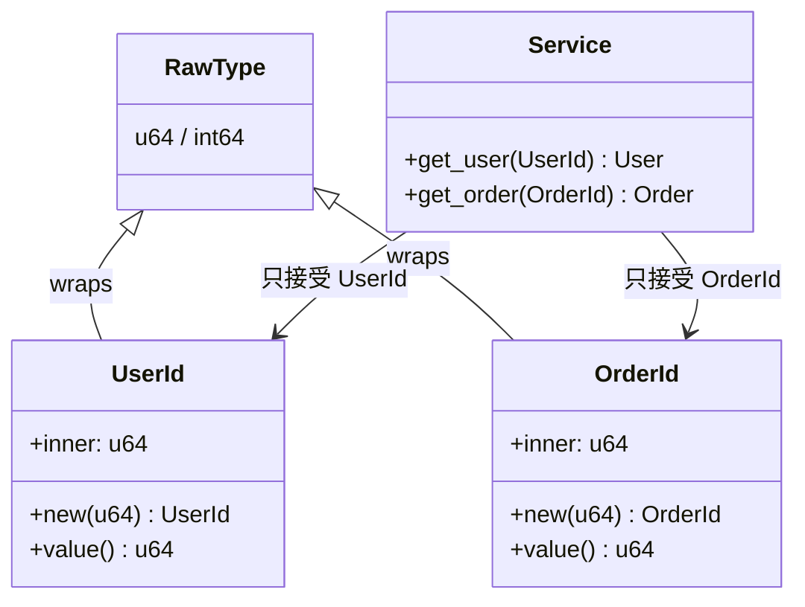

# Newtype / 新型別模式

## Intent / 意圖
> 透過定義語意明確的包裝型別，在編譯期防止不同概念的值被混淆使用，提升型別安全性而不犧牲執行效能。

## Problem / 問題情境
在許多系統中，不同的業務概念共用相同的底層型別。例如：

1. `user_id` 和 `order_id` 都是 `int64`，編譯器無法阻止你把 order ID 傳給需要 user ID 的函數
2. 金額的幣別混淆：美元金額和日圓金額都是 `float64`，加在一起不會報錯
3. 資料庫欄位 ID、API token、email 都是 `string`，任意互換不會有編譯錯誤

這類 bug 只在執行期才會暴露，而且通常難以追蹤。

## Solution / 解決方案
為每個具有獨立語意的概念建立專屬的包裝型別。在 Rust 中使用 tuple struct（`struct UserId(u64)`），在 Go 中使用 type definition（`type UserId int64`）。這讓編譯器能區分不同概念的值，即使底層表示相同。包裝型別通常是零成本抽象，不會產生執行期開銷。

## Structure / 結構



## Participants / 參與者

| 角色 | 職責 |
|------|------|
| **Raw Type** | 底層原始型別（`u64`、`int64`、`string` 等） |
| **Newtype** | 包裝型別，提供語意區分和型別安全 |
| **Constructor** | 建立 newtype 實例的函數，可加入驗證邏輯 |
| **Consumer** | 使用 newtype 參數的函數或方法，享受型別安全 |

## Go 實作

```go
package main

import (
	"fmt"
)

// --- 核心實作 ---

// UserId 和 OrderId 是不同的型別，即使底層都是 int64
type UserId int64
type OrderId int64

// Amount 用 newtype 區分幣別
type USD int64 // 以 cent 為單位
type JPY int64 // 以円為單位

// Email 包裝 string 以增加語意
type Email string

// NewEmail 建構函數可加入驗證
func NewEmail(s string) (Email, error) {
	for _, c := range s {
		if c == '@' {
			return Email(s), nil
		}
	}
	return "", fmt.Errorf("invalid email: %s", s)
}

// --- 業務函數使用 newtype 參數 ---

type User struct {
	ID    UserId
	Email Email
}

type Order struct {
	ID     OrderId
	UserID UserId
	Amount USD
}

func GetUser(id UserId) User {
	return User{ID: id, Email: "user@example.com"}
}

func GetOrder(id OrderId) Order {
	return Order{ID: id, UserID: UserId(1), Amount: USD(2999)} // $29.99
}

func ProcessPayment(userID UserId, amount USD) {
	fmt.Printf("Charging user %d: $%.2f\n", userID, float64(amount)/100)
}

func main() {
	uid := UserId(42)
	oid := OrderId(100)

	user := GetUser(uid)
	order := GetOrder(oid)

	fmt.Printf("User: %+v\n", user)
	fmt.Printf("Order: %+v\n", order)

	// 編譯錯誤示範（取消註解會無法編譯）：
	// GetUser(oid)          // cannot use oid (OrderId) as UserId
	// GetOrder(uid)         // cannot use uid (UserId) as OrderId
	// ProcessPayment(uid, JPY(1000))  // cannot use JPY as USD

	ProcessPayment(uid, order.Amount)

	// Go 的限制：仍可透過底層型別強制轉換繞過
	// sneaky := UserId(int64(oid))  // 這是合法的，Go 無法完全防止

	email, err := NewEmail("hello@world.com")
	if err != nil {
		fmt.Println("Error:", err)
		return
	}
	fmt.Println("Email:", email)
}

// Output:
// User: {ID:42 Email:user@example.com}
// Order: {ID:100 UserID:1 Amount:2999}
// Charging user 42: $29.99
// Email: hello@world.com
```

## Rust 實作

```rust
use std::fmt;

// --- 核心實作 ---

// Tuple struct 實現零成本 newtype
#[derive(Debug, Clone, Copy, PartialEq, Eq, Hash)]
struct UserId(u64);

#[derive(Debug, Clone, Copy, PartialEq, Eq, Hash)]
struct OrderId(u64);

// 金額 newtype，用不同 struct 區分幣別
#[derive(Debug, Clone, Copy, PartialEq)]
struct Usd(i64); // 以 cent 為單位

#[derive(Debug, Clone, Copy, PartialEq)]
struct Jpy(i64); // 以円為單位

impl fmt::Display for Usd {
    fn fmt(&self, f: &mut fmt::Formatter<'_>) -> fmt::Result {
        write!(f, "${:.2}", self.0 as f64 / 100.0)
    }
}

// Email newtype 帶驗證
#[derive(Debug, Clone, PartialEq)]
struct Email(String);

#[derive(Debug)]
struct InvalidEmail(String);

impl fmt::Display for InvalidEmail {
    fn fmt(&self, f: &mut fmt::Formatter<'_>) -> fmt::Result {
        write!(f, "invalid email: {}", self.0)
    }
}

impl Email {
    fn new(s: impl Into<String>) -> Result<Self, InvalidEmail> {
        let s = s.into();
        if s.contains('@') {
            Ok(Email(s))
        } else {
            Err(InvalidEmail(s))
        }
    }

    fn as_str(&self) -> &str {
        &self.0
    }
}

// --- 業務結構體 ---

#[derive(Debug)]
struct User {
    id: UserId,
    email: Email,
}

#[derive(Debug)]
struct Order {
    id: OrderId,
    user_id: UserId,
    amount: Usd,
}

fn get_user(id: UserId) -> User {
    User {
        id,
        email: Email::new("user@example.com").unwrap(),
    }
}

fn get_order(id: OrderId) -> Order {
    Order {
        id,
        user_id: UserId(1),
        amount: Usd(2999),
    }
}

fn process_payment(user_id: UserId, amount: Usd) {
    println!("Charging user {:?}: {}", user_id, amount);
}

fn main() {
    let uid = UserId(42);
    let oid = OrderId(100);

    let user = get_user(uid);
    let order = get_order(oid);

    println!("User: {:?}", user);
    println!("Order: {:?}", order);

    // 編譯錯誤示範（取消註解會無法編譯）：
    // get_user(oid);           // expected UserId, found OrderId
    // get_order(uid);          // expected OrderId, found UserId
    // process_payment(uid, Jpy(1000)); // expected Usd, found Jpy

    process_payment(uid, order.amount);

    // Rust 的 newtype 是真正不同的型別，無法隱式轉換
    // let sneaky: UserId = oid;  // 編譯錯誤！
    // Rust 也沒有 Go 那種底層型別轉換

    let email = Email::new("hello@world.com").unwrap();
    println!("Email: {}", email.as_str());
}

// Output:
// User: User { id: UserId(42), email: Email("user@example.com") }
// Order: Order { id: OrderId(100), user_id: UserId(1), amount: Usd(2999) }
// Charging user UserId(42): $29.99
// Email: hello@world.com
```

## Go vs Rust 對照表

| 面向 | Go | Rust |
|------|----|----|
| 語法 | `type UserId int64` | `struct UserId(u64)` |
| 型別強度 | 可透過底層型別轉換繞過（`UserId(int64(oid))`） | 完全不同型別，無法隱式轉換 |
| 執行成本 | 零成本，編譯後與底層型別相同 | 零成本，`#[repr(transparent)]` 保證記憶體佈局一致 |
| Trait/Interface | 自動繼承底層型別的方法（有限） | 需手動 derive 或 impl trait |
| 驗證 | 建構函數加檢查 | `new()` 回傳 `Result` |
| 解構 | 直接 `int64(uid)` 轉換 | `.0` 存取或 pattern matching |

## When to Use / 適用場景

- 多個業務概念共用相同底層型別（ID、金額、度量單位），需要防止混用
- 需要為原始型別附加行為（方法）而不修改原始型別
- 跨越 API 邊界傳遞的值需要語意明確性（如 gRPC message 的 ID 欄位）
- 金融系統中的幣別安全，避免不同貨幣金額直接運算

## When NOT to Use / 不適用場景

- 底層型別只有單一用途，不存在混淆風險 -- 增加 newtype 只是多餘的包裝
- 需要大量與原始型別互操作（如數學運算），會產生大量 unwrap/rewrap 的噪音
- 效能極度敏感且涉及大量集合操作時，頻繁的 newtype 轉換可能影響人體工學（效能不受影響）

## Real-World Examples / 真實世界案例

- **Rust 標準庫 `std::num::NonZeroU64`**：用 newtype 保證值永遠非零，讓 `Option<NonZeroU64>` 可以做 niche optimization
- **Go `net/netip.Addr`**：用 newtype-style struct 包裝 IP 地址，取代原本的 `net.IP`（`[]byte`），提供值語意和更好的效能
- **Rust `ordered_float::OrderedFloat`**：用 newtype 包裝 `f64` 使其實作 `Ord` trait

## Related Patterns / 相關模式

- **Adapter (GoF)**：Newtype 可視為一種極簡的 adapter，將原始型別「適配」成具有不同語意的型別
- **Flyweight (GoF)**：Newtype ID 常用作 flyweight 的 key，指向共享的重量級物件
- **Typestate (Modern)**：結合 newtype 和 typestate 可以在編譯期同時保證值的語意和狀態正確性

## Pitfalls / 常見陷阱

1. **Go 的轉換漏洞**：Go 允許透過共同底層型別做顯式轉換（`UserId(int64(orderId))`），無法在編譯期完全防止。Rust 的 tuple struct 沒有這個問題
2. **序列化/反序列化**：Newtype 需要額外處理 JSON 序列化。Go 需實作 `json.Marshaler`；Rust 需 `#[derive(Serialize, Deserialize)]` 並可能需要 `#[serde(transparent)]`
3. **過度包裝**：不是每個 `string` 或 `int` 都需要 newtype，只在確實存在混淆風險時才使用
4. **算術運算遺失**：Newtype 不自動繼承底層型別的運算符。Go 的 type definition 保留部分運算，Rust 需要手動 impl `Add`、`Sub` 等 trait

## References / 參考資料

- Rust Book - "Using the Newtype Pattern": https://doc.rust-lang.org/book/ch19-03-advanced-traits.html#using-the-newtype-pattern-to-implement-external-traits-on-external-types
- Rust Design Patterns - Newtype: https://rust-unofficial.github.io/patterns/patterns/behavioural/newtype.html
- Go Blog - "Defining Your Own Types": https://go.dev/blog/type-declarations
- "Domain Modeling Made Functional" by Scott Wlaschin (F# 但概念通用)
