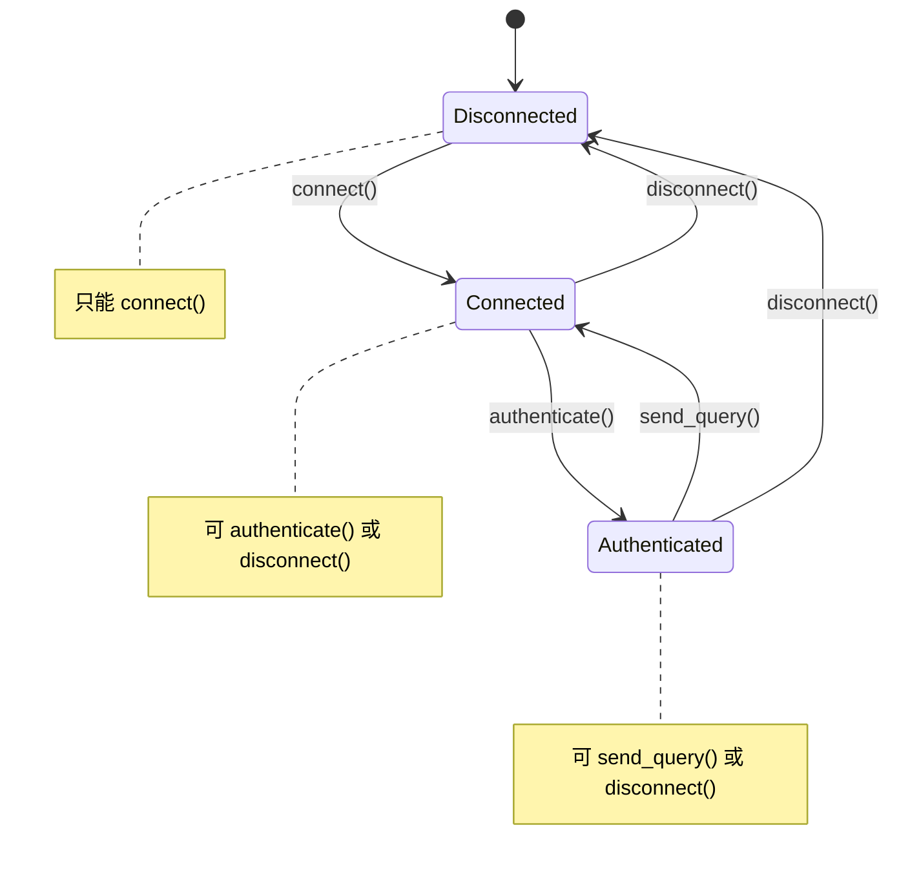

# Typestate / 型別狀態模式

## Intent / 意圖
> 利用型別系統在編譯期追蹤物件的狀態轉換，使得在錯誤狀態下呼叫不允許的操作成為編譯錯誤而非執行期 bug。

## Problem / 問題情境
許多物件有明確的生命週期狀態（如 TCP 連線：建立 -> 認證 -> 使用 -> 關閉），不同狀態下允許的操作不同：

1. 未認證的連線不應該能發送查詢
2. 已關閉的連線不應該能讀取資料
3. 傳統做法用 runtime flag 或 enum 追蹤狀態，在每個方法開頭檢查狀態，違規時回傳 error 或 panic
4. 這些錯誤只在執行期才會發現，且容易被遺漏

## Solution / 解決方案
將狀態編碼為型別參數，讓不同狀態的物件成為不同的型別。狀態轉換方法消耗舊型別並回傳新型別（move semantics），使得在錯誤狀態呼叫不允許的方法成為編譯錯誤。Rust 的 ownership 系統完美支援此模式；Go 缺乏泛型層級的 phantom type，只能用 interface 模擬部分效果。

## Structure / 結構



## Participants / 參與者

| 角色 | 職責 |
|------|------|
| **State Marker** | 零大小型別（ZST），僅作為泛型參數標記狀態 |
| **Stateful Object** | 帶有狀態參數的主要結構體，如 `Connection<S>` |
| **Transition Method** | 消耗 `self` 並回傳不同狀態的新實例 |
| **State-specific Method** | 只在特定狀態下可用的 impl block 方法 |

## Go 實作

```go
package main

import "fmt"

// --- Go 用 interface 模擬 typestate（有限保證）---

// 每個狀態是一個 interface，只暴露該狀態允許的操作

type DisconnectedConn interface {
	Connect(addr string) (ConnectedConn, error)
}

type ConnectedConn interface {
	Authenticate(user, pass string) (AuthenticatedConn, error)
	Disconnect() DisconnectedConn
}

type AuthenticatedConn interface {
	Query(sql string) (string, error)
	Disconnect() DisconnectedConn
}

// 內部實作結構體（不匯出）
type connection struct {
	addr string
	user string
}

// --- Disconnected 狀態 ---
type disconnected struct{}

func NewConnection() DisconnectedConn {
	return &disconnected{}
}

func (d *disconnected) Connect(addr string) (ConnectedConn, error) {
	fmt.Printf("Connecting to %s...\n", addr)
	return &connected{addr: addr}, nil
}

// --- Connected 狀態 ---
type connected struct {
	addr string
}

func (c *connected) Authenticate(user, pass string) (AuthenticatedConn, error) {
	fmt.Printf("Authenticating as %s...\n", user)
	return &authenticated{addr: c.addr, user: user}, nil
}

func (c *connected) Disconnect() DisconnectedConn {
	fmt.Println("Disconnected.")
	return &disconnected{}
}

// --- Authenticated 狀態 ---
type authenticated struct {
	addr string
	user string
}

func (a *authenticated) Query(sql string) (string, error) {
	fmt.Printf("Executing query: %s\n", sql)
	return fmt.Sprintf("Results from %s@%s", a.user, a.addr), nil
}

func (a *authenticated) Disconnect() DisconnectedConn {
	fmt.Println("Disconnected.")
	return &disconnected{}
}

func main() {
	conn := NewConnection()

	// 狀態流轉：Disconnected -> Connected -> Authenticated
	c, err := conn.Connect("db.example.com:5432")
	if err != nil {
		panic(err)
	}

	auth, err := c.Authenticate("admin", "secret")
	if err != nil {
		panic(err)
	}

	result, err := auth.Query("SELECT * FROM users")
	if err != nil {
		panic(err)
	}
	fmt.Println("Result:", result)

	// 回到 Disconnected 狀態
	_ = auth.Disconnect()

	// 以下操作在 Go 中透過 interface 限制，但無法阻止保留舊引用：
	// conn.Query("...")        // 編譯錯誤：DisconnectedConn 沒有 Query 方法
	// c.Query("...")           // 編譯錯誤：ConnectedConn 沒有 Query 方法

	// Go 的限制：auth 變數在 Disconnect 後仍然存在，可以繼續使用
	// 這是 Go 無法完美實現 typestate 的根本原因
}

// Output:
// Connecting to db.example.com:5432...
// Authenticating as admin...
// Executing query: SELECT * FROM users
// Result: Results from admin@db.example.com:5432
// Disconnected.
```

## Rust 實作

```rust
use std::marker::PhantomData;

// --- 核心實作 ---

// 狀態標記型別（Zero-Sized Types）
struct Disconnected;
struct Connected;
struct Authenticated;

// 帶狀態參數的連線結構體
struct Connection<S> {
    addr: String,
    user: Option<String>,
    _state: PhantomData<S>,
}

// Disconnected 狀態的方法
impl Connection<Disconnected> {
    fn new() -> Self {
        Connection {
            addr: String::new(),
            user: None,
            _state: PhantomData,
        }
    }

    // 消耗 self，回傳 Connected 狀態
    fn connect(self, addr: &str) -> Connection<Connected> {
        println!("Connecting to {addr}...");
        Connection {
            addr: addr.to_string(),
            user: None,
            _state: PhantomData,
        }
    }
}

// Connected 狀態的方法
impl Connection<Connected> {
    fn authenticate(self, user: &str, _pass: &str) -> Connection<Authenticated> {
        println!("Authenticating as {user}...");
        Connection {
            addr: self.addr,
            user: Some(user.to_string()),
            _state: PhantomData,
        }
    }

    fn disconnect(self) -> Connection<Disconnected> {
        println!("Disconnected.");
        Connection::new()
    }
}

// Authenticated 狀態的方法
impl Connection<Authenticated> {
    fn query(&self, sql: &str) -> String {
        let user = self.user.as_deref().unwrap_or("unknown");
        println!("Executing query: {sql}");
        format!("Results from {user}@{}", self.addr)
    }

    fn disconnect(self) -> Connection<Disconnected> {
        println!("Disconnected.");
        Connection::new()
    }
}

fn main() {
    // 狀態流轉：Disconnected -> Connected -> Authenticated
    let conn = Connection::new();

    let conn = conn.connect("db.example.com:5432");
    // conn.query("...");  // 編譯錯誤！Connected 沒有 query 方法

    let conn = conn.authenticate("admin", "secret");

    let result = conn.query("SELECT * FROM users");
    println!("Result: {result}");

    let _conn = conn.disconnect();
    // conn.query("...");  // 編譯錯誤！conn 已經被 move，無法使用

    // Rust 的 ownership 完美保證：
    // 1. 錯誤狀態的方法呼叫 = 編譯錯誤
    // 2. 狀態轉換後舊引用自動失效（move semantics）
    // 3. 零執行期成本（PhantomData 是 ZST）
}

// Output:
// Connecting to db.example.com:5432...
// Authenticating as admin...
// Executing query: SELECT * FROM users
// Result: Results from admin@db.example.com:5432
// Disconnected.
```

## Go vs Rust 對照表

| 面向 | Go | Rust |
|------|----|----|
| 狀態編碼 | 不同 interface 代表不同狀態 | 泛型參數 `PhantomData<S>` |
| 編譯期安全 | 部分：interface 限制可用方法 | 完全：move semantics 阻止舊狀態使用 |
| 舊狀態引用 | 無法阻止保留舊 interface 變數 | ownership 轉移，舊變數自動失效 |
| 執行期成本 | 每次呼叫有 interface dispatch（虛表） | 零成本，PhantomData 不佔空間 |
| 語法負擔 | 需定義多個 interface + 多個 struct | 一個 struct + 多個 impl block |
| 實用性 | 適合 API 設計指引，非強制約束 | 真正的編譯期狀態機保證 |

## When to Use / 適用場景

- 物件有明確的狀態生命週期，且不同狀態下的可用操作截然不同（如連線協議、建構流程）
- Bug 的代價極高（金融交易、安全協議），需要編譯期保證而非執行期檢查
- Rust 專案中需要零成本的狀態機抽象
- Builder pattern 的進階版本，強制要求必填欄位的設定順序

## When NOT to Use / 不適用場景

- 狀態轉換頻繁且狀態數量很多（超過 5-6 個） -- 會產生大量的 impl block 和型別組合
- 需要在 runtime 動態決定狀態轉換路徑 -- typestate 的靜態性質反而成為限制
- 團隊不熟悉 Rust 泛型系統 -- 學習成本可能超過帶來的安全收益
- Go 專案 -- Go 的型別系統無法提供完整的 typestate 保證，投入產出比低

## Real-World Examples / 真實世界案例

- **Rust `hyper::http::request::Builder`**：HTTP request builder 使用 typestate 確保必要的 header 設定順序
- **Rust `diesel` ORM**：Query builder 使用 typestate 確保 SQL 語句的語法正確性（如 `SELECT` 後才能 `FROM`）
- **Rust Embedded HAL**：GPIO pin 的模式設定（Input/Output/Alternate）使用 typestate 防止錯誤配置

## Related Patterns / 相關模式

- **State (GoF)**：Typestate 是 State pattern 的編譯期版本；GoF State 在執行期切換行為，Typestate 在編譯期限制行為
- **Builder (GoF)**：Typestate Builder 可以強制欄位設定順序和必填檢查
- **Newtype (Modern)**：Typestate 的狀態標記型別本質上是 newtype 的應用

## Pitfalls / 常見陷阱

1. **型別膨脹**：每個狀態組合都是一個不同的型別，無法放在同一個集合中（`Vec<Connection<??>>` 需要 trait object 或 enum）
2. **錯誤訊息晦澀**：當狀態不對時，Rust 的錯誤訊息可能是「method not found for `Connection<Connected>`」，對不熟悉此模式的開發者不夠直覺
3. **與 dyn trait 的衝突**：Typestate 依賴泛型的靜態 dispatch，無法輕易轉換為 trait object 做動態 dispatch
4. **過度工程**：簡單的兩態切換（開/關）不值得使用 typestate，一個 `bool` 或 `Option` 就夠了

## References / 參考資料

- "Type-State Pattern in Rust" by Cliffle: https://cliffle.com/blog/rust-typestate/
- Ana Hoverbear, "Rust's Type System as a Design Tool": https://hoverbear.org/blog/rust-state-machine-pattern/
- "Typestate-Oriented Programming" by Jonathan Aldrich (學術論文)
- Rust Design Patterns - Typestate: https://rust-unofficial.github.io/patterns/patterns/behavioural/typestate.html
