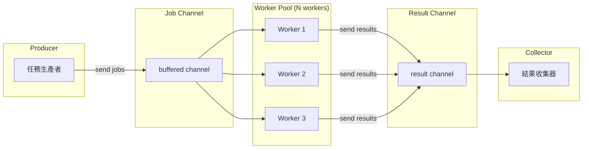

# Worker Pool / 工作池模式

## Intent / 意圖
> 建立固定數量的 worker 並行處理任務佇列，實現 fan-out/fan-in 的並行控制，避免無限制地產生 goroutine/thread 導致資源耗盡。

## Problem / 問題情境
當需要並行處理大量任務（如下載 1000 個 URL、處理百萬筆記錄）時：

1. **資源耗盡**：為每個任務啟動一個 goroutine/thread，可能瞬間佔用過多記憶體和 CPU
2. **外部服務過載**：無限制的並行請求可能壓垮下游服務或觸發限流
3. **缺乏背壓**：生產速度超過消費速度時，任務佇列無限增長
4. **結果收集困難**：散落在各 goroutine 中的結果難以統一收集和錯誤處理

## Solution / 解決方案
建立一個固定大小的 worker pool：一個 job channel 作為任務佇列，N 個 worker goroutine/task 持續從 channel 取出任務執行，一個 result channel 收集結果。生產者將任務送入 job channel，channel 的容量提供天然的背壓機制。當所有任務處理完畢後，關閉 channel 通知 worker 結束。

## Structure / 結構



## Participants / 參與者

| 角色 | 職責 |
|------|------|
| **Producer** | 產生任務並送入 job channel |
| **Job Channel** | 帶緩衝的 channel，作為任務佇列和背壓機制 |
| **Worker** | 從 job channel 取出任務執行，結果送入 result channel |
| **Result Channel** | 收集 worker 的處理結果 |
| **Collector** | 匯總所有結果，處理錯誤 |
| **WaitGroup / JoinHandle** | 等待所有 worker 完成 |

## Go 實作

```go
package main

import (
	"fmt"
	"math/rand"
	"sync"
	"time"
)

// --- 核心實作 ---

// Job 代表一個工作單元
type Job struct {
	ID  int
	URL string
}

// Result 代表處理結果
type Result struct {
	Job     Job
	Content string
	Err     error
}

// Worker 從 jobs channel 取出任務，處理後送入 results channel
func worker(id int, jobs <-chan Job, results chan<- Result, wg *sync.WaitGroup) {
	defer wg.Done()
	for job := range jobs {
		fmt.Printf("Worker %d: processing job %d (%s)\n", id, job.ID, job.URL)

		// 模擬 HTTP 下載（隨機耗時）
		duration := time.Duration(rand.Intn(100)) * time.Millisecond
		time.Sleep(duration)

		// 模擬偶發錯誤
		var result Result
		if job.ID%7 == 0 {
			result = Result{Job: job, Err: fmt.Errorf("failed to fetch %s", job.URL)}
		} else {
			result = Result{
				Job:     job,
				Content: fmt.Sprintf("Content of %s (%s)", job.URL, duration),
			}
		}
		results <- result
	}
}

// Pool 管理 worker pool 的生命週期
type Pool struct {
	workerCount int
	jobs        chan Job
	results     chan Result
}

func NewPool(workerCount, jobBufferSize int) *Pool {
	return &Pool{
		workerCount: workerCount,
		jobs:        make(chan Job, jobBufferSize),
		results:     make(chan Result, jobBufferSize),
	}
}

func (p *Pool) Start() {
	var wg sync.WaitGroup
	for i := 1; i <= p.workerCount; i++ {
		wg.Add(1)
		go worker(i, p.jobs, p.results, &wg)
	}

	// 等待所有 worker 完成後關閉 results channel
	go func() {
		wg.Wait()
		close(p.results)
	}()
}

func (p *Pool) Submit(job Job) {
	p.jobs <- job
}

func (p *Pool) Close() {
	close(p.jobs)
}

func (p *Pool) Results() <-chan Result {
	return p.results
}

func main() {
	// 建立 3 個 worker 的 pool
	pool := NewPool(3, 10)
	pool.Start()

	// 提交 10 個任務
	urls := []string{
		"https://example.com/1", "https://example.com/2",
		"https://example.com/3", "https://example.com/4",
		"https://example.com/5", "https://example.com/6",
		"https://example.com/7", "https://example.com/8",
		"https://example.com/9", "https://example.com/10",
	}

	go func() {
		for i, url := range urls {
			pool.Submit(Job{ID: i + 1, URL: url})
		}
		pool.Close() // 所有任務提交完畢
	}()

	// 收集結果
	var succeeded, failed int
	for result := range pool.Results() {
		if result.Err != nil {
			fmt.Printf("  FAIL: job %d - %v\n", result.Job.ID, result.Err)
			failed++
		} else {
			fmt.Printf("  OK:   job %d - %s\n", result.Job.ID, result.Content)
			succeeded++
		}
	}

	fmt.Printf("\nDone: %d succeeded, %d failed\n", succeeded, failed)
}

// Output:
// Worker 1: processing job 1 (https://example.com/1)
// Worker 2: processing job 2 (https://example.com/2)
// Worker 3: processing job 3 (https://example.com/3)
//   OK:   job 2 - Content of https://example.com/2 (...)
// Worker 2: processing job 4 (https://example.com/4)
//   OK:   job 1 - Content of https://example.com/1 (...)
// ...
// Done: 9 succeeded, 1 failed
```

## Rust 實作

```rust
use std::sync::mpsc;
use std::thread;
use std::time::Duration;

// --- 核心實作 ---

#[derive(Debug, Clone)]
struct Job {
    id: usize,
    url: String,
}

#[derive(Debug)]
struct JobResult {
    job: Job,
    content: Result<String, String>,
}

struct WorkerPool {
    job_tx: Option<mpsc::Sender<Job>>,
    result_rx: mpsc::Receiver<JobResult>,
    handles: Vec<thread::JoinHandle<()>>,
}

impl WorkerPool {
    fn new(worker_count: usize) -> Self {
        let (job_tx, job_rx) = mpsc::channel::<Job>();
        let (result_tx, result_rx) = mpsc::channel::<JobResult>();

        // 用 Arc<Mutex> 共享 job_rx 讓多個 worker 競爭取任務
        let job_rx = std::sync::Arc::new(std::sync::Mutex::new(job_rx));

        let mut handles = Vec::with_capacity(worker_count);

        for id in 1..=worker_count {
            let job_rx = job_rx.clone();
            let result_tx = result_tx.clone();

            let handle = thread::spawn(move || {
                loop {
                    // 嘗試從 channel 取得任務
                    let job = {
                        let rx = job_rx.lock().unwrap();
                        rx.recv()
                    };

                    match job {
                        Ok(job) => {
                            println!("Worker {id}: processing job {} ({})", job.id, job.url);

                            // 模擬處理
                            let ms = (job.id * 17 % 100) as u64;
                            thread::sleep(Duration::from_millis(ms));

                            let content = if job.id % 7 == 0 {
                                Err(format!("failed to fetch {}", job.url))
                            } else {
                                Ok(format!("Content of {} ({ms}ms)", job.url))
                            };

                            let _ = result_tx.send(JobResult {
                                job,
                                content,
                            });
                        }
                        Err(_) => break, // channel closed, exit worker
                    }
                }
            });
            handles.push(handle);
        }

        WorkerPool {
            job_tx: Some(job_tx),
            result_rx,
            handles,
        }
    }

    fn submit(&self, job: Job) {
        if let Some(tx) = &self.job_tx {
            tx.send(job).expect("pool is closed");
        }
    }

    fn close_and_collect(mut self) -> Vec<JobResult> {
        // Drop sender 以關閉 job channel
        self.job_tx.take();

        // 等待所有 worker 完成
        for handle in self.handles.drain(..) {
            handle.join().expect("worker panicked");
        }

        // 收集所有結果
        let mut results = Vec::new();
        while let Ok(result) = self.result_rx.try_recv() {
            results.push(result);
        }
        results
    }
}

fn main() {
    let pool = WorkerPool::new(3);

    // 提交任務
    let urls: Vec<String> = (1..=10)
        .map(|i| format!("https://example.com/{i}"))
        .collect();

    for (i, url) in urls.into_iter().enumerate() {
        pool.submit(Job { id: i + 1, url });
    }

    // 關閉 pool 並收集結果
    let results = pool.close_and_collect();

    let mut succeeded = 0;
    let mut failed = 0;
    for result in &results {
        match &result.content {
            Ok(content) => {
                println!("  OK:   job {} - {content}", result.job.id);
                succeeded += 1;
            }
            Err(err) => {
                println!("  FAIL: job {} - {err}", result.job.id);
                failed += 1;
            }
        }
    }

    println!("\nDone: {succeeded} succeeded, {failed} failed");
}

// Output:
// Worker 1: processing job 1 (https://example.com/1)
// Worker 2: processing job 2 (https://example.com/2)
// Worker 3: processing job 3 (https://example.com/3)
// ...
//   OK:   job 1 - Content of https://example.com/1 (17ms)
//   OK:   job 2 - Content of https://example.com/2 (34ms)
//   FAIL: job 7 - failed to fetch https://example.com/7
// ...
// Done: 9 succeeded, 1 failed
```

## Go vs Rust 對照表

| 面向 | Go | Rust |
|------|----|----|
| Worker 單位 | goroutine（極輕量，2KB stack） | `std::thread` 或 `tokio::spawn`（async） |
| 任務佇列 | buffered channel（built-in） | `mpsc::channel` 或 `crossbeam::channel` |
| 背壓機制 | channel capacity 自然阻塞 | bounded channel 或 semaphore |
| 等待完成 | `sync.WaitGroup` | `JoinHandle::join()` |
| 共享 receiver | channel 天然多消費者 | `Arc<Mutex<Receiver>>` 或 crossbeam |
| 錯誤傳播 | 透過 Result channel | `Result<T, E>` 透過 channel |
| 取消機制 | `context.Context` | `tokio::CancellationToken` 或 atomic flag |

## When to Use / 適用場景

- 需要並行處理大量獨立任務（批量下載、圖片處理、日誌解析），但需要限制同時執行的數量
- 存取外部服務時需要控制並行度，避免觸發限流或壓垮下游
- I/O 密集型任務需要高吞吐量，但 CPU 資源有限

## When NOT to Use / 不適用場景

- 任務之間有強依賴關係（A 的結果是 B 的輸入） -- 應使用 pipeline 模式
- 任務數量很少（少於 worker 數量） -- 直接啟動對應數量的 goroutine/thread 更簡單
- CPU 密集型計算且需要 work-stealing -- Rust 應使用 rayon，Go 可考慮 runtime 的排程器

## Real-World Examples / 真實世界案例

- **Go `golang.org/x/sync/errgroup`**：提供帶錯誤處理的 goroutine group，`SetLimit(n)` 限制並行數
- **Rust `rayon`**：全域 thread pool 搭配 parallel iterator，`par_iter().map().collect()` 自動 fan-out/fan-in
- **Rust `tokio`**：async runtime 本身就是 worker pool，`tokio::spawn` 將 task 分配到固定數量的 OS thread

## Related Patterns / 相關模式

- **Command (GoF)**：每個 Job 本質上是一個 Command 物件，封裝了操作和參數
- **Observer (GoF)**：結果收集可以用 Observer 模式通知多個消費者
- **Pipeline**：Worker Pool 是單階段的 pipeline；多個 pool 串接形成完整 pipeline
- **Circuit Breaker (Modern)**：Worker 呼叫外部服務時，搭配 Circuit Breaker 避免反覆失敗

## Pitfalls / 常見陷阱

1. **Worker 數量選擇**：太少導致吞吐量不足，太多導致 context switching 開銷。I/O 密集型通常設 `runtime.NumCPU() * 2`，CPU 密集型設 `runtime.NumCPU()`
2. **Channel 死鎖**：忘記 close job channel 會讓 worker 永遠阻塞在 `range`；忘記等待 worker 完成就讀 result channel 會遺漏結果
3. **任務丟失**：Worker panic 時正在處理的任務會丟失。應在 worker 中加入 recover 機制
4. **資源洩漏**：長時間運行的 pool 如果不正確關閉，goroutine/thread 會洩漏。確保有 graceful shutdown 機制

## References / 參考資料

- Go Blog, "Go Concurrency Patterns: Pipelines and cancellation": https://go.dev/blog/pipelines
- Go by Example - Worker Pools: https://gobyexample.com/worker-pools
- Rust `rayon` crate: https://docs.rs/rayon/latest/rayon/
- Tokio tutorial - Spawning: https://tokio.rs/tokio/tutorial/spawning
