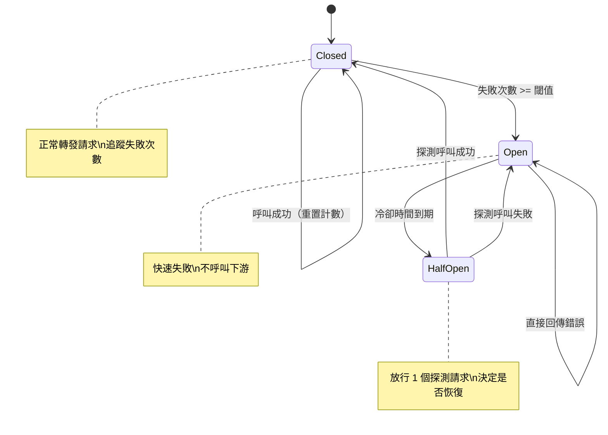

# Circuit Breaker / 斷路器模式

## Intent / 意圖
> 在呼叫可能失敗的外部服務時，透過三態切換（Closed/Open/Half-Open）自動偵測故障並快速失敗，防止級聯故障並給予故障服務恢復的時間。

## Problem / 問題情境
微服務架構中，服務間的呼叫鏈可能引發連鎖反應：

1. **級聯故障**：Service A 呼叫 Service B，B 故障時 A 的所有請求都卡在等待逾時，最終 A 也無法服務
2. **資源耗盡**：大量請求堆積在失敗的呼叫上，耗盡連線池、goroutine/thread、記憶體
3. **阻止恢復**：下游服務試圖恢復時，被大量積壓的重試請求壓垮，無法完成啟動
4. **使用者體驗差**：每個請求都要等待完整的逾時時間才回傳錯誤

## Solution / 解決方案
引入一個狀態機（circuit breaker）包裹外部呼叫。Closed 狀態下正常轉發請求，但追蹤失敗次數；當失敗率達到閾值時切換到 Open 狀態，立即回傳錯誤而不實際呼叫外部服務。經過一段冷卻時間後進入 Half-Open 狀態，放行少量探測請求；若成功則回到 Closed，否則回到 Open。

## Structure / 結構



## Participants / 參與者

| 角色 | 職責 |
|------|------|
| **CircuitBreaker** | 狀態機核心，管理三態轉換和呼叫攔截 |
| **State (Closed)** | 正常狀態，轉發請求並追蹤失敗 |
| **State (Open)** | 熔斷狀態，快速回傳錯誤 |
| **State (Half-Open)** | 探測狀態，放行有限請求測試下游是否恢復 |
| **Protected Function** | 被保護的外部呼叫（HTTP request、RPC call 等） |
| **Fallback** | 熔斷時的降級策略（回傳快取值、預設值等） |

## Go 實作

```go
package main

import (
	"errors"
	"fmt"
	"sync"
	"time"
)

// --- 核心實作 ---

type State int

const (
	StateClosed   State = iota
	StateOpen
	StateHalfOpen
)

func (s State) String() string {
	switch s {
	case StateClosed:
		return "CLOSED"
	case StateOpen:
		return "OPEN"
	case StateHalfOpen:
		return "HALF-OPEN"
	default:
		return "UNKNOWN"
	}
}

var ErrCircuitOpen = errors.New("circuit breaker is open")

type CircuitBreaker struct {
	mu               sync.Mutex
	state            State
	failureCount     int
	successCount     int
	failureThreshold int
	successThreshold int           // Half-Open 時需要的連續成功次數
	timeout          time.Duration // Open -> Half-Open 的冷卻時間
	lastFailureTime  time.Time
}

func NewCircuitBreaker(failureThreshold, successThreshold int, timeout time.Duration) *CircuitBreaker {
	return &CircuitBreaker{
		state:            StateClosed,
		failureThreshold: failureThreshold,
		successThreshold: successThreshold,
		timeout:          timeout,
	}
}

func (cb *CircuitBreaker) Execute(fn func() error) error {
	cb.mu.Lock()

	// 檢查是否應從 Open 轉到 Half-Open
	if cb.state == StateOpen {
		if time.Since(cb.lastFailureTime) > cb.timeout {
			cb.state = StateHalfOpen
			cb.successCount = 0
			fmt.Printf("  [CB] State: OPEN -> HALF-OPEN\n")
		} else {
			cb.mu.Unlock()
			return ErrCircuitOpen
		}
	}

	currentState := cb.state
	cb.mu.Unlock()

	// 執行被保護的函數
	err := fn()

	cb.mu.Lock()
	defer cb.mu.Unlock()

	if err != nil {
		cb.failureCount++
		cb.lastFailureTime = time.Now()

		if currentState == StateHalfOpen {
			cb.state = StateOpen
			fmt.Printf("  [CB] State: HALF-OPEN -> OPEN (probe failed)\n")
		} else if cb.failureCount >= cb.failureThreshold {
			cb.state = StateOpen
			fmt.Printf("  [CB] State: CLOSED -> OPEN (failures=%d)\n", cb.failureCount)
		}
		return err
	}

	// 成功
	if currentState == StateHalfOpen {
		cb.successCount++
		if cb.successCount >= cb.successThreshold {
			cb.state = StateClosed
			cb.failureCount = 0
			fmt.Printf("  [CB] State: HALF-OPEN -> CLOSED (recovered)\n")
		}
	} else {
		cb.failureCount = 0 // Closed 狀態成功時重置失敗計數
	}

	return nil
}

func (cb *CircuitBreaker) State() State {
	cb.mu.Lock()
	defer cb.mu.Unlock()
	return cb.state
}

// --- 模擬外部服務 ---

type ExternalService struct {
	callCount   int
	failUntil   int // 前 N 次呼叫會失敗
}

func (s *ExternalService) Call() error {
	s.callCount++
	if s.callCount <= s.failUntil {
		return fmt.Errorf("service unavailable (call #%d)", s.callCount)
	}
	return nil
}

func main() {
	cb := NewCircuitBreaker(
		3,                   // 3 次失敗後熔斷
		2,                   // Half-Open 需要 2 次成功
		200*time.Millisecond, // 200ms 冷卻時間
	)

	svc := &ExternalService{failUntil: 5} // 前 5 次呼叫會失敗

	// 模擬 10 次呼叫
	for i := 1; i <= 10; i++ {
		fmt.Printf("Call #%d (state=%s): ", i, cb.State())

		err := cb.Execute(func() error {
			return svc.Call()
		})

		if err != nil {
			fmt.Printf("ERROR - %v\n", err)
		} else {
			fmt.Printf("OK\n")
		}

		// 在 Open 狀態時等待冷卻
		if cb.State() == StateOpen {
			fmt.Println("  Waiting for cooldown...")
			time.Sleep(250 * time.Millisecond)
		}
	}
}

// Output:
// Call #1 (state=CLOSED): ERROR - service unavailable (call #1)
// Call #2 (state=CLOSED): ERROR - service unavailable (call #2)
// Call #3 (state=CLOSED): ERROR - service unavailable (call #3)
//   [CB] State: CLOSED -> OPEN (failures=3)
//   Waiting for cooldown...
// Call #4 (state=OPEN):   [CB] State: OPEN -> HALF-OPEN
// ERROR - service unavailable (call #4)
//   [CB] State: HALF-OPEN -> OPEN (probe failed)
//   Waiting for cooldown...
// Call #5 (state=OPEN):   [CB] State: OPEN -> HALF-OPEN
// ERROR - service unavailable (call #5)
//   [CB] State: HALF-OPEN -> OPEN (probe failed)
//   Waiting for cooldown...
// Call #6 (state=OPEN):   [CB] State: OPEN -> HALF-OPEN
// OK
// Call #7 (state=HALF-OPEN): OK
//   [CB] State: HALF-OPEN -> CLOSED (recovered)
// Call #8 (state=CLOSED): OK
// Call #9 (state=CLOSED): OK
// Call #10 (state=CLOSED): OK
```

## Rust 實作

```rust
use std::sync::atomic::{AtomicU32, Ordering};
use std::sync::Mutex;
use std::time::{Duration, Instant};

// --- 核心實作 ---

#[derive(Debug, Clone, Copy, PartialEq)]
enum State {
    Closed,
    Open,
    HalfOpen,
}

impl std::fmt::Display for State {
    fn fmt(&self, f: &mut std::fmt::Formatter<'_>) -> std::fmt::Result {
        match self {
            State::Closed => write!(f, "CLOSED"),
            State::Open => write!(f, "OPEN"),
            State::HalfOpen => write!(f, "HALF-OPEN"),
        }
    }
}

#[derive(Debug)]
struct CircuitBreakerError(String);

impl std::fmt::Display for CircuitBreakerError {
    fn fmt(&self, f: &mut std::fmt::Formatter<'_>) -> std::fmt::Result {
        write!(f, "{}", self.0)
    }
}

struct CircuitBreaker {
    inner: Mutex<CircuitBreakerInner>,
}

struct CircuitBreakerInner {
    state: State,
    failure_count: u32,
    success_count: u32,
    failure_threshold: u32,
    success_threshold: u32,
    timeout: Duration,
    last_failure_time: Option<Instant>,
}

impl CircuitBreaker {
    fn new(failure_threshold: u32, success_threshold: u32, timeout: Duration) -> Self {
        Self {
            inner: Mutex::new(CircuitBreakerInner {
                state: State::Closed,
                failure_count: 0,
                success_count: 0,
                failure_threshold,
                success_threshold,
                timeout,
                last_failure_time: None,
            }),
        }
    }

    fn execute<F>(&self, f: F) -> Result<(), String>
    where
        F: FnOnce() -> Result<(), String>,
    {
        // 取得當前狀態並可能進行狀態轉換
        let current_state = {
            let mut inner = self.inner.lock().unwrap();

            if inner.state == State::Open {
                if let Some(last) = inner.last_failure_time {
                    if last.elapsed() > inner.timeout {
                        inner.state = State::HalfOpen;
                        inner.success_count = 0;
                        println!("  [CB] State: OPEN -> HALF-OPEN");
                    } else {
                        return Err("circuit breaker is open".to_string());
                    }
                }
            }
            inner.state
        };

        // 執行被保護的函數（鎖已釋放）
        let result = f();

        // 根據結果更新狀態
        let mut inner = self.inner.lock().unwrap();
        match &result {
            Err(_) => {
                inner.failure_count += 1;
                inner.last_failure_time = Some(Instant::now());

                if current_state == State::HalfOpen {
                    inner.state = State::Open;
                    println!("  [CB] State: HALF-OPEN -> OPEN (probe failed)");
                } else if inner.failure_count >= inner.failure_threshold {
                    inner.state = State::Open;
                    println!(
                        "  [CB] State: CLOSED -> OPEN (failures={})",
                        inner.failure_count
                    );
                }
            }
            Ok(()) => {
                if current_state == State::HalfOpen {
                    inner.success_count += 1;
                    if inner.success_count >= inner.success_threshold {
                        inner.state = State::Closed;
                        inner.failure_count = 0;
                        println!("  [CB] State: HALF-OPEN -> CLOSED (recovered)");
                    }
                } else {
                    inner.failure_count = 0;
                }
            }
        }

        result
    }

    fn state(&self) -> State {
        self.inner.lock().unwrap().state
    }
}

// --- 模擬外部服務 ---

struct ExternalService {
    call_count: AtomicU32,
    fail_until: u32,
}

impl ExternalService {
    fn new(fail_until: u32) -> Self {
        Self {
            call_count: AtomicU32::new(0),
            fail_until,
        }
    }

    fn call(&self) -> Result<(), String> {
        let count = self.call_count.fetch_add(1, Ordering::SeqCst) + 1;
        if count <= self.fail_until {
            Err(format!("service unavailable (call #{count})"))
        } else {
            Ok(())
        }
    }
}

fn main() {
    let cb = CircuitBreaker::new(
        3,                           // 3 次失敗後熔斷
        2,                           // Half-Open 需要 2 次連續成功
        Duration::from_millis(200),  // 200ms 冷卻時間
    );

    let svc = ExternalService::new(5); // 前 5 次會失敗

    for i in 1..=10 {
        print!("Call #{i} (state={}): ", cb.state());

        let result = cb.execute(|| svc.call());

        match result {
            Ok(()) => println!("OK"),
            Err(e) => println!("ERROR - {e}"),
        }

        if cb.state() == State::Open {
            println!("  Waiting for cooldown...");
            std::thread::sleep(Duration::from_millis(250));
        }
    }
}

// Output:
// Call #1 (state=CLOSED): ERROR - service unavailable (call #1)
// Call #2 (state=CLOSED): ERROR - service unavailable (call #2)
// Call #3 (state=CLOSED): ERROR - service unavailable (call #3)
//   [CB] State: CLOSED -> OPEN (failures=3)
//   Waiting for cooldown...
// Call #4 (state=OPEN):   [CB] State: OPEN -> HALF-OPEN
// ERROR - service unavailable (call #4)
//   [CB] State: HALF-OPEN -> OPEN (probe failed)
//   Waiting for cooldown...
// Call #5 (state=OPEN):   [CB] State: OPEN -> HALF-OPEN
// ERROR - service unavailable (call #5)
//   [CB] State: HALF-OPEN -> OPEN (probe failed)
//   Waiting for cooldown...
// Call #6 (state=OPEN):   [CB] State: OPEN -> HALF-OPEN
// OK
// Call #7 (state=HALF-OPEN): OK
//   [CB] State: HALF-OPEN -> CLOSED (recovered)
// Call #8 (state=CLOSED): OK
// Call #9 (state=CLOSED): OK
// Call #10 (state=CLOSED): OK
```

## Go vs Rust 對照表

| 面向 | Go | Rust |
|------|----|----|
| 狀態表示 | `const iota` enum | `enum State` 真正的代數型別 |
| 並行保護 | `sync.Mutex` 包裹整個 struct | `Mutex<Inner>` 包裹內部狀態 |
| 原子操作 | `sync/atomic` package | `std::sync::atomic` module |
| 被保護函數 | `func() error` 閉包 | `FnOnce() -> Result<(), String>` 泛型 |
| 計時器 | `time.Now()` / `time.Since()` | `Instant::now()` / `elapsed()` |
| 錯誤處理 | sentinel error `ErrCircuitOpen` | `Result<(), String>` |

## When to Use / 適用場景

- 微服務間的 HTTP/gRPC 呼叫，需要防止下游故障拖垮上游
- 存取外部 API（第三方支付、簡訊服務）時需要容錯和降級
- 資料庫連線出現間歇性故障，需要給資料庫恢復的喘息空間

## When NOT to Use / 不適用場景

- 本地函數呼叫或 in-process 操作 -- 不涉及網路，不需要 circuit breaker
- 失敗是業務邏輯的一部分（如驗證失敗）而非基礎設施故障 -- 不應觸發熔斷
- 單次呼叫，沒有重複模式 -- circuit breaker 需要統計才有意義

## Real-World Examples / 真實世界案例

- **Go `sony/gobreaker`**：Go 社群最流行的 circuit breaker 實作，Netflix Hystrix 的 Go 版本
- **Go `go-kit/kit/circuitbreaker`**：go-kit 微服務框架內建的 circuit breaker middleware
- **Rust `tower::retry` + `tower::timeout`**：tower 生態提供的 retry 和 timeout layer 可組合出 circuit breaker 行為
- **Netflix Hystrix**（Java）：Circuit Breaker 模式的經典實現，啟發了所有後來的實作

## Related Patterns / 相關模式

- **State (GoF)**：Circuit Breaker 的核心就是一個三態狀態機
- **Proxy (GoF)**：Circuit Breaker 作為外部服務的 proxy，攔截並控制呼叫
- **Worker Pool (Modern)**：Worker 呼叫外部服務時，搭配 Circuit Breaker 使用
- **Retry Pattern**：常與 Circuit Breaker 搭配，在 Closed 狀態下重試，Open 狀態下停止重試

## Pitfalls / 常見陷阱

1. **閾值設定不當**：failureThreshold 設太低會誤觸發（false positive），設太高則失去保護作用。應根據正常錯誤率和 SLA 設定
2. **忽略錯誤分類**：不是所有錯誤都應觸發熔斷。400 Bad Request 是客戶端錯誤，不應計入失敗；只有 5xx 和 timeout 才算基礎設施故障
3. **缺乏監控**：Circuit Breaker 的狀態轉換應發出 metrics 和 alert，否則熔斷了卻無人知曉
4. **Half-Open 時的並行探測**：多個 goroutine 同時進入 Half-Open 並發送探測請求，可能再次壓垮正在恢復的服務。應限制 Half-Open 時只允許一個探測請求

## References / 參考資料

- Martin Fowler, "CircuitBreaker": https://martinfowler.com/bliki/CircuitBreaker.html
- Microsoft Azure Architecture Guide - Circuit Breaker Pattern: https://learn.microsoft.com/en-us/azure/architecture/patterns/circuit-breaker
- Michael Nygard, "Release It!" (2007) - 首次提出 Circuit Breaker 用於軟體架構
- Sony gobreaker: https://github.com/sony/gobreaker
