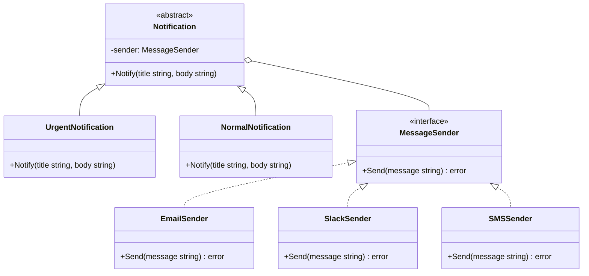

# Bridge / 橋接模式

## Intent / 意圖
> 將抽象與實作分離，使兩者可以獨立變化，避免在多維度變化時產生類別爆炸。

## Problem / 問題情境
你正在開發一個通知系統，通知可以分為「緊急」和「一般」兩種等級（抽象維度），同時可以透過 Email、SMS、Slack 等管道發送（實作維度）。如果用繼承來處理，你需要 `UrgentEmail`、`UrgentSMS`、`UrgentSlack`、`NormalEmail`、`NormalSMS`、`NormalSlack` 共 6 個子類。每新增一種管道或等級，類別數量就會倍數成長。

## Solution / 解決方案
將通知等級（抽象）和發送管道（實作）拆成兩個獨立的階層。抽象層持有一個指向實作層的參考，透過組合而非繼承來橋接兩者。新增管道時只需新增實作類別，新增等級時只需新增抽象子類，兩者的變化完全獨立。

## Structure / 結構



## Participants / 參與者
- **Abstraction（抽象層）**：定義高階控制邏輯（通知等級），持有 Implementor 的參考。
- **Refined Abstraction（精煉抽象）**：擴展抽象層，提供不同的通知行為（如加上 `[URGENT]` 前綴）。
- **Implementor（實作介面）**：定義底層操作的介面（訊息發送）。
- **Concrete Implementor（具體實作）**：實作特定的發送管道（Email、Slack、SMS）。

## Go 實作

```go
package main

import "fmt"

// Implementor: 訊息發送介面
type MessageSender interface {
	Send(message string) error
}

// Concrete Implementor: Email
type EmailSender struct {
	Address string
}

func (e *EmailSender) Send(message string) error {
	fmt.Printf("[Email → %s] %s\n", e.Address, message)
	return nil
}

// Concrete Implementor: Slack
type SlackSender struct {
	Channel string
}

func (s *SlackSender) Send(message string) error {
	fmt.Printf("[Slack #%s] %s\n", s.Channel, message)
	return nil
}

// Abstraction: 通知基底
type Notification struct {
	sender MessageSender
}

// Refined Abstraction: 一般通知
type NormalNotification struct {
	Notification
}

func NewNormalNotification(sender MessageSender) *NormalNotification {
	return &NormalNotification{Notification{sender: sender}}
}

func (n *NormalNotification) Notify(title, body string) {
	msg := fmt.Sprintf("%s: %s", title, body)
	n.sender.Send(msg)
}

// Refined Abstraction: 緊急通知
type UrgentNotification struct {
	Notification
}

func NewUrgentNotification(sender MessageSender) *UrgentNotification {
	return &UrgentNotification{Notification{sender: sender}}
}

func (u *UrgentNotification) Notify(title, body string) {
	msg := fmt.Sprintf("[URGENT] %s: %s", title, body)
	u.sender.Send(msg)
}

func main() {
	email := &EmailSender{Address: "admin@example.com"}
	slack := &SlackSender{Channel: "alerts"}

	normal := NewNormalNotification(email)
	normal.Notify("Deploy", "v2.1.0 deployed successfully")

	urgent := NewUrgentNotification(slack)
	urgent.Notify("CPU Alert", "CPU usage exceeded 95%")

	// 輕鬆切換：緊急通知改用 Email
	urgentEmail := NewUrgentNotification(email)
	urgentEmail.Notify("DB Alert", "Connection pool exhausted")
}

// Output:
// [Email → admin@example.com] Deploy: v2.1.0 deployed successfully
// [Slack #alerts] [URGENT] CPU Alert: CPU usage exceeded 95%
// [Email → admin@example.com] [URGENT] DB Alert: Connection pool exhausted
```

## Rust 實作

```rust
// Implementor: 訊息發送 trait
trait MessageSender {
    fn send(&self, message: &str) -> Result<(), String>;
}

// Concrete Implementor: Email
struct EmailSender {
    address: String,
}

impl MessageSender for EmailSender {
    fn send(&self, message: &str) -> Result<(), String> {
        println!("[Email → {}] {}", self.address, message);
        Ok(())
    }
}

// Concrete Implementor: Slack
struct SlackSender {
    channel: String,
}

impl MessageSender for SlackSender {
    fn send(&self, message: &str) -> Result<(), String> {
        println!("[Slack #{}] {}", self.channel, message);
        Ok(())
    }
}

// Abstraction: 通知 trait
trait Notification {
    fn notify(&self, title: &str, body: &str);
}

// Refined Abstraction: 一般通知
struct NormalNotification {
    sender: Box<dyn MessageSender>,
}

impl NormalNotification {
    fn new(sender: Box<dyn MessageSender>) -> Self {
        Self { sender }
    }
}

impl Notification for NormalNotification {
    fn notify(&self, title: &str, body: &str) {
        let msg = format!("{}: {}", title, body);
        let _ = self.sender.send(&msg);
    }
}

// Refined Abstraction: 緊急通知
struct UrgentNotification {
    sender: Box<dyn MessageSender>,
}

impl UrgentNotification {
    fn new(sender: Box<dyn MessageSender>) -> Self {
        Self { sender }
    }
}

impl Notification for UrgentNotification {
    fn notify(&self, title: &str, body: &str) {
        let msg = format!("[URGENT] {}: {}", title, body);
        let _ = self.sender.send(&msg);
    }
}

fn main() {
    let normal = NormalNotification::new(Box::new(EmailSender {
        address: "admin@example.com".to_string(),
    }));
    normal.notify("Deploy", "v2.1.0 deployed successfully");

    let urgent = UrgentNotification::new(Box::new(SlackSender {
        channel: "alerts".to_string(),
    }));
    urgent.notify("CPU Alert", "CPU usage exceeded 95%");

    let urgent_email = UrgentNotification::new(Box::new(EmailSender {
        address: "admin@example.com".to_string(),
    }));
    urgent_email.notify("DB Alert", "Connection pool exhausted");
}

// Output:
// [Email → admin@example.com] Deploy: v2.1.0 deployed successfully
// [Slack #alerts] [URGENT] CPU Alert: CPU usage exceeded 95%
// [Email → admin@example.com] [URGENT] DB Alert: Connection pool exhausted
```

## Go vs Rust 對照表

| 面向 | Go | Rust |
|------|----|----|
| 抽象分離 | interface 定義 Implementor，struct embedding 組合 | trait 定義 Implementor，`Box<dyn Trait>` 作為欄位 |
| 多型呼叫 | interface 值（implicit vtable） | trait object `Box<dyn Trait>`（explicit vtable） |
| 擴展抽象 | 嵌入 base struct + 自訂方法 | 各自實作同一個 Notification trait |
| 所有權 | 指標或值語意皆可 | `Box` 擁有所有權，確保生命週期安全 |

## When to Use / 適用場景
- 系統存在兩個以上獨立變化的維度（如平台 x 渲染引擎、通知等級 x 發送管道），需要避免類別爆炸。
- 希望在執行期動態切換實作（例如根據設定檔切換發送管道），而不影響上層抽象邏輯。
- 需要讓抽象層與實作層各自獨立演進、測試與部署。

## When NOT to Use / 不適用場景
- 只有單一變化維度時（例如只有不同的發送管道），直接用 Strategy 模式更簡潔。
- 兩個維度之間存在強耦合，無法真正獨立變化時，強行套用 Bridge 只會增加不必要的複雜度。

## Real-World Examples / 真實世界案例
- **Go `database/sql`**：`sql.DB`（抽象層）與 `driver.Driver`（實作層）的分離，讓應用程式碼不需要知道底層是 PostgreSQL 還是 MySQL。
- **Rust `std::io::Read` / `BufReader`**：`BufReader<R>` 將 buffering 策略（抽象）與底層 reader（實作）分離。
- **GUI 框架跨平台渲染**：抽象 Widget 層與平台特定繪圖引擎的分離（如 Qt 的繪圖後端）。

## Related Patterns / 相關模式
- [Adapter](06_adapter.md)：Adapter 在事後修補介面不相容，Bridge 在設計時就計畫好抽象與實作的分離。
- [Strategy](../behavioral/strategy.md)：Strategy 專注在演算法的可替換性，Bridge 處理兩個維度的獨立變化。
- [Abstract Factory](../creational/abstract_factory.md)：Abstract Factory 可用來建立 Bridge 中的具體實作物件。

## Pitfalls / 常見陷阱
- **過度設計**：當變化維度只有一個時，強行套用 Bridge 反而增加複雜度。先確認確實有兩個以上獨立變化的維度。
- **抽象洩漏**：如果 Refined Abstraction 需要存取 Implementor 的內部細節（如特定 SDK 的設定參數），Bridge 的分離就被破壞了。應確保 Implementor 介面足夠通用。
- **初始化複雜**：需要正確組合抽象與實作，容易出錯。建議搭配 Factory 或 Builder 來簡化物件組裝。

## References / 參考資料
- *Design Patterns: Elements of Reusable Object-Oriented Software* — Gamma et al. (GoF), Chapter: Bridge
- *Head First Design Patterns* — Freeman & Robson
- [Refactoring Guru — Bridge](https://refactoring.guru/design-patterns/bridge)
- [Go database/sql package](https://pkg.go.dev/database/sql)
