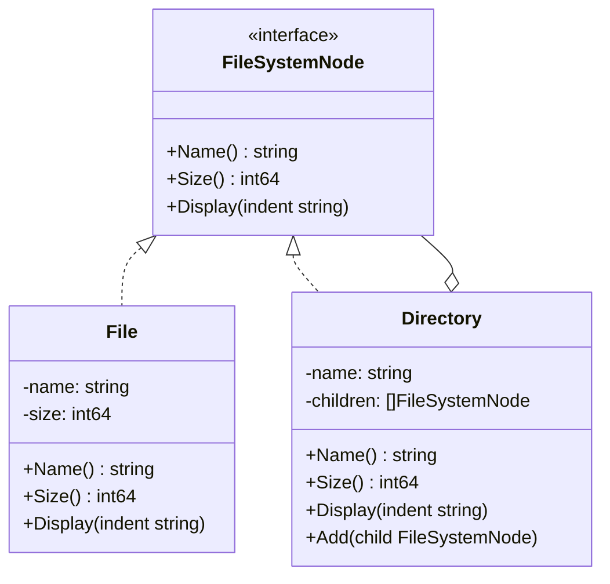

# Composite / 組合模式

## Intent / 意圖
> 將物件組合成樹狀結構來表示「部分-整體」的階層關係，讓客戶端能以一致的方式處理個別物件與物件組合。

## Problem / 問題情境
你正在開發一個檔案系統的權限計算功能。檔案系統中有「檔案」和「資料夾」兩種節點，資料夾可以包含檔案或其他資料夾。要計算某個資料夾的總大小，你需要遞迴地加總所有子項目。如果不用 Composite，客戶端必須用 type switch 區分檔案和資料夾，每新增一種節點類型就要修改所有遍歷邏輯。

## Solution / 解決方案
定義一個統一的 Component 介面，讓 Leaf（檔案）和 Composite（資料夾）都實作同一個介面。Composite 持有一個 Component 的集合，並在介面方法中遞迴委派給子項目。客戶端透過 Component 介面操作，不需要知道操作的是單一物件還是組合。

## Structure / 結構



## Participants / 參與者
- **Component（元件介面）**：宣告組合中所有物件的共用介面（如 `Size()`、`Display()`）。
- **Leaf（葉節點）**：代表組合中的終端物件（檔案），不包含子項目。
- **Composite（組合節點）**：代表包含子項目的容器（資料夾），儲存子 Component 並在方法中遞迴委派。
- **Client（客戶端）**：透過 Component 介面操作，不區分 Leaf 與 Composite。

## Go 實作

```go
package main

import "fmt"

// Component: 檔案系統節點介面
type FileSystemNode interface {
	Name() string
	Size() int64
	Display(indent string)
}

// Leaf: 檔案
type File struct {
	name string
	size int64
}

func NewFile(name string, size int64) *File {
	return &File{name: name, size: size}
}

func (f *File) Name() string { return f.name }
func (f *File) Size() int64  { return f.size }
func (f *File) Display(indent string) {
	fmt.Printf("%s📄 %s (%d bytes)\n", indent, f.name, f.size)
}

// Composite: 資料夾
type Directory struct {
	name     string
	children []FileSystemNode
}

func NewDirectory(name string) *Directory {
	return &Directory{name: name}
}

func (d *Directory) Name() string { return d.name }

func (d *Directory) Size() int64 {
	var total int64
	for _, child := range d.children {
		total += child.Size()
	}
	return total
}

func (d *Directory) Display(indent string) {
	fmt.Printf("%s📁 %s/ (%d bytes)\n", indent, d.name, d.Size())
	for _, child := range d.children {
		child.Display(indent + "  ")
	}
}

func (d *Directory) Add(child FileSystemNode) {
	d.children = append(d.children, child)
}

func main() {
	// 建立檔案樹
	src := NewDirectory("src")
	src.Add(NewFile("main.go", 1200))
	src.Add(NewFile("handler.go", 3400))

	tests := NewDirectory("tests")
	tests.Add(NewFile("main_test.go", 800))

	root := NewDirectory("project")
	root.Add(src)
	root.Add(tests)
	root.Add(NewFile("go.mod", 150))

	// 客戶端統一操作
	root.Display("")
	fmt.Printf("\nTotal size: %d bytes\n", root.Size())
}

// Output:
// 📁 project/ (5550 bytes)
//   📁 src/ (4600 bytes)
//     📄 main.go (1200 bytes)
//     📄 handler.go (3400 bytes)
//   📁 tests/ (800 bytes)
//     📄 main_test.go (800 bytes)
//   📄 go.mod (150 bytes)
//
// Total size: 5550 bytes
```

## Rust 實作

```rust
// Component: 檔案系統節點 trait
trait FileSystemNode {
    fn name(&self) -> &str;
    fn size(&self) -> u64;
    fn display(&self, indent: &str);
}

// Leaf: 檔案
struct File {
    name: String,
    size: u64,
}

impl File {
    fn new(name: &str, size: u64) -> Self {
        Self {
            name: name.to_string(),
            size,
        }
    }
}

impl FileSystemNode for File {
    fn name(&self) -> &str {
        &self.name
    }

    fn size(&self) -> u64 {
        self.size
    }

    fn display(&self, indent: &str) {
        println!("{} {} ({} bytes)", indent, self.name, self.size);
    }
}

// Composite: 資料夾（使用 Box 處理遞迴結構）
struct Directory {
    name: String,
    children: Vec<Box<dyn FileSystemNode>>,
}

impl Directory {
    fn new(name: &str) -> Self {
        Self {
            name: name.to_string(),
            children: Vec::new(),
        }
    }

    fn add(&mut self, child: Box<dyn FileSystemNode>) {
        self.children.push(child);
    }
}

impl FileSystemNode for Directory {
    fn name(&self) -> &str {
        &self.name
    }

    fn size(&self) -> u64 {
        self.children.iter().map(|c| c.size()).sum()
    }

    fn display(&self, indent: &str) {
        println!("{} {}/ ({} bytes)", indent, self.name, self.size());
        let child_indent = format!("{}  ", indent);
        for child in &self.children {
            child.display(&child_indent);
        }
    }
}

fn main() {
    let mut src = Directory::new("src");
    src.add(Box::new(File::new("main.rs", 1200)));
    src.add(Box::new(File::new("handler.rs", 3400)));

    let mut tests = Directory::new("tests");
    tests.add(Box::new(File::new("main_test.rs", 800)));

    let mut root = Directory::new("project");
    root.add(Box::new(src));
    root.add(Box::new(tests));
    root.add(Box::new(File::new("Cargo.toml", 150)));

    root.display("");
    println!("\nTotal size: {} bytes", root.size());
}

// Output:
//  project/ (5550 bytes)
//    src/ (4600 bytes)
//      main.rs (1200 bytes)
//      handler.rs (3400 bytes)
//    tests/ (800 bytes)
//      main_test.rs (800 bytes)
//    Cargo.toml (150 bytes)
//
// Total size: 5550 bytes
```

## Go vs Rust 對照表

| 面向 | Go | Rust |
|------|----|----|
| 遞迴結構 | interface slice `[]FileSystemNode` | `Vec<Box<dyn FileSystemNode>>` 透過 Box 間接持有 |
| 多型容器 | interface 值自帶 indirection | 必須顯式使用 `Box<dyn Trait>` 或 enum |
| 替代方案 | 無，主要依賴 interface | 可用 `enum` + `Box` 遞迴（封閉集合更慣用） |
| 記憶體管理 | GC 自動管理 | Box 擁有所有權，drop 時自動釋放 |

## When to Use / 適用場景
- 需要表示「部分-整體」的樹狀結構，如檔案系統、組織架構圖、UI 元件樹。
- 希望客戶端以統一的方式處理個別物件與物件組合，不需要區分 Leaf 和 Composite。
- 需要遞迴地計算聚合值（如大小、成本、權限）。

## When NOT to Use / 不適用場景
- 結構是扁平的，沒有巢狀關係時，直接用 list 就夠了。
- 當 Leaf 和 Composite 的介面差異太大，強制統一介面反而導致大量不適用的方法（如 Leaf 不支援 `Add()`）。

## Real-World Examples / 真實世界案例
- **`net/http` Handler 組合**：Go 的 `http.ServeMux` 是一個 Composite，內部持有多個 `http.Handler`（可以是單一 handler 或另一個 mux）。
- **React / DOM 元件樹**：UI 框架中每個元件可以包含子元件，渲染時遞迴遍歷整棵樹。
- **Kubernetes API 資源**：Deployment 包含 ReplicaSet，ReplicaSet 包含 Pod，形成樹狀結構。

## Related Patterns / 相關模式
- [Decorator](09_decorator.md)：Decorator 經常與 Composite 搭配使用，Decorator 可以裝飾 Composite 中的任何節點。
- [Flyweight](11_flyweight.md)：當 Composite 樹中有大量相似的 Leaf 節點時，可用 Flyweight 共享狀態以節省記憶體。
- [Visitor](../behavioral/visitor.md)：Visitor 可以遍歷 Composite 樹並對每個節點執行不同操作。
- [Iterator](../behavioral/iterator.md)：Iterator 可以提供統一的方式來遍歷 Composite 結構。

## Pitfalls / 常見陷阱
- **過度通用的介面**：為了統一 Leaf 和 Composite，Component 介面可能包含 `Add()`、`Remove()` 等只有 Composite 需要的方法，Leaf 實作這些方法時只能回傳錯誤或 panic。
- **迴圈參考**：如果不小心讓子節點指回祖先節點，遞迴操作會無限迴圈。Rust 的所有權機制天然防止此問題，Go 則需要開發者自行確保。
- **效能問題**：深度巢狀的樹在遞迴遍歷時可能導致 stack overflow 或效能問題，大型樹應考慮迭代式遍歷。

## References / 參考資料
- *Design Patterns: Elements of Reusable Object-Oriented Software* — Gamma et al. (GoF), Chapter: Composite
- [Refactoring Guru — Composite](https://refactoring.guru/design-patterns/composite)
- [Go `net/http` package](https://pkg.go.dev/net/http)
- [Rust Book — Enums and Pattern Matching](https://doc.rust-lang.org/book/ch06-00-enums.html)
