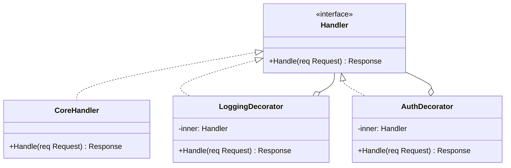

# Decorator / 裝飾者模式

## Intent / 意圖
> 動態地為物件附加額外的職責，提供比繼承更彈性的擴展方式。

## Problem / 問題情境
你正在開發一個 HTTP middleware 系統。核心 handler 處理業務邏輯，但你還需要在不同場景加上 logging、authentication、rate limiting、response compression 等功能。如果用繼承，每種組合都是一個新的子類（`LoggingAuthHandler`、`LoggingRateLimitHandler`...），組合爆炸且無法在執行期動態調整。

## Solution / 解決方案
讓每個額外功能（logging、auth 等）都封裝成一個 Decorator，它實作與核心 handler 相同的介面，並持有一個被裝飾物件的參考。Decorator 在呼叫被裝飾物件前後執行自己的邏輯。多個 Decorator 可以像洋蔥一樣層層包裹，執行時由外向內穿透。

## Structure / 結構



## Participants / 參與者
- **Component（元件介面）**：定義可被動態裝飾的物件介面。
- **Concrete Component（具體元件）**：核心物件，提供基本功能。
- **Decorator（裝飾者基底）**：持有 Component 參考，實作 Component 介面並委派呼叫。
- **Concrete Decorator（具體裝飾者）**：在委派前後加入額外行為。

## Go 實作

```go
package main

import (
	"fmt"
	"strings"
	"time"
)

// Component: HTTP handler 介面
type Handler interface {
	Handle(req string) string
}

// Concrete Component: 核心業務 handler
type APIHandler struct{}

func (h *APIHandler) Handle(req string) string {
	return fmt.Sprintf(`{"data": "response for %s"}`, req)
}

// Concrete Decorator: Logging
type LoggingDecorator struct {
	inner Handler
}

func WithLogging(h Handler) Handler {
	return &LoggingDecorator{inner: h}
}

func (d *LoggingDecorator) Handle(req string) string {
	start := time.Now()
	fmt.Printf("[LOG] Incoming request: %s\n", req)
	resp := d.inner.Handle(req)
	fmt.Printf("[LOG] Completed in %v\n", time.Since(start))
	return resp
}

// Concrete Decorator: Authentication
type AuthDecorator struct {
	inner    Handler
	apiToken string
}

func WithAuth(h Handler, token string) Handler {
	return &AuthDecorator{inner: h, apiToken: token}
}

func (d *AuthDecorator) Handle(req string) string {
	if !strings.Contains(req, "token="+d.apiToken) {
		return `{"error": "unauthorized"}`
	}
	fmt.Println("[AUTH] Token verified")
	return d.inner.Handle(req)
}

// Concrete Decorator: Response Uppercasing (模擬壓縮/轉換)
type UppercaseDecorator struct {
	inner Handler
}

func WithUppercase(h Handler) Handler {
	return &UppercaseDecorator{inner: h}
}

func (d *UppercaseDecorator) Handle(req string) string {
	resp := d.inner.Handle(req)
	return strings.ToUpper(resp)
}

func main() {
	// 層層裝飾：Logging → Auth → Uppercase → Core
	handler := WithLogging(
		WithAuth(
			WithUppercase(&APIHandler{}),
			"secret123",
		),
	)

	fmt.Println("--- Valid request ---")
	resp := handler.Handle("/api/users?token=secret123")
	fmt.Println("Response:", resp)

	fmt.Println("\n--- Invalid request ---")
	resp = handler.Handle("/api/users")
	fmt.Println("Response:", resp)
}

// Output:
// --- Valid request ---
// [LOG] Incoming request: /api/users?token=secret123
// [AUTH] Token verified
// [LOG] Completed in ...
// Response: {"DATA": "RESPONSE FOR /API/USERS?TOKEN=SECRET123"}
//
// --- Invalid request ---
// [LOG] Incoming request: /api/users
// [LOG] Completed in ...
// Response: {"error": "unauthorized"}
```

## Rust 實作

```rust
// Component: Handler trait
trait Handler {
    fn handle(&self, req: &str) -> String;
}

// Concrete Component: 核心業務 handler
struct ApiHandler;

impl Handler for ApiHandler {
    fn handle(&self, req: &str) -> String {
        format!(r#"{{"data": "response for {}"}}"#, req)
    }
}

// Concrete Decorator: Logging
struct LoggingDecorator {
    inner: Box<dyn Handler>,
}

impl LoggingDecorator {
    fn new(inner: Box<dyn Handler>) -> Self {
        Self { inner }
    }
}

impl Handler for LoggingDecorator {
    fn handle(&self, req: &str) -> String {
        println!("[LOG] Incoming request: {}", req);
        let resp = self.inner.handle(req);
        println!("[LOG] Request completed");
        resp
    }
}

// Concrete Decorator: Authentication
struct AuthDecorator {
    inner: Box<dyn Handler>,
    api_token: String,
}

impl AuthDecorator {
    fn new(inner: Box<dyn Handler>, token: &str) -> Self {
        Self {
            inner,
            api_token: token.to_string(),
        }
    }
}

impl Handler for AuthDecorator {
    fn handle(&self, req: &str) -> String {
        let expected = format!("token={}", self.api_token);
        if !req.contains(&expected) {
            return r#"{"error": "unauthorized"}"#.to_string();
        }
        println!("[AUTH] Token verified");
        self.inner.handle(req)
    }
}

// Concrete Decorator: Uppercase
struct UppercaseDecorator {
    inner: Box<dyn Handler>,
}

impl UppercaseDecorator {
    fn new(inner: Box<dyn Handler>) -> Self {
        Self { inner }
    }
}

impl Handler for UppercaseDecorator {
    fn handle(&self, req: &str) -> String {
        self.inner.handle(req).to_uppercase()
    }
}

fn main() {
    // 層層裝飾：Logging → Auth → Uppercase → Core
    let handler = LoggingDecorator::new(Box::new(AuthDecorator::new(
        Box::new(UppercaseDecorator::new(Box::new(ApiHandler))),
        "secret123",
    )));

    println!("--- Valid request ---");
    let resp = handler.handle("/api/users?token=secret123");
    println!("Response: {}", resp);

    println!("\n--- Invalid request ---");
    let resp = handler.handle("/api/users");
    println!("Response: {}", resp);
}

// Output:
// --- Valid request ---
// [LOG] Incoming request: /api/users?token=secret123
// [AUTH] Token verified
// [LOG] Request completed
// Response: {"DATA": "RESPONSE FOR /API/USERS?TOKEN=SECRET123"}
//
// --- Invalid request ---
// [LOG] Incoming request: /api/users
// [LOG] Request completed
// Response: {"error": "unauthorized"}
```

## Go vs Rust 對照表

| 面向 | Go | Rust |
|------|----|----|
| 裝飾方式 | wrapping struct 持有 interface 值 | struct 持有 `Box<dyn Trait>` |
| 建構語法 | `WithXxx(inner)` 函式回傳 interface | `XxxDecorator::new(Box::new(inner))` |
| 函式式風格 | `http.HandlerFunc` 可直接用 closure | 可用 closure 搭配 `impl Fn` |
| 層疊堆叠 | 函式嵌套呼叫 | `Box::new` 嵌套，型別較冗長 |

## When to Use / 適用場景
- 需要在不修改既有程式碼的前提下，動態地為物件增加功能（如 HTTP middleware、I/O stream 處理）。
- 功能的組合是可選且多變的，無法在編譯期窮舉所有組合。
- 想遵循 Single Responsibility Principle，每個 Decorator 只負責一個橫切關注點。

## When NOT to Use / 不適用場景
- Decorator 的順序很重要但難以管理時（例如 auth 必須在 logging 之後但壓縮必須在最外層），容易出錯。
- 只需要簡單的靜態擴展時，直接用 struct embedding（Go）或 trait default method（Rust）更簡潔。

## Real-World Examples / 真實世界案例
- **Go `net/http` middleware**：Go 的 HTTP middleware 就是典型的 Decorator，如 `http.TimeoutHandler`、`http.StripPrefix`，每個都接收一個 `http.Handler` 並回傳裝飾後的 `http.Handler`。
- **Go `io.Reader` 包裝**：`bufio.NewReader(r)` 裝飾 `io.Reader` 加上 buffering，`gzip.NewReader(r)` 加上解壓縮，可以任意組合。
- **Rust `tower` crate**：`tower::ServiceBuilder` 用 layer 機制實現 Decorator 堆疊，每個 layer 包裝 inner service。
- **Java I/O Streams**：`BufferedInputStream(new FileInputStream(...))` 是教科書級的 Decorator 範例。

## Related Patterns / 相關模式
- [Adapter](06_adapter.md)：Adapter 改變介面，Decorator 不改變介面而是增加行為。
- [Composite](08_composite.md)：Composite 是結構上的遞迴組合，Decorator 是行為上的遞迴包裝。兩者經常搭配使用。
- [Strategy](../behavioral/strategy.md)：Strategy 替換內部演算法，Decorator 在外層包裹額外行為。

## Pitfalls / 常見陷阱
- **順序敏感**：Decorator 的堆疊順序會影響行為。例如 Logging 在 Auth 外面 vs 裡面，記錄的內容完全不同。需要明確文件化預期順序。
- **Debug 困難**：多層 Decorator 嵌套後，追蹤執行流程變得困難。建議每個 Decorator 加上清楚的 log 標記。
- **介面膨脹**：如果 Component 介面有很多方法，每個 Decorator 都必須實作所有方法（即使大多只是委派），造成大量樣板程式碼。Go 的 struct embedding 可以部分緩解此問題。

## References / 參考資料
- *Design Patterns: Elements of Reusable Object-Oriented Software* — Gamma et al. (GoF), Chapter: Decorator
- *Head First Design Patterns* — Freeman & Robson, Chapter 3
- [Refactoring Guru — Decorator](https://refactoring.guru/design-patterns/decorator)
- [Go `net/http` middleware patterns](https://pkg.go.dev/net/http)
- [Rust `tower` crate](https://docs.rs/tower/latest/tower/)
