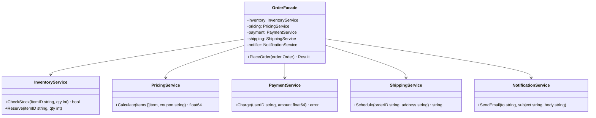

# Facade / 外觀模式

## Intent / 意圖
> 為複雜的子系統提供一個統一的簡化介面，降低客戶端與子系統之間的耦合。

## Problem / 問題情境
你正在開發一個電商系統的「下單」功能。下單流程涉及多個子系統：庫存檢查、價格計算（含折扣）、付款處理、物流排程、通知發送。客戶端如果直接呼叫這五個子系統，需要了解每個子系統的 API、呼叫順序、錯誤處理邏輯。任何子系統的介面變更都會波及所有呼叫端。

## Solution / 解決方案
建立一個 Facade 物件，封裝子系統的複雜互動邏輯，對外提供一個簡潔的高階方法（如 `PlaceOrder()`）。客戶端只需呼叫 Facade，不需要知道內部涉及哪些子系統。Facade 不會取代子系統——進階使用者仍可直接存取子系統。

## Structure / 結構



## Participants / 參與者
- **Facade（外觀）**：知道哪些子系統負責哪些功能，將客戶端請求委派給對應的子系統。
- **Subsystem Classes（子系統類別）**：實作子系統功能，處理 Facade 委派的工作。不知道 Facade 的存在。
- **Client（客戶端）**：透過 Facade 存取子系統功能，不直接與子系統互動。

## Go 實作

```go
package main

import "fmt"

// Subsystem: 庫存服務
type InventoryService struct{}

func (s *InventoryService) CheckStock(itemID string, qty int) bool {
	fmt.Printf("[Inventory] Checking stock for %s (qty: %d)\n", itemID, qty)
	return true
}

func (s *InventoryService) Reserve(itemID string, qty int) {
	fmt.Printf("[Inventory] Reserved %d units of %s\n", qty, itemID)
}

// Subsystem: 定價服務
type PricingService struct{}

func (s *PricingService) Calculate(itemID string, qty int, coupon string) float64 {
	base := 29.99 * float64(qty)
	if coupon == "SAVE10" {
		base *= 0.9
	}
	fmt.Printf("[Pricing] Total: $%.2f (coupon: %s)\n", base, coupon)
	return base
}

// Subsystem: 付款服務
type PaymentService struct{}

func (s *PaymentService) Charge(userID string, amount float64) error {
	fmt.Printf("[Payment] Charged $%.2f to user %s\n", amount, userID)
	return nil
}

// Subsystem: 物流服務
type ShippingService struct{}

func (s *ShippingService) Schedule(orderID, address string) string {
	trackingNo := "TRK-" + orderID
	fmt.Printf("[Shipping] Scheduled %s → %s\n", trackingNo, address)
	return trackingNo
}

// Subsystem: 通知服務
type NotificationService struct{}

func (s *NotificationService) SendEmail(to, subject, body string) {
	fmt.Printf("[Notification] Email to %s: %s\n", to, subject)
}

// Facade: 統一的下單介面
type OrderFacade struct {
	inventory    *InventoryService
	pricing      *PricingService
	payment      *PaymentService
	shipping     *ShippingService
	notification *NotificationService
}

func NewOrderFacade() *OrderFacade {
	return &OrderFacade{
		inventory:    &InventoryService{},
		pricing:      &PricingService{},
		payment:      &PaymentService{},
		shipping:     &ShippingService{},
		notification: &NotificationService{},
	}
}

type OrderRequest struct {
	UserID  string
	Email   string
	ItemID  string
	Qty     int
	Coupon  string
	Address string
}

func (f *OrderFacade) PlaceOrder(req OrderRequest) (string, error) {
	// 1. 檢查庫存
	if !f.inventory.CheckStock(req.ItemID, req.Qty) {
		return "", fmt.Errorf("item %s out of stock", req.ItemID)
	}

	// 2. 計算價格
	total := f.pricing.Calculate(req.ItemID, req.Qty, req.Coupon)

	// 3. 扣款
	if err := f.payment.Charge(req.UserID, total); err != nil {
		return "", fmt.Errorf("payment failed: %w", err)
	}

	// 4. 預留庫存
	f.inventory.Reserve(req.ItemID, req.Qty)

	// 5. 排程出貨
	orderID := "ORD-20260217-001"
	tracking := f.shipping.Schedule(orderID, req.Address)

	// 6. 發送通知
	f.notification.SendEmail(req.Email, "Order Confirmed",
		fmt.Sprintf("Your order %s is on the way! Tracking: %s", orderID, tracking))

	return orderID, nil
}

func main() {
	facade := NewOrderFacade()

	orderID, err := facade.PlaceOrder(OrderRequest{
		UserID:  "user-42",
		Email:   "alice@example.com",
		ItemID:  "SKU-1001",
		Qty:     2,
		Coupon:  "SAVE10",
		Address: "123 Main St, Taipei",
	})

	if err != nil {
		fmt.Println("Order failed:", err)
		return
	}
	fmt.Printf("\nOrder placed successfully: %s\n", orderID)
}

// Output:
// [Inventory] Checking stock for SKU-1001 (qty: 2)
// [Pricing] Total: $53.98 (coupon: SAVE10)
// [Payment] Charged $53.98 to user user-42
// [Inventory] Reserved 2 units of SKU-1001
// [Shipping] Scheduled TRK-ORD-20260217-001 → 123 Main St, Taipei
// [Notification] Email to alice@example.com: Order Confirmed
//
// Order placed successfully: ORD-20260217-001
```

## Rust 實作

```rust
// Subsystem: 庫存服務
struct InventoryService;

impl InventoryService {
    fn check_stock(&self, item_id: &str, qty: u32) -> bool {
        println!("[Inventory] Checking stock for {} (qty: {})", item_id, qty);
        true
    }

    fn reserve(&self, item_id: &str, qty: u32) {
        println!("[Inventory] Reserved {} units of {}", qty, item_id);
    }
}

// Subsystem: 定價服務
struct PricingService;

impl PricingService {
    fn calculate(&self, _item_id: &str, qty: u32, coupon: &str) -> f64 {
        let mut base = 29.99 * qty as f64;
        if coupon == "SAVE10" {
            base *= 0.9;
        }
        println!("[Pricing] Total: ${:.2} (coupon: {})", base, coupon);
        base
    }
}

// Subsystem: 付款服務
struct PaymentService;

impl PaymentService {
    fn charge(&self, user_id: &str, amount: f64) -> Result<(), String> {
        println!("[Payment] Charged ${:.2} to user {}", amount, user_id);
        Ok(())
    }
}

// Subsystem: 物流服務
struct ShippingService;

impl ShippingService {
    fn schedule(&self, order_id: &str, address: &str) -> String {
        let tracking = format!("TRK-{}", order_id);
        println!("[Shipping] Scheduled {} -> {}", tracking, address);
        tracking
    }
}

// Subsystem: 通知服務
struct NotificationService;

impl NotificationService {
    fn send_email(&self, to: &str, subject: &str, _body: &str) {
        println!("[Notification] Email to {}: {}", to, subject);
    }
}

// Facade: 統一的下單介面
struct OrderFacade {
    inventory: InventoryService,
    pricing: PricingService,
    payment: PaymentService,
    shipping: ShippingService,
    notification: NotificationService,
}

struct OrderRequest {
    user_id: String,
    email: String,
    item_id: String,
    qty: u32,
    coupon: String,
    address: String,
}

impl OrderFacade {
    fn new() -> Self {
        Self {
            inventory: InventoryService,
            pricing: PricingService,
            payment: PaymentService,
            shipping: ShippingService,
            notification: NotificationService,
        }
    }

    fn place_order(&self, req: &OrderRequest) -> Result<String, String> {
        // 1. 檢查庫存
        if !self.inventory.check_stock(&req.item_id, req.qty) {
            return Err(format!("item {} out of stock", req.item_id));
        }

        // 2. 計算價格
        let total = self.pricing.calculate(&req.item_id, req.qty, &req.coupon);

        // 3. 扣款
        self.payment.charge(&req.user_id, total)?;

        // 4. 預留庫存
        self.inventory.reserve(&req.item_id, req.qty);

        // 5. 排程出貨
        let order_id = "ORD-20260217-001".to_string();
        let tracking = self.shipping.schedule(&order_id, &req.address);

        // 6. 發送通知
        self.notification.send_email(
            &req.email,
            "Order Confirmed",
            &format!("Your order {} is on the way! Tracking: {}", order_id, tracking),
        );

        Ok(order_id)
    }
}

fn main() {
    let facade = OrderFacade::new();

    let req = OrderRequest {
        user_id: "user-42".to_string(),
        email: "alice@example.com".to_string(),
        item_id: "SKU-1001".to_string(),
        qty: 2,
        coupon: "SAVE10".to_string(),
        address: "123 Main St, Taipei".to_string(),
    };

    match facade.place_order(&req) {
        Ok(order_id) => println!("\nOrder placed successfully: {}", order_id),
        Err(e) => println!("Order failed: {}", e),
    }
}

// Output:
// [Inventory] Checking stock for SKU-1001 (qty: 2)
// [Pricing] Total: $53.98 (coupon: SAVE10)
// [Payment] Charged $53.98 to user user-42
// [Inventory] Reserved 2 units of SKU-1001
// [Shipping] Scheduled TRK-ORD-20260217-001 -> 123 Main St, Taipei
// [Notification] Email to alice@example.com: Order Confirmed
//
// Order placed successfully: ORD-20260217-001
```

## Go vs Rust 對照表

| 面向 | Go | Rust |
|------|----|----|
| Facade 形式 | struct 持有子系統指標，提供 package-level 函式 | struct 持有子系統，module public API 限定可見性 |
| 存取控制 | 首字母大小寫控制 exported/unexported | `pub` / `pub(crate)` / private 精細控制 |
| 錯誤傳播 | `if err != nil { return err }` | `?` 運算子簡潔傳播 |
| 子系統隱藏 | internal package 可完全隱藏 | module 私有型別外部無法存取 |

## When to Use / 適用場景
- 子系統有大量類別和複雜的互動流程，客戶端只需要使用其中一小部分功能。
- 想要為多層架構中的每一層定義一個入口點，減少跨層依賴。
- 需要將 legacy 系統的複雜 API 封裝成簡潔介面給新系統使用。

## When NOT to Use / 不適用場景
- Facade 變成了「God Object」，承擔了太多邏輯而不是簡單委派——此時應拆分為多個更小的 Facade。
- 所有客戶端都需要存取子系統的完整功能，Facade 反而成為多餘的中間層。

## Real-World Examples / 真實世界案例
- **Go `net/http` package**：`http.ListenAndServe()` 是一個 Facade，封裝了 TCP listener 建立、TLS 設定、connection 管理等複雜流程。
- **Rust `reqwest` crate**：`reqwest::get(url)` 一個函式呼叫封裝了 DNS 解析、TCP 連線、TLS 握手、HTTP 協議處理等子系統。
- **Docker CLI**：`docker run` 是一個 Facade，背後涉及 image pull、container create、network setup、volume mount 等子系統。

## Related Patterns / 相關模式
- [Mediator](../behavioral/mediator.md)：Mediator 協調多個物件之間的互動，Facade 提供單向的簡化介面。Mediator 的參與者彼此知道 Mediator，Facade 的子系統不知道 Facade。
- [Abstract Factory](../creational/abstract_factory.md)：Abstract Factory 可以與 Facade 搭配，Facade 內部使用 Factory 來建立子系統物件。

## Pitfalls / 常見陷阱
- **God Facade**：Facade 承擔了太多業務邏輯（而不僅僅是委派），變成了一個龐大的「上帝物件」。Facade 應該只負責 orchestration，不應包含業務規則。
- **過度封裝**：把所有子系統操作都包在 Facade 裡，導致進階使用者無法直接存取子系統。Facade 應該是「額外的選擇」，不是「唯一的入口」。
- **測試困難**：如果子系統沒有透過介面注入，Facade 會難以做單元測試。建議子系統透過 interface（Go）或 trait（Rust）注入。

## References / 參考資料
- *Design Patterns: Elements of Reusable Object-Oriented Software* — Gamma et al. (GoF), Chapter: Facade
- [Refactoring Guru — Facade](https://refactoring.guru/design-patterns/facade)
- [Go `net/http` package](https://pkg.go.dev/net/http)
- [Rust `reqwest` crate](https://docs.rs/reqwest/latest/reqwest/)
